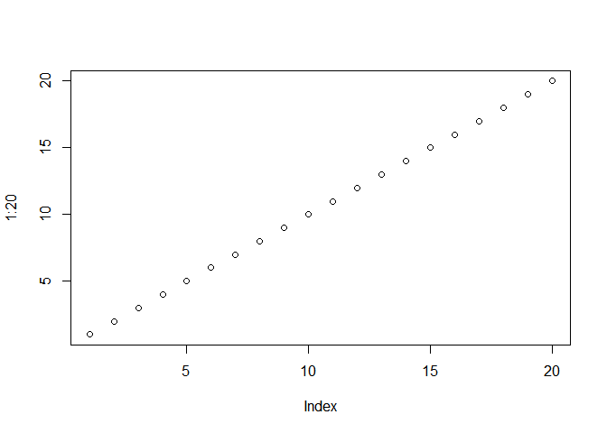

## Data Visualizations Review

### [Satellites Orbiting Earth](https://qz.com/296941/interactive-graphic-every-active-satellite-orbiting-earth)

**The good:** This is a very attractive graph ordered in a logical way—the highest satellites shown farthest from the Earth's surface. It includes the launch weight of each satellite represented as visual weight. 

**The not-so-good:** It took me some time and quite a bit of a cognitive load to figure out why the graph was upside down, with higher satellites shown first. It's because the Earth is shown on top. Also, the color representing each country requires a table lookup, which in turns requires an up-scroll of the page for the majority of the graph.

### [State of the Union Address Minute by Minute (Top Graph)](http://twitter.github.io/interactive/sotu2014/#p1)

**The good:** It is immediately obvious that the visualization shows some sort of topic volume during the course of the State of the Union address. While not part of the graph, I can see from the nearby page title that the data came from Twitter. The graph is simple and has gridlines that are useful but not overbearing. The hashtags appear within their respective colors, requiring no lookups (though **#immigration** is missing a label).

**The not-so-good:** I'm not sure if this is is a big topic in data visualization, but it should be: [an estimated 9 percent of humans are colorblind](https://en.wikipedia.org/wiki/Color_blindness) in some way. Using nothing but hue (or worse, two different degrees of saturation for the same hue, as this graph does with each color) to distinguish items could leave roughly one tenth of the population clueless as to the presented.

### [The American Workday](https://www.npr.org/sections/money/2014/08/27/343415569/whos-in-the-office-the-american-workday-in-one-graph?/templates/story/story_php=)

**The good:** A clear, concise, and widely understood way to represent population percentages. The selection of visualization method itself helps the audience understand its meaning. There aren't any fancy extraneous elements that cloud up the data.

**The not-so-good:** There are too many lines. Hovering with the mouse cursor over each line shows the label. So, what about people without mice, those potential millions who will see this graph on their mobile devices?

### [Millenial Generation Size and Diversity](http://money.cnn.com/interactive/economy/diversity-millennials-boomers/)

**The good:** Interactivity! Life is easier when graphs are interactive. Also, the graph makes it easy to see the growth over time of each series and for the population as a whole, along with the size relationship between groups.

**The not-so-good:** Table lookups are cognitively expensive. There is plenty of space in the data series to label the categories directly inside of them. Also color, as mentioned above.

## Embedded Code Snippet


```r
plot(1:20)
```

<!-- -->
