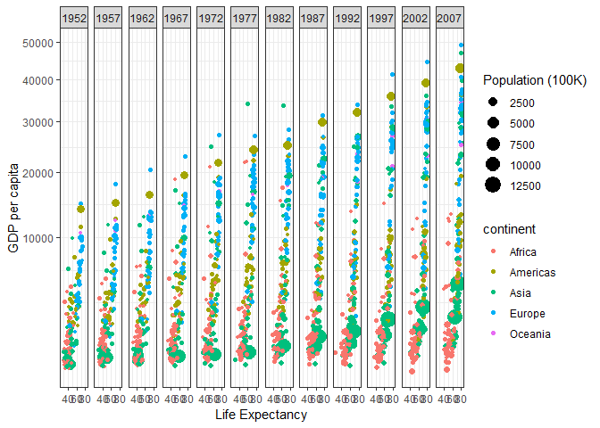
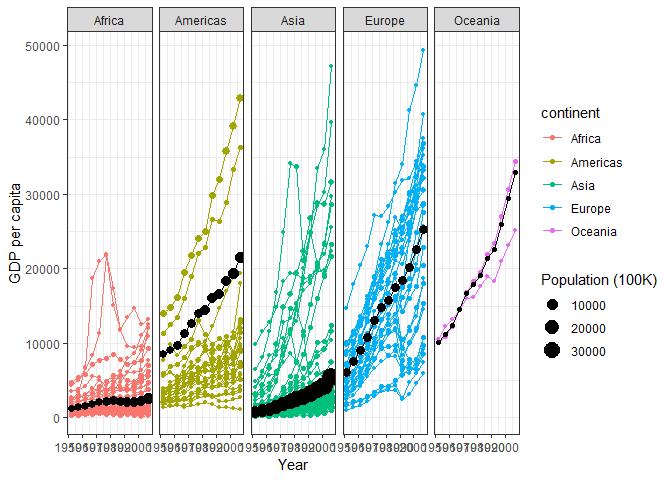

## Background

I have been programming in one form or another for about 10 years; even so, it's incredible to me that I can type a few simple lines of code and have a graph that summarizes a gigantic data set come out the other end. It's fascinating.

As magical as it may seem, the reality makes sense: as the reading taught, every graph ever is a combination of seven parameters.

Creating the bulk of the graphs was a relative breeze, but adding the weighted averages for the second one---that was a different story.

## Images

### Relationship between life expectancy and GDP per country over time


```r
library(dplyr)
library(ggplot2)
library(gapminder)

# Remove the dubious Kuwait data
proper_data <- filter(gapminder, country != "Kuwait")

# Drawr the datar
proper_data %>%
  ggplot(mapping = aes(x = lifeExp, y = gdpPercap, size = pop / 100000, color = continent)) +
    geom_point() +
    labs(x = "Life Expectancy", y = "GDP per capita", size = "Population (100K)") +
    facet_wrap(~ year, nrow = 1) +
    scale_y_continuous(trans = "sqrt") +
    theme_bw()
```

<!-- -->

```r
# Save the plot to a PNG
ggsave("life_expectancy_gdp.png", width = 15, units = "in")
```

### GDP per capita over time in each continent


```r
# Libraries already loaded

# Get each continent's weighted average population and GDP
per_continent <- proper_data %>%
  group_by(continent, year) %>%
  summarise(
    gdpPercap = weighted.mean(gdpPercap, pop),
    pop = sum(as.numeric(pop))
  )

# This seems to have too much code to it, but it's the only way I could find
proper_data %>%
  ggplot(mapping = aes(x = year, y = gdpPercap, size = pop / 100000)) +
    geom_point(mapping = aes(color = continent, group = country)) +
    geom_line(mapping = aes(color = continent, group = country), size = 0.5) +
    geom_point(data = per_continent, mapping = aes(x = year, y = gdpPercap)) +
    geom_line(data = per_continent, mapping = aes(x = year, y = gdpPercap), size = 0.5) +
    labs(x = "Year", y = "GDP per capita", size = "Population (100K)") +
    facet_wrap(~ continent, nrow = 1) +
    theme_bw()
```

<!-- -->

```r
ggsave("gdp_per_capita_per_continent.png", width = 15, units = "in")
```
