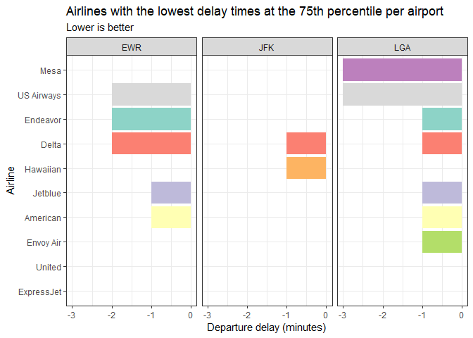
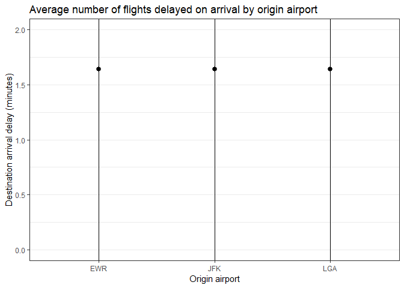

## Introduction

The following plots attempt to help a presumed frequent flier decide what flying options to choose to maximize time efficiency.

## Lowest delay times at the 75th percentile

All airlines in this plot achieve negative departure delay times (in other words, they leave early) at the interval specified.

For departing from EWR airport, the 3 airlines tied for the lowest delay times are Delta, Endeavor, and US Airways; if we aren't interested in defunct airlines, we don't consider US Airways.

If leaving fromJFK, Hawaiian and Delta are the best. And if leaving from LGA, US Airways and Mesa take the cake.


```r
# Group the flights that departed before 1200 by origin airport and airline,
# then take the airlines that had the 5 lowest departure delay values per airport
recommended_carriers <- flights %>%
  filter(dep_time < 1200) %>%
  group_by(origin, carrier) %>%
  summarise(
    delay = quantile(
      dep_delay,
      probs = 0.75,
      na.rm = TRUE
    )
  ) %>%
  filter(min_rank(delay) <= 5)

# Thanks a bunch to user1317221_G at
# stackoverflow.com/questions/20529252/changing-x-axis-tick-labels-in-r-using-ggplot2
# Even though he was replying to a duplicate question, his answer for changing the axis
# tick labels was way more straightforward than the answers to the original question
# Also, airline names found here: iata.org/publications/Pages/code-search.aspx
airline_names <- c("ExpressJet", "United", "Envoy Air", "American", "Jetblue",
                   "Hawaiian", "Delta", "Endeavor", "US Airways", "Mesa")

# Plot the data
recommended_carriers %>%
  ggplot(mapping = aes(x = reorder(carrier, -delay), y = delay, fill = carrier)) +
    geom_bar(stat = "identity") +
    scale_fill_brewer(palette = "Set3") +
    labs(
      title = "Airlines with the lowest delay times at the 75th percentile per airport",
      subtitle = "Lower is better",
      x = "Airline",
      y = "Departure delay (minutes)"
    ) +
    scale_x_discrete(labels = airline_names) +
    coord_flip() +
    facet_wrap(~ origin, nrow = 1) +
    theme_bw() +
    theme(legend.position = "none")
```

<!-- -->

```r
# Save the plot as a PNG image
ggsave("lowest_delay_times.png", width = 15, units = "in")
```

```
## Saving 15 x 5 in image
```

## Minimizing late arrival chances when flying Delta

From this plot, it appears that, given the large sample size, there is a strong tendency toward zero, and it shouldn't make much difference which airport is chosen.


```r
flights %>%
  filter(carrier == "DL") %>%
  na.omit() %>%
  ggplot(
    mapping = aes(
      x = origin,
      y = mean(arr_delay),
      ymin = min(arr_delay),
      ymax = max(arr_delay)
      )
  ) +
  geom_pointrange() +
  coord_cartesian(ylim = c(0, 2)) +
  labs(
    title = "Average number of flights delayed on arrival by origin airport",
    x = "Origin airport",
    y = "Destination arrival delay (minutes)"
  ) +
  theme_bw()
```

<!-- -->

```r
ggsave("delta_late_arrivals.png", width = 15, units = "in")
```

```
## Saving 15 x 5 in image
```
