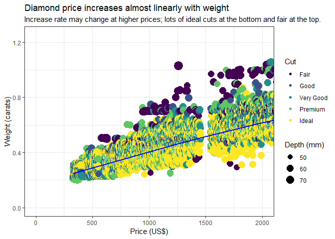

## Bad graph example

In this chart I didn't bother to make the y-axis correspond with readable numbers. I'm also assuming my brother is not a cheapskate and doesn't want to spend less than $500 so I start the y-axis there -- a big no-no with bar charts (although ggplot is still rendering the bottom for some reason). I didn't bother making the chart look good. The title and labels are not explicative.


```
## Warning: Removed 1729 rows containing missing values (position_stack).
```

<!-- -->

## Better graph example

In this graph, I've attempted to show weight, cut, and depth for each relevant diamond (meaning under $2,000). That reveals that the better cuts tend to be more expensive at lower carats. The depth doesn't seem to have much relevance. The line in the center of the plot reveals that price is quite linear.

<!-- -->
