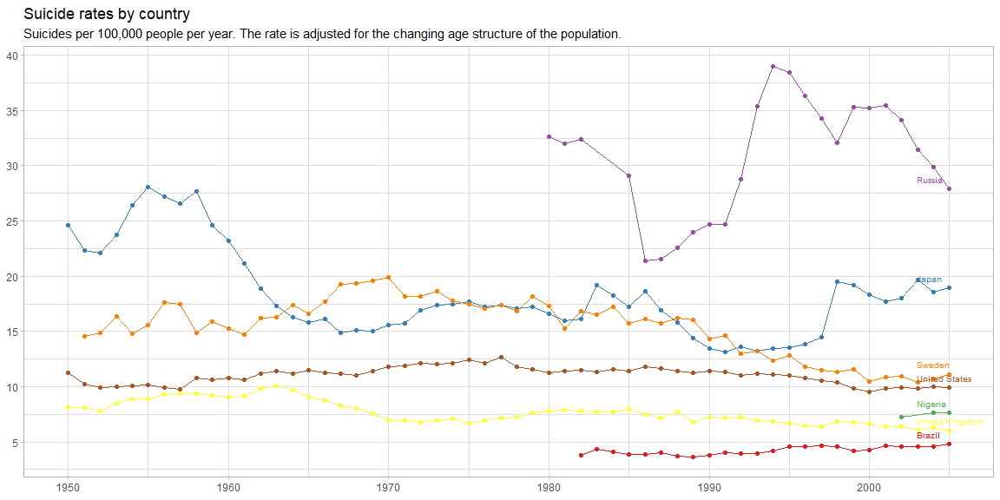
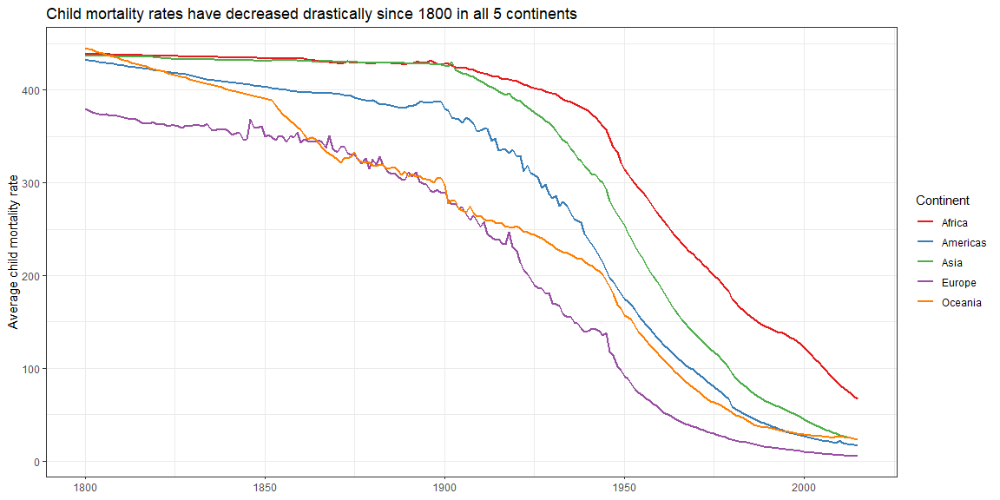

## WHO suicide rates plot recreation from [*Our World in Data*](https://ourworldindata.org/suicide)

In general, it cannot be said that, based on these countries, the world has made a whole lot of progress in reducing suicide rates since 1950. The US and Sweden show the most apparent progress. Perhaps the same can be said of Russia after its spike in the 1990s; I'd like to know what happened in Russia in the mid-1980s that reduced suicide rates so dramatically.


```r
library(tidyverse)
library(directlabels)
library(ourworldindata)

countries_shown <- c("Brazil", "Japan", "Nigeria", "Russia", "Sweden", "United Kingdom", "United States")

every_5 <- function(start, end) {
  seq(start, end, by = 5)
}

suicides <- read_csv("suicide-rates-by-country.csv") %>%
  rename(`Suicide rate` = `suicide rate (age-adjusted suicides per 100,000 people)`) %>%
  filter(Entity %in% countries_shown)

suicides %>%
  ggplot(aes(Year, `Suicide rate`, color = Entity)) +
  geom_point() +
  geom_line() +
  geom_dl(
    mapping = aes(label = Entity),
    method = list(dl.trans(x = x - 1, y = y + 0.3), dl.combine("last.points"), cex = 0.6)
  ) +
  labs(
    title = "Suicide rates by country",
    subtitle = paste(
      "Suicides per 100,000 people per year.",
      "The rate is adjusted for the changing age structure of the population."),
    x = NULL,
    y = NULL
  ) +
  scale_y_continuous(breaks = every_5(0, 45)) +
  scale_color_brewer(type = "qual", palette = 6) +
  theme_light() +
  theme(legend.position = "none")
```

<!-- -->


## Child mortality over time across continents

The foillowing chart shows what a dramatic difference humanity has been able to effect in the last 200 years regarding child mortality rates: its average has been steadily reduced in every continent. More work needs to be done in Africa, but look how far it has come.


```r
child_mortality %>%
  filter(year >= 1800, child_mort != "NaN", !is.na(continent)) %>%
  group_by(year, continent) %>%
  summarise(avg_child_mortality = mean(child_mort)) %>%
  ggplot(aes(year, avg_child_mortality, color = continent)) +
  geom_line(size = 1) +
  labs(
    title = "Child mortality rates have decreased drastically since 1800 in all 5 continents",
    x = NULL,
    y = "Average child mortality rate",
    color = "Continent"
  ) +
  scale_color_brewer(type = "qual", palette = 6) +
  theme_bw()
```

<!-- -->
