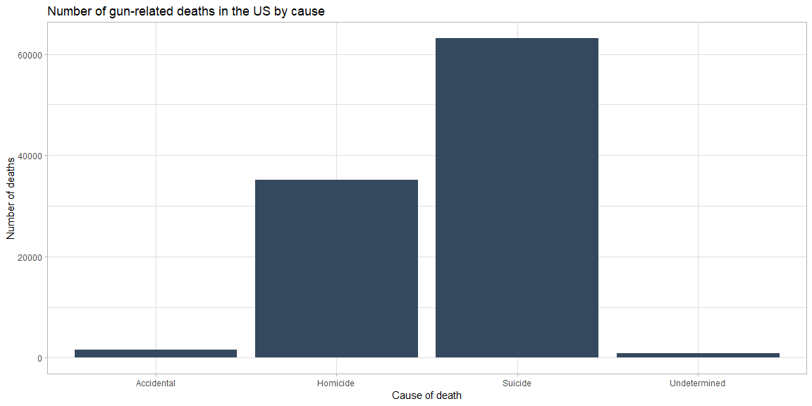
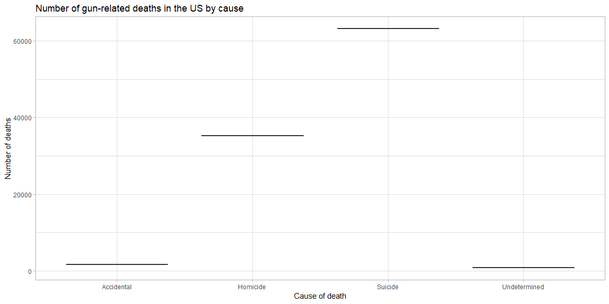
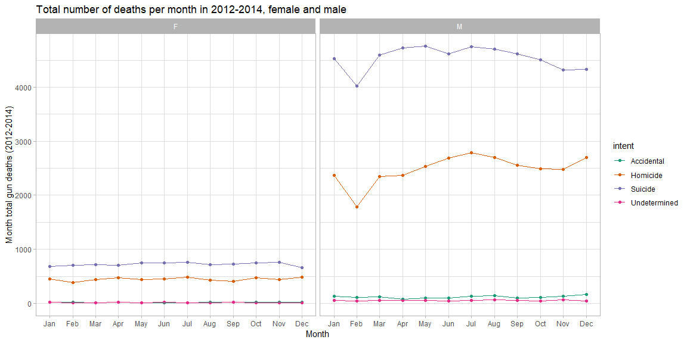
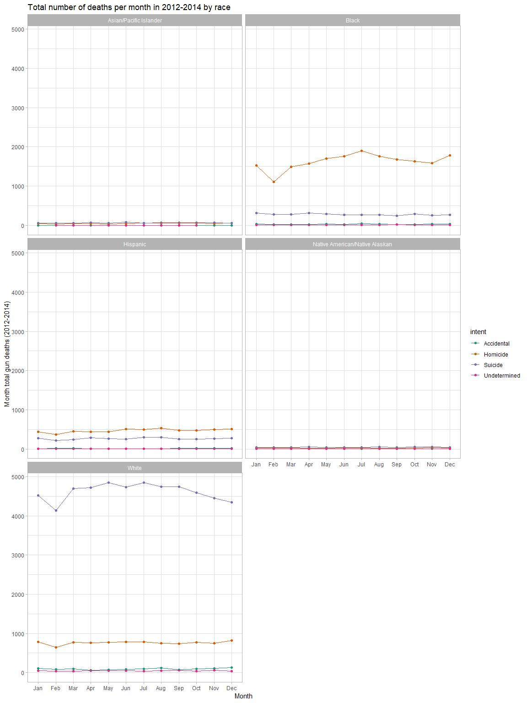
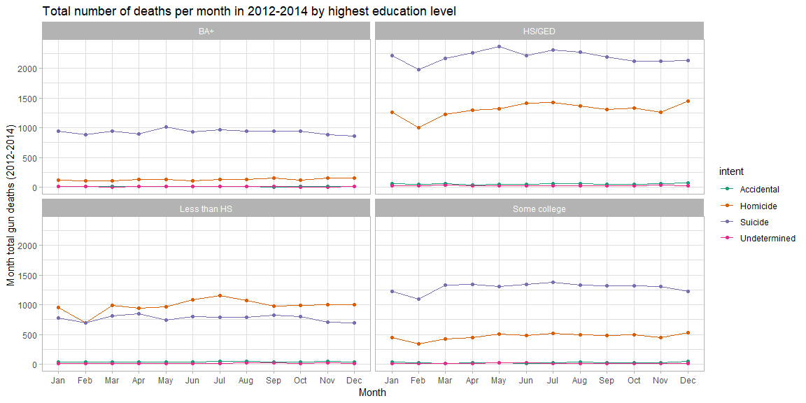

```r
gun_data <- read_csv("https://raw.githubusercontent.com/fivethirtyeight/guns-data/master/full_data.csv")
```

## Six steps to selecting and designing graphs (Notes from *Effectively Communicating Numbers*, pp. 13--20)

1. Determine the message and identify the relevant data.

2. Determine if table, graph, or both is needed. Individual value comparison or lookup: table. Show shape of data: graph.

3. Determine the best means to encode the values. This table helps you narrow your choices:

Relationship Type      | Potential Encoding Methods
---------------------- | --------------------------
Nominal Comparison     | Bars (horizontal or vertical) or Points (if the quantitative scale does not include zero)
Time-Series            | Lines to emphasize the overall shape of the data or Bars to emphasize and support comparisons between individual values or Points connected by lines to slightly emphasize individual values while still highlighting the overall shape of the data
Ranking                | Bars (horizontal or vertical) or Points (if the quantitative scale does not include zero)
Part-to-Whole          | Bars (horizontal or vertical) *Note: Pie charts are commonly used to display part-to-whole relationships, but they don't work nearly as well as bar graphs because it is much harder to compare the sizes of slices than the length of bars.* Use stacked bars only when you must display measures of the whole as well as the parts
Deviation              | Lines to emphasize the overall shape of the data (only when displaying deviation and time-series relationships together) or Points connected by lines to slightly emphasize individual data points while also highlighting the overall shape (only when displaying deviation and time-series relationships together)
Frequency Distribution | -Bars (vertical only) to emphasize individual values. *Note: This kind of graph is called a histogram.* Or Lines to emphasize the overall shape of the data. *Note: This kind of graph is called a frequency polygon.*
Correlation            | Points and a trend line in the form of a scatter plot

4. Determine where to display each variable. Categorical data always on x-axis, especially time series. Avoid 3D graphs, i.e. with 3 axes. They're too hard to read. If you must, use *small multiples* instead, what ggplot2 calls facets.

5. Determine the best design for the remaining objects:
  - Quantitative scale range
  - Legend placement, if used
  - How many tick marks to put (usually 10 to 15), if any
  - Best location for the quantitative scale (up, down, left, right, more than one being possible)
  - Are grid lines required? Generally, if high degree of quantitative accuracy is needed, a table is required.
  - What descriptive text is needed? As little as possible, but descriptive title and notes are often necessary.

6. Determine if particular data should be featured, and if so, how. Highlight the most important data.

## [Gun Deaths in America](https://fivethirtyeight.com/features/gun-deaths)---A Summary


```r
gun_data %>%
  filter(!is.na(intent)) %>%
  ggplot(aes(intent)) +
  geom_bar(fill = "#34495e") +
  labs(
    title = "Number of gun-related deaths in the US by cause",
    x = "Cause of death",
    y = "Number of deaths"
  ) +
  theme_light()
```

<!-- -->

```r
ggsave("gun-deaths.png", width = 15, units = "in")

gun_data %>%
  filter(!is.na(intent)) %>%
  group_by(intent) %>%
  summarise(n = n()) %>%
  ggplot(aes(intent, n)) +
  geom_boxplot() +
  labs(
    title = "Number of gun-related deaths in the US by cause",
    x = "Cause of death",
    y = "Number of deaths"
  ) +
  theme_light()
```

<!-- -->

Over 33,000 people die from gun-related causes per year in the United States. Two-thirds of that number are suicides, mostly by males. Another third of deaths are homicides. A minority are accidents, and a slightly more significant minority is caused by the causes that draw the attention of the media and public discourse: terrorism, mass shootings, and police shootings.

## Seasonal recommendations for announcements


```r
# Thanks to Mamoun Benghezal at Stack Overflow for 3-letter months on the x-axis
# https://stackoverflow.com/questions/30351420/how-can-i-use-name-of-a-month-in-x-axis-in-ggplot2
gun_data %>%
  filter(!is.na(intent), !is.na(month)) %>%
  group_by(month, intent, sex) %>%
  summarise(month_total = n()) %>%
  ggplot(aes(month, month_total, color = intent, group = intent)) +
  geom_point() +
  geom_line() +
  labs(
    title = "Total number of deaths per month in 2012-2014, female and male",
    x = "Month",
    y = "Month total gun deaths (2012-2014)"
  ) +
  facet_wrap(~ sex, nrow = 1) +
  scale_x_discrete(labels = month.abb) +
  scale_color_brewer(palette = "Dark2") +
  theme_light()
```

<!-- -->

```r
ggsave("gender-deaths-per-month.png", width = 15, units = "in")
```

For males, the shape of the data for both total suicides and homicides in a month is very similar: they both bottom out in February and jump up in July. Suicides are also common in April and May. For females, the data is much flatter. I would have used averages for each month rather than totals, but with only 3 years, it's debatable whether those averages would have meant much.


```r
gun_data %>%
  filter(!is.na(intent), !is.na(month)) %>%
  group_by(month, intent, race) %>%
  summarise(month_total = n()) %>%
  ggplot(aes(month, month_total, color = intent, group = intent)) +
  geom_point() +
  geom_line() +
  labs(
    title = "Total number of deaths per month in 2012-2014 by race",
    x = "Month",
    y = "Month total gun deaths (2012-2014)"
  ) +
  facet_wrap(~ race, nrow = 3) +
  scale_x_discrete(labels = month.abb) +
  scale_color_brewer(palette = "Dark2") +
  theme_light()
```

<!-- -->

```r
ggsave("deaths-by-race.png", width = 15, units = "in")
```

From the shape of this data, it appears that the two highest-risk ethnicities are black for homicide and white for suicide. Other than a bottom-out for both in February, the risk remains high throughout the year.


```r
gun_data %>%
  filter(!is.na(intent), !is.na(month), !is.na(education)) %>%
  group_by(month, intent, education) %>%
  summarise(month_total = n()) %>%
  ggplot(aes(month, month_total, color = intent, group = intent)) +
  geom_point() +
  geom_line() +
  labs(
    title = "Total number of deaths per month in 2012-2014 by highest education level",
    x = "Month",
    y = "Month total gun deaths (2012-2014)"
  ) +
  facet_wrap(~ education, nrow = 2) +
  scale_x_discrete(labels = month.abb) +
  scale_color_brewer(palette = "Dark2") +
  theme_light()
```

<!-- -->

```r
ggsave("deaths-by-education-level.png", width = 15, units = "in")
```

Again we see that gun deaths dip in February. The people most at risk for suicide are those with a max education level of high school or a GED, followed by those with some college, a BA, and less than high school. For suicide, those most at risk are the high school/GED group and those with less than high school.
