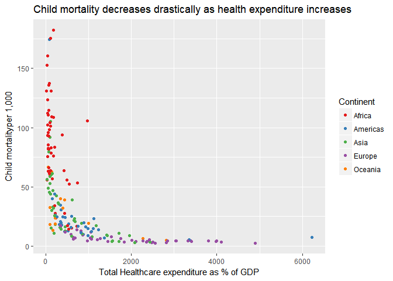

## Child mortality reduction

From the following visualization, it is stunningly evident that, the more a country spends on healthcare as a percentage of GDP, the fewer child deaths occur between the ages of 0 and 5.

<!-- -->
