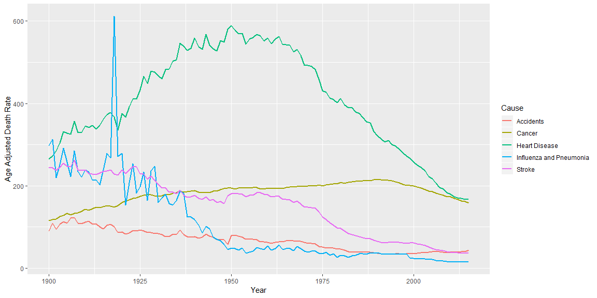

## General data sources

1. <https://github.com/fivethirtyeight/data/tree/master/bad-drivers>: This data comes from the National [Highway Traffic Safety Administration](https://www.nhtsa.gov/), so it's presumably very realiable. It *is* a little old.

2. <https://github.com/fivethirtyeight/data/tree/master/marriage>: The study spanned several years and comes from the US Census and another reputable institution.

3. <https://github.com/fivethirtyeight/data/tree/master/pew-religions>: Relatively recent religious information from Pew. Probably about as high-quality as it gets, with Pew being behind the data collection.


## Data sources for semester project

  1. [**Stanford Education Data Archive**](https://cepa.stanford.edu/seda/overview): Amazong resource with everything you could ever want to know about the US education system. Top quality.

  1. [**US governments causes of death datasets**](https://catalog.data.gov/dataset?tags=cause-of-death): A comprehensive, definitive set of datasets with causes of death, including suicide.

  1. [**CDC Mortality Multiple Cause Files**](https://www.cdc.gov/nchs/data_access/VitalStatsOnline.htm#Mortality_Multiple): Again, from the CDC, which is about as reputable as data gets.


## Data exploration

The first dataset would be useful if it contained suicide data. The second one needs the addition of total us population to calculate rates because deaths have been increasing, but that's expected when there are more people. Same with the third one.


```r
library(tidyverse)

read_csv("NCHS_-_Age-adjusted_Death_Rates_for_Selected_Major_Causes_of_Death.csv") %>%
  ggplot(aes(Year, `Age Adjusted Death Rate`, color = Cause)) +
  geom_line(size = 1)
```

<!-- -->

```r
read_csv("Selected_Trend_Table_from_Health__United_States__2011._Leading_causes_of_death_and_numbers_of_deaths__by_sex__race__and_Hispanic_origin__United_States__1980_and_2009.csv") %>%
  filter(`Cause of death` %in% c("All causes", "Alzheimer's disease", "Diseases of heart", "Suicide")) %>%
  ggplot(aes(Year, Deaths, color = Group)) +
  geom_point() +
  geom_line() +
  facet_wrap(~ `Cause of death`)
```

<!-- -->

```r
read_csv("NCHS_-_Top_Five_Leading_Causes_of_Death__United_States__1990__1950__2000.csv") %>%
  ggplot(aes(Cause, `Number of Deaths` / 1000)) +
  geom_bar(stat = "identity") +
  coord_flip() +
  labs(y = "Number of deaths in thousands") +
  facet_wrap(~ Year)
```

<!-- -->


## Summary

The read-in process was nothing complicated. I downloaded the data files to my machine because that seems to be the simplest way, but I probably could have found the way to read it from the Internet.

I loved using the `%in%` operator; it makes things so much simpler.


## Follow-up questions

How can we de-confound the variables? How can we know that the effects of the data aren't caused by other variables, such as climate or latitude?
