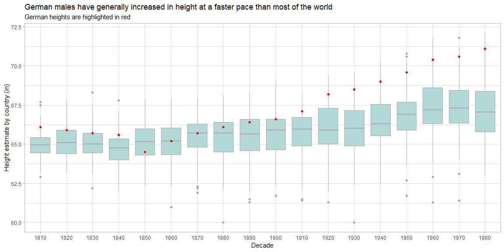
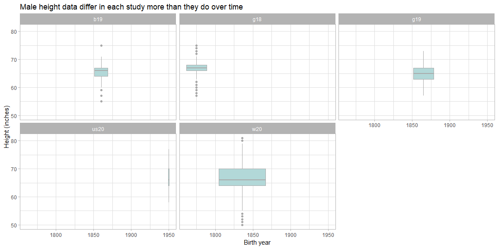
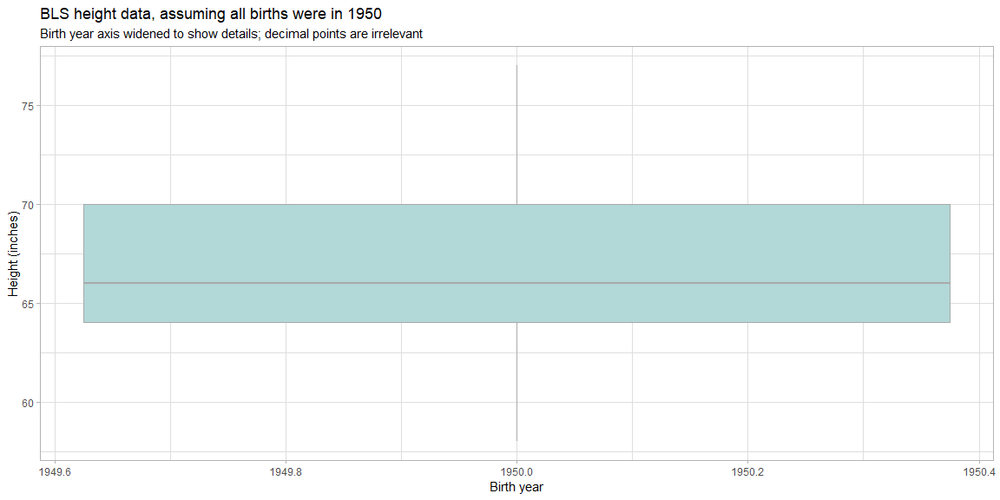

## Changes in Male Height Throughout the World

Since the mid-19th century and through 1980, male heights across the world have trended upward by just over 1.5 inches. Germany, in particular, is an interesting case, since its height measurements have grown at a higher rate than those of most of the rest of the world.


```r
library(tidyverse)

world_height <- read_rds("worldwide-height-estimates.rds")

# Summarize the data from all the countries that are considered Germany today, averaging their heights
germany_height <- world_height %>%
  filter(grepl("Germany", country)) %>%
  group_by(year_decade) %>%
  summarise(mean_height = mean(height_in))

# Plot the world's male height throughout the last couple of centuries, with Germany highlighted
world_height %>%
  ggplot() +
  geom_boxplot(aes(year_decade, height_in), color = "darkgray", fill = "#b2d8d8") +
  geom_point(data = germany_height, aes(year_decade, mean_height), color = "red") +
  labs(
    title = "German males have generally increased in height at a faster pace than most of the world",
    subtitle = "German heights are highlighted in red",
    x = "Decade",
    y = "Height estimate by country (in)"
  ) +
  theme_light()
```

<!-- -->

## Comparison Between Height Studies

This second graph makes the limmitations of the data much more evident: each study spans much less time than one may initially presume. While the timelines of the studies have enough overlap that all years in the range are covered, they are not covered equally. Furthermore, the studies are localized, leaving the reader to wonder how well the data from one side of the world correlates with those of another. Is the continuity we see in the chart also seen in reality?


```r
library(tidyverse)

surveys_height <- read_rds("surveys-height-data.rds") %>%
  mutate(
    century = case_when(
      birth_year >= 1700 & birth_year < 1800 ~ 18,
      birth_year >= 1800 & birth_year < 1900 ~ 19,
      birth_year >= 1900 & birth_year < 2000 ~ 20
    )
  )

surveys_height %>%
  ggplot(aes(birth_year, height_in)) +
  geom_boxplot(color = "darkgray", fill = "#b2d8d8") +
  facet_wrap(~ study_id, nrow = 2) +
  labs(
    title = "Male height data differ in each study more than they do over time",
    x = "Birth year",
    y = "Height (inches)"
  ) +
  theme_light()
```

<!-- -->

Because the data from the BLS data is so hard to see in the graphic above, given that only one assumed year is represented, here it is on its own:


```r
surveys_height %>%
  filter(study_id == "us20") %>%
  ggplot(aes(birth_year, height_in)) +
  geom_boxplot(color = "darkgray", fill = "#b2d8d8") +
  labs(
    title = "BLS height data, assuming all births were in 1950",
    subtitle = "Birth year axis widened to show details; decimal points are irrelevant",
    x = "Birth year",
    y = "Height (inches)"
  ) +
  theme_light()
```

<!-- -->

## Conclusion: I Want More Data

While it seems that humans---or human males, at least---may have been getting taller in the past few centuries, I would like to see data dating back thousands of years. Are we currently in the middle of a super-cycle that sees humans growing and shrinking over the millenia? I've wondered about this for years. I'm not likely ever to have an answer.
