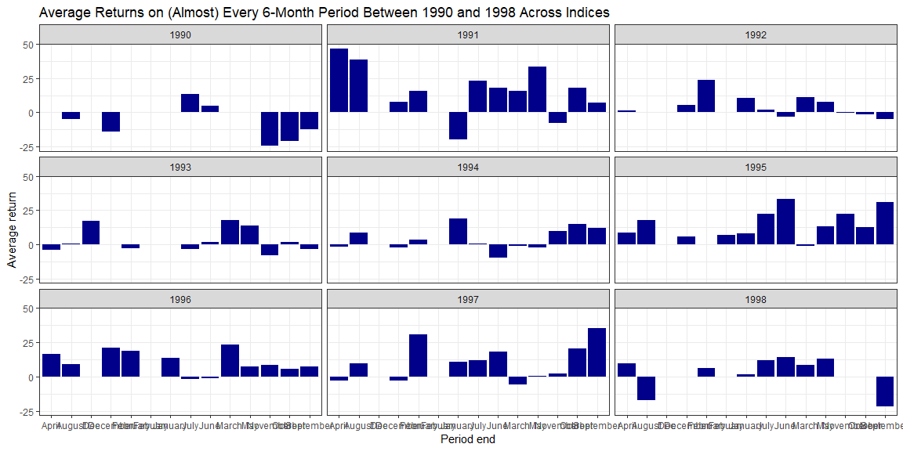
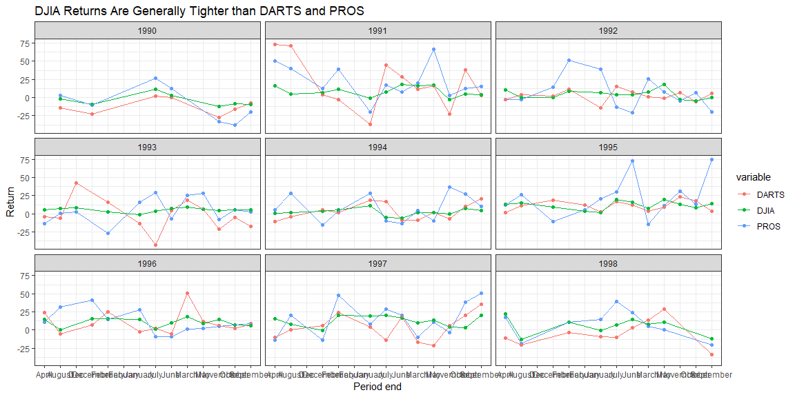

```r
# Save a local temp file to avoid overloading the server
url_csv <- "https://raw.githubusercontent.com/byuistats/data/master/Dart_Expert_Dow_6month_anova/Dart_Expert_Dow_6month_anova.csv"
data_file <- tempfile()
download(url_csv, data_file, mode = "wb")

stock_returns <- read_csv(data_file) %>%
  separate(contest_period, into = c("period", "year_end"), sep = -4, convert = TRUE) %>%
  separate(period, into = c("month_start", "month_end"), convert = TRUE)

write_rds(stock_returns, "stock-returns.Rds", compress = "none")
```


```r
stock_returns %>%
  group_by(month_end, year_end) %>%
  summarise(avg_return = mean(value)) %>%
  ggplot(aes(month_end, avg_return)) +
  geom_bar(stat = "identity", fill = "darkblue") +
  labs(
    title = "Average Returns on (Almost) Every 6-Month Period Between 1990 and 1998 Across Indices",
    x = "Period end",
    y = "Average return"
  ) +
  facet_wrap(~ year_end, ncol = 3) +
  theme_bw()
```

<!-- -->


```r
stock_returns %>%
  ggplot(aes(month_end, value, color = variable)) +
  geom_point() +
  geom_line(aes(group = variable)) +
  labs(
    title = "DJIA Returns Are Generally Tighter than DARTS and PROS",
    x = "Period end",
    y = "Return"
  ) +
  facet_wrap(~ year_end, ncol = 3) +
  theme_bw()
```

<!-- -->


```r
stock_returns %>%
  select(-month_start) %>%
  spread(key = year_end, value = value) %>%
  kable(
    col.names = c("End month", "Index", 1990, 1991, 1992, 1993, 1994, 1995, 1996, 1997, 1998),
    caption = "Returns per six-month period"
  )
```


Table: Returns per six-month period

End month   Index     1990    1991    1992    1993    1994    1995   1996    1997    1998
----------  ------  ------  ------  ------  ------  ------  ------  -----  ------  ------
April       DARTS       NA    72.9    -3.1    -3.6   -10.5     1.4   24.4    -9.7   -10.5
April       DJIA        NA    16.2    10.6     5.8     0.5    12.8   14.8    15.3    22.5
April       PROS        NA    50.6    -3.3   -13.9     5.4    12.1   10.8   -13.6    17.4
August      DARTS    -14.3    71.3     3.6    -5.6    -4.3    11.4   -5.7     0.1   -20.4
August      DJIA      -2.3     4.4    -0.3     7.3     1.5    15.3    0.6     8.3   -13.1
August      PROS       2.5    39.6    -2.5     0.3    28.4    26.7   31.7    20.7   -18.8
Dec         DARTS       NA      NA      NA    42.2      NA      NA     NA      NA      NA
Dec         DJIA        NA      NA      NA     8.0      NA      NA     NA      NA      NA
Dec         PROS        NA      NA      NA     2.2      NA      NA     NA      NA      NA
December    DARTS    -22.5     4.1     1.8      NA     5.3    18.7    6.9     6.5      NA
December    DJIA      -9.3     6.6     0.2      NA     3.6     9.3   15.5    -0.7      NA
December    PROS     -10.2    12.3    14.1      NA   -15.8   -11.0   41.2   -14.1      NA
February    DARTS       NA    -2.5    11.7    15.6     1.5      NA   25.4    24.6    -3.3
February    DJIA        NA    11.0     8.6     2.5     5.5      NA   15.6    20.1    10.7
February    PROS        NA    38.9    51.2   -26.7     3.7      NA   15.1    47.6    10.9
Febuary     DARTS       NA      NA      NA      NA      NA    11.9     NA      NA      NA
Febuary     DJIA        NA      NA      NA      NA      NA     3.2     NA      NA      NA
Febuary     PROS        NA      NA      NA      NA      NA     5.4     NA      NA      NA
January     DARTS       NA   -37.3   -14.0   -13.9    18.5     2.8   -2.4     4.7    -9.0
January     DJIA        NA    -0.8     6.5    -0.8    11.2     1.8   15.0    19.6    -0.3
January     PROS        NA   -20.3    39.3    15.6    27.8    20.4   28.1     7.7    14.3
July        DARTS      1.8    44.8    15.4   -43.0    16.9    16.5    2.6   -13.9   -10.1
July        DJIA      11.5     7.6     4.2     3.7    -5.3    19.6    1.3    20.8     7.1
July        PROS      26.4    17.5   -13.0    29.1   -10.0    30.5   -8.6    29.3    39.3
June        DARTS      0.0    28.7     7.7     4.7    -8.7    11.8   -5.3    18.0     3.2
June        DJIA       2.5    17.7     3.6     7.7    -6.2    16.0   10.2    16.2    15.0
June        PROS      12.7     7.5   -21.0    -6.6   -13.1    72.7   -9.2    20.2    24.4
March       DARTS       NA    11.2     1.1    18.7    -9.2     3.8   50.5   -16.9    13.3
March       DJIA        NA    15.8     7.2     9.0     1.6     7.3   18.4     9.6     7.6
March       PROS        NA    20.2    25.2    25.2     4.7   -14.8    1.5   -10.0     5.5
May         DARTS       NA    16.6    -1.4     6.6     1.4     9.0   11.5   -21.4    28.5
May         DJIA        NA    17.3    17.6     6.7     1.3    19.5    9.0    13.3    10.6
May         PROS        NA    66.9     7.7    27.9    -9.5    10.8    2.0    10.5     0.0
November    DARTS    -27.4   -23.2     6.9   -21.4    -6.8    23.8    6.2     6.5      NA
November    DJIA     -12.8    -3.3    -2.8     4.9    -0.3    13.1   15.1     3.8      NA
November    PROS     -33.3     3.0    -5.1    -7.4    37.0    31.0    5.1    -3.5      NA
October     DARTS    -16.3    38.0    -5.7    -4.9    10.3    17.6    2.0    20.7      NA
October     DJIA      -8.5     4.4    -5.0     5.7     6.9     8.2    7.2     3.0      NA
October     PROS     -37.8    12.4     6.3     5.0    27.2    12.6    7.0    38.4      NA
September   DARTS     -7.2     2.8     5.7   -17.7    20.6     3.3    7.8    35.6   -34.2
September   DJIA      -9.2     3.4    -0.1     5.2     4.4    14.0    5.8    20.2   -11.8
September   PROS     -20.0    15.6   -19.6     2.6    10.6    75.0    8.7    50.3   -20.1

## Conclusion

I averaged the returns of all the indices for the bar chart because otherwise they would have been stacked, which would have shown the sum of them all and skewed the representation.

DJIA returns are indeed less volatile than those of its counterparts, as we can see from the line/point plot. However, within each 6-month period there isn't much of an upward trend. Stock returns have remained relatively consistent over the years.

There are quite a few missing data points, which is easy to see in the spread table and the bar chart but not so much in the original table.
