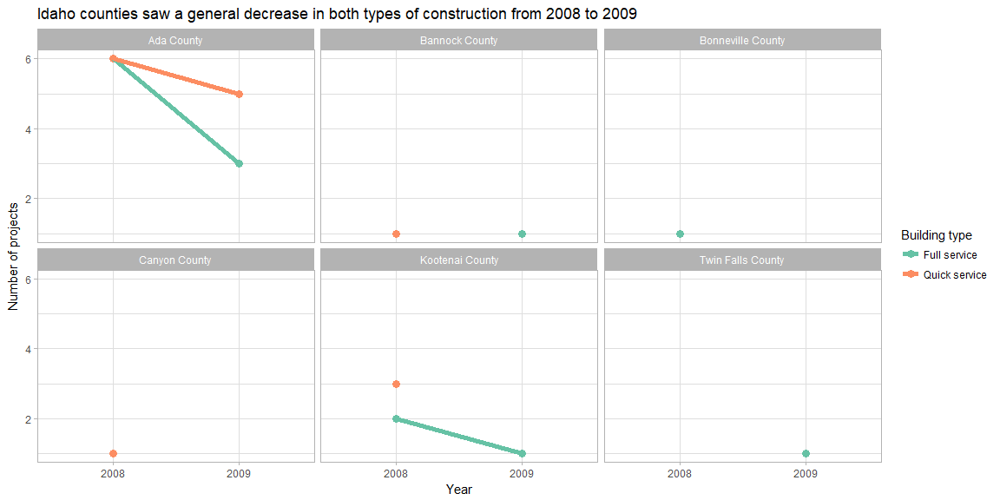
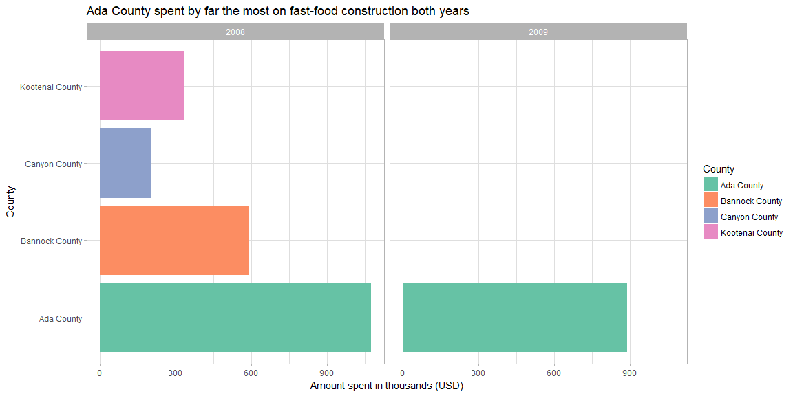
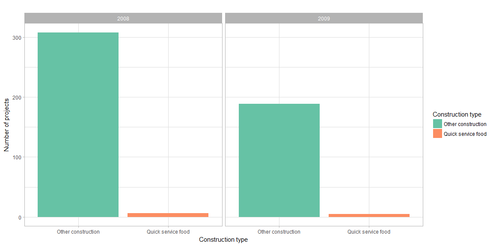

## Background

It is 2010, and you are working for the Idaho restaurant commission, and they need your help getting a clearer picture of how restaurant construction changed across Idaho from 2008 to 2009. They provided you a dataset of all commercial construction in Idaho for those two years. The data has a variable Type with a general category called Food_Beverage_Service that has other buildings besides restaurants in the category. You will need to use the restaurant names (see restaurants data object) and some additional key words to create the correct subgroupings. Your client expects to provide new data for 2010 and 2011 so your script needs to do the work. Make sure you do not use Excel to manipulate anything.

  1. How did full-service restaurant construction compared to quick service restaurant construction across county and years?
  1. How did restaurant construction fare compare to the other commercial construction in Idaho?
  1. Which county in Idaho spent the most on fast food construction each year?
  1. In that county, how did other commercial construction compare?

## Idaho Food Service Construction


```r
# Merge datasets and assign each construction project to a specific type

library(tidyverse)
library(stringr)

#devtools::install_github("hathawayj/buildings")
library(buildings)

# This function will save us lots of typing in the project type assignment
# Returns a vector whose elements are either TRUE or FALSE depending on col_values matching project_type
match_types <- function(col_values, project_type) {
  project_type_regex <- project_type %>%
    str_trim() %>%
    str_to_lower() %>%
    str_c(collapse = "|")

  str_detect(col_values, project_type_regex)
}

# These assignments came straight from the master, J. Hathaway
not_restaurants <- c("development","Food preparation center", "Food Services center","bakery","Grocery","concession","Cafeteria", "lunchroom", "lunch room", "school","facility"," hall ")
standalone_retail <- c("Wine","Spirits","Liquor","Convenience","drugstore","Flying J", "Rite Aid ","walgreens ","Love's Travel ")
full_service_type <- c("Ristorante","mexican","pizza ","steakhouse"," grill ","buffet","tavern"," bar ","waffle","italian","steak house")
quick_service_type <- c("coffee"," java "," Donut ","Doughnut"," burger ","Ice Cream ","custard ","sandwich ","fast food "," bagel ")
quick_service_names <- restaurants$Restaurant[restaurants$Type %in% c("coffee","Ice Cream","Fast Food")]
full_service_names <- restaurants$Restaurant[restaurants$Type %in% c("Pizza","Casual Dining","Fast Casual")]

# Create the commercial construction and food service construction datasets for Idaho
idaho_construction <- buildings0809 %>%
  left_join(climate_zone_fips, by = c("FIPS.state", "FIPS.county")) %>%
  as_tibble()

# Austin Halvorsen's ideas really helped me out with the two mutate()s
idaho_food_service <- idaho_construction %>%
  filter(Type == "Food_Beverage_Service") %>%
  mutate(ProjectTitle = str_trim(str_to_lower(ProjectTitle))) %>%
  mutate(ServiceType = case_when(
    match_types(ProjectTitle, not_restaurants) ~ "Other",
    match_types(ProjectTitle, standalone_retail) ~ "Standalone retail",
    match_types(ProjectTitle, full_service_type) | match_types(ProjectTitle, full_service_names) | (SqFt >= 4000 & match_types(ProjectTitle, "(new)")) ~ "Full service",
    match_types(ProjectTitle, quick_service_type) | match_types(ProjectTitle, quick_service_names) | (SqFt < 4000 & match_types(ProjectTitle, "(new)")) ~ "Quick service",
    TRUE ~ "Unknown"
  ))
```

### Full- vs. quick-service restaurant construction


```r
idaho_food_service %>%
  filter(ServiceType == "Full service" | ServiceType == "Quick service") %>%
  group_by(ServiceType, AreaName, Year) %>%
  summarise(count = n()) %>%
  ggplot(aes(Year, count, group = ServiceType, color = ServiceType)) +
  geom_point(size = 3) +
  geom_line(size = 2) +
  labs(
    title = "Idaho counties saw a general decrease in both types of construction from 2008 to 2009",
    x = "Year",
    y = "Number of projects",
    col = "Building type"
  ) +
  facet_wrap(~ AreaName, nrow = 2) +
  scale_color_brewer(palette = "Set2") +
  theme_light()
```

<!-- -->

For both types of services, construction decreased---sometimes down to zero---in all counties but Twin Falls. Where there was no construction in 2008, there was none in 2009 either (again, with the single-restaurant exception in Twin Falls).

### Restaurant vs. other commercial construction


```r
idaho_construction %>%
  mutate(`Business type` = ifelse(
    Type == "Food_Beverage_Service",
    "Food and beverage",
    "All others"
  )) %>%
  group_by(`Business type`, Year) %>%
  summarise(count = n()) %>%
  ggplot(aes(`Business type`, count, fill = `Business type`)) +
  geom_bar(stat = "identity") +
  labs(
    title = "F&B construction projects plummeted right along with all other types of commercial construction",
    x = "Business type",
    y = "Number of projects"
  ) +
  facet_wrap(~ Year) +
  scale_fill_brewer(palette = "Set2") +
  theme_light()
```

<!-- -->

Food and beverage construction went down along with the entire commercial construction in Idaho at a similar rate.

### Fast-food construction by county


```r
idaho_food_service %>%
  filter(ServiceType == "Quick service") %>%
  group_by(AreaName, Year) %>%
  summarise(USDSpent = sum(Value1000)) %>%
  ggplot(aes(AreaName, USDSpent, fill = AreaName)) +
  geom_bar(stat = "identity") +
  labs(
    title = "Ada County spent by far the most on fast-food construction both years",
    x = "County",
    y = "Amount spent in thousands (USD)",
    fill = "County"
  ) +
  facet_wrap(~ Year) +
  coord_flip() +
  scale_fill_brewer(palette = "Set2") +
  theme_light()
```

<!-- -->


```r
# In Ada County, how did other commercial construction compare?

ada_county_quick_service <- idaho_food_service %>%
  filter(ServiceType == "Quick service" , AreaName == "Ada County") %>%
  select(Year, Address, Zipcode) %>%
  mutate(`Construction type` = "Quick service food")

ada_county_other_construction <- idaho_construction %>%
  filter(AreaName == "Ada County") %>%
  select(Year, Address, Zipcode)

ada_county_all_construction <- ada_county_other_construction %>%
  left_join(ada_county_quick_service, by = c("Year", "Address", "Zipcode")) %>%
  mutate(`Construction type` = ifelse(is.na(`Construction type`), "Other construction", "Quick service food"))

ada_county_all_construction %>%
  group_by(Year, `Construction type`) %>%
  summarise(count = n()) %>%
  ggplot(aes(`Construction type`, count, fill = `Construction type`)) +
  geom_bar(stat = "identity") +
  labs(
    title = "",
    y = "Number of projects"
  ) +
  facet_wrap(~ Year) +
  scale_fill_brewer(palette = "Set2") +
  theme_light()
```

<!-- -->

It is interesting that quick-service construction decreased by only one from 2008 to 2009, while 
