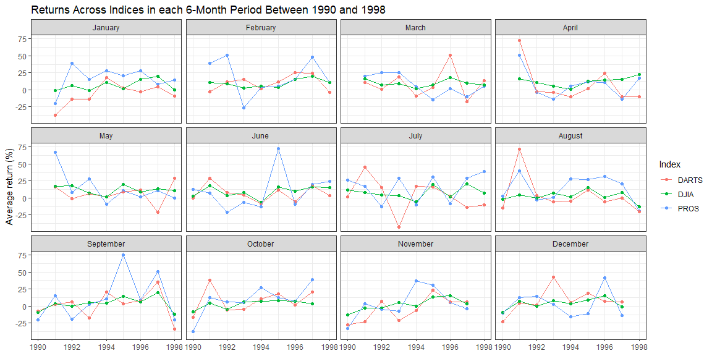

```r
library(tidyverse)
library(forcats)

# Load the data, fix typos, and convert month strings to factors
stock_data <- read_rds("stock-returns.Rds") %>%
  mutate(
    month_end = case_when(
      month_end == "Febuary" ~ "February",
      month_end == "Dec" ~ "December",
      TRUE ~ month_end
    ),
    month_end = factor(month_end, levels = base::month.name)
  )

# Plot the data
stock_data %>%
  ggplot(aes(year_end, value, color = variable)) +
  geom_point() +
  geom_line(aes(group = variable)) +
  labs(
    title = "Returns Across Indices in each 6-Month Period Between 1990 and 1998",
    x = NULL,
    y = "Average return (%)",
    color = "Index"
  ) +
  facet_wrap(~ month_end) +
  theme_bw()
```

<!-- -->

## Conclusion

The plot above shows an encapsulation of each month's performance across the years 1990 to 1998. I was between 2 and 11 years old when these data were collected. Anyway, except for a few outliers, there isn't that much of an upward trend. Returns stay relatively consistent. DJIA was, again, tighter in spread than the other indices.
