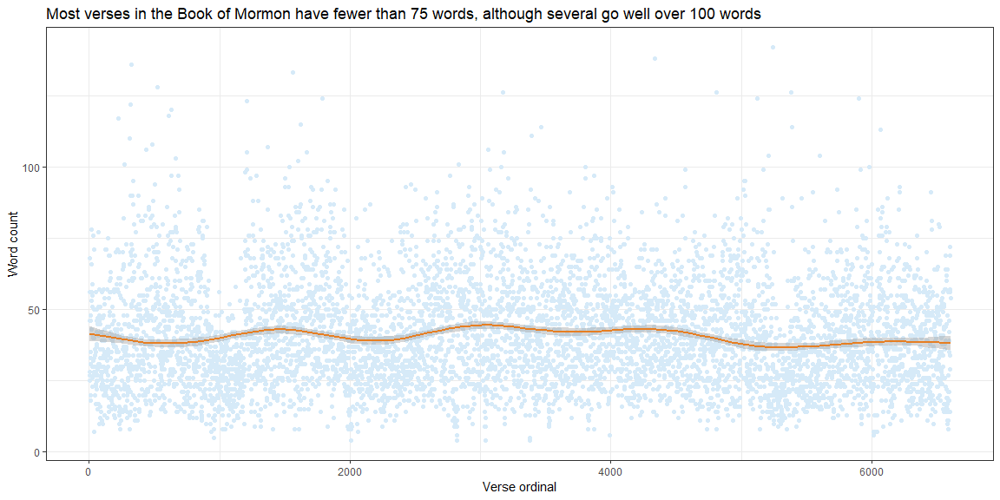

```r
library(tidyverse)
library(downloader)
library(stringi)

# Return the scripture_text column from a particular volume as a vector of strings
get_scripture_text_vector <- function(scripture_df, id) {
  scripture_df %>%
    filter(volume_id == id) %>%
    select(scripture_text) %>%
    as_vector()
}

# Return the name of the volume based on the id passed
get_volume_name <- function(id) {
  case_when(
    id == 1 ~ "Old Testament",
    id == 2 ~ "New Testament",
    id == 3 ~ "Book of Mormon",
    id == 4 ~ "Doctrine and Covenants",
    id == 5 ~ "Pearl of Great Price"
  )
}

# Calculate the average number of verses in a volume and print it
# id refers to the volume_id variable, and is an integer as follows:
#   1 - Old Testament
#   2 - New Testament
#   3 - Book of Mormon
#   4 - Doctrine and Covenants
#   5 - Pearl of Great Price
print_mean_words <- function(scripture_df, id) {
  verses_text <- get_scripture_text_vector(scripture_df, id)

  # Iterate through each verse to find its length
  verse_lengths <- vector("integer", length(verses_text))
  for (i in seq_along(verses_text)) {
    verse_lengths[[i]] <- verses_text[[i]] %>%
      stri_stats_latex() %>%
      .[[4]]
  }

  total_words <- verses_text %>%
    stri_stats_latex() %>%
    .[[4]]

  # Identify the volume to print its name appropriately
  volume_name <- get_volume_name(id)

  paste(
    "Average ", volume_name, " verse length (out of ", total_words, " total words): ", mean(verse_lengths),
    sep = ""
  ) %>%
  print()
}

# Get the number of instances of a certain word in a volume
print_instance_num <- function(scripture_df, id, word) {
  verses_text <- get_scripture_text_vector(scripture_df, id)
  num_instances <- str_locate_all(verses_text, word) %>%
    length()

  volume_name <- get_volume_name(id)

  paste(
    "Number of ", volume_name, " instances of the word '", word, "': ", num_instances,
    sep = ""
  ) %>%
  print()
}

# Download the data into a temporary file
temp_file <- tempfile()
download("http://scriptures.nephi.org/downloads/lds-scriptures.csv.zip", temp_file, mode = "wb")

# Read the file data into a tibble
scriptures <- unzip(temp_file, "lds-scriptures.csv") %>%
  read_csv()

# Remove the temporary file contents from memory
unlink(temp_file)

# Calculate the average verse length in the New Testament
print_mean_words(scriptures, 2)
```

```
## [1] "Average New Testament verse length (out of 180665 total words): 22.7051652632902"
```

```r
print_mean_words(scriptures, 3)
```

```
## [1] "Average Book of Mormon verse length (out of 267519 total words): 40.5086311326469"
```

```r
print_instance_num(scriptures, 2, "Jesus")
```

```
## [1] "Number of New Testament instances of the word 'Jesus': 7957"
```

```r
print_instance_num(scriptures, 3, "Jesus")
```

```
## [1] "Number of Book of Mormon instances of the word 'Jesus': 6604"
```

## Average verse lengths in the New Testament and the Book of Mormon

According to the output of my R script, verses in the **New Testament** contain an average of 22.71 words, while verses in **The Book of Mormon** contain nearly double that amount, at 40.51 words.

## Instances of the word "Jesus" in the New Testament and the Book of Mormon

The word "Jesus" appears 7,957 times in the **New Testament** out of a total of 180,665 words, and 6,604 times in **The Book of Mormon** out of a total 267,519 of words. This may not be a good metric, since the Savior is referred to by many other names in all books of scripture.

## Word counts in each Book of Mormon verse


```r
bofm_verses_text <- get_scripture_text_vector(scriptures, 3)

# Get the word length of each verse
bofm_verse_lengths <- vector("integer", length(bofm_verses_text))
for (i in seq_along(bofm_verses_text)) {
  bofm_verse_lengths[[i]] <- bofm_verses_text[[i]] %>%
    stri_stats_latex() %>%
    .[[4]]
}

bofm_verse_lengths %>%
  as_tibble() %>%
  transmute(
    verse_id = row_number(),
    word_count = value
  ) %>%
  ggplot(aes(verse_id, word_count)) +
  geom_point(color = "#d6eaf8") +
  geom_smooth(color = "#E67E22") +
  labs(
    title = "Most verses in the Book of Mormon have fewer than 75 words, although several go well over 100 words",
    x = "Verse ordinal",
    y = "Word count"
  ) +
  theme_bw()
```

<!-- -->
