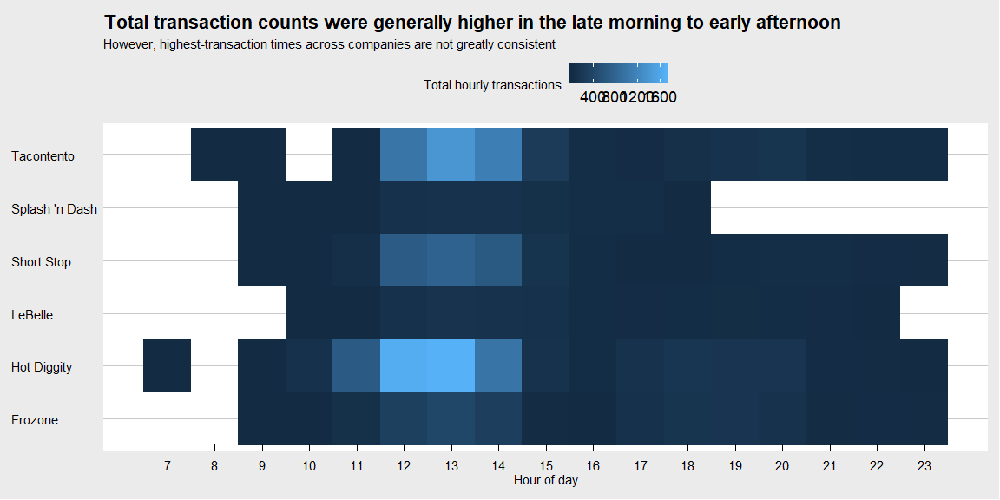
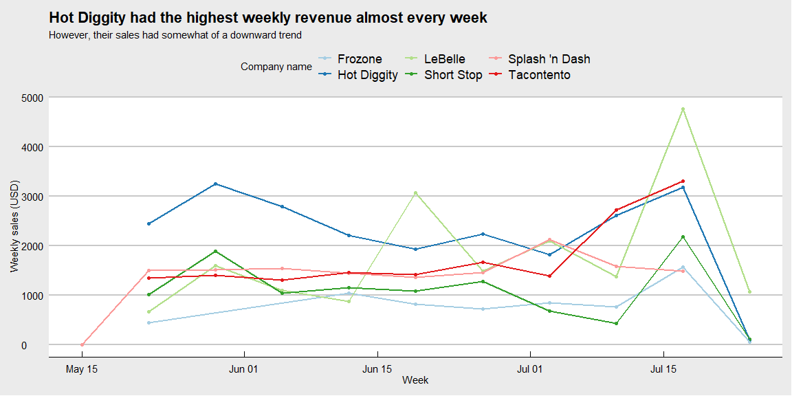
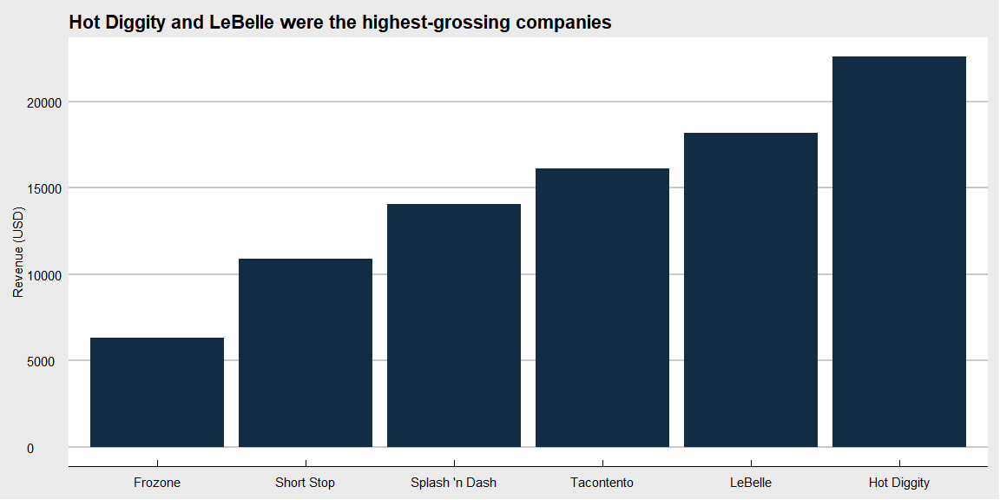
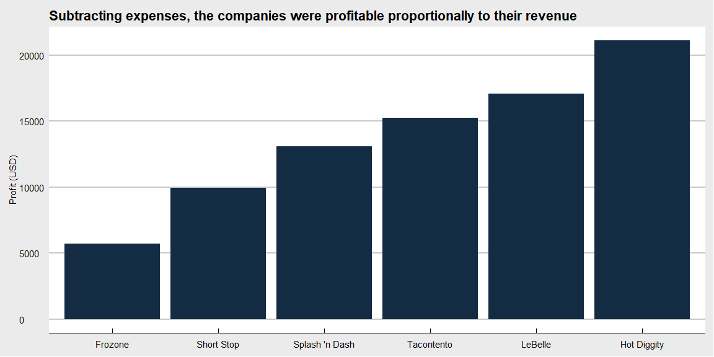

## Background

We have transaction data for a few businesses that have been in operation for three months. Each of these companies has come to your investment company for a loan to expand their business. Your boss has asked you to go through the transactions for each business and provide daily, weekly, and monthly gross revenue summaries and comparisons. Your boss would like a short write up with tables and visualizations that help with the decision of which company did the best over the three month period. You will also need to provide a short paragraph with your recommendation after building your analysis.

## Assumptions

LaBelle had a huge transaction at the very end, which could have been from selling off inventory or materials. I decided to keep it.

Tacontento, Frozone, and Hot Diggity had one or two gigantic transactions each, which could have been from catering. I'm also keeping those.

Splash 'n Dash had one $350 sale that towered above all the others. How can they make that much on a single transaction from a service that costs about $30? They would have needed a single customer with close to 10 cars to accomplish that. The most likely scenario is that they made an entry error when they meant to enter $35, so I changed it.

Hot Diggity recorded a sale on April 20, which is weeks before the companies were formed. I assumed an entry error in May and corrected it accordingly.

Presumably, no sales were made on Sundays, so I removed the three transactions on those days.

Sales for an amount of $0.00 were bogus entries. I removed them.

Finally, negative numbers were expenses. I kept and used them on the last chart.


```r
library(tidyverse)
library(lubridate)

# Get all valid transactions
# Notes on the data:
# LaBelle had a huge transaction at the very end, which could have been selling off inventory or materials. Keeping it.
# Tacontento, Frozone, and Hot Diggity had one or two big transaction each, which could have been catering. Keeping it.
ibc_transactions <- read_csv("https://byuistats.github.io/M335/data/sales.csv") %>%
  mutate(
    Time = as_datetime(Time, tz = "America/Denver"),
    Time = replace(  # fix a sale on April 20, before companies were formed: assuming entry error in May
      Time,
      Time == as_datetime("2016-04-20 13:01:00", tz = "America/Denver"),
      as_datetime("2016-05-20 13:01:00", tz = "America/Denver")
    ),
    Amount = replace(  # how could Splash and Dash have a single $350 transaction with a ~$30 service? Assuming $35
      Amount,
      Amount == 350,
      35.00
    ),
    `Company name` = case_when(  # use the businesses' real names
      Name == "HotDiggity" ~ "Hot Diggity",
      Name == "ShortStop" ~ "Short Stop",
      Name == "SplashandDash" ~ "Splash 'n Dash",
      TRUE ~ Name
    ),
    Week = ceiling_date(Time, "week"),
    Day = ceiling_date(Time, "day"),
    `Hour of day` = hour(ceiling_date(Time, "hour"))
  ) %>%
  filter(
    Name != "Missing",
    Amount != 0,  # not using $0 transactions but keeping negatives (expenses)
    wday(Time) != 1  # remove Sunday transactions
  )

# Get the sales only
ibc_sales <- ibc_transactions %>%
  filter(Amount > 0)

# Get the expenses only
ibc_expenses <- ibc_transactions %>%
  filter(Amount < 0)

# View(ibc_transactions)
# View(ibc_sales)
# View(ibc_expenses)

# Explore the data
# ibc_transactions %>%
#   group_by(Name) %>%
#   summarise(
#     count = n(),
#     min_value = min(Amount),
#     max_value = max(Amount),
#     total = sum(Amount)
#   ) %>%
#   View()

# Exploratory plot
# ibc_transactions %>%
#   ggplot(aes(Time, Amount)) +
#   geom_jitter() +
#   coord_cartesian(xlim = ) +
#   facet_wrap(~ Name)
```

## Which company had the highest amount of transactions, and at what times?


```r
library(ggthemes)

ibc_sales %>%
  group_by(`Company name`, `Hour of day`) %>%
  summarise(`Total hourly transactions` = n()) %>%
  filter(`Hour of day` >= 7) %>%  # hard to believe anyone sold anything before 7 a.m.
  ggplot(aes(`Hour of day`, `Company name`)) +
  geom_tile(aes(fill = `Total hourly transactions`)) +  # how to avoid legend number overlap? Or make this an average?
  scale_x_continuous(labels = 7:23, breaks = 7:23) +  # thanks to tingyao1 for this tidbit and a few other elements here
  labs(
    title = "Total transaction counts were generally higher in the late morning to early afternoon",
    subtitle = "However, highest-transaction times across companies are not greatly consistent",
    y = NULL
  ) +
  theme_economist_white()
```

<!-- -->

## What were week-to-week sales like?


```r
ibc_sales %>%
  group_by(`Company name`, Week) %>%
  summarise(`Weekly sales (USD)` = sum(Amount)) %>%
  ggplot(aes(Week, `Weekly sales (USD)`, color = `Company name`)) +
  geom_point() +
  geom_line(size = 1) +
  scale_color_brewer(type = "qual", palette = 3) +
  labs(
    title = "Hot Diggity had the highest weekly revenue almost every week",
    subtitle = "However, their sales had somewhat of a downward trend") +
  theme_economist_white()
```

<!-- -->

## Who had the highest revenue? What about the highest profit?


```r
ibc_sales %>%
  group_by(`Company name`) %>%
  summarise(`Revenue (USD)` = sum(Amount)) %>%
  ggplot(aes(reorder(`Company name`, `Revenue (USD)`), `Revenue (USD)`)) +
  geom_bar(stat = "identity", fill = "#132B43") +
  labs(
    title = "Hot Diggity and LeBelle were the highest-grossing companies",
    x = NULL
  ) +
  theme_economist_white()
```

<!-- -->


```r
ibc_transactions %>%
  group_by(`Company name`) %>%
  summarise(`Profit (USD)` = sum(Amount)) %>%
  ggplot(aes(reorder(`Company name`, `Profit (USD)`), `Profit (USD)`)) +
  geom_bar(stat = "identity", fill = "#132B43") +
  labs(
    title = "Subtracting expenses, the companies were profitable proportionally to their revenue",
    x = NULL
  ) +
  theme_economist_white()
```

<!-- -->

## Recommendation

Not only was Hot Diggity the  highest-grossing company---it was also the most profitable. Although there is a sharp decline in sales in the last few days, all companies that operated during those days had the same decline because that is a much shorter week. If we ignore that last week, we see that Hot Diggity was on the way up and has, arguably, the most potential for growth.

As an alternative, Tacontento saw tremendous revenue growth in the last two weeks, overtaking Hot Diggity. Their increase was much sharper than Hot Diggity's during the last few days, suggesting that they could have grown at a faster pace in the future. They just happen to have less cash on hand than Hot Diggity, so my recommendation remains with the latter.

### Fin
