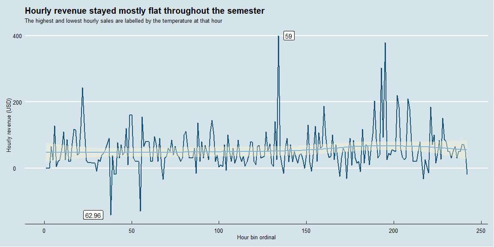

## Is there a correlation between car detailing sales and outside temperature?

These two plots show little to no growth in hourly sales for Splash and Dash over the course of the semester. Temperatures trended upward throughout the semester while sales did not.

Please note that negative revenue values were included in the plots since they were likely promotions and other calculated (or accidental) losses.


```r
library(tidyverse)
library(lubridate)
library(riem)
library(ggthemes)

### Hourly Splash and Dash data - I did IBC with these guys while I was doing Philly Up
hourly_sales_totals <- read_csv("https://byuistats.github.io/M335/data/carwash.csv") %>%
  transmute(
    time_stamp = as_datetime(time, tz = "America/Denver"),
    hour_bin = ceiling_date(time_stamp, "hour"),
    revenue = amount
  ) %>%
  group_by(hour_bin) %>%
  summarise(hour_total_revenue = sum(revenue))

# View(hourly_sales_totals)


### Pull in the Rexburg weather data
file_name <- "rxe-weather-data.rds"

# riem_measures(
#   station = "RXE",
#   date_start = "2016-05-13",
#   date_end = "2016-07-18"
# ) %>%
#   write_rds(file_name)

# Hourly weather data in Rexburg
hourly_temp <- read_rds(file_name) %>%
  filter(!is.na(tmpf)) %>%
  transmute(
    time_stamp = as_datetime(valid, tz = "America/Denver"),
    hour_bin = ceiling_date(time_stamp, "hour"),
    temp_f = tmpf
  )

# View(hourly_temp)


### Join the two datasets
sales_temp <- hourly_sales_totals %>%
  left_join(hourly_temp, by = "hour_bin") %>%
  filter(!is.na(temp_f)) %>%
  mutate(hour_bin_id = row_number())

# View(sales_temp)


# Plot the temperature data
sales_temp %>%
  ggplot(aes(hour_bin_id, temp_f)) +
  geom_line(colour = "#1a5276", size = 1) +
  geom_smooth(colour = "#7fb3d5", fill = "#fcf3cf") +
  labs(
    title = "Temperatures trended upward throughout the semester",
    x = "Hour bin ordinal",
    y = "Temperature (Fahrenheit)"
  ) +
  theme_economist()
```

<!-- -->

```r
# Plot the sales data
min_revenue <- sales_temp %>%
  filter(hour_total_revenue == min(hour_total_revenue))

max_revenue <- sales_temp %>%
  filter(hour_total_revenue == max(hour_total_revenue))

sales_temp %>%
  ggplot(aes(hour_bin_id, hour_total_revenue)) +
  geom_line(colour = "#1a5276", size = 1) +
  geom_smooth(colour = "#7fb3d5", fill = "#fcf3cf") +
  geom_label(aes(label = temp_f), data = max_revenue, nudge_x = 6) +
  geom_label(aes(label = temp_f), data = min_revenue, nudge_x = -10) +
  labs(
    title = "Hourly revenue stayed mostly flat throughout the semester",
    subtitle = "The highest and lowest hourly sales are labelled by the temperature at that hour",
    x = "Hour bin ordinal",
    y = "Hourly revenue (USD)"
  ) +
  theme_economist()
```

<!-- -->

### Sales vs.temperature

This last plot shows an interesting trend: sales tended to be higher at temperatures between ~55 and ~75 degrees.

(Note from class discussion by Brother Hathaway: this graph is confounding temperature with time of day because the peak time for car washes, late morning to mid-afternoon, is also when temperatures tend to be warmest.)


```r
# Plot sales against temperature
sales_temp %>%
  ggplot(aes(temp_f, hour_total_revenue)) +
  geom_jitter(colour = "#1a5276", size = 1) +
  geom_smooth(colour = "#7fb3d5", fill = "#fcf3cf") +
  geom_label(aes(label = temp_f), data = max_revenue, nudge_x = 1.5, nudge_y = 2) +
  geom_label(aes(label = temp_f), data = min_revenue, nudge_x = 2, nudge_y = 2) +
  labs(
    title = "Sales tended to be highest between about 55 and 75 degrees",
    subtitle = "The highest and lowest hourly sales are labelled by the temperature at that hour",
    x = "Hourly temperature (Fahrenheit)",
    y = "Hourly revenue (USD)"
  ) +
  theme_economist()
```

<!-- -->
