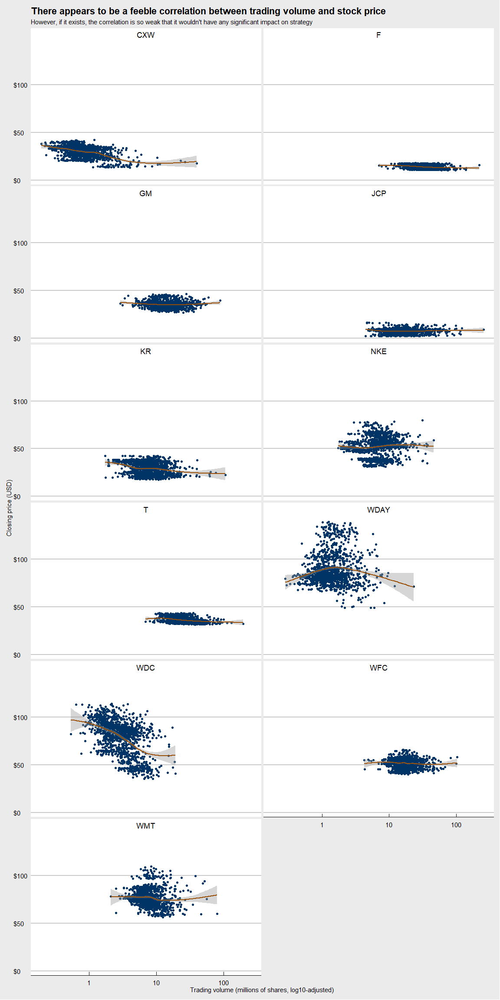

```r
library(tidyverse)
library(tidyquant)
library(lubridate)

tickers_today <- c("CXW", "F", "GM", "JCP", "KR", "WDC", "NKE","T", "WDAY", "WFC", "WMT")
stocks_data <- tibble()

for (i in seq_along(tickers_today)) {
  stock <- tq_get(
      tickers_today[[i]],
      get = "stock.prices"
    ) %>%
    filter(date >= today() - years(5)) %>%
    mutate(symbol = tickers_today[[i]])

  stocks_data <- rbind(stocks_data, stock)
}
```

## Five-year closing price history

The following charts show the closing price for each stock every trading day for the last 5 years. The price scale goes from 0 to the maximum price in the entire dataset to ensure a common y-axis scale.


```r
library(tidyverse)
library(dygraphs)
library(timetk)
library(htmltools)

dg_plots <- vector("list", length = length(tickers_today))

for (i in seq_along(tickers_today)) {
  # The highest closing price in the dataset plus some padding, to set a common y-scale
  #y_max <- stocks_data$close %>% max() + 10

  # Data only for the stock in this iteration
  this_stock <- stocks_data %>%
    filter(symbol == tickers_today[[i]])

  # Highest 5-year price for the current stock
  high_row <- this_stock %>%
    filter(close == max(close)) %>%
    mutate(close = round(close, digits = 2))

  # Lowest 5-year price for the current stock
  low_row <- this_stock %>%
    filter(close == min(close)) %>%
    mutate(close = round(close, digits = 2))

  # Add to the list of plots
  dg_plots[[i]] <- this_stock %>%
    select(date, close) %>%
    tk_xts() %>%
    dygraph(
      main = paste(tickers_today[[i]], "5-year closing price history"),
      ylab = "Closing price (USD)",
      width = "100%",
      height = "500"
    ) %>%
    #dyAxis("y", valueRange = c(0, y_max)) %>%
    dyOptions(fillGraph = TRUE, gridLineColor = "#dddddd") %>%
    dySeries("close", label = "Closing price") %>%
    dyAnnotation(
      high_row$date,
      text = paste("$", high_row$close, sep = ""),
      width = 55,
      height = 20
    ) %>%
    dyAnnotation(
      low_row$date,
      text = paste("$", low_row$close, sep = ""),
      width = 55,
      height = 20
    )
}

# Display the plots on the page
tagList(dg_plots)
```

<!--html_preserve--><div id="htmlwidget-d2b468b9f5086892635f" style="width:100%;height:500px;" class="dygraphs html-widget"></div>
<script type="application/json" data-for="htmlwidget-d2b468b9f5086892635f">{"x":{"attrs":{"title":"CXW 5-year closing price history","ylabel":"Closing price (USD)","labels":["day","Closing price"],"legend":"auto","retainDateWindow":false,"axes":{"x":{"pixelsPerLabel":60,"drawAxis":true},"y":{"drawAxis":true}},"stackedGraph":false,"fillGraph":true,"fillAlpha":0.15,"stepPlot":false,"drawPoints":false,"pointSize":1,"drawGapEdgePoints":false,"connectSeparatedPoints":false,"strokeWidth":1,"strokeBorderColor":"white","colorValue":0.5,"colorSaturation":1,"includeZero":false,"drawAxesAtZero":false,"logscale":false,"axisTickSize":3,"axisLineColor":"black","axisLineWidth":0.3,"axisLabelColor":"black","axisLabelFontSize":14,"axisLabelWidth":60,"drawGrid":true,"gridLineColor":"#dddddd","gridLineWidth":0.3,"rightGap":5,"digitsAfterDecimal":2,"labelsKMB":false,"labelsKMG2":false,"labelsUTC":false,"maxNumberWidth":6,"animatedZooms":false,"mobileDisableYTouch":true,"series":{"Closing price":{"axis":"y"}}},"scale":"daily","annotations":[{"x":"2015-03-20T00:00:00.000Z","shortText":"$42.1","width":55,"height":20,"attachAtBottom":false,"series":"Closing price"},{"x":"2016-10-28T00:00:00.000Z","shortText":"$13.18","width":55,"height":20,"attachAtBottom":false,"series":"Closing price"}],"shadings":[],"events":[],"format":"date","data":[["2013-07-19T00:00:00.000Z","2013-07-22T00:00:00.000Z","2013-07-23T00:00:00.000Z","2013-07-24T00:00:00.000Z","2013-07-25T00:00:00.000Z","2013-07-26T00:00:00.000Z","2013-07-29T00:00:00.000Z","2013-07-30T00:00:00.000Z","2013-07-31T00:00:00.000Z","2013-08-01T00:00:00.000Z","2013-08-02T00:00:00.000Z","2013-08-05T00:00:00.000Z","2013-08-06T00:00:00.000Z","2013-08-07T00:00:00.000Z","2013-08-08T00:00:00.000Z","2013-08-09T00:00:00.000Z","2013-08-12T00:00:00.000Z","2013-08-13T00:00:00.000Z","2013-08-14T00:00:00.000Z","2013-08-15T00:00:00.000Z","2013-08-16T00:00:00.000Z","2013-08-19T00:00:00.000Z","2013-08-20T00:00:00.000Z","2013-08-21T00:00:00.000Z","2013-08-22T00:00:00.000Z","2013-08-23T00:00:00.000Z","2013-08-26T00:00:00.000Z","2013-08-27T00:00:00.000Z","2013-08-28T00:00:00.000Z","2013-08-29T00:00:00.000Z","2013-08-30T00:00:00.000Z","2013-09-03T00:00:00.000Z","2013-09-04T00:00:00.000Z","2013-09-05T00:00:00.000Z","2013-09-06T00:00:00.000Z","2013-09-09T00:00:00.000Z","2013-09-10T00:00:00.000Z","2013-09-11T00:00:00.000Z","2013-09-12T00:00:00.000Z","2013-09-13T00:00:00.000Z","2013-09-16T00:00:00.000Z","2013-09-17T00:00:00.000Z","2013-09-18T00:00:00.000Z","2013-09-19T00:00:00.000Z","2013-09-20T00:00:00.000Z","2013-09-23T00:00:00.000Z","2013-09-24T00:00:00.000Z","2013-09-25T00:00:00.000Z","2013-09-26T00:00:00.000Z","2013-09-27T00:00:00.000Z","2013-09-30T00:00:00.000Z","2013-10-01T00:00:00.000Z","2013-10-02T00:00:00.000Z","2013-10-03T00:00:00.000Z","2013-10-04T00:00:00.000Z","2013-10-07T00:00:00.000Z","2013-10-08T00:00:00.000Z","2013-10-09T00:00:00.000Z","2013-10-10T00:00:00.000Z","2013-10-11T00:00:00.000Z","2013-10-14T00:00:00.000Z","2013-10-15T00:00:00.000Z","2013-10-16T00:00:00.000Z","2013-10-17T00:00:00.000Z","2013-10-18T00:00:00.000Z","2013-10-21T00:00:00.000Z","2013-10-22T00:00:00.000Z","2013-10-23T00:00:00.000Z","2013-10-24T00:00:00.000Z","2013-10-25T00:00:00.000Z","2013-10-28T00:00:00.000Z","2013-10-29T00:00:00.000Z","2013-10-30T00:00:00.000Z","2013-10-31T00:00:00.000Z","2013-11-01T00:00:00.000Z","2013-11-04T00:00:00.000Z","2013-11-05T00:00:00.000Z","2013-11-06T00:00:00.000Z","2013-11-07T00:00:00.000Z","2013-11-08T00:00:00.000Z","2013-11-11T00:00:00.000Z","2013-11-12T00:00:00.000Z","2013-11-13T00:00:00.000Z","2013-11-14T00:00:00.000Z","2013-11-15T00:00:00.000Z","2013-11-18T00:00:00.000Z","2013-11-19T00:00:00.000Z","2013-11-20T00:00:00.000Z","2013-11-21T00:00:00.000Z","2013-11-22T00:00:00.000Z","2013-11-25T00:00:00.000Z","2013-11-26T00:00:00.000Z","2013-11-27T00:00:00.000Z","2013-11-29T00:00:00.000Z","2013-12-02T00:00:00.000Z","2013-12-03T00:00:00.000Z","2013-12-04T00:00:00.000Z","2013-12-05T00:00:00.000Z","2013-12-06T00:00:00.000Z","2013-12-09T00:00:00.000Z","2013-12-10T00:00:00.000Z","2013-12-11T00:00:00.000Z","2013-12-12T00:00:00.000Z","2013-12-13T00:00:00.000Z","2013-12-16T00:00:00.000Z","2013-12-17T00:00:00.000Z","2013-12-18T00:00:00.000Z","2013-12-19T00:00:00.000Z","2013-12-20T00:00:00.000Z","2013-12-23T00:00:00.000Z","2013-12-24T00:00:00.000Z","2013-12-26T00:00:00.000Z","2013-12-27T00:00:00.000Z","2013-12-30T00:00:00.000Z","2013-12-31T00:00:00.000Z","2014-01-02T00:00:00.000Z","2014-01-03T00:00:00.000Z","2014-01-06T00:00:00.000Z","2014-01-07T00:00:00.000Z","2014-01-08T00:00:00.000Z","2014-01-09T00:00:00.000Z","2014-01-10T00:00:00.000Z","2014-01-13T00:00:00.000Z","2014-01-14T00:00:00.000Z","2014-01-15T00:00:00.000Z","2014-01-16T00:00:00.000Z","2014-01-17T00:00:00.000Z","2014-01-21T00:00:00.000Z","2014-01-22T00:00:00.000Z","2014-01-23T00:00:00.000Z","2014-01-24T00:00:00.000Z","2014-01-27T00:00:00.000Z","2014-01-28T00:00:00.000Z","2014-01-29T00:00:00.000Z","2014-01-30T00:00:00.000Z","2014-01-31T00:00:00.000Z","2014-02-03T00:00:00.000Z","2014-02-04T00:00:00.000Z","2014-02-05T00:00:00.000Z","2014-02-06T00:00:00.000Z","2014-02-07T00:00:00.000Z","2014-02-10T00:00:00.000Z","2014-02-11T00:00:00.000Z","2014-02-12T00:00:00.000Z","2014-02-13T00:00:00.000Z","2014-02-14T00:00:00.000Z","2014-02-18T00:00:00.000Z","2014-02-19T00:00:00.000Z","2014-02-20T00:00:00.000Z","2014-02-21T00:00:00.000Z","2014-02-24T00:00:00.000Z","2014-02-25T00:00:00.000Z","2014-02-26T00:00:00.000Z","2014-02-27T00:00:00.000Z","2014-02-28T00:00:00.000Z","2014-03-03T00:00:00.000Z","2014-03-04T00:00:00.000Z","2014-03-05T00:00:00.000Z","2014-03-06T00:00:00.000Z","2014-03-07T00:00:00.000Z","2014-03-10T00:00:00.000Z","2014-03-11T00:00:00.000Z","2014-03-12T00:00:00.000Z","2014-03-13T00:00:00.000Z","2014-03-14T00:00:00.000Z","2014-03-17T00:00:00.000Z","2014-03-18T00:00:00.000Z","2014-03-19T00:00:00.000Z","2014-03-20T00:00:00.000Z","2014-03-21T00:00:00.000Z","2014-03-24T00:00:00.000Z","2014-03-25T00:00:00.000Z","2014-03-26T00:00:00.000Z","2014-03-27T00:00:00.000Z","2014-03-28T00:00:00.000Z","2014-03-31T00:00:00.000Z","2014-04-01T00:00:00.000Z","2014-04-02T00:00:00.000Z","2014-04-03T00:00:00.000Z","2014-04-04T00:00:00.000Z","2014-04-07T00:00:00.000Z","2014-04-08T00:00:00.000Z","2014-04-09T00:00:00.000Z","2014-04-10T00:00:00.000Z","2014-04-11T00:00:00.000Z","2014-04-14T00:00:00.000Z","2014-04-15T00:00:00.000Z","2014-04-16T00:00:00.000Z","2014-04-17T00:00:00.000Z","2014-04-21T00:00:00.000Z","2014-04-22T00:00:00.000Z","2014-04-23T00:00:00.000Z","2014-04-24T00:00:00.000Z","2014-04-25T00:00:00.000Z","2014-04-28T00:00:00.000Z","2014-04-29T00:00:00.000Z","2014-04-30T00:00:00.000Z","2014-05-01T00:00:00.000Z","2014-05-02T00:00:00.000Z","2014-05-05T00:00:00.000Z","2014-05-06T00:00:00.000Z","2014-05-07T00:00:00.000Z","2014-05-08T00:00:00.000Z","2014-05-09T00:00:00.000Z","2014-05-12T00:00:00.000Z","2014-05-13T00:00:00.000Z","2014-05-14T00:00:00.000Z","2014-05-15T00:00:00.000Z","2014-05-16T00:00:00.000Z","2014-05-19T00:00:00.000Z","2014-05-20T00:00:00.000Z","2014-05-21T00:00:00.000Z","2014-05-22T00:00:00.000Z","2014-05-23T00:00:00.000Z","2014-05-27T00:00:00.000Z","2014-05-28T00:00:00.000Z","2014-05-29T00:00:00.000Z","2014-05-30T00:00:00.000Z","2014-06-02T00:00:00.000Z","2014-06-03T00:00:00.000Z","2014-06-04T00:00:00.000Z","2014-06-05T00:00:00.000Z","2014-06-06T00:00:00.000Z","2014-06-09T00:00:00.000Z","2014-06-10T00:00:00.000Z","2014-06-11T00:00:00.000Z","2014-06-12T00:00:00.000Z","2014-06-13T00:00:00.000Z","2014-06-16T00:00:00.000Z","2014-06-17T00:00:00.000Z","2014-06-18T00:00:00.000Z","2014-06-19T00:00:00.000Z","2014-06-20T00:00:00.000Z","2014-06-23T00:00:00.000Z","2014-06-24T00:00:00.000Z","2014-06-25T00:00:00.000Z","2014-06-26T00:00:00.000Z","2014-06-27T00:00:00.000Z","2014-06-30T00:00:00.000Z","2014-07-01T00:00:00.000Z","2014-07-02T00:00:00.000Z","2014-07-03T00:00:00.000Z","2014-07-07T00:00:00.000Z","2014-07-08T00:00:00.000Z","2014-07-09T00:00:00.000Z","2014-07-10T00:00:00.000Z","2014-07-11T00:00:00.000Z","2014-07-14T00:00:00.000Z","2014-07-15T00:00:00.000Z","2014-07-16T00:00:00.000Z","2014-07-17T00:00:00.000Z","2014-07-18T00:00:00.000Z","2014-07-21T00:00:00.000Z","2014-07-22T00:00:00.000Z","2014-07-23T00:00:00.000Z","2014-07-24T00:00:00.000Z","2014-07-25T00:00:00.000Z","2014-07-28T00:00:00.000Z","2014-07-29T00:00:00.000Z","2014-07-30T00:00:00.000Z","2014-07-31T00:00:00.000Z","2014-08-01T00:00:00.000Z","2014-08-04T00:00:00.000Z","2014-08-05T00:00:00.000Z","2014-08-06T00:00:00.000Z","2014-08-07T00:00:00.000Z","2014-08-08T00:00:00.000Z","2014-08-11T00:00:00.000Z","2014-08-12T00:00:00.000Z","2014-08-13T00:00:00.000Z","2014-08-14T00:00:00.000Z","2014-08-15T00:00:00.000Z","2014-08-18T00:00:00.000Z","2014-08-19T00:00:00.000Z","2014-08-20T00:00:00.000Z","2014-08-21T00:00:00.000Z","2014-08-22T00:00:00.000Z","2014-08-25T00:00:00.000Z","2014-08-26T00:00:00.000Z","2014-08-27T00:00:00.000Z","2014-08-28T00:00:00.000Z","2014-08-29T00:00:00.000Z","2014-09-02T00:00:00.000Z","2014-09-03T00:00:00.000Z","2014-09-04T00:00:00.000Z","2014-09-05T00:00:00.000Z","2014-09-08T00:00:00.000Z","2014-09-09T00:00:00.000Z","2014-09-10T00:00:00.000Z","2014-09-11T00:00:00.000Z","2014-09-12T00:00:00.000Z","2014-09-15T00:00:00.000Z","2014-09-16T00:00:00.000Z","2014-09-17T00:00:00.000Z","2014-09-18T00:00:00.000Z","2014-09-19T00:00:00.000Z","2014-09-22T00:00:00.000Z","2014-09-23T00:00:00.000Z","2014-09-24T00:00:00.000Z","2014-09-25T00:00:00.000Z","2014-09-26T00:00:00.000Z","2014-09-29T00:00:00.000Z","2014-09-30T00:00:00.000Z","2014-10-01T00:00:00.000Z","2014-10-02T00:00:00.000Z","2014-10-03T00:00:00.000Z","2014-10-06T00:00:00.000Z","2014-10-07T00:00:00.000Z","2014-10-08T00:00:00.000Z","2014-10-09T00:00:00.000Z","2014-10-10T00:00:00.000Z","2014-10-13T00:00:00.000Z","2014-10-14T00:00:00.000Z","2014-10-15T00:00:00.000Z","2014-10-16T00:00:00.000Z","2014-10-17T00:00:00.000Z","2014-10-20T00:00:00.000Z","2014-10-21T00:00:00.000Z","2014-10-22T00:00:00.000Z","2014-10-23T00:00:00.000Z","2014-10-24T00:00:00.000Z","2014-10-27T00:00:00.000Z","2014-10-28T00:00:00.000Z","2014-10-29T00:00:00.000Z","2014-10-30T00:00:00.000Z","2014-10-31T00:00:00.000Z","2014-11-03T00:00:00.000Z","2014-11-04T00:00:00.000Z","2014-11-05T00:00:00.000Z","2014-11-06T00:00:00.000Z","2014-11-07T00:00:00.000Z","2014-11-10T00:00:00.000Z","2014-11-11T00:00:00.000Z","2014-11-12T00:00:00.000Z","2014-11-13T00:00:00.000Z","2014-11-14T00:00:00.000Z","2014-11-17T00:00:00.000Z","2014-11-18T00:00:00.000Z","2014-11-19T00:00:00.000Z","2014-11-20T00:00:00.000Z","2014-11-21T00:00:00.000Z","2014-11-24T00:00:00.000Z","2014-11-25T00:00:00.000Z","2014-11-26T00:00:00.000Z","2014-11-28T00:00:00.000Z","2014-12-01T00:00:00.000Z","2014-12-02T00:00:00.000Z","2014-12-03T00:00:00.000Z","2014-12-04T00:00:00.000Z","2014-12-05T00:00:00.000Z","2014-12-08T00:00:00.000Z","2014-12-09T00:00:00.000Z","2014-12-10T00:00:00.000Z","2014-12-11T00:00:00.000Z","2014-12-12T00:00:00.000Z","2014-12-15T00:00:00.000Z","2014-12-16T00:00:00.000Z","2014-12-17T00:00:00.000Z","2014-12-18T00:00:00.000Z","2014-12-19T00:00:00.000Z","2014-12-22T00:00:00.000Z","2014-12-23T00:00:00.000Z","2014-12-24T00:00:00.000Z","2014-12-26T00:00:00.000Z","2014-12-29T00:00:00.000Z","2014-12-30T00:00:00.000Z","2014-12-31T00:00:00.000Z","2015-01-02T00:00:00.000Z","2015-01-05T00:00:00.000Z","2015-01-06T00:00:00.000Z","2015-01-07T00:00:00.000Z","2015-01-08T00:00:00.000Z","2015-01-09T00:00:00.000Z","2015-01-12T00:00:00.000Z","2015-01-13T00:00:00.000Z","2015-01-14T00:00:00.000Z","2015-01-15T00:00:00.000Z","2015-01-16T00:00:00.000Z","2015-01-20T00:00:00.000Z","2015-01-21T00:00:00.000Z","2015-01-22T00:00:00.000Z","2015-01-23T00:00:00.000Z","2015-01-26T00:00:00.000Z","2015-01-27T00:00:00.000Z","2015-01-28T00:00:00.000Z","2015-01-29T00:00:00.000Z","2015-01-30T00:00:00.000Z","2015-02-02T00:00:00.000Z","2015-02-03T00:00:00.000Z","2015-02-04T00:00:00.000Z","2015-02-05T00:00:00.000Z","2015-02-06T00:00:00.000Z","2015-02-09T00:00:00.000Z","2015-02-10T00:00:00.000Z","2015-02-11T00:00:00.000Z","2015-02-12T00:00:00.000Z","2015-02-13T00:00:00.000Z","2015-02-17T00:00:00.000Z","2015-02-18T00:00:00.000Z","2015-02-19T00:00:00.000Z","2015-02-20T00:00:00.000Z","2015-02-23T00:00:00.000Z","2015-02-24T00:00:00.000Z","2015-02-25T00:00:00.000Z","2015-02-26T00:00:00.000Z","2015-02-27T00:00:00.000Z","2015-03-02T00:00:00.000Z","2015-03-03T00:00:00.000Z","2015-03-04T00:00:00.000Z","2015-03-05T00:00:00.000Z","2015-03-06T00:00:00.000Z","2015-03-09T00:00:00.000Z","2015-03-10T00:00:00.000Z","2015-03-11T00:00:00.000Z","2015-03-12T00:00:00.000Z","2015-03-13T00:00:00.000Z","2015-03-16T00:00:00.000Z","2015-03-17T00:00:00.000Z","2015-03-18T00:00:00.000Z","2015-03-19T00:00:00.000Z","2015-03-20T00:00:00.000Z","2015-03-23T00:00:00.000Z","2015-03-24T00:00:00.000Z","2015-03-25T00:00:00.000Z","2015-03-26T00:00:00.000Z","2015-03-27T00:00:00.000Z","2015-03-30T00:00:00.000Z","2015-03-31T00:00:00.000Z","2015-04-01T00:00:00.000Z","2015-04-02T00:00:00.000Z","2015-04-06T00:00:00.000Z","2015-04-07T00:00:00.000Z","2015-04-08T00:00:00.000Z","2015-04-09T00:00:00.000Z","2015-04-10T00:00:00.000Z","2015-04-13T00:00:00.000Z","2015-04-14T00:00:00.000Z","2015-04-15T00:00:00.000Z","2015-04-16T00:00:00.000Z","2015-04-17T00:00:00.000Z","2015-04-20T00:00:00.000Z","2015-04-21T00:00:00.000Z","2015-04-22T00:00:00.000Z","2015-04-23T00:00:00.000Z","2015-04-24T00:00:00.000Z","2015-04-27T00:00:00.000Z","2015-04-28T00:00:00.000Z","2015-04-29T00:00:00.000Z","2015-04-30T00:00:00.000Z","2015-05-01T00:00:00.000Z","2015-05-04T00:00:00.000Z","2015-05-05T00:00:00.000Z","2015-05-06T00:00:00.000Z","2015-05-07T00:00:00.000Z","2015-05-08T00:00:00.000Z","2015-05-11T00:00:00.000Z","2015-05-12T00:00:00.000Z","2015-05-13T00:00:00.000Z","2015-05-14T00:00:00.000Z","2015-05-15T00:00:00.000Z","2015-05-18T00:00:00.000Z","2015-05-19T00:00:00.000Z","2015-05-20T00:00:00.000Z","2015-05-21T00:00:00.000Z","2015-05-22T00:00:00.000Z","2015-05-26T00:00:00.000Z","2015-05-27T00:00:00.000Z","2015-05-28T00:00:00.000Z","2015-05-29T00:00:00.000Z","2015-06-01T00:00:00.000Z","2015-06-02T00:00:00.000Z","2015-06-03T00:00:00.000Z","2015-06-04T00:00:00.000Z","2015-06-05T00:00:00.000Z","2015-06-08T00:00:00.000Z","2015-06-09T00:00:00.000Z","2015-06-10T00:00:00.000Z","2015-06-11T00:00:00.000Z","2015-06-12T00:00:00.000Z","2015-06-15T00:00:00.000Z","2015-06-16T00:00:00.000Z","2015-06-17T00:00:00.000Z","2015-06-18T00:00:00.000Z","2015-06-19T00:00:00.000Z","2015-06-22T00:00:00.000Z","2015-06-23T00:00:00.000Z","2015-06-24T00:00:00.000Z","2015-06-25T00:00:00.000Z","2015-06-26T00:00:00.000Z","2015-06-29T00:00:00.000Z","2015-06-30T00:00:00.000Z","2015-07-01T00:00:00.000Z","2015-07-02T00:00:00.000Z","2015-07-06T00:00:00.000Z","2015-07-07T00:00:00.000Z","2015-07-08T00:00:00.000Z","2015-07-09T00:00:00.000Z","2015-07-10T00:00:00.000Z","2015-07-13T00:00:00.000Z","2015-07-14T00:00:00.000Z","2015-07-15T00:00:00.000Z","2015-07-16T00:00:00.000Z","2015-07-17T00:00:00.000Z","2015-07-20T00:00:00.000Z","2015-07-21T00:00:00.000Z","2015-07-22T00:00:00.000Z","2015-07-23T00:00:00.000Z","2015-07-24T00:00:00.000Z","2015-07-27T00:00:00.000Z","2015-07-28T00:00:00.000Z","2015-07-29T00:00:00.000Z","2015-07-30T00:00:00.000Z","2015-07-31T00:00:00.000Z","2015-08-03T00:00:00.000Z","2015-08-04T00:00:00.000Z","2015-08-05T00:00:00.000Z","2015-08-06T00:00:00.000Z","2015-08-07T00:00:00.000Z","2015-08-10T00:00:00.000Z","2015-08-11T00:00:00.000Z","2015-08-12T00:00:00.000Z","2015-08-13T00:00:00.000Z","2015-08-14T00:00:00.000Z","2015-08-17T00:00:00.000Z","2015-08-18T00:00:00.000Z","2015-08-19T00:00:00.000Z","2015-08-20T00:00:00.000Z","2015-08-21T00:00:00.000Z","2015-08-24T00:00:00.000Z","2015-08-25T00:00:00.000Z","2015-08-26T00:00:00.000Z","2015-08-27T00:00:00.000Z","2015-08-28T00:00:00.000Z","2015-08-31T00:00:00.000Z","2015-09-01T00:00:00.000Z","2015-09-02T00:00:00.000Z","2015-09-03T00:00:00.000Z","2015-09-04T00:00:00.000Z","2015-09-08T00:00:00.000Z","2015-09-09T00:00:00.000Z","2015-09-10T00:00:00.000Z","2015-09-11T00:00:00.000Z","2015-09-14T00:00:00.000Z","2015-09-15T00:00:00.000Z","2015-09-16T00:00:00.000Z","2015-09-17T00:00:00.000Z","2015-09-18T00:00:00.000Z","2015-09-21T00:00:00.000Z","2015-09-22T00:00:00.000Z","2015-09-23T00:00:00.000Z","2015-09-24T00:00:00.000Z","2015-09-25T00:00:00.000Z","2015-09-28T00:00:00.000Z","2015-09-29T00:00:00.000Z","2015-09-30T00:00:00.000Z","2015-10-01T00:00:00.000Z","2015-10-02T00:00:00.000Z","2015-10-05T00:00:00.000Z","2015-10-06T00:00:00.000Z","2015-10-07T00:00:00.000Z","2015-10-08T00:00:00.000Z","2015-10-09T00:00:00.000Z","2015-10-12T00:00:00.000Z","2015-10-13T00:00:00.000Z","2015-10-14T00:00:00.000Z","2015-10-15T00:00:00.000Z","2015-10-16T00:00:00.000Z","2015-10-19T00:00:00.000Z","2015-10-20T00:00:00.000Z","2015-10-21T00:00:00.000Z","2015-10-22T00:00:00.000Z","2015-10-23T00:00:00.000Z","2015-10-26T00:00:00.000Z","2015-10-27T00:00:00.000Z","2015-10-28T00:00:00.000Z","2015-10-29T00:00:00.000Z","2015-10-30T00:00:00.000Z","2015-11-02T00:00:00.000Z","2015-11-03T00:00:00.000Z","2015-11-04T00:00:00.000Z","2015-11-05T00:00:00.000Z","2015-11-06T00:00:00.000Z","2015-11-09T00:00:00.000Z","2015-11-10T00:00:00.000Z","2015-11-11T00:00:00.000Z","2015-11-12T00:00:00.000Z","2015-11-13T00:00:00.000Z","2015-11-16T00:00:00.000Z","2015-11-17T00:00:00.000Z","2015-11-18T00:00:00.000Z","2015-11-19T00:00:00.000Z","2015-11-20T00:00:00.000Z","2015-11-23T00:00:00.000Z","2015-11-24T00:00:00.000Z","2015-11-25T00:00:00.000Z","2015-11-27T00:00:00.000Z","2015-11-30T00:00:00.000Z","2015-12-01T00:00:00.000Z","2015-12-02T00:00:00.000Z","2015-12-03T00:00:00.000Z","2015-12-04T00:00:00.000Z","2015-12-07T00:00:00.000Z","2015-12-08T00:00:00.000Z","2015-12-09T00:00:00.000Z","2015-12-10T00:00:00.000Z","2015-12-11T00:00:00.000Z","2015-12-14T00:00:00.000Z","2015-12-15T00:00:00.000Z","2015-12-16T00:00:00.000Z","2015-12-17T00:00:00.000Z","2015-12-18T00:00:00.000Z","2015-12-21T00:00:00.000Z","2015-12-22T00:00:00.000Z","2015-12-23T00:00:00.000Z","2015-12-24T00:00:00.000Z","2015-12-28T00:00:00.000Z","2015-12-29T00:00:00.000Z","2015-12-30T00:00:00.000Z","2015-12-31T00:00:00.000Z","2016-01-04T00:00:00.000Z","2016-01-05T00:00:00.000Z","2016-01-06T00:00:00.000Z","2016-01-07T00:00:00.000Z","2016-01-08T00:00:00.000Z","2016-01-11T00:00:00.000Z","2016-01-12T00:00:00.000Z","2016-01-13T00:00:00.000Z","2016-01-14T00:00:00.000Z","2016-01-15T00:00:00.000Z","2016-01-19T00:00:00.000Z","2016-01-20T00:00:00.000Z","2016-01-21T00:00:00.000Z","2016-01-22T00:00:00.000Z","2016-01-25T00:00:00.000Z","2016-01-26T00:00:00.000Z","2016-01-27T00:00:00.000Z","2016-01-28T00:00:00.000Z","2016-01-29T00:00:00.000Z","2016-02-01T00:00:00.000Z","2016-02-02T00:00:00.000Z","2016-02-03T00:00:00.000Z","2016-02-04T00:00:00.000Z","2016-02-05T00:00:00.000Z","2016-02-08T00:00:00.000Z","2016-02-09T00:00:00.000Z","2016-02-10T00:00:00.000Z","2016-02-11T00:00:00.000Z","2016-02-12T00:00:00.000Z","2016-02-16T00:00:00.000Z","2016-02-17T00:00:00.000Z","2016-02-18T00:00:00.000Z","2016-02-19T00:00:00.000Z","2016-02-22T00:00:00.000Z","2016-02-23T00:00:00.000Z","2016-02-24T00:00:00.000Z","2016-02-25T00:00:00.000Z","2016-02-26T00:00:00.000Z","2016-02-29T00:00:00.000Z","2016-03-01T00:00:00.000Z","2016-03-02T00:00:00.000Z","2016-03-03T00:00:00.000Z","2016-03-04T00:00:00.000Z","2016-03-07T00:00:00.000Z","2016-03-08T00:00:00.000Z","2016-03-09T00:00:00.000Z","2016-03-10T00:00:00.000Z","2016-03-11T00:00:00.000Z","2016-03-14T00:00:00.000Z","2016-03-15T00:00:00.000Z","2016-03-16T00:00:00.000Z","2016-03-17T00:00:00.000Z","2016-03-18T00:00:00.000Z","2016-03-21T00:00:00.000Z","2016-03-22T00:00:00.000Z","2016-03-23T00:00:00.000Z","2016-03-24T00:00:00.000Z","2016-03-28T00:00:00.000Z","2016-03-29T00:00:00.000Z","2016-03-30T00:00:00.000Z","2016-03-31T00:00:00.000Z","2016-04-01T00:00:00.000Z","2016-04-04T00:00:00.000Z","2016-04-05T00:00:00.000Z","2016-04-06T00:00:00.000Z","2016-04-07T00:00:00.000Z","2016-04-08T00:00:00.000Z","2016-04-11T00:00:00.000Z","2016-04-12T00:00:00.000Z","2016-04-13T00:00:00.000Z","2016-04-14T00:00:00.000Z","2016-04-15T00:00:00.000Z","2016-04-18T00:00:00.000Z","2016-04-19T00:00:00.000Z","2016-04-20T00:00:00.000Z","2016-04-21T00:00:00.000Z","2016-04-22T00:00:00.000Z","2016-04-25T00:00:00.000Z","2016-04-26T00:00:00.000Z","2016-04-27T00:00:00.000Z","2016-04-28T00:00:00.000Z","2016-04-29T00:00:00.000Z","2016-05-02T00:00:00.000Z","2016-05-03T00:00:00.000Z","2016-05-04T00:00:00.000Z","2016-05-05T00:00:00.000Z","2016-05-06T00:00:00.000Z","2016-05-09T00:00:00.000Z","2016-05-10T00:00:00.000Z","2016-05-11T00:00:00.000Z","2016-05-12T00:00:00.000Z","2016-05-13T00:00:00.000Z","2016-05-16T00:00:00.000Z","2016-05-17T00:00:00.000Z","2016-05-18T00:00:00.000Z","2016-05-19T00:00:00.000Z","2016-05-20T00:00:00.000Z","2016-05-23T00:00:00.000Z","2016-05-24T00:00:00.000Z","2016-05-25T00:00:00.000Z","2016-05-26T00:00:00.000Z","2016-05-27T00:00:00.000Z","2016-05-31T00:00:00.000Z","2016-06-01T00:00:00.000Z","2016-06-02T00:00:00.000Z","2016-06-03T00:00:00.000Z","2016-06-06T00:00:00.000Z","2016-06-07T00:00:00.000Z","2016-06-08T00:00:00.000Z","2016-06-09T00:00:00.000Z","2016-06-10T00:00:00.000Z","2016-06-13T00:00:00.000Z","2016-06-14T00:00:00.000Z","2016-06-15T00:00:00.000Z","2016-06-16T00:00:00.000Z","2016-06-17T00:00:00.000Z","2016-06-20T00:00:00.000Z","2016-06-21T00:00:00.000Z","2016-06-22T00:00:00.000Z","2016-06-23T00:00:00.000Z","2016-06-24T00:00:00.000Z","2016-06-27T00:00:00.000Z","2016-06-28T00:00:00.000Z","2016-06-29T00:00:00.000Z","2016-06-30T00:00:00.000Z","2016-07-01T00:00:00.000Z","2016-07-05T00:00:00.000Z","2016-07-06T00:00:00.000Z","2016-07-07T00:00:00.000Z","2016-07-08T00:00:00.000Z","2016-07-11T00:00:00.000Z","2016-07-12T00:00:00.000Z","2016-07-13T00:00:00.000Z","2016-07-14T00:00:00.000Z","2016-07-15T00:00:00.000Z","2016-07-18T00:00:00.000Z","2016-07-19T00:00:00.000Z","2016-07-20T00:00:00.000Z","2016-07-21T00:00:00.000Z","2016-07-22T00:00:00.000Z","2016-07-25T00:00:00.000Z","2016-07-26T00:00:00.000Z","2016-07-27T00:00:00.000Z","2016-07-28T00:00:00.000Z","2016-07-29T00:00:00.000Z","2016-08-01T00:00:00.000Z","2016-08-02T00:00:00.000Z","2016-08-03T00:00:00.000Z","2016-08-04T00:00:00.000Z","2016-08-05T00:00:00.000Z","2016-08-08T00:00:00.000Z","2016-08-09T00:00:00.000Z","2016-08-10T00:00:00.000Z","2016-08-11T00:00:00.000Z","2016-08-12T00:00:00.000Z","2016-08-15T00:00:00.000Z","2016-08-16T00:00:00.000Z","2016-08-17T00:00:00.000Z","2016-08-18T00:00:00.000Z","2016-08-19T00:00:00.000Z","2016-08-22T00:00:00.000Z","2016-08-23T00:00:00.000Z","2016-08-24T00:00:00.000Z","2016-08-25T00:00:00.000Z","2016-08-26T00:00:00.000Z","2016-08-29T00:00:00.000Z","2016-08-30T00:00:00.000Z","2016-08-31T00:00:00.000Z","2016-09-01T00:00:00.000Z","2016-09-02T00:00:00.000Z","2016-09-06T00:00:00.000Z","2016-09-07T00:00:00.000Z","2016-09-08T00:00:00.000Z","2016-09-09T00:00:00.000Z","2016-09-12T00:00:00.000Z","2016-09-13T00:00:00.000Z","2016-09-14T00:00:00.000Z","2016-09-15T00:00:00.000Z","2016-09-16T00:00:00.000Z","2016-09-19T00:00:00.000Z","2016-09-20T00:00:00.000Z","2016-09-21T00:00:00.000Z","2016-09-22T00:00:00.000Z","2016-09-23T00:00:00.000Z","2016-09-26T00:00:00.000Z","2016-09-27T00:00:00.000Z","2016-09-28T00:00:00.000Z","2016-09-29T00:00:00.000Z","2016-09-30T00:00:00.000Z","2016-10-03T00:00:00.000Z","2016-10-04T00:00:00.000Z","2016-10-05T00:00:00.000Z","2016-10-06T00:00:00.000Z","2016-10-07T00:00:00.000Z","2016-10-10T00:00:00.000Z","2016-10-11T00:00:00.000Z","2016-10-12T00:00:00.000Z","2016-10-13T00:00:00.000Z","2016-10-14T00:00:00.000Z","2016-10-17T00:00:00.000Z","2016-10-18T00:00:00.000Z","2016-10-19T00:00:00.000Z","2016-10-20T00:00:00.000Z","2016-10-21T00:00:00.000Z","2016-10-24T00:00:00.000Z","2016-10-25T00:00:00.000Z","2016-10-26T00:00:00.000Z","2016-10-27T00:00:00.000Z","2016-10-28T00:00:00.000Z","2016-10-31T00:00:00.000Z","2016-11-01T00:00:00.000Z","2016-11-02T00:00:00.000Z","2016-11-03T00:00:00.000Z","2016-11-04T00:00:00.000Z","2016-11-07T00:00:00.000Z","2016-11-08T00:00:00.000Z","2016-11-09T00:00:00.000Z","2016-11-10T00:00:00.000Z","2016-11-11T00:00:00.000Z","2016-11-14T00:00:00.000Z","2016-11-15T00:00:00.000Z","2016-11-16T00:00:00.000Z","2016-11-17T00:00:00.000Z","2016-11-18T00:00:00.000Z","2016-11-21T00:00:00.000Z","2016-11-22T00:00:00.000Z","2016-11-23T00:00:00.000Z","2016-11-25T00:00:00.000Z","2016-11-28T00:00:00.000Z","2016-11-29T00:00:00.000Z","2016-11-30T00:00:00.000Z","2016-12-01T00:00:00.000Z","2016-12-02T00:00:00.000Z","2016-12-05T00:00:00.000Z","2016-12-06T00:00:00.000Z","2016-12-07T00:00:00.000Z","2016-12-08T00:00:00.000Z","2016-12-09T00:00:00.000Z","2016-12-12T00:00:00.000Z","2016-12-13T00:00:00.000Z","2016-12-14T00:00:00.000Z","2016-12-15T00:00:00.000Z","2016-12-16T00:00:00.000Z","2016-12-19T00:00:00.000Z","2016-12-20T00:00:00.000Z","2016-12-21T00:00:00.000Z","2016-12-22T00:00:00.000Z","2016-12-23T00:00:00.000Z","2016-12-27T00:00:00.000Z","2016-12-28T00:00:00.000Z","2016-12-29T00:00:00.000Z","2016-12-30T00:00:00.000Z","2017-01-03T00:00:00.000Z","2017-01-04T00:00:00.000Z","2017-01-05T00:00:00.000Z","2017-01-06T00:00:00.000Z","2017-01-09T00:00:00.000Z","2017-01-10T00:00:00.000Z","2017-01-11T00:00:00.000Z","2017-01-12T00:00:00.000Z","2017-01-13T00:00:00.000Z","2017-01-17T00:00:00.000Z","2017-01-18T00:00:00.000Z","2017-01-19T00:00:00.000Z","2017-01-20T00:00:00.000Z","2017-01-23T00:00:00.000Z","2017-01-24T00:00:00.000Z","2017-01-25T00:00:00.000Z","2017-01-26T00:00:00.000Z","2017-01-27T00:00:00.000Z","2017-01-30T00:00:00.000Z","2017-01-31T00:00:00.000Z","2017-02-01T00:00:00.000Z","2017-02-02T00:00:00.000Z","2017-02-03T00:00:00.000Z","2017-02-06T00:00:00.000Z","2017-02-07T00:00:00.000Z","2017-02-08T00:00:00.000Z","2017-02-09T00:00:00.000Z","2017-02-10T00:00:00.000Z","2017-02-13T00:00:00.000Z","2017-02-14T00:00:00.000Z","2017-02-15T00:00:00.000Z","2017-02-16T00:00:00.000Z","2017-02-17T00:00:00.000Z","2017-02-21T00:00:00.000Z","2017-02-22T00:00:00.000Z","2017-02-23T00:00:00.000Z","2017-02-24T00:00:00.000Z","2017-02-27T00:00:00.000Z","2017-02-28T00:00:00.000Z","2017-03-01T00:00:00.000Z","2017-03-02T00:00:00.000Z","2017-03-03T00:00:00.000Z","2017-03-06T00:00:00.000Z","2017-03-07T00:00:00.000Z","2017-03-08T00:00:00.000Z","2017-03-09T00:00:00.000Z","2017-03-10T00:00:00.000Z","2017-03-13T00:00:00.000Z","2017-03-14T00:00:00.000Z","2017-03-15T00:00:00.000Z","2017-03-16T00:00:00.000Z","2017-03-17T00:00:00.000Z","2017-03-20T00:00:00.000Z","2017-03-21T00:00:00.000Z","2017-03-22T00:00:00.000Z","2017-03-23T00:00:00.000Z","2017-03-24T00:00:00.000Z","2017-03-27T00:00:00.000Z","2017-03-28T00:00:00.000Z","2017-03-29T00:00:00.000Z","2017-03-30T00:00:00.000Z","2017-03-31T00:00:00.000Z","2017-04-03T00:00:00.000Z","2017-04-04T00:00:00.000Z","2017-04-05T00:00:00.000Z","2017-04-06T00:00:00.000Z","2017-04-07T00:00:00.000Z","2017-04-10T00:00:00.000Z","2017-04-11T00:00:00.000Z","2017-04-12T00:00:00.000Z","2017-04-13T00:00:00.000Z","2017-04-17T00:00:00.000Z","2017-04-18T00:00:00.000Z","2017-04-19T00:00:00.000Z","2017-04-20T00:00:00.000Z","2017-04-21T00:00:00.000Z","2017-04-24T00:00:00.000Z","2017-04-25T00:00:00.000Z","2017-04-26T00:00:00.000Z","2017-04-27T00:00:00.000Z","2017-04-28T00:00:00.000Z","2017-05-01T00:00:00.000Z","2017-05-02T00:00:00.000Z","2017-05-03T00:00:00.000Z","2017-05-04T00:00:00.000Z","2017-05-05T00:00:00.000Z","2017-05-08T00:00:00.000Z","2017-05-09T00:00:00.000Z","2017-05-10T00:00:00.000Z","2017-05-11T00:00:00.000Z","2017-05-12T00:00:00.000Z","2017-05-15T00:00:00.000Z","2017-05-16T00:00:00.000Z","2017-05-17T00:00:00.000Z","2017-05-18T00:00:00.000Z","2017-05-19T00:00:00.000Z","2017-05-22T00:00:00.000Z","2017-05-23T00:00:00.000Z","2017-05-24T00:00:00.000Z","2017-05-25T00:00:00.000Z","2017-05-26T00:00:00.000Z","2017-05-30T00:00:00.000Z","2017-05-31T00:00:00.000Z","2017-06-01T00:00:00.000Z","2017-06-02T00:00:00.000Z","2017-06-05T00:00:00.000Z","2017-06-06T00:00:00.000Z","2017-06-07T00:00:00.000Z","2017-06-08T00:00:00.000Z","2017-06-09T00:00:00.000Z","2017-06-12T00:00:00.000Z","2017-06-13T00:00:00.000Z","2017-06-14T00:00:00.000Z","2017-06-15T00:00:00.000Z","2017-06-16T00:00:00.000Z","2017-06-19T00:00:00.000Z","2017-06-20T00:00:00.000Z","2017-06-21T00:00:00.000Z","2017-06-22T00:00:00.000Z","2017-06-23T00:00:00.000Z","2017-06-26T00:00:00.000Z","2017-06-27T00:00:00.000Z","2017-06-28T00:00:00.000Z","2017-06-29T00:00:00.000Z","2017-06-30T00:00:00.000Z","2017-07-03T00:00:00.000Z","2017-07-05T00:00:00.000Z","2017-07-06T00:00:00.000Z","2017-07-07T00:00:00.000Z","2017-07-10T00:00:00.000Z","2017-07-11T00:00:00.000Z","2017-07-12T00:00:00.000Z","2017-07-13T00:00:00.000Z","2017-07-14T00:00:00.000Z","2017-07-17T00:00:00.000Z","2017-07-18T00:00:00.000Z","2017-07-19T00:00:00.000Z","2017-07-20T00:00:00.000Z","2017-07-21T00:00:00.000Z","2017-07-24T00:00:00.000Z","2017-07-25T00:00:00.000Z","2017-07-26T00:00:00.000Z","2017-07-27T00:00:00.000Z","2017-07-28T00:00:00.000Z","2017-07-31T00:00:00.000Z","2017-08-01T00:00:00.000Z","2017-08-02T00:00:00.000Z","2017-08-03T00:00:00.000Z","2017-08-04T00:00:00.000Z","2017-08-07T00:00:00.000Z","2017-08-08T00:00:00.000Z","2017-08-09T00:00:00.000Z","2017-08-10T00:00:00.000Z","2017-08-11T00:00:00.000Z","2017-08-14T00:00:00.000Z","2017-08-15T00:00:00.000Z","2017-08-16T00:00:00.000Z","2017-08-17T00:00:00.000Z","2017-08-18T00:00:00.000Z","2017-08-21T00:00:00.000Z","2017-08-22T00:00:00.000Z","2017-08-23T00:00:00.000Z","2017-08-24T00:00:00.000Z","2017-08-25T00:00:00.000Z","2017-08-28T00:00:00.000Z","2017-08-29T00:00:00.000Z","2017-08-30T00:00:00.000Z","2017-08-31T00:00:00.000Z","2017-09-01T00:00:00.000Z","2017-09-05T00:00:00.000Z","2017-09-06T00:00:00.000Z","2017-09-07T00:00:00.000Z","2017-09-08T00:00:00.000Z","2017-09-11T00:00:00.000Z","2017-09-12T00:00:00.000Z","2017-09-13T00:00:00.000Z","2017-09-14T00:00:00.000Z","2017-09-15T00:00:00.000Z","2017-09-18T00:00:00.000Z","2017-09-19T00:00:00.000Z","2017-09-20T00:00:00.000Z","2017-09-21T00:00:00.000Z","2017-09-22T00:00:00.000Z","2017-09-25T00:00:00.000Z","2017-09-26T00:00:00.000Z","2017-09-27T00:00:00.000Z","2017-09-28T00:00:00.000Z","2017-09-29T00:00:00.000Z","2017-10-02T00:00:00.000Z","2017-10-03T00:00:00.000Z","2017-10-04T00:00:00.000Z","2017-10-05T00:00:00.000Z","2017-10-06T00:00:00.000Z","2017-10-09T00:00:00.000Z","2017-10-10T00:00:00.000Z","2017-10-11T00:00:00.000Z","2017-10-12T00:00:00.000Z","2017-10-13T00:00:00.000Z","2017-10-16T00:00:00.000Z","2017-10-17T00:00:00.000Z","2017-10-18T00:00:00.000Z","2017-10-19T00:00:00.000Z","2017-10-20T00:00:00.000Z","2017-10-23T00:00:00.000Z","2017-10-24T00:00:00.000Z","2017-10-25T00:00:00.000Z","2017-10-26T00:00:00.000Z","2017-10-27T00:00:00.000Z","2017-10-30T00:00:00.000Z","2017-10-31T00:00:00.000Z","2017-11-01T00:00:00.000Z","2017-11-02T00:00:00.000Z","2017-11-03T00:00:00.000Z","2017-11-06T00:00:00.000Z","2017-11-07T00:00:00.000Z","2017-11-08T00:00:00.000Z","2017-11-09T00:00:00.000Z","2017-11-10T00:00:00.000Z","2017-11-13T00:00:00.000Z","2017-11-14T00:00:00.000Z","2017-11-15T00:00:00.000Z","2017-11-16T00:00:00.000Z","2017-11-17T00:00:00.000Z","2017-11-20T00:00:00.000Z","2017-11-21T00:00:00.000Z","2017-11-22T00:00:00.000Z","2017-11-24T00:00:00.000Z","2017-11-27T00:00:00.000Z","2017-11-28T00:00:00.000Z","2017-11-29T00:00:00.000Z","2017-11-30T00:00:00.000Z","2017-12-01T00:00:00.000Z","2017-12-04T00:00:00.000Z","2017-12-05T00:00:00.000Z","2017-12-06T00:00:00.000Z","2017-12-07T00:00:00.000Z","2017-12-08T00:00:00.000Z","2017-12-11T00:00:00.000Z","2017-12-12T00:00:00.000Z","2017-12-13T00:00:00.000Z","2017-12-14T00:00:00.000Z","2017-12-15T00:00:00.000Z","2017-12-18T00:00:00.000Z","2017-12-19T00:00:00.000Z","2017-12-20T00:00:00.000Z","2017-12-21T00:00:00.000Z","2017-12-22T00:00:00.000Z","2017-12-26T00:00:00.000Z","2017-12-27T00:00:00.000Z","2017-12-28T00:00:00.000Z","2017-12-29T00:00:00.000Z","2018-01-02T00:00:00.000Z","2018-01-03T00:00:00.000Z","2018-01-04T00:00:00.000Z","2018-01-05T00:00:00.000Z","2018-01-08T00:00:00.000Z","2018-01-09T00:00:00.000Z","2018-01-10T00:00:00.000Z","2018-01-11T00:00:00.000Z","2018-01-12T00:00:00.000Z","2018-01-16T00:00:00.000Z","2018-01-17T00:00:00.000Z","2018-01-18T00:00:00.000Z","2018-01-19T00:00:00.000Z","2018-01-22T00:00:00.000Z","2018-01-23T00:00:00.000Z","2018-01-24T00:00:00.000Z","2018-01-25T00:00:00.000Z","2018-01-26T00:00:00.000Z","2018-01-29T00:00:00.000Z","2018-01-30T00:00:00.000Z","2018-01-31T00:00:00.000Z","2018-02-01T00:00:00.000Z","2018-02-02T00:00:00.000Z","2018-02-05T00:00:00.000Z","2018-02-06T00:00:00.000Z","2018-02-07T00:00:00.000Z","2018-02-08T00:00:00.000Z","2018-02-09T00:00:00.000Z","2018-02-12T00:00:00.000Z","2018-02-13T00:00:00.000Z","2018-02-14T00:00:00.000Z","2018-02-15T00:00:00.000Z","2018-02-16T00:00:00.000Z","2018-02-20T00:00:00.000Z","2018-02-21T00:00:00.000Z","2018-02-22T00:00:00.000Z","2018-02-23T00:00:00.000Z","2018-02-26T00:00:00.000Z","2018-02-27T00:00:00.000Z","2018-02-28T00:00:00.000Z","2018-03-01T00:00:00.000Z","2018-03-02T00:00:00.000Z","2018-03-05T00:00:00.000Z","2018-03-06T00:00:00.000Z","2018-03-07T00:00:00.000Z","2018-03-08T00:00:00.000Z","2018-03-09T00:00:00.000Z","2018-03-12T00:00:00.000Z","2018-03-13T00:00:00.000Z","2018-03-14T00:00:00.000Z","2018-03-15T00:00:00.000Z","2018-03-16T00:00:00.000Z","2018-03-19T00:00:00.000Z","2018-03-20T00:00:00.000Z","2018-03-21T00:00:00.000Z","2018-03-22T00:00:00.000Z","2018-03-23T00:00:00.000Z","2018-03-26T00:00:00.000Z","2018-03-27T00:00:00.000Z","2018-03-28T00:00:00.000Z","2018-03-29T00:00:00.000Z","2018-04-02T00:00:00.000Z","2018-04-03T00:00:00.000Z","2018-04-04T00:00:00.000Z","2018-04-05T00:00:00.000Z","2018-04-06T00:00:00.000Z","2018-04-09T00:00:00.000Z","2018-04-10T00:00:00.000Z","2018-04-11T00:00:00.000Z","2018-04-12T00:00:00.000Z","2018-04-13T00:00:00.000Z","2018-04-16T00:00:00.000Z","2018-04-17T00:00:00.000Z","2018-04-18T00:00:00.000Z","2018-04-19T00:00:00.000Z","2018-04-20T00:00:00.000Z","2018-04-23T00:00:00.000Z","2018-04-24T00:00:00.000Z","2018-04-25T00:00:00.000Z","2018-04-26T00:00:00.000Z","2018-04-27T00:00:00.000Z","2018-04-30T00:00:00.000Z","2018-05-01T00:00:00.000Z","2018-05-02T00:00:00.000Z","2018-05-03T00:00:00.000Z","2018-05-04T00:00:00.000Z","2018-05-07T00:00:00.000Z","2018-05-08T00:00:00.000Z","2018-05-09T00:00:00.000Z","2018-05-10T00:00:00.000Z","2018-05-11T00:00:00.000Z","2018-05-14T00:00:00.000Z","2018-05-15T00:00:00.000Z","2018-05-16T00:00:00.000Z","2018-05-17T00:00:00.000Z","2018-05-18T00:00:00.000Z","2018-05-21T00:00:00.000Z","2018-05-22T00:00:00.000Z","2018-05-23T00:00:00.000Z","2018-05-24T00:00:00.000Z","2018-05-25T00:00:00.000Z","2018-05-29T00:00:00.000Z","2018-05-30T00:00:00.000Z","2018-05-31T00:00:00.000Z","2018-06-01T00:00:00.000Z","2018-06-04T00:00:00.000Z","2018-06-05T00:00:00.000Z","2018-06-06T00:00:00.000Z","2018-06-07T00:00:00.000Z","2018-06-08T00:00:00.000Z","2018-06-11T00:00:00.000Z","2018-06-12T00:00:00.000Z","2018-06-13T00:00:00.000Z","2018-06-14T00:00:00.000Z","2018-06-15T00:00:00.000Z","2018-06-18T00:00:00.000Z","2018-06-19T00:00:00.000Z","2018-06-20T00:00:00.000Z","2018-06-21T00:00:00.000Z","2018-06-22T00:00:00.000Z","2018-06-25T00:00:00.000Z","2018-06-26T00:00:00.000Z","2018-06-27T00:00:00.000Z","2018-06-28T00:00:00.000Z","2018-06-29T00:00:00.000Z","2018-07-02T00:00:00.000Z","2018-07-03T00:00:00.000Z","2018-07-05T00:00:00.000Z","2018-07-06T00:00:00.000Z","2018-07-09T00:00:00.000Z","2018-07-10T00:00:00.000Z","2018-07-11T00:00:00.000Z","2018-07-12T00:00:00.000Z","2018-07-13T00:00:00.000Z","2018-07-16T00:00:00.000Z","2018-07-17T00:00:00.000Z","2018-07-18T00:00:00.000Z"],[33.18,33.139999,33.509998,33.09,33.470001,33.43,33.27,33.459999,33.049999,33.099998,33.189999,33.16,32.66,32.91,34.009998,34.66,34.830002,34.220001,33.900002,33.439999,33.369999,33.25,34.450001,34.700001,33.439999,34.080002,34.029999,33.32,33.310001,33.639999,32.939999,32.459999,32.360001,32.290001,32.32,32.650002,33.07,33.720001,34.150002,34.040001,33.849998,34,35.040001,35.009998,34.52,34.98,35,35.389999,35.459999,35.23,34.549999,35.380001,35.34,34.970001,35.02,34.400002,33.990002,33.82,34.810001,35.049999,35.279999,35.68,36.959999,37.419998,37.5,37.459999,37.080002,37.400002,37.650002,37.849998,37.889999,37.540001,36.990002,37,36.93,36.880001,36.049999,36.040001,35.310001,35.330002,35.380001,35.490002,35.279999,35.799999,36.150002,35.93,35.470001,35.099998,34.5,33.689999,33.57,33.459999,33.599998,33.349998,33.419998,33.490002,33.360001,33.759998,34.189999,34.450001,34.34,33.119999,33.110001,32.959999,32.189999,32.389999,32.880001,32.290001,32.400002,32.5,32.369999,32.759998,32.790001,32.380001,32.07,32.259998,32.189999,32.360001,32.860001,33.220001,32.93,33.380001,33.470001,34.150002,34.02,34.060001,34.119999,34.189999,34.380001,34.619999,33.73,33.299999,33.139999,33.07,33.82,33.57,32.639999,33.16,32.689999,32.84,32.889999,31.67,31.639999,31.85,31.5,32.549999,32.669998,32.389999,32.580002,32.889999,32.889999,33.310001,33.27,33.23,33.349998,33.48,33.77,33.880001,33.459999,33.32,33.32,33.419998,33.759998,33.220001,32.779999,32.759998,33.009998,32.369999,32.27,32.380001,32.200001,32.09,31.860001,31.58,31.610001,31.32,31.129999,31.83,31.559999,31.530001,31.65,31.879999,32.27,31.91,31.51,31.73,32.080002,32.290001,32.549999,32.68,32.950001,32.880001,32.619999,32.400002,32.200001,32.689999,32.799999,32.950001,32.91,33.040001,32.990002,33.5,33.18,33.259998,33.029999,32.630001,32.450001,32.150002,32.299999,32.189999,31.549999,31.68,31.809999,32.380001,32.5,32.619999,32.709999,32.529999,32.779999,32.540001,33,33.610001,33.360001,33.02,33.009998,33.009998,33.169998,33.450001,33.27,32.700001,32.959999,33.07,33.549999,33.259998,33.439999,33.450001,33.540001,33.669998,32.849998,33.330002,33.119999,33.060001,32.98,33.27,33.470001,33.439999,33.380001,33.389999,33.16,33.16,33.110001,33.259998,32.939999,33.09,33.380001,33.18,32.98,33.009998,33.040001,32.830002,32.220001,32.189999,32.48,32.599998,33.09,34.310001,35.099998,35.330002,35.110001,35.389999,35.369999,35.48,35.639999,35.599998,35.810001,35.66,35.709999,35.790001,35.759998,35.720001,35.59,35.639999,35.66,35.799999,35.73,35.82,35.619999,35.619999,35.560001,35.630001,35.049999,34.970001,35.740002,35.77,35,35.110001,34.509998,34.470001,34.619999,34.610001,35.040001,35.150002,34.360001,34.119999,34.009998,34.080002,34.029999,33.880001,34.540001,34,33.93,33.689999,33.84,33.34,33.59,34.259998,34.970001,35.09,35.150002,35.540001,35.599998,35.810001,36.240002,36.240002,36.490002,36.779999,36.900002,37.23,36.599998,36.349998,36.299999,36.740002,36.450001,36.09,36.150002,36,35.740002,35.52,35.41,35.720001,36.02,36.27,36.09,36.299999,36.25,36.560001,36.790001,36.889999,37.169998,37.09,36.950001,37.029999,36.439999,36.970001,36.689999,35.830002,36.139999,36.720001,37.290001,37.169998,38.060001,37.889999,37.939999,37.900002,38.330002,36.700001,36.34,36.77,37.130001,36.919998,37.459999,37.720001,37.310001,37.77,37.669998,37.52,37.740002,38.119999,38.060001,38.279999,39.34,38.900002,39.450001,39.41,39.259998,39.77,39.32,39.25,39.75,39.400002,39.650002,39.23,38.189999,38.59,38.52,39.200001,39.919998,40.110001,40.849998,40.240002,40.549999,40.77,40.450001,40.07,39.709999,39.889999,40.540001,40.279999,39.959999,40.139999,38.59,38.849998,38.450001,38.82,39.610001,39.23,39.68,40.060001,40.540001,40.919998,42.099998,41.720001,41.209999,40.529999,40.610001,41.09,41.549999,40.259998,40.349998,40.360001,40.610001,40.5,40.34,39.68,40.080002,39.959999,40.080002,39.619999,39.259998,39.110001,39.09,39.34,39.360001,39.630001,39.419998,39.16,39.110001,38.169998,36.790001,36.639999,36.610001,35.610001,35.93,34.77,34.759998,34.400002,34.400002,34.279999,35.040001,35.240002,35.369999,35.48,35.59,35.009998,35.240002,34.91,35.43,35.459999,35.16,35.52,35.439999,35.189999,34.98,34.57,34.360001,34.119999,34.189999,34.279999,34.099998,34.049999,34.27,34.419998,34.799999,34.25,33.779999,33.639999,33.66,33.73,34,33.59,33.080002,33.189999,33.290001,33.580002,33.84,33.75,33.490002,34,34.080002,34.48,34.439999,34.75,34.59,35.080002,34.59,34.810001,34.610001,34.48,34.529999,34.450001,35.110001,34.84,35.169998,35.389999,34.740002,34.310001,33.75,33.330002,32.84,32.799999,32.549999,32.09,31.73,31.799999,31.68,31.379999,31,30.07,28.58,28.129999,29.110001,30.059999,30.17,29.379999,28.77,29.33,29.26,29,29.360001,29.5,29.549999,29.76,30.08,30.450001,30.85,31.23,31.77,31.469999,31.09,31.030001,30.379999,30.700001,29.940001,29.879999,29.540001,28.889999,29.25,29.99,29.809999,30.290001,30.440001,30.24,30.18,29.77,29.700001,29.77,29.969999,29.889999,30,29.809999,29.709999,29.889999,29.639999,28.99,29.57,29.27,28.5,29.700001,29.940001,29.139999,28.66,27.860001,26.969999,27.26,26.33,25.1,24.67,24.91,24.75,25.18,25.120001,26.049999,26.139999,25.959999,25.91,26.040001,25.780001,25.77,25.49,25.49,25.08,25.450001,24.809999,24.620001,24.690001,25.110001,24.82,24.889999,25.59,25.469999,26.110001,26.08,26.190001,26.91,27.02,27.26,27.459999,26.549999,26.49,27.17,27.68,27.59,26.93,26.620001,26.99,26.74,25.959999,26.77,26.700001,27.389999,26.790001,26.99,27.68,27.120001,28.16,27.6,27.68,28.809999,28.959999,28.58,29.26,29.84,29.27,29.17,28.559999,28.5,27.57,27.290001,29.42,29.51,29.58,28.860001,28.85,28.700001,28.75,29.379999,29.01,28.93,29.629999,29.73,30.540001,30.18,30.940001,30.24,30.549999,30.1,30.58,31.219999,31,31.58,31.959999,31.780001,31.389999,31.73,31.4,31.42,32.139999,32.900002,32.040001,32.049999,32.119999,31.530001,30.99,31.540001,30.98,31.059999,31.459999,31.67,31.889999,31.709999,31.66,31.9,31.799999,31.24,30.450001,30.59,30.719999,31.040001,31.18,31.17,30.42,31.01,31.09,31.540001,33.400002,33.369999,33.389999,33.669998,33.240002,33.25,33.27,33.439999,32.650002,32.119999,31.91,32.419998,32.360001,32.91,33.07,33.5,33.66,33.599998,33.5,33.950001,34.299999,34.32,34.48,34.380001,34.450001,34.349998,34.150002,33.619999,33.650002,33.84,33.900002,34.16,34.369999,34.310001,34.700001,34.389999,34.41,34.849998,34.720001,35.02,33.740002,33.52,33.52,32.5,32.419998,32.549999,33.009998,33.529999,33,33.07,33.02,32.720001,32.459999,32.040001,32.220001,32.439999,32.110001,31.860001,31.66,32.049999,32.540001,31.860001,31.030001,29.110001,28.66,28.540001,28,27.559999,27.389999,27.200001,26.99,26.75,27.219999,17.57,19.08,19.360001,18.4,18,18.139999,17.51,16.790001,16.02,15.93,15.64,16.049999,16.049999,16.01,16.07,15.49,15.53,15.36,16.02,16.200001,16.120001,16.6,15.8,15.7,16.34,15.9,15.96,14.78,14.6,13.82,13.87,14.08,14,13.76,13.67,13.45,13.45,13.4,14.36,14.23,14.22,14.35,14.55,14.06,13.7,13.99,13.72,13.76,13.63,13.35,13.18,14.45,14.06,13.88,14.15,14.56,14.36,14.19,20.309999,19.809999,19.440001,20.799999,20.42,20.65,19.870001,20.23,21.27,22.1,22.49,22,22.299999,22.27,22.709999,23.809999,23.32,23.200001,23.83,24.27,25.02,24.780001,24.92,25.379999,24.790001,24.530001,24,24.129999,24.25,23.59,23.49,23.85,24.16,24.16,24.41,24.459999,24.9,24.860001,24.360001,24.74,25.290001,26.48,26.860001,26.690001,27.219999,27.719999,27.83,27.51,28.059999,28.34,29.65,29.200001,29.5,29.129999,29.059999,29.040001,29.4,29.27,29.49,29.43,29.1,29.469999,30.99,30.790001,31.709999,32.580002,32.740002,32.689999,32.77,34.060001,34.5,34,35.029999,34.459999,33.700001,34.349998,33.919998,34.419998,32.57,31.879999,31.66,31.959999,31.83,31.91,31.879999,32.34,32.650002,33.049999,32.720001,31.719999,32.34,32.540001,31.75,31.549999,31.370001,31.6,31.450001,31.42,31.030001,31.18,31.33,31.9,31.93,32.049999,33.380001,33.07,33.18,33.689999,33.380001,33.360001,33.549999,34.009998,34.139999,34.450001,34.75,34.939999,34.450001,34.23,33.68,32.860001,32.610001,33.470001,34.009998,33.759998,33.68,32.810001,33.27,33.84,34.189999,30.74,30.719999,31.34,30.41,29.34,29.370001,30.370001,30.09,29.52,28.75,29.23,29.860001,29.59,29.530001,28.959999,29.870001,31.620001,30.639999,30.25,29.450001,29.040001,28.030001,28.299999,27.67,27.709999,28.290001,28.370001,28.639999,27.77,28.139999,27.450001,27.58,27.57,27.969999,27.360001,27.5,27.030001,26.9,27.98,27.799999,28.379999,28.66,28.4,28.93,29.030001,28.870001,28.5,28.690001,27.870001,27.67,27.23,27.700001,27.530001,26.43,27,27.200001,25.959999,26.33,25.52,25.4,25.99,25.959999,25.959999,25.290001,24.59,24.42,24.4,24.99,24.93,24.780001,24.85,25.290001,26.09,26.48,26.799999,26.75,26.370001,26.799999,26.42,26.879999,26.26,26.040001,25.940001,25.809999,26.09,26.299999,25.59,25.85,25.440001,25.530001,25.790001,25.48,26.09,26.25,26.77,26.16,25.950001,25.940001,26.190001,25.67,25.879999,25.950001,25.98,25.959999,25.940001,25.719999,26.6,26.33,25.99,26.120001,25.719999,24.74,24.57,24.75,24.950001,24.450001,24.66,24.51,24.620001,24.530001,24.860001,24.99,26.01,25.82,24.610001,24.370001,22.92,23.17,23.41,23.209999,23.209999,23.049999,23.200001,23,23.110001,23.440001,23.35,23.51,23.209999,23.15,22.48,22.389999,22.559999,22.549999,22.08,21.82,21.780001,21.77,22.08,22.530001,22.200001,21.950001,22.139999,22.360001,22.4,22.360001,22.360001,22.5,22.549999,22.860001,22.59,22.73,23.549999,22.440001,21.700001,22.610001,22.32,22.540001,22.219999,21.98,22.34,22.43,22.24,22.57,22.780001,24.030001,23.059999,22.799999,23.209999,22.870001,22.309999,21.379999,20.719999,20.370001,19.92,20.139999,20.219999,21.26,21.66,21.469999,21.309999,21.27,21.629999,21.67,22.110001,21.860001,20.790001,20.790001,21.32,21.309999,21.290001,21.709999,21.76,21.209999,21.52,21.93,21.75,21.4,21.33,21.49,20.780001,20.77,20.969999,20.459999,19.49,19.27,19.41,20.059999,19.52,19,19.82,20.52,20.639999,20.73,20.83,20.620001,20.450001,20.09,19.950001,20.290001,20.469999,20.440001,20.34,20.26,20.16,20.08,20.309999,20.49,20.700001,20.16,20.440001,20.49,21.07,21.48,21.620001,20.870001,20.57,20.790001,20.870001,20.690001,20.51,20.98,20.549999,20.65,21.059999,20.92,21.09,21.01,21.09,21.42,21.68,21.52,21.67,21.639999,21.549999,21.34,21.4,21.440001,21.459999,21.42,20.889999,21.190001,21.450001,21.059999,21.23,21.98,22.530001,23.42,23.82,23.190001,22.99,23.709999,23.889999,23.57,23.799999,24.08,23.799999,23.77,23.98,24.52,24.620001,24.84,24.73,24.26,24.299999]],"fixedtz":false,"tzone":"UTC"},"evals":[],"jsHooks":[]}</script>
<div id="htmlwidget-3dd77849af8b00333921" style="width:100%;height:500px;" class="dygraphs html-widget"></div>
<script type="application/json" data-for="htmlwidget-3dd77849af8b00333921">{"x":{"attrs":{"title":"F 5-year closing price history","ylabel":"Closing price (USD)","labels":["day","Closing price"],"legend":"auto","retainDateWindow":false,"axes":{"x":{"pixelsPerLabel":60,"drawAxis":true},"y":{"drawAxis":true}},"stackedGraph":false,"fillGraph":true,"fillAlpha":0.15,"stepPlot":false,"drawPoints":false,"pointSize":1,"drawGapEdgePoints":false,"connectSeparatedPoints":false,"strokeWidth":1,"strokeBorderColor":"white","colorValue":0.5,"colorSaturation":1,"includeZero":false,"drawAxesAtZero":false,"logscale":false,"axisTickSize":3,"axisLineColor":"black","axisLineWidth":0.3,"axisLabelColor":"black","axisLabelFontSize":14,"axisLabelWidth":60,"drawGrid":true,"gridLineColor":"#dddddd","gridLineWidth":0.3,"rightGap":5,"digitsAfterDecimal":2,"labelsKMB":false,"labelsKMG2":false,"labelsUTC":false,"maxNumberWidth":6,"animatedZooms":false,"mobileDisableYTouch":true,"series":{"Closing price":{"axis":"y"}}},"scale":"daily","annotations":[{"x":"2014-07-24T00:00:00.000Z","shortText":"$17.84","width":55,"height":20,"attachAtBottom":false,"series":"Closing price"},{"x":"2018-02-05T00:00:00.000Z","shortText":"$10.24","width":55,"height":20,"attachAtBottom":false,"series":"Closing price"}],"shadings":[],"events":[],"format":"date","data":[["2013-07-19T00:00:00.000Z","2013-07-22T00:00:00.000Z","2013-07-23T00:00:00.000Z","2013-07-24T00:00:00.000Z","2013-07-25T00:00:00.000Z","2013-07-26T00:00:00.000Z","2013-07-29T00:00:00.000Z","2013-07-30T00:00:00.000Z","2013-07-31T00:00:00.000Z","2013-08-01T00:00:00.000Z","2013-08-02T00:00:00.000Z","2013-08-05T00:00:00.000Z","2013-08-06T00:00:00.000Z","2013-08-07T00:00:00.000Z","2013-08-08T00:00:00.000Z","2013-08-09T00:00:00.000Z","2013-08-12T00:00:00.000Z","2013-08-13T00:00:00.000Z","2013-08-14T00:00:00.000Z","2013-08-15T00:00:00.000Z","2013-08-16T00:00:00.000Z","2013-08-19T00:00:00.000Z","2013-08-20T00:00:00.000Z","2013-08-21T00:00:00.000Z","2013-08-22T00:00:00.000Z","2013-08-23T00:00:00.000Z","2013-08-26T00:00:00.000Z","2013-08-27T00:00:00.000Z","2013-08-28T00:00:00.000Z","2013-08-29T00:00:00.000Z","2013-08-30T00:00:00.000Z","2013-09-03T00:00:00.000Z","2013-09-04T00:00:00.000Z","2013-09-05T00:00:00.000Z","2013-09-06T00:00:00.000Z","2013-09-09T00:00:00.000Z","2013-09-10T00:00:00.000Z","2013-09-11T00:00:00.000Z","2013-09-12T00:00:00.000Z","2013-09-13T00:00:00.000Z","2013-09-16T00:00:00.000Z","2013-09-17T00:00:00.000Z","2013-09-18T00:00:00.000Z","2013-09-19T00:00:00.000Z","2013-09-20T00:00:00.000Z","2013-09-23T00:00:00.000Z","2013-09-24T00:00:00.000Z","2013-09-25T00:00:00.000Z","2013-09-26T00:00:00.000Z","2013-09-27T00:00:00.000Z","2013-09-30T00:00:00.000Z","2013-10-01T00:00:00.000Z","2013-10-02T00:00:00.000Z","2013-10-03T00:00:00.000Z","2013-10-04T00:00:00.000Z","2013-10-07T00:00:00.000Z","2013-10-08T00:00:00.000Z","2013-10-09T00:00:00.000Z","2013-10-10T00:00:00.000Z","2013-10-11T00:00:00.000Z","2013-10-14T00:00:00.000Z","2013-10-15T00:00:00.000Z","2013-10-16T00:00:00.000Z","2013-10-17T00:00:00.000Z","2013-10-18T00:00:00.000Z","2013-10-21T00:00:00.000Z","2013-10-22T00:00:00.000Z","2013-10-23T00:00:00.000Z","2013-10-24T00:00:00.000Z","2013-10-25T00:00:00.000Z","2013-10-28T00:00:00.000Z","2013-10-29T00:00:00.000Z","2013-10-30T00:00:00.000Z","2013-10-31T00:00:00.000Z","2013-11-01T00:00:00.000Z","2013-11-04T00:00:00.000Z","2013-11-05T00:00:00.000Z","2013-11-06T00:00:00.000Z","2013-11-07T00:00:00.000Z","2013-11-08T00:00:00.000Z","2013-11-11T00:00:00.000Z","2013-11-12T00:00:00.000Z","2013-11-13T00:00:00.000Z","2013-11-14T00:00:00.000Z","2013-11-15T00:00:00.000Z","2013-11-18T00:00:00.000Z","2013-11-19T00:00:00.000Z","2013-11-20T00:00:00.000Z","2013-11-21T00:00:00.000Z","2013-11-22T00:00:00.000Z","2013-11-25T00:00:00.000Z","2013-11-26T00:00:00.000Z","2013-11-27T00:00:00.000Z","2013-11-29T00:00:00.000Z","2013-12-02T00:00:00.000Z","2013-12-03T00:00:00.000Z","2013-12-04T00:00:00.000Z","2013-12-05T00:00:00.000Z","2013-12-06T00:00:00.000Z","2013-12-09T00:00:00.000Z","2013-12-10T00:00:00.000Z","2013-12-11T00:00:00.000Z","2013-12-12T00:00:00.000Z","2013-12-13T00:00:00.000Z","2013-12-16T00:00:00.000Z","2013-12-17T00:00:00.000Z","2013-12-18T00:00:00.000Z","2013-12-19T00:00:00.000Z","2013-12-20T00:00:00.000Z","2013-12-23T00:00:00.000Z","2013-12-24T00:00:00.000Z","2013-12-26T00:00:00.000Z","2013-12-27T00:00:00.000Z","2013-12-30T00:00:00.000Z","2013-12-31T00:00:00.000Z","2014-01-02T00:00:00.000Z","2014-01-03T00:00:00.000Z","2014-01-06T00:00:00.000Z","2014-01-07T00:00:00.000Z","2014-01-08T00:00:00.000Z","2014-01-09T00:00:00.000Z","2014-01-10T00:00:00.000Z","2014-01-13T00:00:00.000Z","2014-01-14T00:00:00.000Z","2014-01-15T00:00:00.000Z","2014-01-16T00:00:00.000Z","2014-01-17T00:00:00.000Z","2014-01-21T00:00:00.000Z","2014-01-22T00:00:00.000Z","2014-01-23T00:00:00.000Z","2014-01-24T00:00:00.000Z","2014-01-27T00:00:00.000Z","2014-01-28T00:00:00.000Z","2014-01-29T00:00:00.000Z","2014-01-30T00:00:00.000Z","2014-01-31T00:00:00.000Z","2014-02-03T00:00:00.000Z","2014-02-04T00:00:00.000Z","2014-02-05T00:00:00.000Z","2014-02-06T00:00:00.000Z","2014-02-07T00:00:00.000Z","2014-02-10T00:00:00.000Z","2014-02-11T00:00:00.000Z","2014-02-12T00:00:00.000Z","2014-02-13T00:00:00.000Z","2014-02-14T00:00:00.000Z","2014-02-18T00:00:00.000Z","2014-02-19T00:00:00.000Z","2014-02-20T00:00:00.000Z","2014-02-21T00:00:00.000Z","2014-02-24T00:00:00.000Z","2014-02-25T00:00:00.000Z","2014-02-26T00:00:00.000Z","2014-02-27T00:00:00.000Z","2014-02-28T00:00:00.000Z","2014-03-03T00:00:00.000Z","2014-03-04T00:00:00.000Z","2014-03-05T00:00:00.000Z","2014-03-06T00:00:00.000Z","2014-03-07T00:00:00.000Z","2014-03-10T00:00:00.000Z","2014-03-11T00:00:00.000Z","2014-03-12T00:00:00.000Z","2014-03-13T00:00:00.000Z","2014-03-14T00:00:00.000Z","2014-03-17T00:00:00.000Z","2014-03-18T00:00:00.000Z","2014-03-19T00:00:00.000Z","2014-03-20T00:00:00.000Z","2014-03-21T00:00:00.000Z","2014-03-24T00:00:00.000Z","2014-03-25T00:00:00.000Z","2014-03-26T00:00:00.000Z","2014-03-27T00:00:00.000Z","2014-03-28T00:00:00.000Z","2014-03-31T00:00:00.000Z","2014-04-01T00:00:00.000Z","2014-04-02T00:00:00.000Z","2014-04-03T00:00:00.000Z","2014-04-04T00:00:00.000Z","2014-04-07T00:00:00.000Z","2014-04-08T00:00:00.000Z","2014-04-09T00:00:00.000Z","2014-04-10T00:00:00.000Z","2014-04-11T00:00:00.000Z","2014-04-14T00:00:00.000Z","2014-04-15T00:00:00.000Z","2014-04-16T00:00:00.000Z","2014-04-17T00:00:00.000Z","2014-04-21T00:00:00.000Z","2014-04-22T00:00:00.000Z","2014-04-23T00:00:00.000Z","2014-04-24T00:00:00.000Z","2014-04-25T00:00:00.000Z","2014-04-28T00:00:00.000Z","2014-04-29T00:00:00.000Z","2014-04-30T00:00:00.000Z","2014-05-01T00:00:00.000Z","2014-05-02T00:00:00.000Z","2014-05-05T00:00:00.000Z","2014-05-06T00:00:00.000Z","2014-05-07T00:00:00.000Z","2014-05-08T00:00:00.000Z","2014-05-09T00:00:00.000Z","2014-05-12T00:00:00.000Z","2014-05-13T00:00:00.000Z","2014-05-14T00:00:00.000Z","2014-05-15T00:00:00.000Z","2014-05-16T00:00:00.000Z","2014-05-19T00:00:00.000Z","2014-05-20T00:00:00.000Z","2014-05-21T00:00:00.000Z","2014-05-22T00:00:00.000Z","2014-05-23T00:00:00.000Z","2014-05-27T00:00:00.000Z","2014-05-28T00:00:00.000Z","2014-05-29T00:00:00.000Z","2014-05-30T00:00:00.000Z","2014-06-02T00:00:00.000Z","2014-06-03T00:00:00.000Z","2014-06-04T00:00:00.000Z","2014-06-05T00:00:00.000Z","2014-06-06T00:00:00.000Z","2014-06-09T00:00:00.000Z","2014-06-10T00:00:00.000Z","2014-06-11T00:00:00.000Z","2014-06-12T00:00:00.000Z","2014-06-13T00:00:00.000Z","2014-06-16T00:00:00.000Z","2014-06-17T00:00:00.000Z","2014-06-18T00:00:00.000Z","2014-06-19T00:00:00.000Z","2014-06-20T00:00:00.000Z","2014-06-23T00:00:00.000Z","2014-06-24T00:00:00.000Z","2014-06-25T00:00:00.000Z","2014-06-26T00:00:00.000Z","2014-06-27T00:00:00.000Z","2014-06-30T00:00:00.000Z","2014-07-01T00:00:00.000Z","2014-07-02T00:00:00.000Z","2014-07-03T00:00:00.000Z","2014-07-07T00:00:00.000Z","2014-07-08T00:00:00.000Z","2014-07-09T00:00:00.000Z","2014-07-10T00:00:00.000Z","2014-07-11T00:00:00.000Z","2014-07-14T00:00:00.000Z","2014-07-15T00:00:00.000Z","2014-07-16T00:00:00.000Z","2014-07-17T00:00:00.000Z","2014-07-18T00:00:00.000Z","2014-07-21T00:00:00.000Z","2014-07-22T00:00:00.000Z","2014-07-23T00:00:00.000Z","2014-07-24T00:00:00.000Z","2014-07-25T00:00:00.000Z","2014-07-28T00:00:00.000Z","2014-07-29T00:00:00.000Z","2014-07-30T00:00:00.000Z","2014-07-31T00:00:00.000Z","2014-08-01T00:00:00.000Z","2014-08-04T00:00:00.000Z","2014-08-05T00:00:00.000Z","2014-08-06T00:00:00.000Z","2014-08-07T00:00:00.000Z","2014-08-08T00:00:00.000Z","2014-08-11T00:00:00.000Z","2014-08-12T00:00:00.000Z","2014-08-13T00:00:00.000Z","2014-08-14T00:00:00.000Z","2014-08-15T00:00:00.000Z","2014-08-18T00:00:00.000Z","2014-08-19T00:00:00.000Z","2014-08-20T00:00:00.000Z","2014-08-21T00:00:00.000Z","2014-08-22T00:00:00.000Z","2014-08-25T00:00:00.000Z","2014-08-26T00:00:00.000Z","2014-08-27T00:00:00.000Z","2014-08-28T00:00:00.000Z","2014-08-29T00:00:00.000Z","2014-09-02T00:00:00.000Z","2014-09-03T00:00:00.000Z","2014-09-04T00:00:00.000Z","2014-09-05T00:00:00.000Z","2014-09-08T00:00:00.000Z","2014-09-09T00:00:00.000Z","2014-09-10T00:00:00.000Z","2014-09-11T00:00:00.000Z","2014-09-12T00:00:00.000Z","2014-09-15T00:00:00.000Z","2014-09-16T00:00:00.000Z","2014-09-17T00:00:00.000Z","2014-09-18T00:00:00.000Z","2014-09-19T00:00:00.000Z","2014-09-22T00:00:00.000Z","2014-09-23T00:00:00.000Z","2014-09-24T00:00:00.000Z","2014-09-25T00:00:00.000Z","2014-09-26T00:00:00.000Z","2014-09-29T00:00:00.000Z","2014-09-30T00:00:00.000Z","2014-10-01T00:00:00.000Z","2014-10-02T00:00:00.000Z","2014-10-03T00:00:00.000Z","2014-10-06T00:00:00.000Z","2014-10-07T00:00:00.000Z","2014-10-08T00:00:00.000Z","2014-10-09T00:00:00.000Z","2014-10-10T00:00:00.000Z","2014-10-13T00:00:00.000Z","2014-10-14T00:00:00.000Z","2014-10-15T00:00:00.000Z","2014-10-16T00:00:00.000Z","2014-10-17T00:00:00.000Z","2014-10-20T00:00:00.000Z","2014-10-21T00:00:00.000Z","2014-10-22T00:00:00.000Z","2014-10-23T00:00:00.000Z","2014-10-24T00:00:00.000Z","2014-10-27T00:00:00.000Z","2014-10-28T00:00:00.000Z","2014-10-29T00:00:00.000Z","2014-10-30T00:00:00.000Z","2014-10-31T00:00:00.000Z","2014-11-03T00:00:00.000Z","2014-11-04T00:00:00.000Z","2014-11-05T00:00:00.000Z","2014-11-06T00:00:00.000Z","2014-11-07T00:00:00.000Z","2014-11-10T00:00:00.000Z","2014-11-11T00:00:00.000Z","2014-11-12T00:00:00.000Z","2014-11-13T00:00:00.000Z","2014-11-14T00:00:00.000Z","2014-11-17T00:00:00.000Z","2014-11-18T00:00:00.000Z","2014-11-19T00:00:00.000Z","2014-11-20T00:00:00.000Z","2014-11-21T00:00:00.000Z","2014-11-24T00:00:00.000Z","2014-11-25T00:00:00.000Z","2014-11-26T00:00:00.000Z","2014-11-28T00:00:00.000Z","2014-12-01T00:00:00.000Z","2014-12-02T00:00:00.000Z","2014-12-03T00:00:00.000Z","2014-12-04T00:00:00.000Z","2014-12-05T00:00:00.000Z","2014-12-08T00:00:00.000Z","2014-12-09T00:00:00.000Z","2014-12-10T00:00:00.000Z","2014-12-11T00:00:00.000Z","2014-12-12T00:00:00.000Z","2014-12-15T00:00:00.000Z","2014-12-16T00:00:00.000Z","2014-12-17T00:00:00.000Z","2014-12-18T00:00:00.000Z","2014-12-19T00:00:00.000Z","2014-12-22T00:00:00.000Z","2014-12-23T00:00:00.000Z","2014-12-24T00:00:00.000Z","2014-12-26T00:00:00.000Z","2014-12-29T00:00:00.000Z","2014-12-30T00:00:00.000Z","2014-12-31T00:00:00.000Z","2015-01-02T00:00:00.000Z","2015-01-05T00:00:00.000Z","2015-01-06T00:00:00.000Z","2015-01-07T00:00:00.000Z","2015-01-08T00:00:00.000Z","2015-01-09T00:00:00.000Z","2015-01-12T00:00:00.000Z","2015-01-13T00:00:00.000Z","2015-01-14T00:00:00.000Z","2015-01-15T00:00:00.000Z","2015-01-16T00:00:00.000Z","2015-01-20T00:00:00.000Z","2015-01-21T00:00:00.000Z","2015-01-22T00:00:00.000Z","2015-01-23T00:00:00.000Z","2015-01-26T00:00:00.000Z","2015-01-27T00:00:00.000Z","2015-01-28T00:00:00.000Z","2015-01-29T00:00:00.000Z","2015-01-30T00:00:00.000Z","2015-02-02T00:00:00.000Z","2015-02-03T00:00:00.000Z","2015-02-04T00:00:00.000Z","2015-02-05T00:00:00.000Z","2015-02-06T00:00:00.000Z","2015-02-09T00:00:00.000Z","2015-02-10T00:00:00.000Z","2015-02-11T00:00:00.000Z","2015-02-12T00:00:00.000Z","2015-02-13T00:00:00.000Z","2015-02-17T00:00:00.000Z","2015-02-18T00:00:00.000Z","2015-02-19T00:00:00.000Z","2015-02-20T00:00:00.000Z","2015-02-23T00:00:00.000Z","2015-02-24T00:00:00.000Z","2015-02-25T00:00:00.000Z","2015-02-26T00:00:00.000Z","2015-02-27T00:00:00.000Z","2015-03-02T00:00:00.000Z","2015-03-03T00:00:00.000Z","2015-03-04T00:00:00.000Z","2015-03-05T00:00:00.000Z","2015-03-06T00:00:00.000Z","2015-03-09T00:00:00.000Z","2015-03-10T00:00:00.000Z","2015-03-11T00:00:00.000Z","2015-03-12T00:00:00.000Z","2015-03-13T00:00:00.000Z","2015-03-16T00:00:00.000Z","2015-03-17T00:00:00.000Z","2015-03-18T00:00:00.000Z","2015-03-19T00:00:00.000Z","2015-03-20T00:00:00.000Z","2015-03-23T00:00:00.000Z","2015-03-24T00:00:00.000Z","2015-03-25T00:00:00.000Z","2015-03-26T00:00:00.000Z","2015-03-27T00:00:00.000Z","2015-03-30T00:00:00.000Z","2015-03-31T00:00:00.000Z","2015-04-01T00:00:00.000Z","2015-04-02T00:00:00.000Z","2015-04-06T00:00:00.000Z","2015-04-07T00:00:00.000Z","2015-04-08T00:00:00.000Z","2015-04-09T00:00:00.000Z","2015-04-10T00:00:00.000Z","2015-04-13T00:00:00.000Z","2015-04-14T00:00:00.000Z","2015-04-15T00:00:00.000Z","2015-04-16T00:00:00.000Z","2015-04-17T00:00:00.000Z","2015-04-20T00:00:00.000Z","2015-04-21T00:00:00.000Z","2015-04-22T00:00:00.000Z","2015-04-23T00:00:00.000Z","2015-04-24T00:00:00.000Z","2015-04-27T00:00:00.000Z","2015-04-28T00:00:00.000Z","2015-04-29T00:00:00.000Z","2015-04-30T00:00:00.000Z","2015-05-01T00:00:00.000Z","2015-05-04T00:00:00.000Z","2015-05-05T00:00:00.000Z","2015-05-06T00:00:00.000Z","2015-05-07T00:00:00.000Z","2015-05-08T00:00:00.000Z","2015-05-11T00:00:00.000Z","2015-05-12T00:00:00.000Z","2015-05-13T00:00:00.000Z","2015-05-14T00:00:00.000Z","2015-05-15T00:00:00.000Z","2015-05-18T00:00:00.000Z","2015-05-19T00:00:00.000Z","2015-05-20T00:00:00.000Z","2015-05-21T00:00:00.000Z","2015-05-22T00:00:00.000Z","2015-05-26T00:00:00.000Z","2015-05-27T00:00:00.000Z","2015-05-28T00:00:00.000Z","2015-05-29T00:00:00.000Z","2015-06-01T00:00:00.000Z","2015-06-02T00:00:00.000Z","2015-06-03T00:00:00.000Z","2015-06-04T00:00:00.000Z","2015-06-05T00:00:00.000Z","2015-06-08T00:00:00.000Z","2015-06-09T00:00:00.000Z","2015-06-10T00:00:00.000Z","2015-06-11T00:00:00.000Z","2015-06-12T00:00:00.000Z","2015-06-15T00:00:00.000Z","2015-06-16T00:00:00.000Z","2015-06-17T00:00:00.000Z","2015-06-18T00:00:00.000Z","2015-06-19T00:00:00.000Z","2015-06-22T00:00:00.000Z","2015-06-23T00:00:00.000Z","2015-06-24T00:00:00.000Z","2015-06-25T00:00:00.000Z","2015-06-26T00:00:00.000Z","2015-06-29T00:00:00.000Z","2015-06-30T00:00:00.000Z","2015-07-01T00:00:00.000Z","2015-07-02T00:00:00.000Z","2015-07-06T00:00:00.000Z","2015-07-07T00:00:00.000Z","2015-07-08T00:00:00.000Z","2015-07-09T00:00:00.000Z","2015-07-10T00:00:00.000Z","2015-07-13T00:00:00.000Z","2015-07-14T00:00:00.000Z","2015-07-15T00:00:00.000Z","2015-07-16T00:00:00.000Z","2015-07-17T00:00:00.000Z","2015-07-20T00:00:00.000Z","2015-07-21T00:00:00.000Z","2015-07-22T00:00:00.000Z","2015-07-23T00:00:00.000Z","2015-07-24T00:00:00.000Z","2015-07-27T00:00:00.000Z","2015-07-28T00:00:00.000Z","2015-07-29T00:00:00.000Z","2015-07-30T00:00:00.000Z","2015-07-31T00:00:00.000Z","2015-08-03T00:00:00.000Z","2015-08-04T00:00:00.000Z","2015-08-05T00:00:00.000Z","2015-08-06T00:00:00.000Z","2015-08-07T00:00:00.000Z","2015-08-10T00:00:00.000Z","2015-08-11T00:00:00.000Z","2015-08-12T00:00:00.000Z","2015-08-13T00:00:00.000Z","2015-08-14T00:00:00.000Z","2015-08-17T00:00:00.000Z","2015-08-18T00:00:00.000Z","2015-08-19T00:00:00.000Z","2015-08-20T00:00:00.000Z","2015-08-21T00:00:00.000Z","2015-08-24T00:00:00.000Z","2015-08-25T00:00:00.000Z","2015-08-26T00:00:00.000Z","2015-08-27T00:00:00.000Z","2015-08-28T00:00:00.000Z","2015-08-31T00:00:00.000Z","2015-09-01T00:00:00.000Z","2015-09-02T00:00:00.000Z","2015-09-03T00:00:00.000Z","2015-09-04T00:00:00.000Z","2015-09-08T00:00:00.000Z","2015-09-09T00:00:00.000Z","2015-09-10T00:00:00.000Z","2015-09-11T00:00:00.000Z","2015-09-14T00:00:00.000Z","2015-09-15T00:00:00.000Z","2015-09-16T00:00:00.000Z","2015-09-17T00:00:00.000Z","2015-09-18T00:00:00.000Z","2015-09-21T00:00:00.000Z","2015-09-22T00:00:00.000Z","2015-09-23T00:00:00.000Z","2015-09-24T00:00:00.000Z","2015-09-25T00:00:00.000Z","2015-09-28T00:00:00.000Z","2015-09-29T00:00:00.000Z","2015-09-30T00:00:00.000Z","2015-10-01T00:00:00.000Z","2015-10-02T00:00:00.000Z","2015-10-05T00:00:00.000Z","2015-10-06T00:00:00.000Z","2015-10-07T00:00:00.000Z","2015-10-08T00:00:00.000Z","2015-10-09T00:00:00.000Z","2015-10-12T00:00:00.000Z","2015-10-13T00:00:00.000Z","2015-10-14T00:00:00.000Z","2015-10-15T00:00:00.000Z","2015-10-16T00:00:00.000Z","2015-10-19T00:00:00.000Z","2015-10-20T00:00:00.000Z","2015-10-21T00:00:00.000Z","2015-10-22T00:00:00.000Z","2015-10-23T00:00:00.000Z","2015-10-26T00:00:00.000Z","2015-10-27T00:00:00.000Z","2015-10-28T00:00:00.000Z","2015-10-29T00:00:00.000Z","2015-10-30T00:00:00.000Z","2015-11-02T00:00:00.000Z","2015-11-03T00:00:00.000Z","2015-11-04T00:00:00.000Z","2015-11-05T00:00:00.000Z","2015-11-06T00:00:00.000Z","2015-11-09T00:00:00.000Z","2015-11-10T00:00:00.000Z","2015-11-11T00:00:00.000Z","2015-11-12T00:00:00.000Z","2015-11-13T00:00:00.000Z","2015-11-16T00:00:00.000Z","2015-11-17T00:00:00.000Z","2015-11-18T00:00:00.000Z","2015-11-19T00:00:00.000Z","2015-11-20T00:00:00.000Z","2015-11-23T00:00:00.000Z","2015-11-24T00:00:00.000Z","2015-11-25T00:00:00.000Z","2015-11-27T00:00:00.000Z","2015-11-30T00:00:00.000Z","2015-12-01T00:00:00.000Z","2015-12-02T00:00:00.000Z","2015-12-03T00:00:00.000Z","2015-12-04T00:00:00.000Z","2015-12-07T00:00:00.000Z","2015-12-08T00:00:00.000Z","2015-12-09T00:00:00.000Z","2015-12-10T00:00:00.000Z","2015-12-11T00:00:00.000Z","2015-12-14T00:00:00.000Z","2015-12-15T00:00:00.000Z","2015-12-16T00:00:00.000Z","2015-12-17T00:00:00.000Z","2015-12-18T00:00:00.000Z","2015-12-21T00:00:00.000Z","2015-12-22T00:00:00.000Z","2015-12-23T00:00:00.000Z","2015-12-24T00:00:00.000Z","2015-12-28T00:00:00.000Z","2015-12-29T00:00:00.000Z","2015-12-30T00:00:00.000Z","2015-12-31T00:00:00.000Z","2016-01-04T00:00:00.000Z","2016-01-05T00:00:00.000Z","2016-01-06T00:00:00.000Z","2016-01-07T00:00:00.000Z","2016-01-08T00:00:00.000Z","2016-01-11T00:00:00.000Z","2016-01-12T00:00:00.000Z","2016-01-13T00:00:00.000Z","2016-01-14T00:00:00.000Z","2016-01-15T00:00:00.000Z","2016-01-19T00:00:00.000Z","2016-01-20T00:00:00.000Z","2016-01-21T00:00:00.000Z","2016-01-22T00:00:00.000Z","2016-01-25T00:00:00.000Z","2016-01-26T00:00:00.000Z","2016-01-27T00:00:00.000Z","2016-01-28T00:00:00.000Z","2016-01-29T00:00:00.000Z","2016-02-01T00:00:00.000Z","2016-02-02T00:00:00.000Z","2016-02-03T00:00:00.000Z","2016-02-04T00:00:00.000Z","2016-02-05T00:00:00.000Z","2016-02-08T00:00:00.000Z","2016-02-09T00:00:00.000Z","2016-02-10T00:00:00.000Z","2016-02-11T00:00:00.000Z","2016-02-12T00:00:00.000Z","2016-02-16T00:00:00.000Z","2016-02-17T00:00:00.000Z","2016-02-18T00:00:00.000Z","2016-02-19T00:00:00.000Z","2016-02-22T00:00:00.000Z","2016-02-23T00:00:00.000Z","2016-02-24T00:00:00.000Z","2016-02-25T00:00:00.000Z","2016-02-26T00:00:00.000Z","2016-02-29T00:00:00.000Z","2016-03-01T00:00:00.000Z","2016-03-02T00:00:00.000Z","2016-03-03T00:00:00.000Z","2016-03-04T00:00:00.000Z","2016-03-07T00:00:00.000Z","2016-03-08T00:00:00.000Z","2016-03-09T00:00:00.000Z","2016-03-10T00:00:00.000Z","2016-03-11T00:00:00.000Z","2016-03-14T00:00:00.000Z","2016-03-15T00:00:00.000Z","2016-03-16T00:00:00.000Z","2016-03-17T00:00:00.000Z","2016-03-18T00:00:00.000Z","2016-03-21T00:00:00.000Z","2016-03-22T00:00:00.000Z","2016-03-23T00:00:00.000Z","2016-03-24T00:00:00.000Z","2016-03-28T00:00:00.000Z","2016-03-29T00:00:00.000Z","2016-03-30T00:00:00.000Z","2016-03-31T00:00:00.000Z","2016-04-01T00:00:00.000Z","2016-04-04T00:00:00.000Z","2016-04-05T00:00:00.000Z","2016-04-06T00:00:00.000Z","2016-04-07T00:00:00.000Z","2016-04-08T00:00:00.000Z","2016-04-11T00:00:00.000Z","2016-04-12T00:00:00.000Z","2016-04-13T00:00:00.000Z","2016-04-14T00:00:00.000Z","2016-04-15T00:00:00.000Z","2016-04-18T00:00:00.000Z","2016-04-19T00:00:00.000Z","2016-04-20T00:00:00.000Z","2016-04-21T00:00:00.000Z","2016-04-22T00:00:00.000Z","2016-04-25T00:00:00.000Z","2016-04-26T00:00:00.000Z","2016-04-27T00:00:00.000Z","2016-04-28T00:00:00.000Z","2016-04-29T00:00:00.000Z","2016-05-02T00:00:00.000Z","2016-05-03T00:00:00.000Z","2016-05-04T00:00:00.000Z","2016-05-05T00:00:00.000Z","2016-05-06T00:00:00.000Z","2016-05-09T00:00:00.000Z","2016-05-10T00:00:00.000Z","2016-05-11T00:00:00.000Z","2016-05-12T00:00:00.000Z","2016-05-13T00:00:00.000Z","2016-05-16T00:00:00.000Z","2016-05-17T00:00:00.000Z","2016-05-18T00:00:00.000Z","2016-05-19T00:00:00.000Z","2016-05-20T00:00:00.000Z","2016-05-23T00:00:00.000Z","2016-05-24T00:00:00.000Z","2016-05-25T00:00:00.000Z","2016-05-26T00:00:00.000Z","2016-05-27T00:00:00.000Z","2016-05-31T00:00:00.000Z","2016-06-01T00:00:00.000Z","2016-06-02T00:00:00.000Z","2016-06-03T00:00:00.000Z","2016-06-06T00:00:00.000Z","2016-06-07T00:00:00.000Z","2016-06-08T00:00:00.000Z","2016-06-09T00:00:00.000Z","2016-06-10T00:00:00.000Z","2016-06-13T00:00:00.000Z","2016-06-14T00:00:00.000Z","2016-06-15T00:00:00.000Z","2016-06-16T00:00:00.000Z","2016-06-17T00:00:00.000Z","2016-06-20T00:00:00.000Z","2016-06-21T00:00:00.000Z","2016-06-22T00:00:00.000Z","2016-06-23T00:00:00.000Z","2016-06-24T00:00:00.000Z","2016-06-27T00:00:00.000Z","2016-06-28T00:00:00.000Z","2016-06-29T00:00:00.000Z","2016-06-30T00:00:00.000Z","2016-07-01T00:00:00.000Z","2016-07-05T00:00:00.000Z","2016-07-06T00:00:00.000Z","2016-07-07T00:00:00.000Z","2016-07-08T00:00:00.000Z","2016-07-11T00:00:00.000Z","2016-07-12T00:00:00.000Z","2016-07-13T00:00:00.000Z","2016-07-14T00:00:00.000Z","2016-07-15T00:00:00.000Z","2016-07-18T00:00:00.000Z","2016-07-19T00:00:00.000Z","2016-07-20T00:00:00.000Z","2016-07-21T00:00:00.000Z","2016-07-22T00:00:00.000Z","2016-07-25T00:00:00.000Z","2016-07-26T00:00:00.000Z","2016-07-27T00:00:00.000Z","2016-07-28T00:00:00.000Z","2016-07-29T00:00:00.000Z","2016-08-01T00:00:00.000Z","2016-08-02T00:00:00.000Z","2016-08-03T00:00:00.000Z","2016-08-04T00:00:00.000Z","2016-08-05T00:00:00.000Z","2016-08-08T00:00:00.000Z","2016-08-09T00:00:00.000Z","2016-08-10T00:00:00.000Z","2016-08-11T00:00:00.000Z","2016-08-12T00:00:00.000Z","2016-08-15T00:00:00.000Z","2016-08-16T00:00:00.000Z","2016-08-17T00:00:00.000Z","2016-08-18T00:00:00.000Z","2016-08-19T00:00:00.000Z","2016-08-22T00:00:00.000Z","2016-08-23T00:00:00.000Z","2016-08-24T00:00:00.000Z","2016-08-25T00:00:00.000Z","2016-08-26T00:00:00.000Z","2016-08-29T00:00:00.000Z","2016-08-30T00:00:00.000Z","2016-08-31T00:00:00.000Z","2016-09-01T00:00:00.000Z","2016-09-02T00:00:00.000Z","2016-09-06T00:00:00.000Z","2016-09-07T00:00:00.000Z","2016-09-08T00:00:00.000Z","2016-09-09T00:00:00.000Z","2016-09-12T00:00:00.000Z","2016-09-13T00:00:00.000Z","2016-09-14T00:00:00.000Z","2016-09-15T00:00:00.000Z","2016-09-16T00:00:00.000Z","2016-09-19T00:00:00.000Z","2016-09-20T00:00:00.000Z","2016-09-21T00:00:00.000Z","2016-09-22T00:00:00.000Z","2016-09-23T00:00:00.000Z","2016-09-26T00:00:00.000Z","2016-09-27T00:00:00.000Z","2016-09-28T00:00:00.000Z","2016-09-29T00:00:00.000Z","2016-09-30T00:00:00.000Z","2016-10-03T00:00:00.000Z","2016-10-04T00:00:00.000Z","2016-10-05T00:00:00.000Z","2016-10-06T00:00:00.000Z","2016-10-07T00:00:00.000Z","2016-10-10T00:00:00.000Z","2016-10-11T00:00:00.000Z","2016-10-12T00:00:00.000Z","2016-10-13T00:00:00.000Z","2016-10-14T00:00:00.000Z","2016-10-17T00:00:00.000Z","2016-10-18T00:00:00.000Z","2016-10-19T00:00:00.000Z","2016-10-20T00:00:00.000Z","2016-10-21T00:00:00.000Z","2016-10-24T00:00:00.000Z","2016-10-25T00:00:00.000Z","2016-10-26T00:00:00.000Z","2016-10-27T00:00:00.000Z","2016-10-28T00:00:00.000Z","2016-10-31T00:00:00.000Z","2016-11-01T00:00:00.000Z","2016-11-02T00:00:00.000Z","2016-11-03T00:00:00.000Z","2016-11-04T00:00:00.000Z","2016-11-07T00:00:00.000Z","2016-11-08T00:00:00.000Z","2016-11-09T00:00:00.000Z","2016-11-10T00:00:00.000Z","2016-11-11T00:00:00.000Z","2016-11-14T00:00:00.000Z","2016-11-15T00:00:00.000Z","2016-11-16T00:00:00.000Z","2016-11-17T00:00:00.000Z","2016-11-18T00:00:00.000Z","2016-11-21T00:00:00.000Z","2016-11-22T00:00:00.000Z","2016-11-23T00:00:00.000Z","2016-11-25T00:00:00.000Z","2016-11-28T00:00:00.000Z","2016-11-29T00:00:00.000Z","2016-11-30T00:00:00.000Z","2016-12-01T00:00:00.000Z","2016-12-02T00:00:00.000Z","2016-12-05T00:00:00.000Z","2016-12-06T00:00:00.000Z","2016-12-07T00:00:00.000Z","2016-12-08T00:00:00.000Z","2016-12-09T00:00:00.000Z","2016-12-12T00:00:00.000Z","2016-12-13T00:00:00.000Z","2016-12-14T00:00:00.000Z","2016-12-15T00:00:00.000Z","2016-12-16T00:00:00.000Z","2016-12-19T00:00:00.000Z","2016-12-20T00:00:00.000Z","2016-12-21T00:00:00.000Z","2016-12-22T00:00:00.000Z","2016-12-23T00:00:00.000Z","2016-12-27T00:00:00.000Z","2016-12-28T00:00:00.000Z","2016-12-29T00:00:00.000Z","2016-12-30T00:00:00.000Z","2017-01-03T00:00:00.000Z","2017-01-04T00:00:00.000Z","2017-01-05T00:00:00.000Z","2017-01-06T00:00:00.000Z","2017-01-09T00:00:00.000Z","2017-01-10T00:00:00.000Z","2017-01-11T00:00:00.000Z","2017-01-12T00:00:00.000Z","2017-01-13T00:00:00.000Z","2017-01-17T00:00:00.000Z","2017-01-18T00:00:00.000Z","2017-01-19T00:00:00.000Z","2017-01-20T00:00:00.000Z","2017-01-23T00:00:00.000Z","2017-01-24T00:00:00.000Z","2017-01-25T00:00:00.000Z","2017-01-26T00:00:00.000Z","2017-01-27T00:00:00.000Z","2017-01-30T00:00:00.000Z","2017-01-31T00:00:00.000Z","2017-02-01T00:00:00.000Z","2017-02-02T00:00:00.000Z","2017-02-03T00:00:00.000Z","2017-02-06T00:00:00.000Z","2017-02-07T00:00:00.000Z","2017-02-08T00:00:00.000Z","2017-02-09T00:00:00.000Z","2017-02-10T00:00:00.000Z","2017-02-13T00:00:00.000Z","2017-02-14T00:00:00.000Z","2017-02-15T00:00:00.000Z","2017-02-16T00:00:00.000Z","2017-02-17T00:00:00.000Z","2017-02-21T00:00:00.000Z","2017-02-22T00:00:00.000Z","2017-02-23T00:00:00.000Z","2017-02-24T00:00:00.000Z","2017-02-27T00:00:00.000Z","2017-02-28T00:00:00.000Z","2017-03-01T00:00:00.000Z","2017-03-02T00:00:00.000Z","2017-03-03T00:00:00.000Z","2017-03-06T00:00:00.000Z","2017-03-07T00:00:00.000Z","2017-03-08T00:00:00.000Z","2017-03-09T00:00:00.000Z","2017-03-10T00:00:00.000Z","2017-03-13T00:00:00.000Z","2017-03-14T00:00:00.000Z","2017-03-15T00:00:00.000Z","2017-03-16T00:00:00.000Z","2017-03-17T00:00:00.000Z","2017-03-20T00:00:00.000Z","2017-03-21T00:00:00.000Z","2017-03-22T00:00:00.000Z","2017-03-23T00:00:00.000Z","2017-03-24T00:00:00.000Z","2017-03-27T00:00:00.000Z","2017-03-28T00:00:00.000Z","2017-03-29T00:00:00.000Z","2017-03-30T00:00:00.000Z","2017-03-31T00:00:00.000Z","2017-04-03T00:00:00.000Z","2017-04-04T00:00:00.000Z","2017-04-05T00:00:00.000Z","2017-04-06T00:00:00.000Z","2017-04-07T00:00:00.000Z","2017-04-10T00:00:00.000Z","2017-04-11T00:00:00.000Z","2017-04-12T00:00:00.000Z","2017-04-13T00:00:00.000Z","2017-04-17T00:00:00.000Z","2017-04-18T00:00:00.000Z","2017-04-19T00:00:00.000Z","2017-04-20T00:00:00.000Z","2017-04-21T00:00:00.000Z","2017-04-24T00:00:00.000Z","2017-04-25T00:00:00.000Z","2017-04-26T00:00:00.000Z","2017-04-27T00:00:00.000Z","2017-04-28T00:00:00.000Z","2017-05-01T00:00:00.000Z","2017-05-02T00:00:00.000Z","2017-05-03T00:00:00.000Z","2017-05-04T00:00:00.000Z","2017-05-05T00:00:00.000Z","2017-05-08T00:00:00.000Z","2017-05-09T00:00:00.000Z","2017-05-10T00:00:00.000Z","2017-05-11T00:00:00.000Z","2017-05-12T00:00:00.000Z","2017-05-15T00:00:00.000Z","2017-05-16T00:00:00.000Z","2017-05-17T00:00:00.000Z","2017-05-18T00:00:00.000Z","2017-05-19T00:00:00.000Z","2017-05-22T00:00:00.000Z","2017-05-23T00:00:00.000Z","2017-05-24T00:00:00.000Z","2017-05-25T00:00:00.000Z","2017-05-26T00:00:00.000Z","2017-05-30T00:00:00.000Z","2017-05-31T00:00:00.000Z","2017-06-01T00:00:00.000Z","2017-06-02T00:00:00.000Z","2017-06-05T00:00:00.000Z","2017-06-06T00:00:00.000Z","2017-06-07T00:00:00.000Z","2017-06-08T00:00:00.000Z","2017-06-09T00:00:00.000Z","2017-06-12T00:00:00.000Z","2017-06-13T00:00:00.000Z","2017-06-14T00:00:00.000Z","2017-06-15T00:00:00.000Z","2017-06-16T00:00:00.000Z","2017-06-19T00:00:00.000Z","2017-06-20T00:00:00.000Z","2017-06-21T00:00:00.000Z","2017-06-22T00:00:00.000Z","2017-06-23T00:00:00.000Z","2017-06-26T00:00:00.000Z","2017-06-27T00:00:00.000Z","2017-06-28T00:00:00.000Z","2017-06-29T00:00:00.000Z","2017-06-30T00:00:00.000Z","2017-07-03T00:00:00.000Z","2017-07-05T00:00:00.000Z","2017-07-06T00:00:00.000Z","2017-07-07T00:00:00.000Z","2017-07-10T00:00:00.000Z","2017-07-11T00:00:00.000Z","2017-07-12T00:00:00.000Z","2017-07-13T00:00:00.000Z","2017-07-14T00:00:00.000Z","2017-07-17T00:00:00.000Z","2017-07-18T00:00:00.000Z","2017-07-19T00:00:00.000Z","2017-07-20T00:00:00.000Z","2017-07-21T00:00:00.000Z","2017-07-24T00:00:00.000Z","2017-07-25T00:00:00.000Z","2017-07-26T00:00:00.000Z","2017-07-27T00:00:00.000Z","2017-07-28T00:00:00.000Z","2017-07-31T00:00:00.000Z","2017-08-01T00:00:00.000Z","2017-08-02T00:00:00.000Z","2017-08-03T00:00:00.000Z","2017-08-04T00:00:00.000Z","2017-08-07T00:00:00.000Z","2017-08-08T00:00:00.000Z","2017-08-09T00:00:00.000Z","2017-08-10T00:00:00.000Z","2017-08-11T00:00:00.000Z","2017-08-14T00:00:00.000Z","2017-08-15T00:00:00.000Z","2017-08-16T00:00:00.000Z","2017-08-17T00:00:00.000Z","2017-08-18T00:00:00.000Z","2017-08-21T00:00:00.000Z","2017-08-22T00:00:00.000Z","2017-08-23T00:00:00.000Z","2017-08-24T00:00:00.000Z","2017-08-25T00:00:00.000Z","2017-08-28T00:00:00.000Z","2017-08-29T00:00:00.000Z","2017-08-30T00:00:00.000Z","2017-08-31T00:00:00.000Z","2017-09-01T00:00:00.000Z","2017-09-05T00:00:00.000Z","2017-09-06T00:00:00.000Z","2017-09-07T00:00:00.000Z","2017-09-08T00:00:00.000Z","2017-09-11T00:00:00.000Z","2017-09-12T00:00:00.000Z","2017-09-13T00:00:00.000Z","2017-09-14T00:00:00.000Z","2017-09-15T00:00:00.000Z","2017-09-18T00:00:00.000Z","2017-09-19T00:00:00.000Z","2017-09-20T00:00:00.000Z","2017-09-21T00:00:00.000Z","2017-09-22T00:00:00.000Z","2017-09-25T00:00:00.000Z","2017-09-26T00:00:00.000Z","2017-09-27T00:00:00.000Z","2017-09-28T00:00:00.000Z","2017-09-29T00:00:00.000Z","2017-10-02T00:00:00.000Z","2017-10-03T00:00:00.000Z","2017-10-04T00:00:00.000Z","2017-10-05T00:00:00.000Z","2017-10-06T00:00:00.000Z","2017-10-09T00:00:00.000Z","2017-10-10T00:00:00.000Z","2017-10-11T00:00:00.000Z","2017-10-12T00:00:00.000Z","2017-10-13T00:00:00.000Z","2017-10-16T00:00:00.000Z","2017-10-17T00:00:00.000Z","2017-10-18T00:00:00.000Z","2017-10-19T00:00:00.000Z","2017-10-20T00:00:00.000Z","2017-10-23T00:00:00.000Z","2017-10-24T00:00:00.000Z","2017-10-25T00:00:00.000Z","2017-10-26T00:00:00.000Z","2017-10-27T00:00:00.000Z","2017-10-30T00:00:00.000Z","2017-10-31T00:00:00.000Z","2017-11-01T00:00:00.000Z","2017-11-02T00:00:00.000Z","2017-11-03T00:00:00.000Z","2017-11-06T00:00:00.000Z","2017-11-07T00:00:00.000Z","2017-11-08T00:00:00.000Z","2017-11-09T00:00:00.000Z","2017-11-10T00:00:00.000Z","2017-11-13T00:00:00.000Z","2017-11-14T00:00:00.000Z","2017-11-15T00:00:00.000Z","2017-11-16T00:00:00.000Z","2017-11-17T00:00:00.000Z","2017-11-20T00:00:00.000Z","2017-11-21T00:00:00.000Z","2017-11-22T00:00:00.000Z","2017-11-24T00:00:00.000Z","2017-11-27T00:00:00.000Z","2017-11-28T00:00:00.000Z","2017-11-29T00:00:00.000Z","2017-11-30T00:00:00.000Z","2017-12-01T00:00:00.000Z","2017-12-04T00:00:00.000Z","2017-12-05T00:00:00.000Z","2017-12-06T00:00:00.000Z","2017-12-07T00:00:00.000Z","2017-12-08T00:00:00.000Z","2017-12-11T00:00:00.000Z","2017-12-12T00:00:00.000Z","2017-12-13T00:00:00.000Z","2017-12-14T00:00:00.000Z","2017-12-15T00:00:00.000Z","2017-12-18T00:00:00.000Z","2017-12-19T00:00:00.000Z","2017-12-20T00:00:00.000Z","2017-12-21T00:00:00.000Z","2017-12-22T00:00:00.000Z","2017-12-26T00:00:00.000Z","2017-12-27T00:00:00.000Z","2017-12-28T00:00:00.000Z","2017-12-29T00:00:00.000Z","2018-01-02T00:00:00.000Z","2018-01-03T00:00:00.000Z","2018-01-04T00:00:00.000Z","2018-01-05T00:00:00.000Z","2018-01-08T00:00:00.000Z","2018-01-09T00:00:00.000Z","2018-01-10T00:00:00.000Z","2018-01-11T00:00:00.000Z","2018-01-12T00:00:00.000Z","2018-01-16T00:00:00.000Z","2018-01-17T00:00:00.000Z","2018-01-18T00:00:00.000Z","2018-01-19T00:00:00.000Z","2018-01-22T00:00:00.000Z","2018-01-23T00:00:00.000Z","2018-01-24T00:00:00.000Z","2018-01-25T00:00:00.000Z","2018-01-26T00:00:00.000Z","2018-01-29T00:00:00.000Z","2018-01-30T00:00:00.000Z","2018-01-31T00:00:00.000Z","2018-02-01T00:00:00.000Z","2018-02-02T00:00:00.000Z","2018-02-05T00:00:00.000Z","2018-02-06T00:00:00.000Z","2018-02-07T00:00:00.000Z","2018-02-08T00:00:00.000Z","2018-02-09T00:00:00.000Z","2018-02-12T00:00:00.000Z","2018-02-13T00:00:00.000Z","2018-02-14T00:00:00.000Z","2018-02-15T00:00:00.000Z","2018-02-16T00:00:00.000Z","2018-02-20T00:00:00.000Z","2018-02-21T00:00:00.000Z","2018-02-22T00:00:00.000Z","2018-02-23T00:00:00.000Z","2018-02-26T00:00:00.000Z","2018-02-27T00:00:00.000Z","2018-02-28T00:00:00.000Z","2018-03-01T00:00:00.000Z","2018-03-02T00:00:00.000Z","2018-03-05T00:00:00.000Z","2018-03-06T00:00:00.000Z","2018-03-07T00:00:00.000Z","2018-03-08T00:00:00.000Z","2018-03-09T00:00:00.000Z","2018-03-12T00:00:00.000Z","2018-03-13T00:00:00.000Z","2018-03-14T00:00:00.000Z","2018-03-15T00:00:00.000Z","2018-03-16T00:00:00.000Z","2018-03-19T00:00:00.000Z","2018-03-20T00:00:00.000Z","2018-03-21T00:00:00.000Z","2018-03-22T00:00:00.000Z","2018-03-23T00:00:00.000Z","2018-03-26T00:00:00.000Z","2018-03-27T00:00:00.000Z","2018-03-28T00:00:00.000Z","2018-03-29T00:00:00.000Z","2018-04-02T00:00:00.000Z","2018-04-03T00:00:00.000Z","2018-04-04T00:00:00.000Z","2018-04-05T00:00:00.000Z","2018-04-06T00:00:00.000Z","2018-04-09T00:00:00.000Z","2018-04-10T00:00:00.000Z","2018-04-11T00:00:00.000Z","2018-04-12T00:00:00.000Z","2018-04-13T00:00:00.000Z","2018-04-16T00:00:00.000Z","2018-04-17T00:00:00.000Z","2018-04-18T00:00:00.000Z","2018-04-19T00:00:00.000Z","2018-04-20T00:00:00.000Z","2018-04-23T00:00:00.000Z","2018-04-24T00:00:00.000Z","2018-04-25T00:00:00.000Z","2018-04-26T00:00:00.000Z","2018-04-27T00:00:00.000Z","2018-04-30T00:00:00.000Z","2018-05-01T00:00:00.000Z","2018-05-02T00:00:00.000Z","2018-05-03T00:00:00.000Z","2018-05-04T00:00:00.000Z","2018-05-07T00:00:00.000Z","2018-05-08T00:00:00.000Z","2018-05-09T00:00:00.000Z","2018-05-10T00:00:00.000Z","2018-05-11T00:00:00.000Z","2018-05-14T00:00:00.000Z","2018-05-15T00:00:00.000Z","2018-05-16T00:00:00.000Z","2018-05-17T00:00:00.000Z","2018-05-18T00:00:00.000Z","2018-05-21T00:00:00.000Z","2018-05-22T00:00:00.000Z","2018-05-23T00:00:00.000Z","2018-05-24T00:00:00.000Z","2018-05-25T00:00:00.000Z","2018-05-29T00:00:00.000Z","2018-05-30T00:00:00.000Z","2018-05-31T00:00:00.000Z","2018-06-01T00:00:00.000Z","2018-06-04T00:00:00.000Z","2018-06-05T00:00:00.000Z","2018-06-06T00:00:00.000Z","2018-06-07T00:00:00.000Z","2018-06-08T00:00:00.000Z","2018-06-11T00:00:00.000Z","2018-06-12T00:00:00.000Z","2018-06-13T00:00:00.000Z","2018-06-14T00:00:00.000Z","2018-06-15T00:00:00.000Z","2018-06-18T00:00:00.000Z","2018-06-19T00:00:00.000Z","2018-06-20T00:00:00.000Z","2018-06-21T00:00:00.000Z","2018-06-22T00:00:00.000Z","2018-06-25T00:00:00.000Z","2018-06-26T00:00:00.000Z","2018-06-27T00:00:00.000Z","2018-06-28T00:00:00.000Z","2018-06-29T00:00:00.000Z","2018-07-02T00:00:00.000Z","2018-07-03T00:00:00.000Z","2018-07-05T00:00:00.000Z","2018-07-06T00:00:00.000Z","2018-07-09T00:00:00.000Z","2018-07-10T00:00:00.000Z","2018-07-11T00:00:00.000Z","2018-07-12T00:00:00.000Z","2018-07-13T00:00:00.000Z","2018-07-16T00:00:00.000Z","2018-07-17T00:00:00.000Z","2018-07-18T00:00:00.000Z"],[16.76,17.040001,16.940001,17.370001,16.959999,17.02,17.08,17.08,16.879999,17.190001,17.5,17.190001,17.030001,16.77,16.98,17.02,17.07,17.059999,16.889999,16.43,16.299999,16.120001,16.309999,16.25,16.41,16.450001,16.41,15.88,16.02,16.5,16.190001,16.34,16.91,17.299999,17,17.309999,17.549999,17.540001,17.389999,17.35,17.35,17.440001,17.629999,17.66,17.389999,17.200001,17.26,17.190001,17.27,17.049999,16.870001,17.190001,17.209999,16.950001,17.09,16.809999,16.5,16.620001,16.93,17.110001,17.18,16.969999,17.290001,17.459999,17.530001,17.5,17.6,17.52,17.76,17.6,17.57,17.610001,17.34,17.110001,16.889999,17,17.09,16.91,16.549999,16.85,16.889999,16.719999,17.1,17.09,17.07,16.98,16.870001,16.92,17.09,17.01,16.940001,16.870001,17.030001,17.08,17.059999,16.559999,16.620001,16.74,16.700001,16.559999,16.530001,16.41,16.389999,16.59,16.860001,16.700001,15.65,15.3,15.42,15.15,15.19,15.33,15.3,15.28,15.43,15.44,15.51,15.58,15.38,15.54,15.84,16.07,16.110001,16.4,16.700001,16.73,16.52,16.41,16.549999,16.43,15.83,15.71,15.72,15.26,15.25,14.96,14.55,14.87,14.73,14.85,14.97,14.84,14.96,15,15.08,15.24,15.39,15.25,15.27,15.16,15.18,15.15,15.26,15.39,15.39,15.2,15.37,15.63,15.67,15.62,15.51,15.3,15.4,15.18,15.08,15.28,15.49,15.48,15.55,15.47,15.39,15.33,15.25,15.25,15.45,15.6,16.32,16.459999,16.389999,16.129999,15.94,16.1,15.84,15.63,15.63,15.7,15.84,16.07,16,15.98,16.1,16.23,16.32,15.78,15.97,16.120001,16.15,15.91,15.9,15.74,15.56,15.46,15.81,15.77,15.84,15.86,15.75,15.69,15.76,15.92,15.77,15.91,15.91,16.02,16.16,16.309999,16.540001,16.440001,16.440001,16.549999,16.790001,16.68,17.08,17,17.01,16.9,16.52,16.559999,16.629999,16.790001,16.83,16.780001,16.67,16.879999,16.969999,17.200001,17.200001,17.280001,17.24,17.209999,17.219999,17.32,17.32,17.110001,17.43,17.299999,17.469999,17.549999,17.540001,17.799999,17.74,17.719999,17.700001,17.82,17.780001,17.84,17.620001,17.639999,17.57,17.459999,17.02,16.809999,17.02,16.870001,16.98,16.82,17.09,17.17,17.209999,17.42,17.43,17.309999,17.43,17.360001,17.41,17.4,17.17,17.23,17.190001,17.360001,17.42,17.41,17.6,17.469999,17.27,17.139999,16.799999,16.629999,16.629999,16.66,16.59,16.469999,16.52,16.530001,16.58,16.65,16.360001,16.17,16.41,16.200001,16.33,15.11,14.79,14.59,14.56,14.59,14.52,14.1,14.21,13.84,13.79,13.54,13.78,13.62,13.98,14.02,14.17,14.26,14.13,14.4,13.78,13.82,14.16,13.91,13.95,14.09,13.99,13.95,13.94,14.19,14.17,14,14.37,14.58,14.93,15.14,15.54,15.5,15.44,15.46,15.43,15.67,15.68,15.61,15.73,15.77,15.9,16.01,15.81,15.7,15.43,15.43,15.16,15.28,14.99,14.28,14.09,14.45,14.81,15.03,15.22,15.33,15.3,15.45,15.52,15.5,15.5,15.36,14.76,14.62,15.04,15.42,15.21,15.22,15.21,15.11,14.86,15.02,15.01,14.97,15.03,14.91,15.08,14.85,14.46,14.85,14.71,15.27,15.65,15.87,15.85,15.86,15.92,16.09,16.25,16.360001,16.299999,16.110001,16.209999,16.43,16.4,16.379999,16.360001,16.51,16.379999,16.34,16.57,16.17,16.030001,16.110001,15.93,16.030001,15.72,15.75,16.17,16.200001,16.49,16.389999,16.459999,16.34,16.48,16.57,16.559999,16.18,16.01,15.98,16.16,16.139999,15.91,16.030001,16,15.9,15.98,15.95,16.030001,15.87,15.97,16.07,15.94,15.76,15.91,15.82,15.91,15.76,15.77,15.9,16.059999,16.02,15.8,15.81,15.78,15.53,15.48,15.51,15.67,15.65,15.56,15.41,15.27,15.48,15.58,15.5,15.3,15.51,15.27,15.19,15.32,15.29,15.17,15.36,15.26,15.2,15.05,14.78,14.9,14.88,15.03,15.28,15.23,15.05,15,15.02,15.14,15.11,15.13,15.29,15.5,15.44,15.4,15.02,15.01,14.99,14.87,14.79,14.85,14.37,14.33,14.48,14.64,14.81,14.75,14.57,14.69,14.57,14.51,14.42,14.61,14.39,14.55,14.83,15.21,15.1,14.83,14.94,14.91,14.8,14.83,14.8,14.99,14.7,14.68,14.71,14.78,14.68,14.83,14.77,14.43,13.86,13.19,12.9,13.21,13.56,13.74,13.87,13.72,13.87,13.84,13.56,13.67,13.53,13.73,13.71,13.78,14.31,14.64,14.6,14.28,14.32,13.92,13.68,13.65,13.53,13.12,13.15,13.57,13.67,13.99,14.19,14.31,14.75,14.99,14.97,14.98,14.94,15.01,15.22,15.28,15.36,15.38,15.41,15.58,15.67,15.68,14.89,14.97,14.73,14.81,14.75,14.81,14.65,14.57,14.52,14.33,14.28,14.31,14.04,13.92,14.04,14.15,14.46,14.57,14.6,14.55,14.55,14.55,14.53,14.33,14.56,14.26,13.98,14.2,14.12,13.97,13.89,13.96,13.64,13.62,13.87,14.36,13.98,13.8,13.73,14.2,14.36,14.31,14.18,14.23,14.17,14.09,13.97,13.72,13.11,12.7,12.54,12.77,12.85,12.2,12.19,11.97,11.95,11.9,12.01,12.14,11.98,12.26,11.85,11.71,11.94,12.07,11.51,11.46,11.53,11.45,11.59,11.35,11.34,11.17,11.55,11.87,12.27,12.26,12.1,12.56,12.42,12.08,12.39,12.47,12.51,13.09,13.22,13.54,13.59,13.62,13.23,13.19,13.15,13.29,13.27,13.23,13.5,13.47,13.64,13.66,13.59,13.26,13.06,13.09,13.2,13.35,13.5,13.1,12.8,12.77,12.82,12.52,12.55,12.66,12.81,13.06,13.09,12.94,13.25,13.44,13.64,13.65,13.61,13.58,13.75,13.66,14.09,13.56,13.62,13.43,13.31,13.32,13.44,13.32,13.49,13.32,13.35,13.22,13.32,13.14,13.16,13.09,13.19,13.13,13.29,13.52,13.46,13.45,13.49,13.11,13.21,13.04,13.18,13.38,13.36,13.26,13.1,12.98,12.84,13.01,13.12,13.26,13.42,13.22,13.18,13.4,12.52,12.16,12.39,12.55,12.57,12.72,12.4,12.57,12.75,13.09,13.27,13.45,13.48,13.59,13.57,13.65,13.65,13.74,13.92,13.84,13.83,13.86,13.84,12.71,12.66,12.48,11.94,12.13,12.08,12.19,12.18,12.31,12.25,12.31,12.33,12.43,12.34,12.39,12.33,12.39,12.36,12.42,12.3,12.47,12.38,12.47,12.55,12.6,12.44,12.5,12.67,12.7,12.73,12.38,12.7,12.38,12.14,12.11,12.11,12.11,12,12.09,12.18,12.17,12.01,11.98,12.09,11.97,12.07,12.1,12.2,12.48,12.39,12.29,12.12,11.99,11.96,11.91,11.91,11.88,11.89,12.01,11.97,12.02,12.19,11.85,11.88,11.74,11.72,11.74,11.61,11.4,11.35,11.34,11.58,11.48,11.58,11.94,12.28,12.06,12.04,12,11.87,11.76,11.79,11.89,11.9,12.04,11.92,11.92,11.96,12.43,12.24,12.44,12.56,13.06,13.03,13.17,12.82,12.77,12.53,12.58,12.63,12.66,12.78,12.64,12.4,12.46,12.39,12.25,12.23,12.13,12.59,13.17,12.77,12.76,12.63,12.85,12.67,12.59,12.63,12.61,12.41,12.43,12.36,12.31,12.61,12.79,12.37,12.49,12.37,12.36,12.32,12.28,12.56,12.52,12.34,12.38,12.38,12.51,12.56,12.65,12.63,12.54,12.58,12.69,12.67,12.56,12.47,12.66,12.53,12.69,12.66,12.65,12.52,12.46,12.53,12.5,12.53,12.54,12.55,12.65,12.7,12.48,12.28,11.72,11.77,11.67,11.62,11.46,11.65,11.68,11.68,11.64,11.44,11.37,11.26,11.27,11.23,11.25,11.28,11.23,11.11,11.28,11.14,11.19,11.47,11.34,11.43,11.48,11.6,11.47,11.47,11.42,10.92,11.07,11,11.14,11.13,11.16,11.04,11.01,10.92,10.94,10.94,10.76,10.79,10.87,11.1,11.05,10.96,10.86,10.93,11.08,11.12,11.41,11.35,11.25,11.12,11.07,11.1,11.13,11.28,11.27,11.22,11.24,11.22,11.24,11.12,11.04,11.13,11.04,11.18,11.08,11.09,11.17,11.19,11.56,11.3,11.18,11.26,11.34,11.38,11.47,11.6,11.68,11.74,11.75,11.83,11.7,11.53,11.29,11.27,11.06,11.18,11.17,11.22,10.95,11,10.93,10.95,10.92,10.89,10.92,10.77,10.77,10.91,10.84,10.8,10.64,10.56,10.57,10.65,10.71,10.71,10.82,10.79,10.84,10.94,11.03,11.35,11.36,11.5,11.4,11.36,11.41,11.59,11.62,11.56,11.62,11.63,11.72,11.71,11.72,11.84,11.94,11.93,11.95,11.96,11.97,12.09,12.34,12.3,12.25,12.31,12.34,12.39,12.38,12.12,12.05,12.12,12.27,12.19,12.23,12.1,12.04,12.19,12.04,12.27,12.06,12.1,12.27,12.35,12.42,12.36,12.33,12.16,12.06,12.04,12.01,12.16,12.02,12,12.04,12.01,12.13,12.12,12.07,12.1,12.11,12.21,12.56,12.52,12.58,12.63,12.43,12.38,12.53,12.61,12.58,12.6,12.63,12.46,12.58,12.66,12.69,12.72,12.63,12.58,12.6,12.5,12.58,12.49,12.66,12.76,12.98,13.2,13.15,13.08,13.03,13.16,13.23,13.1,12.18,12.07,12,12.02,11.96,12.05,11.57,11.65,11.12,11.06,10.97,10.92,10.71,10.24,10.76,10.76,10.43,10.53,10.7,10.59,10.74,10.76,10.61,10.63,10.6,10.63,10.7,10.89,10.61,10.61,10.29,10.4,10.58,10.63,10.63,10.61,10.73,10.81,10.78,11.02,11.07,11.15,11.01,10.99,11.1,10.75,10.56,10.83,10.83,10.86,11.08,10.86,11.15,11.33,11.35,11.18,11.25,11.45,11.43,11.31,11.28,11.38,11.38,11.33,10.96,10.82,11.04,10.96,11.11,11.43,11.49,11.24,11.26,11.21,11.2,11.36,11.34,11.27,11.06,11.21,11.19,11.18,11.22,11.4,11.46,11.33,11.51,11.52,11.44,11.62,11.51,11.44,11.55,11.55,11.71,11.74,11.83,11.97,12.03,12.1,12.03,12.11,12.02,11.89,11.88,11.99,11.89,11.87,11.71,11.65,11.5,11.52,11.42,11.28,11.07,11.1,10.99,11.05,11.06,11.2,11.25,11.07,11.05,10.98,10.85,10.86,10.87]],"fixedtz":false,"tzone":"UTC"},"evals":[],"jsHooks":[]}</script>
<div id="htmlwidget-e46dc63953186b5e596b" style="width:100%;height:500px;" class="dygraphs html-widget"></div>
<script type="application/json" data-for="htmlwidget-e46dc63953186b5e596b">{"x":{"attrs":{"title":"GM 5-year closing price history","ylabel":"Closing price (USD)","labels":["day","Closing price"],"legend":"auto","retainDateWindow":false,"axes":{"x":{"pixelsPerLabel":60,"drawAxis":true},"y":{"drawAxis":true}},"stackedGraph":false,"fillGraph":true,"fillAlpha":0.15,"stepPlot":false,"drawPoints":false,"pointSize":1,"drawGapEdgePoints":false,"connectSeparatedPoints":false,"strokeWidth":1,"strokeBorderColor":"white","colorValue":0.5,"colorSaturation":1,"includeZero":false,"drawAxesAtZero":false,"logscale":false,"axisTickSize":3,"axisLineColor":"black","axisLineWidth":0.3,"axisLabelColor":"black","axisLabelFontSize":14,"axisLabelWidth":60,"drawGrid":true,"gridLineColor":"#dddddd","gridLineWidth":0.3,"rightGap":5,"digitsAfterDecimal":2,"labelsKMB":false,"labelsKMG2":false,"labelsUTC":false,"maxNumberWidth":6,"animatedZooms":false,"mobileDisableYTouch":true,"series":{"Closing price":{"axis":"y"}}},"scale":"daily","annotations":[{"x":"2017-10-24T00:00:00.000Z","shortText":"$46.48","width":55,"height":20,"attachAtBottom":false,"series":"Closing price"},{"x":"2016-02-11T00:00:00.000Z","shortText":"$26.9","width":55,"height":20,"attachAtBottom":false,"series":"Closing price"}],"shadings":[],"events":[],"format":"date","data":[["2013-07-19T00:00:00.000Z","2013-07-22T00:00:00.000Z","2013-07-23T00:00:00.000Z","2013-07-24T00:00:00.000Z","2013-07-25T00:00:00.000Z","2013-07-26T00:00:00.000Z","2013-07-29T00:00:00.000Z","2013-07-30T00:00:00.000Z","2013-07-31T00:00:00.000Z","2013-08-01T00:00:00.000Z","2013-08-02T00:00:00.000Z","2013-08-05T00:00:00.000Z","2013-08-06T00:00:00.000Z","2013-08-07T00:00:00.000Z","2013-08-08T00:00:00.000Z","2013-08-09T00:00:00.000Z","2013-08-12T00:00:00.000Z","2013-08-13T00:00:00.000Z","2013-08-14T00:00:00.000Z","2013-08-15T00:00:00.000Z","2013-08-16T00:00:00.000Z","2013-08-19T00:00:00.000Z","2013-08-20T00:00:00.000Z","2013-08-21T00:00:00.000Z","2013-08-22T00:00:00.000Z","2013-08-23T00:00:00.000Z","2013-08-26T00:00:00.000Z","2013-08-27T00:00:00.000Z","2013-08-28T00:00:00.000Z","2013-08-29T00:00:00.000Z","2013-08-30T00:00:00.000Z","2013-09-03T00:00:00.000Z","2013-09-04T00:00:00.000Z","2013-09-05T00:00:00.000Z","2013-09-06T00:00:00.000Z","2013-09-09T00:00:00.000Z","2013-09-10T00:00:00.000Z","2013-09-11T00:00:00.000Z","2013-09-12T00:00:00.000Z","2013-09-13T00:00:00.000Z","2013-09-16T00:00:00.000Z","2013-09-17T00:00:00.000Z","2013-09-18T00:00:00.000Z","2013-09-19T00:00:00.000Z","2013-09-20T00:00:00.000Z","2013-09-23T00:00:00.000Z","2013-09-24T00:00:00.000Z","2013-09-25T00:00:00.000Z","2013-09-26T00:00:00.000Z","2013-09-27T00:00:00.000Z","2013-09-30T00:00:00.000Z","2013-10-01T00:00:00.000Z","2013-10-02T00:00:00.000Z","2013-10-03T00:00:00.000Z","2013-10-04T00:00:00.000Z","2013-10-07T00:00:00.000Z","2013-10-08T00:00:00.000Z","2013-10-09T00:00:00.000Z","2013-10-10T00:00:00.000Z","2013-10-11T00:00:00.000Z","2013-10-14T00:00:00.000Z","2013-10-15T00:00:00.000Z","2013-10-16T00:00:00.000Z","2013-10-17T00:00:00.000Z","2013-10-18T00:00:00.000Z","2013-10-21T00:00:00.000Z","2013-10-22T00:00:00.000Z","2013-10-23T00:00:00.000Z","2013-10-24T00:00:00.000Z","2013-10-25T00:00:00.000Z","2013-10-28T00:00:00.000Z","2013-10-29T00:00:00.000Z","2013-10-30T00:00:00.000Z","2013-10-31T00:00:00.000Z","2013-11-01T00:00:00.000Z","2013-11-04T00:00:00.000Z","2013-11-05T00:00:00.000Z","2013-11-06T00:00:00.000Z","2013-11-07T00:00:00.000Z","2013-11-08T00:00:00.000Z","2013-11-11T00:00:00.000Z","2013-11-12T00:00:00.000Z","2013-11-13T00:00:00.000Z","2013-11-14T00:00:00.000Z","2013-11-15T00:00:00.000Z","2013-11-18T00:00:00.000Z","2013-11-19T00:00:00.000Z","2013-11-20T00:00:00.000Z","2013-11-21T00:00:00.000Z","2013-11-22T00:00:00.000Z","2013-11-25T00:00:00.000Z","2013-11-26T00:00:00.000Z","2013-11-27T00:00:00.000Z","2013-11-29T00:00:00.000Z","2013-12-02T00:00:00.000Z","2013-12-03T00:00:00.000Z","2013-12-04T00:00:00.000Z","2013-12-05T00:00:00.000Z","2013-12-06T00:00:00.000Z","2013-12-09T00:00:00.000Z","2013-12-10T00:00:00.000Z","2013-12-11T00:00:00.000Z","2013-12-12T00:00:00.000Z","2013-12-13T00:00:00.000Z","2013-12-16T00:00:00.000Z","2013-12-17T00:00:00.000Z","2013-12-18T00:00:00.000Z","2013-12-19T00:00:00.000Z","2013-12-20T00:00:00.000Z","2013-12-23T00:00:00.000Z","2013-12-24T00:00:00.000Z","2013-12-26T00:00:00.000Z","2013-12-27T00:00:00.000Z","2013-12-30T00:00:00.000Z","2013-12-31T00:00:00.000Z","2014-01-02T00:00:00.000Z","2014-01-03T00:00:00.000Z","2014-01-06T00:00:00.000Z","2014-01-07T00:00:00.000Z","2014-01-08T00:00:00.000Z","2014-01-09T00:00:00.000Z","2014-01-10T00:00:00.000Z","2014-01-13T00:00:00.000Z","2014-01-14T00:00:00.000Z","2014-01-15T00:00:00.000Z","2014-01-16T00:00:00.000Z","2014-01-17T00:00:00.000Z","2014-01-21T00:00:00.000Z","2014-01-22T00:00:00.000Z","2014-01-23T00:00:00.000Z","2014-01-24T00:00:00.000Z","2014-01-27T00:00:00.000Z","2014-01-28T00:00:00.000Z","2014-01-29T00:00:00.000Z","2014-01-30T00:00:00.000Z","2014-01-31T00:00:00.000Z","2014-02-03T00:00:00.000Z","2014-02-04T00:00:00.000Z","2014-02-05T00:00:00.000Z","2014-02-06T00:00:00.000Z","2014-02-07T00:00:00.000Z","2014-02-10T00:00:00.000Z","2014-02-11T00:00:00.000Z","2014-02-12T00:00:00.000Z","2014-02-13T00:00:00.000Z","2014-02-14T00:00:00.000Z","2014-02-18T00:00:00.000Z","2014-02-19T00:00:00.000Z","2014-02-20T00:00:00.000Z","2014-02-21T00:00:00.000Z","2014-02-24T00:00:00.000Z","2014-02-25T00:00:00.000Z","2014-02-26T00:00:00.000Z","2014-02-27T00:00:00.000Z","2014-02-28T00:00:00.000Z","2014-03-03T00:00:00.000Z","2014-03-04T00:00:00.000Z","2014-03-05T00:00:00.000Z","2014-03-06T00:00:00.000Z","2014-03-07T00:00:00.000Z","2014-03-10T00:00:00.000Z","2014-03-11T00:00:00.000Z","2014-03-12T00:00:00.000Z","2014-03-13T00:00:00.000Z","2014-03-14T00:00:00.000Z","2014-03-17T00:00:00.000Z","2014-03-18T00:00:00.000Z","2014-03-19T00:00:00.000Z","2014-03-20T00:00:00.000Z","2014-03-21T00:00:00.000Z","2014-03-24T00:00:00.000Z","2014-03-25T00:00:00.000Z","2014-03-26T00:00:00.000Z","2014-03-27T00:00:00.000Z","2014-03-28T00:00:00.000Z","2014-03-31T00:00:00.000Z","2014-04-01T00:00:00.000Z","2014-04-02T00:00:00.000Z","2014-04-03T00:00:00.000Z","2014-04-04T00:00:00.000Z","2014-04-07T00:00:00.000Z","2014-04-08T00:00:00.000Z","2014-04-09T00:00:00.000Z","2014-04-10T00:00:00.000Z","2014-04-11T00:00:00.000Z","2014-04-14T00:00:00.000Z","2014-04-15T00:00:00.000Z","2014-04-16T00:00:00.000Z","2014-04-17T00:00:00.000Z","2014-04-21T00:00:00.000Z","2014-04-22T00:00:00.000Z","2014-04-23T00:00:00.000Z","2014-04-24T00:00:00.000Z","2014-04-25T00:00:00.000Z","2014-04-28T00:00:00.000Z","2014-04-29T00:00:00.000Z","2014-04-30T00:00:00.000Z","2014-05-01T00:00:00.000Z","2014-05-02T00:00:00.000Z","2014-05-05T00:00:00.000Z","2014-05-06T00:00:00.000Z","2014-05-07T00:00:00.000Z","2014-05-08T00:00:00.000Z","2014-05-09T00:00:00.000Z","2014-05-12T00:00:00.000Z","2014-05-13T00:00:00.000Z","2014-05-14T00:00:00.000Z","2014-05-15T00:00:00.000Z","2014-05-16T00:00:00.000Z","2014-05-19T00:00:00.000Z","2014-05-20T00:00:00.000Z","2014-05-21T00:00:00.000Z","2014-05-22T00:00:00.000Z","2014-05-23T00:00:00.000Z","2014-05-27T00:00:00.000Z","2014-05-28T00:00:00.000Z","2014-05-29T00:00:00.000Z","2014-05-30T00:00:00.000Z","2014-06-02T00:00:00.000Z","2014-06-03T00:00:00.000Z","2014-06-04T00:00:00.000Z","2014-06-05T00:00:00.000Z","2014-06-06T00:00:00.000Z","2014-06-09T00:00:00.000Z","2014-06-10T00:00:00.000Z","2014-06-11T00:00:00.000Z","2014-06-12T00:00:00.000Z","2014-06-13T00:00:00.000Z","2014-06-16T00:00:00.000Z","2014-06-17T00:00:00.000Z","2014-06-18T00:00:00.000Z","2014-06-19T00:00:00.000Z","2014-06-20T00:00:00.000Z","2014-06-23T00:00:00.000Z","2014-06-24T00:00:00.000Z","2014-06-25T00:00:00.000Z","2014-06-26T00:00:00.000Z","2014-06-27T00:00:00.000Z","2014-06-30T00:00:00.000Z","2014-07-01T00:00:00.000Z","2014-07-02T00:00:00.000Z","2014-07-03T00:00:00.000Z","2014-07-07T00:00:00.000Z","2014-07-08T00:00:00.000Z","2014-07-09T00:00:00.000Z","2014-07-10T00:00:00.000Z","2014-07-11T00:00:00.000Z","2014-07-14T00:00:00.000Z","2014-07-15T00:00:00.000Z","2014-07-16T00:00:00.000Z","2014-07-17T00:00:00.000Z","2014-07-18T00:00:00.000Z","2014-07-21T00:00:00.000Z","2014-07-22T00:00:00.000Z","2014-07-23T00:00:00.000Z","2014-07-24T00:00:00.000Z","2014-07-25T00:00:00.000Z","2014-07-28T00:00:00.000Z","2014-07-29T00:00:00.000Z","2014-07-30T00:00:00.000Z","2014-07-31T00:00:00.000Z","2014-08-01T00:00:00.000Z","2014-08-04T00:00:00.000Z","2014-08-05T00:00:00.000Z","2014-08-06T00:00:00.000Z","2014-08-07T00:00:00.000Z","2014-08-08T00:00:00.000Z","2014-08-11T00:00:00.000Z","2014-08-12T00:00:00.000Z","2014-08-13T00:00:00.000Z","2014-08-14T00:00:00.000Z","2014-08-15T00:00:00.000Z","2014-08-18T00:00:00.000Z","2014-08-19T00:00:00.000Z","2014-08-20T00:00:00.000Z","2014-08-21T00:00:00.000Z","2014-08-22T00:00:00.000Z","2014-08-25T00:00:00.000Z","2014-08-26T00:00:00.000Z","2014-08-27T00:00:00.000Z","2014-08-28T00:00:00.000Z","2014-08-29T00:00:00.000Z","2014-09-02T00:00:00.000Z","2014-09-03T00:00:00.000Z","2014-09-04T00:00:00.000Z","2014-09-05T00:00:00.000Z","2014-09-08T00:00:00.000Z","2014-09-09T00:00:00.000Z","2014-09-10T00:00:00.000Z","2014-09-11T00:00:00.000Z","2014-09-12T00:00:00.000Z","2014-09-15T00:00:00.000Z","2014-09-16T00:00:00.000Z","2014-09-17T00:00:00.000Z","2014-09-18T00:00:00.000Z","2014-09-19T00:00:00.000Z","2014-09-22T00:00:00.000Z","2014-09-23T00:00:00.000Z","2014-09-24T00:00:00.000Z","2014-09-25T00:00:00.000Z","2014-09-26T00:00:00.000Z","2014-09-29T00:00:00.000Z","2014-09-30T00:00:00.000Z","2014-10-01T00:00:00.000Z","2014-10-02T00:00:00.000Z","2014-10-03T00:00:00.000Z","2014-10-06T00:00:00.000Z","2014-10-07T00:00:00.000Z","2014-10-08T00:00:00.000Z","2014-10-09T00:00:00.000Z","2014-10-10T00:00:00.000Z","2014-10-13T00:00:00.000Z","2014-10-14T00:00:00.000Z","2014-10-15T00:00:00.000Z","2014-10-16T00:00:00.000Z","2014-10-17T00:00:00.000Z","2014-10-20T00:00:00.000Z","2014-10-21T00:00:00.000Z","2014-10-22T00:00:00.000Z","2014-10-23T00:00:00.000Z","2014-10-24T00:00:00.000Z","2014-10-27T00:00:00.000Z","2014-10-28T00:00:00.000Z","2014-10-29T00:00:00.000Z","2014-10-30T00:00:00.000Z","2014-10-31T00:00:00.000Z","2014-11-03T00:00:00.000Z","2014-11-04T00:00:00.000Z","2014-11-05T00:00:00.000Z","2014-11-06T00:00:00.000Z","2014-11-07T00:00:00.000Z","2014-11-10T00:00:00.000Z","2014-11-11T00:00:00.000Z","2014-11-12T00:00:00.000Z","2014-11-13T00:00:00.000Z","2014-11-14T00:00:00.000Z","2014-11-17T00:00:00.000Z","2014-11-18T00:00:00.000Z","2014-11-19T00:00:00.000Z","2014-11-20T00:00:00.000Z","2014-11-21T00:00:00.000Z","2014-11-24T00:00:00.000Z","2014-11-25T00:00:00.000Z","2014-11-26T00:00:00.000Z","2014-11-28T00:00:00.000Z","2014-12-01T00:00:00.000Z","2014-12-02T00:00:00.000Z","2014-12-03T00:00:00.000Z","2014-12-04T00:00:00.000Z","2014-12-05T00:00:00.000Z","2014-12-08T00:00:00.000Z","2014-12-09T00:00:00.000Z","2014-12-10T00:00:00.000Z","2014-12-11T00:00:00.000Z","2014-12-12T00:00:00.000Z","2014-12-15T00:00:00.000Z","2014-12-16T00:00:00.000Z","2014-12-17T00:00:00.000Z","2014-12-18T00:00:00.000Z","2014-12-19T00:00:00.000Z","2014-12-22T00:00:00.000Z","2014-12-23T00:00:00.000Z","2014-12-24T00:00:00.000Z","2014-12-26T00:00:00.000Z","2014-12-29T00:00:00.000Z","2014-12-30T00:00:00.000Z","2014-12-31T00:00:00.000Z","2015-01-02T00:00:00.000Z","2015-01-05T00:00:00.000Z","2015-01-06T00:00:00.000Z","2015-01-07T00:00:00.000Z","2015-01-08T00:00:00.000Z","2015-01-09T00:00:00.000Z","2015-01-12T00:00:00.000Z","2015-01-13T00:00:00.000Z","2015-01-14T00:00:00.000Z","2015-01-15T00:00:00.000Z","2015-01-16T00:00:00.000Z","2015-01-20T00:00:00.000Z","2015-01-21T00:00:00.000Z","2015-01-22T00:00:00.000Z","2015-01-23T00:00:00.000Z","2015-01-26T00:00:00.000Z","2015-01-27T00:00:00.000Z","2015-01-28T00:00:00.000Z","2015-01-29T00:00:00.000Z","2015-01-30T00:00:00.000Z","2015-02-02T00:00:00.000Z","2015-02-03T00:00:00.000Z","2015-02-04T00:00:00.000Z","2015-02-05T00:00:00.000Z","2015-02-06T00:00:00.000Z","2015-02-09T00:00:00.000Z","2015-02-10T00:00:00.000Z","2015-02-11T00:00:00.000Z","2015-02-12T00:00:00.000Z","2015-02-13T00:00:00.000Z","2015-02-17T00:00:00.000Z","2015-02-18T00:00:00.000Z","2015-02-19T00:00:00.000Z","2015-02-20T00:00:00.000Z","2015-02-23T00:00:00.000Z","2015-02-24T00:00:00.000Z","2015-02-25T00:00:00.000Z","2015-02-26T00:00:00.000Z","2015-02-27T00:00:00.000Z","2015-03-02T00:00:00.000Z","2015-03-03T00:00:00.000Z","2015-03-04T00:00:00.000Z","2015-03-05T00:00:00.000Z","2015-03-06T00:00:00.000Z","2015-03-09T00:00:00.000Z","2015-03-10T00:00:00.000Z","2015-03-11T00:00:00.000Z","2015-03-12T00:00:00.000Z","2015-03-13T00:00:00.000Z","2015-03-16T00:00:00.000Z","2015-03-17T00:00:00.000Z","2015-03-18T00:00:00.000Z","2015-03-19T00:00:00.000Z","2015-03-20T00:00:00.000Z","2015-03-23T00:00:00.000Z","2015-03-24T00:00:00.000Z","2015-03-25T00:00:00.000Z","2015-03-26T00:00:00.000Z","2015-03-27T00:00:00.000Z","2015-03-30T00:00:00.000Z","2015-03-31T00:00:00.000Z","2015-04-01T00:00:00.000Z","2015-04-02T00:00:00.000Z","2015-04-06T00:00:00.000Z","2015-04-07T00:00:00.000Z","2015-04-08T00:00:00.000Z","2015-04-09T00:00:00.000Z","2015-04-10T00:00:00.000Z","2015-04-13T00:00:00.000Z","2015-04-14T00:00:00.000Z","2015-04-15T00:00:00.000Z","2015-04-16T00:00:00.000Z","2015-04-17T00:00:00.000Z","2015-04-20T00:00:00.000Z","2015-04-21T00:00:00.000Z","2015-04-22T00:00:00.000Z","2015-04-23T00:00:00.000Z","2015-04-24T00:00:00.000Z","2015-04-27T00:00:00.000Z","2015-04-28T00:00:00.000Z","2015-04-29T00:00:00.000Z","2015-04-30T00:00:00.000Z","2015-05-01T00:00:00.000Z","2015-05-04T00:00:00.000Z","2015-05-05T00:00:00.000Z","2015-05-06T00:00:00.000Z","2015-05-07T00:00:00.000Z","2015-05-08T00:00:00.000Z","2015-05-11T00:00:00.000Z","2015-05-12T00:00:00.000Z","2015-05-13T00:00:00.000Z","2015-05-14T00:00:00.000Z","2015-05-15T00:00:00.000Z","2015-05-18T00:00:00.000Z","2015-05-19T00:00:00.000Z","2015-05-20T00:00:00.000Z","2015-05-21T00:00:00.000Z","2015-05-22T00:00:00.000Z","2015-05-26T00:00:00.000Z","2015-05-27T00:00:00.000Z","2015-05-28T00:00:00.000Z","2015-05-29T00:00:00.000Z","2015-06-01T00:00:00.000Z","2015-06-02T00:00:00.000Z","2015-06-03T00:00:00.000Z","2015-06-04T00:00:00.000Z","2015-06-05T00:00:00.000Z","2015-06-08T00:00:00.000Z","2015-06-09T00:00:00.000Z","2015-06-10T00:00:00.000Z","2015-06-11T00:00:00.000Z","2015-06-12T00:00:00.000Z","2015-06-15T00:00:00.000Z","2015-06-16T00:00:00.000Z","2015-06-17T00:00:00.000Z","2015-06-18T00:00:00.000Z","2015-06-19T00:00:00.000Z","2015-06-22T00:00:00.000Z","2015-06-23T00:00:00.000Z","2015-06-24T00:00:00.000Z","2015-06-25T00:00:00.000Z","2015-06-26T00:00:00.000Z","2015-06-29T00:00:00.000Z","2015-06-30T00:00:00.000Z","2015-07-01T00:00:00.000Z","2015-07-02T00:00:00.000Z","2015-07-06T00:00:00.000Z","2015-07-07T00:00:00.000Z","2015-07-08T00:00:00.000Z","2015-07-09T00:00:00.000Z","2015-07-10T00:00:00.000Z","2015-07-13T00:00:00.000Z","2015-07-14T00:00:00.000Z","2015-07-15T00:00:00.000Z","2015-07-16T00:00:00.000Z","2015-07-17T00:00:00.000Z","2015-07-20T00:00:00.000Z","2015-07-21T00:00:00.000Z","2015-07-22T00:00:00.000Z","2015-07-23T00:00:00.000Z","2015-07-24T00:00:00.000Z","2015-07-27T00:00:00.000Z","2015-07-28T00:00:00.000Z","2015-07-29T00:00:00.000Z","2015-07-30T00:00:00.000Z","2015-07-31T00:00:00.000Z","2015-08-03T00:00:00.000Z","2015-08-04T00:00:00.000Z","2015-08-05T00:00:00.000Z","2015-08-06T00:00:00.000Z","2015-08-07T00:00:00.000Z","2015-08-10T00:00:00.000Z","2015-08-11T00:00:00.000Z","2015-08-12T00:00:00.000Z","2015-08-13T00:00:00.000Z","2015-08-14T00:00:00.000Z","2015-08-17T00:00:00.000Z","2015-08-18T00:00:00.000Z","2015-08-19T00:00:00.000Z","2015-08-20T00:00:00.000Z","2015-08-21T00:00:00.000Z","2015-08-24T00:00:00.000Z","2015-08-25T00:00:00.000Z","2015-08-26T00:00:00.000Z","2015-08-27T00:00:00.000Z","2015-08-28T00:00:00.000Z","2015-08-31T00:00:00.000Z","2015-09-01T00:00:00.000Z","2015-09-02T00:00:00.000Z","2015-09-03T00:00:00.000Z","2015-09-04T00:00:00.000Z","2015-09-08T00:00:00.000Z","2015-09-09T00:00:00.000Z","2015-09-10T00:00:00.000Z","2015-09-11T00:00:00.000Z","2015-09-14T00:00:00.000Z","2015-09-15T00:00:00.000Z","2015-09-16T00:00:00.000Z","2015-09-17T00:00:00.000Z","2015-09-18T00:00:00.000Z","2015-09-21T00:00:00.000Z","2015-09-22T00:00:00.000Z","2015-09-23T00:00:00.000Z","2015-09-24T00:00:00.000Z","2015-09-25T00:00:00.000Z","2015-09-28T00:00:00.000Z","2015-09-29T00:00:00.000Z","2015-09-30T00:00:00.000Z","2015-10-01T00:00:00.000Z","2015-10-02T00:00:00.000Z","2015-10-05T00:00:00.000Z","2015-10-06T00:00:00.000Z","2015-10-07T00:00:00.000Z","2015-10-08T00:00:00.000Z","2015-10-09T00:00:00.000Z","2015-10-12T00:00:00.000Z","2015-10-13T00:00:00.000Z","2015-10-14T00:00:00.000Z","2015-10-15T00:00:00.000Z","2015-10-16T00:00:00.000Z","2015-10-19T00:00:00.000Z","2015-10-20T00:00:00.000Z","2015-10-21T00:00:00.000Z","2015-10-22T00:00:00.000Z","2015-10-23T00:00:00.000Z","2015-10-26T00:00:00.000Z","2015-10-27T00:00:00.000Z","2015-10-28T00:00:00.000Z","2015-10-29T00:00:00.000Z","2015-10-30T00:00:00.000Z","2015-11-02T00:00:00.000Z","2015-11-03T00:00:00.000Z","2015-11-04T00:00:00.000Z","2015-11-05T00:00:00.000Z","2015-11-06T00:00:00.000Z","2015-11-09T00:00:00.000Z","2015-11-10T00:00:00.000Z","2015-11-11T00:00:00.000Z","2015-11-12T00:00:00.000Z","2015-11-13T00:00:00.000Z","2015-11-16T00:00:00.000Z","2015-11-17T00:00:00.000Z","2015-11-18T00:00:00.000Z","2015-11-19T00:00:00.000Z","2015-11-20T00:00:00.000Z","2015-11-23T00:00:00.000Z","2015-11-24T00:00:00.000Z","2015-11-25T00:00:00.000Z","2015-11-27T00:00:00.000Z","2015-11-30T00:00:00.000Z","2015-12-01T00:00:00.000Z","2015-12-02T00:00:00.000Z","2015-12-03T00:00:00.000Z","2015-12-04T00:00:00.000Z","2015-12-07T00:00:00.000Z","2015-12-08T00:00:00.000Z","2015-12-09T00:00:00.000Z","2015-12-10T00:00:00.000Z","2015-12-11T00:00:00.000Z","2015-12-14T00:00:00.000Z","2015-12-15T00:00:00.000Z","2015-12-16T00:00:00.000Z","2015-12-17T00:00:00.000Z","2015-12-18T00:00:00.000Z","2015-12-21T00:00:00.000Z","2015-12-22T00:00:00.000Z","2015-12-23T00:00:00.000Z","2015-12-24T00:00:00.000Z","2015-12-28T00:00:00.000Z","2015-12-29T00:00:00.000Z","2015-12-30T00:00:00.000Z","2015-12-31T00:00:00.000Z","2016-01-04T00:00:00.000Z","2016-01-05T00:00:00.000Z","2016-01-06T00:00:00.000Z","2016-01-07T00:00:00.000Z","2016-01-08T00:00:00.000Z","2016-01-11T00:00:00.000Z","2016-01-12T00:00:00.000Z","2016-01-13T00:00:00.000Z","2016-01-14T00:00:00.000Z","2016-01-15T00:00:00.000Z","2016-01-19T00:00:00.000Z","2016-01-20T00:00:00.000Z","2016-01-21T00:00:00.000Z","2016-01-22T00:00:00.000Z","2016-01-25T00:00:00.000Z","2016-01-26T00:00:00.000Z","2016-01-27T00:00:00.000Z","2016-01-28T00:00:00.000Z","2016-01-29T00:00:00.000Z","2016-02-01T00:00:00.000Z","2016-02-02T00:00:00.000Z","2016-02-03T00:00:00.000Z","2016-02-04T00:00:00.000Z","2016-02-05T00:00:00.000Z","2016-02-08T00:00:00.000Z","2016-02-09T00:00:00.000Z","2016-02-10T00:00:00.000Z","2016-02-11T00:00:00.000Z","2016-02-12T00:00:00.000Z","2016-02-16T00:00:00.000Z","2016-02-17T00:00:00.000Z","2016-02-18T00:00:00.000Z","2016-02-19T00:00:00.000Z","2016-02-22T00:00:00.000Z","2016-02-23T00:00:00.000Z","2016-02-24T00:00:00.000Z","2016-02-25T00:00:00.000Z","2016-02-26T00:00:00.000Z","2016-02-29T00:00:00.000Z","2016-03-01T00:00:00.000Z","2016-03-02T00:00:00.000Z","2016-03-03T00:00:00.000Z","2016-03-04T00:00:00.000Z","2016-03-07T00:00:00.000Z","2016-03-08T00:00:00.000Z","2016-03-09T00:00:00.000Z","2016-03-10T00:00:00.000Z","2016-03-11T00:00:00.000Z","2016-03-14T00:00:00.000Z","2016-03-15T00:00:00.000Z","2016-03-16T00:00:00.000Z","2016-03-17T00:00:00.000Z","2016-03-18T00:00:00.000Z","2016-03-21T00:00:00.000Z","2016-03-22T00:00:00.000Z","2016-03-23T00:00:00.000Z","2016-03-24T00:00:00.000Z","2016-03-28T00:00:00.000Z","2016-03-29T00:00:00.000Z","2016-03-30T00:00:00.000Z","2016-03-31T00:00:00.000Z","2016-04-01T00:00:00.000Z","2016-04-04T00:00:00.000Z","2016-04-05T00:00:00.000Z","2016-04-06T00:00:00.000Z","2016-04-07T00:00:00.000Z","2016-04-08T00:00:00.000Z","2016-04-11T00:00:00.000Z","2016-04-12T00:00:00.000Z","2016-04-13T00:00:00.000Z","2016-04-14T00:00:00.000Z","2016-04-15T00:00:00.000Z","2016-04-18T00:00:00.000Z","2016-04-19T00:00:00.000Z","2016-04-20T00:00:00.000Z","2016-04-21T00:00:00.000Z","2016-04-22T00:00:00.000Z","2016-04-25T00:00:00.000Z","2016-04-26T00:00:00.000Z","2016-04-27T00:00:00.000Z","2016-04-28T00:00:00.000Z","2016-04-29T00:00:00.000Z","2016-05-02T00:00:00.000Z","2016-05-03T00:00:00.000Z","2016-05-04T00:00:00.000Z","2016-05-05T00:00:00.000Z","2016-05-06T00:00:00.000Z","2016-05-09T00:00:00.000Z","2016-05-10T00:00:00.000Z","2016-05-11T00:00:00.000Z","2016-05-12T00:00:00.000Z","2016-05-13T00:00:00.000Z","2016-05-16T00:00:00.000Z","2016-05-17T00:00:00.000Z","2016-05-18T00:00:00.000Z","2016-05-19T00:00:00.000Z","2016-05-20T00:00:00.000Z","2016-05-23T00:00:00.000Z","2016-05-24T00:00:00.000Z","2016-05-25T00:00:00.000Z","2016-05-26T00:00:00.000Z","2016-05-27T00:00:00.000Z","2016-05-31T00:00:00.000Z","2016-06-01T00:00:00.000Z","2016-06-02T00:00:00.000Z","2016-06-03T00:00:00.000Z","2016-06-06T00:00:00.000Z","2016-06-07T00:00:00.000Z","2016-06-08T00:00:00.000Z","2016-06-09T00:00:00.000Z","2016-06-10T00:00:00.000Z","2016-06-13T00:00:00.000Z","2016-06-14T00:00:00.000Z","2016-06-15T00:00:00.000Z","2016-06-16T00:00:00.000Z","2016-06-17T00:00:00.000Z","2016-06-20T00:00:00.000Z","2016-06-21T00:00:00.000Z","2016-06-22T00:00:00.000Z","2016-06-23T00:00:00.000Z","2016-06-24T00:00:00.000Z","2016-06-27T00:00:00.000Z","2016-06-28T00:00:00.000Z","2016-06-29T00:00:00.000Z","2016-06-30T00:00:00.000Z","2016-07-01T00:00:00.000Z","2016-07-05T00:00:00.000Z","2016-07-06T00:00:00.000Z","2016-07-07T00:00:00.000Z","2016-07-08T00:00:00.000Z","2016-07-11T00:00:00.000Z","2016-07-12T00:00:00.000Z","2016-07-13T00:00:00.000Z","2016-07-14T00:00:00.000Z","2016-07-15T00:00:00.000Z","2016-07-18T00:00:00.000Z","2016-07-19T00:00:00.000Z","2016-07-20T00:00:00.000Z","2016-07-21T00:00:00.000Z","2016-07-22T00:00:00.000Z","2016-07-25T00:00:00.000Z","2016-07-26T00:00:00.000Z","2016-07-27T00:00:00.000Z","2016-07-28T00:00:00.000Z","2016-07-29T00:00:00.000Z","2016-08-01T00:00:00.000Z","2016-08-02T00:00:00.000Z","2016-08-03T00:00:00.000Z","2016-08-04T00:00:00.000Z","2016-08-05T00:00:00.000Z","2016-08-08T00:00:00.000Z","2016-08-09T00:00:00.000Z","2016-08-10T00:00:00.000Z","2016-08-11T00:00:00.000Z","2016-08-12T00:00:00.000Z","2016-08-15T00:00:00.000Z","2016-08-16T00:00:00.000Z","2016-08-17T00:00:00.000Z","2016-08-18T00:00:00.000Z","2016-08-19T00:00:00.000Z","2016-08-22T00:00:00.000Z","2016-08-23T00:00:00.000Z","2016-08-24T00:00:00.000Z","2016-08-25T00:00:00.000Z","2016-08-26T00:00:00.000Z","2016-08-29T00:00:00.000Z","2016-08-30T00:00:00.000Z","2016-08-31T00:00:00.000Z","2016-09-01T00:00:00.000Z","2016-09-02T00:00:00.000Z","2016-09-06T00:00:00.000Z","2016-09-07T00:00:00.000Z","2016-09-08T00:00:00.000Z","2016-09-09T00:00:00.000Z","2016-09-12T00:00:00.000Z","2016-09-13T00:00:00.000Z","2016-09-14T00:00:00.000Z","2016-09-15T00:00:00.000Z","2016-09-16T00:00:00.000Z","2016-09-19T00:00:00.000Z","2016-09-20T00:00:00.000Z","2016-09-21T00:00:00.000Z","2016-09-22T00:00:00.000Z","2016-09-23T00:00:00.000Z","2016-09-26T00:00:00.000Z","2016-09-27T00:00:00.000Z","2016-09-28T00:00:00.000Z","2016-09-29T00:00:00.000Z","2016-09-30T00:00:00.000Z","2016-10-03T00:00:00.000Z","2016-10-04T00:00:00.000Z","2016-10-05T00:00:00.000Z","2016-10-06T00:00:00.000Z","2016-10-07T00:00:00.000Z","2016-10-10T00:00:00.000Z","2016-10-11T00:00:00.000Z","2016-10-12T00:00:00.000Z","2016-10-13T00:00:00.000Z","2016-10-14T00:00:00.000Z","2016-10-17T00:00:00.000Z","2016-10-18T00:00:00.000Z","2016-10-19T00:00:00.000Z","2016-10-20T00:00:00.000Z","2016-10-21T00:00:00.000Z","2016-10-24T00:00:00.000Z","2016-10-25T00:00:00.000Z","2016-10-26T00:00:00.000Z","2016-10-27T00:00:00.000Z","2016-10-28T00:00:00.000Z","2016-10-31T00:00:00.000Z","2016-11-01T00:00:00.000Z","2016-11-02T00:00:00.000Z","2016-11-03T00:00:00.000Z","2016-11-04T00:00:00.000Z","2016-11-07T00:00:00.000Z","2016-11-08T00:00:00.000Z","2016-11-09T00:00:00.000Z","2016-11-10T00:00:00.000Z","2016-11-11T00:00:00.000Z","2016-11-14T00:00:00.000Z","2016-11-15T00:00:00.000Z","2016-11-16T00:00:00.000Z","2016-11-17T00:00:00.000Z","2016-11-18T00:00:00.000Z","2016-11-21T00:00:00.000Z","2016-11-22T00:00:00.000Z","2016-11-23T00:00:00.000Z","2016-11-25T00:00:00.000Z","2016-11-28T00:00:00.000Z","2016-11-29T00:00:00.000Z","2016-11-30T00:00:00.000Z","2016-12-01T00:00:00.000Z","2016-12-02T00:00:00.000Z","2016-12-05T00:00:00.000Z","2016-12-06T00:00:00.000Z","2016-12-07T00:00:00.000Z","2016-12-08T00:00:00.000Z","2016-12-09T00:00:00.000Z","2016-12-12T00:00:00.000Z","2016-12-13T00:00:00.000Z","2016-12-14T00:00:00.000Z","2016-12-15T00:00:00.000Z","2016-12-16T00:00:00.000Z","2016-12-19T00:00:00.000Z","2016-12-20T00:00:00.000Z","2016-12-21T00:00:00.000Z","2016-12-22T00:00:00.000Z","2016-12-23T00:00:00.000Z","2016-12-27T00:00:00.000Z","2016-12-28T00:00:00.000Z","2016-12-29T00:00:00.000Z","2016-12-30T00:00:00.000Z","2017-01-03T00:00:00.000Z","2017-01-04T00:00:00.000Z","2017-01-05T00:00:00.000Z","2017-01-06T00:00:00.000Z","2017-01-09T00:00:00.000Z","2017-01-10T00:00:00.000Z","2017-01-11T00:00:00.000Z","2017-01-12T00:00:00.000Z","2017-01-13T00:00:00.000Z","2017-01-17T00:00:00.000Z","2017-01-18T00:00:00.000Z","2017-01-19T00:00:00.000Z","2017-01-20T00:00:00.000Z","2017-01-23T00:00:00.000Z","2017-01-24T00:00:00.000Z","2017-01-25T00:00:00.000Z","2017-01-26T00:00:00.000Z","2017-01-27T00:00:00.000Z","2017-01-30T00:00:00.000Z","2017-01-31T00:00:00.000Z","2017-02-01T00:00:00.000Z","2017-02-02T00:00:00.000Z","2017-02-03T00:00:00.000Z","2017-02-06T00:00:00.000Z","2017-02-07T00:00:00.000Z","2017-02-08T00:00:00.000Z","2017-02-09T00:00:00.000Z","2017-02-10T00:00:00.000Z","2017-02-13T00:00:00.000Z","2017-02-14T00:00:00.000Z","2017-02-15T00:00:00.000Z","2017-02-16T00:00:00.000Z","2017-02-17T00:00:00.000Z","2017-02-21T00:00:00.000Z","2017-02-22T00:00:00.000Z","2017-02-23T00:00:00.000Z","2017-02-24T00:00:00.000Z","2017-02-27T00:00:00.000Z","2017-02-28T00:00:00.000Z","2017-03-01T00:00:00.000Z","2017-03-02T00:00:00.000Z","2017-03-03T00:00:00.000Z","2017-03-06T00:00:00.000Z","2017-03-07T00:00:00.000Z","2017-03-08T00:00:00.000Z","2017-03-09T00:00:00.000Z","2017-03-10T00:00:00.000Z","2017-03-13T00:00:00.000Z","2017-03-14T00:00:00.000Z","2017-03-15T00:00:00.000Z","2017-03-16T00:00:00.000Z","2017-03-17T00:00:00.000Z","2017-03-20T00:00:00.000Z","2017-03-21T00:00:00.000Z","2017-03-22T00:00:00.000Z","2017-03-23T00:00:00.000Z","2017-03-24T00:00:00.000Z","2017-03-27T00:00:00.000Z","2017-03-28T00:00:00.000Z","2017-03-29T00:00:00.000Z","2017-03-30T00:00:00.000Z","2017-03-31T00:00:00.000Z","2017-04-03T00:00:00.000Z","2017-04-04T00:00:00.000Z","2017-04-05T00:00:00.000Z","2017-04-06T00:00:00.000Z","2017-04-07T00:00:00.000Z","2017-04-10T00:00:00.000Z","2017-04-11T00:00:00.000Z","2017-04-12T00:00:00.000Z","2017-04-13T00:00:00.000Z","2017-04-17T00:00:00.000Z","2017-04-18T00:00:00.000Z","2017-04-19T00:00:00.000Z","2017-04-20T00:00:00.000Z","2017-04-21T00:00:00.000Z","2017-04-24T00:00:00.000Z","2017-04-25T00:00:00.000Z","2017-04-26T00:00:00.000Z","2017-04-27T00:00:00.000Z","2017-04-28T00:00:00.000Z","2017-05-01T00:00:00.000Z","2017-05-02T00:00:00.000Z","2017-05-03T00:00:00.000Z","2017-05-04T00:00:00.000Z","2017-05-05T00:00:00.000Z","2017-05-08T00:00:00.000Z","2017-05-09T00:00:00.000Z","2017-05-10T00:00:00.000Z","2017-05-11T00:00:00.000Z","2017-05-12T00:00:00.000Z","2017-05-15T00:00:00.000Z","2017-05-16T00:00:00.000Z","2017-05-17T00:00:00.000Z","2017-05-18T00:00:00.000Z","2017-05-19T00:00:00.000Z","2017-05-22T00:00:00.000Z","2017-05-23T00:00:00.000Z","2017-05-24T00:00:00.000Z","2017-05-25T00:00:00.000Z","2017-05-26T00:00:00.000Z","2017-05-30T00:00:00.000Z","2017-05-31T00:00:00.000Z","2017-06-01T00:00:00.000Z","2017-06-02T00:00:00.000Z","2017-06-05T00:00:00.000Z","2017-06-06T00:00:00.000Z","2017-06-07T00:00:00.000Z","2017-06-08T00:00:00.000Z","2017-06-09T00:00:00.000Z","2017-06-12T00:00:00.000Z","2017-06-13T00:00:00.000Z","2017-06-14T00:00:00.000Z","2017-06-15T00:00:00.000Z","2017-06-16T00:00:00.000Z","2017-06-19T00:00:00.000Z","2017-06-20T00:00:00.000Z","2017-06-21T00:00:00.000Z","2017-06-22T00:00:00.000Z","2017-06-23T00:00:00.000Z","2017-06-26T00:00:00.000Z","2017-06-27T00:00:00.000Z","2017-06-28T00:00:00.000Z","2017-06-29T00:00:00.000Z","2017-06-30T00:00:00.000Z","2017-07-03T00:00:00.000Z","2017-07-05T00:00:00.000Z","2017-07-06T00:00:00.000Z","2017-07-07T00:00:00.000Z","2017-07-10T00:00:00.000Z","2017-07-11T00:00:00.000Z","2017-07-12T00:00:00.000Z","2017-07-13T00:00:00.000Z","2017-07-14T00:00:00.000Z","2017-07-17T00:00:00.000Z","2017-07-18T00:00:00.000Z","2017-07-19T00:00:00.000Z","2017-07-20T00:00:00.000Z","2017-07-21T00:00:00.000Z","2017-07-24T00:00:00.000Z","2017-07-25T00:00:00.000Z","2017-07-26T00:00:00.000Z","2017-07-27T00:00:00.000Z","2017-07-28T00:00:00.000Z","2017-07-31T00:00:00.000Z","2017-08-01T00:00:00.000Z","2017-08-02T00:00:00.000Z","2017-08-03T00:00:00.000Z","2017-08-04T00:00:00.000Z","2017-08-07T00:00:00.000Z","2017-08-08T00:00:00.000Z","2017-08-09T00:00:00.000Z","2017-08-10T00:00:00.000Z","2017-08-11T00:00:00.000Z","2017-08-14T00:00:00.000Z","2017-08-15T00:00:00.000Z","2017-08-16T00:00:00.000Z","2017-08-17T00:00:00.000Z","2017-08-18T00:00:00.000Z","2017-08-21T00:00:00.000Z","2017-08-22T00:00:00.000Z","2017-08-23T00:00:00.000Z","2017-08-24T00:00:00.000Z","2017-08-25T00:00:00.000Z","2017-08-28T00:00:00.000Z","2017-08-29T00:00:00.000Z","2017-08-30T00:00:00.000Z","2017-08-31T00:00:00.000Z","2017-09-01T00:00:00.000Z","2017-09-05T00:00:00.000Z","2017-09-06T00:00:00.000Z","2017-09-07T00:00:00.000Z","2017-09-08T00:00:00.000Z","2017-09-11T00:00:00.000Z","2017-09-12T00:00:00.000Z","2017-09-13T00:00:00.000Z","2017-09-14T00:00:00.000Z","2017-09-15T00:00:00.000Z","2017-09-18T00:00:00.000Z","2017-09-19T00:00:00.000Z","2017-09-20T00:00:00.000Z","2017-09-21T00:00:00.000Z","2017-09-22T00:00:00.000Z","2017-09-25T00:00:00.000Z","2017-09-26T00:00:00.000Z","2017-09-27T00:00:00.000Z","2017-09-28T00:00:00.000Z","2017-09-29T00:00:00.000Z","2017-10-02T00:00:00.000Z","2017-10-03T00:00:00.000Z","2017-10-04T00:00:00.000Z","2017-10-05T00:00:00.000Z","2017-10-06T00:00:00.000Z","2017-10-09T00:00:00.000Z","2017-10-10T00:00:00.000Z","2017-10-11T00:00:00.000Z","2017-10-12T00:00:00.000Z","2017-10-13T00:00:00.000Z","2017-10-16T00:00:00.000Z","2017-10-17T00:00:00.000Z","2017-10-18T00:00:00.000Z","2017-10-19T00:00:00.000Z","2017-10-20T00:00:00.000Z","2017-10-23T00:00:00.000Z","2017-10-24T00:00:00.000Z","2017-10-25T00:00:00.000Z","2017-10-26T00:00:00.000Z","2017-10-27T00:00:00.000Z","2017-10-30T00:00:00.000Z","2017-10-31T00:00:00.000Z","2017-11-01T00:00:00.000Z","2017-11-02T00:00:00.000Z","2017-11-03T00:00:00.000Z","2017-11-06T00:00:00.000Z","2017-11-07T00:00:00.000Z","2017-11-08T00:00:00.000Z","2017-11-09T00:00:00.000Z","2017-11-10T00:00:00.000Z","2017-11-13T00:00:00.000Z","2017-11-14T00:00:00.000Z","2017-11-15T00:00:00.000Z","2017-11-16T00:00:00.000Z","2017-11-17T00:00:00.000Z","2017-11-20T00:00:00.000Z","2017-11-21T00:00:00.000Z","2017-11-22T00:00:00.000Z","2017-11-24T00:00:00.000Z","2017-11-27T00:00:00.000Z","2017-11-28T00:00:00.000Z","2017-11-29T00:00:00.000Z","2017-11-30T00:00:00.000Z","2017-12-01T00:00:00.000Z","2017-12-04T00:00:00.000Z","2017-12-05T00:00:00.000Z","2017-12-06T00:00:00.000Z","2017-12-07T00:00:00.000Z","2017-12-08T00:00:00.000Z","2017-12-11T00:00:00.000Z","2017-12-12T00:00:00.000Z","2017-12-13T00:00:00.000Z","2017-12-14T00:00:00.000Z","2017-12-15T00:00:00.000Z","2017-12-18T00:00:00.000Z","2017-12-19T00:00:00.000Z","2017-12-20T00:00:00.000Z","2017-12-21T00:00:00.000Z","2017-12-22T00:00:00.000Z","2017-12-26T00:00:00.000Z","2017-12-27T00:00:00.000Z","2017-12-28T00:00:00.000Z","2017-12-29T00:00:00.000Z","2018-01-02T00:00:00.000Z","2018-01-03T00:00:00.000Z","2018-01-04T00:00:00.000Z","2018-01-05T00:00:00.000Z","2018-01-08T00:00:00.000Z","2018-01-09T00:00:00.000Z","2018-01-10T00:00:00.000Z","2018-01-11T00:00:00.000Z","2018-01-12T00:00:00.000Z","2018-01-16T00:00:00.000Z","2018-01-17T00:00:00.000Z","2018-01-18T00:00:00.000Z","2018-01-19T00:00:00.000Z","2018-01-22T00:00:00.000Z","2018-01-23T00:00:00.000Z","2018-01-24T00:00:00.000Z","2018-01-25T00:00:00.000Z","2018-01-26T00:00:00.000Z","2018-01-29T00:00:00.000Z","2018-01-30T00:00:00.000Z","2018-01-31T00:00:00.000Z","2018-02-01T00:00:00.000Z","2018-02-02T00:00:00.000Z","2018-02-05T00:00:00.000Z","2018-02-06T00:00:00.000Z","2018-02-07T00:00:00.000Z","2018-02-08T00:00:00.000Z","2018-02-09T00:00:00.000Z","2018-02-12T00:00:00.000Z","2018-02-13T00:00:00.000Z","2018-02-14T00:00:00.000Z","2018-02-15T00:00:00.000Z","2018-02-16T00:00:00.000Z","2018-02-20T00:00:00.000Z","2018-02-21T00:00:00.000Z","2018-02-22T00:00:00.000Z","2018-02-23T00:00:00.000Z","2018-02-26T00:00:00.000Z","2018-02-27T00:00:00.000Z","2018-02-28T00:00:00.000Z","2018-03-01T00:00:00.000Z","2018-03-02T00:00:00.000Z","2018-03-05T00:00:00.000Z","2018-03-06T00:00:00.000Z","2018-03-07T00:00:00.000Z","2018-03-08T00:00:00.000Z","2018-03-09T00:00:00.000Z","2018-03-12T00:00:00.000Z","2018-03-13T00:00:00.000Z","2018-03-14T00:00:00.000Z","2018-03-15T00:00:00.000Z","2018-03-16T00:00:00.000Z","2018-03-19T00:00:00.000Z","2018-03-20T00:00:00.000Z","2018-03-21T00:00:00.000Z","2018-03-22T00:00:00.000Z","2018-03-23T00:00:00.000Z","2018-03-26T00:00:00.000Z","2018-03-27T00:00:00.000Z","2018-03-28T00:00:00.000Z","2018-03-29T00:00:00.000Z","2018-04-02T00:00:00.000Z","2018-04-03T00:00:00.000Z","2018-04-04T00:00:00.000Z","2018-04-05T00:00:00.000Z","2018-04-06T00:00:00.000Z","2018-04-09T00:00:00.000Z","2018-04-10T00:00:00.000Z","2018-04-11T00:00:00.000Z","2018-04-12T00:00:00.000Z","2018-04-13T00:00:00.000Z","2018-04-16T00:00:00.000Z","2018-04-17T00:00:00.000Z","2018-04-18T00:00:00.000Z","2018-04-19T00:00:00.000Z","2018-04-20T00:00:00.000Z","2018-04-23T00:00:00.000Z","2018-04-24T00:00:00.000Z","2018-04-25T00:00:00.000Z","2018-04-26T00:00:00.000Z","2018-04-27T00:00:00.000Z","2018-04-30T00:00:00.000Z","2018-05-01T00:00:00.000Z","2018-05-02T00:00:00.000Z","2018-05-03T00:00:00.000Z","2018-05-04T00:00:00.000Z","2018-05-07T00:00:00.000Z","2018-05-08T00:00:00.000Z","2018-05-09T00:00:00.000Z","2018-05-10T00:00:00.000Z","2018-05-11T00:00:00.000Z","2018-05-14T00:00:00.000Z","2018-05-15T00:00:00.000Z","2018-05-16T00:00:00.000Z","2018-05-17T00:00:00.000Z","2018-05-18T00:00:00.000Z","2018-05-21T00:00:00.000Z","2018-05-22T00:00:00.000Z","2018-05-23T00:00:00.000Z","2018-05-24T00:00:00.000Z","2018-05-25T00:00:00.000Z","2018-05-29T00:00:00.000Z","2018-05-30T00:00:00.000Z","2018-05-31T00:00:00.000Z","2018-06-01T00:00:00.000Z","2018-06-04T00:00:00.000Z","2018-06-05T00:00:00.000Z","2018-06-06T00:00:00.000Z","2018-06-07T00:00:00.000Z","2018-06-08T00:00:00.000Z","2018-06-11T00:00:00.000Z","2018-06-12T00:00:00.000Z","2018-06-13T00:00:00.000Z","2018-06-14T00:00:00.000Z","2018-06-15T00:00:00.000Z","2018-06-18T00:00:00.000Z","2018-06-19T00:00:00.000Z","2018-06-20T00:00:00.000Z","2018-06-21T00:00:00.000Z","2018-06-22T00:00:00.000Z","2018-06-25T00:00:00.000Z","2018-06-26T00:00:00.000Z","2018-06-27T00:00:00.000Z","2018-06-28T00:00:00.000Z","2018-06-29T00:00:00.000Z","2018-07-02T00:00:00.000Z","2018-07-03T00:00:00.000Z","2018-07-05T00:00:00.000Z","2018-07-06T00:00:00.000Z","2018-07-09T00:00:00.000Z","2018-07-10T00:00:00.000Z","2018-07-11T00:00:00.000Z","2018-07-12T00:00:00.000Z","2018-07-13T00:00:00.000Z","2018-07-16T00:00:00.000Z","2018-07-17T00:00:00.000Z","2018-07-18T00:00:00.000Z"],[36.610001,36.759998,36.610001,37.139999,37.080002,36.669998,36.380001,36.5,35.869999,36.470001,36.950001,36.75,35.959999,35.48,36.009998,36.02,35.98,35.84,35.57,34.549999,34.380001,34.490002,34.790001,34.529999,34.990002,35.060001,34.919998,33.689999,33.919998,34.450001,34.080002,34.139999,35.849998,36.330002,36.150002,36.48,37,36.349998,36.369999,36.060001,36.220001,36.709999,37.580002,37.23,36.830002,37.130001,37.439999,37.18,36.950001,36.369999,35.970001,35.91,35.939999,35.290001,35.700001,35.18,34.209999,34.16,34.849998,35.349998,35.330002,34.700001,35.130001,35.66,35.889999,35.5,35.41,35.049999,35.630001,35.59,35.799999,36.060001,37.23,36.950001,37.389999,37.470001,37.09,36.59,35.919998,36.66,36.68,36.66,38.439999,38.5,38.77,38.57,38.009998,37.689999,38.119999,37.630001,37.549999,37.669998,38.849998,38.73,39.110001,38.139999,38.709999,39.09,40.169998,40.900002,40.400002,40.16,40.049999,40.040001,41.439999,41.529999,41.27,40.299999,40.990002,41.290001,40.880001,41.52,40.939999,40.689999,40.869999,40.950001,39.57,40.400002,40.200001,40.419998,40.490002,40.029999,39.580002,40.02,39.380001,39,38.599998,38.34,38.799999,38.419998,36.830002,36.759998,36.810001,36.349998,36.84,36.080002,35.25,35.82,35.240002,35.23,36.110001,34.900002,35.25,35.560001,35.200001,35.950001,36.310001,36.029999,36.509998,36.689999,36.549999,36.099998,36.830002,36.77,36.200001,36.209999,36.93,37.52,37.540001,37.689999,37.09,35.18,34.860001,34.09,34.09,34.630001,35.169998,34.91,35.259998,35.009998,35.139999,34.509998,34.220001,34.509998,34.73,34.419998,34.34,34.880001,35.439999,34.810001,34.110001,34.529999,33.619999,33.299999,31.93,32.549999,33.360001,33.970001,33.98,33.98,34.23,34.389999,34.169998,33.720001,33.759998,33.990002,34.48,34.900002,34.970001,34.75,34.75,35.07,34.849998,34.23,34.82,35.150002,34.939999,34.360001,34,34.25,33.07,33.459999,33.419998,33.630001,33.939999,34.59,34.450001,34.580002,34.860001,35.259998,36.52,36.27,36.549999,36.5,36.400002,36.119999,35.52,35.630001,36.060001,36.360001,36.299999,36.369999,36.220001,36.669998,36.580002,37.09,36.900002,36.619999,36.299999,37.59,37.740002,37.740002,37.439999,37.580002,37.970001,37.75,37.950001,37.700001,37.580002,37.48,37.099998,37.41,37.43,37.759998,37.41,35.740002,35.07,34.900002,34.450001,34.310001,33.82,33.439999,33.610001,33.360001,33.400002,33.110001,33.529999,33.799999,33.700001,33.950001,33.950001,33.84,34.400002,34.57,34.529999,34.599998,34.240002,34.669998,34.849998,34.709999,34.68,34.799999,34.799999,34.470001,34.630001,34.580002,33.240002,33.07,33.290001,33.610001,33.27,33.630001,33.709999,33.849998,34.029999,33.939999,33.439999,33.220001,33.650002,32.869999,33.169998,32.220001,31.940001,32.490002,33.18,33.759998,33.75,31.77,32.18,31.030001,30.290001,29.790001,30.110001,29.690001,29.940001,30.24,30.34,30.84,31.309999,30.93,30.040001,30.08,31.17,30.719999,30.780001,31.4,31.18,30.82,30.73,31.370001,31.59,31.120001,31.35,31.42,31.65,31.790001,32.310001,32.27,32.150002,32.130001,32.130001,32.189999,32.23,32.07,33.43,32.939999,33.259998,33.639999,33.09,33.93,32.68,32.810001,31.969999,32.189999,31.57,31,30.73,31.15,31.75,32.810001,33.23,33.560001,33.43,33.73,34.599998,35.09,34.91,34.84,34.330002,34.849998,35.84,36.200001,35.59,35.84,35.25,34.299999,33.43,33.68,33.93,33.889999,33.82,33.75,33.700001,33.419998,32.84,33.16,32.619999,33.110001,33.98,35.830002,36.25,36,36,37.52,37.669998,38.02,37.619999,37.240002,37.189999,37.509998,37.650002,37.689999,37.75,37.860001,37.560001,37.310001,37.610001,37.799999,37.57,37.610001,36.84,37.66,37.549999,37.779999,38.43,38.049999,38.580002,38.290001,38.5,38.650002,38.869999,38.59,37.849998,37.380001,37.349998,37.310001,37.68,37.5,36.740002,36.5,36.66,35.73,36.110001,36.290001,36.57,36.400002,36.48,36.939999,37.080002,36.639999,37.110001,37.16,37.16,35.919998,35.59,35.779999,35.720001,35.509998,35.060001,35.419998,35.400002,35.009998,34.77,34.880001,35.32,35.220001,34.740002,34.799999,34.650002,34.91,35.049999,35.119999,35.02,35.580002,35.700001,35.52,35.810001,36.389999,35.970001,36.18,36.220001,35.939999,35.540001,35.119999,34.990002,35.259998,35.59,35.549999,35.709999,35.459999,35.610001,35.810001,36.200001,36.110001,36.189999,36.299999,35.16,34.700001,34.380001,33.23,33.330002,33.040001,33.23,32.650002,32.860001,31.190001,31.01,31.4,31.68,31.77,31.43,30.610001,30.65,30.5,30.389999,30.299999,31.5,31.059999,31.049999,31.32,31.950001,31.91,31.51,31.68,31.52,31.6,31.860001,31.74,31.940001,30.83,30.870001,31.059999,31.49,31.610001,31.709999,31.629999,30.84,29.6,27.799999,27.280001,28.1,28.58,29,29.440001,28.639999,29.209999,29.110001,28.879999,29.879999,29.620001,30,30.15,30.719999,30.99,31.200001,31.309999,30.51,30.620001,30.030001,29.719999,29.440001,29.41,28.559999,29.15,30.02,30.67,31.73,31.76,32.220001,33.049999,33.43,32.950001,33.02,33.130001,33.330002,33.32,33.150002,33.240002,33.48,35.419998,35.419998,35.950001,35.669998,34.970001,35.220001,34.75,34.91,35.57,35.779999,35.419998,35.439999,35.75,35.669998,35.619999,35.549999,35.09,34.310001,35.169998,35.209999,36.459999,36.139999,36.34,36.080002,36.220001,36.34,36.369999,36.200001,36.259998,35.73,35.470001,36.25,36.130001,35.48,35.450001,35.630001,34.549999,34.389999,34.540001,35.139999,34.110001,33.669998,33.830002,34.290001,34.779999,34.599998,34.509998,34.5,34.330002,34.009998,33.310001,32.43,31.27,29.99,29.530001,30.25,30.299999,30.49,30.299999,29.57,29.4,29.42,29.549999,29.280001,29.23,29.65,29.209999,29.02,29.639999,30.110001,29.65,28.92,28.639999,28.540001,28.68,27.870001,27.709999,26.9,27.709999,28.58,29.27,29.030001,28.780001,29.629999,29.379999,28.84,29.5,29.629999,29.440001,30.01,30.15,31.07,31.370001,31.59,30.68,30.540001,30.82,31.26,31.18,31.049999,31.690001,31.959999,31.959999,32.080002,31.9,31.309999,30.959999,31.02,31.190001,30.99,31.43,30.469999,29.9,29.6,29.940001,29.42,29.370001,29.530001,29.709999,30.780001,30.719999,30.559999,31.309999,31.969999,32.189999,32.66,32.18,31.950001,32.189999,32.16,32.439999,31.799999,31.75,31.25,30.59,30.540001,30.959999,30.780001,31.35,31.08,31.18,30.52,30.67,30.629999,30.75,30.32,30.57,30.59,31.049999,31.65,31.290001,31.389999,31.280001,30.219999,30.26,29.6,29.99,30.23,29.57,29.360001,29.059999,29.08,28.83,28.860001,29.02,29.23,29.65,29.51,29.32,29.82,28.35,27.51,27.74,28.17,28.299999,28.889999,28.17,28.4,28.74,29.66,30.129999,30.6,30.629999,30.76,30.77,30.870001,31.25,31.49,32.029999,32.16,32.060001,32.150002,32.02,30.99,31.540001,31.299999,29.93,30.24,30.34,30.799999,30.879999,31.07,31.25,31.75,31.57,31.860001,31.709999,31.85,31.549999,31.83,31.870001,31.9,31.780001,31.540001,31.530001,31.809999,31.67,31.92,31.799999,32.16,32.119999,31.889999,31.709999,30.48,31.18,30.940001,30.709999,31.120001,30.969999,31.719999,31.65,32.110001,32.389999,32.119999,31.799999,31.6,31.9,31.48,31.77,32.040001,32.169998,32.68,32.529999,32.34,32.150002,31.889999,31.68,31.51,31.870001,31.559999,31.4,31.85,31.75,32.040001,32.98,31.6,31.58,31.33,31.32,31.6,31.48,31.450001,31.07,31.16,32.02,31.73,30.959999,32.73,34.02,33.279999,33.43,33.23,33.419998,33,33.009998,33.810001,33.860001,34.25,34.049999,34.57,34.529999,36.43,35.41,34.939999,35.07,36.299999,36.419998,37.66,37.099998,37.360001,35.950001,36.240002,36.369999,36.400002,36.610001,36.419998,35.689999,35.689999,35.540001,35.150002,35.139999,34.84,35.150002,37.09,36.389999,35.990002,36.009998,37.349998,37.950001,37.509998,37.34,37.310001,37.470001,37.299999,37.009998,36.650002,37,38.279999,37.52,37.009998,36.330002,36.610001,36.139999,35.73,36.330002,36.830002,35.099998,35.139999,35.080002,35.169998,35.52,37.240002,37.080002,37.029999,37.220001,37.810001,37.84,37.25,36.900002,37.27,36.84,37.43,37.759998,38.23,37.91,37.52,37.27,36.830002,36.830002,36.869999,36.959999,37.09,37.080002,36.330002,35.709999,34.549999,34.389999,34.259998,34.560001,34.709999,35.560001,35.540001,35.41,35.360001,34.169998,34.27,34,34.16,33.709999,33.970001,33.919998,33.939999,33.389999,33.900002,33.689999,33.790001,34.099998,33.75,33.91,33.990002,34.380001,34.540001,34.639999,34.200001,33.200001,33.48,33.150002,33.77,33.970001,34.259998,34.23,34.110001,33.619999,33.82,33.419998,32.419998,32.470001,32.720001,32.919998,33.220001,33.200001,32.599998,33.07,33.529999,33.93,34.43,34.450001,34.459999,34.43,34.34,34.110001,34.34,34.68,34.509998,34.610001,34.599998,34.290001,34.349998,34.400002,34.130001,34.189999,34.200001,34.52,34.209999,34.580002,34.860001,34.93,35.57,35.009998,34.869999,34.939999,35.189999,35.400002,35.5,35.860001,36.349998,36.380001,36.43,36.470001,36.41,36.07,35.82,35.57,35.619999,35.939999,35.77,35.98,34.759998,34.82,34.77,35.27,35.299999,35.389999,35.279999,34.880001,34.93,35.470001,35.540001,35.75,35,34.830002,34.91,35.299999,35.490002,35.52,35.599998,35.509998,35.52,35.82,36.540001,37.360001,37.23,37.669998,36.91,37,37.349998,37.889999,38.209999,38.790001,38.880001,38.59,38.700001,38.880001,39.099998,39.419998,40.299999,40.259998,40.580002,40.580002,40.380001,42.150002,43.450001,43.779999,43.849998,44.93,45.330002,45.209999,45.470001,44.889999,45.880001,45.759998,45.02,45.119999,45.349998,45.610001,45.150002,46.48,45.119999,45.25,44.639999,43.369999,42.98,43.130001,42.599998,42.34,42.139999,41.700001,42.110001,42.110001,42.66,43.57,43,42.860001,43.599998,43.880001,44.880001,44.970001,44.290001,44.459999,44.169998,44.919998,43.810001,43.09,42.790001,43.049999,42.799999,42.150002,42.02,42.02,41.669998,41.529999,41.400002,40.810001,40.950001,42.150002,42.490002,42.52,42.16,42.02,41.799999,41.310001,41.380001,40.990002,41.799999,42.82,44.139999,44.009998,44.220001,44.049999,43,44.189999,44.07,44.189999,44.029999,43.860001,43.150002,43.290001,43.380001,44.16,43.16,43.490002,43.02,42.700001,42.41,42.43,41,39.540001,41.860001,42.389999,40.75,41.459999,42,41.400002,41.810001,41.849998,41.09,40.77,40.560001,40.91,40.91,41.540001,40.169998,39.349998,37.790001,37.43,37.740002,37.93,37.740002,37.84,37.84,37.830002,38.009998,37.689999,37.849998,37.939999,37.009998,36.889999,37.580002,36.349998,35.169998,35.990002,34.869999,35.470001,36.34,35.759998,36.939999,38.029999,38,37.68,37.830002,39.07,39,38.830002,38.73,39.169998,39.220001,38.93,37.77,37.610001,37.689999,37.93,38.110001,38.25,37.650002,36.740002,36.419998,36.200001,36.150002,36.709999,36.34,36.330002,36.27,37.16,36.889999,36.630001,36.939999,38.029999,38.299999,37.790001,38.09,38.279999,37.849998,38.389999,38.299999,37.380001,37.830002,42.700001,43.200001,43.779999,43.41,43.93,44.009998,44.25,44.849998,44.18,44.450001,43.57,43.91,43.950001,42.259998,41.950001,41.119999,41.25,40.610001,41.009998,40.369999,40.52,39.400002,39.5,38.970001,39.470001,39.16,39.75,40.09,39.299999,39.27,39.360001,39.560001,40.029999,39.869999]],"fixedtz":false,"tzone":"UTC"},"evals":[],"jsHooks":[]}</script>
<div id="htmlwidget-3d5f9c10048fda1c4911" style="width:100%;height:500px;" class="dygraphs html-widget"></div>
<script type="application/json" data-for="htmlwidget-3d5f9c10048fda1c4911">{"x":{"attrs":{"title":"JCP 5-year closing price history","ylabel":"Closing price (USD)","labels":["day","Closing price"],"legend":"auto","retainDateWindow":false,"axes":{"x":{"pixelsPerLabel":60,"drawAxis":true},"y":{"drawAxis":true}},"stackedGraph":false,"fillGraph":true,"fillAlpha":0.15,"stepPlot":false,"drawPoints":false,"pointSize":1,"drawGapEdgePoints":false,"connectSeparatedPoints":false,"strokeWidth":1,"strokeBorderColor":"white","colorValue":0.5,"colorSaturation":1,"includeZero":false,"drawAxesAtZero":false,"logscale":false,"axisTickSize":3,"axisLineColor":"black","axisLineWidth":0.3,"axisLabelColor":"black","axisLabelFontSize":14,"axisLabelWidth":60,"drawGrid":true,"gridLineColor":"#dddddd","gridLineWidth":0.3,"rightGap":5,"digitsAfterDecimal":2,"labelsKMB":false,"labelsKMG2":false,"labelsUTC":false,"maxNumberWidth":6,"animatedZooms":false,"mobileDisableYTouch":true,"series":{"Closing price":{"axis":"y"}}},"scale":"daily","annotations":[{"x":"2013-07-29T00:00:00.000Z","shortText":"$16.52","width":55,"height":20,"attachAtBottom":false,"series":"Closing price"},{"x":"2018-05-25T00:00:00.000Z","shortText":"$2.3","width":55,"height":20,"attachAtBottom":false,"series":"Closing price"}],"shadings":[],"events":[],"format":"date","data":[["2013-07-19T00:00:00.000Z","2013-07-22T00:00:00.000Z","2013-07-23T00:00:00.000Z","2013-07-24T00:00:00.000Z","2013-07-25T00:00:00.000Z","2013-07-26T00:00:00.000Z","2013-07-29T00:00:00.000Z","2013-07-30T00:00:00.000Z","2013-07-31T00:00:00.000Z","2013-08-01T00:00:00.000Z","2013-08-02T00:00:00.000Z","2013-08-05T00:00:00.000Z","2013-08-06T00:00:00.000Z","2013-08-07T00:00:00.000Z","2013-08-08T00:00:00.000Z","2013-08-09T00:00:00.000Z","2013-08-12T00:00:00.000Z","2013-08-13T00:00:00.000Z","2013-08-14T00:00:00.000Z","2013-08-15T00:00:00.000Z","2013-08-16T00:00:00.000Z","2013-08-19T00:00:00.000Z","2013-08-20T00:00:00.000Z","2013-08-21T00:00:00.000Z","2013-08-22T00:00:00.000Z","2013-08-23T00:00:00.000Z","2013-08-26T00:00:00.000Z","2013-08-27T00:00:00.000Z","2013-08-28T00:00:00.000Z","2013-08-29T00:00:00.000Z","2013-08-30T00:00:00.000Z","2013-09-03T00:00:00.000Z","2013-09-04T00:00:00.000Z","2013-09-05T00:00:00.000Z","2013-09-06T00:00:00.000Z","2013-09-09T00:00:00.000Z","2013-09-10T00:00:00.000Z","2013-09-11T00:00:00.000Z","2013-09-12T00:00:00.000Z","2013-09-13T00:00:00.000Z","2013-09-16T00:00:00.000Z","2013-09-17T00:00:00.000Z","2013-09-18T00:00:00.000Z","2013-09-19T00:00:00.000Z","2013-09-20T00:00:00.000Z","2013-09-23T00:00:00.000Z","2013-09-24T00:00:00.000Z","2013-09-25T00:00:00.000Z","2013-09-26T00:00:00.000Z","2013-09-27T00:00:00.000Z","2013-09-30T00:00:00.000Z","2013-10-01T00:00:00.000Z","2013-10-02T00:00:00.000Z","2013-10-03T00:00:00.000Z","2013-10-04T00:00:00.000Z","2013-10-07T00:00:00.000Z","2013-10-08T00:00:00.000Z","2013-10-09T00:00:00.000Z","2013-10-10T00:00:00.000Z","2013-10-11T00:00:00.000Z","2013-10-14T00:00:00.000Z","2013-10-15T00:00:00.000Z","2013-10-16T00:00:00.000Z","2013-10-17T00:00:00.000Z","2013-10-18T00:00:00.000Z","2013-10-21T00:00:00.000Z","2013-10-22T00:00:00.000Z","2013-10-23T00:00:00.000Z","2013-10-24T00:00:00.000Z","2013-10-25T00:00:00.000Z","2013-10-28T00:00:00.000Z","2013-10-29T00:00:00.000Z","2013-10-30T00:00:00.000Z","2013-10-31T00:00:00.000Z","2013-11-01T00:00:00.000Z","2013-11-04T00:00:00.000Z","2013-11-05T00:00:00.000Z","2013-11-06T00:00:00.000Z","2013-11-07T00:00:00.000Z","2013-11-08T00:00:00.000Z","2013-11-11T00:00:00.000Z","2013-11-12T00:00:00.000Z","2013-11-13T00:00:00.000Z","2013-11-14T00:00:00.000Z","2013-11-15T00:00:00.000Z","2013-11-18T00:00:00.000Z","2013-11-19T00:00:00.000Z","2013-11-20T00:00:00.000Z","2013-11-21T00:00:00.000Z","2013-11-22T00:00:00.000Z","2013-11-25T00:00:00.000Z","2013-11-26T00:00:00.000Z","2013-11-27T00:00:00.000Z","2013-11-29T00:00:00.000Z","2013-12-02T00:00:00.000Z","2013-12-03T00:00:00.000Z","2013-12-04T00:00:00.000Z","2013-12-05T00:00:00.000Z","2013-12-06T00:00:00.000Z","2013-12-09T00:00:00.000Z","2013-12-10T00:00:00.000Z","2013-12-11T00:00:00.000Z","2013-12-12T00:00:00.000Z","2013-12-13T00:00:00.000Z","2013-12-16T00:00:00.000Z","2013-12-17T00:00:00.000Z","2013-12-18T00:00:00.000Z","2013-12-19T00:00:00.000Z","2013-12-20T00:00:00.000Z","2013-12-23T00:00:00.000Z","2013-12-24T00:00:00.000Z","2013-12-26T00:00:00.000Z","2013-12-27T00:00:00.000Z","2013-12-30T00:00:00.000Z","2013-12-31T00:00:00.000Z","2014-01-02T00:00:00.000Z","2014-01-03T00:00:00.000Z","2014-01-06T00:00:00.000Z","2014-01-07T00:00:00.000Z","2014-01-08T00:00:00.000Z","2014-01-09T00:00:00.000Z","2014-01-10T00:00:00.000Z","2014-01-13T00:00:00.000Z","2014-01-14T00:00:00.000Z","2014-01-15T00:00:00.000Z","2014-01-16T00:00:00.000Z","2014-01-17T00:00:00.000Z","2014-01-21T00:00:00.000Z","2014-01-22T00:00:00.000Z","2014-01-23T00:00:00.000Z","2014-01-24T00:00:00.000Z","2014-01-27T00:00:00.000Z","2014-01-28T00:00:00.000Z","2014-01-29T00:00:00.000Z","2014-01-30T00:00:00.000Z","2014-01-31T00:00:00.000Z","2014-02-03T00:00:00.000Z","2014-02-04T00:00:00.000Z","2014-02-05T00:00:00.000Z","2014-02-06T00:00:00.000Z","2014-02-07T00:00:00.000Z","2014-02-10T00:00:00.000Z","2014-02-11T00:00:00.000Z","2014-02-12T00:00:00.000Z","2014-02-13T00:00:00.000Z","2014-02-14T00:00:00.000Z","2014-02-18T00:00:00.000Z","2014-02-19T00:00:00.000Z","2014-02-20T00:00:00.000Z","2014-02-21T00:00:00.000Z","2014-02-24T00:00:00.000Z","2014-02-25T00:00:00.000Z","2014-02-26T00:00:00.000Z","2014-02-27T00:00:00.000Z","2014-02-28T00:00:00.000Z","2014-03-03T00:00:00.000Z","2014-03-04T00:00:00.000Z","2014-03-05T00:00:00.000Z","2014-03-06T00:00:00.000Z","2014-03-07T00:00:00.000Z","2014-03-10T00:00:00.000Z","2014-03-11T00:00:00.000Z","2014-03-12T00:00:00.000Z","2014-03-13T00:00:00.000Z","2014-03-14T00:00:00.000Z","2014-03-17T00:00:00.000Z","2014-03-18T00:00:00.000Z","2014-03-19T00:00:00.000Z","2014-03-20T00:00:00.000Z","2014-03-21T00:00:00.000Z","2014-03-24T00:00:00.000Z","2014-03-25T00:00:00.000Z","2014-03-26T00:00:00.000Z","2014-03-27T00:00:00.000Z","2014-03-28T00:00:00.000Z","2014-03-31T00:00:00.000Z","2014-04-01T00:00:00.000Z","2014-04-02T00:00:00.000Z","2014-04-03T00:00:00.000Z","2014-04-04T00:00:00.000Z","2014-04-07T00:00:00.000Z","2014-04-08T00:00:00.000Z","2014-04-09T00:00:00.000Z","2014-04-10T00:00:00.000Z","2014-04-11T00:00:00.000Z","2014-04-14T00:00:00.000Z","2014-04-15T00:00:00.000Z","2014-04-16T00:00:00.000Z","2014-04-17T00:00:00.000Z","2014-04-21T00:00:00.000Z","2014-04-22T00:00:00.000Z","2014-04-23T00:00:00.000Z","2014-04-24T00:00:00.000Z","2014-04-25T00:00:00.000Z","2014-04-28T00:00:00.000Z","2014-04-29T00:00:00.000Z","2014-04-30T00:00:00.000Z","2014-05-01T00:00:00.000Z","2014-05-02T00:00:00.000Z","2014-05-05T00:00:00.000Z","2014-05-06T00:00:00.000Z","2014-05-07T00:00:00.000Z","2014-05-08T00:00:00.000Z","2014-05-09T00:00:00.000Z","2014-05-12T00:00:00.000Z","2014-05-13T00:00:00.000Z","2014-05-14T00:00:00.000Z","2014-05-15T00:00:00.000Z","2014-05-16T00:00:00.000Z","2014-05-19T00:00:00.000Z","2014-05-20T00:00:00.000Z","2014-05-21T00:00:00.000Z","2014-05-22T00:00:00.000Z","2014-05-23T00:00:00.000Z","2014-05-27T00:00:00.000Z","2014-05-28T00:00:00.000Z","2014-05-29T00:00:00.000Z","2014-05-30T00:00:00.000Z","2014-06-02T00:00:00.000Z","2014-06-03T00:00:00.000Z","2014-06-04T00:00:00.000Z","2014-06-05T00:00:00.000Z","2014-06-06T00:00:00.000Z","2014-06-09T00:00:00.000Z","2014-06-10T00:00:00.000Z","2014-06-11T00:00:00.000Z","2014-06-12T00:00:00.000Z","2014-06-13T00:00:00.000Z","2014-06-16T00:00:00.000Z","2014-06-17T00:00:00.000Z","2014-06-18T00:00:00.000Z","2014-06-19T00:00:00.000Z","2014-06-20T00:00:00.000Z","2014-06-23T00:00:00.000Z","2014-06-24T00:00:00.000Z","2014-06-25T00:00:00.000Z","2014-06-26T00:00:00.000Z","2014-06-27T00:00:00.000Z","2014-06-30T00:00:00.000Z","2014-07-01T00:00:00.000Z","2014-07-02T00:00:00.000Z","2014-07-03T00:00:00.000Z","2014-07-07T00:00:00.000Z","2014-07-08T00:00:00.000Z","2014-07-09T00:00:00.000Z","2014-07-10T00:00:00.000Z","2014-07-11T00:00:00.000Z","2014-07-14T00:00:00.000Z","2014-07-15T00:00:00.000Z","2014-07-16T00:00:00.000Z","2014-07-17T00:00:00.000Z","2014-07-18T00:00:00.000Z","2014-07-21T00:00:00.000Z","2014-07-22T00:00:00.000Z","2014-07-23T00:00:00.000Z","2014-07-24T00:00:00.000Z","2014-07-25T00:00:00.000Z","2014-07-28T00:00:00.000Z","2014-07-29T00:00:00.000Z","2014-07-30T00:00:00.000Z","2014-07-31T00:00:00.000Z","2014-08-01T00:00:00.000Z","2014-08-04T00:00:00.000Z","2014-08-05T00:00:00.000Z","2014-08-06T00:00:00.000Z","2014-08-07T00:00:00.000Z","2014-08-08T00:00:00.000Z","2014-08-11T00:00:00.000Z","2014-08-12T00:00:00.000Z","2014-08-13T00:00:00.000Z","2014-08-14T00:00:00.000Z","2014-08-15T00:00:00.000Z","2014-08-18T00:00:00.000Z","2014-08-19T00:00:00.000Z","2014-08-20T00:00:00.000Z","2014-08-21T00:00:00.000Z","2014-08-22T00:00:00.000Z","2014-08-25T00:00:00.000Z","2014-08-26T00:00:00.000Z","2014-08-27T00:00:00.000Z","2014-08-28T00:00:00.000Z","2014-08-29T00:00:00.000Z","2014-09-02T00:00:00.000Z","2014-09-03T00:00:00.000Z","2014-09-04T00:00:00.000Z","2014-09-05T00:00:00.000Z","2014-09-08T00:00:00.000Z","2014-09-09T00:00:00.000Z","2014-09-10T00:00:00.000Z","2014-09-11T00:00:00.000Z","2014-09-12T00:00:00.000Z","2014-09-15T00:00:00.000Z","2014-09-16T00:00:00.000Z","2014-09-17T00:00:00.000Z","2014-09-18T00:00:00.000Z","2014-09-19T00:00:00.000Z","2014-09-22T00:00:00.000Z","2014-09-23T00:00:00.000Z","2014-09-24T00:00:00.000Z","2014-09-25T00:00:00.000Z","2014-09-26T00:00:00.000Z","2014-09-29T00:00:00.000Z","2014-09-30T00:00:00.000Z","2014-10-01T00:00:00.000Z","2014-10-02T00:00:00.000Z","2014-10-03T00:00:00.000Z","2014-10-06T00:00:00.000Z","2014-10-07T00:00:00.000Z","2014-10-08T00:00:00.000Z","2014-10-09T00:00:00.000Z","2014-10-10T00:00:00.000Z","2014-10-13T00:00:00.000Z","2014-10-14T00:00:00.000Z","2014-10-15T00:00:00.000Z","2014-10-16T00:00:00.000Z","2014-10-17T00:00:00.000Z","2014-10-20T00:00:00.000Z","2014-10-21T00:00:00.000Z","2014-10-22T00:00:00.000Z","2014-10-23T00:00:00.000Z","2014-10-24T00:00:00.000Z","2014-10-27T00:00:00.000Z","2014-10-28T00:00:00.000Z","2014-10-29T00:00:00.000Z","2014-10-30T00:00:00.000Z","2014-10-31T00:00:00.000Z","2014-11-03T00:00:00.000Z","2014-11-04T00:00:00.000Z","2014-11-05T00:00:00.000Z","2014-11-06T00:00:00.000Z","2014-11-07T00:00:00.000Z","2014-11-10T00:00:00.000Z","2014-11-11T00:00:00.000Z","2014-11-12T00:00:00.000Z","2014-11-13T00:00:00.000Z","2014-11-14T00:00:00.000Z","2014-11-17T00:00:00.000Z","2014-11-18T00:00:00.000Z","2014-11-19T00:00:00.000Z","2014-11-20T00:00:00.000Z","2014-11-21T00:00:00.000Z","2014-11-24T00:00:00.000Z","2014-11-25T00:00:00.000Z","2014-11-26T00:00:00.000Z","2014-11-28T00:00:00.000Z","2014-12-01T00:00:00.000Z","2014-12-02T00:00:00.000Z","2014-12-03T00:00:00.000Z","2014-12-04T00:00:00.000Z","2014-12-05T00:00:00.000Z","2014-12-08T00:00:00.000Z","2014-12-09T00:00:00.000Z","2014-12-10T00:00:00.000Z","2014-12-11T00:00:00.000Z","2014-12-12T00:00:00.000Z","2014-12-15T00:00:00.000Z","2014-12-16T00:00:00.000Z","2014-12-17T00:00:00.000Z","2014-12-18T00:00:00.000Z","2014-12-19T00:00:00.000Z","2014-12-22T00:00:00.000Z","2014-12-23T00:00:00.000Z","2014-12-24T00:00:00.000Z","2014-12-26T00:00:00.000Z","2014-12-29T00:00:00.000Z","2014-12-30T00:00:00.000Z","2014-12-31T00:00:00.000Z","2015-01-02T00:00:00.000Z","2015-01-05T00:00:00.000Z","2015-01-06T00:00:00.000Z","2015-01-07T00:00:00.000Z","2015-01-08T00:00:00.000Z","2015-01-09T00:00:00.000Z","2015-01-12T00:00:00.000Z","2015-01-13T00:00:00.000Z","2015-01-14T00:00:00.000Z","2015-01-15T00:00:00.000Z","2015-01-16T00:00:00.000Z","2015-01-20T00:00:00.000Z","2015-01-21T00:00:00.000Z","2015-01-22T00:00:00.000Z","2015-01-23T00:00:00.000Z","2015-01-26T00:00:00.000Z","2015-01-27T00:00:00.000Z","2015-01-28T00:00:00.000Z","2015-01-29T00:00:00.000Z","2015-01-30T00:00:00.000Z","2015-02-02T00:00:00.000Z","2015-02-03T00:00:00.000Z","2015-02-04T00:00:00.000Z","2015-02-05T00:00:00.000Z","2015-02-06T00:00:00.000Z","2015-02-09T00:00:00.000Z","2015-02-10T00:00:00.000Z","2015-02-11T00:00:00.000Z","2015-02-12T00:00:00.000Z","2015-02-13T00:00:00.000Z","2015-02-17T00:00:00.000Z","2015-02-18T00:00:00.000Z","2015-02-19T00:00:00.000Z","2015-02-20T00:00:00.000Z","2015-02-23T00:00:00.000Z","2015-02-24T00:00:00.000Z","2015-02-25T00:00:00.000Z","2015-02-26T00:00:00.000Z","2015-02-27T00:00:00.000Z","2015-03-02T00:00:00.000Z","2015-03-03T00:00:00.000Z","2015-03-04T00:00:00.000Z","2015-03-05T00:00:00.000Z","2015-03-06T00:00:00.000Z","2015-03-09T00:00:00.000Z","2015-03-10T00:00:00.000Z","2015-03-11T00:00:00.000Z","2015-03-12T00:00:00.000Z","2015-03-13T00:00:00.000Z","2015-03-16T00:00:00.000Z","2015-03-17T00:00:00.000Z","2015-03-18T00:00:00.000Z","2015-03-19T00:00:00.000Z","2015-03-20T00:00:00.000Z","2015-03-23T00:00:00.000Z","2015-03-24T00:00:00.000Z","2015-03-25T00:00:00.000Z","2015-03-26T00:00:00.000Z","2015-03-27T00:00:00.000Z","2015-03-30T00:00:00.000Z","2015-03-31T00:00:00.000Z","2015-04-01T00:00:00.000Z","2015-04-02T00:00:00.000Z","2015-04-06T00:00:00.000Z","2015-04-07T00:00:00.000Z","2015-04-08T00:00:00.000Z","2015-04-09T00:00:00.000Z","2015-04-10T00:00:00.000Z","2015-04-13T00:00:00.000Z","2015-04-14T00:00:00.000Z","2015-04-15T00:00:00.000Z","2015-04-16T00:00:00.000Z","2015-04-17T00:00:00.000Z","2015-04-20T00:00:00.000Z","2015-04-21T00:00:00.000Z","2015-04-22T00:00:00.000Z","2015-04-23T00:00:00.000Z","2015-04-24T00:00:00.000Z","2015-04-27T00:00:00.000Z","2015-04-28T00:00:00.000Z","2015-04-29T00:00:00.000Z","2015-04-30T00:00:00.000Z","2015-05-01T00:00:00.000Z","2015-05-04T00:00:00.000Z","2015-05-05T00:00:00.000Z","2015-05-06T00:00:00.000Z","2015-05-07T00:00:00.000Z","2015-05-08T00:00:00.000Z","2015-05-11T00:00:00.000Z","2015-05-12T00:00:00.000Z","2015-05-13T00:00:00.000Z","2015-05-14T00:00:00.000Z","2015-05-15T00:00:00.000Z","2015-05-18T00:00:00.000Z","2015-05-19T00:00:00.000Z","2015-05-20T00:00:00.000Z","2015-05-21T00:00:00.000Z","2015-05-22T00:00:00.000Z","2015-05-26T00:00:00.000Z","2015-05-27T00:00:00.000Z","2015-05-28T00:00:00.000Z","2015-05-29T00:00:00.000Z","2015-06-01T00:00:00.000Z","2015-06-02T00:00:00.000Z","2015-06-03T00:00:00.000Z","2015-06-04T00:00:00.000Z","2015-06-05T00:00:00.000Z","2015-06-08T00:00:00.000Z","2015-06-09T00:00:00.000Z","2015-06-10T00:00:00.000Z","2015-06-11T00:00:00.000Z","2015-06-12T00:00:00.000Z","2015-06-15T00:00:00.000Z","2015-06-16T00:00:00.000Z","2015-06-17T00:00:00.000Z","2015-06-18T00:00:00.000Z","2015-06-19T00:00:00.000Z","2015-06-22T00:00:00.000Z","2015-06-23T00:00:00.000Z","2015-06-24T00:00:00.000Z","2015-06-25T00:00:00.000Z","2015-06-26T00:00:00.000Z","2015-06-29T00:00:00.000Z","2015-06-30T00:00:00.000Z","2015-07-01T00:00:00.000Z","2015-07-02T00:00:00.000Z","2015-07-06T00:00:00.000Z","2015-07-07T00:00:00.000Z","2015-07-08T00:00:00.000Z","2015-07-09T00:00:00.000Z","2015-07-10T00:00:00.000Z","2015-07-13T00:00:00.000Z","2015-07-14T00:00:00.000Z","2015-07-15T00:00:00.000Z","2015-07-16T00:00:00.000Z","2015-07-17T00:00:00.000Z","2015-07-20T00:00:00.000Z","2015-07-21T00:00:00.000Z","2015-07-22T00:00:00.000Z","2015-07-23T00:00:00.000Z","2015-07-24T00:00:00.000Z","2015-07-27T00:00:00.000Z","2015-07-28T00:00:00.000Z","2015-07-29T00:00:00.000Z","2015-07-30T00:00:00.000Z","2015-07-31T00:00:00.000Z","2015-08-03T00:00:00.000Z","2015-08-04T00:00:00.000Z","2015-08-05T00:00:00.000Z","2015-08-06T00:00:00.000Z","2015-08-07T00:00:00.000Z","2015-08-10T00:00:00.000Z","2015-08-11T00:00:00.000Z","2015-08-12T00:00:00.000Z","2015-08-13T00:00:00.000Z","2015-08-14T00:00:00.000Z","2015-08-17T00:00:00.000Z","2015-08-18T00:00:00.000Z","2015-08-19T00:00:00.000Z","2015-08-20T00:00:00.000Z","2015-08-21T00:00:00.000Z","2015-08-24T00:00:00.000Z","2015-08-25T00:00:00.000Z","2015-08-26T00:00:00.000Z","2015-08-27T00:00:00.000Z","2015-08-28T00:00:00.000Z","2015-08-31T00:00:00.000Z","2015-09-01T00:00:00.000Z","2015-09-02T00:00:00.000Z","2015-09-03T00:00:00.000Z","2015-09-04T00:00:00.000Z","2015-09-08T00:00:00.000Z","2015-09-09T00:00:00.000Z","2015-09-10T00:00:00.000Z","2015-09-11T00:00:00.000Z","2015-09-14T00:00:00.000Z","2015-09-15T00:00:00.000Z","2015-09-16T00:00:00.000Z","2015-09-17T00:00:00.000Z","2015-09-18T00:00:00.000Z","2015-09-21T00:00:00.000Z","2015-09-22T00:00:00.000Z","2015-09-23T00:00:00.000Z","2015-09-24T00:00:00.000Z","2015-09-25T00:00:00.000Z","2015-09-28T00:00:00.000Z","2015-09-29T00:00:00.000Z","2015-09-30T00:00:00.000Z","2015-10-01T00:00:00.000Z","2015-10-02T00:00:00.000Z","2015-10-05T00:00:00.000Z","2015-10-06T00:00:00.000Z","2015-10-07T00:00:00.000Z","2015-10-08T00:00:00.000Z","2015-10-09T00:00:00.000Z","2015-10-12T00:00:00.000Z","2015-10-13T00:00:00.000Z","2015-10-14T00:00:00.000Z","2015-10-15T00:00:00.000Z","2015-10-16T00:00:00.000Z","2015-10-19T00:00:00.000Z","2015-10-20T00:00:00.000Z","2015-10-21T00:00:00.000Z","2015-10-22T00:00:00.000Z","2015-10-23T00:00:00.000Z","2015-10-26T00:00:00.000Z","2015-10-27T00:00:00.000Z","2015-10-28T00:00:00.000Z","2015-10-29T00:00:00.000Z","2015-10-30T00:00:00.000Z","2015-11-02T00:00:00.000Z","2015-11-03T00:00:00.000Z","2015-11-04T00:00:00.000Z","2015-11-05T00:00:00.000Z","2015-11-06T00:00:00.000Z","2015-11-09T00:00:00.000Z","2015-11-10T00:00:00.000Z","2015-11-11T00:00:00.000Z","2015-11-12T00:00:00.000Z","2015-11-13T00:00:00.000Z","2015-11-16T00:00:00.000Z","2015-11-17T00:00:00.000Z","2015-11-18T00:00:00.000Z","2015-11-19T00:00:00.000Z","2015-11-20T00:00:00.000Z","2015-11-23T00:00:00.000Z","2015-11-24T00:00:00.000Z","2015-11-25T00:00:00.000Z","2015-11-27T00:00:00.000Z","2015-11-30T00:00:00.000Z","2015-12-01T00:00:00.000Z","2015-12-02T00:00:00.000Z","2015-12-03T00:00:00.000Z","2015-12-04T00:00:00.000Z","2015-12-07T00:00:00.000Z","2015-12-08T00:00:00.000Z","2015-12-09T00:00:00.000Z","2015-12-10T00:00:00.000Z","2015-12-11T00:00:00.000Z","2015-12-14T00:00:00.000Z","2015-12-15T00:00:00.000Z","2015-12-16T00:00:00.000Z","2015-12-17T00:00:00.000Z","2015-12-18T00:00:00.000Z","2015-12-21T00:00:00.000Z","2015-12-22T00:00:00.000Z","2015-12-23T00:00:00.000Z","2015-12-24T00:00:00.000Z","2015-12-28T00:00:00.000Z","2015-12-29T00:00:00.000Z","2015-12-30T00:00:00.000Z","2015-12-31T00:00:00.000Z","2016-01-04T00:00:00.000Z","2016-01-05T00:00:00.000Z","2016-01-06T00:00:00.000Z","2016-01-07T00:00:00.000Z","2016-01-08T00:00:00.000Z","2016-01-11T00:00:00.000Z","2016-01-12T00:00:00.000Z","2016-01-13T00:00:00.000Z","2016-01-14T00:00:00.000Z","2016-01-15T00:00:00.000Z","2016-01-19T00:00:00.000Z","2016-01-20T00:00:00.000Z","2016-01-21T00:00:00.000Z","2016-01-22T00:00:00.000Z","2016-01-25T00:00:00.000Z","2016-01-26T00:00:00.000Z","2016-01-27T00:00:00.000Z","2016-01-28T00:00:00.000Z","2016-01-29T00:00:00.000Z","2016-02-01T00:00:00.000Z","2016-02-02T00:00:00.000Z","2016-02-03T00:00:00.000Z","2016-02-04T00:00:00.000Z","2016-02-05T00:00:00.000Z","2016-02-08T00:00:00.000Z","2016-02-09T00:00:00.000Z","2016-02-10T00:00:00.000Z","2016-02-11T00:00:00.000Z","2016-02-12T00:00:00.000Z","2016-02-16T00:00:00.000Z","2016-02-17T00:00:00.000Z","2016-02-18T00:00:00.000Z","2016-02-19T00:00:00.000Z","2016-02-22T00:00:00.000Z","2016-02-23T00:00:00.000Z","2016-02-24T00:00:00.000Z","2016-02-25T00:00:00.000Z","2016-02-26T00:00:00.000Z","2016-02-29T00:00:00.000Z","2016-03-01T00:00:00.000Z","2016-03-02T00:00:00.000Z","2016-03-03T00:00:00.000Z","2016-03-04T00:00:00.000Z","2016-03-07T00:00:00.000Z","2016-03-08T00:00:00.000Z","2016-03-09T00:00:00.000Z","2016-03-10T00:00:00.000Z","2016-03-11T00:00:00.000Z","2016-03-14T00:00:00.000Z","2016-03-15T00:00:00.000Z","2016-03-16T00:00:00.000Z","2016-03-17T00:00:00.000Z","2016-03-18T00:00:00.000Z","2016-03-21T00:00:00.000Z","2016-03-22T00:00:00.000Z","2016-03-23T00:00:00.000Z","2016-03-24T00:00:00.000Z","2016-03-28T00:00:00.000Z","2016-03-29T00:00:00.000Z","2016-03-30T00:00:00.000Z","2016-03-31T00:00:00.000Z","2016-04-01T00:00:00.000Z","2016-04-04T00:00:00.000Z","2016-04-05T00:00:00.000Z","2016-04-06T00:00:00.000Z","2016-04-07T00:00:00.000Z","2016-04-08T00:00:00.000Z","2016-04-11T00:00:00.000Z","2016-04-12T00:00:00.000Z","2016-04-13T00:00:00.000Z","2016-04-14T00:00:00.000Z","2016-04-15T00:00:00.000Z","2016-04-18T00:00:00.000Z","2016-04-19T00:00:00.000Z","2016-04-20T00:00:00.000Z","2016-04-21T00:00:00.000Z","2016-04-22T00:00:00.000Z","2016-04-25T00:00:00.000Z","2016-04-26T00:00:00.000Z","2016-04-27T00:00:00.000Z","2016-04-28T00:00:00.000Z","2016-04-29T00:00:00.000Z","2016-05-02T00:00:00.000Z","2016-05-03T00:00:00.000Z","2016-05-04T00:00:00.000Z","2016-05-05T00:00:00.000Z","2016-05-06T00:00:00.000Z","2016-05-09T00:00:00.000Z","2016-05-10T00:00:00.000Z","2016-05-11T00:00:00.000Z","2016-05-12T00:00:00.000Z","2016-05-13T00:00:00.000Z","2016-05-16T00:00:00.000Z","2016-05-17T00:00:00.000Z","2016-05-18T00:00:00.000Z","2016-05-19T00:00:00.000Z","2016-05-20T00:00:00.000Z","2016-05-23T00:00:00.000Z","2016-05-24T00:00:00.000Z","2016-05-25T00:00:00.000Z","2016-05-26T00:00:00.000Z","2016-05-27T00:00:00.000Z","2016-05-31T00:00:00.000Z","2016-06-01T00:00:00.000Z","2016-06-02T00:00:00.000Z","2016-06-03T00:00:00.000Z","2016-06-06T00:00:00.000Z","2016-06-07T00:00:00.000Z","2016-06-08T00:00:00.000Z","2016-06-09T00:00:00.000Z","2016-06-10T00:00:00.000Z","2016-06-13T00:00:00.000Z","2016-06-14T00:00:00.000Z","2016-06-15T00:00:00.000Z","2016-06-16T00:00:00.000Z","2016-06-17T00:00:00.000Z","2016-06-20T00:00:00.000Z","2016-06-21T00:00:00.000Z","2016-06-22T00:00:00.000Z","2016-06-23T00:00:00.000Z","2016-06-24T00:00:00.000Z","2016-06-27T00:00:00.000Z","2016-06-28T00:00:00.000Z","2016-06-29T00:00:00.000Z","2016-06-30T00:00:00.000Z","2016-07-01T00:00:00.000Z","2016-07-05T00:00:00.000Z","2016-07-06T00:00:00.000Z","2016-07-07T00:00:00.000Z","2016-07-08T00:00:00.000Z","2016-07-11T00:00:00.000Z","2016-07-12T00:00:00.000Z","2016-07-13T00:00:00.000Z","2016-07-14T00:00:00.000Z","2016-07-15T00:00:00.000Z","2016-07-18T00:00:00.000Z","2016-07-19T00:00:00.000Z","2016-07-20T00:00:00.000Z","2016-07-21T00:00:00.000Z","2016-07-22T00:00:00.000Z","2016-07-25T00:00:00.000Z","2016-07-26T00:00:00.000Z","2016-07-27T00:00:00.000Z","2016-07-28T00:00:00.000Z","2016-07-29T00:00:00.000Z","2016-08-01T00:00:00.000Z","2016-08-02T00:00:00.000Z","2016-08-03T00:00:00.000Z","2016-08-04T00:00:00.000Z","2016-08-05T00:00:00.000Z","2016-08-08T00:00:00.000Z","2016-08-09T00:00:00.000Z","2016-08-10T00:00:00.000Z","2016-08-11T00:00:00.000Z","2016-08-12T00:00:00.000Z","2016-08-15T00:00:00.000Z","2016-08-16T00:00:00.000Z","2016-08-17T00:00:00.000Z","2016-08-18T00:00:00.000Z","2016-08-19T00:00:00.000Z","2016-08-22T00:00:00.000Z","2016-08-23T00:00:00.000Z","2016-08-24T00:00:00.000Z","2016-08-25T00:00:00.000Z","2016-08-26T00:00:00.000Z","2016-08-29T00:00:00.000Z","2016-08-30T00:00:00.000Z","2016-08-31T00:00:00.000Z","2016-09-01T00:00:00.000Z","2016-09-02T00:00:00.000Z","2016-09-06T00:00:00.000Z","2016-09-07T00:00:00.000Z","2016-09-08T00:00:00.000Z","2016-09-09T00:00:00.000Z","2016-09-12T00:00:00.000Z","2016-09-13T00:00:00.000Z","2016-09-14T00:00:00.000Z","2016-09-15T00:00:00.000Z","2016-09-16T00:00:00.000Z","2016-09-19T00:00:00.000Z","2016-09-20T00:00:00.000Z","2016-09-21T00:00:00.000Z","2016-09-22T00:00:00.000Z","2016-09-23T00:00:00.000Z","2016-09-26T00:00:00.000Z","2016-09-27T00:00:00.000Z","2016-09-28T00:00:00.000Z","2016-09-29T00:00:00.000Z","2016-09-30T00:00:00.000Z","2016-10-03T00:00:00.000Z","2016-10-04T00:00:00.000Z","2016-10-05T00:00:00.000Z","2016-10-06T00:00:00.000Z","2016-10-07T00:00:00.000Z","2016-10-10T00:00:00.000Z","2016-10-11T00:00:00.000Z","2016-10-12T00:00:00.000Z","2016-10-13T00:00:00.000Z","2016-10-14T00:00:00.000Z","2016-10-17T00:00:00.000Z","2016-10-18T00:00:00.000Z","2016-10-19T00:00:00.000Z","2016-10-20T00:00:00.000Z","2016-10-21T00:00:00.000Z","2016-10-24T00:00:00.000Z","2016-10-25T00:00:00.000Z","2016-10-26T00:00:00.000Z","2016-10-27T00:00:00.000Z","2016-10-28T00:00:00.000Z","2016-10-31T00:00:00.000Z","2016-11-01T00:00:00.000Z","2016-11-02T00:00:00.000Z","2016-11-03T00:00:00.000Z","2016-11-04T00:00:00.000Z","2016-11-07T00:00:00.000Z","2016-11-08T00:00:00.000Z","2016-11-09T00:00:00.000Z","2016-11-10T00:00:00.000Z","2016-11-11T00:00:00.000Z","2016-11-14T00:00:00.000Z","2016-11-15T00:00:00.000Z","2016-11-16T00:00:00.000Z","2016-11-17T00:00:00.000Z","2016-11-18T00:00:00.000Z","2016-11-21T00:00:00.000Z","2016-11-22T00:00:00.000Z","2016-11-23T00:00:00.000Z","2016-11-25T00:00:00.000Z","2016-11-28T00:00:00.000Z","2016-11-29T00:00:00.000Z","2016-11-30T00:00:00.000Z","2016-12-01T00:00:00.000Z","2016-12-02T00:00:00.000Z","2016-12-05T00:00:00.000Z","2016-12-06T00:00:00.000Z","2016-12-07T00:00:00.000Z","2016-12-08T00:00:00.000Z","2016-12-09T00:00:00.000Z","2016-12-12T00:00:00.000Z","2016-12-13T00:00:00.000Z","2016-12-14T00:00:00.000Z","2016-12-15T00:00:00.000Z","2016-12-16T00:00:00.000Z","2016-12-19T00:00:00.000Z","2016-12-20T00:00:00.000Z","2016-12-21T00:00:00.000Z","2016-12-22T00:00:00.000Z","2016-12-23T00:00:00.000Z","2016-12-27T00:00:00.000Z","2016-12-28T00:00:00.000Z","2016-12-29T00:00:00.000Z","2016-12-30T00:00:00.000Z","2017-01-03T00:00:00.000Z","2017-01-04T00:00:00.000Z","2017-01-05T00:00:00.000Z","2017-01-06T00:00:00.000Z","2017-01-09T00:00:00.000Z","2017-01-10T00:00:00.000Z","2017-01-11T00:00:00.000Z","2017-01-12T00:00:00.000Z","2017-01-13T00:00:00.000Z","2017-01-17T00:00:00.000Z","2017-01-18T00:00:00.000Z","2017-01-19T00:00:00.000Z","2017-01-20T00:00:00.000Z","2017-01-23T00:00:00.000Z","2017-01-24T00:00:00.000Z","2017-01-25T00:00:00.000Z","2017-01-26T00:00:00.000Z","2017-01-27T00:00:00.000Z","2017-01-30T00:00:00.000Z","2017-01-31T00:00:00.000Z","2017-02-01T00:00:00.000Z","2017-02-02T00:00:00.000Z","2017-02-03T00:00:00.000Z","2017-02-06T00:00:00.000Z","2017-02-07T00:00:00.000Z","2017-02-08T00:00:00.000Z","2017-02-09T00:00:00.000Z","2017-02-10T00:00:00.000Z","2017-02-13T00:00:00.000Z","2017-02-14T00:00:00.000Z","2017-02-15T00:00:00.000Z","2017-02-16T00:00:00.000Z","2017-02-17T00:00:00.000Z","2017-02-21T00:00:00.000Z","2017-02-22T00:00:00.000Z","2017-02-23T00:00:00.000Z","2017-02-24T00:00:00.000Z","2017-02-27T00:00:00.000Z","2017-02-28T00:00:00.000Z","2017-03-01T00:00:00.000Z","2017-03-02T00:00:00.000Z","2017-03-03T00:00:00.000Z","2017-03-06T00:00:00.000Z","2017-03-07T00:00:00.000Z","2017-03-08T00:00:00.000Z","2017-03-09T00:00:00.000Z","2017-03-10T00:00:00.000Z","2017-03-13T00:00:00.000Z","2017-03-14T00:00:00.000Z","2017-03-15T00:00:00.000Z","2017-03-16T00:00:00.000Z","2017-03-17T00:00:00.000Z","2017-03-20T00:00:00.000Z","2017-03-21T00:00:00.000Z","2017-03-22T00:00:00.000Z","2017-03-23T00:00:00.000Z","2017-03-24T00:00:00.000Z","2017-03-27T00:00:00.000Z","2017-03-28T00:00:00.000Z","2017-03-29T00:00:00.000Z","2017-03-30T00:00:00.000Z","2017-03-31T00:00:00.000Z","2017-04-03T00:00:00.000Z","2017-04-04T00:00:00.000Z","2017-04-05T00:00:00.000Z","2017-04-06T00:00:00.000Z","2017-04-07T00:00:00.000Z","2017-04-10T00:00:00.000Z","2017-04-11T00:00:00.000Z","2017-04-12T00:00:00.000Z","2017-04-13T00:00:00.000Z","2017-04-17T00:00:00.000Z","2017-04-18T00:00:00.000Z","2017-04-19T00:00:00.000Z","2017-04-20T00:00:00.000Z","2017-04-21T00:00:00.000Z","2017-04-24T00:00:00.000Z","2017-04-25T00:00:00.000Z","2017-04-26T00:00:00.000Z","2017-04-27T00:00:00.000Z","2017-04-28T00:00:00.000Z","2017-05-01T00:00:00.000Z","2017-05-02T00:00:00.000Z","2017-05-03T00:00:00.000Z","2017-05-04T00:00:00.000Z","2017-05-05T00:00:00.000Z","2017-05-08T00:00:00.000Z","2017-05-09T00:00:00.000Z","2017-05-10T00:00:00.000Z","2017-05-11T00:00:00.000Z","2017-05-12T00:00:00.000Z","2017-05-15T00:00:00.000Z","2017-05-16T00:00:00.000Z","2017-05-17T00:00:00.000Z","2017-05-18T00:00:00.000Z","2017-05-19T00:00:00.000Z","2017-05-22T00:00:00.000Z","2017-05-23T00:00:00.000Z","2017-05-24T00:00:00.000Z","2017-05-25T00:00:00.000Z","2017-05-26T00:00:00.000Z","2017-05-30T00:00:00.000Z","2017-05-31T00:00:00.000Z","2017-06-01T00:00:00.000Z","2017-06-02T00:00:00.000Z","2017-06-05T00:00:00.000Z","2017-06-06T00:00:00.000Z","2017-06-07T00:00:00.000Z","2017-06-08T00:00:00.000Z","2017-06-09T00:00:00.000Z","2017-06-12T00:00:00.000Z","2017-06-13T00:00:00.000Z","2017-06-14T00:00:00.000Z","2017-06-15T00:00:00.000Z","2017-06-16T00:00:00.000Z","2017-06-19T00:00:00.000Z","2017-06-20T00:00:00.000Z","2017-06-21T00:00:00.000Z","2017-06-22T00:00:00.000Z","2017-06-23T00:00:00.000Z","2017-06-26T00:00:00.000Z","2017-06-27T00:00:00.000Z","2017-06-28T00:00:00.000Z","2017-06-29T00:00:00.000Z","2017-06-30T00:00:00.000Z","2017-07-03T00:00:00.000Z","2017-07-05T00:00:00.000Z","2017-07-06T00:00:00.000Z","2017-07-07T00:00:00.000Z","2017-07-10T00:00:00.000Z","2017-07-11T00:00:00.000Z","2017-07-12T00:00:00.000Z","2017-07-13T00:00:00.000Z","2017-07-14T00:00:00.000Z","2017-07-17T00:00:00.000Z","2017-07-18T00:00:00.000Z","2017-07-19T00:00:00.000Z","2017-07-20T00:00:00.000Z","2017-07-21T00:00:00.000Z","2017-07-24T00:00:00.000Z","2017-07-25T00:00:00.000Z","2017-07-26T00:00:00.000Z","2017-07-27T00:00:00.000Z","2017-07-28T00:00:00.000Z","2017-07-31T00:00:00.000Z","2017-08-01T00:00:00.000Z","2017-08-02T00:00:00.000Z","2017-08-03T00:00:00.000Z","2017-08-04T00:00:00.000Z","2017-08-07T00:00:00.000Z","2017-08-08T00:00:00.000Z","2017-08-09T00:00:00.000Z","2017-08-10T00:00:00.000Z","2017-08-11T00:00:00.000Z","2017-08-14T00:00:00.000Z","2017-08-15T00:00:00.000Z","2017-08-16T00:00:00.000Z","2017-08-17T00:00:00.000Z","2017-08-18T00:00:00.000Z","2017-08-21T00:00:00.000Z","2017-08-22T00:00:00.000Z","2017-08-23T00:00:00.000Z","2017-08-24T00:00:00.000Z","2017-08-25T00:00:00.000Z","2017-08-28T00:00:00.000Z","2017-08-29T00:00:00.000Z","2017-08-30T00:00:00.000Z","2017-08-31T00:00:00.000Z","2017-09-01T00:00:00.000Z","2017-09-05T00:00:00.000Z","2017-09-06T00:00:00.000Z","2017-09-07T00:00:00.000Z","2017-09-08T00:00:00.000Z","2017-09-11T00:00:00.000Z","2017-09-12T00:00:00.000Z","2017-09-13T00:00:00.000Z","2017-09-14T00:00:00.000Z","2017-09-15T00:00:00.000Z","2017-09-18T00:00:00.000Z","2017-09-19T00:00:00.000Z","2017-09-20T00:00:00.000Z","2017-09-21T00:00:00.000Z","2017-09-22T00:00:00.000Z","2017-09-25T00:00:00.000Z","2017-09-26T00:00:00.000Z","2017-09-27T00:00:00.000Z","2017-09-28T00:00:00.000Z","2017-09-29T00:00:00.000Z","2017-10-02T00:00:00.000Z","2017-10-03T00:00:00.000Z","2017-10-04T00:00:00.000Z","2017-10-05T00:00:00.000Z","2017-10-06T00:00:00.000Z","2017-10-09T00:00:00.000Z","2017-10-10T00:00:00.000Z","2017-10-11T00:00:00.000Z","2017-10-12T00:00:00.000Z","2017-10-13T00:00:00.000Z","2017-10-16T00:00:00.000Z","2017-10-17T00:00:00.000Z","2017-10-18T00:00:00.000Z","2017-10-19T00:00:00.000Z","2017-10-20T00:00:00.000Z","2017-10-23T00:00:00.000Z","2017-10-24T00:00:00.000Z","2017-10-25T00:00:00.000Z","2017-10-26T00:00:00.000Z","2017-10-27T00:00:00.000Z","2017-10-30T00:00:00.000Z","2017-10-31T00:00:00.000Z","2017-11-01T00:00:00.000Z","2017-11-02T00:00:00.000Z","2017-11-03T00:00:00.000Z","2017-11-06T00:00:00.000Z","2017-11-07T00:00:00.000Z","2017-11-08T00:00:00.000Z","2017-11-09T00:00:00.000Z","2017-11-10T00:00:00.000Z","2017-11-13T00:00:00.000Z","2017-11-14T00:00:00.000Z","2017-11-15T00:00:00.000Z","2017-11-16T00:00:00.000Z","2017-11-17T00:00:00.000Z","2017-11-20T00:00:00.000Z","2017-11-21T00:00:00.000Z","2017-11-22T00:00:00.000Z","2017-11-24T00:00:00.000Z","2017-11-27T00:00:00.000Z","2017-11-28T00:00:00.000Z","2017-11-29T00:00:00.000Z","2017-11-30T00:00:00.000Z","2017-12-01T00:00:00.000Z","2017-12-04T00:00:00.000Z","2017-12-05T00:00:00.000Z","2017-12-06T00:00:00.000Z","2017-12-07T00:00:00.000Z","2017-12-08T00:00:00.000Z","2017-12-11T00:00:00.000Z","2017-12-12T00:00:00.000Z","2017-12-13T00:00:00.000Z","2017-12-14T00:00:00.000Z","2017-12-15T00:00:00.000Z","2017-12-18T00:00:00.000Z","2017-12-19T00:00:00.000Z","2017-12-20T00:00:00.000Z","2017-12-21T00:00:00.000Z","2017-12-22T00:00:00.000Z","2017-12-26T00:00:00.000Z","2017-12-27T00:00:00.000Z","2017-12-28T00:00:00.000Z","2017-12-29T00:00:00.000Z","2018-01-02T00:00:00.000Z","2018-01-03T00:00:00.000Z","2018-01-04T00:00:00.000Z","2018-01-05T00:00:00.000Z","2018-01-08T00:00:00.000Z","2018-01-09T00:00:00.000Z","2018-01-10T00:00:00.000Z","2018-01-11T00:00:00.000Z","2018-01-12T00:00:00.000Z","2018-01-16T00:00:00.000Z","2018-01-17T00:00:00.000Z","2018-01-18T00:00:00.000Z","2018-01-19T00:00:00.000Z","2018-01-22T00:00:00.000Z","2018-01-23T00:00:00.000Z","2018-01-24T00:00:00.000Z","2018-01-25T00:00:00.000Z","2018-01-26T00:00:00.000Z","2018-01-29T00:00:00.000Z","2018-01-30T00:00:00.000Z","2018-01-31T00:00:00.000Z","2018-02-01T00:00:00.000Z","2018-02-02T00:00:00.000Z","2018-02-05T00:00:00.000Z","2018-02-06T00:00:00.000Z","2018-02-07T00:00:00.000Z","2018-02-08T00:00:00.000Z","2018-02-09T00:00:00.000Z","2018-02-12T00:00:00.000Z","2018-02-13T00:00:00.000Z","2018-02-14T00:00:00.000Z","2018-02-15T00:00:00.000Z","2018-02-16T00:00:00.000Z","2018-02-20T00:00:00.000Z","2018-02-21T00:00:00.000Z","2018-02-22T00:00:00.000Z","2018-02-23T00:00:00.000Z","2018-02-26T00:00:00.000Z","2018-02-27T00:00:00.000Z","2018-02-28T00:00:00.000Z","2018-03-01T00:00:00.000Z","2018-03-02T00:00:00.000Z","2018-03-05T00:00:00.000Z","2018-03-06T00:00:00.000Z","2018-03-07T00:00:00.000Z","2018-03-08T00:00:00.000Z","2018-03-09T00:00:00.000Z","2018-03-12T00:00:00.000Z","2018-03-13T00:00:00.000Z","2018-03-14T00:00:00.000Z","2018-03-15T00:00:00.000Z","2018-03-16T00:00:00.000Z","2018-03-19T00:00:00.000Z","2018-03-20T00:00:00.000Z","2018-03-21T00:00:00.000Z","2018-03-22T00:00:00.000Z","2018-03-23T00:00:00.000Z","2018-03-26T00:00:00.000Z","2018-03-27T00:00:00.000Z","2018-03-28T00:00:00.000Z","2018-03-29T00:00:00.000Z","2018-04-02T00:00:00.000Z","2018-04-03T00:00:00.000Z","2018-04-04T00:00:00.000Z","2018-04-05T00:00:00.000Z","2018-04-06T00:00:00.000Z","2018-04-09T00:00:00.000Z","2018-04-10T00:00:00.000Z","2018-04-11T00:00:00.000Z","2018-04-12T00:00:00.000Z","2018-04-13T00:00:00.000Z","2018-04-16T00:00:00.000Z","2018-04-17T00:00:00.000Z","2018-04-18T00:00:00.000Z","2018-04-19T00:00:00.000Z","2018-04-20T00:00:00.000Z","2018-04-23T00:00:00.000Z","2018-04-24T00:00:00.000Z","2018-04-25T00:00:00.000Z","2018-04-26T00:00:00.000Z","2018-04-27T00:00:00.000Z","2018-04-30T00:00:00.000Z","2018-05-01T00:00:00.000Z","2018-05-02T00:00:00.000Z","2018-05-03T00:00:00.000Z","2018-05-04T00:00:00.000Z","2018-05-07T00:00:00.000Z","2018-05-08T00:00:00.000Z","2018-05-09T00:00:00.000Z","2018-05-10T00:00:00.000Z","2018-05-11T00:00:00.000Z","2018-05-14T00:00:00.000Z","2018-05-15T00:00:00.000Z","2018-05-16T00:00:00.000Z","2018-05-17T00:00:00.000Z","2018-05-18T00:00:00.000Z","2018-05-21T00:00:00.000Z","2018-05-22T00:00:00.000Z","2018-05-23T00:00:00.000Z","2018-05-24T00:00:00.000Z","2018-05-25T00:00:00.000Z","2018-05-29T00:00:00.000Z","2018-05-30T00:00:00.000Z","2018-05-31T00:00:00.000Z","2018-06-01T00:00:00.000Z","2018-06-04T00:00:00.000Z","2018-06-05T00:00:00.000Z","2018-06-06T00:00:00.000Z","2018-06-07T00:00:00.000Z","2018-06-08T00:00:00.000Z","2018-06-11T00:00:00.000Z","2018-06-12T00:00:00.000Z","2018-06-13T00:00:00.000Z","2018-06-14T00:00:00.000Z","2018-06-15T00:00:00.000Z","2018-06-18T00:00:00.000Z","2018-06-19T00:00:00.000Z","2018-06-20T00:00:00.000Z","2018-06-21T00:00:00.000Z","2018-06-22T00:00:00.000Z","2018-06-25T00:00:00.000Z","2018-06-26T00:00:00.000Z","2018-06-27T00:00:00.000Z","2018-06-28T00:00:00.000Z","2018-06-29T00:00:00.000Z","2018-07-02T00:00:00.000Z","2018-07-03T00:00:00.000Z","2018-07-05T00:00:00.000Z","2018-07-06T00:00:00.000Z","2018-07-09T00:00:00.000Z","2018-07-10T00:00:00.000Z","2018-07-11T00:00:00.000Z","2018-07-12T00:00:00.000Z","2018-07-13T00:00:00.000Z","2018-07-16T00:00:00.000Z","2018-07-17T00:00:00.000Z","2018-07-18T00:00:00.000Z"],[16.35,16.129999,16.1,15.92,16.120001,16.49,16.52,16.26,14.6,14.58,14.28,13.82,13.28,12.8,13.66,12.87,13.17,12.68,13.11,13.83,13.4,13.22,14.01,13.33,13.2,13.5,13.35,13.17,12.76,12.4,12.48,12.72,13.5,14.22,14.27,14.47,14.24,13.94,13.91,13.82,13.64,13.74,13.45,13.14,12.96,12.36,11.9,10.12,10.42,9.05,8.8,8.75,8.72,8.41,7.86,7.71,7.77,7.89,7.97,8,7.87,7.17,7.47,7.35,7,6.42,6.55,7.04,6.75,6.79,7.39,7.38,7.6,7.5,8.14,8.36,8.31,7.7,8.13,8.23,8.56,8.37,8.67,8.69,9.03,8.71,8.71,9.44,9.17,8.87,9.19,9.36,10.08,10.19,10.01,10.11,9.66,8.85,8.08,8.43,8.73,8.48,8.55,8.57,8.48,8.2,8.26,7.96,8.32,8.78,8.75,8.97,9.01,9,9.15,8.88,8.74,8.67,8.19,7.37,7.64,7.34,6.72,6.93,7.01,6.9,6.52,6.49,6.75,6.84,6.7,6.51,6.42,6.29,5.77,5.92,5.68,5.08,5.22,5.66,5.51,5.71,5.99,5.96,5.99,6.14,6.11,6,5.65,5.64,5.23,5.63,5.96,7.47,7.28,7.96,8.29,8.3,8.64,8.68,8.42,8.67,8.93,8.77,8.71,8.69,8.39,8.27,8.36,8.49,8.6,8.64,8.77,8.97,8.83,8.62,8.84,8.96,8.83,8.88,8.88,8.92,8.82,8.52,7.7,7.61,7.25,7.26,7.5,8.19,8.09,8.15,8.15,7.98,8.7,8.82,8.52,8.44,8.58,8.5,8.09,8.72,8.55,8.8,9.18,9.09,8.61,8.37,9.73,9.36,8.93,8.6,8.88,9.01,8.85,8.78,9.03,8.99,8.68,8.59,8.46,8.53,8.63,8.66,8.87,8.69,8.46,8.61,8.64,8.88,9.03,9.03,9,8.69,8.55,8.55,8.74,8.95,9.05,9.07,9.36,9.25,9.07,8.76,8.94,8.74,8.75,8.61,8.55,8.7,8.56,8.58,8.66,8.65,8.77,9.06,9.19,9.22,9.23,9.38,9.38,9.63,9.24,9.08,8.98,9.2,9.37,9.59,9.46,9.35,9.74,9.5,9.87,10.25,10.33,10.17,10.19,10.69,10.8,11.2,10.85,10.8,10.54,10.62,11.18,11.08,10.94,10.83,10.77,11.14,11.06,10.85,10.9,10.98,10.77,10.23,10.17,10.21,10.45,10.14,9.86,9.87,10.04,9.31,9.63,10,9.44,9.19,8.19,7.64,7.12,7.09,7.16,7.09,7.3,7.25,7.68,7.63,7.49,7.73,7.59,7.65,7.43,7.59,7.63,7.61,7.56,7.32,7.23,7.48,7.82,7.22,7.2,7.76,7.1,7.38,7.26,7.32,7.21,7.26,7.3,7.79,7.86,7.75,8.01,7.53,7.39,7.19,6.73,6.64,6.2,6.36,6.06,6.09,6.38,6.41,6.32,6.63,6.8,6.59,6.42,6.74,6.5,6.5,6.48,6.46,6.48,6.29,6.44,6.56,7.89,7.95,7.91,8.14,7.97,8.14,7.72,7.44,7.24,7.25,7.49,7.52,7.63,7.62,7.46,7.46,7.27,7.43,7.56,7.83,7.77,7.8,7.95,8.05,7.88,7.91,8.05,8.13,8.27,8.16,8.22,8.47,8.89,8.99,9.12,8.5,7.85,7.88,7.88,7.72,7.65,7.33,7.37,7.31,7.49,7.73,7.8,7.88,7.65,7.77,7.7,8.02,8.04,7.98,7.65,7.63,7.83,8.41,8.9,9.13,9.29,8.88,9.08,9.2,9.22,9.4,9.15,8.93,8.69,8.71,8.65,8.58,8.56,8.48,8.41,8.32,8.6,8.39,8.3,8.43,8.37,8.15,8.19,8.25,8.5,8.75,8.88,8.71,8.04,8.56,8.55,8.55,8.66,8.84,8.83,8.73,8.6,8.63,8.59,8.5,8.75,8.84,8.64,8.53,8.57,8.46,8.56,8.35,8.22,8.38,8.13,8.24,8.31,8.5,8.57,8.83,8.78,8.79,8.83,8.51,8.47,8.65,8.55,8.73,9.16,9.02,8.86,8.95,9.14,9.01,9.1,8.94,8.78,8.51,8.5,8.73,8.52,8.44,8.24,8.2,8.29,8.26,8.24,8.17,8.16,8.38,8.53,8.24,8.38,8.33,8.27,8.07,8.52,8.92,8.69,8.49,8.2,8.08,7.91,7.92,7.93,8.47,8.94,9.11,9.26,9.32,9.64,9.68,9.98,9.64,9.57,9.74,9.74,9.73,9.91,9.78,9.5,9.51,9.38,9.37,9.33,9.43,9.29,9.1,9.29,9.27,9.92,9.79,9.79,9.38,9.62,9.79,9.71,9.65,9.43,9.5,9.62,9.77,9.88,9.81,9.98,9.09,9.15,8.99,9.27,9.08,9.17,8.99,9.16,8.86,8.68,8.74,8.53,8.68,8.52,8.79,7.44,7.63,7.43,7.69,7.66,7.79,8.11,8.3,8.27,8.21,7.97,7.97,7.81,7.89,8.06,7.88,7.72,7.47,7.48,7.34,7.03,7.16,7.02,6.61,6.63,6.68,6.84,7.1,6.96,6.91,6.84,6.77,6.66,6.97,7.17,7,7.26,7.17,7.3,7.31,7.36,7.3,7.01,6.57,6.31,6.56,6.75,6.66,6.79,6.93,6.82,7.26,7.46,7.46,7.73,7.36,7.4,7.37,7.39,7.49,6.99,6.99,7.42,7.83,7.63,7.32,7.4,7.55,7.7,8.36,9.59,10.2,10.18,10.58,10.84,11.21,11.68,11.86,11.51,11.55,11.22,11.48,11.19,11.23,11.52,11.57,11.53,11.26,10.96,10.91,11.22,11.43,11.22,11.06,10.63,10.54,10.43,10.58,10.16,10.02,9.79,9.75,10.06,9.66,9.85,9.9,9.74,9.81,9.55,9.53,9.47,9.49,9.63,9.66,9.28,9.62,9.32,9.03,8.93,8.26,8.43,8.09,7.89,7.8,7.58,7.39,7.26,7.3,7.6,7.74,7.68,7.83,7.91,7.66,7.86,7.79,7.78,8.36,8.45,8.46,8.64,8.58,8.42,8.2,8.08,8.02,8.35,8.26,8.48,8.46,8.58,8.42,8.55,8.46,8.43,8.69,8.88,8.88,8.93,8.66,8.54,8.47,8.49,8.68,8.56,8.49,8.57,8.46,8.7,8.55,8.87,9.09,9.15,9.47,9.65,9.4,9.49,9.66,9.71,9.28,9.13,9.2,9.39,9.5,9.34,9.15,9.94,10.55,11.29,11.15,10.75,10.28,10.25,10.1,10.13,9.83,9.97,9.89,9.81,9.67,9.43,9.44,9.49,9.44,9.99,9.81,9.9,9.91,9.63,9.58,10.1,10.1,10.09,9.8,10,9.76,9.78,9.57,9.55,9.55,9.25,9.22,9.01,8.99,9.01,9.37,9.44,9.06,9.01,8.93,8.73,8.67,8.52,8.48,8.85,8.66,8.84,8.56,8.37,8.41,8.31,8.48,8.59,8.48,8.41,8.24,8.2,8.3,8.11,8.36,8.81,9.16,9.52,9.12,9.18,9.43,9.47,9.36,9.72,9.82,9.68,9.2,9.54,9.47,9.53,9.81,9.86,10.02,10.44,10.56,10.21,9.8,9.87,9.55,9.27,8.62,8.69,9.03,9.05,8.56,8.46,8.53,8.47,8.42,8.31,8.33,8.47,7.86,7.57,7.19,7,7.05,6.94,6.76,6.94,6.81,6.69,6.85,6.85,6.95,6.94,6.77,6.45,6.55,6.65,6.53,6.72,6.69,6.63,6.64,6.98,7.07,7.14,7.02,7.27,7.31,7.03,7.03,7.06,7.05,6.86,6.46,6.64,6.34,6.24,6.36,6.26,5.96,6.02,6.24,6.3,6.36,5.99,6.01,6.06,6.16,5.99,5.85,5.63,5.59,5.5,5.57,5.59,5.79,6.1,6.15,6.16,6.02,5.61,5.68,5.95,5.82,6.03,6.11,6.02,5.91,5.69,5.72,5.57,5.73,5.58,5.62,5.47,5.52,5.45,5.38,5.35,5.44,5.49,5.38,5.49,5.47,5.56,5.71,5.29,4.55,4.34,4.6,4.67,4.49,4.56,4.64,4.62,4.65,4.66,4.71,4.71,4.7,4.83,4.89,4.92,4.72,4.79,4.56,4.87,4.86,4.77,4.92,4.84,5.02,4.84,4.59,4.33,4.38,4.56,4.67,4.82,4.64,4.64,4.65,4.76,4.7,4.53,4.55,4.48,4.56,4.62,4.98,4.94,5.1,4.92,5.04,5,5.08,5.09,5.28,5.38,5.52,5.56,5.41,5.54,5.41,5.43,5.44,5.39,5.39,5.16,4.71,3.93,3.77,3.68,3.6,3.58,3.6,3.57,3.67,3.74,3.77,3.85,3.85,3.84,3.83,3.87,3.99,3.87,4.1,4.12,4.02,4.06,4.2,4.28,4.23,4.21,4.15,3.97,3.93,3.91,4.01,3.93,3.98,3.99,3.91,3.81,3.59,3.59,3.54,3.59,3.71,3.55,3.54,3.48,3.35,3.41,3.39,3.44,3.53,3.49,3.61,3.75,3.66,3.69,3.66,3.12,2.87,2.8,2.66,2.55,2.37,2.53,2.37,2.51,2.75,3.17,2.95,2.98,3.06,3.16,3.29,3.33,3.22,3.24,3.26,3.35,3.5,3.54,3.31,3.36,3.4,3.3,3.34,3.27,3.22,3.2,2.87,3.02,2.91,3.09,3.19,3.04,3.05,3.03,3.14,3.31,3.24,3.29,3.16,3.5,3.7,3.69,3.61,3.71,3.74,3.97,4.09,4.05,3.86,3.89,3.93,3.99,3.99,3.99,3.87,3.81,3.88,3.87,3.74,3.71,3.61,3.54,3.35,3.58,3.6,3.37,3.43,3.47,3.54,3.69,3.79,3.88,3.87,3.85,3.94,4.06,4.16,4.21,4.33,3.92,3.71,3.78,3.76,3.59,3.32,3.27,3.25,3.28,3.05,3.03,3.12,3.09,3.04,3.05,2.99,2.91,2.95,2.9,3.05,3.02,2.96,3.18,3.24,3.37,3.21,3.25,3.4,3.51,3.21,3.11,3.14,3.05,3.04,3.04,2.9,2.91,3.01,3.08,3.1,3.15,2.91,2.93,3.04,3.02,2.89,2.79,2.77,2.88,2.86,2.84,2.81,2.91,3.07,2.69,2.61,2.5,2.35,2.35,2.34,2.3,2.37,2.41,2.42,2.36,2.45,2.55,2.7,2.76,2.82,2.95,3.01,2.78,2.7,2.73,2.76,2.79,2.76,2.76,2.62,2.44,2.55,2.41,2.4,2.34,2.34,2.34,2.39,2.44,2.4,2.4,2.37,2.39,2.38,2.41,2.38,2.45]],"fixedtz":false,"tzone":"UTC"},"evals":[],"jsHooks":[]}</script>
<div id="htmlwidget-bc3ccfbcf98217dd6a22" style="width:100%;height:500px;" class="dygraphs html-widget"></div>
<script type="application/json" data-for="htmlwidget-bc3ccfbcf98217dd6a22">{"x":{"attrs":{"title":"KR 5-year closing price history","ylabel":"Closing price (USD)","labels":["day","Closing price"],"legend":"auto","retainDateWindow":false,"axes":{"x":{"pixelsPerLabel":60,"drawAxis":true},"y":{"drawAxis":true}},"stackedGraph":false,"fillGraph":true,"fillAlpha":0.15,"stepPlot":false,"drawPoints":false,"pointSize":1,"drawGapEdgePoints":false,"connectSeparatedPoints":false,"strokeWidth":1,"strokeBorderColor":"white","colorValue":0.5,"colorSaturation":1,"includeZero":false,"drawAxesAtZero":false,"logscale":false,"axisTickSize":3,"axisLineColor":"black","axisLineWidth":0.3,"axisLabelColor":"black","axisLabelFontSize":14,"axisLabelWidth":60,"drawGrid":true,"gridLineColor":"#dddddd","gridLineWidth":0.3,"rightGap":5,"digitsAfterDecimal":2,"labelsKMB":false,"labelsKMG2":false,"labelsUTC":false,"maxNumberWidth":6,"animatedZooms":false,"mobileDisableYTouch":true,"series":{"Closing price":{"axis":"y"}}},"scale":"daily","annotations":[{"x":"2015-12-29T00:00:00.000Z","shortText":"$42.64","width":55,"height":20,"attachAtBottom":false,"series":"Closing price"},{"x":"2014-02-03T00:00:00.000Z","shortText":"$17.69","width":55,"height":20,"attachAtBottom":false,"series":"Closing price"}],"shadings":[],"events":[],"format":"date","data":[["2013-07-19T00:00:00.000Z","2013-07-22T00:00:00.000Z","2013-07-23T00:00:00.000Z","2013-07-24T00:00:00.000Z","2013-07-25T00:00:00.000Z","2013-07-26T00:00:00.000Z","2013-07-29T00:00:00.000Z","2013-07-30T00:00:00.000Z","2013-07-31T00:00:00.000Z","2013-08-01T00:00:00.000Z","2013-08-02T00:00:00.000Z","2013-08-05T00:00:00.000Z","2013-08-06T00:00:00.000Z","2013-08-07T00:00:00.000Z","2013-08-08T00:00:00.000Z","2013-08-09T00:00:00.000Z","2013-08-12T00:00:00.000Z","2013-08-13T00:00:00.000Z","2013-08-14T00:00:00.000Z","2013-08-15T00:00:00.000Z","2013-08-16T00:00:00.000Z","2013-08-19T00:00:00.000Z","2013-08-20T00:00:00.000Z","2013-08-21T00:00:00.000Z","2013-08-22T00:00:00.000Z","2013-08-23T00:00:00.000Z","2013-08-26T00:00:00.000Z","2013-08-27T00:00:00.000Z","2013-08-28T00:00:00.000Z","2013-08-29T00:00:00.000Z","2013-08-30T00:00:00.000Z","2013-09-03T00:00:00.000Z","2013-09-04T00:00:00.000Z","2013-09-05T00:00:00.000Z","2013-09-06T00:00:00.000Z","2013-09-09T00:00:00.000Z","2013-09-10T00:00:00.000Z","2013-09-11T00:00:00.000Z","2013-09-12T00:00:00.000Z","2013-09-13T00:00:00.000Z","2013-09-16T00:00:00.000Z","2013-09-17T00:00:00.000Z","2013-09-18T00:00:00.000Z","2013-09-19T00:00:00.000Z","2013-09-20T00:00:00.000Z","2013-09-23T00:00:00.000Z","2013-09-24T00:00:00.000Z","2013-09-25T00:00:00.000Z","2013-09-26T00:00:00.000Z","2013-09-27T00:00:00.000Z","2013-09-30T00:00:00.000Z","2013-10-01T00:00:00.000Z","2013-10-02T00:00:00.000Z","2013-10-03T00:00:00.000Z","2013-10-04T00:00:00.000Z","2013-10-07T00:00:00.000Z","2013-10-08T00:00:00.000Z","2013-10-09T00:00:00.000Z","2013-10-10T00:00:00.000Z","2013-10-11T00:00:00.000Z","2013-10-14T00:00:00.000Z","2013-10-15T00:00:00.000Z","2013-10-16T00:00:00.000Z","2013-10-17T00:00:00.000Z","2013-10-18T00:00:00.000Z","2013-10-21T00:00:00.000Z","2013-10-22T00:00:00.000Z","2013-10-23T00:00:00.000Z","2013-10-24T00:00:00.000Z","2013-10-25T00:00:00.000Z","2013-10-28T00:00:00.000Z","2013-10-29T00:00:00.000Z","2013-10-30T00:00:00.000Z","2013-10-31T00:00:00.000Z","2013-11-01T00:00:00.000Z","2013-11-04T00:00:00.000Z","2013-11-05T00:00:00.000Z","2013-11-06T00:00:00.000Z","2013-11-07T00:00:00.000Z","2013-11-08T00:00:00.000Z","2013-11-11T00:00:00.000Z","2013-11-12T00:00:00.000Z","2013-11-13T00:00:00.000Z","2013-11-14T00:00:00.000Z","2013-11-15T00:00:00.000Z","2013-11-18T00:00:00.000Z","2013-11-19T00:00:00.000Z","2013-11-20T00:00:00.000Z","2013-11-21T00:00:00.000Z","2013-11-22T00:00:00.000Z","2013-11-25T00:00:00.000Z","2013-11-26T00:00:00.000Z","2013-11-27T00:00:00.000Z","2013-11-29T00:00:00.000Z","2013-12-02T00:00:00.000Z","2013-12-03T00:00:00.000Z","2013-12-04T00:00:00.000Z","2013-12-05T00:00:00.000Z","2013-12-06T00:00:00.000Z","2013-12-09T00:00:00.000Z","2013-12-10T00:00:00.000Z","2013-12-11T00:00:00.000Z","2013-12-12T00:00:00.000Z","2013-12-13T00:00:00.000Z","2013-12-16T00:00:00.000Z","2013-12-17T00:00:00.000Z","2013-12-18T00:00:00.000Z","2013-12-19T00:00:00.000Z","2013-12-20T00:00:00.000Z","2013-12-23T00:00:00.000Z","2013-12-24T00:00:00.000Z","2013-12-26T00:00:00.000Z","2013-12-27T00:00:00.000Z","2013-12-30T00:00:00.000Z","2013-12-31T00:00:00.000Z","2014-01-02T00:00:00.000Z","2014-01-03T00:00:00.000Z","2014-01-06T00:00:00.000Z","2014-01-07T00:00:00.000Z","2014-01-08T00:00:00.000Z","2014-01-09T00:00:00.000Z","2014-01-10T00:00:00.000Z","2014-01-13T00:00:00.000Z","2014-01-14T00:00:00.000Z","2014-01-15T00:00:00.000Z","2014-01-16T00:00:00.000Z","2014-01-17T00:00:00.000Z","2014-01-21T00:00:00.000Z","2014-01-22T00:00:00.000Z","2014-01-23T00:00:00.000Z","2014-01-24T00:00:00.000Z","2014-01-27T00:00:00.000Z","2014-01-28T00:00:00.000Z","2014-01-29T00:00:00.000Z","2014-01-30T00:00:00.000Z","2014-01-31T00:00:00.000Z","2014-02-03T00:00:00.000Z","2014-02-04T00:00:00.000Z","2014-02-05T00:00:00.000Z","2014-02-06T00:00:00.000Z","2014-02-07T00:00:00.000Z","2014-02-10T00:00:00.000Z","2014-02-11T00:00:00.000Z","2014-02-12T00:00:00.000Z","2014-02-13T00:00:00.000Z","2014-02-14T00:00:00.000Z","2014-02-18T00:00:00.000Z","2014-02-19T00:00:00.000Z","2014-02-20T00:00:00.000Z","2014-02-21T00:00:00.000Z","2014-02-24T00:00:00.000Z","2014-02-25T00:00:00.000Z","2014-02-26T00:00:00.000Z","2014-02-27T00:00:00.000Z","2014-02-28T00:00:00.000Z","2014-03-03T00:00:00.000Z","2014-03-04T00:00:00.000Z","2014-03-05T00:00:00.000Z","2014-03-06T00:00:00.000Z","2014-03-07T00:00:00.000Z","2014-03-10T00:00:00.000Z","2014-03-11T00:00:00.000Z","2014-03-12T00:00:00.000Z","2014-03-13T00:00:00.000Z","2014-03-14T00:00:00.000Z","2014-03-17T00:00:00.000Z","2014-03-18T00:00:00.000Z","2014-03-19T00:00:00.000Z","2014-03-20T00:00:00.000Z","2014-03-21T00:00:00.000Z","2014-03-24T00:00:00.000Z","2014-03-25T00:00:00.000Z","2014-03-26T00:00:00.000Z","2014-03-27T00:00:00.000Z","2014-03-28T00:00:00.000Z","2014-03-31T00:00:00.000Z","2014-04-01T00:00:00.000Z","2014-04-02T00:00:00.000Z","2014-04-03T00:00:00.000Z","2014-04-04T00:00:00.000Z","2014-04-07T00:00:00.000Z","2014-04-08T00:00:00.000Z","2014-04-09T00:00:00.000Z","2014-04-10T00:00:00.000Z","2014-04-11T00:00:00.000Z","2014-04-14T00:00:00.000Z","2014-04-15T00:00:00.000Z","2014-04-16T00:00:00.000Z","2014-04-17T00:00:00.000Z","2014-04-21T00:00:00.000Z","2014-04-22T00:00:00.000Z","2014-04-23T00:00:00.000Z","2014-04-24T00:00:00.000Z","2014-04-25T00:00:00.000Z","2014-04-28T00:00:00.000Z","2014-04-29T00:00:00.000Z","2014-04-30T00:00:00.000Z","2014-05-01T00:00:00.000Z","2014-05-02T00:00:00.000Z","2014-05-05T00:00:00.000Z","2014-05-06T00:00:00.000Z","2014-05-07T00:00:00.000Z","2014-05-08T00:00:00.000Z","2014-05-09T00:00:00.000Z","2014-05-12T00:00:00.000Z","2014-05-13T00:00:00.000Z","2014-05-14T00:00:00.000Z","2014-05-15T00:00:00.000Z","2014-05-16T00:00:00.000Z","2014-05-19T00:00:00.000Z","2014-05-20T00:00:00.000Z","2014-05-21T00:00:00.000Z","2014-05-22T00:00:00.000Z","2014-05-23T00:00:00.000Z","2014-05-27T00:00:00.000Z","2014-05-28T00:00:00.000Z","2014-05-29T00:00:00.000Z","2014-05-30T00:00:00.000Z","2014-06-02T00:00:00.000Z","2014-06-03T00:00:00.000Z","2014-06-04T00:00:00.000Z","2014-06-05T00:00:00.000Z","2014-06-06T00:00:00.000Z","2014-06-09T00:00:00.000Z","2014-06-10T00:00:00.000Z","2014-06-11T00:00:00.000Z","2014-06-12T00:00:00.000Z","2014-06-13T00:00:00.000Z","2014-06-16T00:00:00.000Z","2014-06-17T00:00:00.000Z","2014-06-18T00:00:00.000Z","2014-06-19T00:00:00.000Z","2014-06-20T00:00:00.000Z","2014-06-23T00:00:00.000Z","2014-06-24T00:00:00.000Z","2014-06-25T00:00:00.000Z","2014-06-26T00:00:00.000Z","2014-06-27T00:00:00.000Z","2014-06-30T00:00:00.000Z","2014-07-01T00:00:00.000Z","2014-07-02T00:00:00.000Z","2014-07-03T00:00:00.000Z","2014-07-07T00:00:00.000Z","2014-07-08T00:00:00.000Z","2014-07-09T00:00:00.000Z","2014-07-10T00:00:00.000Z","2014-07-11T00:00:00.000Z","2014-07-14T00:00:00.000Z","2014-07-15T00:00:00.000Z","2014-07-16T00:00:00.000Z","2014-07-17T00:00:00.000Z","2014-07-18T00:00:00.000Z","2014-07-21T00:00:00.000Z","2014-07-22T00:00:00.000Z","2014-07-23T00:00:00.000Z","2014-07-24T00:00:00.000Z","2014-07-25T00:00:00.000Z","2014-07-28T00:00:00.000Z","2014-07-29T00:00:00.000Z","2014-07-30T00:00:00.000Z","2014-07-31T00:00:00.000Z","2014-08-01T00:00:00.000Z","2014-08-04T00:00:00.000Z","2014-08-05T00:00:00.000Z","2014-08-06T00:00:00.000Z","2014-08-07T00:00:00.000Z","2014-08-08T00:00:00.000Z","2014-08-11T00:00:00.000Z","2014-08-12T00:00:00.000Z","2014-08-13T00:00:00.000Z","2014-08-14T00:00:00.000Z","2014-08-15T00:00:00.000Z","2014-08-18T00:00:00.000Z","2014-08-19T00:00:00.000Z","2014-08-20T00:00:00.000Z","2014-08-21T00:00:00.000Z","2014-08-22T00:00:00.000Z","2014-08-25T00:00:00.000Z","2014-08-26T00:00:00.000Z","2014-08-27T00:00:00.000Z","2014-08-28T00:00:00.000Z","2014-08-29T00:00:00.000Z","2014-09-02T00:00:00.000Z","2014-09-03T00:00:00.000Z","2014-09-04T00:00:00.000Z","2014-09-05T00:00:00.000Z","2014-09-08T00:00:00.000Z","2014-09-09T00:00:00.000Z","2014-09-10T00:00:00.000Z","2014-09-11T00:00:00.000Z","2014-09-12T00:00:00.000Z","2014-09-15T00:00:00.000Z","2014-09-16T00:00:00.000Z","2014-09-17T00:00:00.000Z","2014-09-18T00:00:00.000Z","2014-09-19T00:00:00.000Z","2014-09-22T00:00:00.000Z","2014-09-23T00:00:00.000Z","2014-09-24T00:00:00.000Z","2014-09-25T00:00:00.000Z","2014-09-26T00:00:00.000Z","2014-09-29T00:00:00.000Z","2014-09-30T00:00:00.000Z","2014-10-01T00:00:00.000Z","2014-10-02T00:00:00.000Z","2014-10-03T00:00:00.000Z","2014-10-06T00:00:00.000Z","2014-10-07T00:00:00.000Z","2014-10-08T00:00:00.000Z","2014-10-09T00:00:00.000Z","2014-10-10T00:00:00.000Z","2014-10-13T00:00:00.000Z","2014-10-14T00:00:00.000Z","2014-10-15T00:00:00.000Z","2014-10-16T00:00:00.000Z","2014-10-17T00:00:00.000Z","2014-10-20T00:00:00.000Z","2014-10-21T00:00:00.000Z","2014-10-22T00:00:00.000Z","2014-10-23T00:00:00.000Z","2014-10-24T00:00:00.000Z","2014-10-27T00:00:00.000Z","2014-10-28T00:00:00.000Z","2014-10-29T00:00:00.000Z","2014-10-30T00:00:00.000Z","2014-10-31T00:00:00.000Z","2014-11-03T00:00:00.000Z","2014-11-04T00:00:00.000Z","2014-11-05T00:00:00.000Z","2014-11-06T00:00:00.000Z","2014-11-07T00:00:00.000Z","2014-11-10T00:00:00.000Z","2014-11-11T00:00:00.000Z","2014-11-12T00:00:00.000Z","2014-11-13T00:00:00.000Z","2014-11-14T00:00:00.000Z","2014-11-17T00:00:00.000Z","2014-11-18T00:00:00.000Z","2014-11-19T00:00:00.000Z","2014-11-20T00:00:00.000Z","2014-11-21T00:00:00.000Z","2014-11-24T00:00:00.000Z","2014-11-25T00:00:00.000Z","2014-11-26T00:00:00.000Z","2014-11-28T00:00:00.000Z","2014-12-01T00:00:00.000Z","2014-12-02T00:00:00.000Z","2014-12-03T00:00:00.000Z","2014-12-04T00:00:00.000Z","2014-12-05T00:00:00.000Z","2014-12-08T00:00:00.000Z","2014-12-09T00:00:00.000Z","2014-12-10T00:00:00.000Z","2014-12-11T00:00:00.000Z","2014-12-12T00:00:00.000Z","2014-12-15T00:00:00.000Z","2014-12-16T00:00:00.000Z","2014-12-17T00:00:00.000Z","2014-12-18T00:00:00.000Z","2014-12-19T00:00:00.000Z","2014-12-22T00:00:00.000Z","2014-12-23T00:00:00.000Z","2014-12-24T00:00:00.000Z","2014-12-26T00:00:00.000Z","2014-12-29T00:00:00.000Z","2014-12-30T00:00:00.000Z","2014-12-31T00:00:00.000Z","2015-01-02T00:00:00.000Z","2015-01-05T00:00:00.000Z","2015-01-06T00:00:00.000Z","2015-01-07T00:00:00.000Z","2015-01-08T00:00:00.000Z","2015-01-09T00:00:00.000Z","2015-01-12T00:00:00.000Z","2015-01-13T00:00:00.000Z","2015-01-14T00:00:00.000Z","2015-01-15T00:00:00.000Z","2015-01-16T00:00:00.000Z","2015-01-20T00:00:00.000Z","2015-01-21T00:00:00.000Z","2015-01-22T00:00:00.000Z","2015-01-23T00:00:00.000Z","2015-01-26T00:00:00.000Z","2015-01-27T00:00:00.000Z","2015-01-28T00:00:00.000Z","2015-01-29T00:00:00.000Z","2015-01-30T00:00:00.000Z","2015-02-02T00:00:00.000Z","2015-02-03T00:00:00.000Z","2015-02-04T00:00:00.000Z","2015-02-05T00:00:00.000Z","2015-02-06T00:00:00.000Z","2015-02-09T00:00:00.000Z","2015-02-10T00:00:00.000Z","2015-02-11T00:00:00.000Z","2015-02-12T00:00:00.000Z","2015-02-13T00:00:00.000Z","2015-02-17T00:00:00.000Z","2015-02-18T00:00:00.000Z","2015-02-19T00:00:00.000Z","2015-02-20T00:00:00.000Z","2015-02-23T00:00:00.000Z","2015-02-24T00:00:00.000Z","2015-02-25T00:00:00.000Z","2015-02-26T00:00:00.000Z","2015-02-27T00:00:00.000Z","2015-03-02T00:00:00.000Z","2015-03-03T00:00:00.000Z","2015-03-04T00:00:00.000Z","2015-03-05T00:00:00.000Z","2015-03-06T00:00:00.000Z","2015-03-09T00:00:00.000Z","2015-03-10T00:00:00.000Z","2015-03-11T00:00:00.000Z","2015-03-12T00:00:00.000Z","2015-03-13T00:00:00.000Z","2015-03-16T00:00:00.000Z","2015-03-17T00:00:00.000Z","2015-03-18T00:00:00.000Z","2015-03-19T00:00:00.000Z","2015-03-20T00:00:00.000Z","2015-03-23T00:00:00.000Z","2015-03-24T00:00:00.000Z","2015-03-25T00:00:00.000Z","2015-03-26T00:00:00.000Z","2015-03-27T00:00:00.000Z","2015-03-30T00:00:00.000Z","2015-03-31T00:00:00.000Z","2015-04-01T00:00:00.000Z","2015-04-02T00:00:00.000Z","2015-04-06T00:00:00.000Z","2015-04-07T00:00:00.000Z","2015-04-08T00:00:00.000Z","2015-04-09T00:00:00.000Z","2015-04-10T00:00:00.000Z","2015-04-13T00:00:00.000Z","2015-04-14T00:00:00.000Z","2015-04-15T00:00:00.000Z","2015-04-16T00:00:00.000Z","2015-04-17T00:00:00.000Z","2015-04-20T00:00:00.000Z","2015-04-21T00:00:00.000Z","2015-04-22T00:00:00.000Z","2015-04-23T00:00:00.000Z","2015-04-24T00:00:00.000Z","2015-04-27T00:00:00.000Z","2015-04-28T00:00:00.000Z","2015-04-29T00:00:00.000Z","2015-04-30T00:00:00.000Z","2015-05-01T00:00:00.000Z","2015-05-04T00:00:00.000Z","2015-05-05T00:00:00.000Z","2015-05-06T00:00:00.000Z","2015-05-07T00:00:00.000Z","2015-05-08T00:00:00.000Z","2015-05-11T00:00:00.000Z","2015-05-12T00:00:00.000Z","2015-05-13T00:00:00.000Z","2015-05-14T00:00:00.000Z","2015-05-15T00:00:00.000Z","2015-05-18T00:00:00.000Z","2015-05-19T00:00:00.000Z","2015-05-20T00:00:00.000Z","2015-05-21T00:00:00.000Z","2015-05-22T00:00:00.000Z","2015-05-26T00:00:00.000Z","2015-05-27T00:00:00.000Z","2015-05-28T00:00:00.000Z","2015-05-29T00:00:00.000Z","2015-06-01T00:00:00.000Z","2015-06-02T00:00:00.000Z","2015-06-03T00:00:00.000Z","2015-06-04T00:00:00.000Z","2015-06-05T00:00:00.000Z","2015-06-08T00:00:00.000Z","2015-06-09T00:00:00.000Z","2015-06-10T00:00:00.000Z","2015-06-11T00:00:00.000Z","2015-06-12T00:00:00.000Z","2015-06-15T00:00:00.000Z","2015-06-16T00:00:00.000Z","2015-06-17T00:00:00.000Z","2015-06-18T00:00:00.000Z","2015-06-19T00:00:00.000Z","2015-06-22T00:00:00.000Z","2015-06-23T00:00:00.000Z","2015-06-24T00:00:00.000Z","2015-06-25T00:00:00.000Z","2015-06-26T00:00:00.000Z","2015-06-29T00:00:00.000Z","2015-06-30T00:00:00.000Z","2015-07-01T00:00:00.000Z","2015-07-02T00:00:00.000Z","2015-07-06T00:00:00.000Z","2015-07-07T00:00:00.000Z","2015-07-08T00:00:00.000Z","2015-07-09T00:00:00.000Z","2015-07-10T00:00:00.000Z","2015-07-13T00:00:00.000Z","2015-07-14T00:00:00.000Z","2015-07-15T00:00:00.000Z","2015-07-16T00:00:00.000Z","2015-07-17T00:00:00.000Z","2015-07-20T00:00:00.000Z","2015-07-21T00:00:00.000Z","2015-07-22T00:00:00.000Z","2015-07-23T00:00:00.000Z","2015-07-24T00:00:00.000Z","2015-07-27T00:00:00.000Z","2015-07-28T00:00:00.000Z","2015-07-29T00:00:00.000Z","2015-07-30T00:00:00.000Z","2015-07-31T00:00:00.000Z","2015-08-03T00:00:00.000Z","2015-08-04T00:00:00.000Z","2015-08-05T00:00:00.000Z","2015-08-06T00:00:00.000Z","2015-08-07T00:00:00.000Z","2015-08-10T00:00:00.000Z","2015-08-11T00:00:00.000Z","2015-08-12T00:00:00.000Z","2015-08-13T00:00:00.000Z","2015-08-14T00:00:00.000Z","2015-08-17T00:00:00.000Z","2015-08-18T00:00:00.000Z","2015-08-19T00:00:00.000Z","2015-08-20T00:00:00.000Z","2015-08-21T00:00:00.000Z","2015-08-24T00:00:00.000Z","2015-08-25T00:00:00.000Z","2015-08-26T00:00:00.000Z","2015-08-27T00:00:00.000Z","2015-08-28T00:00:00.000Z","2015-08-31T00:00:00.000Z","2015-09-01T00:00:00.000Z","2015-09-02T00:00:00.000Z","2015-09-03T00:00:00.000Z","2015-09-04T00:00:00.000Z","2015-09-08T00:00:00.000Z","2015-09-09T00:00:00.000Z","2015-09-10T00:00:00.000Z","2015-09-11T00:00:00.000Z","2015-09-14T00:00:00.000Z","2015-09-15T00:00:00.000Z","2015-09-16T00:00:00.000Z","2015-09-17T00:00:00.000Z","2015-09-18T00:00:00.000Z","2015-09-21T00:00:00.000Z","2015-09-22T00:00:00.000Z","2015-09-23T00:00:00.000Z","2015-09-24T00:00:00.000Z","2015-09-25T00:00:00.000Z","2015-09-28T00:00:00.000Z","2015-09-29T00:00:00.000Z","2015-09-30T00:00:00.000Z","2015-10-01T00:00:00.000Z","2015-10-02T00:00:00.000Z","2015-10-05T00:00:00.000Z","2015-10-06T00:00:00.000Z","2015-10-07T00:00:00.000Z","2015-10-08T00:00:00.000Z","2015-10-09T00:00:00.000Z","2015-10-12T00:00:00.000Z","2015-10-13T00:00:00.000Z","2015-10-14T00:00:00.000Z","2015-10-15T00:00:00.000Z","2015-10-16T00:00:00.000Z","2015-10-19T00:00:00.000Z","2015-10-20T00:00:00.000Z","2015-10-21T00:00:00.000Z","2015-10-22T00:00:00.000Z","2015-10-23T00:00:00.000Z","2015-10-26T00:00:00.000Z","2015-10-27T00:00:00.000Z","2015-10-28T00:00:00.000Z","2015-10-29T00:00:00.000Z","2015-10-30T00:00:00.000Z","2015-11-02T00:00:00.000Z","2015-11-03T00:00:00.000Z","2015-11-04T00:00:00.000Z","2015-11-05T00:00:00.000Z","2015-11-06T00:00:00.000Z","2015-11-09T00:00:00.000Z","2015-11-10T00:00:00.000Z","2015-11-11T00:00:00.000Z","2015-11-12T00:00:00.000Z","2015-11-13T00:00:00.000Z","2015-11-16T00:00:00.000Z","2015-11-17T00:00:00.000Z","2015-11-18T00:00:00.000Z","2015-11-19T00:00:00.000Z","2015-11-20T00:00:00.000Z","2015-11-23T00:00:00.000Z","2015-11-24T00:00:00.000Z","2015-11-25T00:00:00.000Z","2015-11-27T00:00:00.000Z","2015-11-30T00:00:00.000Z","2015-12-01T00:00:00.000Z","2015-12-02T00:00:00.000Z","2015-12-03T00:00:00.000Z","2015-12-04T00:00:00.000Z","2015-12-07T00:00:00.000Z","2015-12-08T00:00:00.000Z","2015-12-09T00:00:00.000Z","2015-12-10T00:00:00.000Z","2015-12-11T00:00:00.000Z","2015-12-14T00:00:00.000Z","2015-12-15T00:00:00.000Z","2015-12-16T00:00:00.000Z","2015-12-17T00:00:00.000Z","2015-12-18T00:00:00.000Z","2015-12-21T00:00:00.000Z","2015-12-22T00:00:00.000Z","2015-12-23T00:00:00.000Z","2015-12-24T00:00:00.000Z","2015-12-28T00:00:00.000Z","2015-12-29T00:00:00.000Z","2015-12-30T00:00:00.000Z","2015-12-31T00:00:00.000Z","2016-01-04T00:00:00.000Z","2016-01-05T00:00:00.000Z","2016-01-06T00:00:00.000Z","2016-01-07T00:00:00.000Z","2016-01-08T00:00:00.000Z","2016-01-11T00:00:00.000Z","2016-01-12T00:00:00.000Z","2016-01-13T00:00:00.000Z","2016-01-14T00:00:00.000Z","2016-01-15T00:00:00.000Z","2016-01-19T00:00:00.000Z","2016-01-20T00:00:00.000Z","2016-01-21T00:00:00.000Z","2016-01-22T00:00:00.000Z","2016-01-25T00:00:00.000Z","2016-01-26T00:00:00.000Z","2016-01-27T00:00:00.000Z","2016-01-28T00:00:00.000Z","2016-01-29T00:00:00.000Z","2016-02-01T00:00:00.000Z","2016-02-02T00:00:00.000Z","2016-02-03T00:00:00.000Z","2016-02-04T00:00:00.000Z","2016-02-05T00:00:00.000Z","2016-02-08T00:00:00.000Z","2016-02-09T00:00:00.000Z","2016-02-10T00:00:00.000Z","2016-02-11T00:00:00.000Z","2016-02-12T00:00:00.000Z","2016-02-16T00:00:00.000Z","2016-02-17T00:00:00.000Z","2016-02-18T00:00:00.000Z","2016-02-19T00:00:00.000Z","2016-02-22T00:00:00.000Z","2016-02-23T00:00:00.000Z","2016-02-24T00:00:00.000Z","2016-02-25T00:00:00.000Z","2016-02-26T00:00:00.000Z","2016-02-29T00:00:00.000Z","2016-03-01T00:00:00.000Z","2016-03-02T00:00:00.000Z","2016-03-03T00:00:00.000Z","2016-03-04T00:00:00.000Z","2016-03-07T00:00:00.000Z","2016-03-08T00:00:00.000Z","2016-03-09T00:00:00.000Z","2016-03-10T00:00:00.000Z","2016-03-11T00:00:00.000Z","2016-03-14T00:00:00.000Z","2016-03-15T00:00:00.000Z","2016-03-16T00:00:00.000Z","2016-03-17T00:00:00.000Z","2016-03-18T00:00:00.000Z","2016-03-21T00:00:00.000Z","2016-03-22T00:00:00.000Z","2016-03-23T00:00:00.000Z","2016-03-24T00:00:00.000Z","2016-03-28T00:00:00.000Z","2016-03-29T00:00:00.000Z","2016-03-30T00:00:00.000Z","2016-03-31T00:00:00.000Z","2016-04-01T00:00:00.000Z","2016-04-04T00:00:00.000Z","2016-04-05T00:00:00.000Z","2016-04-06T00:00:00.000Z","2016-04-07T00:00:00.000Z","2016-04-08T00:00:00.000Z","2016-04-11T00:00:00.000Z","2016-04-12T00:00:00.000Z","2016-04-13T00:00:00.000Z","2016-04-14T00:00:00.000Z","2016-04-15T00:00:00.000Z","2016-04-18T00:00:00.000Z","2016-04-19T00:00:00.000Z","2016-04-20T00:00:00.000Z","2016-04-21T00:00:00.000Z","2016-04-22T00:00:00.000Z","2016-04-25T00:00:00.000Z","2016-04-26T00:00:00.000Z","2016-04-27T00:00:00.000Z","2016-04-28T00:00:00.000Z","2016-04-29T00:00:00.000Z","2016-05-02T00:00:00.000Z","2016-05-03T00:00:00.000Z","2016-05-04T00:00:00.000Z","2016-05-05T00:00:00.000Z","2016-05-06T00:00:00.000Z","2016-05-09T00:00:00.000Z","2016-05-10T00:00:00.000Z","2016-05-11T00:00:00.000Z","2016-05-12T00:00:00.000Z","2016-05-13T00:00:00.000Z","2016-05-16T00:00:00.000Z","2016-05-17T00:00:00.000Z","2016-05-18T00:00:00.000Z","2016-05-19T00:00:00.000Z","2016-05-20T00:00:00.000Z","2016-05-23T00:00:00.000Z","2016-05-24T00:00:00.000Z","2016-05-25T00:00:00.000Z","2016-05-26T00:00:00.000Z","2016-05-27T00:00:00.000Z","2016-05-31T00:00:00.000Z","2016-06-01T00:00:00.000Z","2016-06-02T00:00:00.000Z","2016-06-03T00:00:00.000Z","2016-06-06T00:00:00.000Z","2016-06-07T00:00:00.000Z","2016-06-08T00:00:00.000Z","2016-06-09T00:00:00.000Z","2016-06-10T00:00:00.000Z","2016-06-13T00:00:00.000Z","2016-06-14T00:00:00.000Z","2016-06-15T00:00:00.000Z","2016-06-16T00:00:00.000Z","2016-06-17T00:00:00.000Z","2016-06-20T00:00:00.000Z","2016-06-21T00:00:00.000Z","2016-06-22T00:00:00.000Z","2016-06-23T00:00:00.000Z","2016-06-24T00:00:00.000Z","2016-06-27T00:00:00.000Z","2016-06-28T00:00:00.000Z","2016-06-29T00:00:00.000Z","2016-06-30T00:00:00.000Z","2016-07-01T00:00:00.000Z","2016-07-05T00:00:00.000Z","2016-07-06T00:00:00.000Z","2016-07-07T00:00:00.000Z","2016-07-08T00:00:00.000Z","2016-07-11T00:00:00.000Z","2016-07-12T00:00:00.000Z","2016-07-13T00:00:00.000Z","2016-07-14T00:00:00.000Z","2016-07-15T00:00:00.000Z","2016-07-18T00:00:00.000Z","2016-07-19T00:00:00.000Z","2016-07-20T00:00:00.000Z","2016-07-21T00:00:00.000Z","2016-07-22T00:00:00.000Z","2016-07-25T00:00:00.000Z","2016-07-26T00:00:00.000Z","2016-07-27T00:00:00.000Z","2016-07-28T00:00:00.000Z","2016-07-29T00:00:00.000Z","2016-08-01T00:00:00.000Z","2016-08-02T00:00:00.000Z","2016-08-03T00:00:00.000Z","2016-08-04T00:00:00.000Z","2016-08-05T00:00:00.000Z","2016-08-08T00:00:00.000Z","2016-08-09T00:00:00.000Z","2016-08-10T00:00:00.000Z","2016-08-11T00:00:00.000Z","2016-08-12T00:00:00.000Z","2016-08-15T00:00:00.000Z","2016-08-16T00:00:00.000Z","2016-08-17T00:00:00.000Z","2016-08-18T00:00:00.000Z","2016-08-19T00:00:00.000Z","2016-08-22T00:00:00.000Z","2016-08-23T00:00:00.000Z","2016-08-24T00:00:00.000Z","2016-08-25T00:00:00.000Z","2016-08-26T00:00:00.000Z","2016-08-29T00:00:00.000Z","2016-08-30T00:00:00.000Z","2016-08-31T00:00:00.000Z","2016-09-01T00:00:00.000Z","2016-09-02T00:00:00.000Z","2016-09-06T00:00:00.000Z","2016-09-07T00:00:00.000Z","2016-09-08T00:00:00.000Z","2016-09-09T00:00:00.000Z","2016-09-12T00:00:00.000Z","2016-09-13T00:00:00.000Z","2016-09-14T00:00:00.000Z","2016-09-15T00:00:00.000Z","2016-09-16T00:00:00.000Z","2016-09-19T00:00:00.000Z","2016-09-20T00:00:00.000Z","2016-09-21T00:00:00.000Z","2016-09-22T00:00:00.000Z","2016-09-23T00:00:00.000Z","2016-09-26T00:00:00.000Z","2016-09-27T00:00:00.000Z","2016-09-28T00:00:00.000Z","2016-09-29T00:00:00.000Z","2016-09-30T00:00:00.000Z","2016-10-03T00:00:00.000Z","2016-10-04T00:00:00.000Z","2016-10-05T00:00:00.000Z","2016-10-06T00:00:00.000Z","2016-10-07T00:00:00.000Z","2016-10-10T00:00:00.000Z","2016-10-11T00:00:00.000Z","2016-10-12T00:00:00.000Z","2016-10-13T00:00:00.000Z","2016-10-14T00:00:00.000Z","2016-10-17T00:00:00.000Z","2016-10-18T00:00:00.000Z","2016-10-19T00:00:00.000Z","2016-10-20T00:00:00.000Z","2016-10-21T00:00:00.000Z","2016-10-24T00:00:00.000Z","2016-10-25T00:00:00.000Z","2016-10-26T00:00:00.000Z","2016-10-27T00:00:00.000Z","2016-10-28T00:00:00.000Z","2016-10-31T00:00:00.000Z","2016-11-01T00:00:00.000Z","2016-11-02T00:00:00.000Z","2016-11-03T00:00:00.000Z","2016-11-04T00:00:00.000Z","2016-11-07T00:00:00.000Z","2016-11-08T00:00:00.000Z","2016-11-09T00:00:00.000Z","2016-11-10T00:00:00.000Z","2016-11-11T00:00:00.000Z","2016-11-14T00:00:00.000Z","2016-11-15T00:00:00.000Z","2016-11-16T00:00:00.000Z","2016-11-17T00:00:00.000Z","2016-11-18T00:00:00.000Z","2016-11-21T00:00:00.000Z","2016-11-22T00:00:00.000Z","2016-11-23T00:00:00.000Z","2016-11-25T00:00:00.000Z","2016-11-28T00:00:00.000Z","2016-11-29T00:00:00.000Z","2016-11-30T00:00:00.000Z","2016-12-01T00:00:00.000Z","2016-12-02T00:00:00.000Z","2016-12-05T00:00:00.000Z","2016-12-06T00:00:00.000Z","2016-12-07T00:00:00.000Z","2016-12-08T00:00:00.000Z","2016-12-09T00:00:00.000Z","2016-12-12T00:00:00.000Z","2016-12-13T00:00:00.000Z","2016-12-14T00:00:00.000Z","2016-12-15T00:00:00.000Z","2016-12-16T00:00:00.000Z","2016-12-19T00:00:00.000Z","2016-12-20T00:00:00.000Z","2016-12-21T00:00:00.000Z","2016-12-22T00:00:00.000Z","2016-12-23T00:00:00.000Z","2016-12-27T00:00:00.000Z","2016-12-28T00:00:00.000Z","2016-12-29T00:00:00.000Z","2016-12-30T00:00:00.000Z","2017-01-03T00:00:00.000Z","2017-01-04T00:00:00.000Z","2017-01-05T00:00:00.000Z","2017-01-06T00:00:00.000Z","2017-01-09T00:00:00.000Z","2017-01-10T00:00:00.000Z","2017-01-11T00:00:00.000Z","2017-01-12T00:00:00.000Z","2017-01-13T00:00:00.000Z","2017-01-17T00:00:00.000Z","2017-01-18T00:00:00.000Z","2017-01-19T00:00:00.000Z","2017-01-20T00:00:00.000Z","2017-01-23T00:00:00.000Z","2017-01-24T00:00:00.000Z","2017-01-25T00:00:00.000Z","2017-01-26T00:00:00.000Z","2017-01-27T00:00:00.000Z","2017-01-30T00:00:00.000Z","2017-01-31T00:00:00.000Z","2017-02-01T00:00:00.000Z","2017-02-02T00:00:00.000Z","2017-02-03T00:00:00.000Z","2017-02-06T00:00:00.000Z","2017-02-07T00:00:00.000Z","2017-02-08T00:00:00.000Z","2017-02-09T00:00:00.000Z","2017-02-10T00:00:00.000Z","2017-02-13T00:00:00.000Z","2017-02-14T00:00:00.000Z","2017-02-15T00:00:00.000Z","2017-02-16T00:00:00.000Z","2017-02-17T00:00:00.000Z","2017-02-21T00:00:00.000Z","2017-02-22T00:00:00.000Z","2017-02-23T00:00:00.000Z","2017-02-24T00:00:00.000Z","2017-02-27T00:00:00.000Z","2017-02-28T00:00:00.000Z","2017-03-01T00:00:00.000Z","2017-03-02T00:00:00.000Z","2017-03-03T00:00:00.000Z","2017-03-06T00:00:00.000Z","2017-03-07T00:00:00.000Z","2017-03-08T00:00:00.000Z","2017-03-09T00:00:00.000Z","2017-03-10T00:00:00.000Z","2017-03-13T00:00:00.000Z","2017-03-14T00:00:00.000Z","2017-03-15T00:00:00.000Z","2017-03-16T00:00:00.000Z","2017-03-17T00:00:00.000Z","2017-03-20T00:00:00.000Z","2017-03-21T00:00:00.000Z","2017-03-22T00:00:00.000Z","2017-03-23T00:00:00.000Z","2017-03-24T00:00:00.000Z","2017-03-27T00:00:00.000Z","2017-03-28T00:00:00.000Z","2017-03-29T00:00:00.000Z","2017-03-30T00:00:00.000Z","2017-03-31T00:00:00.000Z","2017-04-03T00:00:00.000Z","2017-04-04T00:00:00.000Z","2017-04-05T00:00:00.000Z","2017-04-06T00:00:00.000Z","2017-04-07T00:00:00.000Z","2017-04-10T00:00:00.000Z","2017-04-11T00:00:00.000Z","2017-04-12T00:00:00.000Z","2017-04-13T00:00:00.000Z","2017-04-17T00:00:00.000Z","2017-04-18T00:00:00.000Z","2017-04-19T00:00:00.000Z","2017-04-20T00:00:00.000Z","2017-04-21T00:00:00.000Z","2017-04-24T00:00:00.000Z","2017-04-25T00:00:00.000Z","2017-04-26T00:00:00.000Z","2017-04-27T00:00:00.000Z","2017-04-28T00:00:00.000Z","2017-05-01T00:00:00.000Z","2017-05-02T00:00:00.000Z","2017-05-03T00:00:00.000Z","2017-05-04T00:00:00.000Z","2017-05-05T00:00:00.000Z","2017-05-08T00:00:00.000Z","2017-05-09T00:00:00.000Z","2017-05-10T00:00:00.000Z","2017-05-11T00:00:00.000Z","2017-05-12T00:00:00.000Z","2017-05-15T00:00:00.000Z","2017-05-16T00:00:00.000Z","2017-05-17T00:00:00.000Z","2017-05-18T00:00:00.000Z","2017-05-19T00:00:00.000Z","2017-05-22T00:00:00.000Z","2017-05-23T00:00:00.000Z","2017-05-24T00:00:00.000Z","2017-05-25T00:00:00.000Z","2017-05-26T00:00:00.000Z","2017-05-30T00:00:00.000Z","2017-05-31T00:00:00.000Z","2017-06-01T00:00:00.000Z","2017-06-02T00:00:00.000Z","2017-06-05T00:00:00.000Z","2017-06-06T00:00:00.000Z","2017-06-07T00:00:00.000Z","2017-06-08T00:00:00.000Z","2017-06-09T00:00:00.000Z","2017-06-12T00:00:00.000Z","2017-06-13T00:00:00.000Z","2017-06-14T00:00:00.000Z","2017-06-15T00:00:00.000Z","2017-06-16T00:00:00.000Z","2017-06-19T00:00:00.000Z","2017-06-20T00:00:00.000Z","2017-06-21T00:00:00.000Z","2017-06-22T00:00:00.000Z","2017-06-23T00:00:00.000Z","2017-06-26T00:00:00.000Z","2017-06-27T00:00:00.000Z","2017-06-28T00:00:00.000Z","2017-06-29T00:00:00.000Z","2017-06-30T00:00:00.000Z","2017-07-03T00:00:00.000Z","2017-07-05T00:00:00.000Z","2017-07-06T00:00:00.000Z","2017-07-07T00:00:00.000Z","2017-07-10T00:00:00.000Z","2017-07-11T00:00:00.000Z","2017-07-12T00:00:00.000Z","2017-07-13T00:00:00.000Z","2017-07-14T00:00:00.000Z","2017-07-17T00:00:00.000Z","2017-07-18T00:00:00.000Z","2017-07-19T00:00:00.000Z","2017-07-20T00:00:00.000Z","2017-07-21T00:00:00.000Z","2017-07-24T00:00:00.000Z","2017-07-25T00:00:00.000Z","2017-07-26T00:00:00.000Z","2017-07-27T00:00:00.000Z","2017-07-28T00:00:00.000Z","2017-07-31T00:00:00.000Z","2017-08-01T00:00:00.000Z","2017-08-02T00:00:00.000Z","2017-08-03T00:00:00.000Z","2017-08-04T00:00:00.000Z","2017-08-07T00:00:00.000Z","2017-08-08T00:00:00.000Z","2017-08-09T00:00:00.000Z","2017-08-10T00:00:00.000Z","2017-08-11T00:00:00.000Z","2017-08-14T00:00:00.000Z","2017-08-15T00:00:00.000Z","2017-08-16T00:00:00.000Z","2017-08-17T00:00:00.000Z","2017-08-18T00:00:00.000Z","2017-08-21T00:00:00.000Z","2017-08-22T00:00:00.000Z","2017-08-23T00:00:00.000Z","2017-08-24T00:00:00.000Z","2017-08-25T00:00:00.000Z","2017-08-28T00:00:00.000Z","2017-08-29T00:00:00.000Z","2017-08-30T00:00:00.000Z","2017-08-31T00:00:00.000Z","2017-09-01T00:00:00.000Z","2017-09-05T00:00:00.000Z","2017-09-06T00:00:00.000Z","2017-09-07T00:00:00.000Z","2017-09-08T00:00:00.000Z","2017-09-11T00:00:00.000Z","2017-09-12T00:00:00.000Z","2017-09-13T00:00:00.000Z","2017-09-14T00:00:00.000Z","2017-09-15T00:00:00.000Z","2017-09-18T00:00:00.000Z","2017-09-19T00:00:00.000Z","2017-09-20T00:00:00.000Z","2017-09-21T00:00:00.000Z","2017-09-22T00:00:00.000Z","2017-09-25T00:00:00.000Z","2017-09-26T00:00:00.000Z","2017-09-27T00:00:00.000Z","2017-09-28T00:00:00.000Z","2017-09-29T00:00:00.000Z","2017-10-02T00:00:00.000Z","2017-10-03T00:00:00.000Z","2017-10-04T00:00:00.000Z","2017-10-05T00:00:00.000Z","2017-10-06T00:00:00.000Z","2017-10-09T00:00:00.000Z","2017-10-10T00:00:00.000Z","2017-10-11T00:00:00.000Z","2017-10-12T00:00:00.000Z","2017-10-13T00:00:00.000Z","2017-10-16T00:00:00.000Z","2017-10-17T00:00:00.000Z","2017-10-18T00:00:00.000Z","2017-10-19T00:00:00.000Z","2017-10-20T00:00:00.000Z","2017-10-23T00:00:00.000Z","2017-10-24T00:00:00.000Z","2017-10-25T00:00:00.000Z","2017-10-26T00:00:00.000Z","2017-10-27T00:00:00.000Z","2017-10-30T00:00:00.000Z","2017-10-31T00:00:00.000Z","2017-11-01T00:00:00.000Z","2017-11-02T00:00:00.000Z","2017-11-03T00:00:00.000Z","2017-11-06T00:00:00.000Z","2017-11-07T00:00:00.000Z","2017-11-08T00:00:00.000Z","2017-11-09T00:00:00.000Z","2017-11-10T00:00:00.000Z","2017-11-13T00:00:00.000Z","2017-11-14T00:00:00.000Z","2017-11-15T00:00:00.000Z","2017-11-16T00:00:00.000Z","2017-11-17T00:00:00.000Z","2017-11-20T00:00:00.000Z","2017-11-21T00:00:00.000Z","2017-11-22T00:00:00.000Z","2017-11-24T00:00:00.000Z","2017-11-27T00:00:00.000Z","2017-11-28T00:00:00.000Z","2017-11-29T00:00:00.000Z","2017-11-30T00:00:00.000Z","2017-12-01T00:00:00.000Z","2017-12-04T00:00:00.000Z","2017-12-05T00:00:00.000Z","2017-12-06T00:00:00.000Z","2017-12-07T00:00:00.000Z","2017-12-08T00:00:00.000Z","2017-12-11T00:00:00.000Z","2017-12-12T00:00:00.000Z","2017-12-13T00:00:00.000Z","2017-12-14T00:00:00.000Z","2017-12-15T00:00:00.000Z","2017-12-18T00:00:00.000Z","2017-12-19T00:00:00.000Z","2017-12-20T00:00:00.000Z","2017-12-21T00:00:00.000Z","2017-12-22T00:00:00.000Z","2017-12-26T00:00:00.000Z","2017-12-27T00:00:00.000Z","2017-12-28T00:00:00.000Z","2017-12-29T00:00:00.000Z","2018-01-02T00:00:00.000Z","2018-01-03T00:00:00.000Z","2018-01-04T00:00:00.000Z","2018-01-05T00:00:00.000Z","2018-01-08T00:00:00.000Z","2018-01-09T00:00:00.000Z","2018-01-10T00:00:00.000Z","2018-01-11T00:00:00.000Z","2018-01-12T00:00:00.000Z","2018-01-16T00:00:00.000Z","2018-01-17T00:00:00.000Z","2018-01-18T00:00:00.000Z","2018-01-19T00:00:00.000Z","2018-01-22T00:00:00.000Z","2018-01-23T00:00:00.000Z","2018-01-24T00:00:00.000Z","2018-01-25T00:00:00.000Z","2018-01-26T00:00:00.000Z","2018-01-29T00:00:00.000Z","2018-01-30T00:00:00.000Z","2018-01-31T00:00:00.000Z","2018-02-01T00:00:00.000Z","2018-02-02T00:00:00.000Z","2018-02-05T00:00:00.000Z","2018-02-06T00:00:00.000Z","2018-02-07T00:00:00.000Z","2018-02-08T00:00:00.000Z","2018-02-09T00:00:00.000Z","2018-02-12T00:00:00.000Z","2018-02-13T00:00:00.000Z","2018-02-14T00:00:00.000Z","2018-02-15T00:00:00.000Z","2018-02-16T00:00:00.000Z","2018-02-20T00:00:00.000Z","2018-02-21T00:00:00.000Z","2018-02-22T00:00:00.000Z","2018-02-23T00:00:00.000Z","2018-02-26T00:00:00.000Z","2018-02-27T00:00:00.000Z","2018-02-28T00:00:00.000Z","2018-03-01T00:00:00.000Z","2018-03-02T00:00:00.000Z","2018-03-05T00:00:00.000Z","2018-03-06T00:00:00.000Z","2018-03-07T00:00:00.000Z","2018-03-08T00:00:00.000Z","2018-03-09T00:00:00.000Z","2018-03-12T00:00:00.000Z","2018-03-13T00:00:00.000Z","2018-03-14T00:00:00.000Z","2018-03-15T00:00:00.000Z","2018-03-16T00:00:00.000Z","2018-03-19T00:00:00.000Z","2018-03-20T00:00:00.000Z","2018-03-21T00:00:00.000Z","2018-03-22T00:00:00.000Z","2018-03-23T00:00:00.000Z","2018-03-26T00:00:00.000Z","2018-03-27T00:00:00.000Z","2018-03-28T00:00:00.000Z","2018-03-29T00:00:00.000Z","2018-04-02T00:00:00.000Z","2018-04-03T00:00:00.000Z","2018-04-04T00:00:00.000Z","2018-04-05T00:00:00.000Z","2018-04-06T00:00:00.000Z","2018-04-09T00:00:00.000Z","2018-04-10T00:00:00.000Z","2018-04-11T00:00:00.000Z","2018-04-12T00:00:00.000Z","2018-04-13T00:00:00.000Z","2018-04-16T00:00:00.000Z","2018-04-17T00:00:00.000Z","2018-04-18T00:00:00.000Z","2018-04-19T00:00:00.000Z","2018-04-20T00:00:00.000Z","2018-04-23T00:00:00.000Z","2018-04-24T00:00:00.000Z","2018-04-25T00:00:00.000Z","2018-04-26T00:00:00.000Z","2018-04-27T00:00:00.000Z","2018-04-30T00:00:00.000Z","2018-05-01T00:00:00.000Z","2018-05-02T00:00:00.000Z","2018-05-03T00:00:00.000Z","2018-05-04T00:00:00.000Z","2018-05-07T00:00:00.000Z","2018-05-08T00:00:00.000Z","2018-05-09T00:00:00.000Z","2018-05-10T00:00:00.000Z","2018-05-11T00:00:00.000Z","2018-05-14T00:00:00.000Z","2018-05-15T00:00:00.000Z","2018-05-16T00:00:00.000Z","2018-05-17T00:00:00.000Z","2018-05-18T00:00:00.000Z","2018-05-21T00:00:00.000Z","2018-05-22T00:00:00.000Z","2018-05-23T00:00:00.000Z","2018-05-24T00:00:00.000Z","2018-05-25T00:00:00.000Z","2018-05-29T00:00:00.000Z","2018-05-30T00:00:00.000Z","2018-05-31T00:00:00.000Z","2018-06-01T00:00:00.000Z","2018-06-04T00:00:00.000Z","2018-06-05T00:00:00.000Z","2018-06-06T00:00:00.000Z","2018-06-07T00:00:00.000Z","2018-06-08T00:00:00.000Z","2018-06-11T00:00:00.000Z","2018-06-12T00:00:00.000Z","2018-06-13T00:00:00.000Z","2018-06-14T00:00:00.000Z","2018-06-15T00:00:00.000Z","2018-06-18T00:00:00.000Z","2018-06-19T00:00:00.000Z","2018-06-20T00:00:00.000Z","2018-06-21T00:00:00.000Z","2018-06-22T00:00:00.000Z","2018-06-25T00:00:00.000Z","2018-06-26T00:00:00.000Z","2018-06-27T00:00:00.000Z","2018-06-28T00:00:00.000Z","2018-06-29T00:00:00.000Z","2018-07-02T00:00:00.000Z","2018-07-03T00:00:00.000Z","2018-07-05T00:00:00.000Z","2018-07-06T00:00:00.000Z","2018-07-09T00:00:00.000Z","2018-07-10T00:00:00.000Z","2018-07-11T00:00:00.000Z","2018-07-12T00:00:00.000Z","2018-07-13T00:00:00.000Z","2018-07-16T00:00:00.000Z","2018-07-17T00:00:00.000Z","2018-07-18T00:00:00.000Z"],[19.405001,19.525,19.465,19.565001,19.84,19.825001,19.924999,19.799999,19.635,19.825001,19.59,19.58,19.645,19.495001,19.799999,19.440001,19.48,19.57,19.41,19.004999,19.125,18.969999,18.889999,18.735001,18.610001,18.764999,18.43,18.200001,18.200001,18.389999,18.299999,18.41,18.67,18.674999,18.700001,18.844999,18.77,18.834999,19.309999,19.514999,19.84,20.275,20.280001,20.495001,20.379999,20.24,20.424999,20.334999,20.48,20.344999,20.17,20.325001,20.290001,20.045,20.280001,19.950001,19.875,20.075001,20.344999,20.855,20.809999,20.504999,20.934999,21.105,21.190001,21.125,21.355,21.459999,21.504999,21.709999,21.58,21.65,21.445,21.42,21.35,21.254999,21.325001,21.379999,20.825001,20.98,20.764999,20.955,21.065001,21.34,21.299999,20.684999,20.924999,20.825001,21,21.195,21.280001,20.975,20.940001,20.875,20.895,21.049999,20.76,20.030001,20.219999,20.209999,20.174999,20.18,19.995001,19.959999,20.030001,19.915001,20.040001,19.834999,19.85,19.945,19.945,19.924999,19.77,19.825001,19.764999,19.639999,19.549999,19.379999,19.5,19.475,19.68,19.73,19.305,19.5,19.629999,18.674999,18.395,18.295,18.215,18.200001,18.040001,17.889999,18.325001,18.264999,18.209999,18.049999,17.690001,17.735001,17.725,18.379999,18.139999,18.094999,18.545,18.465,18.545,18.690001,18.799999,19.385,19.639999,19.799999,19.889999,19.825001,20.014999,20.07,20.969999,20.995001,21.195,21.84,21.684999,21.889999,21.875,21.67,21.934999,21.745001,21.955,22.01,22,21.844999,21.995001,21.985001,21.805,21.754999,21.635,21.815001,21.975,21.825001,21.809999,22.629999,22.48,22.34,22.07,22.155001,22.360001,21.934999,22,22.290001,22.01,22.16,22.139999,22.355,22.6,22.725,22.674999,22.575001,22.77,22.775,23.02,23.084999,23.254999,23.225,23.195,23.174999,23.025,23.18,23.344999,23.295,23.334999,23.145,23.495001,23.405001,23.27,23.495001,23.155001,23.424999,23.5,23.344999,23.35,23.870001,23.754999,23.924999,24.02,24.09,24.065001,24.23,23.955,24.004999,23.620001,23.575001,23.540001,23.445,23.635,24.83,24.92,24.700001,24.584999,24.610001,24.695,24.959999,24.715,24.764999,24.715,24.83,24.735001,24.485001,24.645,24.485001,24.41,24.629999,24.665001,24.674999,24.639999,24.799999,24.74,25.084999,25.084999,25.5,25.355,25.065001,25.129999,24.865,24.49,24.625,24.68,24.355,24.610001,24.485001,24.705,25.125,25.055,24.870001,25.275,25.084999,25.094999,25.200001,25.264999,25.225,25.15,25.065001,25.24,25.43,25.5,25.49,25.665001,25.799999,25.924999,26.205,26.084999,25.870001,25.934999,26.084999,25.915001,25.775,26.110001,26.15,26.245001,26.075001,26.014999,26.014999,26.389999,25.844999,25.865,25.985001,26,25.799999,25.75,26.440001,26.51,26.475,27.035,26.629999,26.959999,26.455,26.700001,26.17,25.610001,25.825001,26.424999,26.844999,27.045,27.145,27.094999,27.285,27.315001,27.275,27.530001,27.855,28.219999,28.540001,28.754999,28.879999,28.9,29.280001,29.139999,29.190001,29.195,28.855,29.145,29.26,29.245001,29.110001,29.184999,29.254999,29.41,29.610001,29.92,29.91,29.745001,29.33,30.379999,30.49,30.68,30.745001,30.68,30.945,30.775,30.764999,30.75,31.23,31.82,31.775,32.110001,32.139999,32.025002,32.145,32.195,32.255001,32.105,31.764999,31.540001,31.540001,32.494999,33.099998,32.919998,33,33,32.875,33.305,33.369999,33.200001,33.5,33.849998,33.98,34.459999,34.669998,34.439999,34.669998,34.525002,34.84,35.25,35.674999,35.775002,35.855,35.424999,35.845001,35.855,36.224998,36.43,36.625,36.715,36.220001,36.395,36.57,36.459999,36.174999,36.044998,35.575001,35.470001,34.990002,34.825001,37.154999,37.174999,37.535,37,37.355,38.145,38.174999,38.525002,38,37.900002,38.200001,38.415001,38.470001,38.584999,37.959999,38.044998,38.165001,38.619999,38.330002,38.384998,38.564999,38.485001,38.18,38.450001,38.404999,38.535,38.165001,37.610001,36.955002,36.685001,35.919998,35.639999,35.915001,35.195,35.465,35.849998,35.275002,34.709999,34.395,34.455002,35.064999,35.005001,34.105,34.900002,35.325001,35.895,35.919998,35.669998,35.615002,36.220001,36.549999,36.544998,36.735001,36.880001,37.025002,37.209999,37.115002,37.095001,36.970001,36.400002,36.494999,36.150002,36.294998,36.099998,35.505001,35.345001,35.349998,35.645,35.889999,35.825001,35.869999,36.174999,36.455002,36.77,36.974998,37.145,36.724998,36.470001,36.474998,36.555,36.334999,36.255001,36.615002,36.555,36.785,37.695,37.575001,37.785,38.169998,38.474998,38.200001,38.330002,38.59,38.720001,39.169998,38.959999,39.009998,38.669998,38.360001,38.200001,38.720001,38.799999,39,39.240002,39.400002,38.560001,39.080002,38.720001,37.82,37.540001,37.389999,37.799999,38.209999,38.349998,38.650002,38.599998,37.360001,36.68,34.93,33.77,33.66,35.080002,35.529999,34.939999,34.5,33.849998,34.650002,34.57,34.07,35.049999,34.400002,35.400002,37.290001,37.419998,37.16,37.18,37.5,36.73,36.66,36.41,36.380001,35.959999,36.110001,35.75,35.610001,36.07,36.68,37.139999,38.07,37.130001,37.509998,38,38.029999,38.200001,37.439999,36.330002,37.07,37.509998,37.830002,37.720001,38.080002,38.290001,37.82,37.549999,36.990002,37.700001,37.650002,37.799999,38.200001,37.759998,37.009998,37.07,37.57,37.200001,37.27,37.029999,36.509998,36.049999,36.540001,37.02,37.540001,37.32,37.310001,37.25,37.119999,37.169998,38.009998,37.66,38.200001,38.110001,39.91,40.549999,41.43,41.41,41.25,41.130001,41.080002,41.860001,42.310001,42.43,41.939999,40.639999,41.209999,42.099998,42.310001,42.459999,42.450001,42.639999,42.310001,41.830002,41.16,42.09,42.049999,41.07,40.799999,41.279999,41.240002,39.200001,39.029999,38.490002,38.189999,37.849998,37.150002,37.119999,36.669998,36.779999,37.459999,37.82,38.810001,40.110001,40.150002,40.18,38.959999,37.630001,36.82,36.73,36.849998,36.43,38.330002,38.490002,39.419998,38.060001,37.82,38.27,38.779999,38.700001,39.459999,39.450001,39.91,40.619999,40.650002,37.799999,36.84,37.049999,37.02,37.810001,37.73,38.639999,38.389999,38.139999,38.610001,38.09,38.560001,38.130001,37.950001,37.59,37.650002,38.060001,38.029999,38.09,38.25,38.32,38.029999,38.220001,39.080002,38.169998,37.990002,37.169998,37.16,37.860001,37.07,36.91,36.68,36.23,36.950001,36.470001,35.580002,36.77,36.400002,36.310001,35.919998,35.389999,35.43,35.200001,35,34.919998,34.549999,35.84,35.240002,34.709999,34.889999,34.860001,34.759998,34.459999,34.369999,34.830002,34.619999,34.799999,35.52,34.939999,35.59,35.709999,35.759998,36.419998,36.439999,36.25,36.02,36.290001,36.52,36.580002,36.810001,36.139999,35.759998,35.709999,35.470001,35.18,34.709999,34.470001,34.220001,34.669998,35.139999,36.619999,36.049999,36.450001,36.790001,36.549999,37.330002,37.580002,37.32,37.860001,37.540001,37.389999,37.48,37.299999,36.709999,36.34,36.209999,36.400002,35.959999,35.98,35.790001,36.419998,35.57,34.400002,34.189999,34.009998,32.610001,33.200001,32.549999,32.619999,32.310001,32.290001,32.5,32.299999,32.580002,32.73,32.099998,31.879999,32.459999,32.610001,32.860001,32.25,32.990002,32.759998,32.68,32.330002,32.16,31.99,31.959999,32.5,32.669998,31.32,31.309999,31.51,30.889999,30.950001,30.709999,31.25,31.08,30.790001,31.09,30.84,30.75,30.450001,30.08,29.9,29.84,29.5,29.68,29.280001,29,28.84,29.370001,29,29.049999,30.110001,31.17,31.129999,31.27,30.83,30.639999,31.01,30.92,30.76,31.18,30.91,30.9,31.02,31.26,30.98,30.790001,32.220001,31.02,30.92,31.24,30.9,32.290001,32.869999,33.52,34.639999,34.860001,33.700001,33.52,33.450001,33.529999,33.470001,33.700001,33.880001,33.66,33.099998,32.299999,33.360001,33.299999,32.93,33.07,33.630001,34.189999,34.779999,34.220001,34.419998,34.720001,35.959999,35.939999,35.880001,35.490002,35.209999,34.98,35.080002,35.169998,34.68,34.59,34.509998,33.720001,33.240002,33.209999,33.110001,32.919998,33.189999,33.07,33.52,34.099998,34.84,34.91,34.259998,34.09,33.529999,33.389999,33.470001,33.740002,33.360001,33.599998,33.959999,33.439999,34.099998,34.02,33.689999,33.080002,32.84,33.490002,33.48,33.209999,33.07,33.509998,33.939999,34.009998,34.220001,33.23,32.990002,33.290001,32.220001,31.799999,32.060001,30.67,29.629999,29.370001,28.809999,29,28.83,28.82,28.690001,28.700001,28.84,29.32,29.549999,29.190001,28.93,28.959999,29.26,29.1,28.93,29.040001,29.34,29.200001,29.49,29.4,29.690001,29.309999,29.51,29.860001,30.190001,29.57,29.860001,29.969999,30,29.82,29.950001,29.709999,29.950001,30.139999,29.84,29.860001,30.15,29.65,29.02,28.82,29.4,29.219999,29.35,28.92,29.049999,30.040001,30.43,29.52,29.139999,28.82,28.6,29.09,29.23,29.280001,29.120001,29.129999,29.24,29.450001,29.76,29.780001,30.25,30.129999,30.09,29.809999,29.709999,30.200001,30.780001,30.030001,30.32,30.280001,24.559999,22.290001,22.639999,22.379999,22.370001,22.559999,22.6,22.610001,22.77,23.35,23.24,23.32,23.549999,23.23,23.129999,23.16,22.610001,22.629999,22.799999,22.92,23.01,22.870001,22.549999,22.940001,23.26,23.26,23.23,23.68,23.719999,23.950001,24.280001,24.52,24.6,24.629999,24.059999,24.129999,24.370001,24.129999,23.940001,23.57,23.49,23.58,23.110001,23.09,22.860001,22.860001,22.610001,22.940001,22.959999,21.1,21.74,21.719999,21.809999,22.200001,21.870001,22.42,22.43,22.549999,22.77,21.059999,21.34,21.58,21.73,21.26,21.57,21.440001,21.129999,20.799999,20.219999,20.15,19.940001,20.190001,20.23,20.26,20.059999,19.959999,20.559999,20.530001,20.700001,20.629999,20.290001,20.530001,20.780001,21,21.299999,20.440001,20.48,20.67,20.889999,21.02,21.35,21.469999,21.129999,20.82,20.57,20.639999,20.700001,20.9,21.18,21.5,21.33,21.309999,21.85,21.950001,22.08,22.139999,22.02,21.610001,22.280001,23.41,23.200001,22.780001,23.139999,22.98,23.18,23.559999,24.379999,25.860001,25.67,26.879999,26.219999,26.41,26.530001,26.68,26.58,26.33,26.690001,25.9,26.450001,27,26.950001,27.32,27.549999,28.25,27.799999,27.709999,27.65,27.450001,28.299999,27.85,26.98,27.32,27.969999,27.77,27.99,28.08,28.139999,28.25,28.67,29.059999,29.719999,29.629999,29.309999,29.48,30.26,30.879999,31.34,30.83,30.360001,30.209999,29.34,28.469999,29.07,28.9,27.57,27.66,27.200001,28.120001,28.4,28.790001,28.690001,27.49,27.41,27.219999,27.42,27.85,27.27,27.120001,27.459999,27.35,27.99,28.01,26.23,22.98,24.08,23.99,24.01,23.440001,23.629999,23.690001,23.16,23.41,23.450001,23.389999,23.280001,23.870001,23.469999,23.620001,23.940001,23.280001,23.59,24.08,23.809999,23.77,23.540001,23.459999,23.48,23.6,23.73,24.17,24.23,24.58,24.18,24.120001,24.790001,25.379999,25.629999,25.629999,25.52,25.190001,24.76,24.549999,23.870001,24.139999,23.98,24.09,24.360001,24.360001,24.57,24.73,24.75,24.940001,25.299999,24.889999,24.77,24.700001,24.57,24.559999,24.610001,24.5,24.98,24.33,24.42,24.75,24.91,24.68,24.98,25.360001,25.540001,25.690001,26.01,26.16,25.879999,26.01,25.99,26.18,28.73,29.690001,29.33,29,29.01,28.43,28.450001,28.219999,28.700001,28.6,29.120001,28.75,28.77,27.969999,27.950001,28.049999,27.99,28.42,28.139999]],"fixedtz":false,"tzone":"UTC"},"evals":[],"jsHooks":[]}</script>
<div id="htmlwidget-d5f31336417830bffda2" style="width:100%;height:500px;" class="dygraphs html-widget"></div>
<script type="application/json" data-for="htmlwidget-d5f31336417830bffda2">{"x":{"attrs":{"title":"WDC 5-year closing price history","ylabel":"Closing price (USD)","labels":["day","Closing price"],"legend":"auto","retainDateWindow":false,"axes":{"x":{"pixelsPerLabel":60,"drawAxis":true},"y":{"drawAxis":true}},"stackedGraph":false,"fillGraph":true,"fillAlpha":0.15,"stepPlot":false,"drawPoints":false,"pointSize":1,"drawGapEdgePoints":false,"connectSeparatedPoints":false,"strokeWidth":1,"strokeBorderColor":"white","colorValue":0.5,"colorSaturation":1,"includeZero":false,"drawAxesAtZero":false,"logscale":false,"axisTickSize":3,"axisLineColor":"black","axisLineWidth":0.3,"axisLabelColor":"black","axisLabelFontSize":14,"axisLabelWidth":60,"drawGrid":true,"gridLineColor":"#dddddd","gridLineWidth":0.3,"rightGap":5,"digitsAfterDecimal":2,"labelsKMB":false,"labelsKMG2":false,"labelsUTC":false,"maxNumberWidth":6,"animatedZooms":false,"mobileDisableYTouch":true,"series":{"Closing price":{"axis":"y"}}},"scale":"daily","annotations":[{"x":"2014-12-22T00:00:00.000Z","shortText":"$114.28","width":55,"height":20,"attachAtBottom":false,"series":"Closing price"},{"x":"2016-05-13T00:00:00.000Z","shortText":"$35.44","width":55,"height":20,"attachAtBottom":false,"series":"Closing price"}],"shadings":[],"events":[],"format":"date","data":[["2013-07-19T00:00:00.000Z","2013-07-22T00:00:00.000Z","2013-07-23T00:00:00.000Z","2013-07-24T00:00:00.000Z","2013-07-25T00:00:00.000Z","2013-07-26T00:00:00.000Z","2013-07-29T00:00:00.000Z","2013-07-30T00:00:00.000Z","2013-07-31T00:00:00.000Z","2013-08-01T00:00:00.000Z","2013-08-02T00:00:00.000Z","2013-08-05T00:00:00.000Z","2013-08-06T00:00:00.000Z","2013-08-07T00:00:00.000Z","2013-08-08T00:00:00.000Z","2013-08-09T00:00:00.000Z","2013-08-12T00:00:00.000Z","2013-08-13T00:00:00.000Z","2013-08-14T00:00:00.000Z","2013-08-15T00:00:00.000Z","2013-08-16T00:00:00.000Z","2013-08-19T00:00:00.000Z","2013-08-20T00:00:00.000Z","2013-08-21T00:00:00.000Z","2013-08-22T00:00:00.000Z","2013-08-23T00:00:00.000Z","2013-08-26T00:00:00.000Z","2013-08-27T00:00:00.000Z","2013-08-28T00:00:00.000Z","2013-08-29T00:00:00.000Z","2013-08-30T00:00:00.000Z","2013-09-03T00:00:00.000Z","2013-09-04T00:00:00.000Z","2013-09-05T00:00:00.000Z","2013-09-06T00:00:00.000Z","2013-09-09T00:00:00.000Z","2013-09-10T00:00:00.000Z","2013-09-11T00:00:00.000Z","2013-09-12T00:00:00.000Z","2013-09-13T00:00:00.000Z","2013-09-16T00:00:00.000Z","2013-09-17T00:00:00.000Z","2013-09-18T00:00:00.000Z","2013-09-19T00:00:00.000Z","2013-09-20T00:00:00.000Z","2013-09-23T00:00:00.000Z","2013-09-24T00:00:00.000Z","2013-09-25T00:00:00.000Z","2013-09-26T00:00:00.000Z","2013-09-27T00:00:00.000Z","2013-09-30T00:00:00.000Z","2013-10-01T00:00:00.000Z","2013-10-02T00:00:00.000Z","2013-10-03T00:00:00.000Z","2013-10-04T00:00:00.000Z","2013-10-07T00:00:00.000Z","2013-10-08T00:00:00.000Z","2013-10-09T00:00:00.000Z","2013-10-10T00:00:00.000Z","2013-10-11T00:00:00.000Z","2013-10-14T00:00:00.000Z","2013-10-15T00:00:00.000Z","2013-10-16T00:00:00.000Z","2013-10-17T00:00:00.000Z","2013-10-18T00:00:00.000Z","2013-10-21T00:00:00.000Z","2013-10-22T00:00:00.000Z","2013-10-23T00:00:00.000Z","2013-10-24T00:00:00.000Z","2013-10-25T00:00:00.000Z","2013-10-28T00:00:00.000Z","2013-10-29T00:00:00.000Z","2013-10-30T00:00:00.000Z","2013-10-31T00:00:00.000Z","2013-11-01T00:00:00.000Z","2013-11-04T00:00:00.000Z","2013-11-05T00:00:00.000Z","2013-11-06T00:00:00.000Z","2013-11-07T00:00:00.000Z","2013-11-08T00:00:00.000Z","2013-11-11T00:00:00.000Z","2013-11-12T00:00:00.000Z","2013-11-13T00:00:00.000Z","2013-11-14T00:00:00.000Z","2013-11-15T00:00:00.000Z","2013-11-18T00:00:00.000Z","2013-11-19T00:00:00.000Z","2013-11-20T00:00:00.000Z","2013-11-21T00:00:00.000Z","2013-11-22T00:00:00.000Z","2013-11-25T00:00:00.000Z","2013-11-26T00:00:00.000Z","2013-11-27T00:00:00.000Z","2013-11-29T00:00:00.000Z","2013-12-02T00:00:00.000Z","2013-12-03T00:00:00.000Z","2013-12-04T00:00:00.000Z","2013-12-05T00:00:00.000Z","2013-12-06T00:00:00.000Z","2013-12-09T00:00:00.000Z","2013-12-10T00:00:00.000Z","2013-12-11T00:00:00.000Z","2013-12-12T00:00:00.000Z","2013-12-13T00:00:00.000Z","2013-12-16T00:00:00.000Z","2013-12-17T00:00:00.000Z","2013-12-18T00:00:00.000Z","2013-12-19T00:00:00.000Z","2013-12-20T00:00:00.000Z","2013-12-23T00:00:00.000Z","2013-12-24T00:00:00.000Z","2013-12-26T00:00:00.000Z","2013-12-27T00:00:00.000Z","2013-12-30T00:00:00.000Z","2013-12-31T00:00:00.000Z","2014-01-02T00:00:00.000Z","2014-01-03T00:00:00.000Z","2014-01-06T00:00:00.000Z","2014-01-07T00:00:00.000Z","2014-01-08T00:00:00.000Z","2014-01-09T00:00:00.000Z","2014-01-10T00:00:00.000Z","2014-01-13T00:00:00.000Z","2014-01-14T00:00:00.000Z","2014-01-15T00:00:00.000Z","2014-01-16T00:00:00.000Z","2014-01-17T00:00:00.000Z","2014-01-21T00:00:00.000Z","2014-01-22T00:00:00.000Z","2014-01-23T00:00:00.000Z","2014-01-24T00:00:00.000Z","2014-01-27T00:00:00.000Z","2014-01-28T00:00:00.000Z","2014-01-29T00:00:00.000Z","2014-01-30T00:00:00.000Z","2014-01-31T00:00:00.000Z","2014-02-03T00:00:00.000Z","2014-02-04T00:00:00.000Z","2014-02-05T00:00:00.000Z","2014-02-06T00:00:00.000Z","2014-02-07T00:00:00.000Z","2014-02-10T00:00:00.000Z","2014-02-11T00:00:00.000Z","2014-02-12T00:00:00.000Z","2014-02-13T00:00:00.000Z","2014-02-14T00:00:00.000Z","2014-02-18T00:00:00.000Z","2014-02-19T00:00:00.000Z","2014-02-20T00:00:00.000Z","2014-02-21T00:00:00.000Z","2014-02-24T00:00:00.000Z","2014-02-25T00:00:00.000Z","2014-02-26T00:00:00.000Z","2014-02-27T00:00:00.000Z","2014-02-28T00:00:00.000Z","2014-03-03T00:00:00.000Z","2014-03-04T00:00:00.000Z","2014-03-05T00:00:00.000Z","2014-03-06T00:00:00.000Z","2014-03-07T00:00:00.000Z","2014-03-10T00:00:00.000Z","2014-03-11T00:00:00.000Z","2014-03-12T00:00:00.000Z","2014-03-13T00:00:00.000Z","2014-03-14T00:00:00.000Z","2014-03-17T00:00:00.000Z","2014-03-18T00:00:00.000Z","2014-03-19T00:00:00.000Z","2014-03-20T00:00:00.000Z","2014-03-21T00:00:00.000Z","2014-03-24T00:00:00.000Z","2014-03-25T00:00:00.000Z","2014-03-26T00:00:00.000Z","2014-03-27T00:00:00.000Z","2014-03-28T00:00:00.000Z","2014-03-31T00:00:00.000Z","2014-04-01T00:00:00.000Z","2014-04-02T00:00:00.000Z","2014-04-03T00:00:00.000Z","2014-04-04T00:00:00.000Z","2014-04-07T00:00:00.000Z","2014-04-08T00:00:00.000Z","2014-04-09T00:00:00.000Z","2014-04-10T00:00:00.000Z","2014-04-11T00:00:00.000Z","2014-04-14T00:00:00.000Z","2014-04-15T00:00:00.000Z","2014-04-16T00:00:00.000Z","2014-04-17T00:00:00.000Z","2014-04-21T00:00:00.000Z","2014-04-22T00:00:00.000Z","2014-04-23T00:00:00.000Z","2014-04-24T00:00:00.000Z","2014-04-25T00:00:00.000Z","2014-04-28T00:00:00.000Z","2014-04-29T00:00:00.000Z","2014-04-30T00:00:00.000Z","2014-05-01T00:00:00.000Z","2014-05-02T00:00:00.000Z","2014-05-05T00:00:00.000Z","2014-05-06T00:00:00.000Z","2014-05-07T00:00:00.000Z","2014-05-08T00:00:00.000Z","2014-05-09T00:00:00.000Z","2014-05-12T00:00:00.000Z","2014-05-13T00:00:00.000Z","2014-05-14T00:00:00.000Z","2014-05-15T00:00:00.000Z","2014-05-16T00:00:00.000Z","2014-05-19T00:00:00.000Z","2014-05-20T00:00:00.000Z","2014-05-21T00:00:00.000Z","2014-05-22T00:00:00.000Z","2014-05-23T00:00:00.000Z","2014-05-27T00:00:00.000Z","2014-05-28T00:00:00.000Z","2014-05-29T00:00:00.000Z","2014-05-30T00:00:00.000Z","2014-06-02T00:00:00.000Z","2014-06-03T00:00:00.000Z","2014-06-04T00:00:00.000Z","2014-06-05T00:00:00.000Z","2014-06-06T00:00:00.000Z","2014-06-09T00:00:00.000Z","2014-06-10T00:00:00.000Z","2014-06-11T00:00:00.000Z","2014-06-12T00:00:00.000Z","2014-06-13T00:00:00.000Z","2014-06-16T00:00:00.000Z","2014-06-17T00:00:00.000Z","2014-06-18T00:00:00.000Z","2014-06-19T00:00:00.000Z","2014-06-20T00:00:00.000Z","2014-06-23T00:00:00.000Z","2014-06-24T00:00:00.000Z","2014-06-25T00:00:00.000Z","2014-06-26T00:00:00.000Z","2014-06-27T00:00:00.000Z","2014-06-30T00:00:00.000Z","2014-07-01T00:00:00.000Z","2014-07-02T00:00:00.000Z","2014-07-03T00:00:00.000Z","2014-07-07T00:00:00.000Z","2014-07-08T00:00:00.000Z","2014-07-09T00:00:00.000Z","2014-07-10T00:00:00.000Z","2014-07-11T00:00:00.000Z","2014-07-14T00:00:00.000Z","2014-07-15T00:00:00.000Z","2014-07-16T00:00:00.000Z","2014-07-17T00:00:00.000Z","2014-07-18T00:00:00.000Z","2014-07-21T00:00:00.000Z","2014-07-22T00:00:00.000Z","2014-07-23T00:00:00.000Z","2014-07-24T00:00:00.000Z","2014-07-25T00:00:00.000Z","2014-07-28T00:00:00.000Z","2014-07-29T00:00:00.000Z","2014-07-30T00:00:00.000Z","2014-07-31T00:00:00.000Z","2014-08-01T00:00:00.000Z","2014-08-04T00:00:00.000Z","2014-08-05T00:00:00.000Z","2014-08-06T00:00:00.000Z","2014-08-07T00:00:00.000Z","2014-08-08T00:00:00.000Z","2014-08-11T00:00:00.000Z","2014-08-12T00:00:00.000Z","2014-08-13T00:00:00.000Z","2014-08-14T00:00:00.000Z","2014-08-15T00:00:00.000Z","2014-08-18T00:00:00.000Z","2014-08-19T00:00:00.000Z","2014-08-20T00:00:00.000Z","2014-08-21T00:00:00.000Z","2014-08-22T00:00:00.000Z","2014-08-25T00:00:00.000Z","2014-08-26T00:00:00.000Z","2014-08-27T00:00:00.000Z","2014-08-28T00:00:00.000Z","2014-08-29T00:00:00.000Z","2014-09-02T00:00:00.000Z","2014-09-03T00:00:00.000Z","2014-09-04T00:00:00.000Z","2014-09-05T00:00:00.000Z","2014-09-08T00:00:00.000Z","2014-09-09T00:00:00.000Z","2014-09-10T00:00:00.000Z","2014-09-11T00:00:00.000Z","2014-09-12T00:00:00.000Z","2014-09-15T00:00:00.000Z","2014-09-16T00:00:00.000Z","2014-09-17T00:00:00.000Z","2014-09-18T00:00:00.000Z","2014-09-19T00:00:00.000Z","2014-09-22T00:00:00.000Z","2014-09-23T00:00:00.000Z","2014-09-24T00:00:00.000Z","2014-09-25T00:00:00.000Z","2014-09-26T00:00:00.000Z","2014-09-29T00:00:00.000Z","2014-09-30T00:00:00.000Z","2014-10-01T00:00:00.000Z","2014-10-02T00:00:00.000Z","2014-10-03T00:00:00.000Z","2014-10-06T00:00:00.000Z","2014-10-07T00:00:00.000Z","2014-10-08T00:00:00.000Z","2014-10-09T00:00:00.000Z","2014-10-10T00:00:00.000Z","2014-10-13T00:00:00.000Z","2014-10-14T00:00:00.000Z","2014-10-15T00:00:00.000Z","2014-10-16T00:00:00.000Z","2014-10-17T00:00:00.000Z","2014-10-20T00:00:00.000Z","2014-10-21T00:00:00.000Z","2014-10-22T00:00:00.000Z","2014-10-23T00:00:00.000Z","2014-10-24T00:00:00.000Z","2014-10-27T00:00:00.000Z","2014-10-28T00:00:00.000Z","2014-10-29T00:00:00.000Z","2014-10-30T00:00:00.000Z","2014-10-31T00:00:00.000Z","2014-11-03T00:00:00.000Z","2014-11-04T00:00:00.000Z","2014-11-05T00:00:00.000Z","2014-11-06T00:00:00.000Z","2014-11-07T00:00:00.000Z","2014-11-10T00:00:00.000Z","2014-11-11T00:00:00.000Z","2014-11-12T00:00:00.000Z","2014-11-13T00:00:00.000Z","2014-11-14T00:00:00.000Z","2014-11-17T00:00:00.000Z","2014-11-18T00:00:00.000Z","2014-11-19T00:00:00.000Z","2014-11-20T00:00:00.000Z","2014-11-21T00:00:00.000Z","2014-11-24T00:00:00.000Z","2014-11-25T00:00:00.000Z","2014-11-26T00:00:00.000Z","2014-11-28T00:00:00.000Z","2014-12-01T00:00:00.000Z","2014-12-02T00:00:00.000Z","2014-12-03T00:00:00.000Z","2014-12-04T00:00:00.000Z","2014-12-05T00:00:00.000Z","2014-12-08T00:00:00.000Z","2014-12-09T00:00:00.000Z","2014-12-10T00:00:00.000Z","2014-12-11T00:00:00.000Z","2014-12-12T00:00:00.000Z","2014-12-15T00:00:00.000Z","2014-12-16T00:00:00.000Z","2014-12-17T00:00:00.000Z","2014-12-18T00:00:00.000Z","2014-12-19T00:00:00.000Z","2014-12-22T00:00:00.000Z","2014-12-23T00:00:00.000Z","2014-12-24T00:00:00.000Z","2014-12-26T00:00:00.000Z","2014-12-29T00:00:00.000Z","2014-12-30T00:00:00.000Z","2014-12-31T00:00:00.000Z","2015-01-02T00:00:00.000Z","2015-01-05T00:00:00.000Z","2015-01-06T00:00:00.000Z","2015-01-07T00:00:00.000Z","2015-01-08T00:00:00.000Z","2015-01-09T00:00:00.000Z","2015-01-12T00:00:00.000Z","2015-01-13T00:00:00.000Z","2015-01-14T00:00:00.000Z","2015-01-15T00:00:00.000Z","2015-01-16T00:00:00.000Z","2015-01-20T00:00:00.000Z","2015-01-21T00:00:00.000Z","2015-01-22T00:00:00.000Z","2015-01-23T00:00:00.000Z","2015-01-26T00:00:00.000Z","2015-01-27T00:00:00.000Z","2015-01-28T00:00:00.000Z","2015-01-29T00:00:00.000Z","2015-01-30T00:00:00.000Z","2015-02-02T00:00:00.000Z","2015-02-03T00:00:00.000Z","2015-02-04T00:00:00.000Z","2015-02-05T00:00:00.000Z","2015-02-06T00:00:00.000Z","2015-02-09T00:00:00.000Z","2015-02-10T00:00:00.000Z","2015-02-11T00:00:00.000Z","2015-02-12T00:00:00.000Z","2015-02-13T00:00:00.000Z","2015-02-17T00:00:00.000Z","2015-02-18T00:00:00.000Z","2015-02-19T00:00:00.000Z","2015-02-20T00:00:00.000Z","2015-02-23T00:00:00.000Z","2015-02-24T00:00:00.000Z","2015-02-25T00:00:00.000Z","2015-02-26T00:00:00.000Z","2015-02-27T00:00:00.000Z","2015-03-02T00:00:00.000Z","2015-03-03T00:00:00.000Z","2015-03-04T00:00:00.000Z","2015-03-05T00:00:00.000Z","2015-03-06T00:00:00.000Z","2015-03-09T00:00:00.000Z","2015-03-10T00:00:00.000Z","2015-03-11T00:00:00.000Z","2015-03-12T00:00:00.000Z","2015-03-13T00:00:00.000Z","2015-03-16T00:00:00.000Z","2015-03-17T00:00:00.000Z","2015-03-18T00:00:00.000Z","2015-03-19T00:00:00.000Z","2015-03-20T00:00:00.000Z","2015-03-23T00:00:00.000Z","2015-03-24T00:00:00.000Z","2015-03-25T00:00:00.000Z","2015-03-26T00:00:00.000Z","2015-03-27T00:00:00.000Z","2015-03-30T00:00:00.000Z","2015-03-31T00:00:00.000Z","2015-04-01T00:00:00.000Z","2015-04-02T00:00:00.000Z","2015-04-06T00:00:00.000Z","2015-04-07T00:00:00.000Z","2015-04-08T00:00:00.000Z","2015-04-09T00:00:00.000Z","2015-04-10T00:00:00.000Z","2015-04-13T00:00:00.000Z","2015-04-14T00:00:00.000Z","2015-04-15T00:00:00.000Z","2015-04-16T00:00:00.000Z","2015-04-17T00:00:00.000Z","2015-04-20T00:00:00.000Z","2015-04-21T00:00:00.000Z","2015-04-22T00:00:00.000Z","2015-04-23T00:00:00.000Z","2015-04-24T00:00:00.000Z","2015-04-27T00:00:00.000Z","2015-04-28T00:00:00.000Z","2015-04-29T00:00:00.000Z","2015-04-30T00:00:00.000Z","2015-05-01T00:00:00.000Z","2015-05-04T00:00:00.000Z","2015-05-05T00:00:00.000Z","2015-05-06T00:00:00.000Z","2015-05-07T00:00:00.000Z","2015-05-08T00:00:00.000Z","2015-05-11T00:00:00.000Z","2015-05-12T00:00:00.000Z","2015-05-13T00:00:00.000Z","2015-05-14T00:00:00.000Z","2015-05-15T00:00:00.000Z","2015-05-18T00:00:00.000Z","2015-05-19T00:00:00.000Z","2015-05-20T00:00:00.000Z","2015-05-21T00:00:00.000Z","2015-05-22T00:00:00.000Z","2015-05-26T00:00:00.000Z","2015-05-27T00:00:00.000Z","2015-05-28T00:00:00.000Z","2015-05-29T00:00:00.000Z","2015-06-01T00:00:00.000Z","2015-06-02T00:00:00.000Z","2015-06-03T00:00:00.000Z","2015-06-04T00:00:00.000Z","2015-06-05T00:00:00.000Z","2015-06-08T00:00:00.000Z","2015-06-09T00:00:00.000Z","2015-06-10T00:00:00.000Z","2015-06-11T00:00:00.000Z","2015-06-12T00:00:00.000Z","2015-06-15T00:00:00.000Z","2015-06-16T00:00:00.000Z","2015-06-17T00:00:00.000Z","2015-06-18T00:00:00.000Z","2015-06-19T00:00:00.000Z","2015-06-22T00:00:00.000Z","2015-06-23T00:00:00.000Z","2015-06-24T00:00:00.000Z","2015-06-25T00:00:00.000Z","2015-06-26T00:00:00.000Z","2015-06-29T00:00:00.000Z","2015-06-30T00:00:00.000Z","2015-07-01T00:00:00.000Z","2015-07-02T00:00:00.000Z","2015-07-06T00:00:00.000Z","2015-07-07T00:00:00.000Z","2015-07-08T00:00:00.000Z","2015-07-09T00:00:00.000Z","2015-07-10T00:00:00.000Z","2015-07-13T00:00:00.000Z","2015-07-14T00:00:00.000Z","2015-07-15T00:00:00.000Z","2015-07-16T00:00:00.000Z","2015-07-17T00:00:00.000Z","2015-07-20T00:00:00.000Z","2015-07-21T00:00:00.000Z","2015-07-22T00:00:00.000Z","2015-07-23T00:00:00.000Z","2015-07-24T00:00:00.000Z","2015-07-27T00:00:00.000Z","2015-07-28T00:00:00.000Z","2015-07-29T00:00:00.000Z","2015-07-30T00:00:00.000Z","2015-07-31T00:00:00.000Z","2015-08-03T00:00:00.000Z","2015-08-04T00:00:00.000Z","2015-08-05T00:00:00.000Z","2015-08-06T00:00:00.000Z","2015-08-07T00:00:00.000Z","2015-08-10T00:00:00.000Z","2015-08-11T00:00:00.000Z","2015-08-12T00:00:00.000Z","2015-08-13T00:00:00.000Z","2015-08-14T00:00:00.000Z","2015-08-17T00:00:00.000Z","2015-08-18T00:00:00.000Z","2015-08-19T00:00:00.000Z","2015-08-20T00:00:00.000Z","2015-08-21T00:00:00.000Z","2015-08-24T00:00:00.000Z","2015-08-25T00:00:00.000Z","2015-08-26T00:00:00.000Z","2015-08-27T00:00:00.000Z","2015-08-28T00:00:00.000Z","2015-08-31T00:00:00.000Z","2015-09-01T00:00:00.000Z","2015-09-02T00:00:00.000Z","2015-09-03T00:00:00.000Z","2015-09-04T00:00:00.000Z","2015-09-08T00:00:00.000Z","2015-09-09T00:00:00.000Z","2015-09-10T00:00:00.000Z","2015-09-11T00:00:00.000Z","2015-09-14T00:00:00.000Z","2015-09-15T00:00:00.000Z","2015-09-16T00:00:00.000Z","2015-09-17T00:00:00.000Z","2015-09-18T00:00:00.000Z","2015-09-21T00:00:00.000Z","2015-09-22T00:00:00.000Z","2015-09-23T00:00:00.000Z","2015-09-24T00:00:00.000Z","2015-09-25T00:00:00.000Z","2015-09-28T00:00:00.000Z","2015-09-29T00:00:00.000Z","2015-09-30T00:00:00.000Z","2015-10-01T00:00:00.000Z","2015-10-02T00:00:00.000Z","2015-10-05T00:00:00.000Z","2015-10-06T00:00:00.000Z","2015-10-07T00:00:00.000Z","2015-10-08T00:00:00.000Z","2015-10-09T00:00:00.000Z","2015-10-12T00:00:00.000Z","2015-10-13T00:00:00.000Z","2015-10-14T00:00:00.000Z","2015-10-15T00:00:00.000Z","2015-10-16T00:00:00.000Z","2015-10-19T00:00:00.000Z","2015-10-20T00:00:00.000Z","2015-10-21T00:00:00.000Z","2015-10-22T00:00:00.000Z","2015-10-23T00:00:00.000Z","2015-10-26T00:00:00.000Z","2015-10-27T00:00:00.000Z","2015-10-28T00:00:00.000Z","2015-10-29T00:00:00.000Z","2015-10-30T00:00:00.000Z","2015-11-02T00:00:00.000Z","2015-11-03T00:00:00.000Z","2015-11-04T00:00:00.000Z","2015-11-05T00:00:00.000Z","2015-11-06T00:00:00.000Z","2015-11-09T00:00:00.000Z","2015-11-10T00:00:00.000Z","2015-11-11T00:00:00.000Z","2015-11-12T00:00:00.000Z","2015-11-13T00:00:00.000Z","2015-11-16T00:00:00.000Z","2015-11-17T00:00:00.000Z","2015-11-18T00:00:00.000Z","2015-11-19T00:00:00.000Z","2015-11-20T00:00:00.000Z","2015-11-23T00:00:00.000Z","2015-11-24T00:00:00.000Z","2015-11-25T00:00:00.000Z","2015-11-27T00:00:00.000Z","2015-11-30T00:00:00.000Z","2015-12-01T00:00:00.000Z","2015-12-02T00:00:00.000Z","2015-12-03T00:00:00.000Z","2015-12-04T00:00:00.000Z","2015-12-07T00:00:00.000Z","2015-12-08T00:00:00.000Z","2015-12-09T00:00:00.000Z","2015-12-10T00:00:00.000Z","2015-12-11T00:00:00.000Z","2015-12-14T00:00:00.000Z","2015-12-15T00:00:00.000Z","2015-12-16T00:00:00.000Z","2015-12-17T00:00:00.000Z","2015-12-18T00:00:00.000Z","2015-12-21T00:00:00.000Z","2015-12-22T00:00:00.000Z","2015-12-23T00:00:00.000Z","2015-12-24T00:00:00.000Z","2015-12-28T00:00:00.000Z","2015-12-29T00:00:00.000Z","2015-12-30T00:00:00.000Z","2015-12-31T00:00:00.000Z","2016-01-04T00:00:00.000Z","2016-01-05T00:00:00.000Z","2016-01-06T00:00:00.000Z","2016-01-07T00:00:00.000Z","2016-01-08T00:00:00.000Z","2016-01-11T00:00:00.000Z","2016-01-12T00:00:00.000Z","2016-01-13T00:00:00.000Z","2016-01-14T00:00:00.000Z","2016-01-15T00:00:00.000Z","2016-01-19T00:00:00.000Z","2016-01-20T00:00:00.000Z","2016-01-21T00:00:00.000Z","2016-01-22T00:00:00.000Z","2016-01-25T00:00:00.000Z","2016-01-26T00:00:00.000Z","2016-01-27T00:00:00.000Z","2016-01-28T00:00:00.000Z","2016-01-29T00:00:00.000Z","2016-02-01T00:00:00.000Z","2016-02-02T00:00:00.000Z","2016-02-03T00:00:00.000Z","2016-02-04T00:00:00.000Z","2016-02-05T00:00:00.000Z","2016-02-08T00:00:00.000Z","2016-02-09T00:00:00.000Z","2016-02-10T00:00:00.000Z","2016-02-11T00:00:00.000Z","2016-02-12T00:00:00.000Z","2016-02-16T00:00:00.000Z","2016-02-17T00:00:00.000Z","2016-02-18T00:00:00.000Z","2016-02-19T00:00:00.000Z","2016-02-22T00:00:00.000Z","2016-02-23T00:00:00.000Z","2016-02-24T00:00:00.000Z","2016-02-25T00:00:00.000Z","2016-02-26T00:00:00.000Z","2016-02-29T00:00:00.000Z","2016-03-01T00:00:00.000Z","2016-03-02T00:00:00.000Z","2016-03-03T00:00:00.000Z","2016-03-04T00:00:00.000Z","2016-03-07T00:00:00.000Z","2016-03-08T00:00:00.000Z","2016-03-09T00:00:00.000Z","2016-03-10T00:00:00.000Z","2016-03-11T00:00:00.000Z","2016-03-14T00:00:00.000Z","2016-03-15T00:00:00.000Z","2016-03-16T00:00:00.000Z","2016-03-17T00:00:00.000Z","2016-03-18T00:00:00.000Z","2016-03-21T00:00:00.000Z","2016-03-22T00:00:00.000Z","2016-03-23T00:00:00.000Z","2016-03-24T00:00:00.000Z","2016-03-28T00:00:00.000Z","2016-03-29T00:00:00.000Z","2016-03-30T00:00:00.000Z","2016-03-31T00:00:00.000Z","2016-04-01T00:00:00.000Z","2016-04-04T00:00:00.000Z","2016-04-05T00:00:00.000Z","2016-04-06T00:00:00.000Z","2016-04-07T00:00:00.000Z","2016-04-08T00:00:00.000Z","2016-04-11T00:00:00.000Z","2016-04-12T00:00:00.000Z","2016-04-13T00:00:00.000Z","2016-04-14T00:00:00.000Z","2016-04-15T00:00:00.000Z","2016-04-18T00:00:00.000Z","2016-04-19T00:00:00.000Z","2016-04-20T00:00:00.000Z","2016-04-21T00:00:00.000Z","2016-04-22T00:00:00.000Z","2016-04-25T00:00:00.000Z","2016-04-26T00:00:00.000Z","2016-04-27T00:00:00.000Z","2016-04-28T00:00:00.000Z","2016-04-29T00:00:00.000Z","2016-05-02T00:00:00.000Z","2016-05-03T00:00:00.000Z","2016-05-04T00:00:00.000Z","2016-05-05T00:00:00.000Z","2016-05-06T00:00:00.000Z","2016-05-09T00:00:00.000Z","2016-05-10T00:00:00.000Z","2016-05-11T00:00:00.000Z","2016-05-12T00:00:00.000Z","2016-05-13T00:00:00.000Z","2016-05-16T00:00:00.000Z","2016-05-17T00:00:00.000Z","2016-05-18T00:00:00.000Z","2016-05-19T00:00:00.000Z","2016-05-20T00:00:00.000Z","2016-05-23T00:00:00.000Z","2016-05-24T00:00:00.000Z","2016-05-25T00:00:00.000Z","2016-05-26T00:00:00.000Z","2016-05-27T00:00:00.000Z","2016-05-31T00:00:00.000Z","2016-06-01T00:00:00.000Z","2016-06-02T00:00:00.000Z","2016-06-03T00:00:00.000Z","2016-06-06T00:00:00.000Z","2016-06-07T00:00:00.000Z","2016-06-08T00:00:00.000Z","2016-06-09T00:00:00.000Z","2016-06-10T00:00:00.000Z","2016-06-13T00:00:00.000Z","2016-06-14T00:00:00.000Z","2016-06-15T00:00:00.000Z","2016-06-16T00:00:00.000Z","2016-06-17T00:00:00.000Z","2016-06-20T00:00:00.000Z","2016-06-21T00:00:00.000Z","2016-06-22T00:00:00.000Z","2016-06-23T00:00:00.000Z","2016-06-24T00:00:00.000Z","2016-06-27T00:00:00.000Z","2016-06-28T00:00:00.000Z","2016-06-29T00:00:00.000Z","2016-06-30T00:00:00.000Z","2016-07-01T00:00:00.000Z","2016-07-05T00:00:00.000Z","2016-07-06T00:00:00.000Z","2016-07-07T00:00:00.000Z","2016-07-08T00:00:00.000Z","2016-07-11T00:00:00.000Z","2016-07-12T00:00:00.000Z","2016-07-13T00:00:00.000Z","2016-07-14T00:00:00.000Z","2016-07-15T00:00:00.000Z","2016-07-18T00:00:00.000Z","2016-07-19T00:00:00.000Z","2016-07-20T00:00:00.000Z","2016-07-21T00:00:00.000Z","2016-07-22T00:00:00.000Z","2016-07-25T00:00:00.000Z","2016-07-26T00:00:00.000Z","2016-07-27T00:00:00.000Z","2016-07-28T00:00:00.000Z","2016-07-29T00:00:00.000Z","2016-08-01T00:00:00.000Z","2016-08-02T00:00:00.000Z","2016-08-03T00:00:00.000Z","2016-08-04T00:00:00.000Z","2016-08-05T00:00:00.000Z","2016-08-08T00:00:00.000Z","2016-08-09T00:00:00.000Z","2016-08-10T00:00:00.000Z","2016-08-11T00:00:00.000Z","2016-08-12T00:00:00.000Z","2016-08-15T00:00:00.000Z","2016-08-16T00:00:00.000Z","2016-08-17T00:00:00.000Z","2016-08-18T00:00:00.000Z","2016-08-19T00:00:00.000Z","2016-08-22T00:00:00.000Z","2016-08-23T00:00:00.000Z","2016-08-24T00:00:00.000Z","2016-08-25T00:00:00.000Z","2016-08-26T00:00:00.000Z","2016-08-29T00:00:00.000Z","2016-08-30T00:00:00.000Z","2016-08-31T00:00:00.000Z","2016-09-01T00:00:00.000Z","2016-09-02T00:00:00.000Z","2016-09-06T00:00:00.000Z","2016-09-07T00:00:00.000Z","2016-09-08T00:00:00.000Z","2016-09-09T00:00:00.000Z","2016-09-12T00:00:00.000Z","2016-09-13T00:00:00.000Z","2016-09-14T00:00:00.000Z","2016-09-15T00:00:00.000Z","2016-09-16T00:00:00.000Z","2016-09-19T00:00:00.000Z","2016-09-20T00:00:00.000Z","2016-09-21T00:00:00.000Z","2016-09-22T00:00:00.000Z","2016-09-23T00:00:00.000Z","2016-09-26T00:00:00.000Z","2016-09-27T00:00:00.000Z","2016-09-28T00:00:00.000Z","2016-09-29T00:00:00.000Z","2016-09-30T00:00:00.000Z","2016-10-03T00:00:00.000Z","2016-10-04T00:00:00.000Z","2016-10-05T00:00:00.000Z","2016-10-06T00:00:00.000Z","2016-10-07T00:00:00.000Z","2016-10-10T00:00:00.000Z","2016-10-11T00:00:00.000Z","2016-10-12T00:00:00.000Z","2016-10-13T00:00:00.000Z","2016-10-14T00:00:00.000Z","2016-10-17T00:00:00.000Z","2016-10-18T00:00:00.000Z","2016-10-19T00:00:00.000Z","2016-10-20T00:00:00.000Z","2016-10-21T00:00:00.000Z","2016-10-24T00:00:00.000Z","2016-10-25T00:00:00.000Z","2016-10-26T00:00:00.000Z","2016-10-27T00:00:00.000Z","2016-10-28T00:00:00.000Z","2016-10-31T00:00:00.000Z","2016-11-01T00:00:00.000Z","2016-11-02T00:00:00.000Z","2016-11-03T00:00:00.000Z","2016-11-04T00:00:00.000Z","2016-11-07T00:00:00.000Z","2016-11-08T00:00:00.000Z","2016-11-09T00:00:00.000Z","2016-11-10T00:00:00.000Z","2016-11-11T00:00:00.000Z","2016-11-14T00:00:00.000Z","2016-11-15T00:00:00.000Z","2016-11-16T00:00:00.000Z","2016-11-17T00:00:00.000Z","2016-11-18T00:00:00.000Z","2016-11-21T00:00:00.000Z","2016-11-22T00:00:00.000Z","2016-11-23T00:00:00.000Z","2016-11-25T00:00:00.000Z","2016-11-28T00:00:00.000Z","2016-11-29T00:00:00.000Z","2016-11-30T00:00:00.000Z","2016-12-01T00:00:00.000Z","2016-12-02T00:00:00.000Z","2016-12-05T00:00:00.000Z","2016-12-06T00:00:00.000Z","2016-12-07T00:00:00.000Z","2016-12-08T00:00:00.000Z","2016-12-09T00:00:00.000Z","2016-12-12T00:00:00.000Z","2016-12-13T00:00:00.000Z","2016-12-14T00:00:00.000Z","2016-12-15T00:00:00.000Z","2016-12-16T00:00:00.000Z","2016-12-19T00:00:00.000Z","2016-12-20T00:00:00.000Z","2016-12-21T00:00:00.000Z","2016-12-22T00:00:00.000Z","2016-12-23T00:00:00.000Z","2016-12-27T00:00:00.000Z","2016-12-28T00:00:00.000Z","2016-12-29T00:00:00.000Z","2016-12-30T00:00:00.000Z","2017-01-03T00:00:00.000Z","2017-01-04T00:00:00.000Z","2017-01-05T00:00:00.000Z","2017-01-06T00:00:00.000Z","2017-01-09T00:00:00.000Z","2017-01-10T00:00:00.000Z","2017-01-11T00:00:00.000Z","2017-01-12T00:00:00.000Z","2017-01-13T00:00:00.000Z","2017-01-17T00:00:00.000Z","2017-01-18T00:00:00.000Z","2017-01-19T00:00:00.000Z","2017-01-20T00:00:00.000Z","2017-01-23T00:00:00.000Z","2017-01-24T00:00:00.000Z","2017-01-25T00:00:00.000Z","2017-01-26T00:00:00.000Z","2017-01-27T00:00:00.000Z","2017-01-30T00:00:00.000Z","2017-01-31T00:00:00.000Z","2017-02-01T00:00:00.000Z","2017-02-02T00:00:00.000Z","2017-02-03T00:00:00.000Z","2017-02-06T00:00:00.000Z","2017-02-07T00:00:00.000Z","2017-02-08T00:00:00.000Z","2017-02-09T00:00:00.000Z","2017-02-10T00:00:00.000Z","2017-02-13T00:00:00.000Z","2017-02-14T00:00:00.000Z","2017-02-15T00:00:00.000Z","2017-02-16T00:00:00.000Z","2017-02-17T00:00:00.000Z","2017-02-21T00:00:00.000Z","2017-02-22T00:00:00.000Z","2017-02-23T00:00:00.000Z","2017-02-24T00:00:00.000Z","2017-02-27T00:00:00.000Z","2017-02-28T00:00:00.000Z","2017-03-01T00:00:00.000Z","2017-03-02T00:00:00.000Z","2017-03-03T00:00:00.000Z","2017-03-06T00:00:00.000Z","2017-03-07T00:00:00.000Z","2017-03-08T00:00:00.000Z","2017-03-09T00:00:00.000Z","2017-03-10T00:00:00.000Z","2017-03-13T00:00:00.000Z","2017-03-14T00:00:00.000Z","2017-03-15T00:00:00.000Z","2017-03-16T00:00:00.000Z","2017-03-17T00:00:00.000Z","2017-03-20T00:00:00.000Z","2017-03-21T00:00:00.000Z","2017-03-22T00:00:00.000Z","2017-03-23T00:00:00.000Z","2017-03-24T00:00:00.000Z","2017-03-27T00:00:00.000Z","2017-03-28T00:00:00.000Z","2017-03-29T00:00:00.000Z","2017-03-30T00:00:00.000Z","2017-03-31T00:00:00.000Z","2017-04-03T00:00:00.000Z","2017-04-04T00:00:00.000Z","2017-04-05T00:00:00.000Z","2017-04-06T00:00:00.000Z","2017-04-07T00:00:00.000Z","2017-04-10T00:00:00.000Z","2017-04-11T00:00:00.000Z","2017-04-12T00:00:00.000Z","2017-04-13T00:00:00.000Z","2017-04-17T00:00:00.000Z","2017-04-18T00:00:00.000Z","2017-04-19T00:00:00.000Z","2017-04-20T00:00:00.000Z","2017-04-21T00:00:00.000Z","2017-04-24T00:00:00.000Z","2017-04-25T00:00:00.000Z","2017-04-26T00:00:00.000Z","2017-04-27T00:00:00.000Z","2017-04-28T00:00:00.000Z","2017-05-01T00:00:00.000Z","2017-05-02T00:00:00.000Z","2017-05-03T00:00:00.000Z","2017-05-04T00:00:00.000Z","2017-05-05T00:00:00.000Z","2017-05-08T00:00:00.000Z","2017-05-09T00:00:00.000Z","2017-05-10T00:00:00.000Z","2017-05-11T00:00:00.000Z","2017-05-12T00:00:00.000Z","2017-05-15T00:00:00.000Z","2017-05-16T00:00:00.000Z","2017-05-17T00:00:00.000Z","2017-05-18T00:00:00.000Z","2017-05-19T00:00:00.000Z","2017-05-22T00:00:00.000Z","2017-05-23T00:00:00.000Z","2017-05-24T00:00:00.000Z","2017-05-25T00:00:00.000Z","2017-05-26T00:00:00.000Z","2017-05-30T00:00:00.000Z","2017-05-31T00:00:00.000Z","2017-06-01T00:00:00.000Z","2017-06-02T00:00:00.000Z","2017-06-05T00:00:00.000Z","2017-06-06T00:00:00.000Z","2017-06-07T00:00:00.000Z","2017-06-08T00:00:00.000Z","2017-06-09T00:00:00.000Z","2017-06-12T00:00:00.000Z","2017-06-13T00:00:00.000Z","2017-06-14T00:00:00.000Z","2017-06-15T00:00:00.000Z","2017-06-16T00:00:00.000Z","2017-06-19T00:00:00.000Z","2017-06-20T00:00:00.000Z","2017-06-21T00:00:00.000Z","2017-06-22T00:00:00.000Z","2017-06-23T00:00:00.000Z","2017-06-26T00:00:00.000Z","2017-06-27T00:00:00.000Z","2017-06-28T00:00:00.000Z","2017-06-29T00:00:00.000Z","2017-06-30T00:00:00.000Z","2017-07-03T00:00:00.000Z","2017-07-05T00:00:00.000Z","2017-07-06T00:00:00.000Z","2017-07-07T00:00:00.000Z","2017-07-10T00:00:00.000Z","2017-07-11T00:00:00.000Z","2017-07-12T00:00:00.000Z","2017-07-13T00:00:00.000Z","2017-07-14T00:00:00.000Z","2017-07-17T00:00:00.000Z","2017-07-18T00:00:00.000Z","2017-07-19T00:00:00.000Z","2017-07-20T00:00:00.000Z","2017-07-21T00:00:00.000Z","2017-07-24T00:00:00.000Z","2017-07-25T00:00:00.000Z","2017-07-26T00:00:00.000Z","2017-07-27T00:00:00.000Z","2017-07-28T00:00:00.000Z","2017-07-31T00:00:00.000Z","2017-08-01T00:00:00.000Z","2017-08-02T00:00:00.000Z","2017-08-03T00:00:00.000Z","2017-08-04T00:00:00.000Z","2017-08-07T00:00:00.000Z","2017-08-08T00:00:00.000Z","2017-08-09T00:00:00.000Z","2017-08-10T00:00:00.000Z","2017-08-11T00:00:00.000Z","2017-08-14T00:00:00.000Z","2017-08-15T00:00:00.000Z","2017-08-16T00:00:00.000Z","2017-08-17T00:00:00.000Z","2017-08-18T00:00:00.000Z","2017-08-21T00:00:00.000Z","2017-08-22T00:00:00.000Z","2017-08-23T00:00:00.000Z","2017-08-24T00:00:00.000Z","2017-08-25T00:00:00.000Z","2017-08-28T00:00:00.000Z","2017-08-29T00:00:00.000Z","2017-08-30T00:00:00.000Z","2017-08-31T00:00:00.000Z","2017-09-01T00:00:00.000Z","2017-09-05T00:00:00.000Z","2017-09-06T00:00:00.000Z","2017-09-07T00:00:00.000Z","2017-09-08T00:00:00.000Z","2017-09-11T00:00:00.000Z","2017-09-12T00:00:00.000Z","2017-09-13T00:00:00.000Z","2017-09-14T00:00:00.000Z","2017-09-15T00:00:00.000Z","2017-09-18T00:00:00.000Z","2017-09-19T00:00:00.000Z","2017-09-20T00:00:00.000Z","2017-09-21T00:00:00.000Z","2017-09-22T00:00:00.000Z","2017-09-25T00:00:00.000Z","2017-09-26T00:00:00.000Z","2017-09-27T00:00:00.000Z","2017-09-28T00:00:00.000Z","2017-09-29T00:00:00.000Z","2017-10-02T00:00:00.000Z","2017-10-03T00:00:00.000Z","2017-10-04T00:00:00.000Z","2017-10-05T00:00:00.000Z","2017-10-06T00:00:00.000Z","2017-10-09T00:00:00.000Z","2017-10-10T00:00:00.000Z","2017-10-11T00:00:00.000Z","2017-10-12T00:00:00.000Z","2017-10-13T00:00:00.000Z","2017-10-16T00:00:00.000Z","2017-10-17T00:00:00.000Z","2017-10-18T00:00:00.000Z","2017-10-19T00:00:00.000Z","2017-10-20T00:00:00.000Z","2017-10-23T00:00:00.000Z","2017-10-24T00:00:00.000Z","2017-10-25T00:00:00.000Z","2017-10-26T00:00:00.000Z","2017-10-27T00:00:00.000Z","2017-10-30T00:00:00.000Z","2017-10-31T00:00:00.000Z","2017-11-01T00:00:00.000Z","2017-11-02T00:00:00.000Z","2017-11-03T00:00:00.000Z","2017-11-06T00:00:00.000Z","2017-11-07T00:00:00.000Z","2017-11-08T00:00:00.000Z","2017-11-09T00:00:00.000Z","2017-11-10T00:00:00.000Z","2017-11-13T00:00:00.000Z","2017-11-14T00:00:00.000Z","2017-11-15T00:00:00.000Z","2017-11-16T00:00:00.000Z","2017-11-17T00:00:00.000Z","2017-11-20T00:00:00.000Z","2017-11-21T00:00:00.000Z","2017-11-22T00:00:00.000Z","2017-11-24T00:00:00.000Z","2017-11-27T00:00:00.000Z","2017-11-28T00:00:00.000Z","2017-11-29T00:00:00.000Z","2017-11-30T00:00:00.000Z","2017-12-01T00:00:00.000Z","2017-12-04T00:00:00.000Z","2017-12-05T00:00:00.000Z","2017-12-06T00:00:00.000Z","2017-12-07T00:00:00.000Z","2017-12-08T00:00:00.000Z","2017-12-11T00:00:00.000Z","2017-12-12T00:00:00.000Z","2017-12-13T00:00:00.000Z","2017-12-14T00:00:00.000Z","2017-12-15T00:00:00.000Z","2017-12-18T00:00:00.000Z","2017-12-19T00:00:00.000Z","2017-12-20T00:00:00.000Z","2017-12-21T00:00:00.000Z","2017-12-22T00:00:00.000Z","2017-12-26T00:00:00.000Z","2017-12-27T00:00:00.000Z","2017-12-28T00:00:00.000Z","2017-12-29T00:00:00.000Z","2018-01-02T00:00:00.000Z","2018-01-03T00:00:00.000Z","2018-01-04T00:00:00.000Z","2018-01-05T00:00:00.000Z","2018-01-08T00:00:00.000Z","2018-01-09T00:00:00.000Z","2018-01-10T00:00:00.000Z","2018-01-11T00:00:00.000Z","2018-01-12T00:00:00.000Z","2018-01-16T00:00:00.000Z","2018-01-17T00:00:00.000Z","2018-01-18T00:00:00.000Z","2018-01-19T00:00:00.000Z","2018-01-22T00:00:00.000Z","2018-01-23T00:00:00.000Z","2018-01-24T00:00:00.000Z","2018-01-25T00:00:00.000Z","2018-01-26T00:00:00.000Z","2018-01-29T00:00:00.000Z","2018-01-30T00:00:00.000Z","2018-01-31T00:00:00.000Z","2018-02-01T00:00:00.000Z","2018-02-02T00:00:00.000Z","2018-02-05T00:00:00.000Z","2018-02-06T00:00:00.000Z","2018-02-07T00:00:00.000Z","2018-02-08T00:00:00.000Z","2018-02-09T00:00:00.000Z","2018-02-12T00:00:00.000Z","2018-02-13T00:00:00.000Z","2018-02-14T00:00:00.000Z","2018-02-15T00:00:00.000Z","2018-02-16T00:00:00.000Z","2018-02-20T00:00:00.000Z","2018-02-21T00:00:00.000Z","2018-02-22T00:00:00.000Z","2018-02-23T00:00:00.000Z","2018-02-26T00:00:00.000Z","2018-02-27T00:00:00.000Z","2018-02-28T00:00:00.000Z","2018-03-01T00:00:00.000Z","2018-03-02T00:00:00.000Z","2018-03-05T00:00:00.000Z","2018-03-06T00:00:00.000Z","2018-03-07T00:00:00.000Z","2018-03-08T00:00:00.000Z","2018-03-09T00:00:00.000Z","2018-03-12T00:00:00.000Z","2018-03-13T00:00:00.000Z","2018-03-14T00:00:00.000Z","2018-03-15T00:00:00.000Z","2018-03-16T00:00:00.000Z","2018-03-19T00:00:00.000Z","2018-03-20T00:00:00.000Z","2018-03-21T00:00:00.000Z","2018-03-22T00:00:00.000Z","2018-03-23T00:00:00.000Z","2018-03-26T00:00:00.000Z","2018-03-27T00:00:00.000Z","2018-03-28T00:00:00.000Z","2018-03-29T00:00:00.000Z","2018-04-02T00:00:00.000Z","2018-04-03T00:00:00.000Z","2018-04-04T00:00:00.000Z","2018-04-05T00:00:00.000Z","2018-04-06T00:00:00.000Z","2018-04-09T00:00:00.000Z","2018-04-10T00:00:00.000Z","2018-04-11T00:00:00.000Z","2018-04-12T00:00:00.000Z","2018-04-13T00:00:00.000Z","2018-04-16T00:00:00.000Z","2018-04-17T00:00:00.000Z","2018-04-18T00:00:00.000Z","2018-04-19T00:00:00.000Z","2018-04-20T00:00:00.000Z","2018-04-23T00:00:00.000Z","2018-04-24T00:00:00.000Z","2018-04-25T00:00:00.000Z","2018-04-26T00:00:00.000Z","2018-04-27T00:00:00.000Z","2018-04-30T00:00:00.000Z","2018-05-01T00:00:00.000Z","2018-05-02T00:00:00.000Z","2018-05-03T00:00:00.000Z","2018-05-04T00:00:00.000Z","2018-05-07T00:00:00.000Z","2018-05-08T00:00:00.000Z","2018-05-09T00:00:00.000Z","2018-05-10T00:00:00.000Z","2018-05-11T00:00:00.000Z","2018-05-14T00:00:00.000Z","2018-05-15T00:00:00.000Z","2018-05-16T00:00:00.000Z","2018-05-17T00:00:00.000Z","2018-05-18T00:00:00.000Z","2018-05-21T00:00:00.000Z","2018-05-22T00:00:00.000Z","2018-05-23T00:00:00.000Z","2018-05-24T00:00:00.000Z","2018-05-25T00:00:00.000Z","2018-05-29T00:00:00.000Z","2018-05-30T00:00:00.000Z","2018-05-31T00:00:00.000Z","2018-06-01T00:00:00.000Z","2018-06-04T00:00:00.000Z","2018-06-05T00:00:00.000Z","2018-06-06T00:00:00.000Z","2018-06-07T00:00:00.000Z","2018-06-08T00:00:00.000Z","2018-06-11T00:00:00.000Z","2018-06-12T00:00:00.000Z","2018-06-13T00:00:00.000Z","2018-06-14T00:00:00.000Z","2018-06-15T00:00:00.000Z","2018-06-18T00:00:00.000Z","2018-06-19T00:00:00.000Z","2018-06-20T00:00:00.000Z","2018-06-21T00:00:00.000Z","2018-06-22T00:00:00.000Z","2018-06-25T00:00:00.000Z","2018-06-26T00:00:00.000Z","2018-06-27T00:00:00.000Z","2018-06-28T00:00:00.000Z","2018-06-29T00:00:00.000Z","2018-07-02T00:00:00.000Z","2018-07-03T00:00:00.000Z","2018-07-05T00:00:00.000Z","2018-07-06T00:00:00.000Z","2018-07-09T00:00:00.000Z","2018-07-10T00:00:00.000Z","2018-07-11T00:00:00.000Z","2018-07-12T00:00:00.000Z","2018-07-13T00:00:00.000Z","2018-07-16T00:00:00.000Z","2018-07-17T00:00:00.000Z","2018-07-18T00:00:00.000Z"],[69.790001,70.089996,67.830002,67.529999,63.529999,62.630001,62.599998,65.089996,64.379997,66.440002,65.160004,64.800003,64.459999,63.619999,66.720001,67.5,68.169998,68.410004,68.489998,66.019997,64.599998,64.199997,65,66.370003,67.300003,65.43,64.800003,61.439999,62.459999,60.720001,62,63.259998,64.849998,65.099998,64.989998,65.400002,66.089996,65.839996,64.480003,64.360001,65.019997,65.089996,64.279999,64.389999,63.68,63.27,64.68,65.43,63.32,63.32,63.400002,64.040001,64.540001,64.150002,65.029999,64.400002,63.380001,63.119999,65.529999,66.730003,68.900002,68.32,69.32,70.459999,71.760002,72.309998,72.230003,70.110001,70.540001,72.629997,72.43,72.739998,73.209999,69.629997,69.849998,72.07,71.190002,71.370003,70.230003,71.669998,71.559998,72.129997,72.440002,75.849998,75.550003,74.260002,73.610001,73.940002,74.830002,75.129997,74.809998,74.860001,76.190002,75.040001,75.440002,75.529999,77.57,76.779999,78.910004,78.800003,79.330002,77.849998,78.860001,79.050003,81.660004,83.400002,82.099998,82.099998,82.68,82.629997,82.559998,83.080002,82.82,83.589996,83.900002,82.68,83.279999,82.889999,85.650002,86.410004,84.919998,85.459999,84.610001,87.889999,88.980003,88.949997,88.82,88.860001,88.080002,87.050003,85,84.589996,83.370003,84.199997,86.940002,86.169998,83.5,83.5,82.739998,83.349998,84.68,84.690002,84.870003,86.07,86.669998,86.709999,86.339996,85.449997,86.239998,88.010002,88.599998,87.790001,89.279999,88.419998,86.989998,87.900002,88.760002,88.330002,86.720001,84.25,85.110001,83.209999,84.160004,84.209999,85.019997,85.139999,86.32,85.870003,87.989998,88.620003,87.980003,89.849998,89.330002,89.699997,89.410004,91.82,93.540001,94.139999,93.459999,90.5,89.599998,90.980003,91.25,88.169998,88.209999,90.349998,89.370003,90.279999,91.050003,92.260002,92.089996,90.440002,89.800003,87.769997,87.529999,87.449997,88.080002,82.279999,83.68,83.900002,84.410004,83.349998,83.589996,81.949997,82.459999,82.599998,85.330002,85.300003,85.910004,85.309998,83.839996,83.660004,83.639999,84.830002,87.419998,87.199997,87.129997,87.849998,87.660004,87.889999,89.150002,91.949997,92.160004,91.639999,90.779999,90.699997,89.739998,92.120003,91.459999,92.32,92.989998,91.279999,91.459999,91.589996,90.620003,91.940002,91.889999,92.900002,92.300003,94.459999,95.919998,96.540001,95.730003,94.360001,94.300003,95.410004,97.769997,98.43,98.709999,101.230003,98.150002,99.459999,99.029999,100.160004,99.599998,99.599998,99.360001,100.809998,100.790001,101.169998,99.889999,100.300003,102.099998,101.650002,101.879997,101.599998,101.300003,100.940002,99.510002,100.400002,100.360001,100.620003,100.839996,100.010002,100.239998,100.699997,101,101.910004,101.949997,102.709999,102.07,103.010002,102,101.739998,100.949997,100.919998,100.440002,99.849998,99.889999,100.059998,99.889999,97.550003,98.099998,97.82,99.580002,98.519997,98.199997,97.019997,98.349998,96.190002,97.290001,96.25,97.32,94.580002,95.110001,95.400002,94.699997,93.309998,95.660004,93.389999,90.459999,86.470001,85.870003,85.099998,85.580002,86.839996,87.830002,90.68,89.269997,90.589996,91.68,92.949997,93.080002,95.790001,95.190002,98.370003,100.75,100,101.279999,97.870003,97.699997,97.639999,96.949997,97.629997,97.830002,98.410004,98.540001,100.389999,99.910004,101.769997,101.699997,102.760002,102.629997,103.669998,103.269997,102.150002,102.720001,103.139999,103.720001,105.07,105.050003,107.800003,107.230003,108.040001,105.629997,105.400002,104.489998,107.949997,112.360001,113.879997,114.279999,113.300003,113.110001,113.089996,113.040001,112.309998,110.699997,110.43,108.970001,106.540001,108.139999,110.379997,112.220001,110.32,109.379997,108.769997,104.699997,106.370003,106.589996,106.629997,105.290001,106.099998,100.980003,97.629997,99.830002,101.059998,97.230003,98.419998,100.690002,104.040001,104.110001,103.400002,102.599998,104.080002,106.089996,107.190002,107.610001,106.769997,109,109.839996,111.309998,111.089996,108.970001,106.150002,107.339996,106.980003,108.779999,105.57,105.360001,105.379997,102.529999,102.580002,99.389999,97.889999,98.559998,97.190002,98.199997,96.620003,97.879997,99.300003,100.440002,99.639999,97.940002,94.620003,93.639999,92.730003,92.93,91.010002,92.349998,93,93.190002,94.110001,93.910004,94.019997,95.889999,95.5,96.160004,99.040001,97.830002,99.440002,101.580002,99.68,100.309998,100.269997,99.75,98.900002,97.900002,95.830002,97.739998,99.330002,99.510002,96.790001,94.870003,94.839996,96.529999,96.050003,95.959999,95.959999,98.410004,97.669998,97.870003,95.589996,94.830002,95.25,95.230003,93.199997,94.370003,99.230003,97.360001,97.129997,96.949997,98.139999,95.400002,94.870003,92.599998,92.040001,93.599998,94.459999,93.010002,91.75,91.050003,92.019997,92.419998,91.019997,91.599998,88.620003,87.730003,85.949997,84.449997,81.959999,78.419998,79.440002,80.870003,79.82,79.82,78.309998,77.349998,77.099998,77.709999,78.360001,78.690002,78.889999,78.93,78.379997,78.690002,78.519997,77.900002,77.260002,76.489998,77.739998,78.75,86.440002,86.059998,85.849998,84.389999,84.690002,84.190002,83.510002,84.959999,83.190002,83.160004,81.57,82.5,83.599998,83.309998,81.709999,79.790001,79.440002,76.919998,75.160004,78.629997,81.410004,81.279999,81.959999,80.449997,81.150002,81.800003,80.019997,83.900002,82.389999,81.239998,80.529999,80.639999,80.739998,81.160004,80.730003,75.870003,76.260002,72.050003,71.440002,71.400002,70.470001,68.25,69.370003,79.440002,77.889999,79.440002,82.139999,83.019997,84.489998,85.269997,86,85.010002,84.370003,83.190002,81.120003,79.519997,80.480003,74.860001,71.440002,69.959999,69.339996,67.160004,67.169998,67.519997,67.82,66.82,67.839996,68.529999,68.550003,67.849998,67.889999,66.610001,63.580002,62.599998,62.400002,60.23,61.650002,62.459999,64.239998,62.009998,61.709999,61.32,61.830002,61.630001,61.73,62.41,63.93,62.400002,63.619999,64.580002,63.369999,64,62.950001,63.349998,62.080002,59.380001,60.880001,60.959999,59.400002,58.860001,59.060001,59.689999,60.32,61.220001,60.299999,61.060001,61.09,60.049999,60.400002,60.139999,58.799999,57.830002,55.389999,52.799999,52.360001,49.990002,49.25,47.240002,46.450001,45.790001,43.939999,44.75,42.470001,45.34,43.669998,45.689999,47.98,49.189999,46.889999,48.040001,49.139999,45.860001,41.91,40.18,40.23,40.099998,41.080002,42.779999,43.290001,44.41,44.119999,46.099998,42.77,43.919998,43.990002,43.889999,43.529999,46.099998,47.349998,48.66,48.860001,50.07,46.439999,47.439999,47.889999,49.880001,48.189999,45.610001,46.130001,46,49.02,49.290001,51.34,48.720001,48.119999,48.080002,48.32,46.139999,47.240002,46.599998,46.27,44.130001,44.720001,43.25,43.099998,44.23,43.970001,44.799999,41.82,40.490002,41.029999,41.32,43.279999,43.349998,43.66,43.34,44.540001,46.080002,46.060001,40.869999,40.849998,39.360001,39.599998,38.130001,37.27,36.959999,38.369999,36.740002,36.360001,35.439999,35.57,36.75,38.459999,38.369999,39.560001,40.459999,42.279999,44.150002,44.380001,44.990002,46.540001,47.630001,48.380001,47.77,48.02,49.740002,49.259998,48.169998,46.849998,46.279999,46.400002,46.259998,46.419998,46.59,47.610001,48.869999,48.349998,50.810001,47.84,42.18,44.110001,45.599998,47.259998,46.470001,44.720001,45.459999,47.66,49.349998,49.48,51.84,52.009998,51.75,51.66,52.119999,51.200001,51.869999,51.650002,52.400002,52.07,53.740002,53.439999,53.700001,47.509998,46.07,45.049999,44.779999,44.299999,45.419998,45.349998,45.279999,43.169998,43.889999,44.310001,45.84,45.779999,44.73,45.810001,46.599998,46.139999,46.5,45.41,46.439999,46.93,47.080002,47.099998,46.669998,46.32,46.970001,47.549999,53.299999,53.470001,51.59,52.310001,52.369999,51.990002,53.279999,54.939999,54.630001,54.419998,56.130001,56.07,55.93,57.009998,58.860001,58.009998,58.27,58.470001,58.860001,58.689999,59.240002,58.049999,58.669998,59.259998,56.619999,56.43,55.279999,54.84,53.18,53.990002,53.599998,53.860001,53.07,53.52,53.630001,56.52,59.580002,59.209999,58.439999,57.240002,55.200001,55.139999,55.02,57.669998,57.259998,57.48,56.84,58.889999,59.48,59.709999,59.529999,58.799999,60.93,61.169998,61.189999,61.040001,61.59,62.27,62.669998,63.66,61.610001,63.349998,62.09,63.849998,69.150002,68.25,67.709999,66.290001,67.900002,67.169998,67.889999,67.18,68.360001,68.949997,69.220001,70.190002,70.349998,70.169998,69.209999,68.43,67.949997,69.43,70.540001,70.550003,70.379997,71.860001,70.839996,71.449997,70.75,71,71.620003,73.239998,71.669998,72.629997,72.650002,76.010002,80.019997,78.470001,79.519997,79.220001,79.730003,79.160004,79.230003,79.129997,78.940002,79.050003,77.080002,78.050003,77.360001,78.470001,76.410004,76.010002,75.949997,74.910004,74.900002,74.470001,74.589996,74.650002,76.099998,76.879997,78.32,76.279999,77.540001,76.800003,76.800003,76.449997,74.260002,75,75.699997,75.699997,76.720001,77.139999,76.870003,76.419998,73.220001,74.93,76.190002,78.18,78.57,80.559998,81.389999,83.75,82.529999,82.139999,82.989998,82.699997,84.089996,85.169998,84.779999,86.050003,84.209999,83.5,84.160004,82.870003,82.800003,84.410004,83.110001,85.769997,86.879997,84.610001,85.709999,89.07,87.699997,87.290001,89.220001,89.169998,90.720001,89.900002,88.879997,89.540001,89.68,89.650002,89.019997,88.959999,85.220001,86.110001,86.660004,87.980003,88.029999,89.699997,89.269997,90.010002,91.290001,90.059998,91.589996,91.519997,89.419998,89.940002,89.93,91.019997,86.010002,86.639999,90.050003,87.800003,87.309998,87.120003,88.639999,88.230003,91.029999,90.25,93.339996,92.660004,91.849998,93.669998,91.650002,88.599998,85.290001,86.410004,86.120003,86.940002,89.269997,91.75,94.129997,92.800003,94.440002,94.57,94.269997,94.480003,95.010002,94.82,94.620003,93.75,92.959999,91.900002,84.970001,85.120003,85.669998,84.370003,84.510002,81.169998,80.970001,81.339996,80.989998,79.190002,79.900002,82.830002,83.82,85.849998,82.480003,83.199997,83.860001,86.650002,88.309998,89.449997,90.25,90.559998,90.07,90.300003,88.269997,90.410004,89.5,89.559998,88.419998,87,87.379997,88.779999,85.739998,85.790001,88.519997,89.18,89.919998,86.370003,85.489998,86.480003,86.089996,86.279999,88.720001,86.709999,86.400002,83.389999,83,84.349998,83.580002,83.849998,84.269997,86.010002,85.620003,85.760002,87.800003,86.830002,85.779999,85.5,85.480003,86.410004,87.989998,87.889999,87.290001,89.379997,87.110001,85.790001,89.269997,89.239998,88.599998,87.010002,87.849998,86.089996,87.120003,87.629997,88.919998,88.440002,91.580002,90.360001,91.209999,91.300003,90.879997,92.349998,92.910004,92.779999,86.550003,86.889999,81,78.860001,79.360001,77.110001,78.559998,77.860001,78.349998,81.470001,81.199997,81.769997,83.629997,82.639999,81.620003,83.620003,84.239998,82.769997,80.830002,80.68,80,80.959999,80.639999,79.529999,81.379997,82.669998,82.169998,82.690002,81.440002,80.620003,80.910004,82.25,83.120003,83.879997,85.160004,86.400002,85.599998,86.239998,87.339996,86.970001,87.989998,89.599998,87.449997,87.080002,88.980003,87.650002,85.25,81.449997,84.25,83.709999,80.089996,80.589996,82.339996,82.970001,83.330002,84.540001,84.910004,86.459999,85.669998,85.529999,89.139999,89.220001,87.190002,87.040001,87.269997,88.25,89.949997,93.800003,95.269997,97.220001,99.550003,102.860001,102.910004,103.199997,102.230003,106.449997,103.160004,103.669998,102.839996,100.830002,92.339996,94.269997,92.18,90.800003,92.269997,89.989998,91.209999,92.510002,90.529999,87.769997,88.559998,90.720001,89.629997,90.5,89.93,90.519997,91.370003,91.699997,89.510002,89.559998,87,86.43,85.919998,87.910004,80.879997,78.790001,79.790001,76.769997,76.980003,77.279999,78.519997,77.730003,78.449997,79.040001,78.800003,81.120003,82.980003,87.019997,86.519997,84.75,86.529999,87.870003,88.5,87.459999,86.349998,86.489998,86.529999,83.510002,85.870003,84.849998,85.900002,84.720001,82.599998,82.620003,83,82.120003,82.860001,82.550003,80.599998,80.269997,80.510002,80.220001,80.889999,79.68,78.129997,78.510002,77.300003,76.93,77.410004,78.040001,76.870003,77.459999,77.93,79.68,80.080002,78.190002,78.849998,79.519997,78.43,78.989998,78.779999]],"fixedtz":false,"tzone":"UTC"},"evals":[],"jsHooks":[]}</script>
<div id="htmlwidget-8e0f99c875fc59256945" style="width:100%;height:500px;" class="dygraphs html-widget"></div>
<script type="application/json" data-for="htmlwidget-8e0f99c875fc59256945">{"x":{"attrs":{"title":"NKE 5-year closing price history","ylabel":"Closing price (USD)","labels":["day","Closing price"],"legend":"auto","retainDateWindow":false,"axes":{"x":{"pixelsPerLabel":60,"drawAxis":true},"y":{"drawAxis":true}},"stackedGraph":false,"fillGraph":true,"fillAlpha":0.15,"stepPlot":false,"drawPoints":false,"pointSize":1,"drawGapEdgePoints":false,"connectSeparatedPoints":false,"strokeWidth":1,"strokeBorderColor":"white","colorValue":0.5,"colorSaturation":1,"includeZero":false,"drawAxesAtZero":false,"logscale":false,"axisTickSize":3,"axisLineColor":"black","axisLineWidth":0.3,"axisLabelColor":"black","axisLabelFontSize":14,"axisLabelWidth":60,"drawGrid":true,"gridLineColor":"#dddddd","gridLineWidth":0.3,"rightGap":5,"digitsAfterDecimal":2,"labelsKMB":false,"labelsKMG2":false,"labelsUTC":false,"maxNumberWidth":6,"animatedZooms":false,"mobileDisableYTouch":true,"series":{"Closing price":{"axis":"y"}}},"scale":"daily","annotations":[{"x":"2018-06-29T00:00:00.000Z","shortText":"$79.68","width":55,"height":20,"attachAtBottom":false,"series":"Closing price"},{"x":"2013-07-25T00:00:00.000Z","shortText":"$31.25","width":55,"height":20,"attachAtBottom":false,"series":"Closing price"}],"shadings":[],"events":[],"format":"date","data":[["2013-07-19T00:00:00.000Z","2013-07-22T00:00:00.000Z","2013-07-23T00:00:00.000Z","2013-07-24T00:00:00.000Z","2013-07-25T00:00:00.000Z","2013-07-26T00:00:00.000Z","2013-07-29T00:00:00.000Z","2013-07-30T00:00:00.000Z","2013-07-31T00:00:00.000Z","2013-08-01T00:00:00.000Z","2013-08-02T00:00:00.000Z","2013-08-05T00:00:00.000Z","2013-08-06T00:00:00.000Z","2013-08-07T00:00:00.000Z","2013-08-08T00:00:00.000Z","2013-08-09T00:00:00.000Z","2013-08-12T00:00:00.000Z","2013-08-13T00:00:00.000Z","2013-08-14T00:00:00.000Z","2013-08-15T00:00:00.000Z","2013-08-16T00:00:00.000Z","2013-08-19T00:00:00.000Z","2013-08-20T00:00:00.000Z","2013-08-21T00:00:00.000Z","2013-08-22T00:00:00.000Z","2013-08-23T00:00:00.000Z","2013-08-26T00:00:00.000Z","2013-08-27T00:00:00.000Z","2013-08-28T00:00:00.000Z","2013-08-29T00:00:00.000Z","2013-08-30T00:00:00.000Z","2013-09-03T00:00:00.000Z","2013-09-04T00:00:00.000Z","2013-09-05T00:00:00.000Z","2013-09-06T00:00:00.000Z","2013-09-09T00:00:00.000Z","2013-09-10T00:00:00.000Z","2013-09-11T00:00:00.000Z","2013-09-12T00:00:00.000Z","2013-09-13T00:00:00.000Z","2013-09-16T00:00:00.000Z","2013-09-17T00:00:00.000Z","2013-09-18T00:00:00.000Z","2013-09-19T00:00:00.000Z","2013-09-20T00:00:00.000Z","2013-09-23T00:00:00.000Z","2013-09-24T00:00:00.000Z","2013-09-25T00:00:00.000Z","2013-09-26T00:00:00.000Z","2013-09-27T00:00:00.000Z","2013-09-30T00:00:00.000Z","2013-10-01T00:00:00.000Z","2013-10-02T00:00:00.000Z","2013-10-03T00:00:00.000Z","2013-10-04T00:00:00.000Z","2013-10-07T00:00:00.000Z","2013-10-08T00:00:00.000Z","2013-10-09T00:00:00.000Z","2013-10-10T00:00:00.000Z","2013-10-11T00:00:00.000Z","2013-10-14T00:00:00.000Z","2013-10-15T00:00:00.000Z","2013-10-16T00:00:00.000Z","2013-10-17T00:00:00.000Z","2013-10-18T00:00:00.000Z","2013-10-21T00:00:00.000Z","2013-10-22T00:00:00.000Z","2013-10-23T00:00:00.000Z","2013-10-24T00:00:00.000Z","2013-10-25T00:00:00.000Z","2013-10-28T00:00:00.000Z","2013-10-29T00:00:00.000Z","2013-10-30T00:00:00.000Z","2013-10-31T00:00:00.000Z","2013-11-01T00:00:00.000Z","2013-11-04T00:00:00.000Z","2013-11-05T00:00:00.000Z","2013-11-06T00:00:00.000Z","2013-11-07T00:00:00.000Z","2013-11-08T00:00:00.000Z","2013-11-11T00:00:00.000Z","2013-11-12T00:00:00.000Z","2013-11-13T00:00:00.000Z","2013-11-14T00:00:00.000Z","2013-11-15T00:00:00.000Z","2013-11-18T00:00:00.000Z","2013-11-19T00:00:00.000Z","2013-11-20T00:00:00.000Z","2013-11-21T00:00:00.000Z","2013-11-22T00:00:00.000Z","2013-11-25T00:00:00.000Z","2013-11-26T00:00:00.000Z","2013-11-27T00:00:00.000Z","2013-11-29T00:00:00.000Z","2013-12-02T00:00:00.000Z","2013-12-03T00:00:00.000Z","2013-12-04T00:00:00.000Z","2013-12-05T00:00:00.000Z","2013-12-06T00:00:00.000Z","2013-12-09T00:00:00.000Z","2013-12-10T00:00:00.000Z","2013-12-11T00:00:00.000Z","2013-12-12T00:00:00.000Z","2013-12-13T00:00:00.000Z","2013-12-16T00:00:00.000Z","2013-12-17T00:00:00.000Z","2013-12-18T00:00:00.000Z","2013-12-19T00:00:00.000Z","2013-12-20T00:00:00.000Z","2013-12-23T00:00:00.000Z","2013-12-24T00:00:00.000Z","2013-12-26T00:00:00.000Z","2013-12-27T00:00:00.000Z","2013-12-30T00:00:00.000Z","2013-12-31T00:00:00.000Z","2014-01-02T00:00:00.000Z","2014-01-03T00:00:00.000Z","2014-01-06T00:00:00.000Z","2014-01-07T00:00:00.000Z","2014-01-08T00:00:00.000Z","2014-01-09T00:00:00.000Z","2014-01-10T00:00:00.000Z","2014-01-13T00:00:00.000Z","2014-01-14T00:00:00.000Z","2014-01-15T00:00:00.000Z","2014-01-16T00:00:00.000Z","2014-01-17T00:00:00.000Z","2014-01-21T00:00:00.000Z","2014-01-22T00:00:00.000Z","2014-01-23T00:00:00.000Z","2014-01-24T00:00:00.000Z","2014-01-27T00:00:00.000Z","2014-01-28T00:00:00.000Z","2014-01-29T00:00:00.000Z","2014-01-30T00:00:00.000Z","2014-01-31T00:00:00.000Z","2014-02-03T00:00:00.000Z","2014-02-04T00:00:00.000Z","2014-02-05T00:00:00.000Z","2014-02-06T00:00:00.000Z","2014-02-07T00:00:00.000Z","2014-02-10T00:00:00.000Z","2014-02-11T00:00:00.000Z","2014-02-12T00:00:00.000Z","2014-02-13T00:00:00.000Z","2014-02-14T00:00:00.000Z","2014-02-18T00:00:00.000Z","2014-02-19T00:00:00.000Z","2014-02-20T00:00:00.000Z","2014-02-21T00:00:00.000Z","2014-02-24T00:00:00.000Z","2014-02-25T00:00:00.000Z","2014-02-26T00:00:00.000Z","2014-02-27T00:00:00.000Z","2014-02-28T00:00:00.000Z","2014-03-03T00:00:00.000Z","2014-03-04T00:00:00.000Z","2014-03-05T00:00:00.000Z","2014-03-06T00:00:00.000Z","2014-03-07T00:00:00.000Z","2014-03-10T00:00:00.000Z","2014-03-11T00:00:00.000Z","2014-03-12T00:00:00.000Z","2014-03-13T00:00:00.000Z","2014-03-14T00:00:00.000Z","2014-03-17T00:00:00.000Z","2014-03-18T00:00:00.000Z","2014-03-19T00:00:00.000Z","2014-03-20T00:00:00.000Z","2014-03-21T00:00:00.000Z","2014-03-24T00:00:00.000Z","2014-03-25T00:00:00.000Z","2014-03-26T00:00:00.000Z","2014-03-27T00:00:00.000Z","2014-03-28T00:00:00.000Z","2014-03-31T00:00:00.000Z","2014-04-01T00:00:00.000Z","2014-04-02T00:00:00.000Z","2014-04-03T00:00:00.000Z","2014-04-04T00:00:00.000Z","2014-04-07T00:00:00.000Z","2014-04-08T00:00:00.000Z","2014-04-09T00:00:00.000Z","2014-04-10T00:00:00.000Z","2014-04-11T00:00:00.000Z","2014-04-14T00:00:00.000Z","2014-04-15T00:00:00.000Z","2014-04-16T00:00:00.000Z","2014-04-17T00:00:00.000Z","2014-04-21T00:00:00.000Z","2014-04-22T00:00:00.000Z","2014-04-23T00:00:00.000Z","2014-04-24T00:00:00.000Z","2014-04-25T00:00:00.000Z","2014-04-28T00:00:00.000Z","2014-04-29T00:00:00.000Z","2014-04-30T00:00:00.000Z","2014-05-01T00:00:00.000Z","2014-05-02T00:00:00.000Z","2014-05-05T00:00:00.000Z","2014-05-06T00:00:00.000Z","2014-05-07T00:00:00.000Z","2014-05-08T00:00:00.000Z","2014-05-09T00:00:00.000Z","2014-05-12T00:00:00.000Z","2014-05-13T00:00:00.000Z","2014-05-14T00:00:00.000Z","2014-05-15T00:00:00.000Z","2014-05-16T00:00:00.000Z","2014-05-19T00:00:00.000Z","2014-05-20T00:00:00.000Z","2014-05-21T00:00:00.000Z","2014-05-22T00:00:00.000Z","2014-05-23T00:00:00.000Z","2014-05-27T00:00:00.000Z","2014-05-28T00:00:00.000Z","2014-05-29T00:00:00.000Z","2014-05-30T00:00:00.000Z","2014-06-02T00:00:00.000Z","2014-06-03T00:00:00.000Z","2014-06-04T00:00:00.000Z","2014-06-05T00:00:00.000Z","2014-06-06T00:00:00.000Z","2014-06-09T00:00:00.000Z","2014-06-10T00:00:00.000Z","2014-06-11T00:00:00.000Z","2014-06-12T00:00:00.000Z","2014-06-13T00:00:00.000Z","2014-06-16T00:00:00.000Z","2014-06-17T00:00:00.000Z","2014-06-18T00:00:00.000Z","2014-06-19T00:00:00.000Z","2014-06-20T00:00:00.000Z","2014-06-23T00:00:00.000Z","2014-06-24T00:00:00.000Z","2014-06-25T00:00:00.000Z","2014-06-26T00:00:00.000Z","2014-06-27T00:00:00.000Z","2014-06-30T00:00:00.000Z","2014-07-01T00:00:00.000Z","2014-07-02T00:00:00.000Z","2014-07-03T00:00:00.000Z","2014-07-07T00:00:00.000Z","2014-07-08T00:00:00.000Z","2014-07-09T00:00:00.000Z","2014-07-10T00:00:00.000Z","2014-07-11T00:00:00.000Z","2014-07-14T00:00:00.000Z","2014-07-15T00:00:00.000Z","2014-07-16T00:00:00.000Z","2014-07-17T00:00:00.000Z","2014-07-18T00:00:00.000Z","2014-07-21T00:00:00.000Z","2014-07-22T00:00:00.000Z","2014-07-23T00:00:00.000Z","2014-07-24T00:00:00.000Z","2014-07-25T00:00:00.000Z","2014-07-28T00:00:00.000Z","2014-07-29T00:00:00.000Z","2014-07-30T00:00:00.000Z","2014-07-31T00:00:00.000Z","2014-08-01T00:00:00.000Z","2014-08-04T00:00:00.000Z","2014-08-05T00:00:00.000Z","2014-08-06T00:00:00.000Z","2014-08-07T00:00:00.000Z","2014-08-08T00:00:00.000Z","2014-08-11T00:00:00.000Z","2014-08-12T00:00:00.000Z","2014-08-13T00:00:00.000Z","2014-08-14T00:00:00.000Z","2014-08-15T00:00:00.000Z","2014-08-18T00:00:00.000Z","2014-08-19T00:00:00.000Z","2014-08-20T00:00:00.000Z","2014-08-21T00:00:00.000Z","2014-08-22T00:00:00.000Z","2014-08-25T00:00:00.000Z","2014-08-26T00:00:00.000Z","2014-08-27T00:00:00.000Z","2014-08-28T00:00:00.000Z","2014-08-29T00:00:00.000Z","2014-09-02T00:00:00.000Z","2014-09-03T00:00:00.000Z","2014-09-04T00:00:00.000Z","2014-09-05T00:00:00.000Z","2014-09-08T00:00:00.000Z","2014-09-09T00:00:00.000Z","2014-09-10T00:00:00.000Z","2014-09-11T00:00:00.000Z","2014-09-12T00:00:00.000Z","2014-09-15T00:00:00.000Z","2014-09-16T00:00:00.000Z","2014-09-17T00:00:00.000Z","2014-09-18T00:00:00.000Z","2014-09-19T00:00:00.000Z","2014-09-22T00:00:00.000Z","2014-09-23T00:00:00.000Z","2014-09-24T00:00:00.000Z","2014-09-25T00:00:00.000Z","2014-09-26T00:00:00.000Z","2014-09-29T00:00:00.000Z","2014-09-30T00:00:00.000Z","2014-10-01T00:00:00.000Z","2014-10-02T00:00:00.000Z","2014-10-03T00:00:00.000Z","2014-10-06T00:00:00.000Z","2014-10-07T00:00:00.000Z","2014-10-08T00:00:00.000Z","2014-10-09T00:00:00.000Z","2014-10-10T00:00:00.000Z","2014-10-13T00:00:00.000Z","2014-10-14T00:00:00.000Z","2014-10-15T00:00:00.000Z","2014-10-16T00:00:00.000Z","2014-10-17T00:00:00.000Z","2014-10-20T00:00:00.000Z","2014-10-21T00:00:00.000Z","2014-10-22T00:00:00.000Z","2014-10-23T00:00:00.000Z","2014-10-24T00:00:00.000Z","2014-10-27T00:00:00.000Z","2014-10-28T00:00:00.000Z","2014-10-29T00:00:00.000Z","2014-10-30T00:00:00.000Z","2014-10-31T00:00:00.000Z","2014-11-03T00:00:00.000Z","2014-11-04T00:00:00.000Z","2014-11-05T00:00:00.000Z","2014-11-06T00:00:00.000Z","2014-11-07T00:00:00.000Z","2014-11-10T00:00:00.000Z","2014-11-11T00:00:00.000Z","2014-11-12T00:00:00.000Z","2014-11-13T00:00:00.000Z","2014-11-14T00:00:00.000Z","2014-11-17T00:00:00.000Z","2014-11-18T00:00:00.000Z","2014-11-19T00:00:00.000Z","2014-11-20T00:00:00.000Z","2014-11-21T00:00:00.000Z","2014-11-24T00:00:00.000Z","2014-11-25T00:00:00.000Z","2014-11-26T00:00:00.000Z","2014-11-28T00:00:00.000Z","2014-12-01T00:00:00.000Z","2014-12-02T00:00:00.000Z","2014-12-03T00:00:00.000Z","2014-12-04T00:00:00.000Z","2014-12-05T00:00:00.000Z","2014-12-08T00:00:00.000Z","2014-12-09T00:00:00.000Z","2014-12-10T00:00:00.000Z","2014-12-11T00:00:00.000Z","2014-12-12T00:00:00.000Z","2014-12-15T00:00:00.000Z","2014-12-16T00:00:00.000Z","2014-12-17T00:00:00.000Z","2014-12-18T00:00:00.000Z","2014-12-19T00:00:00.000Z","2014-12-22T00:00:00.000Z","2014-12-23T00:00:00.000Z","2014-12-24T00:00:00.000Z","2014-12-26T00:00:00.000Z","2014-12-29T00:00:00.000Z","2014-12-30T00:00:00.000Z","2014-12-31T00:00:00.000Z","2015-01-02T00:00:00.000Z","2015-01-05T00:00:00.000Z","2015-01-06T00:00:00.000Z","2015-01-07T00:00:00.000Z","2015-01-08T00:00:00.000Z","2015-01-09T00:00:00.000Z","2015-01-12T00:00:00.000Z","2015-01-13T00:00:00.000Z","2015-01-14T00:00:00.000Z","2015-01-15T00:00:00.000Z","2015-01-16T00:00:00.000Z","2015-01-20T00:00:00.000Z","2015-01-21T00:00:00.000Z","2015-01-22T00:00:00.000Z","2015-01-23T00:00:00.000Z","2015-01-26T00:00:00.000Z","2015-01-27T00:00:00.000Z","2015-01-28T00:00:00.000Z","2015-01-29T00:00:00.000Z","2015-01-30T00:00:00.000Z","2015-02-02T00:00:00.000Z","2015-02-03T00:00:00.000Z","2015-02-04T00:00:00.000Z","2015-02-05T00:00:00.000Z","2015-02-06T00:00:00.000Z","2015-02-09T00:00:00.000Z","2015-02-10T00:00:00.000Z","2015-02-11T00:00:00.000Z","2015-02-12T00:00:00.000Z","2015-02-13T00:00:00.000Z","2015-02-17T00:00:00.000Z","2015-02-18T00:00:00.000Z","2015-02-19T00:00:00.000Z","2015-02-20T00:00:00.000Z","2015-02-23T00:00:00.000Z","2015-02-24T00:00:00.000Z","2015-02-25T00:00:00.000Z","2015-02-26T00:00:00.000Z","2015-02-27T00:00:00.000Z","2015-03-02T00:00:00.000Z","2015-03-03T00:00:00.000Z","2015-03-04T00:00:00.000Z","2015-03-05T00:00:00.000Z","2015-03-06T00:00:00.000Z","2015-03-09T00:00:00.000Z","2015-03-10T00:00:00.000Z","2015-03-11T00:00:00.000Z","2015-03-12T00:00:00.000Z","2015-03-13T00:00:00.000Z","2015-03-16T00:00:00.000Z","2015-03-17T00:00:00.000Z","2015-03-18T00:00:00.000Z","2015-03-19T00:00:00.000Z","2015-03-20T00:00:00.000Z","2015-03-23T00:00:00.000Z","2015-03-24T00:00:00.000Z","2015-03-25T00:00:00.000Z","2015-03-26T00:00:00.000Z","2015-03-27T00:00:00.000Z","2015-03-30T00:00:00.000Z","2015-03-31T00:00:00.000Z","2015-04-01T00:00:00.000Z","2015-04-02T00:00:00.000Z","2015-04-06T00:00:00.000Z","2015-04-07T00:00:00.000Z","2015-04-08T00:00:00.000Z","2015-04-09T00:00:00.000Z","2015-04-10T00:00:00.000Z","2015-04-13T00:00:00.000Z","2015-04-14T00:00:00.000Z","2015-04-15T00:00:00.000Z","2015-04-16T00:00:00.000Z","2015-04-17T00:00:00.000Z","2015-04-20T00:00:00.000Z","2015-04-21T00:00:00.000Z","2015-04-22T00:00:00.000Z","2015-04-23T00:00:00.000Z","2015-04-24T00:00:00.000Z","2015-04-27T00:00:00.000Z","2015-04-28T00:00:00.000Z","2015-04-29T00:00:00.000Z","2015-04-30T00:00:00.000Z","2015-05-01T00:00:00.000Z","2015-05-04T00:00:00.000Z","2015-05-05T00:00:00.000Z","2015-05-06T00:00:00.000Z","2015-05-07T00:00:00.000Z","2015-05-08T00:00:00.000Z","2015-05-11T00:00:00.000Z","2015-05-12T00:00:00.000Z","2015-05-13T00:00:00.000Z","2015-05-14T00:00:00.000Z","2015-05-15T00:00:00.000Z","2015-05-18T00:00:00.000Z","2015-05-19T00:00:00.000Z","2015-05-20T00:00:00.000Z","2015-05-21T00:00:00.000Z","2015-05-22T00:00:00.000Z","2015-05-26T00:00:00.000Z","2015-05-27T00:00:00.000Z","2015-05-28T00:00:00.000Z","2015-05-29T00:00:00.000Z","2015-06-01T00:00:00.000Z","2015-06-02T00:00:00.000Z","2015-06-03T00:00:00.000Z","2015-06-04T00:00:00.000Z","2015-06-05T00:00:00.000Z","2015-06-08T00:00:00.000Z","2015-06-09T00:00:00.000Z","2015-06-10T00:00:00.000Z","2015-06-11T00:00:00.000Z","2015-06-12T00:00:00.000Z","2015-06-15T00:00:00.000Z","2015-06-16T00:00:00.000Z","2015-06-17T00:00:00.000Z","2015-06-18T00:00:00.000Z","2015-06-19T00:00:00.000Z","2015-06-22T00:00:00.000Z","2015-06-23T00:00:00.000Z","2015-06-24T00:00:00.000Z","2015-06-25T00:00:00.000Z","2015-06-26T00:00:00.000Z","2015-06-29T00:00:00.000Z","2015-06-30T00:00:00.000Z","2015-07-01T00:00:00.000Z","2015-07-02T00:00:00.000Z","2015-07-06T00:00:00.000Z","2015-07-07T00:00:00.000Z","2015-07-08T00:00:00.000Z","2015-07-09T00:00:00.000Z","2015-07-10T00:00:00.000Z","2015-07-13T00:00:00.000Z","2015-07-14T00:00:00.000Z","2015-07-15T00:00:00.000Z","2015-07-16T00:00:00.000Z","2015-07-17T00:00:00.000Z","2015-07-20T00:00:00.000Z","2015-07-21T00:00:00.000Z","2015-07-22T00:00:00.000Z","2015-07-23T00:00:00.000Z","2015-07-24T00:00:00.000Z","2015-07-27T00:00:00.000Z","2015-07-28T00:00:00.000Z","2015-07-29T00:00:00.000Z","2015-07-30T00:00:00.000Z","2015-07-31T00:00:00.000Z","2015-08-03T00:00:00.000Z","2015-08-04T00:00:00.000Z","2015-08-05T00:00:00.000Z","2015-08-06T00:00:00.000Z","2015-08-07T00:00:00.000Z","2015-08-10T00:00:00.000Z","2015-08-11T00:00:00.000Z","2015-08-12T00:00:00.000Z","2015-08-13T00:00:00.000Z","2015-08-14T00:00:00.000Z","2015-08-17T00:00:00.000Z","2015-08-18T00:00:00.000Z","2015-08-19T00:00:00.000Z","2015-08-20T00:00:00.000Z","2015-08-21T00:00:00.000Z","2015-08-24T00:00:00.000Z","2015-08-25T00:00:00.000Z","2015-08-26T00:00:00.000Z","2015-08-27T00:00:00.000Z","2015-08-28T00:00:00.000Z","2015-08-31T00:00:00.000Z","2015-09-01T00:00:00.000Z","2015-09-02T00:00:00.000Z","2015-09-03T00:00:00.000Z","2015-09-04T00:00:00.000Z","2015-09-08T00:00:00.000Z","2015-09-09T00:00:00.000Z","2015-09-10T00:00:00.000Z","2015-09-11T00:00:00.000Z","2015-09-14T00:00:00.000Z","2015-09-15T00:00:00.000Z","2015-09-16T00:00:00.000Z","2015-09-17T00:00:00.000Z","2015-09-18T00:00:00.000Z","2015-09-21T00:00:00.000Z","2015-09-22T00:00:00.000Z","2015-09-23T00:00:00.000Z","2015-09-24T00:00:00.000Z","2015-09-25T00:00:00.000Z","2015-09-28T00:00:00.000Z","2015-09-29T00:00:00.000Z","2015-09-30T00:00:00.000Z","2015-10-01T00:00:00.000Z","2015-10-02T00:00:00.000Z","2015-10-05T00:00:00.000Z","2015-10-06T00:00:00.000Z","2015-10-07T00:00:00.000Z","2015-10-08T00:00:00.000Z","2015-10-09T00:00:00.000Z","2015-10-12T00:00:00.000Z","2015-10-13T00:00:00.000Z","2015-10-14T00:00:00.000Z","2015-10-15T00:00:00.000Z","2015-10-16T00:00:00.000Z","2015-10-19T00:00:00.000Z","2015-10-20T00:00:00.000Z","2015-10-21T00:00:00.000Z","2015-10-22T00:00:00.000Z","2015-10-23T00:00:00.000Z","2015-10-26T00:00:00.000Z","2015-10-27T00:00:00.000Z","2015-10-28T00:00:00.000Z","2015-10-29T00:00:00.000Z","2015-10-30T00:00:00.000Z","2015-11-02T00:00:00.000Z","2015-11-03T00:00:00.000Z","2015-11-04T00:00:00.000Z","2015-11-05T00:00:00.000Z","2015-11-06T00:00:00.000Z","2015-11-09T00:00:00.000Z","2015-11-10T00:00:00.000Z","2015-11-11T00:00:00.000Z","2015-11-12T00:00:00.000Z","2015-11-13T00:00:00.000Z","2015-11-16T00:00:00.000Z","2015-11-17T00:00:00.000Z","2015-11-18T00:00:00.000Z","2015-11-19T00:00:00.000Z","2015-11-20T00:00:00.000Z","2015-11-23T00:00:00.000Z","2015-11-24T00:00:00.000Z","2015-11-25T00:00:00.000Z","2015-11-27T00:00:00.000Z","2015-11-30T00:00:00.000Z","2015-12-01T00:00:00.000Z","2015-12-02T00:00:00.000Z","2015-12-03T00:00:00.000Z","2015-12-04T00:00:00.000Z","2015-12-07T00:00:00.000Z","2015-12-08T00:00:00.000Z","2015-12-09T00:00:00.000Z","2015-12-10T00:00:00.000Z","2015-12-11T00:00:00.000Z","2015-12-14T00:00:00.000Z","2015-12-15T00:00:00.000Z","2015-12-16T00:00:00.000Z","2015-12-17T00:00:00.000Z","2015-12-18T00:00:00.000Z","2015-12-21T00:00:00.000Z","2015-12-22T00:00:00.000Z","2015-12-23T00:00:00.000Z","2015-12-24T00:00:00.000Z","2015-12-28T00:00:00.000Z","2015-12-29T00:00:00.000Z","2015-12-30T00:00:00.000Z","2015-12-31T00:00:00.000Z","2016-01-04T00:00:00.000Z","2016-01-05T00:00:00.000Z","2016-01-06T00:00:00.000Z","2016-01-07T00:00:00.000Z","2016-01-08T00:00:00.000Z","2016-01-11T00:00:00.000Z","2016-01-12T00:00:00.000Z","2016-01-13T00:00:00.000Z","2016-01-14T00:00:00.000Z","2016-01-15T00:00:00.000Z","2016-01-19T00:00:00.000Z","2016-01-20T00:00:00.000Z","2016-01-21T00:00:00.000Z","2016-01-22T00:00:00.000Z","2016-01-25T00:00:00.000Z","2016-01-26T00:00:00.000Z","2016-01-27T00:00:00.000Z","2016-01-28T00:00:00.000Z","2016-01-29T00:00:00.000Z","2016-02-01T00:00:00.000Z","2016-02-02T00:00:00.000Z","2016-02-03T00:00:00.000Z","2016-02-04T00:00:00.000Z","2016-02-05T00:00:00.000Z","2016-02-08T00:00:00.000Z","2016-02-09T00:00:00.000Z","2016-02-10T00:00:00.000Z","2016-02-11T00:00:00.000Z","2016-02-12T00:00:00.000Z","2016-02-16T00:00:00.000Z","2016-02-17T00:00:00.000Z","2016-02-18T00:00:00.000Z","2016-02-19T00:00:00.000Z","2016-02-22T00:00:00.000Z","2016-02-23T00:00:00.000Z","2016-02-24T00:00:00.000Z","2016-02-25T00:00:00.000Z","2016-02-26T00:00:00.000Z","2016-02-29T00:00:00.000Z","2016-03-01T00:00:00.000Z","2016-03-02T00:00:00.000Z","2016-03-03T00:00:00.000Z","2016-03-04T00:00:00.000Z","2016-03-07T00:00:00.000Z","2016-03-08T00:00:00.000Z","2016-03-09T00:00:00.000Z","2016-03-10T00:00:00.000Z","2016-03-11T00:00:00.000Z","2016-03-14T00:00:00.000Z","2016-03-15T00:00:00.000Z","2016-03-16T00:00:00.000Z","2016-03-17T00:00:00.000Z","2016-03-18T00:00:00.000Z","2016-03-21T00:00:00.000Z","2016-03-22T00:00:00.000Z","2016-03-23T00:00:00.000Z","2016-03-24T00:00:00.000Z","2016-03-28T00:00:00.000Z","2016-03-29T00:00:00.000Z","2016-03-30T00:00:00.000Z","2016-03-31T00:00:00.000Z","2016-04-01T00:00:00.000Z","2016-04-04T00:00:00.000Z","2016-04-05T00:00:00.000Z","2016-04-06T00:00:00.000Z","2016-04-07T00:00:00.000Z","2016-04-08T00:00:00.000Z","2016-04-11T00:00:00.000Z","2016-04-12T00:00:00.000Z","2016-04-13T00:00:00.000Z","2016-04-14T00:00:00.000Z","2016-04-15T00:00:00.000Z","2016-04-18T00:00:00.000Z","2016-04-19T00:00:00.000Z","2016-04-20T00:00:00.000Z","2016-04-21T00:00:00.000Z","2016-04-22T00:00:00.000Z","2016-04-25T00:00:00.000Z","2016-04-26T00:00:00.000Z","2016-04-27T00:00:00.000Z","2016-04-28T00:00:00.000Z","2016-04-29T00:00:00.000Z","2016-05-02T00:00:00.000Z","2016-05-03T00:00:00.000Z","2016-05-04T00:00:00.000Z","2016-05-05T00:00:00.000Z","2016-05-06T00:00:00.000Z","2016-05-09T00:00:00.000Z","2016-05-10T00:00:00.000Z","2016-05-11T00:00:00.000Z","2016-05-12T00:00:00.000Z","2016-05-13T00:00:00.000Z","2016-05-16T00:00:00.000Z","2016-05-17T00:00:00.000Z","2016-05-18T00:00:00.000Z","2016-05-19T00:00:00.000Z","2016-05-20T00:00:00.000Z","2016-05-23T00:00:00.000Z","2016-05-24T00:00:00.000Z","2016-05-25T00:00:00.000Z","2016-05-26T00:00:00.000Z","2016-05-27T00:00:00.000Z","2016-05-31T00:00:00.000Z","2016-06-01T00:00:00.000Z","2016-06-02T00:00:00.000Z","2016-06-03T00:00:00.000Z","2016-06-06T00:00:00.000Z","2016-06-07T00:00:00.000Z","2016-06-08T00:00:00.000Z","2016-06-09T00:00:00.000Z","2016-06-10T00:00:00.000Z","2016-06-13T00:00:00.000Z","2016-06-14T00:00:00.000Z","2016-06-15T00:00:00.000Z","2016-06-16T00:00:00.000Z","2016-06-17T00:00:00.000Z","2016-06-20T00:00:00.000Z","2016-06-21T00:00:00.000Z","2016-06-22T00:00:00.000Z","2016-06-23T00:00:00.000Z","2016-06-24T00:00:00.000Z","2016-06-27T00:00:00.000Z","2016-06-28T00:00:00.000Z","2016-06-29T00:00:00.000Z","2016-06-30T00:00:00.000Z","2016-07-01T00:00:00.000Z","2016-07-05T00:00:00.000Z","2016-07-06T00:00:00.000Z","2016-07-07T00:00:00.000Z","2016-07-08T00:00:00.000Z","2016-07-11T00:00:00.000Z","2016-07-12T00:00:00.000Z","2016-07-13T00:00:00.000Z","2016-07-14T00:00:00.000Z","2016-07-15T00:00:00.000Z","2016-07-18T00:00:00.000Z","2016-07-19T00:00:00.000Z","2016-07-20T00:00:00.000Z","2016-07-21T00:00:00.000Z","2016-07-22T00:00:00.000Z","2016-07-25T00:00:00.000Z","2016-07-26T00:00:00.000Z","2016-07-27T00:00:00.000Z","2016-07-28T00:00:00.000Z","2016-07-29T00:00:00.000Z","2016-08-01T00:00:00.000Z","2016-08-02T00:00:00.000Z","2016-08-03T00:00:00.000Z","2016-08-04T00:00:00.000Z","2016-08-05T00:00:00.000Z","2016-08-08T00:00:00.000Z","2016-08-09T00:00:00.000Z","2016-08-10T00:00:00.000Z","2016-08-11T00:00:00.000Z","2016-08-12T00:00:00.000Z","2016-08-15T00:00:00.000Z","2016-08-16T00:00:00.000Z","2016-08-17T00:00:00.000Z","2016-08-18T00:00:00.000Z","2016-08-19T00:00:00.000Z","2016-08-22T00:00:00.000Z","2016-08-23T00:00:00.000Z","2016-08-24T00:00:00.000Z","2016-08-25T00:00:00.000Z","2016-08-26T00:00:00.000Z","2016-08-29T00:00:00.000Z","2016-08-30T00:00:00.000Z","2016-08-31T00:00:00.000Z","2016-09-01T00:00:00.000Z","2016-09-02T00:00:00.000Z","2016-09-06T00:00:00.000Z","2016-09-07T00:00:00.000Z","2016-09-08T00:00:00.000Z","2016-09-09T00:00:00.000Z","2016-09-12T00:00:00.000Z","2016-09-13T00:00:00.000Z","2016-09-14T00:00:00.000Z","2016-09-15T00:00:00.000Z","2016-09-16T00:00:00.000Z","2016-09-19T00:00:00.000Z","2016-09-20T00:00:00.000Z","2016-09-21T00:00:00.000Z","2016-09-22T00:00:00.000Z","2016-09-23T00:00:00.000Z","2016-09-26T00:00:00.000Z","2016-09-27T00:00:00.000Z","2016-09-28T00:00:00.000Z","2016-09-29T00:00:00.000Z","2016-09-30T00:00:00.000Z","2016-10-03T00:00:00.000Z","2016-10-04T00:00:00.000Z","2016-10-05T00:00:00.000Z","2016-10-06T00:00:00.000Z","2016-10-07T00:00:00.000Z","2016-10-10T00:00:00.000Z","2016-10-11T00:00:00.000Z","2016-10-12T00:00:00.000Z","2016-10-13T00:00:00.000Z","2016-10-14T00:00:00.000Z","2016-10-17T00:00:00.000Z","2016-10-18T00:00:00.000Z","2016-10-19T00:00:00.000Z","2016-10-20T00:00:00.000Z","2016-10-21T00:00:00.000Z","2016-10-24T00:00:00.000Z","2016-10-25T00:00:00.000Z","2016-10-26T00:00:00.000Z","2016-10-27T00:00:00.000Z","2016-10-28T00:00:00.000Z","2016-10-31T00:00:00.000Z","2016-11-01T00:00:00.000Z","2016-11-02T00:00:00.000Z","2016-11-03T00:00:00.000Z","2016-11-04T00:00:00.000Z","2016-11-07T00:00:00.000Z","2016-11-08T00:00:00.000Z","2016-11-09T00:00:00.000Z","2016-11-10T00:00:00.000Z","2016-11-11T00:00:00.000Z","2016-11-14T00:00:00.000Z","2016-11-15T00:00:00.000Z","2016-11-16T00:00:00.000Z","2016-11-17T00:00:00.000Z","2016-11-18T00:00:00.000Z","2016-11-21T00:00:00.000Z","2016-11-22T00:00:00.000Z","2016-11-23T00:00:00.000Z","2016-11-25T00:00:00.000Z","2016-11-28T00:00:00.000Z","2016-11-29T00:00:00.000Z","2016-11-30T00:00:00.000Z","2016-12-01T00:00:00.000Z","2016-12-02T00:00:00.000Z","2016-12-05T00:00:00.000Z","2016-12-06T00:00:00.000Z","2016-12-07T00:00:00.000Z","2016-12-08T00:00:00.000Z","2016-12-09T00:00:00.000Z","2016-12-12T00:00:00.000Z","2016-12-13T00:00:00.000Z","2016-12-14T00:00:00.000Z","2016-12-15T00:00:00.000Z","2016-12-16T00:00:00.000Z","2016-12-19T00:00:00.000Z","2016-12-20T00:00:00.000Z","2016-12-21T00:00:00.000Z","2016-12-22T00:00:00.000Z","2016-12-23T00:00:00.000Z","2016-12-27T00:00:00.000Z","2016-12-28T00:00:00.000Z","2016-12-29T00:00:00.000Z","2016-12-30T00:00:00.000Z","2017-01-03T00:00:00.000Z","2017-01-04T00:00:00.000Z","2017-01-05T00:00:00.000Z","2017-01-06T00:00:00.000Z","2017-01-09T00:00:00.000Z","2017-01-10T00:00:00.000Z","2017-01-11T00:00:00.000Z","2017-01-12T00:00:00.000Z","2017-01-13T00:00:00.000Z","2017-01-17T00:00:00.000Z","2017-01-18T00:00:00.000Z","2017-01-19T00:00:00.000Z","2017-01-20T00:00:00.000Z","2017-01-23T00:00:00.000Z","2017-01-24T00:00:00.000Z","2017-01-25T00:00:00.000Z","2017-01-26T00:00:00.000Z","2017-01-27T00:00:00.000Z","2017-01-30T00:00:00.000Z","2017-01-31T00:00:00.000Z","2017-02-01T00:00:00.000Z","2017-02-02T00:00:00.000Z","2017-02-03T00:00:00.000Z","2017-02-06T00:00:00.000Z","2017-02-07T00:00:00.000Z","2017-02-08T00:00:00.000Z","2017-02-09T00:00:00.000Z","2017-02-10T00:00:00.000Z","2017-02-13T00:00:00.000Z","2017-02-14T00:00:00.000Z","2017-02-15T00:00:00.000Z","2017-02-16T00:00:00.000Z","2017-02-17T00:00:00.000Z","2017-02-21T00:00:00.000Z","2017-02-22T00:00:00.000Z","2017-02-23T00:00:00.000Z","2017-02-24T00:00:00.000Z","2017-02-27T00:00:00.000Z","2017-02-28T00:00:00.000Z","2017-03-01T00:00:00.000Z","2017-03-02T00:00:00.000Z","2017-03-03T00:00:00.000Z","2017-03-06T00:00:00.000Z","2017-03-07T00:00:00.000Z","2017-03-08T00:00:00.000Z","2017-03-09T00:00:00.000Z","2017-03-10T00:00:00.000Z","2017-03-13T00:00:00.000Z","2017-03-14T00:00:00.000Z","2017-03-15T00:00:00.000Z","2017-03-16T00:00:00.000Z","2017-03-17T00:00:00.000Z","2017-03-20T00:00:00.000Z","2017-03-21T00:00:00.000Z","2017-03-22T00:00:00.000Z","2017-03-23T00:00:00.000Z","2017-03-24T00:00:00.000Z","2017-03-27T00:00:00.000Z","2017-03-28T00:00:00.000Z","2017-03-29T00:00:00.000Z","2017-03-30T00:00:00.000Z","2017-03-31T00:00:00.000Z","2017-04-03T00:00:00.000Z","2017-04-04T00:00:00.000Z","2017-04-05T00:00:00.000Z","2017-04-06T00:00:00.000Z","2017-04-07T00:00:00.000Z","2017-04-10T00:00:00.000Z","2017-04-11T00:00:00.000Z","2017-04-12T00:00:00.000Z","2017-04-13T00:00:00.000Z","2017-04-17T00:00:00.000Z","2017-04-18T00:00:00.000Z","2017-04-19T00:00:00.000Z","2017-04-20T00:00:00.000Z","2017-04-21T00:00:00.000Z","2017-04-24T00:00:00.000Z","2017-04-25T00:00:00.000Z","2017-04-26T00:00:00.000Z","2017-04-27T00:00:00.000Z","2017-04-28T00:00:00.000Z","2017-05-01T00:00:00.000Z","2017-05-02T00:00:00.000Z","2017-05-03T00:00:00.000Z","2017-05-04T00:00:00.000Z","2017-05-05T00:00:00.000Z","2017-05-08T00:00:00.000Z","2017-05-09T00:00:00.000Z","2017-05-10T00:00:00.000Z","2017-05-11T00:00:00.000Z","2017-05-12T00:00:00.000Z","2017-05-15T00:00:00.000Z","2017-05-16T00:00:00.000Z","2017-05-17T00:00:00.000Z","2017-05-18T00:00:00.000Z","2017-05-19T00:00:00.000Z","2017-05-22T00:00:00.000Z","2017-05-23T00:00:00.000Z","2017-05-24T00:00:00.000Z","2017-05-25T00:00:00.000Z","2017-05-26T00:00:00.000Z","2017-05-30T00:00:00.000Z","2017-05-31T00:00:00.000Z","2017-06-01T00:00:00.000Z","2017-06-02T00:00:00.000Z","2017-06-05T00:00:00.000Z","2017-06-06T00:00:00.000Z","2017-06-07T00:00:00.000Z","2017-06-08T00:00:00.000Z","2017-06-09T00:00:00.000Z","2017-06-12T00:00:00.000Z","2017-06-13T00:00:00.000Z","2017-06-14T00:00:00.000Z","2017-06-15T00:00:00.000Z","2017-06-16T00:00:00.000Z","2017-06-19T00:00:00.000Z","2017-06-20T00:00:00.000Z","2017-06-21T00:00:00.000Z","2017-06-22T00:00:00.000Z","2017-06-23T00:00:00.000Z","2017-06-26T00:00:00.000Z","2017-06-27T00:00:00.000Z","2017-06-28T00:00:00.000Z","2017-06-29T00:00:00.000Z","2017-06-30T00:00:00.000Z","2017-07-03T00:00:00.000Z","2017-07-05T00:00:00.000Z","2017-07-06T00:00:00.000Z","2017-07-07T00:00:00.000Z","2017-07-10T00:00:00.000Z","2017-07-11T00:00:00.000Z","2017-07-12T00:00:00.000Z","2017-07-13T00:00:00.000Z","2017-07-14T00:00:00.000Z","2017-07-17T00:00:00.000Z","2017-07-18T00:00:00.000Z","2017-07-19T00:00:00.000Z","2017-07-20T00:00:00.000Z","2017-07-21T00:00:00.000Z","2017-07-24T00:00:00.000Z","2017-07-25T00:00:00.000Z","2017-07-26T00:00:00.000Z","2017-07-27T00:00:00.000Z","2017-07-28T00:00:00.000Z","2017-07-31T00:00:00.000Z","2017-08-01T00:00:00.000Z","2017-08-02T00:00:00.000Z","2017-08-03T00:00:00.000Z","2017-08-04T00:00:00.000Z","2017-08-07T00:00:00.000Z","2017-08-08T00:00:00.000Z","2017-08-09T00:00:00.000Z","2017-08-10T00:00:00.000Z","2017-08-11T00:00:00.000Z","2017-08-14T00:00:00.000Z","2017-08-15T00:00:00.000Z","2017-08-16T00:00:00.000Z","2017-08-17T00:00:00.000Z","2017-08-18T00:00:00.000Z","2017-08-21T00:00:00.000Z","2017-08-22T00:00:00.000Z","2017-08-23T00:00:00.000Z","2017-08-24T00:00:00.000Z","2017-08-25T00:00:00.000Z","2017-08-28T00:00:00.000Z","2017-08-29T00:00:00.000Z","2017-08-30T00:00:00.000Z","2017-08-31T00:00:00.000Z","2017-09-01T00:00:00.000Z","2017-09-05T00:00:00.000Z","2017-09-06T00:00:00.000Z","2017-09-07T00:00:00.000Z","2017-09-08T00:00:00.000Z","2017-09-11T00:00:00.000Z","2017-09-12T00:00:00.000Z","2017-09-13T00:00:00.000Z","2017-09-14T00:00:00.000Z","2017-09-15T00:00:00.000Z","2017-09-18T00:00:00.000Z","2017-09-19T00:00:00.000Z","2017-09-20T00:00:00.000Z","2017-09-21T00:00:00.000Z","2017-09-22T00:00:00.000Z","2017-09-25T00:00:00.000Z","2017-09-26T00:00:00.000Z","2017-09-27T00:00:00.000Z","2017-09-28T00:00:00.000Z","2017-09-29T00:00:00.000Z","2017-10-02T00:00:00.000Z","2017-10-03T00:00:00.000Z","2017-10-04T00:00:00.000Z","2017-10-05T00:00:00.000Z","2017-10-06T00:00:00.000Z","2017-10-09T00:00:00.000Z","2017-10-10T00:00:00.000Z","2017-10-11T00:00:00.000Z","2017-10-12T00:00:00.000Z","2017-10-13T00:00:00.000Z","2017-10-16T00:00:00.000Z","2017-10-17T00:00:00.000Z","2017-10-18T00:00:00.000Z","2017-10-19T00:00:00.000Z","2017-10-20T00:00:00.000Z","2017-10-23T00:00:00.000Z","2017-10-24T00:00:00.000Z","2017-10-25T00:00:00.000Z","2017-10-26T00:00:00.000Z","2017-10-27T00:00:00.000Z","2017-10-30T00:00:00.000Z","2017-10-31T00:00:00.000Z","2017-11-01T00:00:00.000Z","2017-11-02T00:00:00.000Z","2017-11-03T00:00:00.000Z","2017-11-06T00:00:00.000Z","2017-11-07T00:00:00.000Z","2017-11-08T00:00:00.000Z","2017-11-09T00:00:00.000Z","2017-11-10T00:00:00.000Z","2017-11-13T00:00:00.000Z","2017-11-14T00:00:00.000Z","2017-11-15T00:00:00.000Z","2017-11-16T00:00:00.000Z","2017-11-17T00:00:00.000Z","2017-11-20T00:00:00.000Z","2017-11-21T00:00:00.000Z","2017-11-22T00:00:00.000Z","2017-11-24T00:00:00.000Z","2017-11-27T00:00:00.000Z","2017-11-28T00:00:00.000Z","2017-11-29T00:00:00.000Z","2017-11-30T00:00:00.000Z","2017-12-01T00:00:00.000Z","2017-12-04T00:00:00.000Z","2017-12-05T00:00:00.000Z","2017-12-06T00:00:00.000Z","2017-12-07T00:00:00.000Z","2017-12-08T00:00:00.000Z","2017-12-11T00:00:00.000Z","2017-12-12T00:00:00.000Z","2017-12-13T00:00:00.000Z","2017-12-14T00:00:00.000Z","2017-12-15T00:00:00.000Z","2017-12-18T00:00:00.000Z","2017-12-19T00:00:00.000Z","2017-12-20T00:00:00.000Z","2017-12-21T00:00:00.000Z","2017-12-22T00:00:00.000Z","2017-12-26T00:00:00.000Z","2017-12-27T00:00:00.000Z","2017-12-28T00:00:00.000Z","2017-12-29T00:00:00.000Z","2018-01-02T00:00:00.000Z","2018-01-03T00:00:00.000Z","2018-01-04T00:00:00.000Z","2018-01-05T00:00:00.000Z","2018-01-08T00:00:00.000Z","2018-01-09T00:00:00.000Z","2018-01-10T00:00:00.000Z","2018-01-11T00:00:00.000Z","2018-01-12T00:00:00.000Z","2018-01-16T00:00:00.000Z","2018-01-17T00:00:00.000Z","2018-01-18T00:00:00.000Z","2018-01-19T00:00:00.000Z","2018-01-22T00:00:00.000Z","2018-01-23T00:00:00.000Z","2018-01-24T00:00:00.000Z","2018-01-25T00:00:00.000Z","2018-01-26T00:00:00.000Z","2018-01-29T00:00:00.000Z","2018-01-30T00:00:00.000Z","2018-01-31T00:00:00.000Z","2018-02-01T00:00:00.000Z","2018-02-02T00:00:00.000Z","2018-02-05T00:00:00.000Z","2018-02-06T00:00:00.000Z","2018-02-07T00:00:00.000Z","2018-02-08T00:00:00.000Z","2018-02-09T00:00:00.000Z","2018-02-12T00:00:00.000Z","2018-02-13T00:00:00.000Z","2018-02-14T00:00:00.000Z","2018-02-15T00:00:00.000Z","2018-02-16T00:00:00.000Z","2018-02-20T00:00:00.000Z","2018-02-21T00:00:00.000Z","2018-02-22T00:00:00.000Z","2018-02-23T00:00:00.000Z","2018-02-26T00:00:00.000Z","2018-02-27T00:00:00.000Z","2018-02-28T00:00:00.000Z","2018-03-01T00:00:00.000Z","2018-03-02T00:00:00.000Z","2018-03-05T00:00:00.000Z","2018-03-06T00:00:00.000Z","2018-03-07T00:00:00.000Z","2018-03-08T00:00:00.000Z","2018-03-09T00:00:00.000Z","2018-03-12T00:00:00.000Z","2018-03-13T00:00:00.000Z","2018-03-14T00:00:00.000Z","2018-03-15T00:00:00.000Z","2018-03-16T00:00:00.000Z","2018-03-19T00:00:00.000Z","2018-03-20T00:00:00.000Z","2018-03-21T00:00:00.000Z","2018-03-22T00:00:00.000Z","2018-03-23T00:00:00.000Z","2018-03-26T00:00:00.000Z","2018-03-27T00:00:00.000Z","2018-03-28T00:00:00.000Z","2018-03-29T00:00:00.000Z","2018-04-02T00:00:00.000Z","2018-04-03T00:00:00.000Z","2018-04-04T00:00:00.000Z","2018-04-05T00:00:00.000Z","2018-04-06T00:00:00.000Z","2018-04-09T00:00:00.000Z","2018-04-10T00:00:00.000Z","2018-04-11T00:00:00.000Z","2018-04-12T00:00:00.000Z","2018-04-13T00:00:00.000Z","2018-04-16T00:00:00.000Z","2018-04-17T00:00:00.000Z","2018-04-18T00:00:00.000Z","2018-04-19T00:00:00.000Z","2018-04-20T00:00:00.000Z","2018-04-23T00:00:00.000Z","2018-04-24T00:00:00.000Z","2018-04-25T00:00:00.000Z","2018-04-26T00:00:00.000Z","2018-04-27T00:00:00.000Z","2018-04-30T00:00:00.000Z","2018-05-01T00:00:00.000Z","2018-05-02T00:00:00.000Z","2018-05-03T00:00:00.000Z","2018-05-04T00:00:00.000Z","2018-05-07T00:00:00.000Z","2018-05-08T00:00:00.000Z","2018-05-09T00:00:00.000Z","2018-05-10T00:00:00.000Z","2018-05-11T00:00:00.000Z","2018-05-14T00:00:00.000Z","2018-05-15T00:00:00.000Z","2018-05-16T00:00:00.000Z","2018-05-17T00:00:00.000Z","2018-05-18T00:00:00.000Z","2018-05-21T00:00:00.000Z","2018-05-22T00:00:00.000Z","2018-05-23T00:00:00.000Z","2018-05-24T00:00:00.000Z","2018-05-25T00:00:00.000Z","2018-05-29T00:00:00.000Z","2018-05-30T00:00:00.000Z","2018-05-31T00:00:00.000Z","2018-06-01T00:00:00.000Z","2018-06-04T00:00:00.000Z","2018-06-05T00:00:00.000Z","2018-06-06T00:00:00.000Z","2018-06-07T00:00:00.000Z","2018-06-08T00:00:00.000Z","2018-06-11T00:00:00.000Z","2018-06-12T00:00:00.000Z","2018-06-13T00:00:00.000Z","2018-06-14T00:00:00.000Z","2018-06-15T00:00:00.000Z","2018-06-18T00:00:00.000Z","2018-06-19T00:00:00.000Z","2018-06-20T00:00:00.000Z","2018-06-21T00:00:00.000Z","2018-06-22T00:00:00.000Z","2018-06-25T00:00:00.000Z","2018-06-26T00:00:00.000Z","2018-06-27T00:00:00.000Z","2018-06-28T00:00:00.000Z","2018-06-29T00:00:00.000Z","2018-07-02T00:00:00.000Z","2018-07-03T00:00:00.000Z","2018-07-05T00:00:00.000Z","2018-07-06T00:00:00.000Z","2018-07-09T00:00:00.000Z","2018-07-10T00:00:00.000Z","2018-07-11T00:00:00.000Z","2018-07-12T00:00:00.000Z","2018-07-13T00:00:00.000Z","2018-07-16T00:00:00.000Z","2018-07-17T00:00:00.000Z","2018-07-18T00:00:00.000Z"],[31.674999,31.645,31.594999,31.315001,31.245001,31.264999,31.355,31.424999,31.459999,32.985001,33.150002,33.200001,33.27,32.814999,33.025002,33.154999,33.255001,32.904999,32.174999,31.745001,31.825001,32.355,32.314999,32.064999,32.43,32.105,31.959999,31.405001,31.684999,31.74,31.41,32.145,32.564999,32.689999,32.490002,32.700001,33.41,33.794998,34.040001,33.955002,34.095001,34.16,34.740002,34.75,34.685001,34.490002,34.715,34.459999,35.169998,36.82,36.32,36.209999,35.945,35.82,36.07,35.669998,35.139999,35.445,36.720001,36.73,37.029999,36.855,37.259998,37.27,37.965,38.044998,37.98,37.779999,37.755001,37.849998,37.755001,37.955002,38.064999,37.880001,38.029999,38.185001,38.599998,38.380001,37.849998,38.560001,38.580002,38.435001,38.924999,39.32,39.610001,39.290001,38.904999,38.919998,39.044998,39.435001,39.564999,39.799999,39.665001,39.57,39.544998,39.564999,39.41,39.474998,39.93,39.889999,39.610001,38.419998,38.115002,38.200001,38.220001,38.380001,39.275002,39.130001,38.669998,38.555,38.830002,39.095001,39.080002,39.369999,39.32,39.119999,39.014999,38.715,38.744999,38.544998,38.544998,38.459999,37.59,37.584999,37.715,37.395,36.695,36.875,36.75,36.365002,35.825001,35.950001,36.355,35.884998,36.970001,36.424999,35.439999,35.255001,35.299999,35.755001,36.345001,36.334999,36.990002,37.055,37.435001,37.535,37.605,37.41,37.790001,38.240002,38.919998,39.055,39.209999,39.009998,39.150002,38.695,39.310001,38.709999,39.110001,39.73,39.490002,39.400002,39.485001,39.264999,39.16,39.490002,39.82,39.575001,39.634998,37.605,37.43,36.825001,36.610001,36.66,36.77,36.93,37.195,37.27,36.994999,36.419998,35.415001,36.459999,36.779999,36.224998,35.625,36.189999,36.139999,36.549999,37.014999,36.950001,37.174999,37.049999,36.695,36.349998,35.834999,36.240002,36.474998,36.459999,36.494999,36.645,36.125,36.09,36.525002,36.724998,37.314999,37.294998,36.790001,36.470001,36.970001,37.244999,36.630001,37.105,37.439999,37.924999,38.305,38.134998,38.189999,38.455002,38.360001,37.775002,38.064999,37.935001,38.115002,38.334999,38.154999,37.57,37.384998,37.310001,37.275002,37.544998,38.105,37.82,37.549999,37.724998,37.490002,38.235001,38.43,38.84,38.775002,39,38.895,39.224998,39.325001,38.834999,39.345001,38.75,38.645,38.974998,39.014999,38.459999,38.264999,38.759998,38.41,38.52,38.685001,39.299999,38.860001,39.200001,39.049999,39.805,38.564999,38.389999,38.580002,38.459999,38.57,38.174999,38.529999,38.529999,38.365002,38.625,38.650002,38.564999,39.275002,39.255001,39.455002,39.470001,39.645,40.005001,39.740002,39.860001,39.41,39.275002,39.639999,39.41,39.959999,41.02,41.200001,40.919998,41.235001,40.91,40.919998,40.805,40.599998,40.755001,40.985001,40.904999,40.355,40.060001,40.419998,39.875,44.75,44.560001,44.599998,43.849998,44.650002,45.145,44.610001,44.035,44.415001,43.615002,43.595001,42.695,42.544998,42.59,43.52,43.59,44.450001,45.32,44.93,45.185001,45.450001,45.82,46.224998,45.974998,46.5,46.485001,46.724998,46.974998,47.34,47.299999,46.889999,47.48,47.439999,47.904999,48.060001,47.75,48.029999,48.235001,48.474998,48.650002,48.709999,48.974998,48.645,48.900002,49.645,48.845001,49.02,49.25,49.525002,49.665001,48.860001,48.514999,48.830002,48.465,48.084999,47.715,46.605,47.25,48.540001,47.419998,47.965,47.985001,48.145,48.415001,48.650002,48.439999,48.075001,47.514999,46.75,46.474998,47.435001,48.529999,47.994999,47.93,47.505001,46.855,46.404999,46.494999,46.805,46.755001,47.924999,48.080002,48.174999,47.25,46.654999,47.435001,46.125,45.959999,46.674999,46.27,46.669998,45.895,45.584999,46.375,45.654999,46,46.02,45.93,46.810001,46.849998,47.465,47.505001,47.709999,48.41,48.494999,48.560001,49.375,48.985001,48.759998,49.23,48.455002,48.715,48.255001,47.669998,48.52,47.904999,48.220001,48.27,48.755001,49.16,50.990002,50.73,50.325001,49.494999,49.665001,49.939999,50.445,50.165001,49.775002,49.830002,49.865002,49.805,50.419998,50.360001,49.985001,49.634998,49.764999,49.915001,49.950001,49.275002,49.994999,50.145,50.075001,50.555,50.474998,50.470001,49.93,50.084999,49.419998,50.389999,50.415001,50.209999,50.110001,50.724998,51.220001,51.395,51.185001,51.080002,51.720001,52.490002,52.375,52.32,52.305,52.200001,52.215,51.709999,51.419998,51.150002,50.834999,50.880001,51.055,51.255001,50.974998,51.014999,50.720001,50.674999,51.669998,51.939999,51.889999,51.674999,52.279999,52.375,53,53.264999,53.395,53.599998,53.110001,52.610001,54.855,53.834999,54.009998,54.715,54.935001,54.919998,55.645,54.634998,54.720001,55.259998,56.205002,56.169998,55.950001,56.169998,56.400002,56.564999,56.494999,57.044998,57,56.494999,55.865002,56.735001,57.459999,57.505001,57.610001,57.415001,57.884998,58.375,57.560001,57.255001,57.68,57.23,56.529999,56.799999,57.18,57.490002,57.41,57.48,56.150002,53.435001,51.935001,51.764999,54.380001,56.310001,56.25,55.875,54.314999,55.349998,55.424999,54.845001,55.875,54.93,55.189999,55.91,55.945,56.919998,57.790001,57.634998,57.525002,58.279999,57.985001,57.715,57.395,62.5,61.07,59.834999,61.485001,61.915001,62.605,62.134998,61.595001,61.049999,62.455002,62.470001,63.215,62.904999,62.919998,64.394997,65.235001,66.605003,66.184998,66.235001,66.205002,65.264999,65.690002,65.410004,65.644997,65.559998,65.514999,65.595001,65.699997,65.18,65.93,65.889999,65.239998,65,63.709999,62.990002,60.93,61.73,61.290001,62.889999,62.889999,66.324997,66.230003,66.254997,67.065002,67.165001,66.139999,66.654999,66.324997,64.559998,66.165001,65.800003,65.849998,64.419998,64.32,63.145,63.93,64.305,65.464996,65.110001,64.260002,64.900002,65.925003,64.355003,63.18,63.810001,64.260002,63.25,62.5,61.52,62.380001,61.490002,59.849998,58.869999,59.549999,59.939999,58.779999,58.509998,57.560001,58.32,59.040001,60.560001,60.880001,60.700001,61.110001,59.580002,61.200001,62.009998,63.16,62.549999,62.490002,60.169998,57.169998,55.040001,55.68,57.41,56,56.419998,57.790001,58.169998,58.599998,59.310001,60.169998,60.209999,60.400002,62.380001,62.599998,61.59,62.919998,62.220001,61.470001,61.259998,59.25,59.810001,58.330002,58.880001,60.080002,60.810001,61.400002,61.860001,63.18,62.990002,64.720001,64.900002,62.439999,61.650002,61.34,61.490002,62.040001,61.470001,61.59,59.970001,59.669998,60.310001,60.299999,59.419998,57.919998,58.549999,59.580002,59.490002,59.5,59.57,59.560001,59.619999,60.080002,59.43,59.209999,59.540001,59.27,58.540001,58.939999,59.59,59.52,59.110001,58.189999,58.43,58.720001,59.200001,57.009998,57.990002,57.310001,57.139999,57.099998,56.119999,57.040001,56.48,55.990002,56.59,55.990002,55.84,56.189999,55.220001,54.93,54.529999,53.450001,54.299999,53.549999,54.119999,54.939999,55.110001,54.91,54.119999,54.310001,53.470001,53.709999,54.360001,54.77,54.57,54.119999,52.59,51.889999,53.09,55.130001,55.200001,55.610001,55.200001,55.799999,55.919998,56.720001,56.830002,58.060001,57.990002,58.490002,57.869999,57.740002,57.759998,57.759998,56.990002,56.73,57.139999,56.369999,55.790001,55.450001,55.5,55.41,54.919998,54.75,54.790001,55.849998,55.98,55.77,55.130001,56.73,56.450001,56.77,56.880001,56.860001,57.209999,58.900002,58.66,59.619999,60.220001,59.240002,59,58.630001,58,57.639999,58.540001,58.02,57.41,57.720001,56.169998,55.330002,56.009998,55.369999,55.130001,55.470001,55.18,54.950001,54.869999,55.34,55.41,55.150002,54.400002,55.34,53.25,52.16,52.650002,52.669998,52.139999,52.119999,52.029999,51.790001,51.790001,51.82,52.439999,52.029999,51.619999,51.029999,51.220001,51.799999,51.889999,51.77,51.869999,51.049999,51.970001,51.889999,52.02,50.18,49.619999,49.720001,49.73,49.959999,50.91,51.080002,51.119999,50.389999,50.77,50.209999,50.130001,50.68,51.59,51.099998,51.279999,51.709999,51.34,51.52,51.009998,50.630001,50.07,50.650002,50.459999,51.849998,50.57,52.099998,51.549999,51.720001,51.540001,52.299999,51.790001,51.290001,50.919998,50.849998,51.790001,52.299999,52.139999,51.91,51.290001,51.02,51.060001,50.830002,51.98,53.07,53.060001,53.91,53.380001,53.110001,52.689999,52.400002,52.919998,53.650002,53.27,52.93,53.200001,53.240002,53.450001,53.860001,53.650002,53.189999,53.080002,52.900002,53.02,52.799999,52.360001,52.799999,52.810001,53.880001,55.310001,56.220001,56.09,56.450001,56.639999,56.290001,56.75,57.360001,58.240002,57.389999,57.860001,57.689999,57.16,57.950001,57.799999,56.700001,56.77,56.549999,56.509998,56.360001,56.43,56.669998,57.279999,57.66,57.599998,57.799999,58.68,58.009998,53.919998,55.369999,56.360001,55.93,56.619999,56.68,56.040001,55.73,55.560001,55.040001,54.98,55.139999,55.110001,54.900002,54.919998,55.57,55.34,56.240002,56.110001,55.860001,56.400002,55.849998,55.470001,55.450001,55.16,55.470001,55.41,54.990002,55.07,54.529999,54.470001,53.950001,54.299999,54.889999,54.560001,54.240002,54.200001,53.77,52.779999,51.799999,51.68,51.77,51.57,52.200001,52.009998,52.349998,52.59,52.919998,52.990002,52.299999,52.98,53.009998,52.48,53.23,53.200001,53.459999,54.029999,54.310001,54.66,52.900002,51.099998,52.02,51.560001,52.59,52.400002,52.849998,53.279999,52.950001,53.360001,53.169998,59,58.650002,57.560001,57.16,57.98,58.73,58.18,58.220001,57.939999,58,57.790001,57.650002,57.77,59.099998,59.950001,58.950001,59.389999,58.360001,58.150002,58.669998,59.049999,59.84,59.790001,60.139999,59.759998,59.790001,59.459999,59.900002,59.07,58.970001,59.779999,58.560001,58.540001,57.459999,54.950001,53.610001,54.130001,53.610001,53.84,53.900002,53.73,52.73,52.560001,52.810001,53.360001,53.009998,52.759998,52.389999,52.200001,53.029999,53.400002,53.52,53.73,53.869999,53.5,53.330002,53.560001,53.189999,53.240002,53.23,53.700001,52.669998,52.630001,51.849998,51.869999,51.470001,52.080002,52.18,52.419998,51.52,51.529999,51.029999,50.830002,50.98,51.369999,52,52.299999,52.689999,53.060001,53.66,53.419998,54.939999,56.810001,55.959999,55.27,54.990002,55.07,55.119999,55.709999,56.040001,55.150002,55.759998,56.130001,56.09,55.91,55.98,56.630001,57.23,59.189999,59.25,59.389999,59.07,59.32,59.630001,59.580002,60.360001,60.419998,59.880001,60.099998,60.419998,59.720001,60.599998,61.299999,61.91,62.169998,64.300003,64.529999,64.790001,64.809998,64.239998,63.59,64.769997,63.290001,63.650002,62.950001,62.950001,62.549999,63.490002,63.48,63.439999,63.98,64.550003,64.089996,64.220001,64.290001,64.669998,63.419998,63.810001,64.110001,67.209999,66.389999,67.139999,68,67.709999,68.040001,67.580002,67.330002,68.220001,67.650002,67.220001,64.389999,65.220001,65.629997,62.490002,65.489998,65.980003,65.870003,67.959999,68.290001,68.300003,67.489998,67.050003,67.129997,68.160004,69.650002,68.029999,67.029999,66.32,65.889999,65.050003,65.239998,64.169998,65.110001,66.300003,66.82,66.169998,66.199997,66.389999,65.910004,65.709999,66.800003,66.349998,64.419998,64.629997,65.900002,66.169998,65.440002,66.440002,64.120003,66.699997,68.419998,69.589996,67.550003,67.18,67,66.830002,67.769997,67.25,67.059998,67.510002,66.199997,65.730003,66.089996,66.879997,66.970001,66.669998,68.050003,69.559998,68.389999,68.099998,68.260002,66.900002,68.099998,69.339996,68.459999,67.949997,67.919998,68.43,68.839996,69.5,71.339996,70.940002,71.32,71.379997,71.309998,71.339996,72.18,72.25,70.919998,72.230003,71.800003,72.760002,73.830002,74.050003,74.75,74.760002,74.900002,74.589996,74.290001,74.110001,74.699997,75.839996,75.610001,74.260002,74.720001,73.940002,73.43,72.349998,72.559998,71.349998,71.699997,79.68,78.349998,76.279999,76.550003,76.480003,77.279999,77.57,77.360001,77.370003,77.379997,77.75,77.470001,76.589996]],"fixedtz":false,"tzone":"UTC"},"evals":[],"jsHooks":[]}</script>
<div id="htmlwidget-c0bf72ffb5d5cf359fe0" style="width:100%;height:500px;" class="dygraphs html-widget"></div>
<script type="application/json" data-for="htmlwidget-c0bf72ffb5d5cf359fe0">{"x":{"attrs":{"title":"T 5-year closing price history","ylabel":"Closing price (USD)","labels":["day","Closing price"],"legend":"auto","retainDateWindow":false,"axes":{"x":{"pixelsPerLabel":60,"drawAxis":true},"y":{"drawAxis":true}},"stackedGraph":false,"fillGraph":true,"fillAlpha":0.15,"stepPlot":false,"drawPoints":false,"pointSize":1,"drawGapEdgePoints":false,"connectSeparatedPoints":false,"strokeWidth":1,"strokeBorderColor":"white","colorValue":0.5,"colorSaturation":1,"includeZero":false,"drawAxesAtZero":false,"logscale":false,"axisTickSize":3,"axisLineColor":"black","axisLineWidth":0.3,"axisLabelColor":"black","axisLabelFontSize":14,"axisLabelWidth":60,"drawGrid":true,"gridLineColor":"#dddddd","gridLineWidth":0.3,"rightGap":5,"digitsAfterDecimal":2,"labelsKMB":false,"labelsKMG2":false,"labelsUTC":false,"maxNumberWidth":6,"animatedZooms":false,"mobileDisableYTouch":true,"series":{"Closing price":{"axis":"y"}}},"scale":"daily","annotations":[{"x":"2016-07-01T00:00:00.000Z","shortText":"$43.47","width":55,"height":20,"attachAtBottom":false,"series":"Closing price"},{"x":"2018-05-09T00:00:00.000Z","shortText":"$31.4","width":55,"height":20,"attachAtBottom":false,"series":"Closing price"}],"shadings":[],"events":[],"format":"date","data":[["2013-07-19T00:00:00.000Z","2013-07-22T00:00:00.000Z","2013-07-23T00:00:00.000Z","2013-07-24T00:00:00.000Z","2013-07-25T00:00:00.000Z","2013-07-26T00:00:00.000Z","2013-07-29T00:00:00.000Z","2013-07-30T00:00:00.000Z","2013-07-31T00:00:00.000Z","2013-08-01T00:00:00.000Z","2013-08-02T00:00:00.000Z","2013-08-05T00:00:00.000Z","2013-08-06T00:00:00.000Z","2013-08-07T00:00:00.000Z","2013-08-08T00:00:00.000Z","2013-08-09T00:00:00.000Z","2013-08-12T00:00:00.000Z","2013-08-13T00:00:00.000Z","2013-08-14T00:00:00.000Z","2013-08-15T00:00:00.000Z","2013-08-16T00:00:00.000Z","2013-08-19T00:00:00.000Z","2013-08-20T00:00:00.000Z","2013-08-21T00:00:00.000Z","2013-08-22T00:00:00.000Z","2013-08-23T00:00:00.000Z","2013-08-26T00:00:00.000Z","2013-08-27T00:00:00.000Z","2013-08-28T00:00:00.000Z","2013-08-29T00:00:00.000Z","2013-08-30T00:00:00.000Z","2013-09-03T00:00:00.000Z","2013-09-04T00:00:00.000Z","2013-09-05T00:00:00.000Z","2013-09-06T00:00:00.000Z","2013-09-09T00:00:00.000Z","2013-09-10T00:00:00.000Z","2013-09-11T00:00:00.000Z","2013-09-12T00:00:00.000Z","2013-09-13T00:00:00.000Z","2013-09-16T00:00:00.000Z","2013-09-17T00:00:00.000Z","2013-09-18T00:00:00.000Z","2013-09-19T00:00:00.000Z","2013-09-20T00:00:00.000Z","2013-09-23T00:00:00.000Z","2013-09-24T00:00:00.000Z","2013-09-25T00:00:00.000Z","2013-09-26T00:00:00.000Z","2013-09-27T00:00:00.000Z","2013-09-30T00:00:00.000Z","2013-10-01T00:00:00.000Z","2013-10-02T00:00:00.000Z","2013-10-03T00:00:00.000Z","2013-10-04T00:00:00.000Z","2013-10-07T00:00:00.000Z","2013-10-08T00:00:00.000Z","2013-10-09T00:00:00.000Z","2013-10-10T00:00:00.000Z","2013-10-11T00:00:00.000Z","2013-10-14T00:00:00.000Z","2013-10-15T00:00:00.000Z","2013-10-16T00:00:00.000Z","2013-10-17T00:00:00.000Z","2013-10-18T00:00:00.000Z","2013-10-21T00:00:00.000Z","2013-10-22T00:00:00.000Z","2013-10-23T00:00:00.000Z","2013-10-24T00:00:00.000Z","2013-10-25T00:00:00.000Z","2013-10-28T00:00:00.000Z","2013-10-29T00:00:00.000Z","2013-10-30T00:00:00.000Z","2013-10-31T00:00:00.000Z","2013-11-01T00:00:00.000Z","2013-11-04T00:00:00.000Z","2013-11-05T00:00:00.000Z","2013-11-06T00:00:00.000Z","2013-11-07T00:00:00.000Z","2013-11-08T00:00:00.000Z","2013-11-11T00:00:00.000Z","2013-11-12T00:00:00.000Z","2013-11-13T00:00:00.000Z","2013-11-14T00:00:00.000Z","2013-11-15T00:00:00.000Z","2013-11-18T00:00:00.000Z","2013-11-19T00:00:00.000Z","2013-11-20T00:00:00.000Z","2013-11-21T00:00:00.000Z","2013-11-22T00:00:00.000Z","2013-11-25T00:00:00.000Z","2013-11-26T00:00:00.000Z","2013-11-27T00:00:00.000Z","2013-11-29T00:00:00.000Z","2013-12-02T00:00:00.000Z","2013-12-03T00:00:00.000Z","2013-12-04T00:00:00.000Z","2013-12-05T00:00:00.000Z","2013-12-06T00:00:00.000Z","2013-12-09T00:00:00.000Z","2013-12-10T00:00:00.000Z","2013-12-11T00:00:00.000Z","2013-12-12T00:00:00.000Z","2013-12-13T00:00:00.000Z","2013-12-16T00:00:00.000Z","2013-12-17T00:00:00.000Z","2013-12-18T00:00:00.000Z","2013-12-19T00:00:00.000Z","2013-12-20T00:00:00.000Z","2013-12-23T00:00:00.000Z","2013-12-24T00:00:00.000Z","2013-12-26T00:00:00.000Z","2013-12-27T00:00:00.000Z","2013-12-30T00:00:00.000Z","2013-12-31T00:00:00.000Z","2014-01-02T00:00:00.000Z","2014-01-03T00:00:00.000Z","2014-01-06T00:00:00.000Z","2014-01-07T00:00:00.000Z","2014-01-08T00:00:00.000Z","2014-01-09T00:00:00.000Z","2014-01-10T00:00:00.000Z","2014-01-13T00:00:00.000Z","2014-01-14T00:00:00.000Z","2014-01-15T00:00:00.000Z","2014-01-16T00:00:00.000Z","2014-01-17T00:00:00.000Z","2014-01-21T00:00:00.000Z","2014-01-22T00:00:00.000Z","2014-01-23T00:00:00.000Z","2014-01-24T00:00:00.000Z","2014-01-27T00:00:00.000Z","2014-01-28T00:00:00.000Z","2014-01-29T00:00:00.000Z","2014-01-30T00:00:00.000Z","2014-01-31T00:00:00.000Z","2014-02-03T00:00:00.000Z","2014-02-04T00:00:00.000Z","2014-02-05T00:00:00.000Z","2014-02-06T00:00:00.000Z","2014-02-07T00:00:00.000Z","2014-02-10T00:00:00.000Z","2014-02-11T00:00:00.000Z","2014-02-12T00:00:00.000Z","2014-02-13T00:00:00.000Z","2014-02-14T00:00:00.000Z","2014-02-18T00:00:00.000Z","2014-02-19T00:00:00.000Z","2014-02-20T00:00:00.000Z","2014-02-21T00:00:00.000Z","2014-02-24T00:00:00.000Z","2014-02-25T00:00:00.000Z","2014-02-26T00:00:00.000Z","2014-02-27T00:00:00.000Z","2014-02-28T00:00:00.000Z","2014-03-03T00:00:00.000Z","2014-03-04T00:00:00.000Z","2014-03-05T00:00:00.000Z","2014-03-06T00:00:00.000Z","2014-03-07T00:00:00.000Z","2014-03-10T00:00:00.000Z","2014-03-11T00:00:00.000Z","2014-03-12T00:00:00.000Z","2014-03-13T00:00:00.000Z","2014-03-14T00:00:00.000Z","2014-03-17T00:00:00.000Z","2014-03-18T00:00:00.000Z","2014-03-19T00:00:00.000Z","2014-03-20T00:00:00.000Z","2014-03-21T00:00:00.000Z","2014-03-24T00:00:00.000Z","2014-03-25T00:00:00.000Z","2014-03-26T00:00:00.000Z","2014-03-27T00:00:00.000Z","2014-03-28T00:00:00.000Z","2014-03-31T00:00:00.000Z","2014-04-01T00:00:00.000Z","2014-04-02T00:00:00.000Z","2014-04-03T00:00:00.000Z","2014-04-04T00:00:00.000Z","2014-04-07T00:00:00.000Z","2014-04-08T00:00:00.000Z","2014-04-09T00:00:00.000Z","2014-04-10T00:00:00.000Z","2014-04-11T00:00:00.000Z","2014-04-14T00:00:00.000Z","2014-04-15T00:00:00.000Z","2014-04-16T00:00:00.000Z","2014-04-17T00:00:00.000Z","2014-04-21T00:00:00.000Z","2014-04-22T00:00:00.000Z","2014-04-23T00:00:00.000Z","2014-04-24T00:00:00.000Z","2014-04-25T00:00:00.000Z","2014-04-28T00:00:00.000Z","2014-04-29T00:00:00.000Z","2014-04-30T00:00:00.000Z","2014-05-01T00:00:00.000Z","2014-05-02T00:00:00.000Z","2014-05-05T00:00:00.000Z","2014-05-06T00:00:00.000Z","2014-05-07T00:00:00.000Z","2014-05-08T00:00:00.000Z","2014-05-09T00:00:00.000Z","2014-05-12T00:00:00.000Z","2014-05-13T00:00:00.000Z","2014-05-14T00:00:00.000Z","2014-05-15T00:00:00.000Z","2014-05-16T00:00:00.000Z","2014-05-19T00:00:00.000Z","2014-05-20T00:00:00.000Z","2014-05-21T00:00:00.000Z","2014-05-22T00:00:00.000Z","2014-05-23T00:00:00.000Z","2014-05-27T00:00:00.000Z","2014-05-28T00:00:00.000Z","2014-05-29T00:00:00.000Z","2014-05-30T00:00:00.000Z","2014-06-02T00:00:00.000Z","2014-06-03T00:00:00.000Z","2014-06-04T00:00:00.000Z","2014-06-05T00:00:00.000Z","2014-06-06T00:00:00.000Z","2014-06-09T00:00:00.000Z","2014-06-10T00:00:00.000Z","2014-06-11T00:00:00.000Z","2014-06-12T00:00:00.000Z","2014-06-13T00:00:00.000Z","2014-06-16T00:00:00.000Z","2014-06-17T00:00:00.000Z","2014-06-18T00:00:00.000Z","2014-06-19T00:00:00.000Z","2014-06-20T00:00:00.000Z","2014-06-23T00:00:00.000Z","2014-06-24T00:00:00.000Z","2014-06-25T00:00:00.000Z","2014-06-26T00:00:00.000Z","2014-06-27T00:00:00.000Z","2014-06-30T00:00:00.000Z","2014-07-01T00:00:00.000Z","2014-07-02T00:00:00.000Z","2014-07-03T00:00:00.000Z","2014-07-07T00:00:00.000Z","2014-07-08T00:00:00.000Z","2014-07-09T00:00:00.000Z","2014-07-10T00:00:00.000Z","2014-07-11T00:00:00.000Z","2014-07-14T00:00:00.000Z","2014-07-15T00:00:00.000Z","2014-07-16T00:00:00.000Z","2014-07-17T00:00:00.000Z","2014-07-18T00:00:00.000Z","2014-07-21T00:00:00.000Z","2014-07-22T00:00:00.000Z","2014-07-23T00:00:00.000Z","2014-07-24T00:00:00.000Z","2014-07-25T00:00:00.000Z","2014-07-28T00:00:00.000Z","2014-07-29T00:00:00.000Z","2014-07-30T00:00:00.000Z","2014-07-31T00:00:00.000Z","2014-08-01T00:00:00.000Z","2014-08-04T00:00:00.000Z","2014-08-05T00:00:00.000Z","2014-08-06T00:00:00.000Z","2014-08-07T00:00:00.000Z","2014-08-08T00:00:00.000Z","2014-08-11T00:00:00.000Z","2014-08-12T00:00:00.000Z","2014-08-13T00:00:00.000Z","2014-08-14T00:00:00.000Z","2014-08-15T00:00:00.000Z","2014-08-18T00:00:00.000Z","2014-08-19T00:00:00.000Z","2014-08-20T00:00:00.000Z","2014-08-21T00:00:00.000Z","2014-08-22T00:00:00.000Z","2014-08-25T00:00:00.000Z","2014-08-26T00:00:00.000Z","2014-08-27T00:00:00.000Z","2014-08-28T00:00:00.000Z","2014-08-29T00:00:00.000Z","2014-09-02T00:00:00.000Z","2014-09-03T00:00:00.000Z","2014-09-04T00:00:00.000Z","2014-09-05T00:00:00.000Z","2014-09-08T00:00:00.000Z","2014-09-09T00:00:00.000Z","2014-09-10T00:00:00.000Z","2014-09-11T00:00:00.000Z","2014-09-12T00:00:00.000Z","2014-09-15T00:00:00.000Z","2014-09-16T00:00:00.000Z","2014-09-17T00:00:00.000Z","2014-09-18T00:00:00.000Z","2014-09-19T00:00:00.000Z","2014-09-22T00:00:00.000Z","2014-09-23T00:00:00.000Z","2014-09-24T00:00:00.000Z","2014-09-25T00:00:00.000Z","2014-09-26T00:00:00.000Z","2014-09-29T00:00:00.000Z","2014-09-30T00:00:00.000Z","2014-10-01T00:00:00.000Z","2014-10-02T00:00:00.000Z","2014-10-03T00:00:00.000Z","2014-10-06T00:00:00.000Z","2014-10-07T00:00:00.000Z","2014-10-08T00:00:00.000Z","2014-10-09T00:00:00.000Z","2014-10-10T00:00:00.000Z","2014-10-13T00:00:00.000Z","2014-10-14T00:00:00.000Z","2014-10-15T00:00:00.000Z","2014-10-16T00:00:00.000Z","2014-10-17T00:00:00.000Z","2014-10-20T00:00:00.000Z","2014-10-21T00:00:00.000Z","2014-10-22T00:00:00.000Z","2014-10-23T00:00:00.000Z","2014-10-24T00:00:00.000Z","2014-10-27T00:00:00.000Z","2014-10-28T00:00:00.000Z","2014-10-29T00:00:00.000Z","2014-10-30T00:00:00.000Z","2014-10-31T00:00:00.000Z","2014-11-03T00:00:00.000Z","2014-11-04T00:00:00.000Z","2014-11-05T00:00:00.000Z","2014-11-06T00:00:00.000Z","2014-11-07T00:00:00.000Z","2014-11-10T00:00:00.000Z","2014-11-11T00:00:00.000Z","2014-11-12T00:00:00.000Z","2014-11-13T00:00:00.000Z","2014-11-14T00:00:00.000Z","2014-11-17T00:00:00.000Z","2014-11-18T00:00:00.000Z","2014-11-19T00:00:00.000Z","2014-11-20T00:00:00.000Z","2014-11-21T00:00:00.000Z","2014-11-24T00:00:00.000Z","2014-11-25T00:00:00.000Z","2014-11-26T00:00:00.000Z","2014-11-28T00:00:00.000Z","2014-12-01T00:00:00.000Z","2014-12-02T00:00:00.000Z","2014-12-03T00:00:00.000Z","2014-12-04T00:00:00.000Z","2014-12-05T00:00:00.000Z","2014-12-08T00:00:00.000Z","2014-12-09T00:00:00.000Z","2014-12-10T00:00:00.000Z","2014-12-11T00:00:00.000Z","2014-12-12T00:00:00.000Z","2014-12-15T00:00:00.000Z","2014-12-16T00:00:00.000Z","2014-12-17T00:00:00.000Z","2014-12-18T00:00:00.000Z","2014-12-19T00:00:00.000Z","2014-12-22T00:00:00.000Z","2014-12-23T00:00:00.000Z","2014-12-24T00:00:00.000Z","2014-12-26T00:00:00.000Z","2014-12-29T00:00:00.000Z","2014-12-30T00:00:00.000Z","2014-12-31T00:00:00.000Z","2015-01-02T00:00:00.000Z","2015-01-05T00:00:00.000Z","2015-01-06T00:00:00.000Z","2015-01-07T00:00:00.000Z","2015-01-08T00:00:00.000Z","2015-01-09T00:00:00.000Z","2015-01-12T00:00:00.000Z","2015-01-13T00:00:00.000Z","2015-01-14T00:00:00.000Z","2015-01-15T00:00:00.000Z","2015-01-16T00:00:00.000Z","2015-01-20T00:00:00.000Z","2015-01-21T00:00:00.000Z","2015-01-22T00:00:00.000Z","2015-01-23T00:00:00.000Z","2015-01-26T00:00:00.000Z","2015-01-27T00:00:00.000Z","2015-01-28T00:00:00.000Z","2015-01-29T00:00:00.000Z","2015-01-30T00:00:00.000Z","2015-02-02T00:00:00.000Z","2015-02-03T00:00:00.000Z","2015-02-04T00:00:00.000Z","2015-02-05T00:00:00.000Z","2015-02-06T00:00:00.000Z","2015-02-09T00:00:00.000Z","2015-02-10T00:00:00.000Z","2015-02-11T00:00:00.000Z","2015-02-12T00:00:00.000Z","2015-02-13T00:00:00.000Z","2015-02-17T00:00:00.000Z","2015-02-18T00:00:00.000Z","2015-02-19T00:00:00.000Z","2015-02-20T00:00:00.000Z","2015-02-23T00:00:00.000Z","2015-02-24T00:00:00.000Z","2015-02-25T00:00:00.000Z","2015-02-26T00:00:00.000Z","2015-02-27T00:00:00.000Z","2015-03-02T00:00:00.000Z","2015-03-03T00:00:00.000Z","2015-03-04T00:00:00.000Z","2015-03-05T00:00:00.000Z","2015-03-06T00:00:00.000Z","2015-03-09T00:00:00.000Z","2015-03-10T00:00:00.000Z","2015-03-11T00:00:00.000Z","2015-03-12T00:00:00.000Z","2015-03-13T00:00:00.000Z","2015-03-16T00:00:00.000Z","2015-03-17T00:00:00.000Z","2015-03-18T00:00:00.000Z","2015-03-19T00:00:00.000Z","2015-03-20T00:00:00.000Z","2015-03-23T00:00:00.000Z","2015-03-24T00:00:00.000Z","2015-03-25T00:00:00.000Z","2015-03-26T00:00:00.000Z","2015-03-27T00:00:00.000Z","2015-03-30T00:00:00.000Z","2015-03-31T00:00:00.000Z","2015-04-01T00:00:00.000Z","2015-04-02T00:00:00.000Z","2015-04-06T00:00:00.000Z","2015-04-07T00:00:00.000Z","2015-04-08T00:00:00.000Z","2015-04-09T00:00:00.000Z","2015-04-10T00:00:00.000Z","2015-04-13T00:00:00.000Z","2015-04-14T00:00:00.000Z","2015-04-15T00:00:00.000Z","2015-04-16T00:00:00.000Z","2015-04-17T00:00:00.000Z","2015-04-20T00:00:00.000Z","2015-04-21T00:00:00.000Z","2015-04-22T00:00:00.000Z","2015-04-23T00:00:00.000Z","2015-04-24T00:00:00.000Z","2015-04-27T00:00:00.000Z","2015-04-28T00:00:00.000Z","2015-04-29T00:00:00.000Z","2015-04-30T00:00:00.000Z","2015-05-01T00:00:00.000Z","2015-05-04T00:00:00.000Z","2015-05-05T00:00:00.000Z","2015-05-06T00:00:00.000Z","2015-05-07T00:00:00.000Z","2015-05-08T00:00:00.000Z","2015-05-11T00:00:00.000Z","2015-05-12T00:00:00.000Z","2015-05-13T00:00:00.000Z","2015-05-14T00:00:00.000Z","2015-05-15T00:00:00.000Z","2015-05-18T00:00:00.000Z","2015-05-19T00:00:00.000Z","2015-05-20T00:00:00.000Z","2015-05-21T00:00:00.000Z","2015-05-22T00:00:00.000Z","2015-05-26T00:00:00.000Z","2015-05-27T00:00:00.000Z","2015-05-28T00:00:00.000Z","2015-05-29T00:00:00.000Z","2015-06-01T00:00:00.000Z","2015-06-02T00:00:00.000Z","2015-06-03T00:00:00.000Z","2015-06-04T00:00:00.000Z","2015-06-05T00:00:00.000Z","2015-06-08T00:00:00.000Z","2015-06-09T00:00:00.000Z","2015-06-10T00:00:00.000Z","2015-06-11T00:00:00.000Z","2015-06-12T00:00:00.000Z","2015-06-15T00:00:00.000Z","2015-06-16T00:00:00.000Z","2015-06-17T00:00:00.000Z","2015-06-18T00:00:00.000Z","2015-06-19T00:00:00.000Z","2015-06-22T00:00:00.000Z","2015-06-23T00:00:00.000Z","2015-06-24T00:00:00.000Z","2015-06-25T00:00:00.000Z","2015-06-26T00:00:00.000Z","2015-06-29T00:00:00.000Z","2015-06-30T00:00:00.000Z","2015-07-01T00:00:00.000Z","2015-07-02T00:00:00.000Z","2015-07-06T00:00:00.000Z","2015-07-07T00:00:00.000Z","2015-07-08T00:00:00.000Z","2015-07-09T00:00:00.000Z","2015-07-10T00:00:00.000Z","2015-07-13T00:00:00.000Z","2015-07-14T00:00:00.000Z","2015-07-15T00:00:00.000Z","2015-07-16T00:00:00.000Z","2015-07-17T00:00:00.000Z","2015-07-20T00:00:00.000Z","2015-07-21T00:00:00.000Z","2015-07-22T00:00:00.000Z","2015-07-23T00:00:00.000Z","2015-07-24T00:00:00.000Z","2015-07-27T00:00:00.000Z","2015-07-28T00:00:00.000Z","2015-07-29T00:00:00.000Z","2015-07-30T00:00:00.000Z","2015-07-31T00:00:00.000Z","2015-08-03T00:00:00.000Z","2015-08-04T00:00:00.000Z","2015-08-05T00:00:00.000Z","2015-08-06T00:00:00.000Z","2015-08-07T00:00:00.000Z","2015-08-10T00:00:00.000Z","2015-08-11T00:00:00.000Z","2015-08-12T00:00:00.000Z","2015-08-13T00:00:00.000Z","2015-08-14T00:00:00.000Z","2015-08-17T00:00:00.000Z","2015-08-18T00:00:00.000Z","2015-08-19T00:00:00.000Z","2015-08-20T00:00:00.000Z","2015-08-21T00:00:00.000Z","2015-08-24T00:00:00.000Z","2015-08-25T00:00:00.000Z","2015-08-26T00:00:00.000Z","2015-08-27T00:00:00.000Z","2015-08-28T00:00:00.000Z","2015-08-31T00:00:00.000Z","2015-09-01T00:00:00.000Z","2015-09-02T00:00:00.000Z","2015-09-03T00:00:00.000Z","2015-09-04T00:00:00.000Z","2015-09-08T00:00:00.000Z","2015-09-09T00:00:00.000Z","2015-09-10T00:00:00.000Z","2015-09-11T00:00:00.000Z","2015-09-14T00:00:00.000Z","2015-09-15T00:00:00.000Z","2015-09-16T00:00:00.000Z","2015-09-17T00:00:00.000Z","2015-09-18T00:00:00.000Z","2015-09-21T00:00:00.000Z","2015-09-22T00:00:00.000Z","2015-09-23T00:00:00.000Z","2015-09-24T00:00:00.000Z","2015-09-25T00:00:00.000Z","2015-09-28T00:00:00.000Z","2015-09-29T00:00:00.000Z","2015-09-30T00:00:00.000Z","2015-10-01T00:00:00.000Z","2015-10-02T00:00:00.000Z","2015-10-05T00:00:00.000Z","2015-10-06T00:00:00.000Z","2015-10-07T00:00:00.000Z","2015-10-08T00:00:00.000Z","2015-10-09T00:00:00.000Z","2015-10-12T00:00:00.000Z","2015-10-13T00:00:00.000Z","2015-10-14T00:00:00.000Z","2015-10-15T00:00:00.000Z","2015-10-16T00:00:00.000Z","2015-10-19T00:00:00.000Z","2015-10-20T00:00:00.000Z","2015-10-21T00:00:00.000Z","2015-10-22T00:00:00.000Z","2015-10-23T00:00:00.000Z","2015-10-26T00:00:00.000Z","2015-10-27T00:00:00.000Z","2015-10-28T00:00:00.000Z","2015-10-29T00:00:00.000Z","2015-10-30T00:00:00.000Z","2015-11-02T00:00:00.000Z","2015-11-03T00:00:00.000Z","2015-11-04T00:00:00.000Z","2015-11-05T00:00:00.000Z","2015-11-06T00:00:00.000Z","2015-11-09T00:00:00.000Z","2015-11-10T00:00:00.000Z","2015-11-11T00:00:00.000Z","2015-11-12T00:00:00.000Z","2015-11-13T00:00:00.000Z","2015-11-16T00:00:00.000Z","2015-11-17T00:00:00.000Z","2015-11-18T00:00:00.000Z","2015-11-19T00:00:00.000Z","2015-11-20T00:00:00.000Z","2015-11-23T00:00:00.000Z","2015-11-24T00:00:00.000Z","2015-11-25T00:00:00.000Z","2015-11-27T00:00:00.000Z","2015-11-30T00:00:00.000Z","2015-12-01T00:00:00.000Z","2015-12-02T00:00:00.000Z","2015-12-03T00:00:00.000Z","2015-12-04T00:00:00.000Z","2015-12-07T00:00:00.000Z","2015-12-08T00:00:00.000Z","2015-12-09T00:00:00.000Z","2015-12-10T00:00:00.000Z","2015-12-11T00:00:00.000Z","2015-12-14T00:00:00.000Z","2015-12-15T00:00:00.000Z","2015-12-16T00:00:00.000Z","2015-12-17T00:00:00.000Z","2015-12-18T00:00:00.000Z","2015-12-21T00:00:00.000Z","2015-12-22T00:00:00.000Z","2015-12-23T00:00:00.000Z","2015-12-24T00:00:00.000Z","2015-12-28T00:00:00.000Z","2015-12-29T00:00:00.000Z","2015-12-30T00:00:00.000Z","2015-12-31T00:00:00.000Z","2016-01-04T00:00:00.000Z","2016-01-05T00:00:00.000Z","2016-01-06T00:00:00.000Z","2016-01-07T00:00:00.000Z","2016-01-08T00:00:00.000Z","2016-01-11T00:00:00.000Z","2016-01-12T00:00:00.000Z","2016-01-13T00:00:00.000Z","2016-01-14T00:00:00.000Z","2016-01-15T00:00:00.000Z","2016-01-19T00:00:00.000Z","2016-01-20T00:00:00.000Z","2016-01-21T00:00:00.000Z","2016-01-22T00:00:00.000Z","2016-01-25T00:00:00.000Z","2016-01-26T00:00:00.000Z","2016-01-27T00:00:00.000Z","2016-01-28T00:00:00.000Z","2016-01-29T00:00:00.000Z","2016-02-01T00:00:00.000Z","2016-02-02T00:00:00.000Z","2016-02-03T00:00:00.000Z","2016-02-04T00:00:00.000Z","2016-02-05T00:00:00.000Z","2016-02-08T00:00:00.000Z","2016-02-09T00:00:00.000Z","2016-02-10T00:00:00.000Z","2016-02-11T00:00:00.000Z","2016-02-12T00:00:00.000Z","2016-02-16T00:00:00.000Z","2016-02-17T00:00:00.000Z","2016-02-18T00:00:00.000Z","2016-02-19T00:00:00.000Z","2016-02-22T00:00:00.000Z","2016-02-23T00:00:00.000Z","2016-02-24T00:00:00.000Z","2016-02-25T00:00:00.000Z","2016-02-26T00:00:00.000Z","2016-02-29T00:00:00.000Z","2016-03-01T00:00:00.000Z","2016-03-02T00:00:00.000Z","2016-03-03T00:00:00.000Z","2016-03-04T00:00:00.000Z","2016-03-07T00:00:00.000Z","2016-03-08T00:00:00.000Z","2016-03-09T00:00:00.000Z","2016-03-10T00:00:00.000Z","2016-03-11T00:00:00.000Z","2016-03-14T00:00:00.000Z","2016-03-15T00:00:00.000Z","2016-03-16T00:00:00.000Z","2016-03-17T00:00:00.000Z","2016-03-18T00:00:00.000Z","2016-03-21T00:00:00.000Z","2016-03-22T00:00:00.000Z","2016-03-23T00:00:00.000Z","2016-03-24T00:00:00.000Z","2016-03-28T00:00:00.000Z","2016-03-29T00:00:00.000Z","2016-03-30T00:00:00.000Z","2016-03-31T00:00:00.000Z","2016-04-01T00:00:00.000Z","2016-04-04T00:00:00.000Z","2016-04-05T00:00:00.000Z","2016-04-06T00:00:00.000Z","2016-04-07T00:00:00.000Z","2016-04-08T00:00:00.000Z","2016-04-11T00:00:00.000Z","2016-04-12T00:00:00.000Z","2016-04-13T00:00:00.000Z","2016-04-14T00:00:00.000Z","2016-04-15T00:00:00.000Z","2016-04-18T00:00:00.000Z","2016-04-19T00:00:00.000Z","2016-04-20T00:00:00.000Z","2016-04-21T00:00:00.000Z","2016-04-22T00:00:00.000Z","2016-04-25T00:00:00.000Z","2016-04-26T00:00:00.000Z","2016-04-27T00:00:00.000Z","2016-04-28T00:00:00.000Z","2016-04-29T00:00:00.000Z","2016-05-02T00:00:00.000Z","2016-05-03T00:00:00.000Z","2016-05-04T00:00:00.000Z","2016-05-05T00:00:00.000Z","2016-05-06T00:00:00.000Z","2016-05-09T00:00:00.000Z","2016-05-10T00:00:00.000Z","2016-05-11T00:00:00.000Z","2016-05-12T00:00:00.000Z","2016-05-13T00:00:00.000Z","2016-05-16T00:00:00.000Z","2016-05-17T00:00:00.000Z","2016-05-18T00:00:00.000Z","2016-05-19T00:00:00.000Z","2016-05-20T00:00:00.000Z","2016-05-23T00:00:00.000Z","2016-05-24T00:00:00.000Z","2016-05-25T00:00:00.000Z","2016-05-26T00:00:00.000Z","2016-05-27T00:00:00.000Z","2016-05-31T00:00:00.000Z","2016-06-01T00:00:00.000Z","2016-06-02T00:00:00.000Z","2016-06-03T00:00:00.000Z","2016-06-06T00:00:00.000Z","2016-06-07T00:00:00.000Z","2016-06-08T00:00:00.000Z","2016-06-09T00:00:00.000Z","2016-06-10T00:00:00.000Z","2016-06-13T00:00:00.000Z","2016-06-14T00:00:00.000Z","2016-06-15T00:00:00.000Z","2016-06-16T00:00:00.000Z","2016-06-17T00:00:00.000Z","2016-06-20T00:00:00.000Z","2016-06-21T00:00:00.000Z","2016-06-22T00:00:00.000Z","2016-06-23T00:00:00.000Z","2016-06-24T00:00:00.000Z","2016-06-27T00:00:00.000Z","2016-06-28T00:00:00.000Z","2016-06-29T00:00:00.000Z","2016-06-30T00:00:00.000Z","2016-07-01T00:00:00.000Z","2016-07-05T00:00:00.000Z","2016-07-06T00:00:00.000Z","2016-07-07T00:00:00.000Z","2016-07-08T00:00:00.000Z","2016-07-11T00:00:00.000Z","2016-07-12T00:00:00.000Z","2016-07-13T00:00:00.000Z","2016-07-14T00:00:00.000Z","2016-07-15T00:00:00.000Z","2016-07-18T00:00:00.000Z","2016-07-19T00:00:00.000Z","2016-07-20T00:00:00.000Z","2016-07-21T00:00:00.000Z","2016-07-22T00:00:00.000Z","2016-07-25T00:00:00.000Z","2016-07-26T00:00:00.000Z","2016-07-27T00:00:00.000Z","2016-07-28T00:00:00.000Z","2016-07-29T00:00:00.000Z","2016-08-01T00:00:00.000Z","2016-08-02T00:00:00.000Z","2016-08-03T00:00:00.000Z","2016-08-04T00:00:00.000Z","2016-08-05T00:00:00.000Z","2016-08-08T00:00:00.000Z","2016-08-09T00:00:00.000Z","2016-08-10T00:00:00.000Z","2016-08-11T00:00:00.000Z","2016-08-12T00:00:00.000Z","2016-08-15T00:00:00.000Z","2016-08-16T00:00:00.000Z","2016-08-17T00:00:00.000Z","2016-08-18T00:00:00.000Z","2016-08-19T00:00:00.000Z","2016-08-22T00:00:00.000Z","2016-08-23T00:00:00.000Z","2016-08-24T00:00:00.000Z","2016-08-25T00:00:00.000Z","2016-08-26T00:00:00.000Z","2016-08-29T00:00:00.000Z","2016-08-30T00:00:00.000Z","2016-08-31T00:00:00.000Z","2016-09-01T00:00:00.000Z","2016-09-02T00:00:00.000Z","2016-09-06T00:00:00.000Z","2016-09-07T00:00:00.000Z","2016-09-08T00:00:00.000Z","2016-09-09T00:00:00.000Z","2016-09-12T00:00:00.000Z","2016-09-13T00:00:00.000Z","2016-09-14T00:00:00.000Z","2016-09-15T00:00:00.000Z","2016-09-16T00:00:00.000Z","2016-09-19T00:00:00.000Z","2016-09-20T00:00:00.000Z","2016-09-21T00:00:00.000Z","2016-09-22T00:00:00.000Z","2016-09-23T00:00:00.000Z","2016-09-26T00:00:00.000Z","2016-09-27T00:00:00.000Z","2016-09-28T00:00:00.000Z","2016-09-29T00:00:00.000Z","2016-09-30T00:00:00.000Z","2016-10-03T00:00:00.000Z","2016-10-04T00:00:00.000Z","2016-10-05T00:00:00.000Z","2016-10-06T00:00:00.000Z","2016-10-07T00:00:00.000Z","2016-10-10T00:00:00.000Z","2016-10-11T00:00:00.000Z","2016-10-12T00:00:00.000Z","2016-10-13T00:00:00.000Z","2016-10-14T00:00:00.000Z","2016-10-17T00:00:00.000Z","2016-10-18T00:00:00.000Z","2016-10-19T00:00:00.000Z","2016-10-20T00:00:00.000Z","2016-10-21T00:00:00.000Z","2016-10-24T00:00:00.000Z","2016-10-25T00:00:00.000Z","2016-10-26T00:00:00.000Z","2016-10-27T00:00:00.000Z","2016-10-28T00:00:00.000Z","2016-10-31T00:00:00.000Z","2016-11-01T00:00:00.000Z","2016-11-02T00:00:00.000Z","2016-11-03T00:00:00.000Z","2016-11-04T00:00:00.000Z","2016-11-07T00:00:00.000Z","2016-11-08T00:00:00.000Z","2016-11-09T00:00:00.000Z","2016-11-10T00:00:00.000Z","2016-11-11T00:00:00.000Z","2016-11-14T00:00:00.000Z","2016-11-15T00:00:00.000Z","2016-11-16T00:00:00.000Z","2016-11-17T00:00:00.000Z","2016-11-18T00:00:00.000Z","2016-11-21T00:00:00.000Z","2016-11-22T00:00:00.000Z","2016-11-23T00:00:00.000Z","2016-11-25T00:00:00.000Z","2016-11-28T00:00:00.000Z","2016-11-29T00:00:00.000Z","2016-11-30T00:00:00.000Z","2016-12-01T00:00:00.000Z","2016-12-02T00:00:00.000Z","2016-12-05T00:00:00.000Z","2016-12-06T00:00:00.000Z","2016-12-07T00:00:00.000Z","2016-12-08T00:00:00.000Z","2016-12-09T00:00:00.000Z","2016-12-12T00:00:00.000Z","2016-12-13T00:00:00.000Z","2016-12-14T00:00:00.000Z","2016-12-15T00:00:00.000Z","2016-12-16T00:00:00.000Z","2016-12-19T00:00:00.000Z","2016-12-20T00:00:00.000Z","2016-12-21T00:00:00.000Z","2016-12-22T00:00:00.000Z","2016-12-23T00:00:00.000Z","2016-12-27T00:00:00.000Z","2016-12-28T00:00:00.000Z","2016-12-29T00:00:00.000Z","2016-12-30T00:00:00.000Z","2017-01-03T00:00:00.000Z","2017-01-04T00:00:00.000Z","2017-01-05T00:00:00.000Z","2017-01-06T00:00:00.000Z","2017-01-09T00:00:00.000Z","2017-01-10T00:00:00.000Z","2017-01-11T00:00:00.000Z","2017-01-12T00:00:00.000Z","2017-01-13T00:00:00.000Z","2017-01-17T00:00:00.000Z","2017-01-18T00:00:00.000Z","2017-01-19T00:00:00.000Z","2017-01-20T00:00:00.000Z","2017-01-23T00:00:00.000Z","2017-01-24T00:00:00.000Z","2017-01-25T00:00:00.000Z","2017-01-26T00:00:00.000Z","2017-01-27T00:00:00.000Z","2017-01-30T00:00:00.000Z","2017-01-31T00:00:00.000Z","2017-02-01T00:00:00.000Z","2017-02-02T00:00:00.000Z","2017-02-03T00:00:00.000Z","2017-02-06T00:00:00.000Z","2017-02-07T00:00:00.000Z","2017-02-08T00:00:00.000Z","2017-02-09T00:00:00.000Z","2017-02-10T00:00:00.000Z","2017-02-13T00:00:00.000Z","2017-02-14T00:00:00.000Z","2017-02-15T00:00:00.000Z","2017-02-16T00:00:00.000Z","2017-02-17T00:00:00.000Z","2017-02-21T00:00:00.000Z","2017-02-22T00:00:00.000Z","2017-02-23T00:00:00.000Z","2017-02-24T00:00:00.000Z","2017-02-27T00:00:00.000Z","2017-02-28T00:00:00.000Z","2017-03-01T00:00:00.000Z","2017-03-02T00:00:00.000Z","2017-03-03T00:00:00.000Z","2017-03-06T00:00:00.000Z","2017-03-07T00:00:00.000Z","2017-03-08T00:00:00.000Z","2017-03-09T00:00:00.000Z","2017-03-10T00:00:00.000Z","2017-03-13T00:00:00.000Z","2017-03-14T00:00:00.000Z","2017-03-15T00:00:00.000Z","2017-03-16T00:00:00.000Z","2017-03-17T00:00:00.000Z","2017-03-20T00:00:00.000Z","2017-03-21T00:00:00.000Z","2017-03-22T00:00:00.000Z","2017-03-23T00:00:00.000Z","2017-03-24T00:00:00.000Z","2017-03-27T00:00:00.000Z","2017-03-28T00:00:00.000Z","2017-03-29T00:00:00.000Z","2017-03-30T00:00:00.000Z","2017-03-31T00:00:00.000Z","2017-04-03T00:00:00.000Z","2017-04-04T00:00:00.000Z","2017-04-05T00:00:00.000Z","2017-04-06T00:00:00.000Z","2017-04-07T00:00:00.000Z","2017-04-10T00:00:00.000Z","2017-04-11T00:00:00.000Z","2017-04-12T00:00:00.000Z","2017-04-13T00:00:00.000Z","2017-04-17T00:00:00.000Z","2017-04-18T00:00:00.000Z","2017-04-19T00:00:00.000Z","2017-04-20T00:00:00.000Z","2017-04-21T00:00:00.000Z","2017-04-24T00:00:00.000Z","2017-04-25T00:00:00.000Z","2017-04-26T00:00:00.000Z","2017-04-27T00:00:00.000Z","2017-04-28T00:00:00.000Z","2017-05-01T00:00:00.000Z","2017-05-02T00:00:00.000Z","2017-05-03T00:00:00.000Z","2017-05-04T00:00:00.000Z","2017-05-05T00:00:00.000Z","2017-05-08T00:00:00.000Z","2017-05-09T00:00:00.000Z","2017-05-10T00:00:00.000Z","2017-05-11T00:00:00.000Z","2017-05-12T00:00:00.000Z","2017-05-15T00:00:00.000Z","2017-05-16T00:00:00.000Z","2017-05-17T00:00:00.000Z","2017-05-18T00:00:00.000Z","2017-05-19T00:00:00.000Z","2017-05-22T00:00:00.000Z","2017-05-23T00:00:00.000Z","2017-05-24T00:00:00.000Z","2017-05-25T00:00:00.000Z","2017-05-26T00:00:00.000Z","2017-05-30T00:00:00.000Z","2017-05-31T00:00:00.000Z","2017-06-01T00:00:00.000Z","2017-06-02T00:00:00.000Z","2017-06-05T00:00:00.000Z","2017-06-06T00:00:00.000Z","2017-06-07T00:00:00.000Z","2017-06-08T00:00:00.000Z","2017-06-09T00:00:00.000Z","2017-06-12T00:00:00.000Z","2017-06-13T00:00:00.000Z","2017-06-14T00:00:00.000Z","2017-06-15T00:00:00.000Z","2017-06-16T00:00:00.000Z","2017-06-19T00:00:00.000Z","2017-06-20T00:00:00.000Z","2017-06-21T00:00:00.000Z","2017-06-22T00:00:00.000Z","2017-06-23T00:00:00.000Z","2017-06-26T00:00:00.000Z","2017-06-27T00:00:00.000Z","2017-06-28T00:00:00.000Z","2017-06-29T00:00:00.000Z","2017-06-30T00:00:00.000Z","2017-07-03T00:00:00.000Z","2017-07-05T00:00:00.000Z","2017-07-06T00:00:00.000Z","2017-07-07T00:00:00.000Z","2017-07-10T00:00:00.000Z","2017-07-11T00:00:00.000Z","2017-07-12T00:00:00.000Z","2017-07-13T00:00:00.000Z","2017-07-14T00:00:00.000Z","2017-07-17T00:00:00.000Z","2017-07-18T00:00:00.000Z","2017-07-19T00:00:00.000Z","2017-07-20T00:00:00.000Z","2017-07-21T00:00:00.000Z","2017-07-24T00:00:00.000Z","2017-07-25T00:00:00.000Z","2017-07-26T00:00:00.000Z","2017-07-27T00:00:00.000Z","2017-07-28T00:00:00.000Z","2017-07-31T00:00:00.000Z","2017-08-01T00:00:00.000Z","2017-08-02T00:00:00.000Z","2017-08-03T00:00:00.000Z","2017-08-04T00:00:00.000Z","2017-08-07T00:00:00.000Z","2017-08-08T00:00:00.000Z","2017-08-09T00:00:00.000Z","2017-08-10T00:00:00.000Z","2017-08-11T00:00:00.000Z","2017-08-14T00:00:00.000Z","2017-08-15T00:00:00.000Z","2017-08-16T00:00:00.000Z","2017-08-17T00:00:00.000Z","2017-08-18T00:00:00.000Z","2017-08-21T00:00:00.000Z","2017-08-22T00:00:00.000Z","2017-08-23T00:00:00.000Z","2017-08-24T00:00:00.000Z","2017-08-25T00:00:00.000Z","2017-08-28T00:00:00.000Z","2017-08-29T00:00:00.000Z","2017-08-30T00:00:00.000Z","2017-08-31T00:00:00.000Z","2017-09-01T00:00:00.000Z","2017-09-05T00:00:00.000Z","2017-09-06T00:00:00.000Z","2017-09-07T00:00:00.000Z","2017-09-08T00:00:00.000Z","2017-09-11T00:00:00.000Z","2017-09-12T00:00:00.000Z","2017-09-13T00:00:00.000Z","2017-09-14T00:00:00.000Z","2017-09-15T00:00:00.000Z","2017-09-18T00:00:00.000Z","2017-09-19T00:00:00.000Z","2017-09-20T00:00:00.000Z","2017-09-21T00:00:00.000Z","2017-09-22T00:00:00.000Z","2017-09-25T00:00:00.000Z","2017-09-26T00:00:00.000Z","2017-09-27T00:00:00.000Z","2017-09-28T00:00:00.000Z","2017-09-29T00:00:00.000Z","2017-10-02T00:00:00.000Z","2017-10-03T00:00:00.000Z","2017-10-04T00:00:00.000Z","2017-10-05T00:00:00.000Z","2017-10-06T00:00:00.000Z","2017-10-09T00:00:00.000Z","2017-10-10T00:00:00.000Z","2017-10-11T00:00:00.000Z","2017-10-12T00:00:00.000Z","2017-10-13T00:00:00.000Z","2017-10-16T00:00:00.000Z","2017-10-17T00:00:00.000Z","2017-10-18T00:00:00.000Z","2017-10-19T00:00:00.000Z","2017-10-20T00:00:00.000Z","2017-10-23T00:00:00.000Z","2017-10-24T00:00:00.000Z","2017-10-25T00:00:00.000Z","2017-10-26T00:00:00.000Z","2017-10-27T00:00:00.000Z","2017-10-30T00:00:00.000Z","2017-10-31T00:00:00.000Z","2017-11-01T00:00:00.000Z","2017-11-02T00:00:00.000Z","2017-11-03T00:00:00.000Z","2017-11-06T00:00:00.000Z","2017-11-07T00:00:00.000Z","2017-11-08T00:00:00.000Z","2017-11-09T00:00:00.000Z","2017-11-10T00:00:00.000Z","2017-11-13T00:00:00.000Z","2017-11-14T00:00:00.000Z","2017-11-15T00:00:00.000Z","2017-11-16T00:00:00.000Z","2017-11-17T00:00:00.000Z","2017-11-20T00:00:00.000Z","2017-11-21T00:00:00.000Z","2017-11-22T00:00:00.000Z","2017-11-24T00:00:00.000Z","2017-11-27T00:00:00.000Z","2017-11-28T00:00:00.000Z","2017-11-29T00:00:00.000Z","2017-11-30T00:00:00.000Z","2017-12-01T00:00:00.000Z","2017-12-04T00:00:00.000Z","2017-12-05T00:00:00.000Z","2017-12-06T00:00:00.000Z","2017-12-07T00:00:00.000Z","2017-12-08T00:00:00.000Z","2017-12-11T00:00:00.000Z","2017-12-12T00:00:00.000Z","2017-12-13T00:00:00.000Z","2017-12-14T00:00:00.000Z","2017-12-15T00:00:00.000Z","2017-12-18T00:00:00.000Z","2017-12-19T00:00:00.000Z","2017-12-20T00:00:00.000Z","2017-12-21T00:00:00.000Z","2017-12-22T00:00:00.000Z","2017-12-26T00:00:00.000Z","2017-12-27T00:00:00.000Z","2017-12-28T00:00:00.000Z","2017-12-29T00:00:00.000Z","2018-01-02T00:00:00.000Z","2018-01-03T00:00:00.000Z","2018-01-04T00:00:00.000Z","2018-01-05T00:00:00.000Z","2018-01-08T00:00:00.000Z","2018-01-09T00:00:00.000Z","2018-01-10T00:00:00.000Z","2018-01-11T00:00:00.000Z","2018-01-12T00:00:00.000Z","2018-01-16T00:00:00.000Z","2018-01-17T00:00:00.000Z","2018-01-18T00:00:00.000Z","2018-01-19T00:00:00.000Z","2018-01-22T00:00:00.000Z","2018-01-23T00:00:00.000Z","2018-01-24T00:00:00.000Z","2018-01-25T00:00:00.000Z","2018-01-26T00:00:00.000Z","2018-01-29T00:00:00.000Z","2018-01-30T00:00:00.000Z","2018-01-31T00:00:00.000Z","2018-02-01T00:00:00.000Z","2018-02-02T00:00:00.000Z","2018-02-05T00:00:00.000Z","2018-02-06T00:00:00.000Z","2018-02-07T00:00:00.000Z","2018-02-08T00:00:00.000Z","2018-02-09T00:00:00.000Z","2018-02-12T00:00:00.000Z","2018-02-13T00:00:00.000Z","2018-02-14T00:00:00.000Z","2018-02-15T00:00:00.000Z","2018-02-16T00:00:00.000Z","2018-02-20T00:00:00.000Z","2018-02-21T00:00:00.000Z","2018-02-22T00:00:00.000Z","2018-02-23T00:00:00.000Z","2018-02-26T00:00:00.000Z","2018-02-27T00:00:00.000Z","2018-02-28T00:00:00.000Z","2018-03-01T00:00:00.000Z","2018-03-02T00:00:00.000Z","2018-03-05T00:00:00.000Z","2018-03-06T00:00:00.000Z","2018-03-07T00:00:00.000Z","2018-03-08T00:00:00.000Z","2018-03-09T00:00:00.000Z","2018-03-12T00:00:00.000Z","2018-03-13T00:00:00.000Z","2018-03-14T00:00:00.000Z","2018-03-15T00:00:00.000Z","2018-03-16T00:00:00.000Z","2018-03-19T00:00:00.000Z","2018-03-20T00:00:00.000Z","2018-03-21T00:00:00.000Z","2018-03-22T00:00:00.000Z","2018-03-23T00:00:00.000Z","2018-03-26T00:00:00.000Z","2018-03-27T00:00:00.000Z","2018-03-28T00:00:00.000Z","2018-03-29T00:00:00.000Z","2018-04-02T00:00:00.000Z","2018-04-03T00:00:00.000Z","2018-04-04T00:00:00.000Z","2018-04-05T00:00:00.000Z","2018-04-06T00:00:00.000Z","2018-04-09T00:00:00.000Z","2018-04-10T00:00:00.000Z","2018-04-11T00:00:00.000Z","2018-04-12T00:00:00.000Z","2018-04-13T00:00:00.000Z","2018-04-16T00:00:00.000Z","2018-04-17T00:00:00.000Z","2018-04-18T00:00:00.000Z","2018-04-19T00:00:00.000Z","2018-04-20T00:00:00.000Z","2018-04-23T00:00:00.000Z","2018-04-24T00:00:00.000Z","2018-04-25T00:00:00.000Z","2018-04-26T00:00:00.000Z","2018-04-27T00:00:00.000Z","2018-04-30T00:00:00.000Z","2018-05-01T00:00:00.000Z","2018-05-02T00:00:00.000Z","2018-05-03T00:00:00.000Z","2018-05-04T00:00:00.000Z","2018-05-07T00:00:00.000Z","2018-05-08T00:00:00.000Z","2018-05-09T00:00:00.000Z","2018-05-10T00:00:00.000Z","2018-05-11T00:00:00.000Z","2018-05-14T00:00:00.000Z","2018-05-15T00:00:00.000Z","2018-05-16T00:00:00.000Z","2018-05-17T00:00:00.000Z","2018-05-18T00:00:00.000Z","2018-05-21T00:00:00.000Z","2018-05-22T00:00:00.000Z","2018-05-23T00:00:00.000Z","2018-05-24T00:00:00.000Z","2018-05-25T00:00:00.000Z","2018-05-29T00:00:00.000Z","2018-05-30T00:00:00.000Z","2018-05-31T00:00:00.000Z","2018-06-01T00:00:00.000Z","2018-06-04T00:00:00.000Z","2018-06-05T00:00:00.000Z","2018-06-06T00:00:00.000Z","2018-06-07T00:00:00.000Z","2018-06-08T00:00:00.000Z","2018-06-11T00:00:00.000Z","2018-06-12T00:00:00.000Z","2018-06-13T00:00:00.000Z","2018-06-14T00:00:00.000Z","2018-06-15T00:00:00.000Z","2018-06-18T00:00:00.000Z","2018-06-19T00:00:00.000Z","2018-06-20T00:00:00.000Z","2018-06-21T00:00:00.000Z","2018-06-22T00:00:00.000Z","2018-06-25T00:00:00.000Z","2018-06-26T00:00:00.000Z","2018-06-27T00:00:00.000Z","2018-06-28T00:00:00.000Z","2018-06-29T00:00:00.000Z","2018-07-02T00:00:00.000Z","2018-07-03T00:00:00.000Z","2018-07-05T00:00:00.000Z","2018-07-06T00:00:00.000Z","2018-07-09T00:00:00.000Z","2018-07-10T00:00:00.000Z","2018-07-11T00:00:00.000Z","2018-07-12T00:00:00.000Z","2018-07-13T00:00:00.000Z","2018-07-16T00:00:00.000Z","2018-07-17T00:00:00.000Z","2018-07-18T00:00:00.000Z"],[35.810001,35.580002,35.810001,35.400002,35.459999,35.599998,35.880001,35.419998,35.27,35.720001,35.77,35.669998,35.48,35.59,35.290001,34.799999,34.919998,34.720001,34.77,34.349998,34.18,33.790001,33.869999,33.48,33.82,34.290001,33.82,33.689999,33.580002,33.650002,33.830002,33.32,33.740002,33.34,33.41,33.630001,33.970001,33.970001,34.380001,34.32,34.57,34.75,34.950001,34.810001,34.310001,34.220001,34.09,34.049999,34.23,33.98,33.82,34.060001,33.939999,33.639999,33.75,34,33.110001,33.75,34.150002,34.200001,33.919998,33.709999,34.200001,34.439999,34.610001,35.220001,35.23,35.279999,34.630001,35.189999,35.57,36.27,36.259998,36.200001,36.240002,36.450001,35.529999,35.82,35.110001,35.169998,35.029999,35.169998,35.07,35.16,35.43,35.599998,35.720001,35.400002,35.299999,35.419998,35.369999,35.279999,35.41,35.209999,34.799999,34.740002,34.599998,34.25,34.529999,34.689999,34.400002,33.950001,33.889999,33.849998,34.150002,33.849998,34.380001,34.450001,34.299999,34.689999,34.950001,35.16,35.18,35.200001,35.16,34.950001,34.799999,34.959999,34.950001,34.240002,33.540001,33.619999,33.299999,33.48,33.790001,33.959999,33.700001,33.57,33.34,33.799999,33.419998,33.509998,33.700001,33.310001,33.349998,33.32,31.950001,32.450001,32.080002,32,32.299999,32.439999,32.950001,32.939999,33.490002,33.150002,32.82,32.849998,33.18,32.799999,32.470001,32.169998,32,32.23,31.93,31.860001,32.150002,32.130001,32.34,32.540001,32.509998,32.23,32.380001,32.349998,32.490002,32.889999,32.98,32.959999,34.09,34.299999,34.459999,34.720001,34.610001,34.959999,35.07,35.07,35.09,35.369999,35.630001,35.549999,35.490002,35.27,34.919998,35.119999,35.200001,35.360001,35.68,36.099998,36.040001,36.060001,36.290001,34.919998,34.5,34.490002,35.080002,35.419998,35.700001,35.580002,35.630001,35.759998,35.490002,35.759998,36.400002,36.439999,36.57,36.200001,36.389999,36.52,36.740002,36.380001,35.5,35.27,35.380001,35.32,35.209999,35.34,35.389999,35.470001,35.439999,35.200001,35.049999,35.099998,35.02,35.009998,34.939999,34.810001,34.830002,35.029999,34.98,35.02,35.200001,35.360001,35.389999,35.389999,35.290001,35.259998,35.259998,35.41,35.360001,35.48,35.669998,35.84,36.02,35.560001,35.650002,35.700001,35.759998,35.860001,36.240002,36.450001,36.029999,36.169998,35.959999,35.939999,35.880001,35.5,35.540001,35.650002,36.59,36.360001,35.59,35.330002,35.459999,35.110001,34.619999,34.209999,34.470001,34.470001,34.639999,34.689999,34.91,34.740002,34.650002,34.48,34.529999,34.639999,34.5,34.509998,34.5,34.75,34.740002,34.959999,34.84,34.970001,34.939999,35.150002,35.009998,34.66,34.700001,34.849998,34.5,34.689999,34.950001,35.02,35.16,35.470001,35.5,35.259998,35.400002,35.080002,35.279999,35.23,35.240002,34.959999,34.970001,35.360001,35.490002,35.330002,35.150002,34.66,34.25,33.82,33.84,33.869999,33.639999,34.080002,34.279999,34.619999,34.5,33.66,33.869999,34.110001,34.330002,34.400002,34.509998,34.84,34.84,34.790001,34.919998,34.720001,34.91,35.119999,35.099998,35.400002,35.610001,35.900002,35.849998,35.720001,35.369999,35.279999,35.279999,34.700001,34.82,35.130001,35.380001,35.060001,34.290001,34,33.91,33.939999,33.880001,32.889999,32.490002,32.709999,32.16,32.25,32.139999,32.669998,33.509998,33.540001,33.849998,34.029999,33.959999,34.169998,34.110001,34.080002,33.59,33.869999,33.549999,33.599998,33.169998,33.5,33.400002,33.490002,33.490002,33.330002,33.259998,33.799999,33.950001,34,33.790001,33.369999,33.18,32.810001,32.68,32.959999,32.919998,33.560001,34.34,34.41,34.540001,34.869999,34.639999,34.849998,34.389999,34.610001,34.66,34.709999,34.490002,34.09,34.080002,33.849998,34.049999,34.209999,34.5,34.560001,34.639999,34.41,34,34,33.48,33.349998,32.779999,32.619999,33.130001,32.759998,33.060001,32.900002,33.59,33.200001,33.23,33.279999,33.07,32.619999,32.82,32.75,32.970001,32.650002,32.889999,33.130001,33.330002,33.16,32.650002,32.689999,32.77,32.880001,32.689999,32.889999,32.75,32.509998,32.830002,32.66,32.860001,34.23,34.009998,34.09,34.860001,34.759998,34.639999,34.419998,34.529999,33.720001,33.380001,33.369999,33.689999,33.490002,33.66,33.900002,34.130001,34.330002,34.869999,34.369999,34.619999,35.07,34.709999,34.669998,34.950001,34.799999,34.540001,34.349998,34.360001,35.029999,35.27,34.57,34.59,34.509998,34.720001,34.880001,34.650002,34.41,34.669998,34.799999,35.02,34.990002,35.040001,35.91,35.779999,36.18,36.119999,35.77,35.52,35.57,35.73,35.610001,35.77,34.790001,34.389999,34.650002,34.880001,35.119999,34.73,35.16,35.009998,34.900002,34.57,34.27,33.93,34.290001,34.32,34.330002,34.689999,34.799999,34.740002,34.66,34.580002,34.57,34.240002,34.209999,34.779999,34.650002,34.02,33.810001,34.049999,34.23,34.349998,34.360001,33.950001,33.380001,32.369999,31.799999,32.689999,33.439999,33.290001,33.200001,32.32,32.82,33.040001,32.560001,33.139999,32.779999,32.75,32.720001,32.549999,32.860001,32.939999,32.779999,32.549999,32.560001,32.27,32.200001,32.110001,32.330002,31.9,32.07,32.580002,32.529999,32.639999,33.43,33.310001,33.119999,33.400002,33.139999,33.299999,33.220001,33.27,33.490002,33.830002,33.630001,33.75,33.599998,33.959999,33.740002,33.66,33.209999,33.419998,33.549999,33.509998,33.610001,33.630001,33.48,33.34,33.16,32.84,32.790001,32.919998,32.689999,32.310001,33.040001,33.259998,33.540001,33.619999,33.66,33.459999,33.389999,33.450001,33.57,33.669998,33.77,33.560001,33.099998,34.110001,34.27,33.849998,33.57,33.669998,33.169998,33.599998,33.810001,34.400002,34.029999,33.599998,34.09,34.41,34.779999,34.66,34.759998,34.93,34.740002,34.41,34.349998,34.59,34.060001,33.509998,33.540001,33.950001,33.900002,33.740002,34.299999,33.990002,34.509998,33.900002,34.540001,35.139999,35,35.400002,35.48,35.529999,36.060001,36.18,36.060001,36.720001,36.529999,36.880001,37.110001,36.650002,36.43,36.209999,36.470001,36.650002,36.639999,36.990002,36.57,36.860001,36.740002,37.099998,37.369999,37.130001,36.950001,37.389999,37.689999,37.990002,37.93,38.130001,38.09,37.98,38.310001,38.360001,38.32,38.52,38.77,39.119999,38.560001,38.919998,38.630001,38.540001,38.880001,39.07,39.450001,39.369999,39.169998,39.049999,39.360001,39.189999,38.639999,38.59,38.5,38.389999,38.669998,38.25,38.419998,38.48,38.650002,38.919998,38.720001,37.860001,38.07,38.209999,38.09,38.720001,38.639999,38.82,39.099998,38.91,38.880001,38.740002,38.990002,38.860001,39.310001,39.18,39.549999,39.150002,39.279999,39.110001,38.450001,38.439999,38.450001,38.32,38.5,38.619999,38.84,38.990002,39.150002,38.73,38.84,39.209999,39.34,39.790001,39.860001,40.09,40.330002,40.189999,40.380001,40.290001,40.490002,40.73,40.779999,41.07,41.299999,41.880001,41.52,42.029999,42.02,42.540001,43.209999,43.470001,43.349998,43.099998,42.299999,42.610001,42.509998,42.41,42.59,42.77,42.889999,42.849998,42.77,42.709999,42.52,43.110001,42.939999,42.380001,42.759998,42.580002,43.290001,43.18,43.16,43.139999,43.080002,43.16,42.93,43.080002,43.200001,43.389999,43.279999,43.02,41.959999,41.860001,41.400002,41.009998,40.91,40.849998,40.869999,41.07,40.68,41,40.889999,40.880001,40.959999,40.950001,41.23,41.27,41.189999,39.709999,40.709999,39.970001,39.889999,40.450001,40.200001,40.060001,39.959999,40.57,41.110001,41.279999,41.139999,41.459999,40.849998,40.73,40.610001,40.77,39.900002,39.16,39.110001,38.869999,39.009998,39.099998,39.330002,39.369999,39.220001,39.27,39.360001,39.380001,38.650002,37.490002,36.860001,36.700001,36.43,36.52,36.509998,36.790001,36.560001,36.369999,36.630001,36.5,36.810001,36.990002,37.439999,36.57,36.509998,36.130001,36.77,37.150002,37.41,37.560001,37.740002,38.549999,38.73,39.209999,39.540001,39.48,38.630001,38.880001,38.610001,38.630001,39.349998,40.450001,40.41,40.380001,41.119999,41.360001,41.099998,41.5,41.669998,42.119999,42.470001,42.360001,42.720001,42.73,42.650002,42.52,42.66,42.529999,43.02,42.77,42.650002,41.32,40.799999,40.810001,40.610001,41.009998,40.959999,41.110001,40.799999,41,41.450001,42,41.360001,41.389999,41.77,42.009998,41.82,42.16,42.060001,41.18,41.25,41.060001,41.119999,41.209999,41.310001,41.380001,40.650002,40.75,41.119999,41.25,41.48,41.73,41.59,41.950001,42.360001,41.82,41.790001,42.040001,42.07,42.009998,41.959999,41.880001,41.77,41.939999,42.349998,42.369999,42.09,42.59,42.439999,42.610001,42.419998,42.080002,41.650002,41.650002,41.68,41.490002,41.560001,41.450001,41.759998,41.549999,41.57,41.689999,41.509998,40.599998,40.59,40.380001,40.310001,40.560001,40.279999,40.299999,40.25,40.25,40.360001,39.93,40.02,39.939999,40.439999,39.91,39.630001,39.099998,38.950001,38.400002,38.009998,38.560001,38.57,38.220001,38.450001,38.439999,38.490002,38.59,38.189999,37.459999,37.950001,38.240002,38.25,38.310001,38.150002,38.23,38.119999,38.549999,38.529999,38.869999,38.869999,38.810001,38.73,38.759998,38.5,38.790001,39.07,38.68,38.720001,38.84,38.959999,38.91,38.66,38.150002,38.099998,37.950001,38.150002,37.700001,37.939999,37.619999,37.73,38.110001,38.119999,37.18,36.98,36.830002,36.599998,36.830002,36.209999,36.299999,36.389999,35.990002,36.130001,36.52,36.509998,36.23,36.220001,38.029999,39.41,39,39,38.880001,38.27,38.279999,38.43,38.52,38.360001,38.360001,38.189999,38.099998,38.5,38.16,38.23,37.599998,37.369999,37.580002,37.98,37.919998,37.68,37.990002,37.939999,37.849998,37.669998,37.459999,37.48,37.09,36.57,35.599998,35.59,35.740002,36.259998,36.549999,36.32,37.099998,37.419998,38.209999,38.43,38.220001,38.59,39.119999,38.720001,38.77,39.040001,39.169998,39.110001,39.48,39.5,39.509998,38.59,38.299999,38.5,38.189999,35.860001,35.700001,36.169998,36.23,35.709999,35.689999,35.540001,35.25,34.860001,33.490002,33.68,33.970001,33.540001,33.650002,33.549999,33.169998,33.299999,32.860001,33.07,33.439999,34,34.220001,34.169998,33.720001,33.810001,34.52,34.509998,34.639999,34.330002,34.869999,34.810001,34.68,35.419998,36.48,36.380001,36.5,37.27,36.549999,36.110001,36.169998,36.73,36.900002,38.099998,38.040001,37.740002,38.240002,38.459999,38.049999,38.549999,38.880001,38.939999,39.060001,38.889999,39.18,38.880001,38.540001,37.650002,38,38.139999,38.25,37.490002,36.619999,36.48,36.900002,36.720001,36.849998,37.150002,37.209999,37.869999,37.189999,37.02,37.450001,37.82,37.259998,37.439999,37.450001,39.16,38.07,36.630001,36.830002,36.93,35.57,36.049999,36.369999,36.599998,36.41,37,37.139999,36.77,36.310001,36.470001,36.720001,37.459999,36.869999,36.299999,36,36.349998,36.700001,36.869999,36.91,37.110001,37.049999,37.360001,37.389999,37.029999,37.040001,37,36.580002,36.34,36,35.369999,34.700001,34.689999,34.900002,35.560001,35.650002,35.099998,35.369999,35.880001,36.139999,35.630001,35.169998,35.810001,35.25,35.16,35.139999,35.639999,35.360001,35.209999,34.82,34.669998,34.889999,35,35.200001,33.099998,33.040001,32.700001,32.540001,32.060001,31.940001,32.139999,32.040001,31.700001,31.4,31.879999,32.290001,32.189999,32.09,32.299999,31.93,32.049999,32.59,32.43,32.330002,32.779999,32.509998,32.330002,32.57,32.32,32.470001,32.41,32.68,33.380001,33.810001,33.830002,34.18,34.349998,32.220001,32.52,33.150002,32.189999,32.389999,32,31.6,31.690001,31.709999,31.620001,31.65,32.189999,32.110001,32.209999,32.709999,32.599998,32.68,32.150002,32.5,31.870001,32.23,31.67,31.9,31.76,31.709999]],"fixedtz":false,"tzone":"UTC"},"evals":[],"jsHooks":[]}</script>
<div id="htmlwidget-c94db05c64c5ce71e850" style="width:100%;height:500px;" class="dygraphs html-widget"></div>
<script type="application/json" data-for="htmlwidget-c94db05c64c5ce71e850">{"x":{"attrs":{"title":"WDAY 5-year closing price history","ylabel":"Closing price (USD)","labels":["day","Closing price"],"legend":"auto","retainDateWindow":false,"axes":{"x":{"pixelsPerLabel":60,"drawAxis":true},"y":{"drawAxis":true}},"stackedGraph":false,"fillGraph":true,"fillAlpha":0.15,"stepPlot":false,"drawPoints":false,"pointSize":1,"drawGapEdgePoints":false,"connectSeparatedPoints":false,"strokeWidth":1,"strokeBorderColor":"white","colorValue":0.5,"colorSaturation":1,"includeZero":false,"drawAxesAtZero":false,"logscale":false,"axisTickSize":3,"axisLineColor":"black","axisLineWidth":0.3,"axisLabelColor":"black","axisLabelFontSize":14,"axisLabelWidth":60,"drawGrid":true,"gridLineColor":"#dddddd","gridLineWidth":0.3,"rightGap":5,"digitsAfterDecimal":2,"labelsKMB":false,"labelsKMG2":false,"labelsUTC":false,"maxNumberWidth":6,"animatedZooms":false,"mobileDisableYTouch":true,"series":{"Closing price":{"axis":"y"}}},"scale":"daily","annotations":[{"x":"2018-03-12T00:00:00.000Z","shortText":"$139.07","width":55,"height":20,"attachAtBottom":false,"series":"Closing price"},{"x":"2016-02-09T00:00:00.000Z","shortText":"$48.9","width":55,"height":20,"attachAtBottom":false,"series":"Closing price"}],"shadings":[],"events":[],"format":"date","data":[["2013-07-19T00:00:00.000Z","2013-07-22T00:00:00.000Z","2013-07-23T00:00:00.000Z","2013-07-24T00:00:00.000Z","2013-07-25T00:00:00.000Z","2013-07-26T00:00:00.000Z","2013-07-29T00:00:00.000Z","2013-07-30T00:00:00.000Z","2013-07-31T00:00:00.000Z","2013-08-01T00:00:00.000Z","2013-08-02T00:00:00.000Z","2013-08-05T00:00:00.000Z","2013-08-06T00:00:00.000Z","2013-08-07T00:00:00.000Z","2013-08-08T00:00:00.000Z","2013-08-09T00:00:00.000Z","2013-08-12T00:00:00.000Z","2013-08-13T00:00:00.000Z","2013-08-14T00:00:00.000Z","2013-08-15T00:00:00.000Z","2013-08-16T00:00:00.000Z","2013-08-19T00:00:00.000Z","2013-08-20T00:00:00.000Z","2013-08-21T00:00:00.000Z","2013-08-22T00:00:00.000Z","2013-08-23T00:00:00.000Z","2013-08-26T00:00:00.000Z","2013-08-27T00:00:00.000Z","2013-08-28T00:00:00.000Z","2013-08-29T00:00:00.000Z","2013-08-30T00:00:00.000Z","2013-09-03T00:00:00.000Z","2013-09-04T00:00:00.000Z","2013-09-05T00:00:00.000Z","2013-09-06T00:00:00.000Z","2013-09-09T00:00:00.000Z","2013-09-10T00:00:00.000Z","2013-09-11T00:00:00.000Z","2013-09-12T00:00:00.000Z","2013-09-13T00:00:00.000Z","2013-09-16T00:00:00.000Z","2013-09-17T00:00:00.000Z","2013-09-18T00:00:00.000Z","2013-09-19T00:00:00.000Z","2013-09-20T00:00:00.000Z","2013-09-23T00:00:00.000Z","2013-09-24T00:00:00.000Z","2013-09-25T00:00:00.000Z","2013-09-26T00:00:00.000Z","2013-09-27T00:00:00.000Z","2013-09-30T00:00:00.000Z","2013-10-01T00:00:00.000Z","2013-10-02T00:00:00.000Z","2013-10-03T00:00:00.000Z","2013-10-04T00:00:00.000Z","2013-10-07T00:00:00.000Z","2013-10-08T00:00:00.000Z","2013-10-09T00:00:00.000Z","2013-10-10T00:00:00.000Z","2013-10-11T00:00:00.000Z","2013-10-14T00:00:00.000Z","2013-10-15T00:00:00.000Z","2013-10-16T00:00:00.000Z","2013-10-17T00:00:00.000Z","2013-10-18T00:00:00.000Z","2013-10-21T00:00:00.000Z","2013-10-22T00:00:00.000Z","2013-10-23T00:00:00.000Z","2013-10-24T00:00:00.000Z","2013-10-25T00:00:00.000Z","2013-10-28T00:00:00.000Z","2013-10-29T00:00:00.000Z","2013-10-30T00:00:00.000Z","2013-10-31T00:00:00.000Z","2013-11-01T00:00:00.000Z","2013-11-04T00:00:00.000Z","2013-11-05T00:00:00.000Z","2013-11-06T00:00:00.000Z","2013-11-07T00:00:00.000Z","2013-11-08T00:00:00.000Z","2013-11-11T00:00:00.000Z","2013-11-12T00:00:00.000Z","2013-11-13T00:00:00.000Z","2013-11-14T00:00:00.000Z","2013-11-15T00:00:00.000Z","2013-11-18T00:00:00.000Z","2013-11-19T00:00:00.000Z","2013-11-20T00:00:00.000Z","2013-11-21T00:00:00.000Z","2013-11-22T00:00:00.000Z","2013-11-25T00:00:00.000Z","2013-11-26T00:00:00.000Z","2013-11-27T00:00:00.000Z","2013-11-29T00:00:00.000Z","2013-12-02T00:00:00.000Z","2013-12-03T00:00:00.000Z","2013-12-04T00:00:00.000Z","2013-12-05T00:00:00.000Z","2013-12-06T00:00:00.000Z","2013-12-09T00:00:00.000Z","2013-12-10T00:00:00.000Z","2013-12-11T00:00:00.000Z","2013-12-12T00:00:00.000Z","2013-12-13T00:00:00.000Z","2013-12-16T00:00:00.000Z","2013-12-17T00:00:00.000Z","2013-12-18T00:00:00.000Z","2013-12-19T00:00:00.000Z","2013-12-20T00:00:00.000Z","2013-12-23T00:00:00.000Z","2013-12-24T00:00:00.000Z","2013-12-26T00:00:00.000Z","2013-12-27T00:00:00.000Z","2013-12-30T00:00:00.000Z","2013-12-31T00:00:00.000Z","2014-01-02T00:00:00.000Z","2014-01-03T00:00:00.000Z","2014-01-06T00:00:00.000Z","2014-01-07T00:00:00.000Z","2014-01-08T00:00:00.000Z","2014-01-09T00:00:00.000Z","2014-01-10T00:00:00.000Z","2014-01-13T00:00:00.000Z","2014-01-14T00:00:00.000Z","2014-01-15T00:00:00.000Z","2014-01-16T00:00:00.000Z","2014-01-17T00:00:00.000Z","2014-01-21T00:00:00.000Z","2014-01-22T00:00:00.000Z","2014-01-23T00:00:00.000Z","2014-01-24T00:00:00.000Z","2014-01-27T00:00:00.000Z","2014-01-28T00:00:00.000Z","2014-01-29T00:00:00.000Z","2014-01-30T00:00:00.000Z","2014-01-31T00:00:00.000Z","2014-02-03T00:00:00.000Z","2014-02-04T00:00:00.000Z","2014-02-05T00:00:00.000Z","2014-02-06T00:00:00.000Z","2014-02-07T00:00:00.000Z","2014-02-10T00:00:00.000Z","2014-02-11T00:00:00.000Z","2014-02-12T00:00:00.000Z","2014-02-13T00:00:00.000Z","2014-02-14T00:00:00.000Z","2014-02-18T00:00:00.000Z","2014-02-19T00:00:00.000Z","2014-02-20T00:00:00.000Z","2014-02-21T00:00:00.000Z","2014-02-24T00:00:00.000Z","2014-02-25T00:00:00.000Z","2014-02-26T00:00:00.000Z","2014-02-27T00:00:00.000Z","2014-02-28T00:00:00.000Z","2014-03-03T00:00:00.000Z","2014-03-04T00:00:00.000Z","2014-03-05T00:00:00.000Z","2014-03-06T00:00:00.000Z","2014-03-07T00:00:00.000Z","2014-03-10T00:00:00.000Z","2014-03-11T00:00:00.000Z","2014-03-12T00:00:00.000Z","2014-03-13T00:00:00.000Z","2014-03-14T00:00:00.000Z","2014-03-17T00:00:00.000Z","2014-03-18T00:00:00.000Z","2014-03-19T00:00:00.000Z","2014-03-20T00:00:00.000Z","2014-03-21T00:00:00.000Z","2014-03-24T00:00:00.000Z","2014-03-25T00:00:00.000Z","2014-03-26T00:00:00.000Z","2014-03-27T00:00:00.000Z","2014-03-28T00:00:00.000Z","2014-03-31T00:00:00.000Z","2014-04-01T00:00:00.000Z","2014-04-02T00:00:00.000Z","2014-04-03T00:00:00.000Z","2014-04-04T00:00:00.000Z","2014-04-07T00:00:00.000Z","2014-04-08T00:00:00.000Z","2014-04-09T00:00:00.000Z","2014-04-10T00:00:00.000Z","2014-04-11T00:00:00.000Z","2014-04-14T00:00:00.000Z","2014-04-15T00:00:00.000Z","2014-04-16T00:00:00.000Z","2014-04-17T00:00:00.000Z","2014-04-21T00:00:00.000Z","2014-04-22T00:00:00.000Z","2014-04-23T00:00:00.000Z","2014-04-24T00:00:00.000Z","2014-04-25T00:00:00.000Z","2014-04-28T00:00:00.000Z","2014-04-29T00:00:00.000Z","2014-04-30T00:00:00.000Z","2014-05-01T00:00:00.000Z","2014-05-02T00:00:00.000Z","2014-05-05T00:00:00.000Z","2014-05-06T00:00:00.000Z","2014-05-07T00:00:00.000Z","2014-05-08T00:00:00.000Z","2014-05-09T00:00:00.000Z","2014-05-12T00:00:00.000Z","2014-05-13T00:00:00.000Z","2014-05-14T00:00:00.000Z","2014-05-15T00:00:00.000Z","2014-05-16T00:00:00.000Z","2014-05-19T00:00:00.000Z","2014-05-20T00:00:00.000Z","2014-05-21T00:00:00.000Z","2014-05-22T00:00:00.000Z","2014-05-23T00:00:00.000Z","2014-05-27T00:00:00.000Z","2014-05-28T00:00:00.000Z","2014-05-29T00:00:00.000Z","2014-05-30T00:00:00.000Z","2014-06-02T00:00:00.000Z","2014-06-03T00:00:00.000Z","2014-06-04T00:00:00.000Z","2014-06-05T00:00:00.000Z","2014-06-06T00:00:00.000Z","2014-06-09T00:00:00.000Z","2014-06-10T00:00:00.000Z","2014-06-11T00:00:00.000Z","2014-06-12T00:00:00.000Z","2014-06-13T00:00:00.000Z","2014-06-16T00:00:00.000Z","2014-06-17T00:00:00.000Z","2014-06-18T00:00:00.000Z","2014-06-19T00:00:00.000Z","2014-06-20T00:00:00.000Z","2014-06-23T00:00:00.000Z","2014-06-24T00:00:00.000Z","2014-06-25T00:00:00.000Z","2014-06-26T00:00:00.000Z","2014-06-27T00:00:00.000Z","2014-06-30T00:00:00.000Z","2014-07-01T00:00:00.000Z","2014-07-02T00:00:00.000Z","2014-07-03T00:00:00.000Z","2014-07-07T00:00:00.000Z","2014-07-08T00:00:00.000Z","2014-07-09T00:00:00.000Z","2014-07-10T00:00:00.000Z","2014-07-11T00:00:00.000Z","2014-07-14T00:00:00.000Z","2014-07-15T00:00:00.000Z","2014-07-16T00:00:00.000Z","2014-07-17T00:00:00.000Z","2014-07-18T00:00:00.000Z","2014-07-21T00:00:00.000Z","2014-07-22T00:00:00.000Z","2014-07-23T00:00:00.000Z","2014-07-24T00:00:00.000Z","2014-07-25T00:00:00.000Z","2014-07-28T00:00:00.000Z","2014-07-29T00:00:00.000Z","2014-07-30T00:00:00.000Z","2014-07-31T00:00:00.000Z","2014-08-01T00:00:00.000Z","2014-08-04T00:00:00.000Z","2014-08-05T00:00:00.000Z","2014-08-06T00:00:00.000Z","2014-08-07T00:00:00.000Z","2014-08-08T00:00:00.000Z","2014-08-11T00:00:00.000Z","2014-08-12T00:00:00.000Z","2014-08-13T00:00:00.000Z","2014-08-14T00:00:00.000Z","2014-08-15T00:00:00.000Z","2014-08-18T00:00:00.000Z","2014-08-19T00:00:00.000Z","2014-08-20T00:00:00.000Z","2014-08-21T00:00:00.000Z","2014-08-22T00:00:00.000Z","2014-08-25T00:00:00.000Z","2014-08-26T00:00:00.000Z","2014-08-27T00:00:00.000Z","2014-08-28T00:00:00.000Z","2014-08-29T00:00:00.000Z","2014-09-02T00:00:00.000Z","2014-09-03T00:00:00.000Z","2014-09-04T00:00:00.000Z","2014-09-05T00:00:00.000Z","2014-09-08T00:00:00.000Z","2014-09-09T00:00:00.000Z","2014-09-10T00:00:00.000Z","2014-09-11T00:00:00.000Z","2014-09-12T00:00:00.000Z","2014-09-15T00:00:00.000Z","2014-09-16T00:00:00.000Z","2014-09-17T00:00:00.000Z","2014-09-18T00:00:00.000Z","2014-09-19T00:00:00.000Z","2014-09-22T00:00:00.000Z","2014-09-23T00:00:00.000Z","2014-09-24T00:00:00.000Z","2014-09-25T00:00:00.000Z","2014-09-26T00:00:00.000Z","2014-09-29T00:00:00.000Z","2014-09-30T00:00:00.000Z","2014-10-01T00:00:00.000Z","2014-10-02T00:00:00.000Z","2014-10-03T00:00:00.000Z","2014-10-06T00:00:00.000Z","2014-10-07T00:00:00.000Z","2014-10-08T00:00:00.000Z","2014-10-09T00:00:00.000Z","2014-10-10T00:00:00.000Z","2014-10-13T00:00:00.000Z","2014-10-14T00:00:00.000Z","2014-10-15T00:00:00.000Z","2014-10-16T00:00:00.000Z","2014-10-17T00:00:00.000Z","2014-10-20T00:00:00.000Z","2014-10-21T00:00:00.000Z","2014-10-22T00:00:00.000Z","2014-10-23T00:00:00.000Z","2014-10-24T00:00:00.000Z","2014-10-27T00:00:00.000Z","2014-10-28T00:00:00.000Z","2014-10-29T00:00:00.000Z","2014-10-30T00:00:00.000Z","2014-10-31T00:00:00.000Z","2014-11-03T00:00:00.000Z","2014-11-04T00:00:00.000Z","2014-11-05T00:00:00.000Z","2014-11-06T00:00:00.000Z","2014-11-07T00:00:00.000Z","2014-11-10T00:00:00.000Z","2014-11-11T00:00:00.000Z","2014-11-12T00:00:00.000Z","2014-11-13T00:00:00.000Z","2014-11-14T00:00:00.000Z","2014-11-17T00:00:00.000Z","2014-11-18T00:00:00.000Z","2014-11-19T00:00:00.000Z","2014-11-20T00:00:00.000Z","2014-11-21T00:00:00.000Z","2014-11-24T00:00:00.000Z","2014-11-25T00:00:00.000Z","2014-11-26T00:00:00.000Z","2014-11-28T00:00:00.000Z","2014-12-01T00:00:00.000Z","2014-12-02T00:00:00.000Z","2014-12-03T00:00:00.000Z","2014-12-04T00:00:00.000Z","2014-12-05T00:00:00.000Z","2014-12-08T00:00:00.000Z","2014-12-09T00:00:00.000Z","2014-12-10T00:00:00.000Z","2014-12-11T00:00:00.000Z","2014-12-12T00:00:00.000Z","2014-12-15T00:00:00.000Z","2014-12-16T00:00:00.000Z","2014-12-17T00:00:00.000Z","2014-12-18T00:00:00.000Z","2014-12-19T00:00:00.000Z","2014-12-22T00:00:00.000Z","2014-12-23T00:00:00.000Z","2014-12-24T00:00:00.000Z","2014-12-26T00:00:00.000Z","2014-12-29T00:00:00.000Z","2014-12-30T00:00:00.000Z","2014-12-31T00:00:00.000Z","2015-01-02T00:00:00.000Z","2015-01-05T00:00:00.000Z","2015-01-06T00:00:00.000Z","2015-01-07T00:00:00.000Z","2015-01-08T00:00:00.000Z","2015-01-09T00:00:00.000Z","2015-01-12T00:00:00.000Z","2015-01-13T00:00:00.000Z","2015-01-14T00:00:00.000Z","2015-01-15T00:00:00.000Z","2015-01-16T00:00:00.000Z","2015-01-20T00:00:00.000Z","2015-01-21T00:00:00.000Z","2015-01-22T00:00:00.000Z","2015-01-23T00:00:00.000Z","2015-01-26T00:00:00.000Z","2015-01-27T00:00:00.000Z","2015-01-28T00:00:00.000Z","2015-01-29T00:00:00.000Z","2015-01-30T00:00:00.000Z","2015-02-02T00:00:00.000Z","2015-02-03T00:00:00.000Z","2015-02-04T00:00:00.000Z","2015-02-05T00:00:00.000Z","2015-02-06T00:00:00.000Z","2015-02-09T00:00:00.000Z","2015-02-10T00:00:00.000Z","2015-02-11T00:00:00.000Z","2015-02-12T00:00:00.000Z","2015-02-13T00:00:00.000Z","2015-02-17T00:00:00.000Z","2015-02-18T00:00:00.000Z","2015-02-19T00:00:00.000Z","2015-02-20T00:00:00.000Z","2015-02-23T00:00:00.000Z","2015-02-24T00:00:00.000Z","2015-02-25T00:00:00.000Z","2015-02-26T00:00:00.000Z","2015-02-27T00:00:00.000Z","2015-03-02T00:00:00.000Z","2015-03-03T00:00:00.000Z","2015-03-04T00:00:00.000Z","2015-03-05T00:00:00.000Z","2015-03-06T00:00:00.000Z","2015-03-09T00:00:00.000Z","2015-03-10T00:00:00.000Z","2015-03-11T00:00:00.000Z","2015-03-12T00:00:00.000Z","2015-03-13T00:00:00.000Z","2015-03-16T00:00:00.000Z","2015-03-17T00:00:00.000Z","2015-03-18T00:00:00.000Z","2015-03-19T00:00:00.000Z","2015-03-20T00:00:00.000Z","2015-03-23T00:00:00.000Z","2015-03-24T00:00:00.000Z","2015-03-25T00:00:00.000Z","2015-03-26T00:00:00.000Z","2015-03-27T00:00:00.000Z","2015-03-30T00:00:00.000Z","2015-03-31T00:00:00.000Z","2015-04-01T00:00:00.000Z","2015-04-02T00:00:00.000Z","2015-04-06T00:00:00.000Z","2015-04-07T00:00:00.000Z","2015-04-08T00:00:00.000Z","2015-04-09T00:00:00.000Z","2015-04-10T00:00:00.000Z","2015-04-13T00:00:00.000Z","2015-04-14T00:00:00.000Z","2015-04-15T00:00:00.000Z","2015-04-16T00:00:00.000Z","2015-04-17T00:00:00.000Z","2015-04-20T00:00:00.000Z","2015-04-21T00:00:00.000Z","2015-04-22T00:00:00.000Z","2015-04-23T00:00:00.000Z","2015-04-24T00:00:00.000Z","2015-04-27T00:00:00.000Z","2015-04-28T00:00:00.000Z","2015-04-29T00:00:00.000Z","2015-04-30T00:00:00.000Z","2015-05-01T00:00:00.000Z","2015-05-04T00:00:00.000Z","2015-05-05T00:00:00.000Z","2015-05-06T00:00:00.000Z","2015-05-07T00:00:00.000Z","2015-05-08T00:00:00.000Z","2015-05-11T00:00:00.000Z","2015-05-12T00:00:00.000Z","2015-05-13T00:00:00.000Z","2015-05-14T00:00:00.000Z","2015-05-15T00:00:00.000Z","2015-05-18T00:00:00.000Z","2015-05-19T00:00:00.000Z","2015-05-20T00:00:00.000Z","2015-05-21T00:00:00.000Z","2015-05-22T00:00:00.000Z","2015-05-26T00:00:00.000Z","2015-05-27T00:00:00.000Z","2015-05-28T00:00:00.000Z","2015-05-29T00:00:00.000Z","2015-06-01T00:00:00.000Z","2015-06-02T00:00:00.000Z","2015-06-03T00:00:00.000Z","2015-06-04T00:00:00.000Z","2015-06-05T00:00:00.000Z","2015-06-08T00:00:00.000Z","2015-06-09T00:00:00.000Z","2015-06-10T00:00:00.000Z","2015-06-11T00:00:00.000Z","2015-06-12T00:00:00.000Z","2015-06-15T00:00:00.000Z","2015-06-16T00:00:00.000Z","2015-06-17T00:00:00.000Z","2015-06-18T00:00:00.000Z","2015-06-19T00:00:00.000Z","2015-06-22T00:00:00.000Z","2015-06-23T00:00:00.000Z","2015-06-24T00:00:00.000Z","2015-06-25T00:00:00.000Z","2015-06-26T00:00:00.000Z","2015-06-29T00:00:00.000Z","2015-06-30T00:00:00.000Z","2015-07-01T00:00:00.000Z","2015-07-02T00:00:00.000Z","2015-07-06T00:00:00.000Z","2015-07-07T00:00:00.000Z","2015-07-08T00:00:00.000Z","2015-07-09T00:00:00.000Z","2015-07-10T00:00:00.000Z","2015-07-13T00:00:00.000Z","2015-07-14T00:00:00.000Z","2015-07-15T00:00:00.000Z","2015-07-16T00:00:00.000Z","2015-07-17T00:00:00.000Z","2015-07-20T00:00:00.000Z","2015-07-21T00:00:00.000Z","2015-07-22T00:00:00.000Z","2015-07-23T00:00:00.000Z","2015-07-24T00:00:00.000Z","2015-07-27T00:00:00.000Z","2015-07-28T00:00:00.000Z","2015-07-29T00:00:00.000Z","2015-07-30T00:00:00.000Z","2015-07-31T00:00:00.000Z","2015-08-03T00:00:00.000Z","2015-08-04T00:00:00.000Z","2015-08-05T00:00:00.000Z","2015-08-06T00:00:00.000Z","2015-08-07T00:00:00.000Z","2015-08-10T00:00:00.000Z","2015-08-11T00:00:00.000Z","2015-08-12T00:00:00.000Z","2015-08-13T00:00:00.000Z","2015-08-14T00:00:00.000Z","2015-08-17T00:00:00.000Z","2015-08-18T00:00:00.000Z","2015-08-19T00:00:00.000Z","2015-08-20T00:00:00.000Z","2015-08-21T00:00:00.000Z","2015-08-24T00:00:00.000Z","2015-08-25T00:00:00.000Z","2015-08-26T00:00:00.000Z","2015-08-27T00:00:00.000Z","2015-08-28T00:00:00.000Z","2015-08-31T00:00:00.000Z","2015-09-01T00:00:00.000Z","2015-09-02T00:00:00.000Z","2015-09-03T00:00:00.000Z","2015-09-04T00:00:00.000Z","2015-09-08T00:00:00.000Z","2015-09-09T00:00:00.000Z","2015-09-10T00:00:00.000Z","2015-09-11T00:00:00.000Z","2015-09-14T00:00:00.000Z","2015-09-15T00:00:00.000Z","2015-09-16T00:00:00.000Z","2015-09-17T00:00:00.000Z","2015-09-18T00:00:00.000Z","2015-09-21T00:00:00.000Z","2015-09-22T00:00:00.000Z","2015-09-23T00:00:00.000Z","2015-09-24T00:00:00.000Z","2015-09-25T00:00:00.000Z","2015-09-28T00:00:00.000Z","2015-09-29T00:00:00.000Z","2015-09-30T00:00:00.000Z","2015-10-01T00:00:00.000Z","2015-10-02T00:00:00.000Z","2015-10-05T00:00:00.000Z","2015-10-06T00:00:00.000Z","2015-10-07T00:00:00.000Z","2015-10-08T00:00:00.000Z","2015-10-09T00:00:00.000Z","2015-10-12T00:00:00.000Z","2015-10-13T00:00:00.000Z","2015-10-14T00:00:00.000Z","2015-10-15T00:00:00.000Z","2015-10-16T00:00:00.000Z","2015-10-19T00:00:00.000Z","2015-10-20T00:00:00.000Z","2015-10-21T00:00:00.000Z","2015-10-22T00:00:00.000Z","2015-10-23T00:00:00.000Z","2015-10-26T00:00:00.000Z","2015-10-27T00:00:00.000Z","2015-10-28T00:00:00.000Z","2015-10-29T00:00:00.000Z","2015-10-30T00:00:00.000Z","2015-11-02T00:00:00.000Z","2015-11-03T00:00:00.000Z","2015-11-04T00:00:00.000Z","2015-11-05T00:00:00.000Z","2015-11-06T00:00:00.000Z","2015-11-09T00:00:00.000Z","2015-11-10T00:00:00.000Z","2015-11-11T00:00:00.000Z","2015-11-12T00:00:00.000Z","2015-11-13T00:00:00.000Z","2015-11-16T00:00:00.000Z","2015-11-17T00:00:00.000Z","2015-11-18T00:00:00.000Z","2015-11-19T00:00:00.000Z","2015-11-20T00:00:00.000Z","2015-11-23T00:00:00.000Z","2015-11-24T00:00:00.000Z","2015-11-25T00:00:00.000Z","2015-11-27T00:00:00.000Z","2015-11-30T00:00:00.000Z","2015-12-01T00:00:00.000Z","2015-12-02T00:00:00.000Z","2015-12-03T00:00:00.000Z","2015-12-04T00:00:00.000Z","2015-12-07T00:00:00.000Z","2015-12-08T00:00:00.000Z","2015-12-09T00:00:00.000Z","2015-12-10T00:00:00.000Z","2015-12-11T00:00:00.000Z","2015-12-14T00:00:00.000Z","2015-12-15T00:00:00.000Z","2015-12-16T00:00:00.000Z","2015-12-17T00:00:00.000Z","2015-12-18T00:00:00.000Z","2015-12-21T00:00:00.000Z","2015-12-22T00:00:00.000Z","2015-12-23T00:00:00.000Z","2015-12-24T00:00:00.000Z","2015-12-28T00:00:00.000Z","2015-12-29T00:00:00.000Z","2015-12-30T00:00:00.000Z","2015-12-31T00:00:00.000Z","2016-01-04T00:00:00.000Z","2016-01-05T00:00:00.000Z","2016-01-06T00:00:00.000Z","2016-01-07T00:00:00.000Z","2016-01-08T00:00:00.000Z","2016-01-11T00:00:00.000Z","2016-01-12T00:00:00.000Z","2016-01-13T00:00:00.000Z","2016-01-14T00:00:00.000Z","2016-01-15T00:00:00.000Z","2016-01-19T00:00:00.000Z","2016-01-20T00:00:00.000Z","2016-01-21T00:00:00.000Z","2016-01-22T00:00:00.000Z","2016-01-25T00:00:00.000Z","2016-01-26T00:00:00.000Z","2016-01-27T00:00:00.000Z","2016-01-28T00:00:00.000Z","2016-01-29T00:00:00.000Z","2016-02-01T00:00:00.000Z","2016-02-02T00:00:00.000Z","2016-02-03T00:00:00.000Z","2016-02-04T00:00:00.000Z","2016-02-05T00:00:00.000Z","2016-02-08T00:00:00.000Z","2016-02-09T00:00:00.000Z","2016-02-10T00:00:00.000Z","2016-02-11T00:00:00.000Z","2016-02-12T00:00:00.000Z","2016-02-16T00:00:00.000Z","2016-02-17T00:00:00.000Z","2016-02-18T00:00:00.000Z","2016-02-19T00:00:00.000Z","2016-02-22T00:00:00.000Z","2016-02-23T00:00:00.000Z","2016-02-24T00:00:00.000Z","2016-02-25T00:00:00.000Z","2016-02-26T00:00:00.000Z","2016-02-29T00:00:00.000Z","2016-03-01T00:00:00.000Z","2016-03-02T00:00:00.000Z","2016-03-03T00:00:00.000Z","2016-03-04T00:00:00.000Z","2016-03-07T00:00:00.000Z","2016-03-08T00:00:00.000Z","2016-03-09T00:00:00.000Z","2016-03-10T00:00:00.000Z","2016-03-11T00:00:00.000Z","2016-03-14T00:00:00.000Z","2016-03-15T00:00:00.000Z","2016-03-16T00:00:00.000Z","2016-03-17T00:00:00.000Z","2016-03-18T00:00:00.000Z","2016-03-21T00:00:00.000Z","2016-03-22T00:00:00.000Z","2016-03-23T00:00:00.000Z","2016-03-24T00:00:00.000Z","2016-03-28T00:00:00.000Z","2016-03-29T00:00:00.000Z","2016-03-30T00:00:00.000Z","2016-03-31T00:00:00.000Z","2016-04-01T00:00:00.000Z","2016-04-04T00:00:00.000Z","2016-04-05T00:00:00.000Z","2016-04-06T00:00:00.000Z","2016-04-07T00:00:00.000Z","2016-04-08T00:00:00.000Z","2016-04-11T00:00:00.000Z","2016-04-12T00:00:00.000Z","2016-04-13T00:00:00.000Z","2016-04-14T00:00:00.000Z","2016-04-15T00:00:00.000Z","2016-04-18T00:00:00.000Z","2016-04-19T00:00:00.000Z","2016-04-20T00:00:00.000Z","2016-04-21T00:00:00.000Z","2016-04-22T00:00:00.000Z","2016-04-25T00:00:00.000Z","2016-04-26T00:00:00.000Z","2016-04-27T00:00:00.000Z","2016-04-28T00:00:00.000Z","2016-04-29T00:00:00.000Z","2016-05-02T00:00:00.000Z","2016-05-03T00:00:00.000Z","2016-05-04T00:00:00.000Z","2016-05-05T00:00:00.000Z","2016-05-06T00:00:00.000Z","2016-05-09T00:00:00.000Z","2016-05-10T00:00:00.000Z","2016-05-11T00:00:00.000Z","2016-05-12T00:00:00.000Z","2016-05-13T00:00:00.000Z","2016-05-16T00:00:00.000Z","2016-05-17T00:00:00.000Z","2016-05-18T00:00:00.000Z","2016-05-19T00:00:00.000Z","2016-05-20T00:00:00.000Z","2016-05-23T00:00:00.000Z","2016-05-24T00:00:00.000Z","2016-05-25T00:00:00.000Z","2016-05-26T00:00:00.000Z","2016-05-27T00:00:00.000Z","2016-05-31T00:00:00.000Z","2016-06-01T00:00:00.000Z","2016-06-02T00:00:00.000Z","2016-06-03T00:00:00.000Z","2016-06-06T00:00:00.000Z","2016-06-07T00:00:00.000Z","2016-06-08T00:00:00.000Z","2016-06-09T00:00:00.000Z","2016-06-10T00:00:00.000Z","2016-06-13T00:00:00.000Z","2016-06-14T00:00:00.000Z","2016-06-15T00:00:00.000Z","2016-06-16T00:00:00.000Z","2016-06-17T00:00:00.000Z","2016-06-20T00:00:00.000Z","2016-06-21T00:00:00.000Z","2016-06-22T00:00:00.000Z","2016-06-23T00:00:00.000Z","2016-06-24T00:00:00.000Z","2016-06-27T00:00:00.000Z","2016-06-28T00:00:00.000Z","2016-06-29T00:00:00.000Z","2016-06-30T00:00:00.000Z","2016-07-01T00:00:00.000Z","2016-07-05T00:00:00.000Z","2016-07-06T00:00:00.000Z","2016-07-07T00:00:00.000Z","2016-07-08T00:00:00.000Z","2016-07-11T00:00:00.000Z","2016-07-12T00:00:00.000Z","2016-07-13T00:00:00.000Z","2016-07-14T00:00:00.000Z","2016-07-15T00:00:00.000Z","2016-07-18T00:00:00.000Z","2016-07-19T00:00:00.000Z","2016-07-20T00:00:00.000Z","2016-07-21T00:00:00.000Z","2016-07-22T00:00:00.000Z","2016-07-25T00:00:00.000Z","2016-07-26T00:00:00.000Z","2016-07-27T00:00:00.000Z","2016-07-28T00:00:00.000Z","2016-07-29T00:00:00.000Z","2016-08-01T00:00:00.000Z","2016-08-02T00:00:00.000Z","2016-08-03T00:00:00.000Z","2016-08-04T00:00:00.000Z","2016-08-05T00:00:00.000Z","2016-08-08T00:00:00.000Z","2016-08-09T00:00:00.000Z","2016-08-10T00:00:00.000Z","2016-08-11T00:00:00.000Z","2016-08-12T00:00:00.000Z","2016-08-15T00:00:00.000Z","2016-08-16T00:00:00.000Z","2016-08-17T00:00:00.000Z","2016-08-18T00:00:00.000Z","2016-08-19T00:00:00.000Z","2016-08-22T00:00:00.000Z","2016-08-23T00:00:00.000Z","2016-08-24T00:00:00.000Z","2016-08-25T00:00:00.000Z","2016-08-26T00:00:00.000Z","2016-08-29T00:00:00.000Z","2016-08-30T00:00:00.000Z","2016-08-31T00:00:00.000Z","2016-09-01T00:00:00.000Z","2016-09-02T00:00:00.000Z","2016-09-06T00:00:00.000Z","2016-09-07T00:00:00.000Z","2016-09-08T00:00:00.000Z","2016-09-09T00:00:00.000Z","2016-09-12T00:00:00.000Z","2016-09-13T00:00:00.000Z","2016-09-14T00:00:00.000Z","2016-09-15T00:00:00.000Z","2016-09-16T00:00:00.000Z","2016-09-19T00:00:00.000Z","2016-09-20T00:00:00.000Z","2016-09-21T00:00:00.000Z","2016-09-22T00:00:00.000Z","2016-09-23T00:00:00.000Z","2016-09-26T00:00:00.000Z","2016-09-27T00:00:00.000Z","2016-09-28T00:00:00.000Z","2016-09-29T00:00:00.000Z","2016-09-30T00:00:00.000Z","2016-10-03T00:00:00.000Z","2016-10-04T00:00:00.000Z","2016-10-05T00:00:00.000Z","2016-10-06T00:00:00.000Z","2016-10-07T00:00:00.000Z","2016-10-10T00:00:00.000Z","2016-10-11T00:00:00.000Z","2016-10-12T00:00:00.000Z","2016-10-13T00:00:00.000Z","2016-10-14T00:00:00.000Z","2016-10-17T00:00:00.000Z","2016-10-18T00:00:00.000Z","2016-10-19T00:00:00.000Z","2016-10-20T00:00:00.000Z","2016-10-21T00:00:00.000Z","2016-10-24T00:00:00.000Z","2016-10-25T00:00:00.000Z","2016-10-26T00:00:00.000Z","2016-10-27T00:00:00.000Z","2016-10-28T00:00:00.000Z","2016-10-31T00:00:00.000Z","2016-11-01T00:00:00.000Z","2016-11-02T00:00:00.000Z","2016-11-03T00:00:00.000Z","2016-11-04T00:00:00.000Z","2016-11-07T00:00:00.000Z","2016-11-08T00:00:00.000Z","2016-11-09T00:00:00.000Z","2016-11-10T00:00:00.000Z","2016-11-11T00:00:00.000Z","2016-11-14T00:00:00.000Z","2016-11-15T00:00:00.000Z","2016-11-16T00:00:00.000Z","2016-11-17T00:00:00.000Z","2016-11-18T00:00:00.000Z","2016-11-21T00:00:00.000Z","2016-11-22T00:00:00.000Z","2016-11-23T00:00:00.000Z","2016-11-25T00:00:00.000Z","2016-11-28T00:00:00.000Z","2016-11-29T00:00:00.000Z","2016-11-30T00:00:00.000Z","2016-12-01T00:00:00.000Z","2016-12-02T00:00:00.000Z","2016-12-05T00:00:00.000Z","2016-12-06T00:00:00.000Z","2016-12-07T00:00:00.000Z","2016-12-08T00:00:00.000Z","2016-12-09T00:00:00.000Z","2016-12-12T00:00:00.000Z","2016-12-13T00:00:00.000Z","2016-12-14T00:00:00.000Z","2016-12-15T00:00:00.000Z","2016-12-16T00:00:00.000Z","2016-12-19T00:00:00.000Z","2016-12-20T00:00:00.000Z","2016-12-21T00:00:00.000Z","2016-12-22T00:00:00.000Z","2016-12-23T00:00:00.000Z","2016-12-27T00:00:00.000Z","2016-12-28T00:00:00.000Z","2016-12-29T00:00:00.000Z","2016-12-30T00:00:00.000Z","2017-01-03T00:00:00.000Z","2017-01-04T00:00:00.000Z","2017-01-05T00:00:00.000Z","2017-01-06T00:00:00.000Z","2017-01-09T00:00:00.000Z","2017-01-10T00:00:00.000Z","2017-01-11T00:00:00.000Z","2017-01-12T00:00:00.000Z","2017-01-13T00:00:00.000Z","2017-01-17T00:00:00.000Z","2017-01-18T00:00:00.000Z","2017-01-19T00:00:00.000Z","2017-01-20T00:00:00.000Z","2017-01-23T00:00:00.000Z","2017-01-24T00:00:00.000Z","2017-01-25T00:00:00.000Z","2017-01-26T00:00:00.000Z","2017-01-27T00:00:00.000Z","2017-01-30T00:00:00.000Z","2017-01-31T00:00:00.000Z","2017-02-01T00:00:00.000Z","2017-02-02T00:00:00.000Z","2017-02-03T00:00:00.000Z","2017-02-06T00:00:00.000Z","2017-02-07T00:00:00.000Z","2017-02-08T00:00:00.000Z","2017-02-09T00:00:00.000Z","2017-02-10T00:00:00.000Z","2017-02-13T00:00:00.000Z","2017-02-14T00:00:00.000Z","2017-02-15T00:00:00.000Z","2017-02-16T00:00:00.000Z","2017-02-17T00:00:00.000Z","2017-02-21T00:00:00.000Z","2017-02-22T00:00:00.000Z","2017-02-23T00:00:00.000Z","2017-02-24T00:00:00.000Z","2017-02-27T00:00:00.000Z","2017-02-28T00:00:00.000Z","2017-03-01T00:00:00.000Z","2017-03-02T00:00:00.000Z","2017-03-03T00:00:00.000Z","2017-03-06T00:00:00.000Z","2017-03-07T00:00:00.000Z","2017-03-08T00:00:00.000Z","2017-03-09T00:00:00.000Z","2017-03-10T00:00:00.000Z","2017-03-13T00:00:00.000Z","2017-03-14T00:00:00.000Z","2017-03-15T00:00:00.000Z","2017-03-16T00:00:00.000Z","2017-03-17T00:00:00.000Z","2017-03-20T00:00:00.000Z","2017-03-21T00:00:00.000Z","2017-03-22T00:00:00.000Z","2017-03-23T00:00:00.000Z","2017-03-24T00:00:00.000Z","2017-03-27T00:00:00.000Z","2017-03-28T00:00:00.000Z","2017-03-29T00:00:00.000Z","2017-03-30T00:00:00.000Z","2017-03-31T00:00:00.000Z","2017-04-03T00:00:00.000Z","2017-04-04T00:00:00.000Z","2017-04-05T00:00:00.000Z","2017-04-06T00:00:00.000Z","2017-04-07T00:00:00.000Z","2017-04-10T00:00:00.000Z","2017-04-11T00:00:00.000Z","2017-04-12T00:00:00.000Z","2017-04-13T00:00:00.000Z","2017-04-17T00:00:00.000Z","2017-04-18T00:00:00.000Z","2017-04-19T00:00:00.000Z","2017-04-20T00:00:00.000Z","2017-04-21T00:00:00.000Z","2017-04-24T00:00:00.000Z","2017-04-25T00:00:00.000Z","2017-04-26T00:00:00.000Z","2017-04-27T00:00:00.000Z","2017-04-28T00:00:00.000Z","2017-05-01T00:00:00.000Z","2017-05-02T00:00:00.000Z","2017-05-03T00:00:00.000Z","2017-05-04T00:00:00.000Z","2017-05-05T00:00:00.000Z","2017-05-08T00:00:00.000Z","2017-05-09T00:00:00.000Z","2017-05-10T00:00:00.000Z","2017-05-11T00:00:00.000Z","2017-05-12T00:00:00.000Z","2017-05-15T00:00:00.000Z","2017-05-16T00:00:00.000Z","2017-05-17T00:00:00.000Z","2017-05-18T00:00:00.000Z","2017-05-19T00:00:00.000Z","2017-05-22T00:00:00.000Z","2017-05-23T00:00:00.000Z","2017-05-24T00:00:00.000Z","2017-05-25T00:00:00.000Z","2017-05-26T00:00:00.000Z","2017-05-30T00:00:00.000Z","2017-05-31T00:00:00.000Z","2017-06-01T00:00:00.000Z","2017-06-02T00:00:00.000Z","2017-06-05T00:00:00.000Z","2017-06-06T00:00:00.000Z","2017-06-07T00:00:00.000Z","2017-06-08T00:00:00.000Z","2017-06-09T00:00:00.000Z","2017-06-12T00:00:00.000Z","2017-06-13T00:00:00.000Z","2017-06-14T00:00:00.000Z","2017-06-15T00:00:00.000Z","2017-06-16T00:00:00.000Z","2017-06-19T00:00:00.000Z","2017-06-20T00:00:00.000Z","2017-06-21T00:00:00.000Z","2017-06-22T00:00:00.000Z","2017-06-23T00:00:00.000Z","2017-06-26T00:00:00.000Z","2017-06-27T00:00:00.000Z","2017-06-28T00:00:00.000Z","2017-06-29T00:00:00.000Z","2017-06-30T00:00:00.000Z","2017-07-03T00:00:00.000Z","2017-07-05T00:00:00.000Z","2017-07-06T00:00:00.000Z","2017-07-07T00:00:00.000Z","2017-07-10T00:00:00.000Z","2017-07-11T00:00:00.000Z","2017-07-12T00:00:00.000Z","2017-07-13T00:00:00.000Z","2017-07-14T00:00:00.000Z","2017-07-17T00:00:00.000Z","2017-07-18T00:00:00.000Z","2017-07-19T00:00:00.000Z","2017-07-20T00:00:00.000Z","2017-07-21T00:00:00.000Z","2017-07-24T00:00:00.000Z","2017-07-25T00:00:00.000Z","2017-07-26T00:00:00.000Z","2017-07-27T00:00:00.000Z","2017-07-28T00:00:00.000Z","2017-07-31T00:00:00.000Z","2017-08-01T00:00:00.000Z","2017-08-02T00:00:00.000Z","2017-08-03T00:00:00.000Z","2017-08-04T00:00:00.000Z","2017-08-07T00:00:00.000Z","2017-08-08T00:00:00.000Z","2017-08-09T00:00:00.000Z","2017-08-10T00:00:00.000Z","2017-08-11T00:00:00.000Z","2017-08-14T00:00:00.000Z","2017-08-15T00:00:00.000Z","2017-08-16T00:00:00.000Z","2017-08-17T00:00:00.000Z","2017-08-18T00:00:00.000Z","2017-08-21T00:00:00.000Z","2017-08-22T00:00:00.000Z","2017-08-23T00:00:00.000Z","2017-08-24T00:00:00.000Z","2017-08-25T00:00:00.000Z","2017-08-28T00:00:00.000Z","2017-08-29T00:00:00.000Z","2017-08-30T00:00:00.000Z","2017-08-31T00:00:00.000Z","2017-09-01T00:00:00.000Z","2017-09-05T00:00:00.000Z","2017-09-06T00:00:00.000Z","2017-09-07T00:00:00.000Z","2017-09-08T00:00:00.000Z","2017-09-11T00:00:00.000Z","2017-09-12T00:00:00.000Z","2017-09-13T00:00:00.000Z","2017-09-14T00:00:00.000Z","2017-09-15T00:00:00.000Z","2017-09-18T00:00:00.000Z","2017-09-19T00:00:00.000Z","2017-09-20T00:00:00.000Z","2017-09-21T00:00:00.000Z","2017-09-22T00:00:00.000Z","2017-09-25T00:00:00.000Z","2017-09-26T00:00:00.000Z","2017-09-27T00:00:00.000Z","2017-09-28T00:00:00.000Z","2017-09-29T00:00:00.000Z","2017-10-02T00:00:00.000Z","2017-10-03T00:00:00.000Z","2017-10-04T00:00:00.000Z","2017-10-05T00:00:00.000Z","2017-10-06T00:00:00.000Z","2017-10-09T00:00:00.000Z","2017-10-10T00:00:00.000Z","2017-10-11T00:00:00.000Z","2017-10-12T00:00:00.000Z","2017-10-13T00:00:00.000Z","2017-10-16T00:00:00.000Z","2017-10-17T00:00:00.000Z","2017-10-18T00:00:00.000Z","2017-10-19T00:00:00.000Z","2017-10-20T00:00:00.000Z","2017-10-23T00:00:00.000Z","2017-10-24T00:00:00.000Z","2017-10-25T00:00:00.000Z","2017-10-26T00:00:00.000Z","2017-10-27T00:00:00.000Z","2017-10-30T00:00:00.000Z","2017-10-31T00:00:00.000Z","2017-11-01T00:00:00.000Z","2017-11-02T00:00:00.000Z","2017-11-03T00:00:00.000Z","2017-11-06T00:00:00.000Z","2017-11-07T00:00:00.000Z","2017-11-08T00:00:00.000Z","2017-11-09T00:00:00.000Z","2017-11-10T00:00:00.000Z","2017-11-13T00:00:00.000Z","2017-11-14T00:00:00.000Z","2017-11-15T00:00:00.000Z","2017-11-16T00:00:00.000Z","2017-11-17T00:00:00.000Z","2017-11-20T00:00:00.000Z","2017-11-21T00:00:00.000Z","2017-11-22T00:00:00.000Z","2017-11-24T00:00:00.000Z","2017-11-27T00:00:00.000Z","2017-11-28T00:00:00.000Z","2017-11-29T00:00:00.000Z","2017-11-30T00:00:00.000Z","2017-12-01T00:00:00.000Z","2017-12-04T00:00:00.000Z","2017-12-05T00:00:00.000Z","2017-12-06T00:00:00.000Z","2017-12-07T00:00:00.000Z","2017-12-08T00:00:00.000Z","2017-12-11T00:00:00.000Z","2017-12-12T00:00:00.000Z","2017-12-13T00:00:00.000Z","2017-12-14T00:00:00.000Z","2017-12-15T00:00:00.000Z","2017-12-18T00:00:00.000Z","2017-12-19T00:00:00.000Z","2017-12-20T00:00:00.000Z","2017-12-21T00:00:00.000Z","2017-12-22T00:00:00.000Z","2017-12-26T00:00:00.000Z","2017-12-27T00:00:00.000Z","2017-12-28T00:00:00.000Z","2017-12-29T00:00:00.000Z","2018-01-02T00:00:00.000Z","2018-01-03T00:00:00.000Z","2018-01-04T00:00:00.000Z","2018-01-05T00:00:00.000Z","2018-01-08T00:00:00.000Z","2018-01-09T00:00:00.000Z","2018-01-10T00:00:00.000Z","2018-01-11T00:00:00.000Z","2018-01-12T00:00:00.000Z","2018-01-16T00:00:00.000Z","2018-01-17T00:00:00.000Z","2018-01-18T00:00:00.000Z","2018-01-19T00:00:00.000Z","2018-01-22T00:00:00.000Z","2018-01-23T00:00:00.000Z","2018-01-24T00:00:00.000Z","2018-01-25T00:00:00.000Z","2018-01-26T00:00:00.000Z","2018-01-29T00:00:00.000Z","2018-01-30T00:00:00.000Z","2018-01-31T00:00:00.000Z","2018-02-01T00:00:00.000Z","2018-02-02T00:00:00.000Z","2018-02-05T00:00:00.000Z","2018-02-06T00:00:00.000Z","2018-02-07T00:00:00.000Z","2018-02-08T00:00:00.000Z","2018-02-09T00:00:00.000Z","2018-02-12T00:00:00.000Z","2018-02-13T00:00:00.000Z","2018-02-14T00:00:00.000Z","2018-02-15T00:00:00.000Z","2018-02-16T00:00:00.000Z","2018-02-20T00:00:00.000Z","2018-02-21T00:00:00.000Z","2018-02-22T00:00:00.000Z","2018-02-23T00:00:00.000Z","2018-02-26T00:00:00.000Z","2018-02-27T00:00:00.000Z","2018-02-28T00:00:00.000Z","2018-03-01T00:00:00.000Z","2018-03-02T00:00:00.000Z","2018-03-05T00:00:00.000Z","2018-03-06T00:00:00.000Z","2018-03-07T00:00:00.000Z","2018-03-08T00:00:00.000Z","2018-03-09T00:00:00.000Z","2018-03-12T00:00:00.000Z","2018-03-13T00:00:00.000Z","2018-03-14T00:00:00.000Z","2018-03-15T00:00:00.000Z","2018-03-16T00:00:00.000Z","2018-03-19T00:00:00.000Z","2018-03-20T00:00:00.000Z","2018-03-21T00:00:00.000Z","2018-03-22T00:00:00.000Z","2018-03-23T00:00:00.000Z","2018-03-26T00:00:00.000Z","2018-03-27T00:00:00.000Z","2018-03-28T00:00:00.000Z","2018-03-29T00:00:00.000Z","2018-04-02T00:00:00.000Z","2018-04-03T00:00:00.000Z","2018-04-04T00:00:00.000Z","2018-04-05T00:00:00.000Z","2018-04-06T00:00:00.000Z","2018-04-09T00:00:00.000Z","2018-04-10T00:00:00.000Z","2018-04-11T00:00:00.000Z","2018-04-12T00:00:00.000Z","2018-04-13T00:00:00.000Z","2018-04-16T00:00:00.000Z","2018-04-17T00:00:00.000Z","2018-04-18T00:00:00.000Z","2018-04-19T00:00:00.000Z","2018-04-20T00:00:00.000Z","2018-04-23T00:00:00.000Z","2018-04-24T00:00:00.000Z","2018-04-25T00:00:00.000Z","2018-04-26T00:00:00.000Z","2018-04-27T00:00:00.000Z","2018-04-30T00:00:00.000Z","2018-05-01T00:00:00.000Z","2018-05-02T00:00:00.000Z","2018-05-03T00:00:00.000Z","2018-05-04T00:00:00.000Z","2018-05-07T00:00:00.000Z","2018-05-08T00:00:00.000Z","2018-05-09T00:00:00.000Z","2018-05-10T00:00:00.000Z","2018-05-11T00:00:00.000Z","2018-05-14T00:00:00.000Z","2018-05-15T00:00:00.000Z","2018-05-16T00:00:00.000Z","2018-05-17T00:00:00.000Z","2018-05-18T00:00:00.000Z","2018-05-21T00:00:00.000Z","2018-05-22T00:00:00.000Z","2018-05-23T00:00:00.000Z","2018-05-24T00:00:00.000Z","2018-05-25T00:00:00.000Z","2018-05-29T00:00:00.000Z","2018-05-30T00:00:00.000Z","2018-05-31T00:00:00.000Z","2018-06-01T00:00:00.000Z","2018-06-04T00:00:00.000Z","2018-06-05T00:00:00.000Z","2018-06-06T00:00:00.000Z","2018-06-07T00:00:00.000Z","2018-06-08T00:00:00.000Z","2018-06-11T00:00:00.000Z","2018-06-12T00:00:00.000Z","2018-06-13T00:00:00.000Z","2018-06-14T00:00:00.000Z","2018-06-15T00:00:00.000Z","2018-06-18T00:00:00.000Z","2018-06-19T00:00:00.000Z","2018-06-20T00:00:00.000Z","2018-06-21T00:00:00.000Z","2018-06-22T00:00:00.000Z","2018-06-25T00:00:00.000Z","2018-06-26T00:00:00.000Z","2018-06-27T00:00:00.000Z","2018-06-28T00:00:00.000Z","2018-06-29T00:00:00.000Z","2018-07-02T00:00:00.000Z","2018-07-03T00:00:00.000Z","2018-07-05T00:00:00.000Z","2018-07-06T00:00:00.000Z","2018-07-09T00:00:00.000Z","2018-07-10T00:00:00.000Z","2018-07-11T00:00:00.000Z","2018-07-12T00:00:00.000Z","2018-07-13T00:00:00.000Z","2018-07-16T00:00:00.000Z","2018-07-17T00:00:00.000Z","2018-07-18T00:00:00.000Z"],[68.300003,67.510002,66.550003,68.220001,68.089996,68.57,68.43,68.860001,68.290001,69.650002,73.07,72.809998,73.139999,72.669998,72.870003,74.370003,74.059998,74,74.010002,74.199997,73.669998,73.269997,73.93,73.839996,74.959999,75.760002,76.010002,76.010002,74.760002,74.709999,72.529999,73.870003,73.589996,73.970001,76,76.599998,77.029999,77.93,76.419998,76.839996,76.989998,78.120003,81.099998,83.129997,80.940002,80.419998,80.580002,80.269997,82.370003,81.650002,80.93,82.68,82.629997,82.400002,82.389999,81.269997,78.419998,77.419998,81.82,81.699997,81.5,80.18,81.160004,80.290001,80.099998,81.18,79.690002,78.75,81.459999,79.779999,77.059998,75.620003,75.349998,74.870003,75.349998,77.190002,77.599998,77.339996,75.190002,74.080002,73.849998,74.290001,74.199997,74.199997,75.730003,73.669998,73.860001,72.209999,73.879997,74.07,73.300003,82.599998,82.059998,82.349998,80.5,78.169998,79.279999,81.82,81.440002,80.230003,80.330002,79.209999,79.720001,79.980003,80,79.900002,80.5,80.129997,81.849998,82.669998,82.370003,82.510002,82.059998,82.419998,83.160004,81.769997,82.470001,84.589996,88.129997,89,88.839996,89.690002,87.879997,91.290001,90.839996,94,92.480003,93.150002,92.32,91.489998,88.989998,87.089996,87.589996,86.199997,89.769997,89.540001,87.940002,88.620003,88.589996,90.699997,92.559998,92,95.870003,94.970001,98.32,96.800003,97.349998,97.540001,98.199997,100.449997,100.360001,98.75,100.279999,115.470001,109.919998,106.300003,109.080002,107.029999,104.790001,102.080002,100.949997,100.910004,102.629997,101.209999,100.910004,101.57,104.25,102.050003,100.150002,97.099998,95.580002,94.419998,92.589996,90.900002,90.760002,91.43,95.279999,92.169998,83.910004,80.68,78.139999,81.199997,83.019997,75.620003,71.860001,73,77.809998,77.57,79.800003,77.93,81.370003,76.639999,72.589996,67.610001,67.309998,73.300003,73.07,74.830002,75.730003,76.239998,73.260002,67.480003,67.059998,68.209999,72.440002,72.029999,71,70.690002,71.760002,74.519997,75.510002,75.370003,76.830002,78.300003,82.129997,84.040001,80.959999,78.370003,75.43,75.790001,76.800003,80.010002,81.010002,80.279999,79.830002,81.199997,81.519997,83.860001,85.599998,85.830002,87.239998,86.629997,84.860001,85.739998,86.330002,87.059998,88.459999,88.849998,89.860001,90.93,90.019997,88.959999,87.25,81.790001,81.93,80.57,80.389999,81.519997,79.470001,79.279999,77.470001,79.050003,79.260002,79.870003,79.830002,81.959999,81.419998,79.870003,80.849998,86,83.839996,82.650002,85.120003,83.709999,82.110001,83.629997,83.910004,85.870003,84.800003,86.440002,86.559998,86.540001,88.440002,88.660004,88.410004,87.809998,88.419998,89,90.779999,90.300003,85.889999,91.07,89.949997,88.599998,88.239998,90.07,93.980003,91.349998,91.809998,92.580002,91.290001,85.610001,86.169998,85.720001,85.989998,89.050003,84,83.599998,84.599998,82.089996,82.040001,82.769997,82.5,80.519997,81.639999,83.330002,82.989998,80.059998,81.57,81.099998,79.279999,78.419998,78.610001,78.550003,80.540001,82.970001,82.699997,84.620003,82.559998,85.730003,89.510002,89.580002,93.860001,91.220001,92.5,95.480003,95.629997,95.510002,92.650002,94.989998,94.559998,95.160004,94.620003,94.470001,94.199997,95.290001,93.309998,92.870003,90.900002,91.650002,93,92.489998,87.370003,87.870003,87.050003,85.010002,83.559998,82.730003,82.290001,83.360001,81.959999,83.650002,82.449997,82.980003,81.580002,80.889999,78.870003,80.620003,84.57,85.449997,84.139999,84.860001,84.279999,84.959999,83.690002,83.07,81.610001,80.410004,80.010002,79.419998,79.349998,82.779999,82.599998,83.489998,83.849998,81.010002,78.059998,78.400002,78.32,80.389999,81.400002,83.199997,82.779999,80.629997,78.660004,79.169998,79.459999,81.389999,84.739998,84.919998,87.629997,86.43,86.089996,86.139999,88.870003,91.169998,91.839996,90.919998,91.300003,91.870003,92.739998,91.989998,93.029999,93.940002,88.650002,85.5,88.809998,88.120003,82.639999,84.209999,82.610001,83.029999,81.290001,82.330002,83.169998,82.559998,83.870003,83.400002,84.889999,85.349998,84.910004,85.220001,86.489998,83.260002,83.980003,85.059998,86.139999,84.410004,83.410004,86.230003,88.5,87.480003,88,87.690002,88.699997,87.269997,86.379997,88.18,89.720001,84.370003,86.110001,86.019997,87.589996,87.900002,88.529999,87.769997,86.639999,90.220001,91.209999,89.5,90.739998,90.07,90.480003,89.68,89.510002,90.260002,88.410004,89.190002,90.849998,90.080002,91.900002,90.650002,90.43,91.82,92.18,92.489998,82,80.139999,78.919998,79.089996,79.800003,80.650002,78.209999,79.379997,78.040001,78.129997,79.599998,80.059998,79.629997,79.57,78.989998,79.099998,80.470001,79.970001,80.349998,81.459999,79.199997,79.540001,78.599998,76.309998,76.389999,75.900002,75.790001,76.68,77.650002,76.830002,77.959999,79.519997,79.269997,82.18,83.209999,84.449997,84.699997,84.599998,84.769997,83.989998,83.019997,82.589996,81.080002,83.150002,83.389999,83.75,84.330002,84,82.800003,83.400002,81.919998,82.510002,83.25,83.059998,82.959999,82.260002,84.18,84.800003,82.580002,82.379997,77.019997,71.839996,69.339996,70.019997,72.400002,75.370003,72.760002,70.260002,69.589996,71.110001,71.690002,70.089996,71.769997,70.269997,70.160004,71.360001,69.870003,70.669998,71.959999,72.019997,73.489998,73.18,72.889999,72.629997,72.489998,72.57,70.550003,70.699997,68.860001,72.199997,74.089996,75.5,74.849998,76.360001,75.860001,77.57,77.510002,76.5,74.93,77.290001,78.690002,78.529999,79.879997,78.230003,79.889999,79.849998,78.949997,77.199997,78.800003,78.449997,78.970001,81.349998,80.209999,80.25,78.57,82.18,81.540001,81.519997,82,81.919998,78.910004,80.589996,80.93,83.68,84.300003,83.110001,80.480003,82.699997,83.349998,83.220001,83.709999,84.480003,84.080002,83.610001,84.580002,82.980003,83.610001,83.389999,83.809998,78.980003,79,78.970001,81.290001,80.519997,78.550003,78.550003,79.239998,79.839996,79.68,79.610001,79.75,80.279999,79.68,77.760002,77.239998,74.400002,71.75,71.07,70.25,71.900002,71.260002,70.5,67.870003,66.099998,67.489998,68.599998,69.470001,67.370003,66.650002,64.5,62.029999,63.009998,64.839996,61.790001,63.060001,64.839996,54.240002,48.970001,48.900002,49.959999,50.330002,49.25,50.529999,54.779999,54.040001,57.119999,57.32,56.529999,57.560001,59.380001,59.52,60.450001,71.739998,71.910004,74.300003,73.110001,72.550003,71.230003,72.879997,71.690002,71.190002,72.550003,70.269997,71.389999,70.160004,72,73.029999,72,71.260002,72.050003,72.199997,74.339996,76.139999,76.839996,78.599998,78.919998,78.129997,79.010002,77.980003,78.290001,77.029999,76.410004,78.870003,77.669998,76.800003,77.660004,75.379997,76.260002,77.440002,76.949997,76.230003,76.260002,75.93,75.169998,74.980003,75.449997,72.400002,71.269997,71.519997,70.970001,70.230003,72.610001,71.610001,71.050003,70.650002,72.410004,71.830002,72.720001,73.580002,75.260002,75.190002,76.940002,77.82,78,76.029999,75.839996,77.379997,78.18,80.139999,81.839996,81.32,80.459999,79.889999,77.629997,78.889999,80.849998,80.230003,79.300003,78.599998,79.330002,79.410004,78.209999,80.330002,74.029999,69.459999,70.720001,73.889999,74.669998,74.339996,72.650002,72.599998,73.790001,75.709999,77.57,80.480003,79.730003,79.940002,78.849998,78.410004,78.959999,79.82,78.18,79.970001,80.029999,80.099998,81.239998,83.089996,83.339996,82.739998,80.389999,82.029999,82.339996,83.089996,82.620003,83.050003,82.510002,83.650002,83.489998,83.650002,82.25,80.699997,81.370003,82.080002,79.239998,79.949997,79.650002,85.330002,83.080002,83.360001,84.970001,84.790001,87.889999,88.980003,90.099998,89.279999,88.730003,87.220001,87.510002,86.669998,86.730003,88.5,88.93,88.650002,88.690002,90.519997,90.279999,89.510002,88.32,89.790001,90.879997,90.360001,91.690002,91.18,90.489998,92.050003,91.559998,91.040001,91.779999,88.290001,87.620003,87.150002,87.010002,86.080002,86.540001,87.300003,88.07,88.480003,88.540001,87.709999,86.68,85.760002,86.199997,86.68,84.959999,83.099998,83,82.769997,85.589996,85.699997,84.970001,82.080002,82.739998,80.519997,81.410004,80.919998,83.139999,82.75,83.849998,83.150002,83.129997,83.639999,83.18,84.050003,84.32,81.599998,71.400002,73.68,73.5,72.699997,71.809998,70.650002,70.019997,70.559998,68.919998,69.410004,69,69.129997,68.660004,67.900002,66.550003,67.470001,68.099998,66.93,67.040001,66.089996,68.379997,71.360001,72.279999,73.849998,74.760002,74.349998,81.699997,80.120003,80.889999,80.989998,82.110001,82.040001,81.779999,82.080002,82.629997,84.730003,84.099998,84.769997,82.709999,83.089996,82.379997,82.669998,84.400002,85.370003,86.050003,85.800003,86,85.519997,85.410004,86.239998,87.059998,85.5,88.43,88.639999,88.220001,88.190002,89.660004,90.190002,82.93,84.949997,84,83.940002,82.669998,82.800003,82.889999,82.230003,82.650002,84.489998,83.959999,83.580002,85.040001,84.959999,85.5,81.82,81.449997,81.470001,82.949997,82.919998,83.730003,84.580002,83.699997,83.279999,82.32,82.290001,82.400002,82.970001,82.519997,81.860001,81.309998,83.449997,83.599998,83.760002,83.580002,84.349998,85.709999,85,86.879997,86.870003,86.620003,86.830002,87.400002,88.650002,89.349998,89.269997,90.650002,91.860001,90.260002,89.779999,90.169998,89.07,90.889999,95.720001,96.529999,93.75,95.440002,97.82,99.489998,98.440002,99.419998,100.5,99.989998,99.309998,99.980003,101.5,104.410004,102.870003,102.660004,102.5,102.839996,97.970001,97.349998,98.669998,98.580002,98.269997,98.389999,100.209999,98.940002,102.239998,102.830002,103.330002,102.230003,98.360001,98.940002,96.449997,97,95.529999,96.949997,95.639999,97.099998,98.410004,99.379997,102.949997,102.220001,103.779999,102.889999,102.540001,102.699997,103.129997,102.639999,103.650002,103.830002,105.199997,102.68,103.25,102.110001,103.510002,100.080002,100.910004,101.169998,100.800003,101.110001,101.160004,98.139999,99.379997,102.370003,101.900002,106.199997,102.900002,101.400002,101.32,104.889999,103.790001,104.370003,103.57,103.5,104.410004,107.540001,109.690002,108.839996,108.160004,108.5,109.82,107.900002,108.269997,106.980003,107.019997,105.550003,105.040001,106.559998,106.279999,105,103.830002,103.889999,100.269997,99.800003,100.720001,101.849998,105.389999,103.290001,104.519997,105.260002,107.029999,110.230003,108.690002,108.309998,108.510002,108.639999,109.360001,107.230003,107.620003,107.18,106.769997,108.559998,107.75,107.18,105.800003,107.120003,108.510002,108.419998,110.989998,110.269997,110.599998,109.760002,108.419998,108.529999,110.879997,106.150002,107.309998,106.169998,107.470001,106.610001,109.339996,111.68,113.800003,115.290001,115.150002,116.139999,114.940002,114.760002,106.540001,103,100.519997,96.580002,99.199997,102.349998,104.199997,104.849998,104.809998,102.489998,101.470001,103.349998,103.470001,103.650002,102.93,102,102.889999,102.32,102.93,103.059998,102.199997,101.739998,103.400002,105.169998,109.25,109.32,109.940002,109.699997,114.139999,114.239998,112.900002,110.089996,112.260002,113.279999,114.110001,115.300003,117.209999,115.870003,115.32,118.809998,116.519997,120.260002,119.889999,119.029999,117.489998,114.75,116.07,117.769997,110.970001,112.959999,115.629997,116.629997,120.709999,124.309998,124.010002,126.019997,125.669998,124.360001,127.330002,127.800003,128.210007,126.669998,123.949997,131.279999,132.919998,135.949997,137.580002,136.940002,137.619995,139.070007,137.339996,138.789993,136.419998,135.330002,131.600006,133.080002,133.429993,131.220001,127.639999,131.740005,126.440002,123.769997,127.110001,125.239998,125.010002,126.040001,126,122.580002,123.290001,126.5,126.629997,128.229996,124.709999,126.830002,132.570007,132.600006,131.970001,130.529999,129.830002,125.559998,122.580002,125.93,124.239998,124.839996,125.620003,126.370003,128.699997,130.050003,133.130005,134.789993,136.5,138.009995,135.740005,133.960007,133.429993,133.970001,132.919998,134.479996,131.699997,130.350006,129.520004,130.5,130.789993,130.410004,131.779999,130.960007,126.290001,128.149994,128.710007,128.309998,123.370003,123.900002,123.239998,126.589996,126.440002,128.199997,128.089996,131.130005,129.559998,128.179993,125.760002,124.010002,120.720001,121.82,117.720001,119.910004,121.120003,124.260002,123.739998,126.389999,128.75,129.100006,129.139999,131.619995,137.309998,134.759995,132.880005,133.199997,133.190002]],"fixedtz":false,"tzone":"UTC"},"evals":[],"jsHooks":[]}</script>
<div id="htmlwidget-1ad405b1c1e19434d3f9" style="width:100%;height:500px;" class="dygraphs html-widget"></div>
<script type="application/json" data-for="htmlwidget-1ad405b1c1e19434d3f9">{"x":{"attrs":{"title":"WFC 5-year closing price history","ylabel":"Closing price (USD)","labels":["day","Closing price"],"legend":"auto","retainDateWindow":false,"axes":{"x":{"pixelsPerLabel":60,"drawAxis":true},"y":{"drawAxis":true}},"stackedGraph":false,"fillGraph":true,"fillAlpha":0.15,"stepPlot":false,"drawPoints":false,"pointSize":1,"drawGapEdgePoints":false,"connectSeparatedPoints":false,"strokeWidth":1,"strokeBorderColor":"white","colorValue":0.5,"colorSaturation":1,"includeZero":false,"drawAxesAtZero":false,"logscale":false,"axisTickSize":3,"axisLineColor":"black","axisLineWidth":0.3,"axisLabelColor":"black","axisLabelFontSize":14,"axisLabelWidth":60,"drawGrid":true,"gridLineColor":"#dddddd","gridLineWidth":0.3,"rightGap":5,"digitsAfterDecimal":2,"labelsKMB":false,"labelsKMG2":false,"labelsUTC":false,"maxNumberWidth":6,"animatedZooms":false,"mobileDisableYTouch":true,"series":{"Closing price":{"axis":"y"}}},"scale":"daily","annotations":[{"x":"2018-01-26T00:00:00.000Z","shortText":"$65.93","width":55,"height":20,"attachAtBottom":false,"series":"Closing price"},{"x":"2013-10-08T00:00:00.000Z","shortText":"$40.24","width":55,"height":20,"attachAtBottom":false,"series":"Closing price"}],"shadings":[],"events":[],"format":"date","data":[["2013-07-19T00:00:00.000Z","2013-07-22T00:00:00.000Z","2013-07-23T00:00:00.000Z","2013-07-24T00:00:00.000Z","2013-07-25T00:00:00.000Z","2013-07-26T00:00:00.000Z","2013-07-29T00:00:00.000Z","2013-07-30T00:00:00.000Z","2013-07-31T00:00:00.000Z","2013-08-01T00:00:00.000Z","2013-08-02T00:00:00.000Z","2013-08-05T00:00:00.000Z","2013-08-06T00:00:00.000Z","2013-08-07T00:00:00.000Z","2013-08-08T00:00:00.000Z","2013-08-09T00:00:00.000Z","2013-08-12T00:00:00.000Z","2013-08-13T00:00:00.000Z","2013-08-14T00:00:00.000Z","2013-08-15T00:00:00.000Z","2013-08-16T00:00:00.000Z","2013-08-19T00:00:00.000Z","2013-08-20T00:00:00.000Z","2013-08-21T00:00:00.000Z","2013-08-22T00:00:00.000Z","2013-08-23T00:00:00.000Z","2013-08-26T00:00:00.000Z","2013-08-27T00:00:00.000Z","2013-08-28T00:00:00.000Z","2013-08-29T00:00:00.000Z","2013-08-30T00:00:00.000Z","2013-09-03T00:00:00.000Z","2013-09-04T00:00:00.000Z","2013-09-05T00:00:00.000Z","2013-09-06T00:00:00.000Z","2013-09-09T00:00:00.000Z","2013-09-10T00:00:00.000Z","2013-09-11T00:00:00.000Z","2013-09-12T00:00:00.000Z","2013-09-13T00:00:00.000Z","2013-09-16T00:00:00.000Z","2013-09-17T00:00:00.000Z","2013-09-18T00:00:00.000Z","2013-09-19T00:00:00.000Z","2013-09-20T00:00:00.000Z","2013-09-23T00:00:00.000Z","2013-09-24T00:00:00.000Z","2013-09-25T00:00:00.000Z","2013-09-26T00:00:00.000Z","2013-09-27T00:00:00.000Z","2013-09-30T00:00:00.000Z","2013-10-01T00:00:00.000Z","2013-10-02T00:00:00.000Z","2013-10-03T00:00:00.000Z","2013-10-04T00:00:00.000Z","2013-10-07T00:00:00.000Z","2013-10-08T00:00:00.000Z","2013-10-09T00:00:00.000Z","2013-10-10T00:00:00.000Z","2013-10-11T00:00:00.000Z","2013-10-14T00:00:00.000Z","2013-10-15T00:00:00.000Z","2013-10-16T00:00:00.000Z","2013-10-17T00:00:00.000Z","2013-10-18T00:00:00.000Z","2013-10-21T00:00:00.000Z","2013-10-22T00:00:00.000Z","2013-10-23T00:00:00.000Z","2013-10-24T00:00:00.000Z","2013-10-25T00:00:00.000Z","2013-10-28T00:00:00.000Z","2013-10-29T00:00:00.000Z","2013-10-30T00:00:00.000Z","2013-10-31T00:00:00.000Z","2013-11-01T00:00:00.000Z","2013-11-04T00:00:00.000Z","2013-11-05T00:00:00.000Z","2013-11-06T00:00:00.000Z","2013-11-07T00:00:00.000Z","2013-11-08T00:00:00.000Z","2013-11-11T00:00:00.000Z","2013-11-12T00:00:00.000Z","2013-11-13T00:00:00.000Z","2013-11-14T00:00:00.000Z","2013-11-15T00:00:00.000Z","2013-11-18T00:00:00.000Z","2013-11-19T00:00:00.000Z","2013-11-20T00:00:00.000Z","2013-11-21T00:00:00.000Z","2013-11-22T00:00:00.000Z","2013-11-25T00:00:00.000Z","2013-11-26T00:00:00.000Z","2013-11-27T00:00:00.000Z","2013-11-29T00:00:00.000Z","2013-12-02T00:00:00.000Z","2013-12-03T00:00:00.000Z","2013-12-04T00:00:00.000Z","2013-12-05T00:00:00.000Z","2013-12-06T00:00:00.000Z","2013-12-09T00:00:00.000Z","2013-12-10T00:00:00.000Z","2013-12-11T00:00:00.000Z","2013-12-12T00:00:00.000Z","2013-12-13T00:00:00.000Z","2013-12-16T00:00:00.000Z","2013-12-17T00:00:00.000Z","2013-12-18T00:00:00.000Z","2013-12-19T00:00:00.000Z","2013-12-20T00:00:00.000Z","2013-12-23T00:00:00.000Z","2013-12-24T00:00:00.000Z","2013-12-26T00:00:00.000Z","2013-12-27T00:00:00.000Z","2013-12-30T00:00:00.000Z","2013-12-31T00:00:00.000Z","2014-01-02T00:00:00.000Z","2014-01-03T00:00:00.000Z","2014-01-06T00:00:00.000Z","2014-01-07T00:00:00.000Z","2014-01-08T00:00:00.000Z","2014-01-09T00:00:00.000Z","2014-01-10T00:00:00.000Z","2014-01-13T00:00:00.000Z","2014-01-14T00:00:00.000Z","2014-01-15T00:00:00.000Z","2014-01-16T00:00:00.000Z","2014-01-17T00:00:00.000Z","2014-01-21T00:00:00.000Z","2014-01-22T00:00:00.000Z","2014-01-23T00:00:00.000Z","2014-01-24T00:00:00.000Z","2014-01-27T00:00:00.000Z","2014-01-28T00:00:00.000Z","2014-01-29T00:00:00.000Z","2014-01-30T00:00:00.000Z","2014-01-31T00:00:00.000Z","2014-02-03T00:00:00.000Z","2014-02-04T00:00:00.000Z","2014-02-05T00:00:00.000Z","2014-02-06T00:00:00.000Z","2014-02-07T00:00:00.000Z","2014-02-10T00:00:00.000Z","2014-02-11T00:00:00.000Z","2014-02-12T00:00:00.000Z","2014-02-13T00:00:00.000Z","2014-02-14T00:00:00.000Z","2014-02-18T00:00:00.000Z","2014-02-19T00:00:00.000Z","2014-02-20T00:00:00.000Z","2014-02-21T00:00:00.000Z","2014-02-24T00:00:00.000Z","2014-02-25T00:00:00.000Z","2014-02-26T00:00:00.000Z","2014-02-27T00:00:00.000Z","2014-02-28T00:00:00.000Z","2014-03-03T00:00:00.000Z","2014-03-04T00:00:00.000Z","2014-03-05T00:00:00.000Z","2014-03-06T00:00:00.000Z","2014-03-07T00:00:00.000Z","2014-03-10T00:00:00.000Z","2014-03-11T00:00:00.000Z","2014-03-12T00:00:00.000Z","2014-03-13T00:00:00.000Z","2014-03-14T00:00:00.000Z","2014-03-17T00:00:00.000Z","2014-03-18T00:00:00.000Z","2014-03-19T00:00:00.000Z","2014-03-20T00:00:00.000Z","2014-03-21T00:00:00.000Z","2014-03-24T00:00:00.000Z","2014-03-25T00:00:00.000Z","2014-03-26T00:00:00.000Z","2014-03-27T00:00:00.000Z","2014-03-28T00:00:00.000Z","2014-03-31T00:00:00.000Z","2014-04-01T00:00:00.000Z","2014-04-02T00:00:00.000Z","2014-04-03T00:00:00.000Z","2014-04-04T00:00:00.000Z","2014-04-07T00:00:00.000Z","2014-04-08T00:00:00.000Z","2014-04-09T00:00:00.000Z","2014-04-10T00:00:00.000Z","2014-04-11T00:00:00.000Z","2014-04-14T00:00:00.000Z","2014-04-15T00:00:00.000Z","2014-04-16T00:00:00.000Z","2014-04-17T00:00:00.000Z","2014-04-21T00:00:00.000Z","2014-04-22T00:00:00.000Z","2014-04-23T00:00:00.000Z","2014-04-24T00:00:00.000Z","2014-04-25T00:00:00.000Z","2014-04-28T00:00:00.000Z","2014-04-29T00:00:00.000Z","2014-04-30T00:00:00.000Z","2014-05-01T00:00:00.000Z","2014-05-02T00:00:00.000Z","2014-05-05T00:00:00.000Z","2014-05-06T00:00:00.000Z","2014-05-07T00:00:00.000Z","2014-05-08T00:00:00.000Z","2014-05-09T00:00:00.000Z","2014-05-12T00:00:00.000Z","2014-05-13T00:00:00.000Z","2014-05-14T00:00:00.000Z","2014-05-15T00:00:00.000Z","2014-05-16T00:00:00.000Z","2014-05-19T00:00:00.000Z","2014-05-20T00:00:00.000Z","2014-05-21T00:00:00.000Z","2014-05-22T00:00:00.000Z","2014-05-23T00:00:00.000Z","2014-05-27T00:00:00.000Z","2014-05-28T00:00:00.000Z","2014-05-29T00:00:00.000Z","2014-05-30T00:00:00.000Z","2014-06-02T00:00:00.000Z","2014-06-03T00:00:00.000Z","2014-06-04T00:00:00.000Z","2014-06-05T00:00:00.000Z","2014-06-06T00:00:00.000Z","2014-06-09T00:00:00.000Z","2014-06-10T00:00:00.000Z","2014-06-11T00:00:00.000Z","2014-06-12T00:00:00.000Z","2014-06-13T00:00:00.000Z","2014-06-16T00:00:00.000Z","2014-06-17T00:00:00.000Z","2014-06-18T00:00:00.000Z","2014-06-19T00:00:00.000Z","2014-06-20T00:00:00.000Z","2014-06-23T00:00:00.000Z","2014-06-24T00:00:00.000Z","2014-06-25T00:00:00.000Z","2014-06-26T00:00:00.000Z","2014-06-27T00:00:00.000Z","2014-06-30T00:00:00.000Z","2014-07-01T00:00:00.000Z","2014-07-02T00:00:00.000Z","2014-07-03T00:00:00.000Z","2014-07-07T00:00:00.000Z","2014-07-08T00:00:00.000Z","2014-07-09T00:00:00.000Z","2014-07-10T00:00:00.000Z","2014-07-11T00:00:00.000Z","2014-07-14T00:00:00.000Z","2014-07-15T00:00:00.000Z","2014-07-16T00:00:00.000Z","2014-07-17T00:00:00.000Z","2014-07-18T00:00:00.000Z","2014-07-21T00:00:00.000Z","2014-07-22T00:00:00.000Z","2014-07-23T00:00:00.000Z","2014-07-24T00:00:00.000Z","2014-07-25T00:00:00.000Z","2014-07-28T00:00:00.000Z","2014-07-29T00:00:00.000Z","2014-07-30T00:00:00.000Z","2014-07-31T00:00:00.000Z","2014-08-01T00:00:00.000Z","2014-08-04T00:00:00.000Z","2014-08-05T00:00:00.000Z","2014-08-06T00:00:00.000Z","2014-08-07T00:00:00.000Z","2014-08-08T00:00:00.000Z","2014-08-11T00:00:00.000Z","2014-08-12T00:00:00.000Z","2014-08-13T00:00:00.000Z","2014-08-14T00:00:00.000Z","2014-08-15T00:00:00.000Z","2014-08-18T00:00:00.000Z","2014-08-19T00:00:00.000Z","2014-08-20T00:00:00.000Z","2014-08-21T00:00:00.000Z","2014-08-22T00:00:00.000Z","2014-08-25T00:00:00.000Z","2014-08-26T00:00:00.000Z","2014-08-27T00:00:00.000Z","2014-08-28T00:00:00.000Z","2014-08-29T00:00:00.000Z","2014-09-02T00:00:00.000Z","2014-09-03T00:00:00.000Z","2014-09-04T00:00:00.000Z","2014-09-05T00:00:00.000Z","2014-09-08T00:00:00.000Z","2014-09-09T00:00:00.000Z","2014-09-10T00:00:00.000Z","2014-09-11T00:00:00.000Z","2014-09-12T00:00:00.000Z","2014-09-15T00:00:00.000Z","2014-09-16T00:00:00.000Z","2014-09-17T00:00:00.000Z","2014-09-18T00:00:00.000Z","2014-09-19T00:00:00.000Z","2014-09-22T00:00:00.000Z","2014-09-23T00:00:00.000Z","2014-09-24T00:00:00.000Z","2014-09-25T00:00:00.000Z","2014-09-26T00:00:00.000Z","2014-09-29T00:00:00.000Z","2014-09-30T00:00:00.000Z","2014-10-01T00:00:00.000Z","2014-10-02T00:00:00.000Z","2014-10-03T00:00:00.000Z","2014-10-06T00:00:00.000Z","2014-10-07T00:00:00.000Z","2014-10-08T00:00:00.000Z","2014-10-09T00:00:00.000Z","2014-10-10T00:00:00.000Z","2014-10-13T00:00:00.000Z","2014-10-14T00:00:00.000Z","2014-10-15T00:00:00.000Z","2014-10-16T00:00:00.000Z","2014-10-17T00:00:00.000Z","2014-10-20T00:00:00.000Z","2014-10-21T00:00:00.000Z","2014-10-22T00:00:00.000Z","2014-10-23T00:00:00.000Z","2014-10-24T00:00:00.000Z","2014-10-27T00:00:00.000Z","2014-10-28T00:00:00.000Z","2014-10-29T00:00:00.000Z","2014-10-30T00:00:00.000Z","2014-10-31T00:00:00.000Z","2014-11-03T00:00:00.000Z","2014-11-04T00:00:00.000Z","2014-11-05T00:00:00.000Z","2014-11-06T00:00:00.000Z","2014-11-07T00:00:00.000Z","2014-11-10T00:00:00.000Z","2014-11-11T00:00:00.000Z","2014-11-12T00:00:00.000Z","2014-11-13T00:00:00.000Z","2014-11-14T00:00:00.000Z","2014-11-17T00:00:00.000Z","2014-11-18T00:00:00.000Z","2014-11-19T00:00:00.000Z","2014-11-20T00:00:00.000Z","2014-11-21T00:00:00.000Z","2014-11-24T00:00:00.000Z","2014-11-25T00:00:00.000Z","2014-11-26T00:00:00.000Z","2014-11-28T00:00:00.000Z","2014-12-01T00:00:00.000Z","2014-12-02T00:00:00.000Z","2014-12-03T00:00:00.000Z","2014-12-04T00:00:00.000Z","2014-12-05T00:00:00.000Z","2014-12-08T00:00:00.000Z","2014-12-09T00:00:00.000Z","2014-12-10T00:00:00.000Z","2014-12-11T00:00:00.000Z","2014-12-12T00:00:00.000Z","2014-12-15T00:00:00.000Z","2014-12-16T00:00:00.000Z","2014-12-17T00:00:00.000Z","2014-12-18T00:00:00.000Z","2014-12-19T00:00:00.000Z","2014-12-22T00:00:00.000Z","2014-12-23T00:00:00.000Z","2014-12-24T00:00:00.000Z","2014-12-26T00:00:00.000Z","2014-12-29T00:00:00.000Z","2014-12-30T00:00:00.000Z","2014-12-31T00:00:00.000Z","2015-01-02T00:00:00.000Z","2015-01-05T00:00:00.000Z","2015-01-06T00:00:00.000Z","2015-01-07T00:00:00.000Z","2015-01-08T00:00:00.000Z","2015-01-09T00:00:00.000Z","2015-01-12T00:00:00.000Z","2015-01-13T00:00:00.000Z","2015-01-14T00:00:00.000Z","2015-01-15T00:00:00.000Z","2015-01-16T00:00:00.000Z","2015-01-20T00:00:00.000Z","2015-01-21T00:00:00.000Z","2015-01-22T00:00:00.000Z","2015-01-23T00:00:00.000Z","2015-01-26T00:00:00.000Z","2015-01-27T00:00:00.000Z","2015-01-28T00:00:00.000Z","2015-01-29T00:00:00.000Z","2015-01-30T00:00:00.000Z","2015-02-02T00:00:00.000Z","2015-02-03T00:00:00.000Z","2015-02-04T00:00:00.000Z","2015-02-05T00:00:00.000Z","2015-02-06T00:00:00.000Z","2015-02-09T00:00:00.000Z","2015-02-10T00:00:00.000Z","2015-02-11T00:00:00.000Z","2015-02-12T00:00:00.000Z","2015-02-13T00:00:00.000Z","2015-02-17T00:00:00.000Z","2015-02-18T00:00:00.000Z","2015-02-19T00:00:00.000Z","2015-02-20T00:00:00.000Z","2015-02-23T00:00:00.000Z","2015-02-24T00:00:00.000Z","2015-02-25T00:00:00.000Z","2015-02-26T00:00:00.000Z","2015-02-27T00:00:00.000Z","2015-03-02T00:00:00.000Z","2015-03-03T00:00:00.000Z","2015-03-04T00:00:00.000Z","2015-03-05T00:00:00.000Z","2015-03-06T00:00:00.000Z","2015-03-09T00:00:00.000Z","2015-03-10T00:00:00.000Z","2015-03-11T00:00:00.000Z","2015-03-12T00:00:00.000Z","2015-03-13T00:00:00.000Z","2015-03-16T00:00:00.000Z","2015-03-17T00:00:00.000Z","2015-03-18T00:00:00.000Z","2015-03-19T00:00:00.000Z","2015-03-20T00:00:00.000Z","2015-03-23T00:00:00.000Z","2015-03-24T00:00:00.000Z","2015-03-25T00:00:00.000Z","2015-03-26T00:00:00.000Z","2015-03-27T00:00:00.000Z","2015-03-30T00:00:00.000Z","2015-03-31T00:00:00.000Z","2015-04-01T00:00:00.000Z","2015-04-02T00:00:00.000Z","2015-04-06T00:00:00.000Z","2015-04-07T00:00:00.000Z","2015-04-08T00:00:00.000Z","2015-04-09T00:00:00.000Z","2015-04-10T00:00:00.000Z","2015-04-13T00:00:00.000Z","2015-04-14T00:00:00.000Z","2015-04-15T00:00:00.000Z","2015-04-16T00:00:00.000Z","2015-04-17T00:00:00.000Z","2015-04-20T00:00:00.000Z","2015-04-21T00:00:00.000Z","2015-04-22T00:00:00.000Z","2015-04-23T00:00:00.000Z","2015-04-24T00:00:00.000Z","2015-04-27T00:00:00.000Z","2015-04-28T00:00:00.000Z","2015-04-29T00:00:00.000Z","2015-04-30T00:00:00.000Z","2015-05-01T00:00:00.000Z","2015-05-04T00:00:00.000Z","2015-05-05T00:00:00.000Z","2015-05-06T00:00:00.000Z","2015-05-07T00:00:00.000Z","2015-05-08T00:00:00.000Z","2015-05-11T00:00:00.000Z","2015-05-12T00:00:00.000Z","2015-05-13T00:00:00.000Z","2015-05-14T00:00:00.000Z","2015-05-15T00:00:00.000Z","2015-05-18T00:00:00.000Z","2015-05-19T00:00:00.000Z","2015-05-20T00:00:00.000Z","2015-05-21T00:00:00.000Z","2015-05-22T00:00:00.000Z","2015-05-26T00:00:00.000Z","2015-05-27T00:00:00.000Z","2015-05-28T00:00:00.000Z","2015-05-29T00:00:00.000Z","2015-06-01T00:00:00.000Z","2015-06-02T00:00:00.000Z","2015-06-03T00:00:00.000Z","2015-06-04T00:00:00.000Z","2015-06-05T00:00:00.000Z","2015-06-08T00:00:00.000Z","2015-06-09T00:00:00.000Z","2015-06-10T00:00:00.000Z","2015-06-11T00:00:00.000Z","2015-06-12T00:00:00.000Z","2015-06-15T00:00:00.000Z","2015-06-16T00:00:00.000Z","2015-06-17T00:00:00.000Z","2015-06-18T00:00:00.000Z","2015-06-19T00:00:00.000Z","2015-06-22T00:00:00.000Z","2015-06-23T00:00:00.000Z","2015-06-24T00:00:00.000Z","2015-06-25T00:00:00.000Z","2015-06-26T00:00:00.000Z","2015-06-29T00:00:00.000Z","2015-06-30T00:00:00.000Z","2015-07-01T00:00:00.000Z","2015-07-02T00:00:00.000Z","2015-07-06T00:00:00.000Z","2015-07-07T00:00:00.000Z","2015-07-08T00:00:00.000Z","2015-07-09T00:00:00.000Z","2015-07-10T00:00:00.000Z","2015-07-13T00:00:00.000Z","2015-07-14T00:00:00.000Z","2015-07-15T00:00:00.000Z","2015-07-16T00:00:00.000Z","2015-07-17T00:00:00.000Z","2015-07-20T00:00:00.000Z","2015-07-21T00:00:00.000Z","2015-07-22T00:00:00.000Z","2015-07-23T00:00:00.000Z","2015-07-24T00:00:00.000Z","2015-07-27T00:00:00.000Z","2015-07-28T00:00:00.000Z","2015-07-29T00:00:00.000Z","2015-07-30T00:00:00.000Z","2015-07-31T00:00:00.000Z","2015-08-03T00:00:00.000Z","2015-08-04T00:00:00.000Z","2015-08-05T00:00:00.000Z","2015-08-06T00:00:00.000Z","2015-08-07T00:00:00.000Z","2015-08-10T00:00:00.000Z","2015-08-11T00:00:00.000Z","2015-08-12T00:00:00.000Z","2015-08-13T00:00:00.000Z","2015-08-14T00:00:00.000Z","2015-08-17T00:00:00.000Z","2015-08-18T00:00:00.000Z","2015-08-19T00:00:00.000Z","2015-08-20T00:00:00.000Z","2015-08-21T00:00:00.000Z","2015-08-24T00:00:00.000Z","2015-08-25T00:00:00.000Z","2015-08-26T00:00:00.000Z","2015-08-27T00:00:00.000Z","2015-08-28T00:00:00.000Z","2015-08-31T00:00:00.000Z","2015-09-01T00:00:00.000Z","2015-09-02T00:00:00.000Z","2015-09-03T00:00:00.000Z","2015-09-04T00:00:00.000Z","2015-09-08T00:00:00.000Z","2015-09-09T00:00:00.000Z","2015-09-10T00:00:00.000Z","2015-09-11T00:00:00.000Z","2015-09-14T00:00:00.000Z","2015-09-15T00:00:00.000Z","2015-09-16T00:00:00.000Z","2015-09-17T00:00:00.000Z","2015-09-18T00:00:00.000Z","2015-09-21T00:00:00.000Z","2015-09-22T00:00:00.000Z","2015-09-23T00:00:00.000Z","2015-09-24T00:00:00.000Z","2015-09-25T00:00:00.000Z","2015-09-28T00:00:00.000Z","2015-09-29T00:00:00.000Z","2015-09-30T00:00:00.000Z","2015-10-01T00:00:00.000Z","2015-10-02T00:00:00.000Z","2015-10-05T00:00:00.000Z","2015-10-06T00:00:00.000Z","2015-10-07T00:00:00.000Z","2015-10-08T00:00:00.000Z","2015-10-09T00:00:00.000Z","2015-10-12T00:00:00.000Z","2015-10-13T00:00:00.000Z","2015-10-14T00:00:00.000Z","2015-10-15T00:00:00.000Z","2015-10-16T00:00:00.000Z","2015-10-19T00:00:00.000Z","2015-10-20T00:00:00.000Z","2015-10-21T00:00:00.000Z","2015-10-22T00:00:00.000Z","2015-10-23T00:00:00.000Z","2015-10-26T00:00:00.000Z","2015-10-27T00:00:00.000Z","2015-10-28T00:00:00.000Z","2015-10-29T00:00:00.000Z","2015-10-30T00:00:00.000Z","2015-11-02T00:00:00.000Z","2015-11-03T00:00:00.000Z","2015-11-04T00:00:00.000Z","2015-11-05T00:00:00.000Z","2015-11-06T00:00:00.000Z","2015-11-09T00:00:00.000Z","2015-11-10T00:00:00.000Z","2015-11-11T00:00:00.000Z","2015-11-12T00:00:00.000Z","2015-11-13T00:00:00.000Z","2015-11-16T00:00:00.000Z","2015-11-17T00:00:00.000Z","2015-11-18T00:00:00.000Z","2015-11-19T00:00:00.000Z","2015-11-20T00:00:00.000Z","2015-11-23T00:00:00.000Z","2015-11-24T00:00:00.000Z","2015-11-25T00:00:00.000Z","2015-11-27T00:00:00.000Z","2015-11-30T00:00:00.000Z","2015-12-01T00:00:00.000Z","2015-12-02T00:00:00.000Z","2015-12-03T00:00:00.000Z","2015-12-04T00:00:00.000Z","2015-12-07T00:00:00.000Z","2015-12-08T00:00:00.000Z","2015-12-09T00:00:00.000Z","2015-12-10T00:00:00.000Z","2015-12-11T00:00:00.000Z","2015-12-14T00:00:00.000Z","2015-12-15T00:00:00.000Z","2015-12-16T00:00:00.000Z","2015-12-17T00:00:00.000Z","2015-12-18T00:00:00.000Z","2015-12-21T00:00:00.000Z","2015-12-22T00:00:00.000Z","2015-12-23T00:00:00.000Z","2015-12-24T00:00:00.000Z","2015-12-28T00:00:00.000Z","2015-12-29T00:00:00.000Z","2015-12-30T00:00:00.000Z","2015-12-31T00:00:00.000Z","2016-01-04T00:00:00.000Z","2016-01-05T00:00:00.000Z","2016-01-06T00:00:00.000Z","2016-01-07T00:00:00.000Z","2016-01-08T00:00:00.000Z","2016-01-11T00:00:00.000Z","2016-01-12T00:00:00.000Z","2016-01-13T00:00:00.000Z","2016-01-14T00:00:00.000Z","2016-01-15T00:00:00.000Z","2016-01-19T00:00:00.000Z","2016-01-20T00:00:00.000Z","2016-01-21T00:00:00.000Z","2016-01-22T00:00:00.000Z","2016-01-25T00:00:00.000Z","2016-01-26T00:00:00.000Z","2016-01-27T00:00:00.000Z","2016-01-28T00:00:00.000Z","2016-01-29T00:00:00.000Z","2016-02-01T00:00:00.000Z","2016-02-02T00:00:00.000Z","2016-02-03T00:00:00.000Z","2016-02-04T00:00:00.000Z","2016-02-05T00:00:00.000Z","2016-02-08T00:00:00.000Z","2016-02-09T00:00:00.000Z","2016-02-10T00:00:00.000Z","2016-02-11T00:00:00.000Z","2016-02-12T00:00:00.000Z","2016-02-16T00:00:00.000Z","2016-02-17T00:00:00.000Z","2016-02-18T00:00:00.000Z","2016-02-19T00:00:00.000Z","2016-02-22T00:00:00.000Z","2016-02-23T00:00:00.000Z","2016-02-24T00:00:00.000Z","2016-02-25T00:00:00.000Z","2016-02-26T00:00:00.000Z","2016-02-29T00:00:00.000Z","2016-03-01T00:00:00.000Z","2016-03-02T00:00:00.000Z","2016-03-03T00:00:00.000Z","2016-03-04T00:00:00.000Z","2016-03-07T00:00:00.000Z","2016-03-08T00:00:00.000Z","2016-03-09T00:00:00.000Z","2016-03-10T00:00:00.000Z","2016-03-11T00:00:00.000Z","2016-03-14T00:00:00.000Z","2016-03-15T00:00:00.000Z","2016-03-16T00:00:00.000Z","2016-03-17T00:00:00.000Z","2016-03-18T00:00:00.000Z","2016-03-21T00:00:00.000Z","2016-03-22T00:00:00.000Z","2016-03-23T00:00:00.000Z","2016-03-24T00:00:00.000Z","2016-03-28T00:00:00.000Z","2016-03-29T00:00:00.000Z","2016-03-30T00:00:00.000Z","2016-03-31T00:00:00.000Z","2016-04-01T00:00:00.000Z","2016-04-04T00:00:00.000Z","2016-04-05T00:00:00.000Z","2016-04-06T00:00:00.000Z","2016-04-07T00:00:00.000Z","2016-04-08T00:00:00.000Z","2016-04-11T00:00:00.000Z","2016-04-12T00:00:00.000Z","2016-04-13T00:00:00.000Z","2016-04-14T00:00:00.000Z","2016-04-15T00:00:00.000Z","2016-04-18T00:00:00.000Z","2016-04-19T00:00:00.000Z","2016-04-20T00:00:00.000Z","2016-04-21T00:00:00.000Z","2016-04-22T00:00:00.000Z","2016-04-25T00:00:00.000Z","2016-04-26T00:00:00.000Z","2016-04-27T00:00:00.000Z","2016-04-28T00:00:00.000Z","2016-04-29T00:00:00.000Z","2016-05-02T00:00:00.000Z","2016-05-03T00:00:00.000Z","2016-05-04T00:00:00.000Z","2016-05-05T00:00:00.000Z","2016-05-06T00:00:00.000Z","2016-05-09T00:00:00.000Z","2016-05-10T00:00:00.000Z","2016-05-11T00:00:00.000Z","2016-05-12T00:00:00.000Z","2016-05-13T00:00:00.000Z","2016-05-16T00:00:00.000Z","2016-05-17T00:00:00.000Z","2016-05-18T00:00:00.000Z","2016-05-19T00:00:00.000Z","2016-05-20T00:00:00.000Z","2016-05-23T00:00:00.000Z","2016-05-24T00:00:00.000Z","2016-05-25T00:00:00.000Z","2016-05-26T00:00:00.000Z","2016-05-27T00:00:00.000Z","2016-05-31T00:00:00.000Z","2016-06-01T00:00:00.000Z","2016-06-02T00:00:00.000Z","2016-06-03T00:00:00.000Z","2016-06-06T00:00:00.000Z","2016-06-07T00:00:00.000Z","2016-06-08T00:00:00.000Z","2016-06-09T00:00:00.000Z","2016-06-10T00:00:00.000Z","2016-06-13T00:00:00.000Z","2016-06-14T00:00:00.000Z","2016-06-15T00:00:00.000Z","2016-06-16T00:00:00.000Z","2016-06-17T00:00:00.000Z","2016-06-20T00:00:00.000Z","2016-06-21T00:00:00.000Z","2016-06-22T00:00:00.000Z","2016-06-23T00:00:00.000Z","2016-06-24T00:00:00.000Z","2016-06-27T00:00:00.000Z","2016-06-28T00:00:00.000Z","2016-06-29T00:00:00.000Z","2016-06-30T00:00:00.000Z","2016-07-01T00:00:00.000Z","2016-07-05T00:00:00.000Z","2016-07-06T00:00:00.000Z","2016-07-07T00:00:00.000Z","2016-07-08T00:00:00.000Z","2016-07-11T00:00:00.000Z","2016-07-12T00:00:00.000Z","2016-07-13T00:00:00.000Z","2016-07-14T00:00:00.000Z","2016-07-15T00:00:00.000Z","2016-07-18T00:00:00.000Z","2016-07-19T00:00:00.000Z","2016-07-20T00:00:00.000Z","2016-07-21T00:00:00.000Z","2016-07-22T00:00:00.000Z","2016-07-25T00:00:00.000Z","2016-07-26T00:00:00.000Z","2016-07-27T00:00:00.000Z","2016-07-28T00:00:00.000Z","2016-07-29T00:00:00.000Z","2016-08-01T00:00:00.000Z","2016-08-02T00:00:00.000Z","2016-08-03T00:00:00.000Z","2016-08-04T00:00:00.000Z","2016-08-05T00:00:00.000Z","2016-08-08T00:00:00.000Z","2016-08-09T00:00:00.000Z","2016-08-10T00:00:00.000Z","2016-08-11T00:00:00.000Z","2016-08-12T00:00:00.000Z","2016-08-15T00:00:00.000Z","2016-08-16T00:00:00.000Z","2016-08-17T00:00:00.000Z","2016-08-18T00:00:00.000Z","2016-08-19T00:00:00.000Z","2016-08-22T00:00:00.000Z","2016-08-23T00:00:00.000Z","2016-08-24T00:00:00.000Z","2016-08-25T00:00:00.000Z","2016-08-26T00:00:00.000Z","2016-08-29T00:00:00.000Z","2016-08-30T00:00:00.000Z","2016-08-31T00:00:00.000Z","2016-09-01T00:00:00.000Z","2016-09-02T00:00:00.000Z","2016-09-06T00:00:00.000Z","2016-09-07T00:00:00.000Z","2016-09-08T00:00:00.000Z","2016-09-09T00:00:00.000Z","2016-09-12T00:00:00.000Z","2016-09-13T00:00:00.000Z","2016-09-14T00:00:00.000Z","2016-09-15T00:00:00.000Z","2016-09-16T00:00:00.000Z","2016-09-19T00:00:00.000Z","2016-09-20T00:00:00.000Z","2016-09-21T00:00:00.000Z","2016-09-22T00:00:00.000Z","2016-09-23T00:00:00.000Z","2016-09-26T00:00:00.000Z","2016-09-27T00:00:00.000Z","2016-09-28T00:00:00.000Z","2016-09-29T00:00:00.000Z","2016-09-30T00:00:00.000Z","2016-10-03T00:00:00.000Z","2016-10-04T00:00:00.000Z","2016-10-05T00:00:00.000Z","2016-10-06T00:00:00.000Z","2016-10-07T00:00:00.000Z","2016-10-10T00:00:00.000Z","2016-10-11T00:00:00.000Z","2016-10-12T00:00:00.000Z","2016-10-13T00:00:00.000Z","2016-10-14T00:00:00.000Z","2016-10-17T00:00:00.000Z","2016-10-18T00:00:00.000Z","2016-10-19T00:00:00.000Z","2016-10-20T00:00:00.000Z","2016-10-21T00:00:00.000Z","2016-10-24T00:00:00.000Z","2016-10-25T00:00:00.000Z","2016-10-26T00:00:00.000Z","2016-10-27T00:00:00.000Z","2016-10-28T00:00:00.000Z","2016-10-31T00:00:00.000Z","2016-11-01T00:00:00.000Z","2016-11-02T00:00:00.000Z","2016-11-03T00:00:00.000Z","2016-11-04T00:00:00.000Z","2016-11-07T00:00:00.000Z","2016-11-08T00:00:00.000Z","2016-11-09T00:00:00.000Z","2016-11-10T00:00:00.000Z","2016-11-11T00:00:00.000Z","2016-11-14T00:00:00.000Z","2016-11-15T00:00:00.000Z","2016-11-16T00:00:00.000Z","2016-11-17T00:00:00.000Z","2016-11-18T00:00:00.000Z","2016-11-21T00:00:00.000Z","2016-11-22T00:00:00.000Z","2016-11-23T00:00:00.000Z","2016-11-25T00:00:00.000Z","2016-11-28T00:00:00.000Z","2016-11-29T00:00:00.000Z","2016-11-30T00:00:00.000Z","2016-12-01T00:00:00.000Z","2016-12-02T00:00:00.000Z","2016-12-05T00:00:00.000Z","2016-12-06T00:00:00.000Z","2016-12-07T00:00:00.000Z","2016-12-08T00:00:00.000Z","2016-12-09T00:00:00.000Z","2016-12-12T00:00:00.000Z","2016-12-13T00:00:00.000Z","2016-12-14T00:00:00.000Z","2016-12-15T00:00:00.000Z","2016-12-16T00:00:00.000Z","2016-12-19T00:00:00.000Z","2016-12-20T00:00:00.000Z","2016-12-21T00:00:00.000Z","2016-12-22T00:00:00.000Z","2016-12-23T00:00:00.000Z","2016-12-27T00:00:00.000Z","2016-12-28T00:00:00.000Z","2016-12-29T00:00:00.000Z","2016-12-30T00:00:00.000Z","2017-01-03T00:00:00.000Z","2017-01-04T00:00:00.000Z","2017-01-05T00:00:00.000Z","2017-01-06T00:00:00.000Z","2017-01-09T00:00:00.000Z","2017-01-10T00:00:00.000Z","2017-01-11T00:00:00.000Z","2017-01-12T00:00:00.000Z","2017-01-13T00:00:00.000Z","2017-01-17T00:00:00.000Z","2017-01-18T00:00:00.000Z","2017-01-19T00:00:00.000Z","2017-01-20T00:00:00.000Z","2017-01-23T00:00:00.000Z","2017-01-24T00:00:00.000Z","2017-01-25T00:00:00.000Z","2017-01-26T00:00:00.000Z","2017-01-27T00:00:00.000Z","2017-01-30T00:00:00.000Z","2017-01-31T00:00:00.000Z","2017-02-01T00:00:00.000Z","2017-02-02T00:00:00.000Z","2017-02-03T00:00:00.000Z","2017-02-06T00:00:00.000Z","2017-02-07T00:00:00.000Z","2017-02-08T00:00:00.000Z","2017-02-09T00:00:00.000Z","2017-02-10T00:00:00.000Z","2017-02-13T00:00:00.000Z","2017-02-14T00:00:00.000Z","2017-02-15T00:00:00.000Z","2017-02-16T00:00:00.000Z","2017-02-17T00:00:00.000Z","2017-02-21T00:00:00.000Z","2017-02-22T00:00:00.000Z","2017-02-23T00:00:00.000Z","2017-02-24T00:00:00.000Z","2017-02-27T00:00:00.000Z","2017-02-28T00:00:00.000Z","2017-03-01T00:00:00.000Z","2017-03-02T00:00:00.000Z","2017-03-03T00:00:00.000Z","2017-03-06T00:00:00.000Z","2017-03-07T00:00:00.000Z","2017-03-08T00:00:00.000Z","2017-03-09T00:00:00.000Z","2017-03-10T00:00:00.000Z","2017-03-13T00:00:00.000Z","2017-03-14T00:00:00.000Z","2017-03-15T00:00:00.000Z","2017-03-16T00:00:00.000Z","2017-03-17T00:00:00.000Z","2017-03-20T00:00:00.000Z","2017-03-21T00:00:00.000Z","2017-03-22T00:00:00.000Z","2017-03-23T00:00:00.000Z","2017-03-24T00:00:00.000Z","2017-03-27T00:00:00.000Z","2017-03-28T00:00:00.000Z","2017-03-29T00:00:00.000Z","2017-03-30T00:00:00.000Z","2017-03-31T00:00:00.000Z","2017-04-03T00:00:00.000Z","2017-04-04T00:00:00.000Z","2017-04-05T00:00:00.000Z","2017-04-06T00:00:00.000Z","2017-04-07T00:00:00.000Z","2017-04-10T00:00:00.000Z","2017-04-11T00:00:00.000Z","2017-04-12T00:00:00.000Z","2017-04-13T00:00:00.000Z","2017-04-17T00:00:00.000Z","2017-04-18T00:00:00.000Z","2017-04-19T00:00:00.000Z","2017-04-20T00:00:00.000Z","2017-04-21T00:00:00.000Z","2017-04-24T00:00:00.000Z","2017-04-25T00:00:00.000Z","2017-04-26T00:00:00.000Z","2017-04-27T00:00:00.000Z","2017-04-28T00:00:00.000Z","2017-05-01T00:00:00.000Z","2017-05-02T00:00:00.000Z","2017-05-03T00:00:00.000Z","2017-05-04T00:00:00.000Z","2017-05-05T00:00:00.000Z","2017-05-08T00:00:00.000Z","2017-05-09T00:00:00.000Z","2017-05-10T00:00:00.000Z","2017-05-11T00:00:00.000Z","2017-05-12T00:00:00.000Z","2017-05-15T00:00:00.000Z","2017-05-16T00:00:00.000Z","2017-05-17T00:00:00.000Z","2017-05-18T00:00:00.000Z","2017-05-19T00:00:00.000Z","2017-05-22T00:00:00.000Z","2017-05-23T00:00:00.000Z","2017-05-24T00:00:00.000Z","2017-05-25T00:00:00.000Z","2017-05-26T00:00:00.000Z","2017-05-30T00:00:00.000Z","2017-05-31T00:00:00.000Z","2017-06-01T00:00:00.000Z","2017-06-02T00:00:00.000Z","2017-06-05T00:00:00.000Z","2017-06-06T00:00:00.000Z","2017-06-07T00:00:00.000Z","2017-06-08T00:00:00.000Z","2017-06-09T00:00:00.000Z","2017-06-12T00:00:00.000Z","2017-06-13T00:00:00.000Z","2017-06-14T00:00:00.000Z","2017-06-15T00:00:00.000Z","2017-06-16T00:00:00.000Z","2017-06-19T00:00:00.000Z","2017-06-20T00:00:00.000Z","2017-06-21T00:00:00.000Z","2017-06-22T00:00:00.000Z","2017-06-23T00:00:00.000Z","2017-06-26T00:00:00.000Z","2017-06-27T00:00:00.000Z","2017-06-28T00:00:00.000Z","2017-06-29T00:00:00.000Z","2017-06-30T00:00:00.000Z","2017-07-03T00:00:00.000Z","2017-07-05T00:00:00.000Z","2017-07-06T00:00:00.000Z","2017-07-07T00:00:00.000Z","2017-07-10T00:00:00.000Z","2017-07-11T00:00:00.000Z","2017-07-12T00:00:00.000Z","2017-07-13T00:00:00.000Z","2017-07-14T00:00:00.000Z","2017-07-17T00:00:00.000Z","2017-07-18T00:00:00.000Z","2017-07-19T00:00:00.000Z","2017-07-20T00:00:00.000Z","2017-07-21T00:00:00.000Z","2017-07-24T00:00:00.000Z","2017-07-25T00:00:00.000Z","2017-07-26T00:00:00.000Z","2017-07-27T00:00:00.000Z","2017-07-28T00:00:00.000Z","2017-07-31T00:00:00.000Z","2017-08-01T00:00:00.000Z","2017-08-02T00:00:00.000Z","2017-08-03T00:00:00.000Z","2017-08-04T00:00:00.000Z","2017-08-07T00:00:00.000Z","2017-08-08T00:00:00.000Z","2017-08-09T00:00:00.000Z","2017-08-10T00:00:00.000Z","2017-08-11T00:00:00.000Z","2017-08-14T00:00:00.000Z","2017-08-15T00:00:00.000Z","2017-08-16T00:00:00.000Z","2017-08-17T00:00:00.000Z","2017-08-18T00:00:00.000Z","2017-08-21T00:00:00.000Z","2017-08-22T00:00:00.000Z","2017-08-23T00:00:00.000Z","2017-08-24T00:00:00.000Z","2017-08-25T00:00:00.000Z","2017-08-28T00:00:00.000Z","2017-08-29T00:00:00.000Z","2017-08-30T00:00:00.000Z","2017-08-31T00:00:00.000Z","2017-09-01T00:00:00.000Z","2017-09-05T00:00:00.000Z","2017-09-06T00:00:00.000Z","2017-09-07T00:00:00.000Z","2017-09-08T00:00:00.000Z","2017-09-11T00:00:00.000Z","2017-09-12T00:00:00.000Z","2017-09-13T00:00:00.000Z","2017-09-14T00:00:00.000Z","2017-09-15T00:00:00.000Z","2017-09-18T00:00:00.000Z","2017-09-19T00:00:00.000Z","2017-09-20T00:00:00.000Z","2017-09-21T00:00:00.000Z","2017-09-22T00:00:00.000Z","2017-09-25T00:00:00.000Z","2017-09-26T00:00:00.000Z","2017-09-27T00:00:00.000Z","2017-09-28T00:00:00.000Z","2017-09-29T00:00:00.000Z","2017-10-02T00:00:00.000Z","2017-10-03T00:00:00.000Z","2017-10-04T00:00:00.000Z","2017-10-05T00:00:00.000Z","2017-10-06T00:00:00.000Z","2017-10-09T00:00:00.000Z","2017-10-10T00:00:00.000Z","2017-10-11T00:00:00.000Z","2017-10-12T00:00:00.000Z","2017-10-13T00:00:00.000Z","2017-10-16T00:00:00.000Z","2017-10-17T00:00:00.000Z","2017-10-18T00:00:00.000Z","2017-10-19T00:00:00.000Z","2017-10-20T00:00:00.000Z","2017-10-23T00:00:00.000Z","2017-10-24T00:00:00.000Z","2017-10-25T00:00:00.000Z","2017-10-26T00:00:00.000Z","2017-10-27T00:00:00.000Z","2017-10-30T00:00:00.000Z","2017-10-31T00:00:00.000Z","2017-11-01T00:00:00.000Z","2017-11-02T00:00:00.000Z","2017-11-03T00:00:00.000Z","2017-11-06T00:00:00.000Z","2017-11-07T00:00:00.000Z","2017-11-08T00:00:00.000Z","2017-11-09T00:00:00.000Z","2017-11-10T00:00:00.000Z","2017-11-13T00:00:00.000Z","2017-11-14T00:00:00.000Z","2017-11-15T00:00:00.000Z","2017-11-16T00:00:00.000Z","2017-11-17T00:00:00.000Z","2017-11-20T00:00:00.000Z","2017-11-21T00:00:00.000Z","2017-11-22T00:00:00.000Z","2017-11-24T00:00:00.000Z","2017-11-27T00:00:00.000Z","2017-11-28T00:00:00.000Z","2017-11-29T00:00:00.000Z","2017-11-30T00:00:00.000Z","2017-12-01T00:00:00.000Z","2017-12-04T00:00:00.000Z","2017-12-05T00:00:00.000Z","2017-12-06T00:00:00.000Z","2017-12-07T00:00:00.000Z","2017-12-08T00:00:00.000Z","2017-12-11T00:00:00.000Z","2017-12-12T00:00:00.000Z","2017-12-13T00:00:00.000Z","2017-12-14T00:00:00.000Z","2017-12-15T00:00:00.000Z","2017-12-18T00:00:00.000Z","2017-12-19T00:00:00.000Z","2017-12-20T00:00:00.000Z","2017-12-21T00:00:00.000Z","2017-12-22T00:00:00.000Z","2017-12-26T00:00:00.000Z","2017-12-27T00:00:00.000Z","2017-12-28T00:00:00.000Z","2017-12-29T00:00:00.000Z","2018-01-02T00:00:00.000Z","2018-01-03T00:00:00.000Z","2018-01-04T00:00:00.000Z","2018-01-05T00:00:00.000Z","2018-01-08T00:00:00.000Z","2018-01-09T00:00:00.000Z","2018-01-10T00:00:00.000Z","2018-01-11T00:00:00.000Z","2018-01-12T00:00:00.000Z","2018-01-16T00:00:00.000Z","2018-01-17T00:00:00.000Z","2018-01-18T00:00:00.000Z","2018-01-19T00:00:00.000Z","2018-01-22T00:00:00.000Z","2018-01-23T00:00:00.000Z","2018-01-24T00:00:00.000Z","2018-01-25T00:00:00.000Z","2018-01-26T00:00:00.000Z","2018-01-29T00:00:00.000Z","2018-01-30T00:00:00.000Z","2018-01-31T00:00:00.000Z","2018-02-01T00:00:00.000Z","2018-02-02T00:00:00.000Z","2018-02-05T00:00:00.000Z","2018-02-06T00:00:00.000Z","2018-02-07T00:00:00.000Z","2018-02-08T00:00:00.000Z","2018-02-09T00:00:00.000Z","2018-02-12T00:00:00.000Z","2018-02-13T00:00:00.000Z","2018-02-14T00:00:00.000Z","2018-02-15T00:00:00.000Z","2018-02-16T00:00:00.000Z","2018-02-20T00:00:00.000Z","2018-02-21T00:00:00.000Z","2018-02-22T00:00:00.000Z","2018-02-23T00:00:00.000Z","2018-02-26T00:00:00.000Z","2018-02-27T00:00:00.000Z","2018-02-28T00:00:00.000Z","2018-03-01T00:00:00.000Z","2018-03-02T00:00:00.000Z","2018-03-05T00:00:00.000Z","2018-03-06T00:00:00.000Z","2018-03-07T00:00:00.000Z","2018-03-08T00:00:00.000Z","2018-03-09T00:00:00.000Z","2018-03-12T00:00:00.000Z","2018-03-13T00:00:00.000Z","2018-03-14T00:00:00.000Z","2018-03-15T00:00:00.000Z","2018-03-16T00:00:00.000Z","2018-03-19T00:00:00.000Z","2018-03-20T00:00:00.000Z","2018-03-21T00:00:00.000Z","2018-03-22T00:00:00.000Z","2018-03-23T00:00:00.000Z","2018-03-26T00:00:00.000Z","2018-03-27T00:00:00.000Z","2018-03-28T00:00:00.000Z","2018-03-29T00:00:00.000Z","2018-04-02T00:00:00.000Z","2018-04-03T00:00:00.000Z","2018-04-04T00:00:00.000Z","2018-04-05T00:00:00.000Z","2018-04-06T00:00:00.000Z","2018-04-09T00:00:00.000Z","2018-04-10T00:00:00.000Z","2018-04-11T00:00:00.000Z","2018-04-12T00:00:00.000Z","2018-04-13T00:00:00.000Z","2018-04-16T00:00:00.000Z","2018-04-17T00:00:00.000Z","2018-04-18T00:00:00.000Z","2018-04-19T00:00:00.000Z","2018-04-20T00:00:00.000Z","2018-04-23T00:00:00.000Z","2018-04-24T00:00:00.000Z","2018-04-25T00:00:00.000Z","2018-04-26T00:00:00.000Z","2018-04-27T00:00:00.000Z","2018-04-30T00:00:00.000Z","2018-05-01T00:00:00.000Z","2018-05-02T00:00:00.000Z","2018-05-03T00:00:00.000Z","2018-05-04T00:00:00.000Z","2018-05-07T00:00:00.000Z","2018-05-08T00:00:00.000Z","2018-05-09T00:00:00.000Z","2018-05-10T00:00:00.000Z","2018-05-11T00:00:00.000Z","2018-05-14T00:00:00.000Z","2018-05-15T00:00:00.000Z","2018-05-16T00:00:00.000Z","2018-05-17T00:00:00.000Z","2018-05-18T00:00:00.000Z","2018-05-21T00:00:00.000Z","2018-05-22T00:00:00.000Z","2018-05-23T00:00:00.000Z","2018-05-24T00:00:00.000Z","2018-05-25T00:00:00.000Z","2018-05-29T00:00:00.000Z","2018-05-30T00:00:00.000Z","2018-05-31T00:00:00.000Z","2018-06-01T00:00:00.000Z","2018-06-04T00:00:00.000Z","2018-06-05T00:00:00.000Z","2018-06-06T00:00:00.000Z","2018-06-07T00:00:00.000Z","2018-06-08T00:00:00.000Z","2018-06-11T00:00:00.000Z","2018-06-12T00:00:00.000Z","2018-06-13T00:00:00.000Z","2018-06-14T00:00:00.000Z","2018-06-15T00:00:00.000Z","2018-06-18T00:00:00.000Z","2018-06-19T00:00:00.000Z","2018-06-20T00:00:00.000Z","2018-06-21T00:00:00.000Z","2018-06-22T00:00:00.000Z","2018-06-25T00:00:00.000Z","2018-06-26T00:00:00.000Z","2018-06-27T00:00:00.000Z","2018-06-28T00:00:00.000Z","2018-06-29T00:00:00.000Z","2018-07-02T00:00:00.000Z","2018-07-03T00:00:00.000Z","2018-07-05T00:00:00.000Z","2018-07-06T00:00:00.000Z","2018-07-09T00:00:00.000Z","2018-07-10T00:00:00.000Z","2018-07-11T00:00:00.000Z","2018-07-12T00:00:00.000Z","2018-07-13T00:00:00.000Z","2018-07-16T00:00:00.000Z","2018-07-17T00:00:00.000Z","2018-07-18T00:00:00.000Z"],[44.450001,44.630001,44.57,44.310001,43.650002,43.509998,43.25,43.259998,43.5,44.259998,44.490002,44.34,44.029999,43.27,43.220001,43.23,43.200001,43.32,43.099998,42.990002,42.75,42.490002,42.59,42.360001,42.48,42.759998,42.389999,41.110001,41.25,41.25,41.080002,41.389999,41.5,41.82,41.43,41.720001,42.450001,42.5,42.259998,42.189999,42.889999,42.849998,43.310001,42.959999,42.849998,42.310001,41.73,41.810001,41.610001,41.59,41.32,41.490002,41.259998,41,41.299999,40.619999,40.240002,40.360001,41.439999,41.43,41.75,41.540001,42.209999,42.68,42.68,42.619999,42.939999,42.759998,42.689999,42.860001,42.830002,42.959999,43.099998,42.689999,42.669998,42.700001,42.630001,42.439999,41.709999,42.709999,42.75,42.279999,42.759998,43.09,43.540001,43.41,43.560001,43.619999,44.080002,44.360001,44.48,44.310001,44.27,44.02,44.18,43.73,43.75,43.25,44.110001,44.32,44.110001,43.52,43.5,43.73,43.98,43.59,44.93,45.02,44.959999,45.209999,45.389999,45.540001,45.5,45.5,45.400002,45.02,45.34,45.419998,45.400002,45.919998,46.16,45.939999,45.560001,45.59,46.400002,46.389999,46.389999,46.5,46.669998,46.349998,45.48,45.529999,45.959999,45.59,46.049999,45.34,44.43,44.77,44.23,44.779999,45.369999,45.52,45.970001,45.990002,45.98,46.130001,46.130001,45.529999,45.630001,45.599998,46.080002,46.080002,46.049999,46.049999,46.419998,46.150002,46.740002,47.09,47.34,47.950001,48.150002,47.810001,48.119999,47.84,47.400002,48.130001,48.400002,47.810001,49.029999,49.119999,48.98,48.959999,48.5,49.099998,49.290001,49.740002,49.77,49.759998,49.830002,49.560001,48.66,48.830002,49.099998,47.709999,48.080002,48.110001,48.779999,49.09,48.93,49.119999,49.23,49.59,49.32,49.049999,48.939999,49.470001,49.639999,49.639999,49.580002,49.560001,49.09,49.389999,49.330002,49.080002,49.759998,49.810001,49.290001,49.029999,49.080002,49.490002,48.959999,49.669998,49.990002,50.16,50.549999,50.439999,50.27,50.779999,51.09,51.09,51.040001,51.630001,51.98,52.509998,52.59,52.240002,51.709999,51.900002,51.09,51.66,52.040001,52.02,52.889999,52.98,52.490002,52.599998,52.369999,52.900002,52.560001,52.720001,52.66,53,52.5,52.25,52.189999,51.810001,51.490002,51.310001,51.349998,51.169998,50.68,51.279999,51.049999,51.349998,51.330002,51.59,51.599998,51.599998,51.540001,52.099998,50.900002,50.349998,50.990002,50.400002,50.060001,49.700001,50,49.889999,49.779999,49.990002,50.380001,50.209999,50.689999,50.860001,50.849998,51.290001,51.18,51.450001,51.560001,51.34,51.150002,51.439999,51.57,51.549999,51.57,51.650002,51.470001,51.07,51.52,51.59,51.700001,51.939999,52.310001,52.509998,53.240002,53.360001,52.900002,52.099998,52.130001,51.41,51.869999,51.689999,51.869999,51.259998,51.400002,52.099998,52.029999,51.080002,52.150002,51.119999,50.639999,50.200001,48.830002,47.849998,48.130001,48.689999,49.18,50.450001,50.169998,50.599998,51.200001,51.310001,51.779999,52.169998,52.459999,53.09,53.369999,53.27,53.529999,54.060001,53.84,53.830002,53.580002,53.540001,53.389999,53.349998,53.439999,53.27,53.360001,53.48,53.810001,54.099998,53.880001,54.279999,54.48,53.82,54.220001,54.389999,54.5,55.029999,54.77,54.830002,54.259998,54.43,53.700001,53.189999,52.77,53.790001,55.209999,54.450001,54.970001,55.470001,55.34,55.279999,55.709999,55.419998,54.82,54.700001,53.200001,52.09,52.400002,53.560001,52.68,52.049999,51.849998,51.25,50.720001,51.639999,52,52.099998,53.77,53.259998,53.580002,52.970001,52.16,52.759998,51.919998,52.810001,53.450001,53.029999,53.669998,54.450001,54.209999,54.57,53.900002,54.860001,55.330002,55.369999,54.52,54.560001,54.830002,55.099998,55.369999,55.330002,55.150002,54.790001,55.549999,55.450001,54.82,54.84,54.59,54.669998,53.290001,53.700001,55.59,55.34,55.73,55.91,56.169998,55.509998,56.009998,55.779999,55.349998,54.540001,54.5,54.119999,54.77,54.400002,53.939999,54.369999,54.080002,54.02,54,54.189999,54.32,54.59,54.189999,54.810001,54.810001,54.049999,54.360001,54.279999,54.669998,54.860001,54.700001,54.970001,55.41,55.459999,55.099998,55.189999,55.73,55.720001,54.919998,54.810001,56.049999,55.509998,55.470001,55.599998,56.040001,55.52,55.75,56.400002,56.080002,56.009998,56,55.66,56.07,56.209999,55.959999,56.040001,56.18,56.91,56.139999,56.610001,56.119999,56.700001,57.209999,57.259998,57.09,56.98,57.220001,57.169998,57.700001,57.049999,57.91,57.889999,57.540001,57.169998,57.439999,56.060001,56.240002,56.91,56.740002,56.439999,56.25,55.25,55.5,56.080002,56.740002,57.25,57.779999,58.169998,57.939999,58.049999,57.950001,58.52,58.209999,57.779999,57.59,57.400002,57.959999,58.150002,57.869999,57.91,57.82,57.650002,57.529999,57.470001,57.939999,57.209999,56.720001,56.889999,57.330002,57.349998,57.540001,57.060001,56.119999,53.970001,51.25,50.02,52.299999,54.029999,53.540001,53.330002,50.990002,51.990002,52.43,51.290001,52.93,52.189999,52.560001,52.619999,52.77,53.470001,53.720001,52.209999,51.040001,51.549999,50.689999,50.779999,50.549999,51.48,50.369999,50.889999,51.349998,51.439999,51.259998,52.41,52.029999,52.189999,52.540001,52.139999,52.18,51.860001,51.5,52.689999,52.880001,52.560001,53.080002,53.119999,54.060001,54.75,54.290001,54.119999,55.450001,55.09,54.139999,54.849998,54.93,54.580002,54.860001,55.849998,55.470001,55.91,55.799999,55.169998,54.57,55.27,54.959999,55.669998,55.970001,55.82,55.599998,55.279999,55.220001,55.389999,55.099998,55.709999,55.080002,54.200001,55.669998,55.419998,54.400002,54.119999,54.34,53.310001,53.200001,54.91,55.849998,55.470001,53.790001,54.02,54.34,55.040001,54.82,54.68,55.290001,54.889999,54.360001,52.91,52.889999,51.880001,50.400002,49.560001,50.09,51.360001,49.73,50.639999,48.82,48.209999,47.869999,48.009998,49.02,47.66,48.259998,48.57,48.919998,50.23,49.939999,48.830002,47.599998,48.25,47.860001,46.5,46.450001,46.169998,45.16,47.310001,48.240002,48.130001,47.73,48.09,49.189999,48.099998,47.610001,47.75,48.07,46.919998,48.720001,49.57,49.77,50.110001,50.07,49.049999,48.790001,48.509998,50.07,49.880001,49.98,49.540001,49.73,50.540001,50.669998,50.369999,49.759998,48.900002,48.700001,48.049999,48.650002,48.360001,48.450001,48.5,47.509998,48.080002,46.93,47.07,47.029999,47.77,49.029999,48.790001,48.25,48.84,49.880001,50.450001,50.049999,50.619999,50.509998,50.919998,50.93,50.41,49.98,50.59,50,48.939999,48.959999,49.02,48.880001,49.400002,49.080002,49.200001,48.240002,48.27,47.619999,48.650002,48.380001,48.75,48.700001,49.200001,50.5,50.549999,50.849998,50.720001,51,51.110001,50.189999,50.490002,50.27,50,49.139999,48.34,47.970001,46.880001,46.779999,46.849998,46.599998,46.93,47.23,46.970001,47.91,45.709999,45.009998,46.099998,46.970001,47.330002,47.029999,46.209999,46.650002,46.799999,47.790001,48.080002,48.349998,48.27,48.939999,47.709999,48.279999,48.369999,48.610001,48.299999,48.32,48.119999,47.970001,48,48.130001,47.970001,47.810001,47.700001,47.57,47.84,48.68,48.91,48.93,48.18,48.240002,47.900002,48.27,48.439999,48.610001,48.529999,48.650002,48.630001,48.41,48.630001,48.380001,48.509998,49.560001,50.619999,50.799999,50.43,50.549999,49.990002,49.77,49.900002,48.720001,48.540001,46.959999,46.52,46.150002,45.43,46.009998,46.560001,45.830002,45.720001,45.740002,44.880001,45.09,45.310001,44.369999,44.279999,43.830002,43.75,44.990002,45.18,45.330002,45.650002,45.450001,45.32,44.75,44.709999,44.5,44.950001,45.259998,44.93,45.09,45.52,45.720001,46.150002,46.41,46.23,46.009998,45.990002,45.240002,45.34,44.599998,45.400002,45.540001,47.990002,51.630001,51.73,53.220001,52.59,51.68,52.490002,52.82,52.119999,52.220001,52.16,52.619999,51.580002,51.860001,52.919998,54.34,53.580002,54.349998,55.549999,57.279999,57.290001,57.139999,55.779999,55.84,54.700001,55.189999,55.34,55.220001,56.099998,55.709999,55.75,55.959999,55.950001,55.32,54.84,55.110001,56,56.049999,55.18,55.040001,54.240002,54.619999,54.799999,54.5,55.310001,53.779999,54.27,54.580002,55.07,54.25,54.700001,56.619999,57.18,56.59,56.080002,56.330002,55.91,55.75,57.27,56.549999,56.34,55.630001,56.73,56.860001,57.080002,57.98,58.549999,58.119999,58.09,58.25,58.360001,58.490002,57.810001,58.060001,57.880001,59.73,58.709999,58.889999,58.610001,58.299999,58.209999,58.700001,58.849998,58.700001,58.759998,58.709999,59.32,58.669998,57.630001,55.849998,55.330002,55.25,55.830002,55.389999,55.959999,55.669998,56.240002,55.66,55.490002,55.200001,54.98,55.369999,54.84,54.540001,54.16,53.119999,51.349998,52.720001,52.450001,52.150002,53.5,53,53.650002,54.560001,54.540001,54.439999,53.84,54.459999,54.540001,54.849998,55.18,55.110001,55.040001,54.68,54.720001,53.740002,53.02,53.32,53.259998,52.240002,52.380001,53.060001,53.009998,53.389999,53.09,52.779999,52.41,52.16,51.139999,52.080002,51.810001,51.720001,51.810001,52.09,52.560001,53.799999,54.09,54.450001,54.529999,53.900002,53.889999,54.240002,53.459999,52.98,52.490002,52.450001,52.900002,53.16,54.330002,55.779999,55.41,55.779999,55.779999,55.560001,55.740002,55.59,55.040001,55.169998,55.599998,54.990002,54.709999,54.799999,54.939999,54.880001,54.169998,54.27,55.060001,54.91,54.709999,53.299999,53.939999,54.080002,53.619999,53.400002,52.84,52.540001,52.709999,52.790001,51.950001,51.939999,52.84,52.849998,52.689999,51.799999,51.68,51.82,52.220001,52.029999,52.16,51.77,51.630001,51.419998,51.360001,51.07,50.970001,50.099998,49.880001,49.68,49.580002,50.66,51.57,51.459999,51.290001,51.66,52.709999,53.360001,53.75,54.060001,54.25,54.029999,53.799999,54.209999,54.25,55.150002,55.470001,55.580002,54.959999,55.389999,55.580002,55.139999,55.610001,55.66,55.209999,53.689999,53.799999,53.189999,53.41,53.75,54.919998,54.91,55.419998,55.25,55.619999,55.869999,55.849998,56.139999,56.209999,56.48,56.349998,56.18,55.049999,54.259998,54,53.810001,53.720001,54.040001,53.75,54.599998,54.150002,54.049999,54.52,54.060001,54.09,53.950001,55.57,56.68,56.470001,56.200001,57.389999,58.549999,58.57,59.360001,59.310001,58.869999,60.330002,59.400002,59.220001,59.869999,60.919998,60.360001,60.139999,61.610001,61.549999,61.130001,60.950001,61.299999,60.669998,61.09,61.560001,62.330002,62.75,62.040001,62.259998,63.119999,63.009998,62.549999,62.5,63.880001,63.950001,64.220001,64.730003,64.489998,65.480003,65.650002,65.93,65.82,65.279999,65.779999,65.510002,64.07,58.16,57.279999,57.540001,55.400002,56.130001,56.5,58,59.549999,60.02,59.950001,59.950001,59.73,58.810001,59.169998,59.970001,59.209999,58.41,57.310001,57.41,57.59,57.07,56.599998,56.720001,58.23,58.02,57.560001,56.630001,56.830002,55.900002,55.48,54.900002,54.790001,52.529999,50.98,52.290001,51.099998,51.48,52.41,51.349998,52.080002,52.91,53.259998,52.23,52.25,52.619999,51.93,52.700001,50.889999,50.799999,50.57,50.389999,51.540001,52.560001,52.610001,52.509998,53.110001,52.439999,52.360001,51.959999,52.560001,52.189999,51.540001,52.41,52.66,53.189999,53.759998,54.650002,54.450001,54.48,54.75,55.040001,54.220001,53.700001,54.540001,55.259998,56.18,54.669998,54.900002,52.950001,54.23,53.990002,54.689999,54.830002,54.5,55.580002,55.630001,55.68,55.509998,55.380001,55.16,54.740002,54.98,55.080002,55.080002,54.48,54.369999,53.939999,53.959999,53.43,53.279999,53.630001,55.439999,56.32,55.560001,55.240002,55.889999,56.77,56.619999,56.07,56.029999,55.360001,56.990002,56.560001,56.57]],"fixedtz":false,"tzone":"UTC"},"evals":[],"jsHooks":[]}</script>
<div id="htmlwidget-9996bbf57a2158471934" style="width:100%;height:500px;" class="dygraphs html-widget"></div>
<script type="application/json" data-for="htmlwidget-9996bbf57a2158471934">{"x":{"attrs":{"title":"WMT 5-year closing price history","ylabel":"Closing price (USD)","labels":["day","Closing price"],"legend":"auto","retainDateWindow":false,"axes":{"x":{"pixelsPerLabel":60,"drawAxis":true},"y":{"drawAxis":true}},"stackedGraph":false,"fillGraph":true,"fillAlpha":0.15,"stepPlot":false,"drawPoints":false,"pointSize":1,"drawGapEdgePoints":false,"connectSeparatedPoints":false,"strokeWidth":1,"strokeBorderColor":"white","colorValue":0.5,"colorSaturation":1,"includeZero":false,"drawAxesAtZero":false,"logscale":false,"axisTickSize":3,"axisLineColor":"black","axisLineWidth":0.3,"axisLabelColor":"black","axisLabelFontSize":14,"axisLabelWidth":60,"drawGrid":true,"gridLineColor":"#dddddd","gridLineWidth":0.3,"rightGap":5,"digitsAfterDecimal":2,"labelsKMB":false,"labelsKMG2":false,"labelsUTC":false,"maxNumberWidth":6,"animatedZooms":false,"mobileDisableYTouch":true,"series":{"Closing price":{"axis":"y"}}},"scale":"daily","annotations":[{"x":"2018-01-29T00:00:00.000Z","shortText":"$109.55","width":55,"height":20,"attachAtBottom":false,"series":"Closing price"},{"x":"2015-11-13T00:00:00.000Z","shortText":"$56.42","width":55,"height":20,"attachAtBottom":false,"series":"Closing price"}],"shadings":[],"events":[],"format":"date","data":[["2013-07-19T00:00:00.000Z","2013-07-22T00:00:00.000Z","2013-07-23T00:00:00.000Z","2013-07-24T00:00:00.000Z","2013-07-25T00:00:00.000Z","2013-07-26T00:00:00.000Z","2013-07-29T00:00:00.000Z","2013-07-30T00:00:00.000Z","2013-07-31T00:00:00.000Z","2013-08-01T00:00:00.000Z","2013-08-02T00:00:00.000Z","2013-08-05T00:00:00.000Z","2013-08-06T00:00:00.000Z","2013-08-07T00:00:00.000Z","2013-08-08T00:00:00.000Z","2013-08-09T00:00:00.000Z","2013-08-12T00:00:00.000Z","2013-08-13T00:00:00.000Z","2013-08-14T00:00:00.000Z","2013-08-15T00:00:00.000Z","2013-08-16T00:00:00.000Z","2013-08-19T00:00:00.000Z","2013-08-20T00:00:00.000Z","2013-08-21T00:00:00.000Z","2013-08-22T00:00:00.000Z","2013-08-23T00:00:00.000Z","2013-08-26T00:00:00.000Z","2013-08-27T00:00:00.000Z","2013-08-28T00:00:00.000Z","2013-08-29T00:00:00.000Z","2013-08-30T00:00:00.000Z","2013-09-03T00:00:00.000Z","2013-09-04T00:00:00.000Z","2013-09-05T00:00:00.000Z","2013-09-06T00:00:00.000Z","2013-09-09T00:00:00.000Z","2013-09-10T00:00:00.000Z","2013-09-11T00:00:00.000Z","2013-09-12T00:00:00.000Z","2013-09-13T00:00:00.000Z","2013-09-16T00:00:00.000Z","2013-09-17T00:00:00.000Z","2013-09-18T00:00:00.000Z","2013-09-19T00:00:00.000Z","2013-09-20T00:00:00.000Z","2013-09-23T00:00:00.000Z","2013-09-24T00:00:00.000Z","2013-09-25T00:00:00.000Z","2013-09-26T00:00:00.000Z","2013-09-27T00:00:00.000Z","2013-09-30T00:00:00.000Z","2013-10-01T00:00:00.000Z","2013-10-02T00:00:00.000Z","2013-10-03T00:00:00.000Z","2013-10-04T00:00:00.000Z","2013-10-07T00:00:00.000Z","2013-10-08T00:00:00.000Z","2013-10-09T00:00:00.000Z","2013-10-10T00:00:00.000Z","2013-10-11T00:00:00.000Z","2013-10-14T00:00:00.000Z","2013-10-15T00:00:00.000Z","2013-10-16T00:00:00.000Z","2013-10-17T00:00:00.000Z","2013-10-18T00:00:00.000Z","2013-10-21T00:00:00.000Z","2013-10-22T00:00:00.000Z","2013-10-23T00:00:00.000Z","2013-10-24T00:00:00.000Z","2013-10-25T00:00:00.000Z","2013-10-28T00:00:00.000Z","2013-10-29T00:00:00.000Z","2013-10-30T00:00:00.000Z","2013-10-31T00:00:00.000Z","2013-11-01T00:00:00.000Z","2013-11-04T00:00:00.000Z","2013-11-05T00:00:00.000Z","2013-11-06T00:00:00.000Z","2013-11-07T00:00:00.000Z","2013-11-08T00:00:00.000Z","2013-11-11T00:00:00.000Z","2013-11-12T00:00:00.000Z","2013-11-13T00:00:00.000Z","2013-11-14T00:00:00.000Z","2013-11-15T00:00:00.000Z","2013-11-18T00:00:00.000Z","2013-11-19T00:00:00.000Z","2013-11-20T00:00:00.000Z","2013-11-21T00:00:00.000Z","2013-11-22T00:00:00.000Z","2013-11-25T00:00:00.000Z","2013-11-26T00:00:00.000Z","2013-11-27T00:00:00.000Z","2013-11-29T00:00:00.000Z","2013-12-02T00:00:00.000Z","2013-12-03T00:00:00.000Z","2013-12-04T00:00:00.000Z","2013-12-05T00:00:00.000Z","2013-12-06T00:00:00.000Z","2013-12-09T00:00:00.000Z","2013-12-10T00:00:00.000Z","2013-12-11T00:00:00.000Z","2013-12-12T00:00:00.000Z","2013-12-13T00:00:00.000Z","2013-12-16T00:00:00.000Z","2013-12-17T00:00:00.000Z","2013-12-18T00:00:00.000Z","2013-12-19T00:00:00.000Z","2013-12-20T00:00:00.000Z","2013-12-23T00:00:00.000Z","2013-12-24T00:00:00.000Z","2013-12-26T00:00:00.000Z","2013-12-27T00:00:00.000Z","2013-12-30T00:00:00.000Z","2013-12-31T00:00:00.000Z","2014-01-02T00:00:00.000Z","2014-01-03T00:00:00.000Z","2014-01-06T00:00:00.000Z","2014-01-07T00:00:00.000Z","2014-01-08T00:00:00.000Z","2014-01-09T00:00:00.000Z","2014-01-10T00:00:00.000Z","2014-01-13T00:00:00.000Z","2014-01-14T00:00:00.000Z","2014-01-15T00:00:00.000Z","2014-01-16T00:00:00.000Z","2014-01-17T00:00:00.000Z","2014-01-21T00:00:00.000Z","2014-01-22T00:00:00.000Z","2014-01-23T00:00:00.000Z","2014-01-24T00:00:00.000Z","2014-01-27T00:00:00.000Z","2014-01-28T00:00:00.000Z","2014-01-29T00:00:00.000Z","2014-01-30T00:00:00.000Z","2014-01-31T00:00:00.000Z","2014-02-03T00:00:00.000Z","2014-02-04T00:00:00.000Z","2014-02-05T00:00:00.000Z","2014-02-06T00:00:00.000Z","2014-02-07T00:00:00.000Z","2014-02-10T00:00:00.000Z","2014-02-11T00:00:00.000Z","2014-02-12T00:00:00.000Z","2014-02-13T00:00:00.000Z","2014-02-14T00:00:00.000Z","2014-02-18T00:00:00.000Z","2014-02-19T00:00:00.000Z","2014-02-20T00:00:00.000Z","2014-02-21T00:00:00.000Z","2014-02-24T00:00:00.000Z","2014-02-25T00:00:00.000Z","2014-02-26T00:00:00.000Z","2014-02-27T00:00:00.000Z","2014-02-28T00:00:00.000Z","2014-03-03T00:00:00.000Z","2014-03-04T00:00:00.000Z","2014-03-05T00:00:00.000Z","2014-03-06T00:00:00.000Z","2014-03-07T00:00:00.000Z","2014-03-10T00:00:00.000Z","2014-03-11T00:00:00.000Z","2014-03-12T00:00:00.000Z","2014-03-13T00:00:00.000Z","2014-03-14T00:00:00.000Z","2014-03-17T00:00:00.000Z","2014-03-18T00:00:00.000Z","2014-03-19T00:00:00.000Z","2014-03-20T00:00:00.000Z","2014-03-21T00:00:00.000Z","2014-03-24T00:00:00.000Z","2014-03-25T00:00:00.000Z","2014-03-26T00:00:00.000Z","2014-03-27T00:00:00.000Z","2014-03-28T00:00:00.000Z","2014-03-31T00:00:00.000Z","2014-04-01T00:00:00.000Z","2014-04-02T00:00:00.000Z","2014-04-03T00:00:00.000Z","2014-04-04T00:00:00.000Z","2014-04-07T00:00:00.000Z","2014-04-08T00:00:00.000Z","2014-04-09T00:00:00.000Z","2014-04-10T00:00:00.000Z","2014-04-11T00:00:00.000Z","2014-04-14T00:00:00.000Z","2014-04-15T00:00:00.000Z","2014-04-16T00:00:00.000Z","2014-04-17T00:00:00.000Z","2014-04-21T00:00:00.000Z","2014-04-22T00:00:00.000Z","2014-04-23T00:00:00.000Z","2014-04-24T00:00:00.000Z","2014-04-25T00:00:00.000Z","2014-04-28T00:00:00.000Z","2014-04-29T00:00:00.000Z","2014-04-30T00:00:00.000Z","2014-05-01T00:00:00.000Z","2014-05-02T00:00:00.000Z","2014-05-05T00:00:00.000Z","2014-05-06T00:00:00.000Z","2014-05-07T00:00:00.000Z","2014-05-08T00:00:00.000Z","2014-05-09T00:00:00.000Z","2014-05-12T00:00:00.000Z","2014-05-13T00:00:00.000Z","2014-05-14T00:00:00.000Z","2014-05-15T00:00:00.000Z","2014-05-16T00:00:00.000Z","2014-05-19T00:00:00.000Z","2014-05-20T00:00:00.000Z","2014-05-21T00:00:00.000Z","2014-05-22T00:00:00.000Z","2014-05-23T00:00:00.000Z","2014-05-27T00:00:00.000Z","2014-05-28T00:00:00.000Z","2014-05-29T00:00:00.000Z","2014-05-30T00:00:00.000Z","2014-06-02T00:00:00.000Z","2014-06-03T00:00:00.000Z","2014-06-04T00:00:00.000Z","2014-06-05T00:00:00.000Z","2014-06-06T00:00:00.000Z","2014-06-09T00:00:00.000Z","2014-06-10T00:00:00.000Z","2014-06-11T00:00:00.000Z","2014-06-12T00:00:00.000Z","2014-06-13T00:00:00.000Z","2014-06-16T00:00:00.000Z","2014-06-17T00:00:00.000Z","2014-06-18T00:00:00.000Z","2014-06-19T00:00:00.000Z","2014-06-20T00:00:00.000Z","2014-06-23T00:00:00.000Z","2014-06-24T00:00:00.000Z","2014-06-25T00:00:00.000Z","2014-06-26T00:00:00.000Z","2014-06-27T00:00:00.000Z","2014-06-30T00:00:00.000Z","2014-07-01T00:00:00.000Z","2014-07-02T00:00:00.000Z","2014-07-03T00:00:00.000Z","2014-07-07T00:00:00.000Z","2014-07-08T00:00:00.000Z","2014-07-09T00:00:00.000Z","2014-07-10T00:00:00.000Z","2014-07-11T00:00:00.000Z","2014-07-14T00:00:00.000Z","2014-07-15T00:00:00.000Z","2014-07-16T00:00:00.000Z","2014-07-17T00:00:00.000Z","2014-07-18T00:00:00.000Z","2014-07-21T00:00:00.000Z","2014-07-22T00:00:00.000Z","2014-07-23T00:00:00.000Z","2014-07-24T00:00:00.000Z","2014-07-25T00:00:00.000Z","2014-07-28T00:00:00.000Z","2014-07-29T00:00:00.000Z","2014-07-30T00:00:00.000Z","2014-07-31T00:00:00.000Z","2014-08-01T00:00:00.000Z","2014-08-04T00:00:00.000Z","2014-08-05T00:00:00.000Z","2014-08-06T00:00:00.000Z","2014-08-07T00:00:00.000Z","2014-08-08T00:00:00.000Z","2014-08-11T00:00:00.000Z","2014-08-12T00:00:00.000Z","2014-08-13T00:00:00.000Z","2014-08-14T00:00:00.000Z","2014-08-15T00:00:00.000Z","2014-08-18T00:00:00.000Z","2014-08-19T00:00:00.000Z","2014-08-20T00:00:00.000Z","2014-08-21T00:00:00.000Z","2014-08-22T00:00:00.000Z","2014-08-25T00:00:00.000Z","2014-08-26T00:00:00.000Z","2014-08-27T00:00:00.000Z","2014-08-28T00:00:00.000Z","2014-08-29T00:00:00.000Z","2014-09-02T00:00:00.000Z","2014-09-03T00:00:00.000Z","2014-09-04T00:00:00.000Z","2014-09-05T00:00:00.000Z","2014-09-08T00:00:00.000Z","2014-09-09T00:00:00.000Z","2014-09-10T00:00:00.000Z","2014-09-11T00:00:00.000Z","2014-09-12T00:00:00.000Z","2014-09-15T00:00:00.000Z","2014-09-16T00:00:00.000Z","2014-09-17T00:00:00.000Z","2014-09-18T00:00:00.000Z","2014-09-19T00:00:00.000Z","2014-09-22T00:00:00.000Z","2014-09-23T00:00:00.000Z","2014-09-24T00:00:00.000Z","2014-09-25T00:00:00.000Z","2014-09-26T00:00:00.000Z","2014-09-29T00:00:00.000Z","2014-09-30T00:00:00.000Z","2014-10-01T00:00:00.000Z","2014-10-02T00:00:00.000Z","2014-10-03T00:00:00.000Z","2014-10-06T00:00:00.000Z","2014-10-07T00:00:00.000Z","2014-10-08T00:00:00.000Z","2014-10-09T00:00:00.000Z","2014-10-10T00:00:00.000Z","2014-10-13T00:00:00.000Z","2014-10-14T00:00:00.000Z","2014-10-15T00:00:00.000Z","2014-10-16T00:00:00.000Z","2014-10-17T00:00:00.000Z","2014-10-20T00:00:00.000Z","2014-10-21T00:00:00.000Z","2014-10-22T00:00:00.000Z","2014-10-23T00:00:00.000Z","2014-10-24T00:00:00.000Z","2014-10-27T00:00:00.000Z","2014-10-28T00:00:00.000Z","2014-10-29T00:00:00.000Z","2014-10-30T00:00:00.000Z","2014-10-31T00:00:00.000Z","2014-11-03T00:00:00.000Z","2014-11-04T00:00:00.000Z","2014-11-05T00:00:00.000Z","2014-11-06T00:00:00.000Z","2014-11-07T00:00:00.000Z","2014-11-10T00:00:00.000Z","2014-11-11T00:00:00.000Z","2014-11-12T00:00:00.000Z","2014-11-13T00:00:00.000Z","2014-11-14T00:00:00.000Z","2014-11-17T00:00:00.000Z","2014-11-18T00:00:00.000Z","2014-11-19T00:00:00.000Z","2014-11-20T00:00:00.000Z","2014-11-21T00:00:00.000Z","2014-11-24T00:00:00.000Z","2014-11-25T00:00:00.000Z","2014-11-26T00:00:00.000Z","2014-11-28T00:00:00.000Z","2014-12-01T00:00:00.000Z","2014-12-02T00:00:00.000Z","2014-12-03T00:00:00.000Z","2014-12-04T00:00:00.000Z","2014-12-05T00:00:00.000Z","2014-12-08T00:00:00.000Z","2014-12-09T00:00:00.000Z","2014-12-10T00:00:00.000Z","2014-12-11T00:00:00.000Z","2014-12-12T00:00:00.000Z","2014-12-15T00:00:00.000Z","2014-12-16T00:00:00.000Z","2014-12-17T00:00:00.000Z","2014-12-18T00:00:00.000Z","2014-12-19T00:00:00.000Z","2014-12-22T00:00:00.000Z","2014-12-23T00:00:00.000Z","2014-12-24T00:00:00.000Z","2014-12-26T00:00:00.000Z","2014-12-29T00:00:00.000Z","2014-12-30T00:00:00.000Z","2014-12-31T00:00:00.000Z","2015-01-02T00:00:00.000Z","2015-01-05T00:00:00.000Z","2015-01-06T00:00:00.000Z","2015-01-07T00:00:00.000Z","2015-01-08T00:00:00.000Z","2015-01-09T00:00:00.000Z","2015-01-12T00:00:00.000Z","2015-01-13T00:00:00.000Z","2015-01-14T00:00:00.000Z","2015-01-15T00:00:00.000Z","2015-01-16T00:00:00.000Z","2015-01-20T00:00:00.000Z","2015-01-21T00:00:00.000Z","2015-01-22T00:00:00.000Z","2015-01-23T00:00:00.000Z","2015-01-26T00:00:00.000Z","2015-01-27T00:00:00.000Z","2015-01-28T00:00:00.000Z","2015-01-29T00:00:00.000Z","2015-01-30T00:00:00.000Z","2015-02-02T00:00:00.000Z","2015-02-03T00:00:00.000Z","2015-02-04T00:00:00.000Z","2015-02-05T00:00:00.000Z","2015-02-06T00:00:00.000Z","2015-02-09T00:00:00.000Z","2015-02-10T00:00:00.000Z","2015-02-11T00:00:00.000Z","2015-02-12T00:00:00.000Z","2015-02-13T00:00:00.000Z","2015-02-17T00:00:00.000Z","2015-02-18T00:00:00.000Z","2015-02-19T00:00:00.000Z","2015-02-20T00:00:00.000Z","2015-02-23T00:00:00.000Z","2015-02-24T00:00:00.000Z","2015-02-25T00:00:00.000Z","2015-02-26T00:00:00.000Z","2015-02-27T00:00:00.000Z","2015-03-02T00:00:00.000Z","2015-03-03T00:00:00.000Z","2015-03-04T00:00:00.000Z","2015-03-05T00:00:00.000Z","2015-03-06T00:00:00.000Z","2015-03-09T00:00:00.000Z","2015-03-10T00:00:00.000Z","2015-03-11T00:00:00.000Z","2015-03-12T00:00:00.000Z","2015-03-13T00:00:00.000Z","2015-03-16T00:00:00.000Z","2015-03-17T00:00:00.000Z","2015-03-18T00:00:00.000Z","2015-03-19T00:00:00.000Z","2015-03-20T00:00:00.000Z","2015-03-23T00:00:00.000Z","2015-03-24T00:00:00.000Z","2015-03-25T00:00:00.000Z","2015-03-26T00:00:00.000Z","2015-03-27T00:00:00.000Z","2015-03-30T00:00:00.000Z","2015-03-31T00:00:00.000Z","2015-04-01T00:00:00.000Z","2015-04-02T00:00:00.000Z","2015-04-06T00:00:00.000Z","2015-04-07T00:00:00.000Z","2015-04-08T00:00:00.000Z","2015-04-09T00:00:00.000Z","2015-04-10T00:00:00.000Z","2015-04-13T00:00:00.000Z","2015-04-14T00:00:00.000Z","2015-04-15T00:00:00.000Z","2015-04-16T00:00:00.000Z","2015-04-17T00:00:00.000Z","2015-04-20T00:00:00.000Z","2015-04-21T00:00:00.000Z","2015-04-22T00:00:00.000Z","2015-04-23T00:00:00.000Z","2015-04-24T00:00:00.000Z","2015-04-27T00:00:00.000Z","2015-04-28T00:00:00.000Z","2015-04-29T00:00:00.000Z","2015-04-30T00:00:00.000Z","2015-05-01T00:00:00.000Z","2015-05-04T00:00:00.000Z","2015-05-05T00:00:00.000Z","2015-05-06T00:00:00.000Z","2015-05-07T00:00:00.000Z","2015-05-08T00:00:00.000Z","2015-05-11T00:00:00.000Z","2015-05-12T00:00:00.000Z","2015-05-13T00:00:00.000Z","2015-05-14T00:00:00.000Z","2015-05-15T00:00:00.000Z","2015-05-18T00:00:00.000Z","2015-05-19T00:00:00.000Z","2015-05-20T00:00:00.000Z","2015-05-21T00:00:00.000Z","2015-05-22T00:00:00.000Z","2015-05-26T00:00:00.000Z","2015-05-27T00:00:00.000Z","2015-05-28T00:00:00.000Z","2015-05-29T00:00:00.000Z","2015-06-01T00:00:00.000Z","2015-06-02T00:00:00.000Z","2015-06-03T00:00:00.000Z","2015-06-04T00:00:00.000Z","2015-06-05T00:00:00.000Z","2015-06-08T00:00:00.000Z","2015-06-09T00:00:00.000Z","2015-06-10T00:00:00.000Z","2015-06-11T00:00:00.000Z","2015-06-12T00:00:00.000Z","2015-06-15T00:00:00.000Z","2015-06-16T00:00:00.000Z","2015-06-17T00:00:00.000Z","2015-06-18T00:00:00.000Z","2015-06-19T00:00:00.000Z","2015-06-22T00:00:00.000Z","2015-06-23T00:00:00.000Z","2015-06-24T00:00:00.000Z","2015-06-25T00:00:00.000Z","2015-06-26T00:00:00.000Z","2015-06-29T00:00:00.000Z","2015-06-30T00:00:00.000Z","2015-07-01T00:00:00.000Z","2015-07-02T00:00:00.000Z","2015-07-06T00:00:00.000Z","2015-07-07T00:00:00.000Z","2015-07-08T00:00:00.000Z","2015-07-09T00:00:00.000Z","2015-07-10T00:00:00.000Z","2015-07-13T00:00:00.000Z","2015-07-14T00:00:00.000Z","2015-07-15T00:00:00.000Z","2015-07-16T00:00:00.000Z","2015-07-17T00:00:00.000Z","2015-07-20T00:00:00.000Z","2015-07-21T00:00:00.000Z","2015-07-22T00:00:00.000Z","2015-07-23T00:00:00.000Z","2015-07-24T00:00:00.000Z","2015-07-27T00:00:00.000Z","2015-07-28T00:00:00.000Z","2015-07-29T00:00:00.000Z","2015-07-30T00:00:00.000Z","2015-07-31T00:00:00.000Z","2015-08-03T00:00:00.000Z","2015-08-04T00:00:00.000Z","2015-08-05T00:00:00.000Z","2015-08-06T00:00:00.000Z","2015-08-07T00:00:00.000Z","2015-08-10T00:00:00.000Z","2015-08-11T00:00:00.000Z","2015-08-12T00:00:00.000Z","2015-08-13T00:00:00.000Z","2015-08-14T00:00:00.000Z","2015-08-17T00:00:00.000Z","2015-08-18T00:00:00.000Z","2015-08-19T00:00:00.000Z","2015-08-20T00:00:00.000Z","2015-08-21T00:00:00.000Z","2015-08-24T00:00:00.000Z","2015-08-25T00:00:00.000Z","2015-08-26T00:00:00.000Z","2015-08-27T00:00:00.000Z","2015-08-28T00:00:00.000Z","2015-08-31T00:00:00.000Z","2015-09-01T00:00:00.000Z","2015-09-02T00:00:00.000Z","2015-09-03T00:00:00.000Z","2015-09-04T00:00:00.000Z","2015-09-08T00:00:00.000Z","2015-09-09T00:00:00.000Z","2015-09-10T00:00:00.000Z","2015-09-11T00:00:00.000Z","2015-09-14T00:00:00.000Z","2015-09-15T00:00:00.000Z","2015-09-16T00:00:00.000Z","2015-09-17T00:00:00.000Z","2015-09-18T00:00:00.000Z","2015-09-21T00:00:00.000Z","2015-09-22T00:00:00.000Z","2015-09-23T00:00:00.000Z","2015-09-24T00:00:00.000Z","2015-09-25T00:00:00.000Z","2015-09-28T00:00:00.000Z","2015-09-29T00:00:00.000Z","2015-09-30T00:00:00.000Z","2015-10-01T00:00:00.000Z","2015-10-02T00:00:00.000Z","2015-10-05T00:00:00.000Z","2015-10-06T00:00:00.000Z","2015-10-07T00:00:00.000Z","2015-10-08T00:00:00.000Z","2015-10-09T00:00:00.000Z","2015-10-12T00:00:00.000Z","2015-10-13T00:00:00.000Z","2015-10-14T00:00:00.000Z","2015-10-15T00:00:00.000Z","2015-10-16T00:00:00.000Z","2015-10-19T00:00:00.000Z","2015-10-20T00:00:00.000Z","2015-10-21T00:00:00.000Z","2015-10-22T00:00:00.000Z","2015-10-23T00:00:00.000Z","2015-10-26T00:00:00.000Z","2015-10-27T00:00:00.000Z","2015-10-28T00:00:00.000Z","2015-10-29T00:00:00.000Z","2015-10-30T00:00:00.000Z","2015-11-02T00:00:00.000Z","2015-11-03T00:00:00.000Z","2015-11-04T00:00:00.000Z","2015-11-05T00:00:00.000Z","2015-11-06T00:00:00.000Z","2015-11-09T00:00:00.000Z","2015-11-10T00:00:00.000Z","2015-11-11T00:00:00.000Z","2015-11-12T00:00:00.000Z","2015-11-13T00:00:00.000Z","2015-11-16T00:00:00.000Z","2015-11-17T00:00:00.000Z","2015-11-18T00:00:00.000Z","2015-11-19T00:00:00.000Z","2015-11-20T00:00:00.000Z","2015-11-23T00:00:00.000Z","2015-11-24T00:00:00.000Z","2015-11-25T00:00:00.000Z","2015-11-27T00:00:00.000Z","2015-11-30T00:00:00.000Z","2015-12-01T00:00:00.000Z","2015-12-02T00:00:00.000Z","2015-12-03T00:00:00.000Z","2015-12-04T00:00:00.000Z","2015-12-07T00:00:00.000Z","2015-12-08T00:00:00.000Z","2015-12-09T00:00:00.000Z","2015-12-10T00:00:00.000Z","2015-12-11T00:00:00.000Z","2015-12-14T00:00:00.000Z","2015-12-15T00:00:00.000Z","2015-12-16T00:00:00.000Z","2015-12-17T00:00:00.000Z","2015-12-18T00:00:00.000Z","2015-12-21T00:00:00.000Z","2015-12-22T00:00:00.000Z","2015-12-23T00:00:00.000Z","2015-12-24T00:00:00.000Z","2015-12-28T00:00:00.000Z","2015-12-29T00:00:00.000Z","2015-12-30T00:00:00.000Z","2015-12-31T00:00:00.000Z","2016-01-04T00:00:00.000Z","2016-01-05T00:00:00.000Z","2016-01-06T00:00:00.000Z","2016-01-07T00:00:00.000Z","2016-01-08T00:00:00.000Z","2016-01-11T00:00:00.000Z","2016-01-12T00:00:00.000Z","2016-01-13T00:00:00.000Z","2016-01-14T00:00:00.000Z","2016-01-15T00:00:00.000Z","2016-01-19T00:00:00.000Z","2016-01-20T00:00:00.000Z","2016-01-21T00:00:00.000Z","2016-01-22T00:00:00.000Z","2016-01-25T00:00:00.000Z","2016-01-26T00:00:00.000Z","2016-01-27T00:00:00.000Z","2016-01-28T00:00:00.000Z","2016-01-29T00:00:00.000Z","2016-02-01T00:00:00.000Z","2016-02-02T00:00:00.000Z","2016-02-03T00:00:00.000Z","2016-02-04T00:00:00.000Z","2016-02-05T00:00:00.000Z","2016-02-08T00:00:00.000Z","2016-02-09T00:00:00.000Z","2016-02-10T00:00:00.000Z","2016-02-11T00:00:00.000Z","2016-02-12T00:00:00.000Z","2016-02-16T00:00:00.000Z","2016-02-17T00:00:00.000Z","2016-02-18T00:00:00.000Z","2016-02-19T00:00:00.000Z","2016-02-22T00:00:00.000Z","2016-02-23T00:00:00.000Z","2016-02-24T00:00:00.000Z","2016-02-25T00:00:00.000Z","2016-02-26T00:00:00.000Z","2016-02-29T00:00:00.000Z","2016-03-01T00:00:00.000Z","2016-03-02T00:00:00.000Z","2016-03-03T00:00:00.000Z","2016-03-04T00:00:00.000Z","2016-03-07T00:00:00.000Z","2016-03-08T00:00:00.000Z","2016-03-09T00:00:00.000Z","2016-03-10T00:00:00.000Z","2016-03-11T00:00:00.000Z","2016-03-14T00:00:00.000Z","2016-03-15T00:00:00.000Z","2016-03-16T00:00:00.000Z","2016-03-17T00:00:00.000Z","2016-03-18T00:00:00.000Z","2016-03-21T00:00:00.000Z","2016-03-22T00:00:00.000Z","2016-03-23T00:00:00.000Z","2016-03-24T00:00:00.000Z","2016-03-28T00:00:00.000Z","2016-03-29T00:00:00.000Z","2016-03-30T00:00:00.000Z","2016-03-31T00:00:00.000Z","2016-04-01T00:00:00.000Z","2016-04-04T00:00:00.000Z","2016-04-05T00:00:00.000Z","2016-04-06T00:00:00.000Z","2016-04-07T00:00:00.000Z","2016-04-08T00:00:00.000Z","2016-04-11T00:00:00.000Z","2016-04-12T00:00:00.000Z","2016-04-13T00:00:00.000Z","2016-04-14T00:00:00.000Z","2016-04-15T00:00:00.000Z","2016-04-18T00:00:00.000Z","2016-04-19T00:00:00.000Z","2016-04-20T00:00:00.000Z","2016-04-21T00:00:00.000Z","2016-04-22T00:00:00.000Z","2016-04-25T00:00:00.000Z","2016-04-26T00:00:00.000Z","2016-04-27T00:00:00.000Z","2016-04-28T00:00:00.000Z","2016-04-29T00:00:00.000Z","2016-05-02T00:00:00.000Z","2016-05-03T00:00:00.000Z","2016-05-04T00:00:00.000Z","2016-05-05T00:00:00.000Z","2016-05-06T00:00:00.000Z","2016-05-09T00:00:00.000Z","2016-05-10T00:00:00.000Z","2016-05-11T00:00:00.000Z","2016-05-12T00:00:00.000Z","2016-05-13T00:00:00.000Z","2016-05-16T00:00:00.000Z","2016-05-17T00:00:00.000Z","2016-05-18T00:00:00.000Z","2016-05-19T00:00:00.000Z","2016-05-20T00:00:00.000Z","2016-05-23T00:00:00.000Z","2016-05-24T00:00:00.000Z","2016-05-25T00:00:00.000Z","2016-05-26T00:00:00.000Z","2016-05-27T00:00:00.000Z","2016-05-31T00:00:00.000Z","2016-06-01T00:00:00.000Z","2016-06-02T00:00:00.000Z","2016-06-03T00:00:00.000Z","2016-06-06T00:00:00.000Z","2016-06-07T00:00:00.000Z","2016-06-08T00:00:00.000Z","2016-06-09T00:00:00.000Z","2016-06-10T00:00:00.000Z","2016-06-13T00:00:00.000Z","2016-06-14T00:00:00.000Z","2016-06-15T00:00:00.000Z","2016-06-16T00:00:00.000Z","2016-06-17T00:00:00.000Z","2016-06-20T00:00:00.000Z","2016-06-21T00:00:00.000Z","2016-06-22T00:00:00.000Z","2016-06-23T00:00:00.000Z","2016-06-24T00:00:00.000Z","2016-06-27T00:00:00.000Z","2016-06-28T00:00:00.000Z","2016-06-29T00:00:00.000Z","2016-06-30T00:00:00.000Z","2016-07-01T00:00:00.000Z","2016-07-05T00:00:00.000Z","2016-07-06T00:00:00.000Z","2016-07-07T00:00:00.000Z","2016-07-08T00:00:00.000Z","2016-07-11T00:00:00.000Z","2016-07-12T00:00:00.000Z","2016-07-13T00:00:00.000Z","2016-07-14T00:00:00.000Z","2016-07-15T00:00:00.000Z","2016-07-18T00:00:00.000Z","2016-07-19T00:00:00.000Z","2016-07-20T00:00:00.000Z","2016-07-21T00:00:00.000Z","2016-07-22T00:00:00.000Z","2016-07-25T00:00:00.000Z","2016-07-26T00:00:00.000Z","2016-07-27T00:00:00.000Z","2016-07-28T00:00:00.000Z","2016-07-29T00:00:00.000Z","2016-08-01T00:00:00.000Z","2016-08-02T00:00:00.000Z","2016-08-03T00:00:00.000Z","2016-08-04T00:00:00.000Z","2016-08-05T00:00:00.000Z","2016-08-08T00:00:00.000Z","2016-08-09T00:00:00.000Z","2016-08-10T00:00:00.000Z","2016-08-11T00:00:00.000Z","2016-08-12T00:00:00.000Z","2016-08-15T00:00:00.000Z","2016-08-16T00:00:00.000Z","2016-08-17T00:00:00.000Z","2016-08-18T00:00:00.000Z","2016-08-19T00:00:00.000Z","2016-08-22T00:00:00.000Z","2016-08-23T00:00:00.000Z","2016-08-24T00:00:00.000Z","2016-08-25T00:00:00.000Z","2016-08-26T00:00:00.000Z","2016-08-29T00:00:00.000Z","2016-08-30T00:00:00.000Z","2016-08-31T00:00:00.000Z","2016-09-01T00:00:00.000Z","2016-09-02T00:00:00.000Z","2016-09-06T00:00:00.000Z","2016-09-07T00:00:00.000Z","2016-09-08T00:00:00.000Z","2016-09-09T00:00:00.000Z","2016-09-12T00:00:00.000Z","2016-09-13T00:00:00.000Z","2016-09-14T00:00:00.000Z","2016-09-15T00:00:00.000Z","2016-09-16T00:00:00.000Z","2016-09-19T00:00:00.000Z","2016-09-20T00:00:00.000Z","2016-09-21T00:00:00.000Z","2016-09-22T00:00:00.000Z","2016-09-23T00:00:00.000Z","2016-09-26T00:00:00.000Z","2016-09-27T00:00:00.000Z","2016-09-28T00:00:00.000Z","2016-09-29T00:00:00.000Z","2016-09-30T00:00:00.000Z","2016-10-03T00:00:00.000Z","2016-10-04T00:00:00.000Z","2016-10-05T00:00:00.000Z","2016-10-06T00:00:00.000Z","2016-10-07T00:00:00.000Z","2016-10-10T00:00:00.000Z","2016-10-11T00:00:00.000Z","2016-10-12T00:00:00.000Z","2016-10-13T00:00:00.000Z","2016-10-14T00:00:00.000Z","2016-10-17T00:00:00.000Z","2016-10-18T00:00:00.000Z","2016-10-19T00:00:00.000Z","2016-10-20T00:00:00.000Z","2016-10-21T00:00:00.000Z","2016-10-24T00:00:00.000Z","2016-10-25T00:00:00.000Z","2016-10-26T00:00:00.000Z","2016-10-27T00:00:00.000Z","2016-10-28T00:00:00.000Z","2016-10-31T00:00:00.000Z","2016-11-01T00:00:00.000Z","2016-11-02T00:00:00.000Z","2016-11-03T00:00:00.000Z","2016-11-04T00:00:00.000Z","2016-11-07T00:00:00.000Z","2016-11-08T00:00:00.000Z","2016-11-09T00:00:00.000Z","2016-11-10T00:00:00.000Z","2016-11-11T00:00:00.000Z","2016-11-14T00:00:00.000Z","2016-11-15T00:00:00.000Z","2016-11-16T00:00:00.000Z","2016-11-17T00:00:00.000Z","2016-11-18T00:00:00.000Z","2016-11-21T00:00:00.000Z","2016-11-22T00:00:00.000Z","2016-11-23T00:00:00.000Z","2016-11-25T00:00:00.000Z","2016-11-28T00:00:00.000Z","2016-11-29T00:00:00.000Z","2016-11-30T00:00:00.000Z","2016-12-01T00:00:00.000Z","2016-12-02T00:00:00.000Z","2016-12-05T00:00:00.000Z","2016-12-06T00:00:00.000Z","2016-12-07T00:00:00.000Z","2016-12-08T00:00:00.000Z","2016-12-09T00:00:00.000Z","2016-12-12T00:00:00.000Z","2016-12-13T00:00:00.000Z","2016-12-14T00:00:00.000Z","2016-12-15T00:00:00.000Z","2016-12-16T00:00:00.000Z","2016-12-19T00:00:00.000Z","2016-12-20T00:00:00.000Z","2016-12-21T00:00:00.000Z","2016-12-22T00:00:00.000Z","2016-12-23T00:00:00.000Z","2016-12-27T00:00:00.000Z","2016-12-28T00:00:00.000Z","2016-12-29T00:00:00.000Z","2016-12-30T00:00:00.000Z","2017-01-03T00:00:00.000Z","2017-01-04T00:00:00.000Z","2017-01-05T00:00:00.000Z","2017-01-06T00:00:00.000Z","2017-01-09T00:00:00.000Z","2017-01-10T00:00:00.000Z","2017-01-11T00:00:00.000Z","2017-01-12T00:00:00.000Z","2017-01-13T00:00:00.000Z","2017-01-17T00:00:00.000Z","2017-01-18T00:00:00.000Z","2017-01-19T00:00:00.000Z","2017-01-20T00:00:00.000Z","2017-01-23T00:00:00.000Z","2017-01-24T00:00:00.000Z","2017-01-25T00:00:00.000Z","2017-01-26T00:00:00.000Z","2017-01-27T00:00:00.000Z","2017-01-30T00:00:00.000Z","2017-01-31T00:00:00.000Z","2017-02-01T00:00:00.000Z","2017-02-02T00:00:00.000Z","2017-02-03T00:00:00.000Z","2017-02-06T00:00:00.000Z","2017-02-07T00:00:00.000Z","2017-02-08T00:00:00.000Z","2017-02-09T00:00:00.000Z","2017-02-10T00:00:00.000Z","2017-02-13T00:00:00.000Z","2017-02-14T00:00:00.000Z","2017-02-15T00:00:00.000Z","2017-02-16T00:00:00.000Z","2017-02-17T00:00:00.000Z","2017-02-21T00:00:00.000Z","2017-02-22T00:00:00.000Z","2017-02-23T00:00:00.000Z","2017-02-24T00:00:00.000Z","2017-02-27T00:00:00.000Z","2017-02-28T00:00:00.000Z","2017-03-01T00:00:00.000Z","2017-03-02T00:00:00.000Z","2017-03-03T00:00:00.000Z","2017-03-06T00:00:00.000Z","2017-03-07T00:00:00.000Z","2017-03-08T00:00:00.000Z","2017-03-09T00:00:00.000Z","2017-03-10T00:00:00.000Z","2017-03-13T00:00:00.000Z","2017-03-14T00:00:00.000Z","2017-03-15T00:00:00.000Z","2017-03-16T00:00:00.000Z","2017-03-17T00:00:00.000Z","2017-03-20T00:00:00.000Z","2017-03-21T00:00:00.000Z","2017-03-22T00:00:00.000Z","2017-03-23T00:00:00.000Z","2017-03-24T00:00:00.000Z","2017-03-27T00:00:00.000Z","2017-03-28T00:00:00.000Z","2017-03-29T00:00:00.000Z","2017-03-30T00:00:00.000Z","2017-03-31T00:00:00.000Z","2017-04-03T00:00:00.000Z","2017-04-04T00:00:00.000Z","2017-04-05T00:00:00.000Z","2017-04-06T00:00:00.000Z","2017-04-07T00:00:00.000Z","2017-04-10T00:00:00.000Z","2017-04-11T00:00:00.000Z","2017-04-12T00:00:00.000Z","2017-04-13T00:00:00.000Z","2017-04-17T00:00:00.000Z","2017-04-18T00:00:00.000Z","2017-04-19T00:00:00.000Z","2017-04-20T00:00:00.000Z","2017-04-21T00:00:00.000Z","2017-04-24T00:00:00.000Z","2017-04-25T00:00:00.000Z","2017-04-26T00:00:00.000Z","2017-04-27T00:00:00.000Z","2017-04-28T00:00:00.000Z","2017-05-01T00:00:00.000Z","2017-05-02T00:00:00.000Z","2017-05-03T00:00:00.000Z","2017-05-04T00:00:00.000Z","2017-05-05T00:00:00.000Z","2017-05-08T00:00:00.000Z","2017-05-09T00:00:00.000Z","2017-05-10T00:00:00.000Z","2017-05-11T00:00:00.000Z","2017-05-12T00:00:00.000Z","2017-05-15T00:00:00.000Z","2017-05-16T00:00:00.000Z","2017-05-17T00:00:00.000Z","2017-05-18T00:00:00.000Z","2017-05-19T00:00:00.000Z","2017-05-22T00:00:00.000Z","2017-05-23T00:00:00.000Z","2017-05-24T00:00:00.000Z","2017-05-25T00:00:00.000Z","2017-05-26T00:00:00.000Z","2017-05-30T00:00:00.000Z","2017-05-31T00:00:00.000Z","2017-06-01T00:00:00.000Z","2017-06-02T00:00:00.000Z","2017-06-05T00:00:00.000Z","2017-06-06T00:00:00.000Z","2017-06-07T00:00:00.000Z","2017-06-08T00:00:00.000Z","2017-06-09T00:00:00.000Z","2017-06-12T00:00:00.000Z","2017-06-13T00:00:00.000Z","2017-06-14T00:00:00.000Z","2017-06-15T00:00:00.000Z","2017-06-16T00:00:00.000Z","2017-06-19T00:00:00.000Z","2017-06-20T00:00:00.000Z","2017-06-21T00:00:00.000Z","2017-06-22T00:00:00.000Z","2017-06-23T00:00:00.000Z","2017-06-26T00:00:00.000Z","2017-06-27T00:00:00.000Z","2017-06-28T00:00:00.000Z","2017-06-29T00:00:00.000Z","2017-06-30T00:00:00.000Z","2017-07-03T00:00:00.000Z","2017-07-05T00:00:00.000Z","2017-07-06T00:00:00.000Z","2017-07-07T00:00:00.000Z","2017-07-10T00:00:00.000Z","2017-07-11T00:00:00.000Z","2017-07-12T00:00:00.000Z","2017-07-13T00:00:00.000Z","2017-07-14T00:00:00.000Z","2017-07-17T00:00:00.000Z","2017-07-18T00:00:00.000Z","2017-07-19T00:00:00.000Z","2017-07-20T00:00:00.000Z","2017-07-21T00:00:00.000Z","2017-07-24T00:00:00.000Z","2017-07-25T00:00:00.000Z","2017-07-26T00:00:00.000Z","2017-07-27T00:00:00.000Z","2017-07-28T00:00:00.000Z","2017-07-31T00:00:00.000Z","2017-08-01T00:00:00.000Z","2017-08-02T00:00:00.000Z","2017-08-03T00:00:00.000Z","2017-08-04T00:00:00.000Z","2017-08-07T00:00:00.000Z","2017-08-08T00:00:00.000Z","2017-08-09T00:00:00.000Z","2017-08-10T00:00:00.000Z","2017-08-11T00:00:00.000Z","2017-08-14T00:00:00.000Z","2017-08-15T00:00:00.000Z","2017-08-16T00:00:00.000Z","2017-08-17T00:00:00.000Z","2017-08-18T00:00:00.000Z","2017-08-21T00:00:00.000Z","2017-08-22T00:00:00.000Z","2017-08-23T00:00:00.000Z","2017-08-24T00:00:00.000Z","2017-08-25T00:00:00.000Z","2017-08-28T00:00:00.000Z","2017-08-29T00:00:00.000Z","2017-08-30T00:00:00.000Z","2017-08-31T00:00:00.000Z","2017-09-01T00:00:00.000Z","2017-09-05T00:00:00.000Z","2017-09-06T00:00:00.000Z","2017-09-07T00:00:00.000Z","2017-09-08T00:00:00.000Z","2017-09-11T00:00:00.000Z","2017-09-12T00:00:00.000Z","2017-09-13T00:00:00.000Z","2017-09-14T00:00:00.000Z","2017-09-15T00:00:00.000Z","2017-09-18T00:00:00.000Z","2017-09-19T00:00:00.000Z","2017-09-20T00:00:00.000Z","2017-09-21T00:00:00.000Z","2017-09-22T00:00:00.000Z","2017-09-25T00:00:00.000Z","2017-09-26T00:00:00.000Z","2017-09-27T00:00:00.000Z","2017-09-28T00:00:00.000Z","2017-09-29T00:00:00.000Z","2017-10-02T00:00:00.000Z","2017-10-03T00:00:00.000Z","2017-10-04T00:00:00.000Z","2017-10-05T00:00:00.000Z","2017-10-06T00:00:00.000Z","2017-10-09T00:00:00.000Z","2017-10-10T00:00:00.000Z","2017-10-11T00:00:00.000Z","2017-10-12T00:00:00.000Z","2017-10-13T00:00:00.000Z","2017-10-16T00:00:00.000Z","2017-10-17T00:00:00.000Z","2017-10-18T00:00:00.000Z","2017-10-19T00:00:00.000Z","2017-10-20T00:00:00.000Z","2017-10-23T00:00:00.000Z","2017-10-24T00:00:00.000Z","2017-10-25T00:00:00.000Z","2017-10-26T00:00:00.000Z","2017-10-27T00:00:00.000Z","2017-10-30T00:00:00.000Z","2017-10-31T00:00:00.000Z","2017-11-01T00:00:00.000Z","2017-11-02T00:00:00.000Z","2017-11-03T00:00:00.000Z","2017-11-06T00:00:00.000Z","2017-11-07T00:00:00.000Z","2017-11-08T00:00:00.000Z","2017-11-09T00:00:00.000Z","2017-11-10T00:00:00.000Z","2017-11-13T00:00:00.000Z","2017-11-14T00:00:00.000Z","2017-11-15T00:00:00.000Z","2017-11-16T00:00:00.000Z","2017-11-17T00:00:00.000Z","2017-11-20T00:00:00.000Z","2017-11-21T00:00:00.000Z","2017-11-22T00:00:00.000Z","2017-11-24T00:00:00.000Z","2017-11-27T00:00:00.000Z","2017-11-28T00:00:00.000Z","2017-11-29T00:00:00.000Z","2017-11-30T00:00:00.000Z","2017-12-01T00:00:00.000Z","2017-12-04T00:00:00.000Z","2017-12-05T00:00:00.000Z","2017-12-06T00:00:00.000Z","2017-12-07T00:00:00.000Z","2017-12-08T00:00:00.000Z","2017-12-11T00:00:00.000Z","2017-12-12T00:00:00.000Z","2017-12-13T00:00:00.000Z","2017-12-14T00:00:00.000Z","2017-12-15T00:00:00.000Z","2017-12-18T00:00:00.000Z","2017-12-19T00:00:00.000Z","2017-12-20T00:00:00.000Z","2017-12-21T00:00:00.000Z","2017-12-22T00:00:00.000Z","2017-12-26T00:00:00.000Z","2017-12-27T00:00:00.000Z","2017-12-28T00:00:00.000Z","2017-12-29T00:00:00.000Z","2018-01-02T00:00:00.000Z","2018-01-03T00:00:00.000Z","2018-01-04T00:00:00.000Z","2018-01-05T00:00:00.000Z","2018-01-08T00:00:00.000Z","2018-01-09T00:00:00.000Z","2018-01-10T00:00:00.000Z","2018-01-11T00:00:00.000Z","2018-01-12T00:00:00.000Z","2018-01-16T00:00:00.000Z","2018-01-17T00:00:00.000Z","2018-01-18T00:00:00.000Z","2018-01-19T00:00:00.000Z","2018-01-22T00:00:00.000Z","2018-01-23T00:00:00.000Z","2018-01-24T00:00:00.000Z","2018-01-25T00:00:00.000Z","2018-01-26T00:00:00.000Z","2018-01-29T00:00:00.000Z","2018-01-30T00:00:00.000Z","2018-01-31T00:00:00.000Z","2018-02-01T00:00:00.000Z","2018-02-02T00:00:00.000Z","2018-02-05T00:00:00.000Z","2018-02-06T00:00:00.000Z","2018-02-07T00:00:00.000Z","2018-02-08T00:00:00.000Z","2018-02-09T00:00:00.000Z","2018-02-12T00:00:00.000Z","2018-02-13T00:00:00.000Z","2018-02-14T00:00:00.000Z","2018-02-15T00:00:00.000Z","2018-02-16T00:00:00.000Z","2018-02-20T00:00:00.000Z","2018-02-21T00:00:00.000Z","2018-02-22T00:00:00.000Z","2018-02-23T00:00:00.000Z","2018-02-26T00:00:00.000Z","2018-02-27T00:00:00.000Z","2018-02-28T00:00:00.000Z","2018-03-01T00:00:00.000Z","2018-03-02T00:00:00.000Z","2018-03-05T00:00:00.000Z","2018-03-06T00:00:00.000Z","2018-03-07T00:00:00.000Z","2018-03-08T00:00:00.000Z","2018-03-09T00:00:00.000Z","2018-03-12T00:00:00.000Z","2018-03-13T00:00:00.000Z","2018-03-14T00:00:00.000Z","2018-03-15T00:00:00.000Z","2018-03-16T00:00:00.000Z","2018-03-19T00:00:00.000Z","2018-03-20T00:00:00.000Z","2018-03-21T00:00:00.000Z","2018-03-22T00:00:00.000Z","2018-03-23T00:00:00.000Z","2018-03-26T00:00:00.000Z","2018-03-27T00:00:00.000Z","2018-03-28T00:00:00.000Z","2018-03-29T00:00:00.000Z","2018-04-02T00:00:00.000Z","2018-04-03T00:00:00.000Z","2018-04-04T00:00:00.000Z","2018-04-05T00:00:00.000Z","2018-04-06T00:00:00.000Z","2018-04-09T00:00:00.000Z","2018-04-10T00:00:00.000Z","2018-04-11T00:00:00.000Z","2018-04-12T00:00:00.000Z","2018-04-13T00:00:00.000Z","2018-04-16T00:00:00.000Z","2018-04-17T00:00:00.000Z","2018-04-18T00:00:00.000Z","2018-04-19T00:00:00.000Z","2018-04-20T00:00:00.000Z","2018-04-23T00:00:00.000Z","2018-04-24T00:00:00.000Z","2018-04-25T00:00:00.000Z","2018-04-26T00:00:00.000Z","2018-04-27T00:00:00.000Z","2018-04-30T00:00:00.000Z","2018-05-01T00:00:00.000Z","2018-05-02T00:00:00.000Z","2018-05-03T00:00:00.000Z","2018-05-04T00:00:00.000Z","2018-05-07T00:00:00.000Z","2018-05-08T00:00:00.000Z","2018-05-09T00:00:00.000Z","2018-05-10T00:00:00.000Z","2018-05-11T00:00:00.000Z","2018-05-14T00:00:00.000Z","2018-05-15T00:00:00.000Z","2018-05-16T00:00:00.000Z","2018-05-17T00:00:00.000Z","2018-05-18T00:00:00.000Z","2018-05-21T00:00:00.000Z","2018-05-22T00:00:00.000Z","2018-05-23T00:00:00.000Z","2018-05-24T00:00:00.000Z","2018-05-25T00:00:00.000Z","2018-05-29T00:00:00.000Z","2018-05-30T00:00:00.000Z","2018-05-31T00:00:00.000Z","2018-06-01T00:00:00.000Z","2018-06-04T00:00:00.000Z","2018-06-05T00:00:00.000Z","2018-06-06T00:00:00.000Z","2018-06-07T00:00:00.000Z","2018-06-08T00:00:00.000Z","2018-06-11T00:00:00.000Z","2018-06-12T00:00:00.000Z","2018-06-13T00:00:00.000Z","2018-06-14T00:00:00.000Z","2018-06-15T00:00:00.000Z","2018-06-18T00:00:00.000Z","2018-06-19T00:00:00.000Z","2018-06-20T00:00:00.000Z","2018-06-21T00:00:00.000Z","2018-06-22T00:00:00.000Z","2018-06-25T00:00:00.000Z","2018-06-26T00:00:00.000Z","2018-06-27T00:00:00.000Z","2018-06-28T00:00:00.000Z","2018-06-29T00:00:00.000Z","2018-07-02T00:00:00.000Z","2018-07-03T00:00:00.000Z","2018-07-05T00:00:00.000Z","2018-07-06T00:00:00.000Z","2018-07-09T00:00:00.000Z","2018-07-10T00:00:00.000Z","2018-07-11T00:00:00.000Z","2018-07-12T00:00:00.000Z","2018-07-13T00:00:00.000Z","2018-07-16T00:00:00.000Z","2018-07-17T00:00:00.000Z","2018-07-18T00:00:00.000Z"],[78.080002,77.870003,78.550003,78.230003,78.010002,78,77.989998,77.889999,77.940002,78.220001,78.75,78.769997,77.870003,77.370003,77.25,76.900002,77.080002,76.860001,76.400002,74.410004,74.110001,73.580002,73.230003,73.550003,73.459999,73.440002,73.029999,72.860001,72.379997,72.43,72.980003,72.68,72.910004,72.669998,72.589996,73.510002,73.959999,74.050003,73.910004,74.360001,74.779999,75.150002,76.419998,76.209999,75.830002,76.419998,75.75,74.650002,74.620003,74.360001,73.959999,73.589996,73.720001,73.160004,72.800003,71.870003,72.900002,73,74.790001,74.82,74.68,74.370003,75.599998,75.779999,75.709999,75.150002,76.32,75.900002,76.419998,76.080002,77.139999,77.059998,76.910004,76.75,77.07,77.330002,77.419998,78.160004,77.510002,77.959999,79.010002,78.709999,78.900002,79.080002,79.220001,79.220001,79.25,78.900002,78.860001,79.809998,80.43,80.68,80.93,81.010002,81.110001,81.209999,80.220001,79.440002,79.940002,79.949997,79.080002,79.089996,78.5,78.080002,77.739998,77.25,77.940002,77.239998,77.43,77.870003,78.010002,78.389999,78.470001,78.629997,78.690002,78.910004,78.650002,78.209999,78.449997,77.830002,78.089996,78.040001,77.489998,77.959999,77.660004,76.760002,76.190002,75.839996,75.349998,74.959999,74.419998,74.150002,74.669998,74.099998,74.75,74.68,72.660004,72.730003,72.870003,72.82,73.75,73.760002,74.800003,74.959999,75.360001,75.790001,75.330002,74.849998,73.519997,73.120003,73.349998,73.349998,74.779999,74.559998,74.699997,74.120003,75.129997,74.800003,74.879997,74.580002,74.43,74.919998,75.529999,74.93,74.279999,74.68,74.769997,74.379997,75.379997,76.099998,76.760002,76.870003,76.230003,76.139999,76.010002,76.43,76.769997,77.18,77.459999,77.309998,77.309998,78.18,77.970001,76.889999,76.5,77.379997,76.879997,77.220001,77.660004,77.599998,77.559998,78.040001,78.309998,78.620003,79.760002,79.669998,79.709999,79.699997,79.120003,78.620003,78.010002,77.959999,78.690002,79.199997,79.150002,79.139999,78.739998,76.830002,77.010002,76.610001,75.690002,75.660004,75.389999,75.610001,75.589996,75.529999,75.980003,76.769997,76.760002,76.709999,77.129997,77.32,77.209999,77.010002,76.620003,76.160004,75.730003,75.279999,75.339996,74.989998,75.699997,75.870003,75.68,75.790001,75.970001,75.620003,74.910004,75.339996,75.07,75.279999,75.620003,75.75,76.07,76.650002,77.209999,77.059998,76.82,76.550003,76.839996,76.860001,76.610001,77.089996,76.769997,76.639999,76.989998,76.349998,75.970001,75.709999,75.440002,74.779999,73.580002,73.540001,73.540001,73.339996,74.199997,73.949997,74.669998,74.360001,74.220001,74.029999,74.389999,73.900002,74.489998,74.879997,74.959999,75.550003,75.730003,75.690002,75.519997,75.849998,75.900002,75.5,75.75,76.010002,76.559998,77.510002,76.529999,76.739998,76.510002,76.099998,75.769997,75.809998,76.32,76.239998,76.220001,76.839996,76.309998,75.599998,77.080002,76.120003,76.489998,76.080002,76.470001,76.120003,76.230003,77.32,77.349998,77.300003,78.239998,77.860001,78.290001,77.559998,77.980003,75.199997,73.82,74.099998,75.139999,76.019997,76.029999,76.25,76.379997,76.589996,76.349998,76.389999,76.449997,76.269997,76.279999,77.260002,77.699997,77.809998,78.769997,79.440002,79.010002,79.199997,82.940002,82.959999,83.57,83.790001,84.989998,84.580002,84.650002,85.400002,84.949997,84.980003,87.540001,86.220001,86.400002,84.940002,84.760002,84.120003,84.230003,83.559998,82.980003,83.830002,83.809998,83.940002,82.959999,84.230003,85.940002,85.160004,86.379997,86.660004,86.43,86.910004,86.639999,86.790001,85.879997,85.900002,85.650002,86.309998,88.599998,90.470001,89.349998,90.019997,89.309998,86.610001,87.379997,86.769997,86.690002,86.639999,88.300003,88.510002,88.629997,87.529999,86.82,87.720001,84.980003,85.709999,86.190002,86.650002,87.279999,87.330002,85.910004,87.290001,86.339996,85.889999,85.809998,85.959999,86.290001,83.519997,84.300003,84.599998,84.57,83.57,83.800003,83.93,83.959999,83.370003,82.580002,83.57,82.589996,82.879997,82.07,80.690002,81.900002,81.900002,83.290001,82.620003,82.529999,81.519997,83.239998,83.309998,83.050003,81.32,81.889999,81.349998,82.529999,82.25,80.709999,80.730003,80.989998,80.5,81.029999,80.839996,80.650002,80.290001,80.150002,79.739998,79.239998,77.879997,78.139999,78.029999,78.43,79.18,79.839996,79.370003,79.099998,77.879997,78.050003,78.599998,79.18,78.129997,77.650002,78.029999,78.529999,78.099998,78.959999,78.160004,78.720001,79.239998,79.919998,76.43,75.900002,76.110001,75.860001,74.900002,75.190002,74.839996,74.269997,74.730003,74.529999,74.889999,74.150002,73.059998,72.610001,72.470001,72.93,72.940002,72.43,71.93,72.349998,72.730003,72.980003,72.739998,72.790001,72.57,72.379997,71.860001,72.120003,71.419998,70.93,71.879997,71.860001,72.529999,73.790001,73.059998,72.779999,73.120003,73.879997,73.790001,73.650002,73.830002,73.389999,73.099998,72.739998,73.160004,72.510002,71.580002,71.379997,72.099998,72.230003,72.160004,71.980003,72.18,72.25,73.510002,72.790001,71.25,71.480003,71.93,72.580002,72.110001,72.379997,71.910004,69.480003,68.57,68.43,66.540001,63.950001,63.099998,64.830002,66.080002,64.940002,64.730003,63.82,64.440002,64.860001,63.889999,66.379997,65.120003,64.120003,64.650002,64.279999,64.32,64.690002,64.470001,63.34,63.720001,63.59,63.720001,63.830002,63.779999,63.66,63.779999,64.839996,64.269997,64.980003,65.870003,65.68,66.360001,66.879997,66.690002,66.93,66.730003,60.029999,59.330002,58.889999,58.849998,58.75,58.639999,58.900002,58.299999,58.02,57.48,57.639999,57.959999,57.240002,57.610001,58.110001,58.369999,58.610001,58.779999,58.490002,58.68,57.580002,56.950001,56.419998,57.869999,59.919998,60.93,60.700001,60.07,60.259998,59.919998,60.240002,59.889999,58.84,58.990002,58.349998,59.040001,59.66,60.5,59.610001,59.130001,59.560001,59.360001,60.389999,59.639999,60.299999,58.98,58.849998,59.549999,60.540001,61.09,60.830002,60.75,61.610001,61.68,61.299999,61.459999,62.919998,63.549999,65.029999,63.540001,64.220001,63.619999,61.919998,63.060001,61.93,62.560001,60.84,61.880001,62.689999,63.450001,64,63.950001,64.220001,66.360001,67.5,66.860001,66.269997,66.419998,67,66.900002,65.809998,65.790001,65.32,66.18,65.900002,66.110001,64.120003,64.660004,65.629997,66.480003,67.120003,68.040001,66.510002,66.339996,66.459999,66.209999,66.139999,66.779999,67.889999,68.040001,67.529999,67.410004,67.169998,67.360001,68.089996,67.989998,67.449997,66.949997,67.970001,67.870003,67.459999,68,68.120003,68.029999,68.800003,68.489998,69.059998,69.099998,68.639999,69.040001,68.220001,68.059998,67.400002,68.800003,69.150002,68.800003,69.059998,69.860001,69.769997,69.209999,68.470001,68.720001,69.470001,69.300003,69.419998,68.910004,66.870003,67.589996,67,67.190002,67.209999,68.25,68.949997,68.790001,66.410004,66.849998,64.940002,66.019997,65.099998,63.150002,69.199997,69.860001,69.5,70.239998,70.480003,70.849998,70.75,70.779999,70.5,70.949997,70.870003,71.050003,71.029999,71.279999,71.089996,71.139999,70.529999,70.949997,71.120003,71.300003,70.949997,71.099998,71.459999,71.75,72.099998,71.959999,71.5,71.510002,72.459999,73.019997,72.809998,73.139999,73.82,73.529999,73.839996,74.059998,73.269997,73.620003,73.699997,73.669998,73.839996,73.660004,73.790001,73.519997,73.550003,73.75,73.730003,73.32,73.239998,72.970001,73.779999,73.129997,72.940002,73.300003,73.760002,73.339996,73.540001,73.949997,73.800003,73.889999,73.32,72.889999,72.93,74.300003,72.809998,72.699997,71.970001,72.230003,71.220001,71.139999,71.400002,71.309998,71.440002,72.839996,72.5,73,72.059998,71.830002,70.300003,71.940002,71.459999,71.519997,72.400002,72.870003,72.089996,71.970001,72.190002,72.269997,72.349998,71.620003,72.330002,71.790001,70.730003,72.120003,72.010002,71.75,71.669998,69.360001,68.699997,67.980003,67.389999,67.459999,68.230003,68.449997,68.220001,68.870003,68.889999,68.730003,68.339996,69.190002,69.360001,69.589996,69.830002,69.989998,70.019997,69.300003,69.449997,69.629997,69.160004,69.779999,69.790001,71.099998,71.389999,71.230003,70.489998,71.419998,71.389999,69.190002,68.540001,69.370003,70.120003,70.830002,71.230003,71.190002,71.370003,70.43,70.669998,70.879997,69.940002,70.360001,70.599998,70.339996,70.080002,71.669998,71.800003,71.339996,71.080002,70.980003,71.580002,71.82,71.239998,69.589996,69.540001,69.699997,69.309998,69.260002,69.120003,68.660004,69.059998,69.209999,68.260002,68.709999,68.230003,68.529999,67.970001,67.129997,68.419998,68.110001,67.620003,67.18,66.650002,67.400002,66.889999,66.730003,65.660004,66.419998,66.739998,66.230003,66.699997,66.5,66.400002,66.889999,67.809998,69.080002,68.019997,67.769997,68.660004,68.690002,68.870003,69.370003,71.449997,71.709999,71.309998,72.389999,71.739998,70.93,70.449997,70.760002,70.029999,69.879997,69.870003,69.800003,69.860001,70.099998,69.949997,70.720001,70.580002,70.440002,69.889999,69.980003,69.900002,70.25,69.860001,69.610001,69.660004,70.32,70.739998,71.589996,72.080002,71.830002,72.010002,71.650002,71.43,72.900002,73.059998,73.43,73.440002,73.150002,73.489998,73.889999,74.07,74.800003,74.940002,74.779999,75.050003,75.43,75.440002,75.18,75.230003,75.519997,75.760002,76.339996,76.5,76.120003,76.720001,76.699997,76.129997,75.709999,76.290001,75.110001,75.120003,77.540001,78.769997,78.550003,78.489998,78.150002,78.309998,78.129997,78.150002,78.599998,79.809998,79.620003,80.260002,78.93,79.150002,78.93,79.419998,79.239998,79.519997,79.900002,78.910004,75.239998,75.5,75.540001,76.239998,75.519997,74.839996,75.5,76.010002,76.510002,75.93,75.68,75.360001,75.32,75.470001,75.330002,73.230003,73.470001,73.940002,75.050003,76.339996,76.370003,76.199997,75.870003,76.019997,76.150002,76.889999,78.519997,78.900002,79.779999,79.809998,79.989998,80.5,80.529999,80.870003,80.480003,81.279999,81.589996,81.610001,80.660004,80.400002,80.699997,80.769997,80.980003,79.699997,79.309998,79.709999,80.019997,79.959999,78.339996,78.629997,78.029999,78.769997,78.540001,78.07,78.370003,79.800003,80.080002,80.120003,78.879997,79.080002,79.610001,79.860001,79.68,80.379997,80,80.050003,80.5,80.010002,79.529999,79.150002,79.389999,79.290001,78.949997,78.139999,78.449997,79.220001,79.089996,79.410004,79,80.529999,84.129997,85.730003,86.099998,86.620003,85.739998,85.980003,86.220001,86.400002,87.440002,88.650002,87.980003,88.480003,88.620003,88.169998,86.949997,87.309998,87.940002,88.800003,89.68,88.699997,88.949997,90.260002,90.300003,90.919998,90.989998,91.089996,89.830002,99.620003,97.470001,97.480003,96.519997,96.410004,96.620003,96.620003,96.769997,97.559998,97.230003,97.349998,97.010002,97.830002,97.279999,96.779999,96.550003,96.93,96.699997,97.760002,97.129997,97.110001,97.900002,98.800003,98.75,98.059998,98.209999,99.160004,99.260002,99.400002,98.75,98.589996,99.449997,99.540001,100.129997,101.610001,100.389999,99.669998,100.019997,100.870003,100.690002,102.699997,104.300003,104.589996,105.449997,105.900002,105.790001,106.599998,108.389999,109.550003,107.730003,106.599998,105.519997,104.480003,100.089996,100.900002,102.849998,100.019997,99.370003,99.550003,100.980003,101.699997,103.230003,104.779999,94.110001,91.519997,92.769997,92.889999,93.120003,91.519997,90.010002,89.080002,88.769997,89.980003,89.059998,87.739998,87.919998,88.720001,88.07,88.300003,87.669998,87.510002,89.169998,87.449997,87.949997,88.18,87.139999,85.419998,87.5,86.050003,87.769997,88.970001,85.550003,86.800003,87.220001,87.809998,86.690002,86.279999,86.449997,85.910004,85.43,86.019997,86.839996,87.900002,87.57,87.889999,86.980003,86.099998,86.529999,87.169998,87.940002,87.290001,88.459999,87.410004,86.339996,86.230003,87.529999,85.470001,85.739998,83.059998,82.690002,83.379997,84.389999,84.519997,86.129997,84.489998,83.639999,84.510002,83.370003,83.010002,82.849998,82.459999,82.400002,84.120003,82.540001,82.989998,85.419998,84.620003,84.559998,84.949997,84.360001,84.300003,84.099998,84.089996,83.790001,83.699997,83,83.610001,83.610001,84.209999,84.82,86.470001,85.980003,86.889999,85.860001,85.650002,84,84.440002,84.57,84.510002,85.93,87.209999,86.529999,86.519997,87.699997,87.639999,88.190002,88.07]],"fixedtz":false,"tzone":"UTC"},"evals":[],"jsHooks":[]}</script><!--/html_preserve-->

## Does a higher trading volume produce a lower stock price?

The following chart uses the same 5-year history data to visualiize the correlation between trading volume and stock price. Closing prices were used for this chart as well.


```r
library(tidyverse)
library(ggthemes)
library(scales)

stocks_data %>%
  ggplot(aes(volume / 1000000, close)) +
  geom_jitter(color = "#003366") +
  geom_smooth(color = "#994d00") +
  scale_x_log10() +
  scale_y_continuous(labels = dollar_format(prefix = "$")) +
  labs(
    title = "There appears to be a feeble correlation between trading volume and stock price",
    subtitle = "However, if it exists, the correlation is so weak that it wouldn't have any significant impact on strategy",
    x = "Trading volume (millions of shares, log10-adjusted)",
    y = "Closing price (USD)"
  ) +
  facet_wrap(~ symbol, ncol = 2) +
  theme_economist_white() +
  theme(legend.position = "right")
```

<!-- -->
