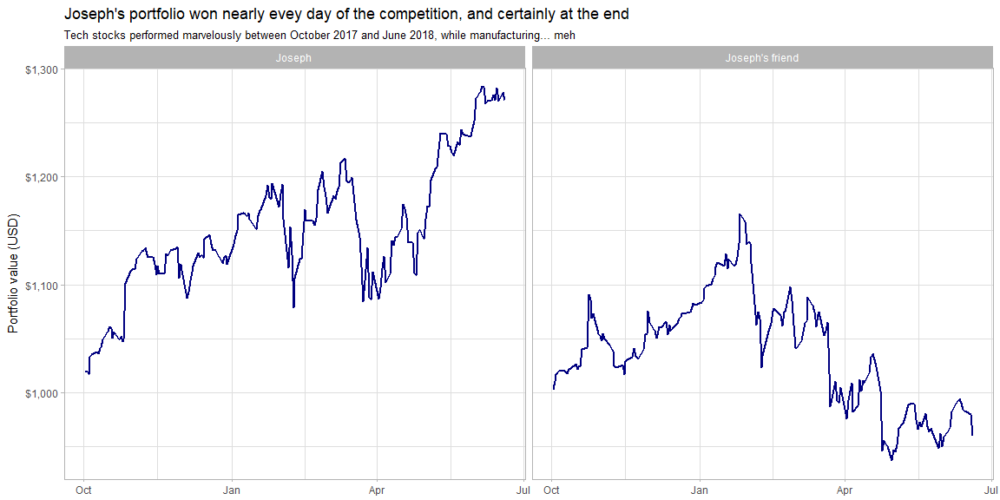
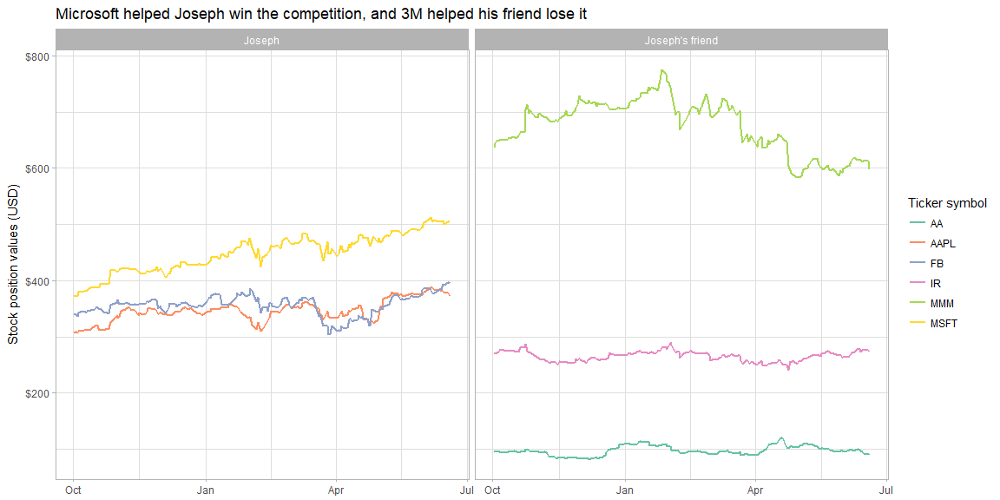

## Who won the contest?

My friend picked excellent stocks in the manufacturing area. He was thinking in the long term. I picked tech stocks that would probably see a good jump in a short time, since that was the point of the competition.

I did very well. My friend, not so much.


```r
library(tidyverse)
library(tidyquant)
library(scales)

get_stock_history <- function(ticker_symbol, num_shares_owned, owner_name) {
  tq_get(ticker_symbol, get = "stock.prices") %>%
    filter(date > ymd("2017-09-30"), date <= ymd("2018-06-19")) %>%
    mutate(
      symbol = ticker_symbol,
      shares_owned = num_shares_owned,
      value = shares_owned * close,
      owner = owner_name
    )
}

# My portfolio (tech)
aapl <- get_stock_history("AAPL", 2, "Joseph")
msft <- get_stock_history("MSFT", 5, "Joseph")
fb <- get_stock_history("FB", 2, "Joseph")

my_portfolio <- rbind(aapl, msft, fb)

# My evil friend whom I plan to beat's porfolio (manufacturing)
mmm <- get_stock_history("MMM", 3, "Joseph's friend")
ir <- get_stock_history("IR", 3, "Joseph's friend")
aa <- get_stock_history("AA", 2, "Joseph's friend")

enemy_portfolio <- rbind(mmm, ir, aa)

# Bind both portfolios
portfolios <- rbind(my_portfolio, enemy_portfolio)


# Plot the porfolio values
portfolios %>%
  group_by(date, owner) %>%
  summarise(portfolio_value = sum(value)) %>%
  ggplot(aes(date, portfolio_value)) +
  geom_line(size = 1, color = "#000080") +
  facet_wrap(~ owner, ncol = 2) +
  labs(
    title = "Joseph's portfolio won nearly evey day of the competition, and certainly at the end",
    subtitle = "Tech stocks performed marvelously between October 2017 and June 2018, while manufacturing... meh",
    x = NULL,
    y = "Portfolio value (USD)"
  ) +
  scale_y_continuous(labels = dollar_format(prefix = "$")) +
  theme_light()
```

<!-- -->

```r
# Plot the individual stock values
portfolios %>%
  ggplot(aes(date, value, color = symbol)) +
  geom_line(size = 1) +
  facet_wrap(~ owner, ncol = 2) +
  labs(
    title = "Microsoft helped Joseph win the competition, and 3M helped his friend lose it",
    x = NULL,
    y = "Stock position values (USD)",
    color = "Ticker symbol"
  ) +
  scale_y_continuous(labels = dollar_format(prefix = "$")) +
  scale_color_brewer(palette = "Set2") +
  theme_light()
```

<!-- -->

The first plot is a summary of the daily total value of each portfolio. I started mine with $1,019.61 and he started his with $1,003.46, since the stock prices didn't exactly add up to $1,000.

The second plot shows the daily position value for each stock so we can see individual performance.
