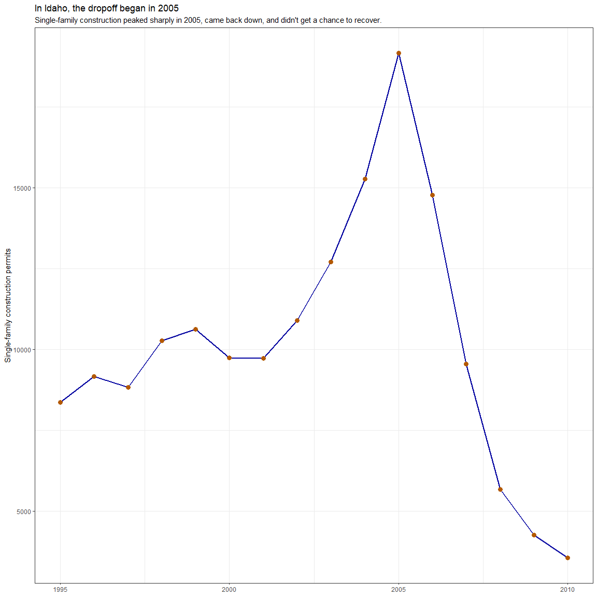

## A few related articles to remember

  * [Tidy spatial data in R: using `dplyr`, `tidyr`, and `ggplot2` with `sf`](http://strimas.com/r/tidy-sf)
  * [rnaturalearth](https://github.com/ropensci/rnaturalearth) (for plotting the whole world)
  * [geofacet](https://hafen.github.io/geofacet)

## Visualizing the mortgage crisis


```r
library(tidyverse)
library(buildings)
library(USAboundaries)

states_fp_numeric <- us_states() %>%
  filter(jurisdiction_type != "territory") %>%
  mutate(state = as.numeric(statefp))

single_fam_permits <- permits %>%
  filter(variable == "Single Family", year >= 2002) %>%
  group_by(state, year) %>%
  summarise(num_permits = sum(value)) %>%
  left_join(states_fp_numeric, by = "state")

idaho_permits <- permits %>%
  filter(StateAbbr == "ID", variable == "Single Family", year >= 1995) %>%
  left_join(states_fp_numeric, by = "state") %>%
  group_by(year) %>%
  summarise(num_permits = sum(value))

# May or may not get used in the geographic US plot
state_boundaries <- us_states() %>%
  filter(name != "Puerto Rico", name != "District of Columbia")
```

### Faceted change in construction by state

A crisp, concise way to show the construction dropoff in each state without overwhelming the eye. May require some explanation for the readers, but once they get it, they'll love it.


```r
library(tidyverse)
library(viridis)
library(geofacet)
library(sf)
library(scales)

single_fam_permits %>%
  ggplot(aes(year, num_permits)) +
  geom_rect(
    aes(xmin = 2008, xmax = 2009, ymin = 0, ymax = Inf),
    fill = "#f08080",
    alpha = 0.05
  ) +
  geom_line(size = 1, color = "#0000a0") +
  scale_x_continuous(labels = function(year) substr(year, 3, 4)) +
  scale_y_continuous(trans = "log10", labels = comma) +
  labs(
    title = "Number of single-family building permits issued per state per year, 2002-2010",
    subtitle = paste(
      "Years at the height of the recession highlighted in red.",
      "Y-axis shown on a logarithmic scale to normalize states; otherwise, the 2007-2008 dropoff would look even more dramatic.",
      sep = "\n"
    ),
    x = "Year",
    y = "Single-family permits issued"
  ) +
  facet_geo(~ state_name, grid = "us_state_grid2") +
  theme_bw()
```

<!-- -->

### Change in construction across years in the US

This chart shows the collapse as a gradual darkening of the land. Just another way to visualize the dropoff, complementary to the chart above, which is, in my opinion, more revealing.


```r
# Do people have ideas on how to get PR off the map and plot a map with a projection?
# And how to show the change across states in a more distinctive way?
ggplot() +
  #geom_sf(data = state_boundaries) +
  geom_sf(
    aes(fill = log10(num_permits) * 40000),
    data = single_fam_permits
  ) +
  scale_fill_viridis("Permits\n(log 10)", option = "cividis") +
  coord_sf(crs = 102003) +
  labs(
    title = "Evolution of single-family building construction over time",
    subtitle = "The map gets darker after 2007."
  ) +
  facet_wrap(~ year, ncol = 3) +
  theme_bw()
```

<!-- -->

### Idaho construction history

There is no better visualization for looking at historical shape of construction data than the line chart. A colored map wouldn't do this data justice.


```r
idaho_permits %>%
  ggplot(aes(year, num_permits)) +
  geom_line(color = "#0000a0", size = 1) +
  geom_point(color = "#b35900", size = 3) +
  labs(
    title = "In Idaho, the dropoff began in 2005",
    subtitle = "Single-family construction peaked sharply in 2005, came back down, and didn't get a chance to recover.",
    x = NULL,
    y = "Single-family construction permits"
  ) +
  theme_bw()
```

<!-- -->
