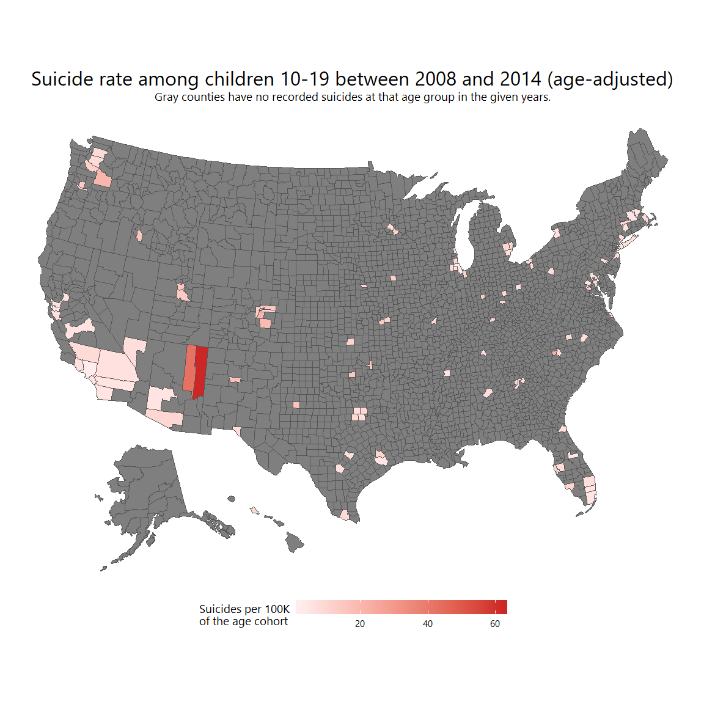
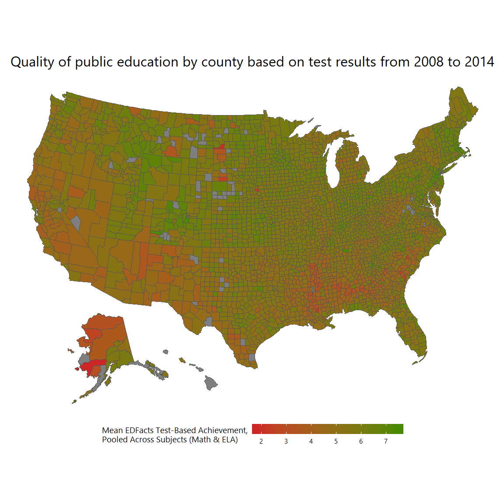
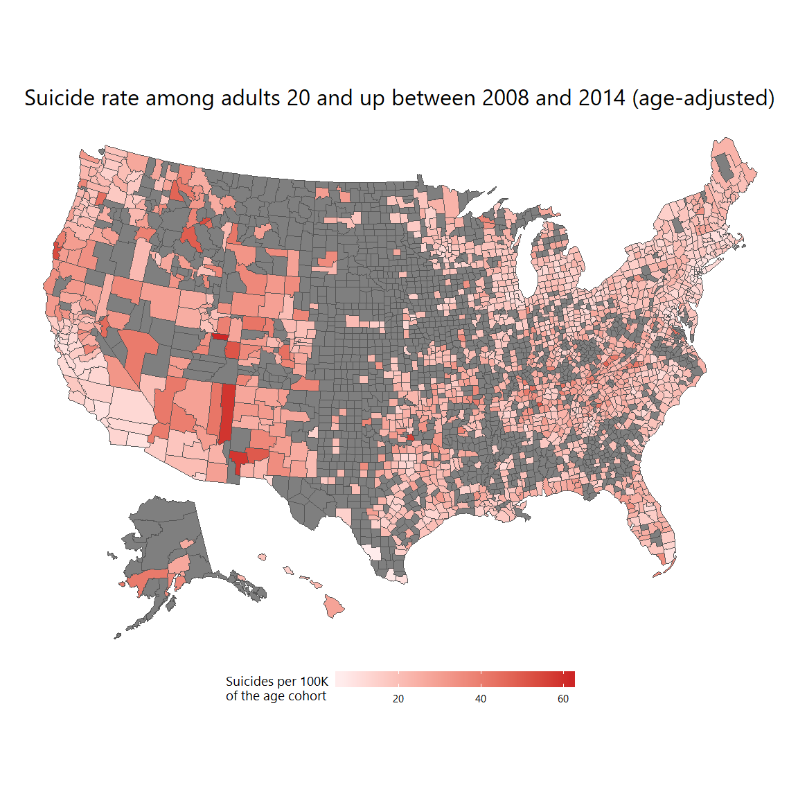
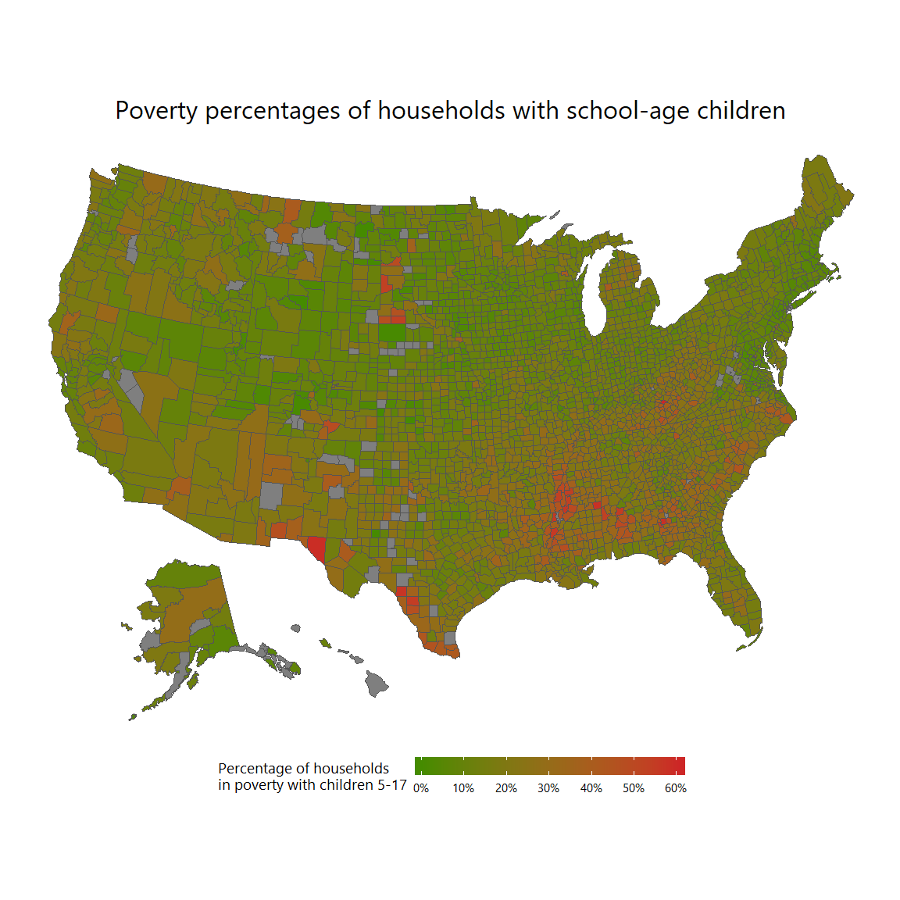
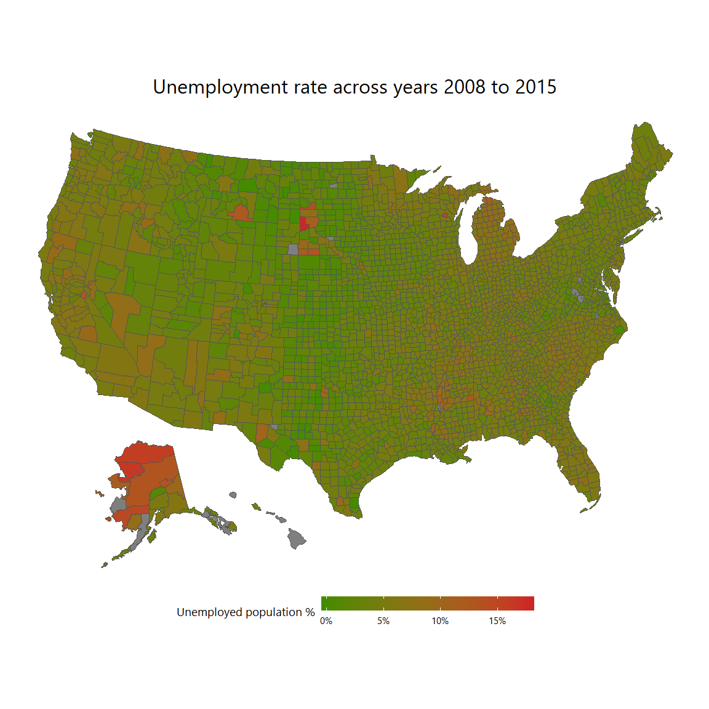
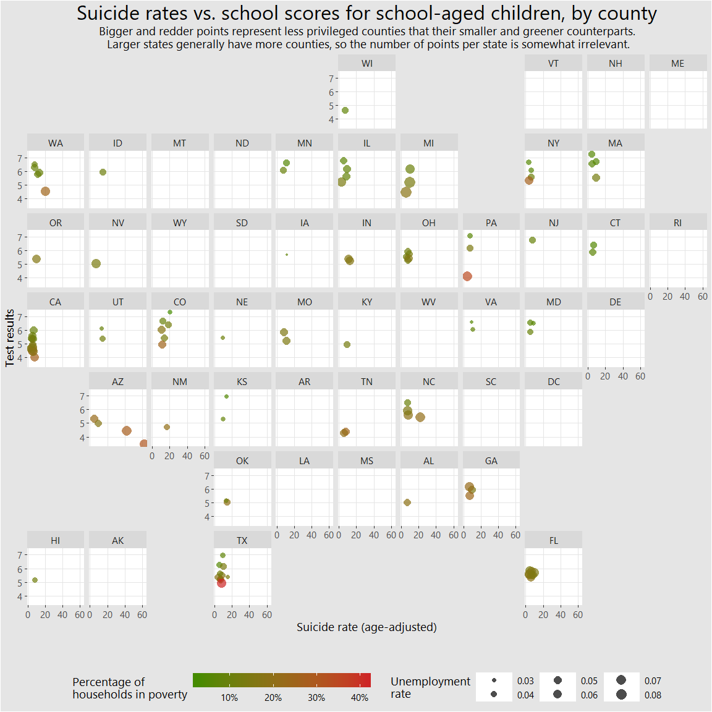

```r
library(tidyverse)
library(stringr)
library(tools)
library(USAboundaries)

# Sean F. Reardon, Andrew D. Ho., Benjamin R. Shear, Erin M. Fahle, Demetra Kalogrides,
# & Richard DiSalvo. (2018). Stanford Education Data Archive (Version 2.1).
# http://purl.stanford.edu/db586ns4974.

education_results <- read_csv(
    file.path(
      "C:", "Users", "joebo", "Documents", "Math335", "M335_Borjon_Joseph",
      "data", "Semester_Project", "SEDA_county_pool_GCS_v21.csv"
    )
  ) %>%
  mutate(
    countyname = countyname %>%
      str_replace(  ## remove all suffixes, which don't appear in the suicides data
        " COUNTY$| BOROUGH$| CENSUS AREA$| CITY$| CITY AND BOROUGH$| MUNICIPALITY$| PARISH$",
        ""
      ) %>%
      tolower() %>%
      toTitleCase(),
    countyid = as.numeric(str_sub(countyid, 3, 5)),
    fips = as.numeric(fips)
  ) %>%
  filter(subgroup == "all")


# Covariate data for the education dataset
education_covariate <- read_csv(
    file.path(
      "C:", "Users", "joebo", "Documents", "Math335", "M335_Borjon_Joseph",
      "data", "Semester_Project", "SEDA_cov_geodist_pool_v21.csv"
    )
  ) %>%
  mutate(
    countyid = as.numeric(str_sub(countyid, 3, 5)),
    fips = as.numeric(fips)
  ) %>%
  filter(!is.na(countyid)) %>%
  select(countyid, fips, urban:seshsp) %>%
  group_by(fips, countyid) %>%
  summarise_at(vars(urban:seshsp), mean, na.rm = TRUE) %>%
  ungroup()
```


```r
library(tidyverse)

# Get the 2-digit state FIPS code as text
get_state_fips <- function(state_fips) {
  if (state_fips < 10) {
    state_fips <- paste("0", state_fips, sep = "")
  } else {
    as.character(state_fips)
  }
}


# Get the 3-digit county FIPS code as text
get_county_fips <- function(county_fips) {
  if (county_fips < 10) {
    county_fips <- paste("00", county_fips, sep = "")
  } else if (county_fips < 100) {
    county_fips <- paste("0", county_fips, sep = "")
  } else {
    as.character(county_fips)
  }
}

# Vectorize the functions above
get_state_fips <- Vectorize(get_state_fips)
get_county_fips <- Vectorize(get_county_fips)


# Read the RDS suicide file
suicide_data_file <- file.path(
  "C:", "Users", "joebo", "Documents", "Math335", "M335_Borjon_Joseph",
  "data", "Semester_Project", "us-suicide-data.Rds"
)

suicide_data <- read_rds(suicide_data_file)


# Read the subset file of suicides between 10 and 14 years old
suicide_data_file <- file.path(
  "C:", "Users", "joebo", "Documents", "Math335", "M335_Borjon_Joseph",
  "data", "Semester_Project", "all-suicides-10-14.Rds"
)

all_suicides_10_14 <- read_rds(suicide_data_file)


# County data
us_counties <- all_suicides_10_14 %>%
  select(1:4) %>%
  mutate(
    statefipschar = get_state_fips(StateFIPS),
    countyfipschar = get_county_fips(CountyFIPS),
    county_5_digit_fips = paste(statefipschar, countyfipschar, sep = "")
  )


# Socioeconomic data
counties_socioeco <- us_counties %>%
  left_join(education_covariate, by = c("StateFIPS" = "fips", "CountyFIPS" = "countyid"))


# Suicide data for all races between ages 10 and 19
counties_suicide_all <- suicide_data %>%
  filter(
    AgeStart >= 10,
    AgeEnd <= 19,
    Race == "All",
    Sex == "Both",
    is.na(HispanicOrigin),
    !is.na(U_A_Rate),
    !is.na(U_C_Rate)
  ) %>%
  group_by(StateFIPS, CountyFIPS) %>%
  summarise(
    TotalDeaths = sum(Deaths),
    AvgCrudeRate = mean(U_C_Rate),
    AvgAdjustedRate = mean(U_A_Rate)
  ) %>%
  ungroup() %>%
  left_join(us_counties, by = c("StateFIPS", "CountyFIPS"))


# Suicide data for everyone 20 and up
counties_suicide_20_up <- suicide_data %>%
  filter(
    AgeStart >= 20,
    Race == "All",
    Sex == "Both",
    is.na(HispanicOrigin),
    !is.na(U_A_Rate),
    !is.na(U_C_Rate)
  ) %>%
  group_by(StateFIPS, CountyFIPS) %>%
  summarise(
    TotalDeaths = sum(Deaths),
    AvgCrudeRate = mean(U_C_Rate),
    AvgAdjustedRate = mean(U_A_Rate)
  ) %>%
  ungroup() %>%
  left_join(us_counties, by = c("StateFIPS", "CountyFIPS"))


# Education test results per county
counties_ed_results <- education_results %>%
  left_join(us_counties, by = c("fips" = "StateFIPS", "countyid" = "CountyFIPS"))
```


```r
library(tidyverse)
library(usmap)
library(geofacet)
library(ggthemes)
library(scales)
library(extrafont)


# Create the spatial plots
plot_spatial <- function(
  df,
  colname,
  plot_title,
  plot_legend,
  legend_scale = waiver(),
  legend_colors = c("#458b00", "#cd2626"),
  plot_subtitle = NULL
  ) {
  # Ply the data
  df <- df %>%
    select(
      fips = county_5_digit_fips,
      matches(colname)
    )

  # Plot
  plot_usmap(
      data = df,
      values = colname,
      regions = "counties",
      lines = "#555555",
      theme = theme_gray()
    ) +
    labs(
      title = plot_title,
      subtitle = plot_subtitle,
      fill = plot_legend
    ) +
    scale_fill_gradient(
      low = legend_colors[[1]],
      high = legend_colors[[2]],
      labels = legend_scale
    ) +
    theme(
      text = element_text(size = 14, family = "Segoe UI"),
      plot.title = element_text(size = 24, hjust = 0.5),
      plot.subtitle = element_text(hjust = 0.5),
      panel.background = element_blank(),
      axis.title = element_blank(),
      axis.text = element_blank(),
      axis.ticks = element_blank(),
      legend.position = "bottom",
      legend.box.spacing = unit(0, "mm"),
      legend.key.width = unit(0.06, "npc")
    )
}
```


## Introduction

Does the quality of public education affect the rate at which students commit suicide? If not, what other variables could be at play?

To explore potential answers to those questions, let's examine the data provided by the Stanford Center for Education Policy Analysis against suicide data from the CDC.

Test scores from the EdFacts federal initiative are used as proxy for public education quality. The Standford dataset included some county socioeconomic data, which will likewise be used. The CDC data includes only counts of completed, not attempted, suicides per county. How many attempted suicides resulted in non-death is unknown. No known suicides were committed in the United States under the age of 10, according to the data.

Data are averaged across years to facilitate visualization, since the exploration focuses on long-term trends. A more granular analysis including time-series visualizations and other data, possibly encompassing weather and additional socioeconomic factors, is a project for a future time; after all, there are only so many days in one semester.

To see a summary plot of all the used variables, see near the end.


## So, what's the answer?

Seeing the counties where school-age children committed suicide, at at what rates, should begin to answer the question:


```r
plot_spatial(
  counties_suicide_all,
  "AvgAdjustedRate",
  "Suicide rate among children 10-19 between 2008 and 2014 (age-adjusted)",
  "Suicides per 100K\nof the age cohort",
  legend_colors = c("#ffecec", "#cd2626"),
  plot_subtitle = "Gray counties have no recorded suicides at that age group in the given years."
)
```

<!-- -->


And this is how schools fared in terms of quality:


```r
plot_spatial(
  counties_ed_results,
  "mn_avg_ol",
  "Quality of public education by county based on test results from 2008 to 2014",
  "Mean EDFacts Test-Based Achievement,\nPooled Across Subjects (Math & ELA)",
  legend_colors = c("#cd2626", "#458b00")
)
```

<!-- -->


The South and Southwest seem to have the lowest achievement scores. While the distribution and rates of adult suicides seem to follow a similar trend (which could be due to any number of confounding variables), the corresponding variables for school-age children do not strongly follow the same pattern. There are notable exceptions in Florida and two counties in northeast Arizona, and there *are* more filled counties in and around the South and Southwest than anywhere else.

For comparison, the 20-and-above group (a much larger cohort, and therefore much more widespread) committed suicide in the following locations:


```r
plot_spatial(
  counties_suicide_20_up,
  "AvgAdjustedRate",
  "Suicide rate among adults 20 and up between 2008 and 2014 (age-adjusted)",
  "Suicides per 100K\nof the age cohort",
  legend_colors = c("#ffecec", "#cd2626")
)
```

<!-- -->


Notice that, at first glance, it appears that older people commit suicide at higher rates than school-age children, but, in general, the difference is not abysmal.


## What other variables could be at play, then?

I'm glad you asked. Two variables that come to mind, and are serendipitously provided by Stanford, are poverty and unemployment.

Starting with poverty:


```r
plot_spatial(
  counties_socioeco,
  "poverty517_all",
  "Poverty percentages of households with school-age children",
  "Percentage of households\nin poverty with children 5-17",
  scales::percent
)
```

<!-- -->


From the data, there is no way to know how far below the poverty line the households in question are. All we know is the percentage of households that fall below the line, which should be a good-enough measure.


Now, onto unemployment:


```r
plot_spatial(
  counties_socioeco,
  "unemp_all",
  "Unemployment rate across years 2008 to 2015",
  "Unemployed population %",
  scales::percent
)
```

<!-- -->


Again, the South and Southwest have the least to boast about regarding children household poverty and unemployment.

Notice the strip of lower suicide rates running roughly down the Midwest, from North Dakota to Texas. That same area has higher employment rates. Anecdotally, the Midwest has a relatively low-stress lifestyle and large areas that are free of visual clutter and full of nature. Even Omaha, a large city, has decent traffic. And there is a large religious influence in the area, from what I hear; people of faith with less hipocrisy than in, shall we say, other places.


## Can we see how these variables are interrelated? It's hard to keep scrolling up and down

Sure. Here you go:


```r
counties_suicide_all %>%
  select(AvgAdjustedRate, county_5_digit_fips) %>%
  left_join(counties_ed_results, by = "county_5_digit_fips") %>%
  select(mn_avg_ol, AvgAdjustedRate, county_5_digit_fips) %>%
  left_join(
    counties_socioeco %>%
      select(ST, unemp_all, poverty517_all, county_5_digit_fips),
    by = "county_5_digit_fips"
  ) %>%
  
  ggplot(aes(AvgAdjustedRate, mn_avg_ol)) +
  geom_jitter(
    aes(size = unemp_all, color = poverty517_all),
    alpha = 0.7,
    shape = 16
  ) +
  labs(
    title = "Suicide rates vs. school scores for school-aged children, by county",
    subtitle = paste(
      "Bigger and redder points represent less privileged counties",
      "that their smaller and greener counterparts.\n",
      "Larger states generally have more counties, so the number",
      "of points per state is somewhat irrelevant."
    ),
    x = "Suicide rate (age-adjusted)",
    y = "Test results",
    size = "Unemployment\nrate",
    color = "Percentage of\nhouseholds in poverty"
  ) +
  scale_color_gradient(low = "#458b00", high = "#cd2626", labels = scales::percent) +
  facet_geo(~ ST) +
  theme_igray() +
  theme(
    text = element_text(size = 14, family = "Segoe UI"),
    plot.title = element_text(size = 24, hjust = 0.5),
    plot.subtitle = element_text(hjust = 0.5),
    legend.key.width = unit(0.05, "npc"),
    legend.position = "bottom",
    legend.box.spacing = unit(0.05, "npc")
  )
```

<!-- -->


By looking at states with higher point counts (such as California, Texas, Colorado, and North Carolina), it is quite evident that poverty and unemployment tend to be higher at the lower part of the facet, where test results are lower. However, increase of suicide rates happens inconsistenly, not necessarily at the bottom, with Arizona, again, as a notable exception.


## Conclusion

Rather than trying to figure out which one, if any, of these variables causes the others (which is likely impossible to know for certain, as I learned in my anthropology studies), it is more astute to conclude that quality of education, poverty, and unemployment are interrelated variables that feed each other. Causes may be historical, geographical, geopolitical, psychological, and so forth, but seeing correlations can be invaluable indeed.

In other words, there is no conclusive evidence that quality of education in terms of scores influences suicide rates among children, but other factors may: diet, altitude, depression rates, lifestyle, parental stress, level of career demands, traffic, etc. Unemployment level does seem to be highly correlated.

Other school-related variables, unavailable at present, may indeed affect students' suicide rates: quality of administration, presence and quality of organizational support systems for students, cognitive disability rates, etc.

While we don't have all the answers, we do need to understand that each suicide is a valuable life ended, and that we need to do all we can at the personal, family, intitution, and government levels to help reduce suicide rates throughout the United States and the world. Each life counts.


## Sources

  * [CDC WISQARS](https://wisqars.cdc.gov:8443/cdcMapFramework/mapModuleInterface.jsp)

  * Sean F. Reardon, Andrew D. Ho., Benjamin R. Shear, Erin M. Fahle, Demetra Kalogrides, & Richard DiSalvo. (2018). Stanford Education Data Archive (Version 2.1). http://purl.stanford.edu/db586ns4974.
